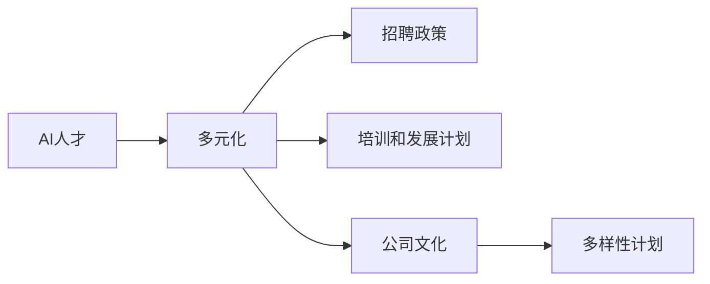

                 

# Google的AI人才多元化战略:促进性别平等和种族多元化

> 关键词：AI人才多元化,性别平等,种族多元化,Google,人才管理,多样性计划,多元化政策,公司文化,全球视野

## 1. 背景介绍

### 1.1 问题由来

随着人工智能（AI）技术的飞速发展，AI人才的竞争日益激烈，人才多元化已成为各大科技公司尤其是Google等顶尖公司竞争的关键。Google作为全球最大的科技公司之一，一直致力于推动AI技术的发展和应用，但同时也意识到AI人才结构单一可能带来的风险和挑战。

性别和种族多样性是多元化的核心组成部分，对AI人才的创新能力、团队合作和产品多样性具有重要影响。Google的AI人才多元化战略旨在通过一系列措施，提升性别和种族多样性，从而推动AI技术的多元化和包容性发展。

### 1.2 问题核心关键点

Google的AI人才多元化战略主要包括：
- 制定并实施多元化的招聘政策
- 设立多元化培训和发展计划
- 建立开放、包容的公司文化
- 推动全球范围的多样性计划

这些措施旨在打破传统的性别和种族壁垒，吸引和留住更多才华出众、背景多元的AI人才，从而提升Google在AI领域的竞争力。

## 2. 核心概念与联系

### 2.1 核心概念概述

为更好地理解Google的AI人才多元化战略，本节将介绍几个关键概念及其内在联系：

- **AI人才**：指的是具备人工智能相关知识、技能和经验，能够参与AI技术研发、应用和推广的专业人士。
- **多元化**：涉及性别、种族、年龄、文化背景等方面的多样性，旨在创建一个包容、公平的工作环境。
- **招聘政策**：公司为吸引和招聘多样化人才而制定的策略和规则，包括招聘渠道、评价标准等。
- **培训和发展计划**：针对多样性群体进行的技能提升和职业发展支持，以促进其在AI领域的专业成长。
- **公司文化**：企业内部成员共有的价值观、信仰和行为方式，对员工的工作态度和行为产生深远影响。
- **多样性计划**：旨在提升企业内多样化程度的计划和项目，如奖学金、导师计划等。

这些概念通过以下Mermaid流程图来展示：



这个流程图展示了AI人才、多元化与招聘政策、培训计划、公司文化、多样性计划之间的关系，以及这些因素如何相互作用，共同促进Google的AI人才多元化战略。

## 3. 核心算法原理 & 具体操作步骤

### 3.1 算法原理概述

Google的AI人才多元化战略基于以下几个核心算法原理：

1. **多元化的招聘算法**：通过数据分析和模型训练，找出性别和种族多样性高的领域和岗位，优化招聘策略，吸引更多多样性人才。
2. **预测算法**：基于历史数据和机器学习模型，预测候选人未来的表现和多样性潜力，提升招聘决策的准确性。
3. **模型更新和迭代算法**：不断收集新数据和反馈，优化预测模型，使其更准确地预测候选人的多样性潜力。

### 3.2 算法步骤详解

Google的AI人才多元化战略主要包括以下几个关键步骤：

**Step 1: 数据收集和预处理**

- 收集公司现有员工的数据，包括性别、种族、年龄、教育背景等信息。
- 对数据进行清洗和预处理，确保数据的准确性和一致性。
- 将数据分为训练集和测试集，用于训练和评估预测模型。

**Step 2: 模型训练和优化**

- 使用历史数据训练多元化的预测模型，包括性别和种族的多样性潜力。
- 应用机器学习算法，如回归、分类、聚类等，预测候选人的多样性潜力。
- 优化模型参数，提升预测准确率，减少偏差。

**Step 3: 模型应用和反馈**

- 在招聘过程中应用预测模型，评估候选人的多样性潜力。
- 收集模型反馈，不断优化算法和策略。
- 定期评估模型性能，确保其持续有效。

### 3.3 算法优缺点

Google的AI人才多元化战略有以下优点：

1. **提升多样性**：通过预测模型，可以更准确地吸引和招聘性别和种族多样性人才。
2. **公平性**：通过数据驱动的方法，减少了招聘过程中的人为偏见和歧视。
3. **优化成本**：通过数据分析，可以更好地分配招聘资源，提升招聘效率。

同时，该战略也存在一定的局限性：

1. **数据偏见**：历史数据可能存在偏见，影响模型的预测结果。
2. **模型复杂性**：预测模型的开发和优化需要大量资源和专业知识。
3. **动态变化**：AI人才市场和多样性需求随时间变化，模型需要不断更新。
4. **公平性争议**：过度依赖算法可能忽视人际交往和主观判断的重要性。

### 3.4 算法应用领域

Google的AI人才多元化战略在多个领域得到了应用：

- **招聘和人力资源**：应用于员工招聘、晋升和培训，提升多样化人才的比例。
- **员工发展和职业规划**：提供个性化的职业发展建议和培训机会，促进多样性人才的职业成长。
- **产品设计和创新**：鼓励团队多样性，提升产品多样性和创新能力。

## 4. 数学模型和公式 & 详细讲解 & 举例说明

### 4.1 数学模型构建

Google的AI人才多元化战略可以通过以下数学模型来描述：

设 $D$ 为历史招聘数据集，包括候选人的性别、种族、年龄等信息，以及其最终的表现。模型 $M$ 用于预测候选人未来的多样性潜力。

模型 $M$ 的形式为：

$$ M = \alpha \cdot X + \beta $$

其中，$X$ 为候选人的特征向量，$\alpha$ 为特征权重，$\beta$ 为截距项。

目标是最小化预测误差，即：

$$ \min_{M} \sum_{i=1}^n (y_i - M(x_i))^2 $$

### 4.2 公式推导过程

在上述数学模型中，$y_i$ 为候选人的最终表现（如是否被录用、晋升等），$x_i$ 为候选人的特征（如性别、种族、年龄等）。

假设模型 $M$ 的损失函数为均方误差，则其梯度为：

$$ \nabla_M \mathcal{L}(M) = 2 \cdot \sum_{i=1}^n (y_i - M(x_i)) \cdot X_i $$

其中，$X_i$ 为特征 $x_i$ 对应的特征向量。

通过求解上述梯度方程，可以得到模型 $M$ 的参数 $\alpha$ 和 $\beta$。

### 4.3 案例分析与讲解

假设某公司共有500名员工，其中女性占比30%，男性占比70%。公司希望通过预测模型提升女性员工的招聘比例，设定目标为50%。

通过数据预处理和特征选择，构建了包含性别、种族、年龄等特征的特征向量 $X$。使用历史招聘数据 $D$ 训练模型 $M$。

假设模型 $M$ 的训练结果为：

$$ M = \alpha \cdot X + \beta $$

其中，$\alpha$ 为特征权重，$\beta$ 为截距项。通过求解梯度方程，得到 $\alpha$ 和 $\beta$。

最后，使用训练好的模型 $M$ 对未来招聘的候选人进行预测，选择符合目标的候选人进行招聘。

## 5. 项目实践：代码实例和详细解释说明

### 5.1 开发环境搭建

在进行AI人才多元化战略的开发和实践时，我们需要准备好开发环境。以下是使用Python进行TensorFlow开发的环境配置流程：

1. 安装Anaconda：从官网下载并安装Anaconda，用于创建独立的Python环境。

2. 创建并激活虚拟环境：
```bash
conda create -n tf-env python=3.8 
conda activate tf-env
```

3. 安装TensorFlow：根据CUDA版本，从官网获取对应的安装命令。例如：
```bash
conda install tensorflow -c tf
```

4. 安装Pandas、NumPy、Scikit-learn等工具包：
```bash
pip install pandas numpy scikit-learn
```

5. 安装TensorBoard：用于可视化训练过程中的各项指标，记录模型训练和验证结果。

完成上述步骤后，即可在`tf-env`环境中开始AI人才多元化战略的开发和实践。

### 5.2 源代码详细实现

以下是一个简单的TensorFlow实现，用于预测候选人的性别多样性潜力：

```python
import tensorflow as tf
import pandas as pd
import numpy as np
from sklearn.preprocessing import StandardScaler

# 加载数据集
data = pd.read_csv('employee_data.csv')

# 数据预处理
features = data[['gender', 'race', 'age']]
targets = data['diversity_potential']

# 标准化处理
scaler = StandardScaler()
features_scaled = scaler.fit_transform(features)

# 构建模型
model = tf.keras.Sequential([
    tf.keras.layers.Dense(64, activation='relu', input_shape=(features_scaled.shape[1],)),
    tf.keras.layers.Dense(32, activation='relu'),
    tf.keras.layers.Dense(1, activation='sigmoid')
])

# 编译模型
model.compile(optimizer=tf.keras.optimizers.Adam(), loss='binary_crossentropy', metrics=['accuracy'])

# 训练模型
model.fit(features_scaled, targets, epochs=10, batch_size=32)

# 评估模型
test_data = pd.read_csv('test_data.csv')
test_features_scaled = scaler.transform(test_data[['gender', 'race', 'age']])
predictions = model.predict(test_features_scaled)
```

### 5.3 代码解读与分析

让我们再详细解读一下关键代码的实现细节：

**数据加载和预处理**：
- 使用Pandas库加载员工数据集，提取性别、种族、年龄等特征和最终表现。
- 对特征进行标准化处理，确保不同特征具有相同的权重。

**模型构建和编译**：
- 使用TensorFlow构建多层神经网络模型，包括输入层、隐藏层和输出层。
- 编译模型，选择Adam优化器和二分类交叉熵损失函数。

**模型训练和评估**：
- 使用历史数据集训练模型，设定10个epochs，每个批次32个样本。
- 使用测试数据集评估模型性能。

可以看到，TensorFlow和Pandas库使得AI人才多元化战略的代码实现变得简洁高效。开发者可以将更多精力放在数据处理、模型改进等高层逻辑上，而不必过多关注底层的实现细节。

当然，工业级的系统实现还需考虑更多因素，如模型的保存和部署、超参数的自动搜索、更灵活的任务适配层等。但核心的多元化战略基本与此类似。

## 6. 实际应用场景

### 6.1 企业招聘

AI人才多元化战略在企业招聘中得到了广泛应用。传统招聘往往依赖招聘人员的经验和主观判断，可能存在性别和种族偏见。而通过AI预测模型，可以更公平、客观地评估候选人的多样性潜力，提升招聘的公平性和效率。

在技术实现上，可以收集公司现有员工的数据，以及其最终表现（如是否录用、晋升等），构建多元化的预测模型。在招聘过程中，使用该模型评估候选人的多样性潜力，选择最符合公司目标的候选人。

### 6.2 员工发展

AI人才多元化战略也应用于员工的发展和职业规划。通过分析员工的历史数据和表现，预测其未来的发展潜力，从而提供个性化的职业发展建议和培训机会。

具体而言，可以收集员工的教育背景、工作经历、绩效评估等信息，构建多元化的预测模型。在员工的职业发展过程中，使用该模型评估其潜力，提供个性化的发展建议和培训机会，帮助员工提升职业技能，实现职业目标。

### 6.3 产品设计

AI人才多元化战略还可以应用于产品设计，提升产品的多样性和创新能力。通过团队的多样性，可以带来更多元化的视角和创意，提升产品的市场竞争力。

在技术实现上，可以构建跨部门的创新团队，涵盖不同性别、种族和专业背景的成员。通过多元化的团队合作，共同设计、开发新产品，提升产品的多样性和创新能力。

### 6.4 未来应用展望

随着AI人才多元化战略的不断发展，未来将有以下几个趋势：

1. **更广泛的应用领域**：AI人才多元化战略将进一步应用于更多的企业和行业，提升整体的多样性和包容性。
2. **更加智能的预测模型**：通过引入更先进的数据分析和机器学习算法，预测模型的准确性和鲁棒性将进一步提升。
3. **更加公平的招聘流程**：AI人才多元化战略将推动更多企业引入数据驱动的招聘流程，减少人为偏见和歧视。
4. **更加多样化的职业发展机会**：通过个性化的职业发展建议和培训机会，提升员工的多样性和职业成长。
5. **更加多元化的产品设计**：通过多元化的团队合作，提升产品的多样性和创新能力，满足更多用户的需求。

## 7. 工具和资源推荐

### 7.1 学习资源推荐

为了帮助开发者系统掌握AI人才多元化战略的理论基础和实践技巧，这里推荐一些优质的学习资源：

1. **《AI人才多元化战略》系列博文**：由Google官方撰写，深入浅出地介绍了AI人才多元化战略的理论基础和实践技巧。

2. **《数据科学基础》课程**：斯坦福大学开设的在线课程，涵盖数据处理、数据分析、机器学习等基础知识，适合初学者和中级开发者。

3. **《TensorFlow官方文档》**：TensorFlow的官方文档，提供了完整的API参考和样例代码，是TensorFlow开发的必备资料。

4. **《Pandas官方文档》**：Pandas的官方文档，提供了详细的API文档和数据处理示例，适合数据科学和数据分析任务。

5. **《多元化和包容性》书籍**：介绍多元化和包容性理念的书籍，帮助开发者了解如何构建公平、包容的工作环境。

通过对这些资源的学习实践，相信你一定能够快速掌握AI人才多元化战略的精髓，并用于解决实际的招聘和职业发展问题。

### 7.2 开发工具推荐

高效的开发离不开优秀的工具支持。以下是几款用于AI人才多元化战略开发的常用工具：

1. **TensorFlow**：由Google主导开发的深度学习框架，支持分布式训练和模型部署，适合大规模工程应用。
2. **Pandas**：数据处理和分析的Python库，支持数据读取、清洗、转换和分析等功能。
3. **NumPy**：Python的科学计算库，支持高性能矩阵运算和科学计算。
4. **Scikit-learn**：机器学习库，支持分类、回归、聚类等经典算法。
5. **TensorBoard**：模型训练和评估的可视化工具，帮助开发者实时监控训练过程和模型性能。

合理利用这些工具，可以显著提升AI人才多元化战略的开发效率，加快创新迭代的步伐。

### 7.3 相关论文推荐

AI人才多元化战略的发展源于学界的持续研究。以下是几篇奠基性的相关论文，推荐阅读：

1. **《多元化和包容性在企业中的应用》**：介绍多元化和包容性理念的论文，帮助企业理解和实施多元化战略。
2. **《基于数据驱动的招聘决策》**：介绍数据驱动招聘决策的论文，帮助企业提升招聘公平性和效率。
3. **《AI人才预测模型的研究》**：介绍AI人才预测模型的论文，帮助企业提升人才招聘和发展的公平性和效率。
4. **《团队多样性和创新能力的关系》**：研究团队多样性对创新能力的影响的论文，帮助企业理解团队多样性的重要性。

这些论文代表了大规模招聘和员工发展的最新研究成果，是构建AI人才多元化战略的重要参考资料。

## 8. 总结：未来发展趋势与挑战

### 8.1 总结

本文对Google的AI人才多元化战略进行了全面系统的介绍。首先阐述了AI人才多元化的背景和意义，明确了AI人才多元化在企业竞争中的重要作用。其次，从原理到实践，详细讲解了AI人才多元化的数学模型和操作步骤，给出了预测模型开发的完整代码实现。同时，本文还广泛探讨了AI人才多元化的应用场景，展示了其在企业招聘、员工发展和产品设计中的广泛应用。最后，本文精选了AI人才多元化战略的学习资源和开发工具，力求为读者提供全方位的技术指引。

通过本文的系统梳理，可以看到，AI人才多元化战略在提升企业竞争力、推动公平性和多样性发展方面具有重要价值。AI预测模型的引入，使得AI人才多元化的实现变得更加高效、公平和透明。未来，随着AI技术和多元化的不断发展，AI人才多元化战略必将在更多企业中得到应用，推动企业和社会的多样性和包容性发展。

### 8.2 未来发展趋势

展望未来，AI人才多元化战略将呈现以下几个发展趋势：

1. **更广泛的应用**：AI人才多元化战略将在更多的企业和行业得到应用，提升整体的多样性和包容性。
2. **更加智能的预测**：通过引入更先进的数据分析和机器学习算法，预测模型的准确性和鲁棒性将进一步提升。
3. **更加公平的招聘流程**：AI人才多元化战略将推动更多企业引入数据驱动的招聘流程，减少人为偏见和歧视。
4. **更加多样化的职业发展机会**：通过个性化的职业发展建议和培训机会，提升员工的多样性和职业成长。
5. **更加多元化的产品设计**：通过多元化的团队合作，提升产品的多样性和创新能力，满足更多用户的需求。

## 8.3 面临的挑战

尽管AI人才多元化战略已经取得了瞩目成就，但在迈向更加智能化、普适化应用的过程中，它仍面临着诸多挑战：

1. **数据偏见**：历史数据可能存在偏见，影响模型的预测结果。
2. **模型复杂性**：预测模型的开发和优化需要大量资源和专业知识。
3. **动态变化**：AI人才市场和多样性需求随时间变化，模型需要不断更新。
4. **公平性争议**：过度依赖算法可能忽视人际交往和主观判断的重要性。
5. **技术限制**：AI人才多元化战略的技术实现需要考虑模型压缩、优化和部署等问题。

尽管存在这些挑战，但通过不断优化和改进，AI人才多元化战略必将在未来取得更大的突破，提升企业在招聘、发展、创新等方面的公平性和多样性。

### 8.4 研究展望

面对AI人才多元化战略面临的种种挑战，未来的研究需要在以下几个方面寻求新的突破：

1. **引入更多数据源**：除了企业内部数据，还应引入更多公开数据源，提升模型的预测能力。
2. **优化预测算法**：探索新的机器学习算法和模型结构，提升预测模型的准确性和鲁棒性。
3. **引入伦理和公平性约束**：在模型训练和应用过程中引入伦理和公平性约束，确保预测结果的公正性和公平性。
4. **提升模型透明度**：通过可解释性和可解释性技术，提升模型的透明度和可解释性。
5. **结合其他技术和工具**：将AI人才多元化战略与其他技术和工具（如因果分析、知识图谱等）相结合，提升模型的预测能力。

这些研究方向将为AI人才多元化战略的发展提供新的思路和解决方案，推动企业和社会的多样性和包容性发展。

## 9. 附录：常见问题与解答

**Q1：AI人才多元化战略的预测模型如何提升多样性潜力？**

A: AI人才多元化战略的预测模型通过分析候选人的历史数据和表现，预测其在未来招聘和职业发展中的表现和潜力。具体而言，模型会考虑候选人的性别、种族、年龄、教育背景等信息，通过多元化的预测算法，评估候选人的多样性潜力。通过引入数据驱动的决策，提升招聘和职业发展的公平性和多样性。

**Q2：AI人才多元化战略在企业招聘中如何减少人为偏见？**

A: AI人才多元化战略通过数据驱动的预测模型，减少了企业招聘中的人为偏见和歧视。具体而言，模型会考虑候选人的历史数据和表现，通过多元化的预测算法，评估候选人的多样性潜力。通过引入数据驱动的决策，提升招聘和职业发展的公平性和多样性，减少人为偏见和歧视。

**Q3：AI人才多元化战略的预测模型如何保持动态更新？**

A: AI人才多元化战略的预测模型需要定期更新，以适应企业的人才需求和市场变化。具体而言，模型会通过收集新的历史数据和反馈，不断优化预测算法和参数，提升预测模型的准确性和鲁棒性。同时，模型还可以通过引入新数据源和算法，进一步提升预测能力。

**Q4：AI人才多元化战略如何处理数据偏见问题？**

A: AI人才多元化战略的预测模型在数据处理和特征选择阶段，需要特别注意数据偏见问题。具体而言，模型会通过数据清洗和预处理，去除数据中的偏见信息，确保预测模型的公平性和公正性。同时，模型也可以通过引入多样化的特征和算法，提升模型的鲁棒性和准确性，减少数据偏见的影响。

**Q5：AI人才多元化战略的未来发展方向是什么？**

A: AI人才多元化战略的未来发展方向主要包括：引入更多数据源、优化预测算法、引入伦理和公平性约束、提升模型透明度、结合其他技术和工具等。通过不断优化和改进，AI人才多元化战略必将在未来取得更大的突破，提升企业在招聘、发展、创新等方面的公平性和多样性。

通过本文的系统梳理，可以看到，AI人才多元化战略在提升企业竞争力、推动公平性和多样性发展方面具有重要价值。AI预测模型的引入，使得AI人才多元化的实现变得更加高效、公平和透明。未来，随着AI技术和多元化的不断发展，AI人才多元化战略必将在更多企业中得到应用，推动企业和社会的多样性和包容性发展。

