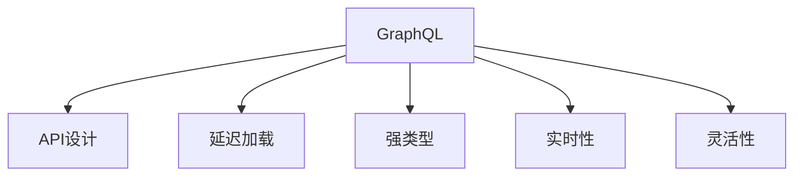

                 

# GraphQL API设计：灵活高效的数据查询语言

> 关键词：GraphQL, API设计, 数据查询, 灵活性, 高效性, 延迟加载, 强类型, 实时性

## 1. 背景介绍

### 1.1 问题由来
在现代Web应用中，API设计已成为用户体验和系统性能的关键因素之一。传统的RESTful API虽然标准化，但功能单一，难以应对复杂的数据查询需求。GraphQL作为一种新兴的数据查询语言，以其灵活性和高效性迅速成为API设计的热门选择。GraphQL不仅支持复杂的查询操作，还能够动态地从后端获取数据，极大地提升了数据获取的灵活性和效率。

### 1.2 问题核心关键点
GraphQL的核心思想是让客户端定义数据查询的形状，而不是服务器。具体来说，客户端通过GraphQL的Schema定义接口，查询数据时根据Schema动态地向服务器请求数据。这使得GraphQL能够支持复杂的查询组合，减少网络传输，提升API性能。

GraphQL还具有以下优势：
- 强类型：保证数据结构的正确性，减少出错概率。
- 延迟加载：按需获取数据，减少数据传输量，提高性能。
- 实时性：支持实时订阅，动态更新数据。
- 灵活性：客户端可以定义任意复杂度的数据查询，增加开发效率。

这些优势使得GraphQL成为Web API设计的理想选择，尤其适用于需求多变、数据结构复杂的大型应用系统。

## 2. 核心概念与联系

### 2.1 核心概念概述

为了更好地理解GraphQL API设计，本节将介绍几个密切相关的核心概念：

- GraphQL：一种新兴的数据查询语言，支持客户端定义复杂的数据查询，并按需从后端获取数据。
- API设计：定义API接口和数据结构的过程，是Web应用开发的重要环节。
- 延迟加载：按需加载数据，减少不必要的数据传输，提高性能。
- 强类型：保证数据结构的正确性，减少出错概率。
- 实时性：支持数据实时订阅，动态更新客户端数据。
- 灵活性：客户端可以定义任意复杂度的数据查询，增加开发效率。

这些核心概念之间的逻辑关系可以通过以下Mermaid流程图来展示：



这个流程图展示了几大核心概念及其之间的关系：

1. GraphQL作为数据查询语言，通过API设计定义接口，支持延迟加载、强类型、实时性和灵活性。
2. 延迟加载减少数据传输，提升性能。
3. 强类型保证数据结构的正确性，减少出错概率。
4. 实时性支持数据动态更新，增加用户交互性。
5. 灵活性增加开发效率，减少冗余数据传输。

这些概念共同构成了GraphQL API设计的技术框架，使其能够在复杂的Web应用中发挥重要作用。

## 3. 核心算法原理 & 具体操作步骤
### 3.1 算法原理概述

GraphQL的原理基于Graph模式，每个API接口被表示为一个Graph结构，包含节点(Node)和边(Edge)。每个节点对应API的一个端点，表示一个数据结构。边表示节点之间的关系，可以是父子、兄弟、引用等。客户端通过定义Schema，动态地请求节点和边的数据，从而实现复杂的数据查询。

GraphQL的核心算法原理包括以下几个步骤：
1. 客户端通过Schema定义接口，指定需要查询的数据结构。
2. 服务器根据Schema解析客户端请求，生成查询树。
3. 查询树遍历数据库，获取指定节点和边的数据。
4. 数据传输回客户端，完成数据查询。

这种基于Schema的查询方式，使得客户端可以动态地定义复杂的数据查询，而服务器则根据Schema按需获取数据，从而减少了不必要的数据传输，提升了性能。

### 3.2 算法步骤详解

GraphQL的查询步骤主要包括以下几个关键环节：

**Step 1: 定义Schema**
Schema是GraphQL的核心，定义了API接口的查询和修改能力。Schema通常包含类型(Type)、字段(Field)、输入(Input)和子类型(Subtypes)等元素。例如：

```javascript
type Query {
    user(id: ID!): User
    users: [User]
}

type User {
    id: ID!
    name: String!
    email: String!
    friends: [Friend]!
}

type Friend {
    id: ID!
    name: String!
}
```

**Step 2: 解析客户端请求**
客户端通过GraphQL查询语言，定义要查询的数据结构。例如：

```
query {
    user(id: "1") {
        name
        email
        friends {
            name
        }
    }
}
```

这个查询请求会匹配Schema中的`user`类型，并获取`name`、`email`和`friends`字段的数据。

**Step 3: 生成查询树**
服务器根据Schema解析客户端请求，生成查询树。查询树是数据查询的逻辑结构，包含节点(Node)和边(Edge)。例如：

```
    +---------+
    |  user   |
    |---------+
    |   name  |
    |   email |
    |   +     |
    |   |     |
    |   |     |
    |   +     |
    |  friends|
    |---------+
    |   +     |
    |   |     |
    |   |     |
    |   +     |
    |  name   |
    +---------+
```

**Step 4: 查询数据库**
查询树遍历数据库，获取指定节点和边的数据。例如，上述查询树会遍历数据库中的`users`表，获取`user`的`name`、`email`和`friends`字段的数据。

**Step 5: 传输数据**
数据传输回客户端，完成数据查询。例如：

```json
{
    "user": {
        "name": "Alice",
        "email": "alice@example.com",
        "friends": [
            {
                "name": "Bob"
            }
        ]
    }
}
```

### 3.3 算法优缺点

GraphQL作为一种新兴的数据查询语言，具有以下优点：
1. 灵活性高：客户端可以动态定义复杂的数据查询，减少冗余数据传输。
2. 性能高效：按需获取数据，减少不必要的数据传输，提升性能。
3. 强类型：保证数据结构的正确性，减少出错概率。
4. 实时性：支持数据实时订阅，动态更新客户端数据。

同时，GraphQL也存在一定的局限性：
1. 学习成本高：Schema定义复杂，需要开发者对GraphQL有较深的理解。
2. 适应性差：对于某些简单或固定的数据查询，GraphQL的优势不显著。
3. 复杂度增加：Schema定义过于复杂时，可能会影响开发效率。
4. 安全性问题：GraphQL接口设计不当，可能导致安全漏洞。

尽管存在这些局限性，但就目前而言，GraphQL在Web API设计中已经得到了广泛的应用，成为NLP技术落地应用的重要手段。

### 3.4 算法应用领域

GraphQL在Web API设计中已经得到了广泛的应用，覆盖了几乎所有常见场景，例如：

- 电商应用：查询商品信息、订单详情、用户评价等。
- 社交平台：获取用户信息、动态消息、好友关系等。
- 内容管理系统：查询文章、评论、标签等。
- 数据可视化：查询图表数据、数据集信息等。
- 物联网设备：查询设备状态、日志信息、配置信息等。

除了上述这些经典场景外，GraphQL还被创新性地应用到更多场景中，如数据仓库查询、API网关、大数据处理等，为Web应用提供了新的数据获取方式。

## 4. 数学模型和公式 & 详细讲解 & 举例说明

### 4.1 数学模型构建

GraphQL的数学模型主要基于图论和数据库查询理论，用于描述API接口的查询结构和数据模型。GraphQL的Schema通常包含以下几种元素：

- 类型(Type)：定义数据结构的类型，如字符串、数字、数组等。
- 字段(Field)：定义类型中的字段，如`name`、`email`等。
- 输入(Input)：定义字段接受的输入参数。
- 子类型(Subtypes)：定义类型之间的关系，如`User`和`Friend`之间的关系。

GraphQL的查询语言基于Schema定义，使用JSON格式表示。查询结果也以JSON格式返回。

### 4.2 公式推导过程

GraphQL的查询过程可以通过以下公式来表示：

$$
Q = \bigcup_{F \in S} \{ q_F \mid F \in query \wedge q_F \in queryGraph(F) \}
$$

其中，$S$表示Schema中定义的所有类型(Type)，$F$表示类型中的字段(Field)，$Q$表示所有查询字段(Fields)的并集，$query$表示客户端请求的查询字段，$queryGraph(F)$表示字段$F$的查询图。

### 4.3 案例分析与讲解

以一个简单的电商API为例，分析GraphQL查询的过程。假设有一个`Products`类型，包含`id`、`name`、`price`和`quantity`等字段：

```javascript
type Product {
    id: ID!
    name: String!
    price: Float!
    quantity: Int!
}
```

客户端发送如下查询请求：

```json
{
    products {
        id
        name
        price
        quantity
        category {
            name
        }
        reviews {
            rating
            comment
        }
    }
}
```

这个查询请求会匹配Schema中的`Products`类型，并获取`id`、`name`、`price`、`quantity`、`category.name`和`reviews.rating`、`reviews.comment`字段的数据。

查询过程可以分解为以下步骤：
1. 客户端发送请求，解析Schema中的`Products`类型，生成查询树。
2. 查询树遍历数据库，获取指定字段的数据。
3. 查询树继续遍历`category`和`reviews`的子类型，获取子类型中的字段数据。
4. 数据传输回客户端，完成数据查询。

## 5. 项目实践：代码实例和详细解释说明

### 5.1 开发环境搭建

在进行GraphQL项目实践前，我们需要准备好开发环境。以下是使用Node.js和Apollo Server搭建GraphQL项目的环境配置流程：

1. 安装Node.js：从官网下载并安装Node.js，用于运行JavaScript代码。

2. 安装Apollo Server：
```bash
npm install apollo-server graphql
```

3. 创建GraphQL Schema：
```javascript
const { ApolloServer, gql } = require('apollo-server');

const typeDefs = gql`
  type User {
    id: ID!
    name: String!
    email: String!
    friends: [Friend]!
  }

  type Friend {
    id: ID!
    name: String!
  }

  type Query {
    user(id: ID!): User
    users: [User]
  }

  type Mutation {
    addUser(name: String!, email: String!, friends: [Friend]): User
  }
`;

const resolvers = {
  Query: {
    users: async () => {
      // 从数据库获取所有用户数据
      const users = await db.query('SELECT * FROM users');
      return users;
    },
    user: async (_, { id }) => {
      // 从数据库获取指定用户数据
      const user = await db.query('SELECT * FROM users WHERE id = $1', [id]);
      return user;
    },
  },
  Mutation: {
    addUser: async (_, { name, email, friends }) => {
      // 向数据库插入新用户数据
      const user = await db.insert('users', { name, email, friends });
      return user;
    },
  },
};

const server = new ApolloServer({ typeDefs, resolvers });

server.listen().then(({ url }) => {
  console.log(`🚀 Server ready at ${url}`);
});
```

完成上述步骤后，即可在本地启动GraphQL服务器。

### 5.2 源代码详细实现

下面我们以电商应用为例，给出使用Apollo Server实现GraphQL查询的代码实现。

首先，定义GraphQL Schema：

```javascript
const { ApolloServer, gql } = require('apollo-server');

const typeDefs = gql`
  type Product {
    id: ID!
    name: String!
    price: Float!
    quantity: Int!
  }

  type Category {
    id: ID!
    name: String!
    products: [Product]!
  }

  type Query {
    products: [Product]
    product(id: ID!): Product
    categories: [Category]
  }

  type Mutation {
    addProduct(name: String!, price: Float!, quantity: Int!, category_id: ID!): Product
  }
`;

const resolvers = {
  Query: {
    products: async () => {
      // 从数据库获取所有产品数据
      const products = await db.query('SELECT * FROM products');
      return products;
    },
    product: async (_, { id }) => {
      // 从数据库获取指定产品数据
      const product = await db.query('SELECT * FROM products WHERE id = $1', [id]);
      return product;
    },
    categories: async () => {
      // 从数据库获取所有类别数据
      const categories = await db.query('SELECT * FROM categories');
      return categories;
    },
  },
  Mutation: {
    addProduct: async (_, { name, price, quantity, category_id }) => {
      // 向数据库插入新产品数据
      const product = await db.insert('products', { name, price, quantity, category_id });
      return product;
    },
  },
};

const server = new ApolloServer({ typeDefs, resolvers });

server.listen().then(({ url }) => {
  console.log(`🚀 Server ready at ${url}`);
});
```

然后，定义GraphQL查询：

```json
query {
  products {
    id
    name
    price
    quantity
    category {
      name
    }
    reviews {
      rating
      comment
    }
  }
}
```

这个查询请求会匹配Schema中的`products`类型，并获取`id`、`name`、`price`、`quantity`、`category.name`和`reviews.rating`、`reviews.comment`字段的数据。

最后，启动GraphQL服务器，测试查询结果：

```javascript
const { ApolloClient } = require('apollo-client');
const { InMemoryCache } = require('apollo-cache-inmemory');

const cache = new InMemoryCache();
const client = new ApolloClient({ cache, uri: 'http://localhost:4000/graphql' });

client.query({ query: `
  query {
    products {
      id
      name
      price
      quantity
      category {
        name
      }
      reviews {
        rating
        comment
      }
    }
  }
` }).then(result => {
  console.log(result.data);
});
```

### 5.3 代码解读与分析

让我们再详细解读一下关键代码的实现细节：

**GraphQL Schema定义**：
- `typeDefs`变量定义了GraphQL Schema，包含`Product`、`Category`、`Query`和`Mutation`四种类型。
- `Product`类型包含`id`、`name`、`price`和`quantity`等字段。
- `Category`类型包含`id`和`name`等字段。
- `Query`类型包含`products`、`product`和`categories`等查询操作。
- `Mutation`类型包含`addProduct`等修改操作。

**查询操作实现**：
- `resolvers.Query`定义了三个查询操作，分别为`products`、`product`和`categories`。
- `products`操作从数据库获取所有产品数据，返回`Product`类型的数组。
- `product`操作从数据库获取指定产品数据，返回`Product`类型的数据。
- `categories`操作从数据库获取所有类别数据，返回`Category`类型的数组。

**修改操作实现**：
- `resolvers.Mutation`定义了一个修改操作，即`addProduct`。
- `addProduct`操作向数据库插入新产品数据，返回`Product`类型的数据。

**GraphQL查询**：
- 查询语句定义了要查询的数据结构，包含`products`、`product`、`categories`和`reviews`等字段。
- `products`字段获取所有产品数据，包含`id`、`name`、`price`、`quantity`和`category.name`字段。
- `product`字段获取指定产品数据，包含`id`、`name`、`price`、`quantity`和`category.name`字段。
- `categories`字段获取所有类别数据，包含`id`和`name`字段。
- `reviews`字段获取指定产品的评论数据，包含`rating`和`comment`字段。

**查询结果**：
- 查询结果以JSON格式返回，包含所有产品数据和类别数据。
- 每个产品数据包含`id`、`name`、`price`、`quantity`和`category.name`字段。
- 每个评论数据包含`rating`和`comment`字段。

通过以上代码实例和分析，可以看到GraphQL API设计的核心思想和实现流程。

## 6. 实际应用场景
### 6.1 智能推荐系统

基于GraphQL的智能推荐系统，可以动态地获取用户的历史行为数据和偏好信息，提供个性化的推荐内容。例如，电商平台可以实时获取用户浏览、点击、收藏等行为数据，动态更新推荐结果，提升用户体验。

在技术实现上，推荐系统可以使用GraphQL查询API，获取用户的历史行为数据和推荐算法中的数据模型。例如：

```json
query {
  user(id: $user_id) {
    id
    name
    email
    friends {
      id
    }
    preferences {
      genre
      rating
    }
    products {
      id
      name
      price
      category {
        name
      }
      reviews {
        rating
        comment
      }
    }
  }
}
```

这个查询请求会获取指定用户的个人信息、好友关系、偏好信息和产品数据，用于计算推荐结果。

### 6.2 数据可视化应用

数据可视化应用需要从多个数据源获取数据，并动态更新图表数据。GraphQL API设计使得这种复杂的数据获取和动态更新变得容易实现。例如，财务报表系统可以动态地获取各部门的财务数据，实时更新图表数据。

在技术实现上，可以使用GraphQL查询API，从各个数据源获取数据。例如：

```json
query {
  department(id: $department_id) {
    name
    revenue
    expenses
    profit
    products {
      id
      name
      price
      quantity
    }
  }
}
```

这个查询请求会获取指定部门的财务数据和产品数据，用于动态更新图表数据。

### 6.3 物联网应用

物联网设备需要实时获取传感器数据和状态信息，并根据最新数据动态更新应用逻辑。GraphQL API设计使得这种实时数据获取和动态更新变得容易实现。例如，智能家居系统可以实时获取室内外环境数据，动态更新智能设备状态。

在技术实现上，可以使用GraphQL查询API，从各个数据源获取数据。例如：

```json
query {
  device(id: $device_id) {
    name
    status
    temperature
    humidity
    battery
    sensors {
      type
      data
    }
  }
}
```

这个查询请求会获取指定设备的实时数据和传感器数据，用于动态更新应用逻辑。

### 6.4 未来应用展望

随着GraphQL技术的发展，其应用领域将会更加广泛。未来，GraphQL将会在更多场景中发挥重要作用，例如：

- 企业级应用：统一企业内部数据访问接口，提升开发效率。
- 数据仓库：提供复杂的数据查询能力，支持数据仓库的数据分析和报表展示。
- 移动应用：提供轻量级的API接口，支持移动应用的快速开发和数据获取。
- 实时系统：支持实时订阅和推送，增强系统的实时性。
- 微服务架构：提供服务间的统一数据接口，支持微服务的灵活组合。

GraphQL作为一种新兴的数据查询语言，未来发展潜力巨大，必将在更多的领域发挥重要作用。

## 7. 工具和资源推荐
### 7.1 学习资源推荐

为了帮助开发者系统掌握GraphQL API设计的理论基础和实践技巧，这里推荐一些优质的学习资源：

1. GraphQL官方文档：提供了完整的GraphQL规范和API设计指南，是学习GraphQL的必备资料。
2. GraphQL教程（GraphQL.org）：提供系统化的GraphQL教程，适合初学者快速上手。
3. GraphQL进阶（scotch.io）：提供深入的GraphQL进阶教程，涵盖实际应用中的各种问题。
4. GraphQL中文社区（https://github.com/graphql-chinese/graphql-docs）：提供中文版的GraphQL文档和社区资源，方便中文开发者学习使用。
5. GraphQL Crate（https://graphql-urate.com/）：提供GraphQL生态系统的开源项目和组件，支持快速开发GraphQL应用。

通过对这些资源的学习实践，相信你一定能够快速掌握GraphQL API设计的精髓，并用于解决实际的API问题。

### 7.2 开发工具推荐

高效的开发离不开优秀的工具支持。以下是几款用于GraphQL开发的工具：

1. Apollo Server：一个基于Node.js的GraphQL服务器，支持RESTful API、WebSocket订阅和数据验证等特性。
2. GraphQL Playground：一个用于测试GraphQL API的Web UI工具，支持实时数据查询和文档生成。
3. Prisma：一个GraphQL和关系数据库的映射工具，支持数据查询和模型定义。
4. GraphQL Yoga：一个基于Express的GraphQL服务器，支持RESTful API、WebSocket订阅和数据验证等特性。
5. GraphQL Resolver：一个用于处理GraphQL查询的Node.js库，支持灵活的查询解析和数据处理。

合理利用这些工具，可以显著提升GraphQL项目的开发效率，加快创新迭代的步伐。

### 7.3 相关论文推荐

GraphQL作为新兴的数据查询语言，其理论研究和应用实践正逐步成熟。以下是几篇奠基性的相关论文，推荐阅读：

1. GraphQL: A New Way to Graph Your Data：提出GraphQL的设计理念和数据查询方式，成为GraphQL技术的基础论文。
2. GraphQL for Web APIs：探讨GraphQL在Web API设计中的应用，提出API设计的最佳实践。
3. GraphQL in Practice：介绍GraphQL的实际应用案例，涵盖电商、金融、物联网等多个领域。
4. GraphQL: A Primer：全面介绍GraphQL的技术原理和设计思想，适合初学者快速入门。
5. GraphQL: A Hosted Approach for Data Design：探讨GraphQL在数据设计和API设计中的应用，提出数据设计的最佳实践。

这些论文代表了大语言模型微调技术的发展脉络。通过学习这些前沿成果，可以帮助研究者把握学科前进方向，激发更多的创新灵感。

## 8. 总结：未来发展趋势与挑战

### 8.1 总结

本文对GraphQL API设计进行了全面系统的介绍。首先阐述了GraphQL作为数据查询语言的优势，明确了其灵活性和高效性的核心思想。其次，从原理到实践，详细讲解了GraphQL的查询过程和关键步骤，给出了GraphQL项目的代码实例和分析。同时，本文还广泛探讨了GraphQL在多个行业领域的应用前景，展示了其在实际应用中的强大能力。

通过本文的系统梳理，可以看到，GraphQL API设计已经成为Web API设计的理想选择，尤其适用于需求多变、数据结构复杂的大型应用系统。未来，随着GraphQL技术的发展，其在更多领域的应用将会更加广泛。

### 8.2 未来发展趋势

展望未来，GraphQL API设计将会呈现以下几个发展趋势：

1. 类型系统升级：未来GraphQL将引入更严格的类型系统，提供更多类型扩展和数据验证功能，进一步提升数据结构的正确性和查询的灵活性。
2. 生态系统完善：更多的GraphQL库和工具将被开发出来，涵盖更多应用场景，提供更灵活的API开发和数据查询能力。
3. 实时性增强：GraphQL支持实时订阅和推送，未来将有更多实时数据处理和应用场景出现，进一步提升系统的实时性。
4. 安全性改进：GraphQL接口设计不当可能导致安全漏洞，未来将有更多安全措施被引入，提升系统的安全性。
5. 多语言支持：GraphQL设计之初以英语为主，未来将有更多多语言支持的功能，支持更多开发者使用。

这些趋势展示了GraphQL API设计的未来发展方向，将进一步提升GraphQL在Web应用中的作用和影响力。

### 8.3 面临的挑战

尽管GraphQL API设计已经取得了显著成果，但在迈向更加智能化、普适化应用的过程中，仍面临诸多挑战：

1. 学习成本高：GraphQL接口定义复杂，需要开发者具备一定的技术水平。
2. 查询性能问题：复杂的GraphQL查询可能导致查询性能下降，需要优化查询结构和数据库设计。
3. 数据校验问题：GraphQL需要严格的数据校验和类型定义，增加开发难度。
4. 数据一致性问题：多源数据整合时，需要确保数据一致性和同步性。
5. 扩展性问题：GraphQL需要灵活扩展，增加API设计难度。

尽管存在这些挑战，但随着GraphQL技术的不断成熟，这些挑战也将逐步被克服。相信在学界和产业界的共同努力下，GraphQL API设计必将在未来发挥更大的作用。

### 8.4 研究展望

未来的研究需要在以下几个方面寻求新的突破：

1. 多语言支持：支持更多语言版本的GraphQL开发，提升GraphQL的普及度和可扩展性。
2. 查询优化：优化GraphQL查询结构和数据库设计，提高查询性能。
3. 数据校验：引入更多数据校验和类型验证功能，提升数据结构的正确性。
4. 安全机制：引入更多的安全机制和措施，提升系统的安全性。
5. 实时订阅：优化实时订阅和推送机制，提升系统的实时性。

这些研究方向将引领GraphQL API设计技术的发展，推动GraphQL在更多领域的应用。只有勇于创新、敢于突破，才能不断拓展GraphQL API设计的边界，为Web应用带来更多的可能性。

## 9. 附录：常见问题与解答

**Q1：GraphQL与RESTful API有何不同？**

A: GraphQL与RESTful API有以下几个不同点：
1. 数据获取方式：RESTful API通过固定端点获取数据，GraphQL通过灵活的Schema定义数据查询。
2. 数据传输量：RESTful API可能传输大量冗余数据，GraphQL按需获取数据，减少数据传输量。
3. 数据结构：RESTful API数据结构固定，GraphQL数据结构灵活，支持复杂的数据查询。
4. 数据更新：RESTful API数据更新频繁，GraphQL按需更新数据，减少不必要的更新操作。

尽管GraphQL与RESTful API有诸多不同，但它们各有所长，可以根据具体需求选择适合的API设计方案。

**Q2：GraphQL的优势是什么？**

A: GraphQL的优势主要体现在以下几个方面：
1. 数据获取灵活：客户端可以动态定义数据查询，获取需要的数据，减少冗余数据传输。
2. 性能高效：按需获取数据，减少不必要的数据传输，提升性能。
3. 类型安全：保证数据结构的正确性，减少出错概率。
4. 实时性：支持数据实时订阅，动态更新客户端数据。
5. 查询扩展性强：支持复杂的数据查询，增加开发效率。

这些优势使得GraphQL成为Web API设计的理想选择，尤其适用于需求多变、数据结构复杂的大型应用系统。

**Q3：GraphQL的查询性能如何优化？**

A: GraphQL的查询性能可以通过以下方法优化：
1. 查询重构：对复杂查询进行重构，简化查询结构和数据库设计。
2. 索引优化：优化数据库索引，提升查询速度。
3. 缓存机制：引入缓存机制，减少重复查询。
4. 异步处理：使用异步处理方式，提升查询效率。
5. 分页策略：使用分页策略，避免一次性查询大量数据。

通过这些优化措施，可以显著提升GraphQL查询性能，减少数据传输量，提升用户体验。

**Q4：GraphQL的生态系统有哪些？**

A: GraphQL的生态系统涵盖了多个方面，包括以下几个方面：
1. GraphQL服务器：如Apollo Server、GraphQL Yoga等，提供GraphQL API的开发和部署。
2. GraphQL客户端：如GraphQL Playground、GraphQL Client等，提供GraphQL API的测试和调用。
3. GraphQL库：如Prisma、Apollo Client等，提供GraphQL API的数据查询和处理。
4. GraphQL工具：如GraphiQL、GraphQL IDE等，提供GraphQL API的文档生成和开发支持。

这些工具和库使得GraphQL项目的开发和部署变得更加便捷，提升开发效率。

**Q5：GraphQL的缺点是什么？**

A: GraphQL的缺点主要体现在以下几个方面：
1. 学习成本高：GraphQL接口定义复杂，需要开发者具备一定的技术水平。
2. 查询性能问题：复杂的GraphQL查询可能导致查询性能下降，需要优化查询结构和数据库设计。
3. 数据校验问题：GraphQL需要严格的数据校验和类型定义，增加开发难度。
4. 数据一致性问题：多源数据整合时，需要确保数据一致性和同步性。
5. 扩展性问题：GraphQL需要灵活扩展，增加API设计难度。

尽管存在这些缺点，但GraphQL的优势在许多场景下更为显著，仍是Web API设计的理想选择。

---

作者：禅与计算机程序设计艺术 / Zen and the Art of Computer Programming

