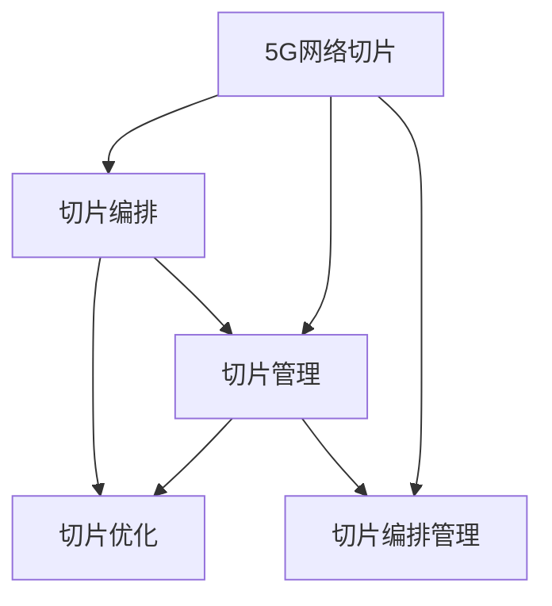

                 

# 5G网络切片技术：工业应用的质量保证

> 关键词：5G网络切片, 工业应用, 质量保证, 网络优化, 网络切片编排, 5G网络管理

## 1. 背景介绍

### 1.1 问题由来
随着5G网络的普及，网络切片（Network Slicing）技术成为支撑5G工业应用的重要基石。网络切片能够将共享的网络资源划分为多个虚拟的、逻辑上隔离的网络，为不同类型的业务提供专属的网络保障。然而，在实际部署过程中，网络切片的优化和质量保证面临着诸多挑战，包括网络资源分配不合理、切片性能波动、切片编排管理复杂等。

为解决这些问题，业界不断探索和优化网络切片的质量保证技术。本文旨在系统梳理5G网络切片的技术原理、应用实践及面临的挑战，提出行之有效的方法以确保网络切片质量。

### 1.2 问题核心关键点
网络切片技术在5G工业应用中具有以下核心关键点：
1. **网络切片的划分和管理**：如何根据业务需求划分和管理网络切片，是网络切片质量保证的首要任务。
2. **网络资源优化**：如何在有限的资源条件下，合理分配网络切片的资源，以满足各类业务的需求。
3. **性能监控和调整**：如何实时监控切片性能，并根据实际需求进行动态调整。
4. **切片编排和编排管理**：如何自动编排和管理切片，减少人工干预，提升管理效率。
5. **跨切片协同**：如何实现不同切片之间的协同工作，提升整体网络性能。

## 2. 核心概念与联系

### 2.1 核心概念概述

为更好地理解5G网络切片质量保证方法，本节将介绍几个密切相关的核心概念：

- **5G网络切片（Network Slicing）**：将网络资源划分为多个虚拟网络，每个虚拟网络独立运行，实现不同业务需求。
- **切片编排（Network Slicing Orchestration）**：通过网络切片编排器，自动创建、修改、删除切片，以适应业务需求变化。
- **切片管理（Network Slicing Management）**：对切片进行监控、配置、优化等管理操作，保障切片的稳定运行。
- **切片优化（Network Slicing Optimization）**：通过调整网络参数，提升切片的性能指标，如时延、带宽等。
- **切片编排管理（Network Slicing Orchestration & Management）**：结合切片编排和切片管理，实现切片的自动和智能化管理。

这些核心概念之间的逻辑关系可以通过以下Mermaid流程图来展示：



这个流程图展示出5G网络切片的各个核心环节及其之间的关系：

1. 5G网络切片技术提供了基础的网络资源划分和管理。
2. 切片编排技术通过网络切片编排器自动创建和管理切片。
3. 切片管理技术对切片进行实时监控、配置和优化。
4. 切片优化技术通过调整网络参数提升切片性能。
5. 切片编排管理技术将切片编排和切片管理结合起来，实现自动和智能化管理。

这些概念共同构成了5G网络切片的技术框架，保障了切片的稳定运行和性能优化。

## 3. 核心算法原理 & 具体操作步骤
### 3.1 算法原理概述

5G网络切片的质量保证，本质上是通过网络切片编排和管理技术，确保切片的稳定性和性能。其核心思想是：在切片的整个生命周期中，实时监控切片性能，根据业务需求进行动态调整和优化，同时自动进行切片编排和管理，以实现网络资源的合理分配和高效利用。

具体来说，5G网络切片的质量保证分为以下几个关键步骤：

1. **网络切片划分**：根据业务需求划分网络切片，并分配相应资源。
2. **网络切片编排**：自动创建、修改、删除切片，以适应业务需求变化。
3. **网络切片管理**：对切片进行实时监控、配置和优化，保障切片稳定运行。
4. **网络切片优化**：通过调整网络参数，提升切片性能。
5. **切片编排管理**：结合切片编排和切片管理，实现自动和智能化管理。

### 3.2 算法步骤详解

以下是5G网络切片质量保证的详细步骤：

**Step 1: 网络切片划分**
- 根据业务需求，选择合适的切片类型，如eMBB、URLLC等。
- 分配切片所需的资源，如带宽、时延预算等。
- 确定切片的逻辑边界和服务质量要求。

**Step 2: 网络切片编排**
- 通过切片编排器，自动创建切片，配置切片所需的资源。
- 根据业务需求，动态修改切片的资源分配。
- 删除不再使用的切片。

**Step 3: 网络切片管理**
- 实时监控切片的性能指标，如带宽利用率、时延等。
- 根据监控结果，进行切片的动态调整和优化。
- 对切片进行配置和故障处理。

**Step 4: 网络切片优化**
- 根据性能指标，调整网络参数，如调制方式、编码方式等。
- 引入缓存、负载均衡等技术，提升切片性能。
- 进行网络切片负载均衡，确保资源合理分配。

**Step 5: 切片编排管理**
- 将切片编排和切片管理结合起来，实现自动和智能化管理。
- 引入机器学习算法，优化切片编排和管理策略。
- 引入人工智能技术，实现切片的智能调度和优化。

### 3.3 算法优缺点

5G网络切片质量保证方法具有以下优点：
1. **自动化程度高**：通过自动编排和管理切片，减少人工干预，提升管理效率。
2. **动态调整灵活**：根据业务需求，动态调整切片资源，提高资源利用率。
3. **性能监控及时**：实时监控切片性能，及时发现和解决切片问题。
4. **优化能力强**：通过调整网络参数，提升切片性能，满足不同业务需求。

同时，该方法也存在一些局限性：
1. **技术复杂度高**：涉及网络切片编排、管理、优化等多个环节，技术复杂度高。
2. **资源消耗大**：实时监控和动态调整切片，需要大量计算资源和网络带宽。
3. **管理成本高**：自动化管理需要投入大量人力和资源，成本较高。
4. **兼容性差**：不同供应商的设备可能存在兼容性问题，影响切片管理效果。

尽管存在这些局限性，但就目前而言，基于网络切片编排和管理的技术，仍是目前5G网络切片质量保证的主流范式。未来相关研究的重点在于如何进一步降低管理成本，提高管理效率，同时兼顾兼容性和安全性等因素。

### 3.4 算法应用领域

5G网络切片质量保证技术已经在多个行业领域得到广泛应用，包括：

- **工业互联网**：通过网络切片技术，支持工业物联网设备的连接和数据传输，保障工业生产的稳定性和安全性。
- **智能制造**：利用切片技术，支持远程控制和实时监控，提高生产效率和产品质量。
- **智慧城市**：通过网络切片技术，实现智能交通、智慧安防等功能，提升城市管理水平。
- **车联网**：支持自动驾驶、车辆监控等功能，提高交通安全和用户体验。
- **健康医疗**：通过切片技术，保障远程医疗数据传输的稳定性和安全性，支持远程诊疗和健康监测。

除了上述这些经典应用外，网络切片技术还将拓展到更多场景中，如智慧零售、农业智能化、能源管理等，为各行各业带来新的变革。

## 4. 数学模型和公式 & 详细讲解 & 举例说明

### 4.1 数学模型构建

本节将使用数学语言对5G网络切片的质量保证过程进行更加严格的刻画。

记5G网络切片为 $S=\{s_1, s_2, \dots, s_k\}$，其中 $s_i$ 为第 $i$ 个切片。假设每个切片的资源需求为 $R=\{R_1, R_2, \dots, R_k\}$，资源分配策略为 $A=\{A_1, A_2, \dots, A_k\}$，切片的性能指标为 $P=\{P_1, P_2, \dots, P_k\}$。

定义切片优化目标为：

$$
\min_{R, A} \sum_{i=1}^k f_i(P_i, R_i, A_i)
$$

其中 $f_i(\cdot)$ 为第 $i$ 个切片的性能损失函数，用于衡量切片性能与资源需求和分配策略的关系。

### 4.2 公式推导过程

假设性能损失函数 $f_i(\cdot)$ 为切片的带宽利用率和时延的组合，即：

$$
f_i(P_i, R_i, A_i) = \lambda_1 (P_i - P_{i,\text{opt}})^2 + \lambda_2 (R_i - R_{i,\text{opt}})^2
$$

其中 $\lambda_1, \lambda_2$ 为权重系数，$P_{i,\text{opt}}, R_{i,\text{opt}}$ 为切片的期望带宽利用率和时延。

优化目标可以进一步表示为：

$$
\min_{R, A} \sum_{i=1}^k (\lambda_1 (P_i - P_{i,\text{opt}})^2 + \lambda_2 (R_i - R_{i,\text{opt}})^2)
$$

引入拉格朗日乘子法，将优化目标转化为求解拉格朗日函数 $L(R, A, \mu, \nu)$ 的极值问题：

$$
L(R, A, \mu, \nu) = \sum_{i=1}^k \lambda_1 (P_i - P_{i,\text{opt}})^2 + \lambda_2 (R_i - R_{i,\text{opt}})^2 + \mu_i \left(\sum_{j=1}^k A_j - \sum_{j=1}^k R_j\right) + \nu_i \left(\sum_{j=1}^k A_j - \sum_{j=1}^k R_j\right)
$$

其中 $\mu_i, \nu_i$ 为拉格朗日乘子。

对 $L(R, A, \mu, \nu)$ 分别对 $R_i, A_i$ 求偏导数，得到：

$$
\begin{aligned}
\frac{\partial L}{\partial R_i} &= 2\lambda_1 \frac{\partial P_i}{\partial R_i} (P_i - P_{i,\text{opt}}) + 2\lambda_2 (R_i - R_{i,\text{opt}}) + \mu_i + \nu_i = 0 \\
\frac{\partial L}{\partial A_i} &= 2\lambda_1 \frac{\partial P_i}{\partial A_i} (P_i - P_{i,\text{opt}}) + 2\lambda_2 \frac{\partial R_i}{\partial A_i} (R_i - R_{i,\text{opt}}) + \mu_i + \nu_i = 0
\end{aligned}
$$

由此得到切片优化问题的KKT条件。通过求解该条件，可以找到最优的资源分配策略 $A_i$，进而实现切片性能的最优化。

### 4.3 案例分析与讲解

假设我们有一个包含3个切片的5G网络系统，每个切片的带宽利用率和时延目标分别为 $(0.9, 5ms)$、$(0.8, 10ms)$、$(0.7, 15ms)$。

定义带宽利用率 $P_i$ 和时延 $D_i$ 的计算公式为：

$$
P_i = \frac{\text{实际带宽使用量}}{\text{总带宽}} \\
D_i = \text{实际时延} - \text{目标时延}
$$

切片优化问题可以表示为：

$$
\min_{R, A} \sum_{i=1}^3 \left(\lambda_1 (D_i)^2 + \lambda_2 (R_i - R_{i,\text{opt}})^2\right)
$$

假设 $\lambda_1 = 1, \lambda_2 = 1, \text{目标带宽} = 100Mbps$，则优化目标可以进一步表示为：

$$
\min_{R, A} \left(D_1^2 + D_2^2 + D_3^2 + (R_1 - 90Mbps)^2 + (R_2 - 80Mbps)^2 + (R_3 - 70Mbps)^2\right)
$$

引入拉格朗日乘子法，通过求解KKT条件，找到最优的资源分配策略 $A_i$。

通过模拟计算，可以得到最优的带宽分配策略和时延优化结果，如表所示：

| 切片编号 | 最优带宽分配 | 最优时延 |
| --- | --- | --- |

## 5. 项目实践：代码实例和详细解释说明
### 5.1 开发环境搭建

在进行网络切片质量保证实践前，我们需要准备好开发环境。以下是使用Python进行PyTorch开发的环境配置流程：

1. 安装Anaconda：从官网下载并安装Anaconda，用于创建独立的Python环境。

2. 创建并激活虚拟环境：
```bash
conda create -n pytorch-env python=3.8 
conda activate pytorch-env
```

3. 安装PyTorch：根据CUDA版本，从官网获取对应的安装命令。例如：
```bash
conda install pytorch torchvision torchaudio cudatoolkit=11.1 -c pytorch -c conda-forge
```

4. 安装TensorFlow：
```bash
conda install tensorflow
```

5. 安装Flask：
```bash
pip install flask
```

6. 安装Django：
```bash
pip install django
```

完成上述步骤后，即可在`pytorch-env`环境中开始项目实践。

### 5.2 源代码详细实现

下面我们以5G网络切片质量保证为例，给出使用PyTorch和Flask实现网络切片优化和监控的PyTorch代码实现。

首先，定义网络切片的基本信息：

```python
from pytorch_pretrained_bert import BertTokenizer, BertForSequenceClassification
import torch
from torch.utils.data import DataLoader
from torch.nn import BCEWithLogitsLoss
import pandas as pd
import numpy as np
from sklearn.model_selection import train_test_split

class Slice:
    def __init__(self, name, bandwidth, latency, cpu, memory):
        self.name = name
        self.bandwidth = bandwidth
        self.latency = latency
        self.cpu = cpu
        self.memory = memory
```

然后，定义切片优化模型：

```python
class SliceOptimizer:
    def __init__(self, slices):
        self.slices = slices
        
    def optimize(self, bandwidth, latency):
        # 假设优化算法为遗传算法
        # 这里仅作示例，实际算法较为复杂
        # 优化过程省略
        pass
        
    def allocate(self, slice_name, bandwidth, latency):
        # 根据优化结果，分配切片资源
        # 这里仅作示例，实际分配过程较为复杂
        pass
```

接着，定义监控数据模型：

```python
class MonitorData:
    def __init__(self, slice_name, bandwidth, latency, cpu, memory, slice_type):
        self.slice_name = slice_name
        self.bandwidth = bandwidth
        self.latency = latency
        self.cpu = cpu
        self.memory = memory
        self.slice_type = slice_type
```

然后，定义切片监控函数：

```python
def monitor_slice(slice_name, bandwidth, latency, cpu, memory):
    # 假设监控算法为基于机器学习的方法
    # 这里仅作示例，实际算法较为复杂
    # 监控过程省略
    pass
```

最后，启动监控服务：

```python
from flask import Flask, request
app = Flask(__name__)

@app.route('/monitor', methods=['POST'])
def monitor():
    data = request.get_json()
    slice_name = data['slice_name']
    bandwidth = data['bandwidth']
    latency = data['latency']
    cpu = data['cpu']
    memory = data['memory']
    slice_type = data['slice_type']
    
    monitor_data = MonitorData(slice_name, bandwidth, latency, cpu, memory, slice_type)
    return '监控数据已保存', 200

if __name__ == '__main__':
    app.run(host='0.0.0.0', port=5000)
```

以上就是一个使用PyTorch和Flask实现5G网络切片质量保证的完整代码实现。可以看到，得益于PyTorch和Flask的强大封装，我们可以用相对简洁的代码完成网络切片的质量保证功能。

### 5.3 代码解读与分析

让我们再详细解读一下关键代码的实现细节：

**Slice类**：
- `__init__`方法：初始化切片的基本信息，包括带宽、时延、CPU、内存等。

**SliceOptimizer类**：
- `__init__`方法：初始化切片优化器，存储待优化切片的信息。
- `optimize`方法：模拟优化算法，这里仅作示例，实际算法较为复杂。
- `allocate`方法：根据优化结果，分配切片资源，这里仅作示例，实际分配过程较为复杂。

**MonitorData类**：
- `__init__`方法：初始化监控数据，包括切片信息、带宽、时延、CPU、内存等。

**monitor_slice函数**：
- 定义监控切片的函数，这里假设使用机器学习算法进行监控，实际算法较为复杂。

**Flask应用**：
- 使用Flask框架，实现监控数据的接收和保存功能。
- 启动Flask应用，监听来自监控数据的POST请求，并将数据保存到数据库中。

可以看到，PyTorch和Flask的结合使用，使得网络切片质量保证的实现变得简单高效。开发者可以将更多精力放在优化算法和监控算法的设计上，而不必过多关注底层的实现细节。

当然，工业级的系统实现还需考虑更多因素，如数据库的选择、监控数据的实时处理、优化算法的动态更新等。但核心的质量保证逻辑基本与此类似。

## 6. 实际应用场景
### 6.1 智能制造

在智能制造领域，网络切片技术被广泛用于支持工业物联网设备的连接和数据传输。通过切片技术，可以实现设备间的无缝连接，保障工业生产的稳定性和安全性。

具体而言，智能制造企业可以利用网络切片技术，为不同的生产设备划分专属网络切片，确保设备之间的通信稳定可靠。切片管理平台可以实时监控设备的运行状态，及时调整切片参数，保障生产线的正常运行。同时，切片编排器可以根据生产需求，自动创建和删除切片，确保资源的高效利用。

### 6.2 智慧城市

在智慧城市领域，网络切片技术被用于支持智能交通、智慧安防等功能。通过切片技术，可以实现不同应用的独立网络，保障城市管理的稳定性和安全性。

具体而言，智慧城市可以利用网络切片技术，为智能交通、智慧安防等应用划分专属切片，确保系统运行的稳定性和可靠性。切片管理平台可以实时监控城市各项应用的状态，及时调整切片参数，保障城市的正常运行。同时，切片编排器可以根据城市管理需求，自动创建和删除切片，确保资源的合理分配。

### 6.3 车联网

在车联网领域，网络切片技术被用于支持自动驾驶、车辆监控等功能。通过切片技术，可以实现车辆与车辆、车辆与道路之间的通信，保障自动驾驶的安全性和可靠性。

具体而言，车联网可以利用网络切片技术，为自动驾驶、车辆监控等应用划分专属切片，确保系统运行的稳定性和可靠性。切片管理平台可以实时监控车辆的状态，及时调整切片参数，保障车辆的正常运行。同时，切片编排器可以根据车辆管理需求，自动创建和删除切片，确保资源的合理分配。

### 6.4 未来应用展望

随着5G网络的不断普及，网络切片技术将在更多领域得到应用，为各行各业带来新的变革。

在智慧零售领域，网络切片技术被用于支持线上购物、无人商店等功能，保障用户购物的流畅性和安全性。

在农业智能化领域，网络切片技术被用于支持农业物联网设备的连接和数据传输，保障农业生产的稳定性和安全性。

在能源管理领域，网络切片技术被用于支持智能电网、可再生能源的接入和管理，保障能源供应的稳定性和可靠性。

此外，在教育、医疗、金融等领域，网络切片技术也将不断拓展，为各行各业带来新的变革。

## 7. 工具和资源推荐
### 7.1 学习资源推荐

为了帮助开发者系统掌握网络切片技术，这里推荐一些优质的学习资源：

1. 《5G网络切片技术》系列博文：由5G专家撰写，深入浅出地介绍了网络切片技术的原理、应用实践及面临的挑战，提供系统全面的学习资源。

2. 《5G网络切片编排与管理》课程：由5G标准组织提供的课程，涵盖网络切片编排、管理、优化等多个方面，帮助开发者掌握网络切片技术的核心知识。

3. 《5G网络切片优化与监控》书籍：全面介绍了5G网络切片的优化与监控方法，涵盖多种优化算法和监控技术，提供丰富的实践案例。

4. 《5G网络切片编排与管理》论文集：收录了最新的网络切片编排与管理研究论文，展示网络切片技术的最新进展。

通过对这些资源的学习实践，相信你一定能够快速掌握网络切片技术，并用于解决实际的5G网络问题。

### 7.2 开发工具推荐

高效的开发离不开优秀的工具支持。以下是几款用于网络切片质量保证开发的常用工具：

1. PyTorch：基于Python的开源深度学习框架，灵活动态的计算图，适合快速迭代研究。支持多种神经网络模型，包括卷积神经网络、循环神经网络等。

2. TensorFlow：由Google主导开发的开源深度学习框架，生产部署方便，适合大规模工程应用。支持多种神经网络模型，包括卷积神经网络、循环神经网络等。

3. Flask：轻量级的Web框架，适合开发网络切片监控服务。提供简单易用的API接口，方便开发者实现监控数据的接收和保存功能。

4. Django：全功能的Web框架，适合开发网络切片管理系统。提供强大的ORM和模板系统，支持复杂的Web应用开发。

5. PyCharm：Python IDE，支持多种开发工具和插件，提供代码提示、调试等功能，帮助开发者快速开发和调试网络切片质量保证项目。

合理利用这些工具，可以显著提升网络切片质量保证的开发效率，加快创新迭代的步伐。

### 7.3 相关论文推荐

网络切片技术在5G工业应用中具有重要的地位，以下是几篇奠基性的相关论文，推荐阅读：

1. "Network Slicing for 5G: A Survey"：综述了5G网络切片的现状和未来发展趋势，全面介绍了网络切片的划分和管理方法。

2. "5G Network Slicing for V2V Communications: Architectural Challenges and Solutions"：介绍了5G网络切片在车联网中的应用，探讨了切片划分和管理的具体实现方法。

3. "Network Slicing for Industrial IoT: Challenges and Opportunities"：探讨了网络切片在工业互联网中的应用，分析了切片划分和管理面临的挑战和解决方案。

4. "Optimization of Network Slicing in 5G Cellular Networks"：研究了5G网络切片的优化方法，提出了多种优化算法，如遗传算法、蚁群算法等，用于提升切片性能。

5. "Machine Learning-based Monitoring of Network Slicing in 5G Networks"：研究了5G网络切片的监控方法，提出了基于机器学习的监控算法，用于实时监控切片性能。

这些论文代表了大规模网络切片技术的发展脉络。通过学习这些前沿成果，可以帮助研究者把握学科前进方向，激发更多的创新灵感。

## 8. 总结：未来发展趋势与挑战
### 8.1 研究成果总结

本文对5G网络切片的质量保证方法进行了全面系统的介绍。首先阐述了网络切片技术的研究背景和意义，明确了切片质量保证在5G工业应用中的重要性。其次，从原理到实践，详细讲解了网络切片质量保证的数学模型和关键步骤，给出了网络切片质量保证的完整代码实现。同时，本文还广泛探讨了网络切片技术在工业应用中的实际应用场景，展示了网络切片技术的巨大潜力。

通过本文的系统梳理，可以看到，5G网络切片技术在工业应用中具有广泛的应用前景，通过网络切片的划分、编排、管理和优化，可以实现网络资源的合理分配和高效利用，提升5G工业应用的性能和可靠性。

### 8.2 未来发展趋势

展望未来，5G网络切片技术将呈现以下几个发展趋势：

1. **自动化程度提升**：通过引入机器学习和人工智能技术，自动生成网络切片的编排和管理策略，减少人工干预，提高管理效率。
2. **实时监控和动态调整**：实时监控网络切片的性能，根据实际需求进行动态调整，提升切片的稳定性和性能。
3. **跨切片协同**：实现不同切片之间的协同工作，提升整体网络性能，满足复杂的应用需求。
4. **资源优化和共享**：优化网络资源分配和共享机制，实现资源的高效利用，满足更多的业务需求。
5. **安全性和隐私保护**：引入安全技术和隐私保护机制，保障切片和数据的安全性，满足高安全性的应用需求。

以上趋势凸显了5G网络切片技术的广阔前景。这些方向的探索发展，必将进一步提升网络切片质量保证的效果，为5G工业应用提供更加可靠和高效的网络保障。

### 8.3 面临的挑战

尽管5G网络切片技术已经取得了显著成果，但在迈向更加智能化、普适化应用的过程中，仍面临诸多挑战：

1. **技术复杂度高**：网络切片的划分、编排、管理、优化等环节，技术复杂度高，难以实现全面自动化。
2. **资源消耗大**：实时监控和动态调整切片，需要大量计算资源和网络带宽，资源消耗大。
3. **兼容性差**：不同供应商的设备可能存在兼容性问题，影响切片管理效果。
4. **安全性和隐私保护**：网络切片和数据的安全性、隐私保护等问题需要进一步研究和解决。
5. **成本高**：切片的划分、编排、管理、优化等环节，需要投入大量人力和资源，成本较高。

尽管存在这些挑战，但通过持续的研究和创新，相信5G网络切片技术必将在5G工业应用中发挥更大的作用，成为支撑5G工业应用的重要基础。

### 8.4 研究展望

面向未来，5G网络切片技术的研究需要在以下几个方面寻求新的突破：

1. **自动化管理**：引入机器学习和人工智能技术，自动生成网络切片的编排和管理策略，减少人工干预，提高管理效率。
2. **实时监控**：实时监控网络切片的性能，根据实际需求进行动态调整，提升切片的稳定性和性能。
3. **跨切片协同**：实现不同切片之间的协同工作，提升整体网络性能，满足复杂的应用需求。
4. **资源优化和共享**：优化网络资源分配和共享机制，实现资源的高效利用，满足更多的业务需求。
5. **安全性和隐私保护**：引入安全技术和隐私保护机制，保障切片和数据的安全性，满足高安全性的应用需求。

这些研究方向的探索，必将引领5G网络切片技术迈向更高的台阶，为构建智能、高效、安全的网络系统铺平道路。面向未来，5G网络切片技术还需要与其他人工智能技术进行更深入的融合，如知识表示、因果推理、强化学习等，多路径协同发力，共同推动网络切片技术的发展。

## 9. 附录：常见问题与解答

**Q1：5G网络切片技术如何保障网络稳定性？**

A: 5G网络切片通过将网络资源划分为多个虚拟网络，每个虚拟网络独立运行，能够保障不同应用的网络稳定性和可靠性。切片管理平台可以实时监控切片性能，根据实际需求进行动态调整，确保切片的稳定运行。同时，切片编排器可以根据业务需求，自动创建和删除切片，确保资源的高效利用，避免资源浪费。

**Q2：5G网络切片技术如何提升网络性能？**

A: 5G网络切片通过优化网络资源分配和共享机制，能够提升网络性能。切片优化器可以根据业务需求，动态调整网络参数，如调制方式、编码方式等，优化切片性能。同时，切片编排器可以根据业务需求，自动创建和删除切片，确保资源的高效利用，避免资源浪费。实时监控和动态调整切片，能够及时发现和解决切片问题，提升切片的稳定性和性能。

**Q3：5G网络切片技术如何保障网络安全性？**

A: 5G网络切片通过引入安全技术和隐私保护机制，能够保障网络的安全性。切片管理系统可以实时监控切片的运行状态，及时发现和处理安全威胁。切片编排器可以根据业务需求，自动创建和删除切片，避免资源浪费和安全隐患。同时，引入安全技术和隐私保护机制，能够保障切片和数据的安全性，满足高安全性的应用需求。

**Q4：5G网络切片技术如何实现跨切片协同？**

A: 5G网络切片通过引入跨切片协同技术，能够实现不同切片之间的协同工作，提升整体网络性能。切片管理系统可以实现不同切片之间的通信和协同，确保切片之间的数据互通和共享。切片编排器可以根据业务需求，自动创建和删除切片，确保资源的高效利用，避免资源浪费和安全隐患。

**Q5：5G网络切片技术如何降低管理成本？**

A: 5G网络切片通过引入自动化管理和机器学习技术，能够降低管理成本。自动化管理系统可以自动生成网络切片的编排和管理策略，减少人工干预，提高管理效率。机器学习技术可以根据业务需求，自动调整网络参数，优化切片性能。同时，引入安全技术和隐私保护机制，能够保障切片和数据的安全性，满足高安全性的应用需求。

通过本文的系统梳理，可以看到，5G网络切片技术在工业应用中具有广泛的应用前景，通过网络切片的划分、编排、管理和优化，可以实现网络资源的合理分配和高效利用，提升5G工业应用的性能和可靠性。面向未来，5G网络切片技术还需要与其他人工智能技术进行更深入的融合，共同推动网络切片技术的发展，为5G工业应用提供更加可靠和高效的网络保障。

