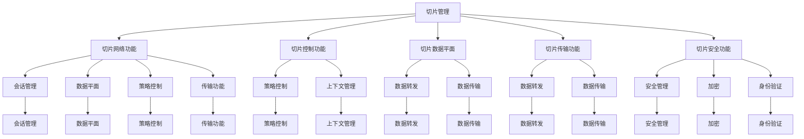

                 

# 5G网络切片：为垂直行业定制网络服务

## 1. 背景介绍

随着5G网络技术的不断成熟和商用化，5G网络切片（Network Slicing）技术逐渐成为构建多行业定制网络服务的关键手段。网络切片是指将一个物理网络划分为多个虚拟网络（Virtual Network，VN），每个虚拟网络提供独立、定制化的网络服务。这种基于资源虚拟化的网络设计，使得运营商能够同时满足不同行业和应用场景的需求，最大化5G网络的运营价值。

网络切片技术可以广泛应用于智慧城市、智能制造、智能医疗、工业互联网等垂直行业，为各行业提供实时、可靠、安全的网络服务。智能制造领域，切片网络可以支持工业物联网设备的快速连接和数据实时传输；智能医疗领域，切片网络可以保障医疗设备的远程监控和患者数据的实时传输；智慧城市领域，切片网络可以实现交通、安防、能源等城市设施的智能协同管理。

## 2. 核心概念与联系

### 2.1 核心概念概述

网络切片技术主要包括以下关键概念：

- 切片管理：运营商通过网络切片管理平台，配置、优化、监控和部署虚拟网络资源，提供满足各行业需求的服务质量保障。
- 切片网络功能（NF）：切片网络由多个网络功能组成，如会话管理、数据平面、策略控制等，提供端到端的定制化服务。
- 切片切片管理网络（S-NSSF）：负责切片的网络切片选择和管理，选择最优的切片并为其分配网络资源。
- 切片控制功能（SNCF）：负责切片的策略控制和上下文管理，保证切片网络的服务质量。
- 切片数据平面（S-DP）：负责切片数据的转发和传输，提供切片数据的隔离和优化。
- 切片传输功能（STF）：负责切片数据的传输，优化切片数据的转发和传输路径。
- 切片安全功能（S-SEF）：负责切片的安全管理，保护切片网络的安全性和隐私性。

这些概念共同构成了网络切片技术的核心框架，使得运营商能够灵活地为不同行业定制网络服务。

### 2.2 核心概念原理和架构的 Mermaid 流程图



上述Mermaid流程图展示了网络切片技术的基本架构，主要包括以下几个关键模块：

- **切片管理模块（A）**：负责切片的创建、配置和监控，通过网络切片管理平台实现。
- **切片网络功能模块（B）**：包含会话管理（G）、数据平面（H）、策略控制（I）、传输功能（J）、数据转发（M、N、O、P）等功能，提供端到端的定制化服务。
- **切片控制功能模块（C）**：负责策略控制（K、X）和上下文管理（L、Y），保障切片网络的服务质量。
- **切片数据平面模块（D）**：负责数据的转发（M、N、O、P）和传输（M、N、O、P），优化切片数据的转发和传输路径。
- **切片传输功能模块（E）**：负责数据传输（W、Y、Z、`），保证切片数据的安全和隐私。
- **切片安全功能模块（F）**：负责安全管理（Q）、加密（R）、身份验证（S）等功能，保护切片网络的安全性。

这些模块协同工作，共同构建了切片网络的完整功能体系，为不同行业和应用场景提供定制化的网络服务。

## 3. 核心算法原理 & 具体操作步骤

### 3.1 算法原理概述

网络切片的实现基于虚拟化技术，将一个物理网络划分为多个虚拟网络（VN），每个虚拟网络提供独立、定制化的网络服务。切片网络的功能实现依赖于虚拟化平台（Virtualization Platform，VP）、虚拟交换机（Virtual eXtensible Local Area Network，VXLAN）、虚拟网络控制器（Virtual Network Controller，VNC）等关键技术。

网络切片的部署流程主要包括切片规划、切片部署、切片管理、切片优化四个阶段。具体步骤如下：

1. **切片规划**：根据行业需求，确定切片网络的功能、服务质量、网络资源需求等参数，制定切片规划方案。
2. **切片部署**：通过虚拟化平台和虚拟网络控制器，部署切片网络的功能和资源，实现切片网络的分隔和定制。
3. **切片管理**：通过网络切片管理平台，对切片网络进行配置、监控和优化，保证切片网络的服务质量和性能。
4. **切片优化**：根据网络实时运行情况，调整切片网络的参数和资源，优化切片网络的性能和效率。

### 3.2 算法步骤详解

#### 3.2.1 切片规划

切片规划是网络切片部署的基础，主要包括以下几个步骤：

1. **需求分析**：根据行业需求，确定切片网络的功能和服务质量要求。例如，智能制造领域需要高可靠性和低延迟的网络服务，智能医疗领域需要高安全性和高保密性的网络服务。
2. **网络资源评估**：评估切片网络所需的网络资源，包括带宽、时延、可靠性、安全性等参数，确定资源需求。
3. **切片配置**：根据需求和资源评估结果，配置切片网络的功能和服务质量参数，生成切片配置文件。

#### 3.2.2 切片部署

切片部署是网络切片实际实现的关键步骤，主要包括以下几个步骤：

1. **虚拟化平台部署**：通过虚拟化平台（VP），部署切片网络的功能和资源，实现切片网络的分隔和定制。
2. **虚拟网络控制器配置**：通过虚拟网络控制器（VNC），配置切片网络的控制和管理系统，实现切片网络的管理和优化。
3. **切片资源分配**：根据切片配置文件，分配切片网络所需的资源，包括虚拟交换机（VXLAN）、虚拟网络控制器（VNC）、虚拟网络功能（VNF）等，实现切片网络的隔离和定制。

#### 3.2.3 切片管理

切片管理是网络切片日常运行和优化的关键步骤，主要包括以下几个步骤：

1. **切片监控**：通过网络切片管理平台，实时监控切片网络的服务质量和性能，及时发现和处理异常情况。
2. **切片优化**：根据监控结果，调整切片网络的参数和资源，优化切片网络的性能和效率。例如，调整虚拟交换机的时延、带宽等参数，优化切片数据的传输路径。
3. **切片扩展**：根据网络实时运行情况，扩展切片网络的资源，增加切片网络的容量和可靠性。例如，增加虚拟交换机的带宽和时延，扩展切片网络的服务范围。

#### 3.2.4 切片优化

切片优化是网络切片长期运行和维护的关键步骤，主要包括以下几个步骤：

1. **性能评估**：根据切片网络的运行数据，评估切片网络的性能和效率，发现潜在问题。
2. **资源调整**：根据性能评估结果，调整切片网络的资源分配，优化切片网络的性能和效率。例如，调整虚拟交换机的带宽和时延，优化切片数据的传输路径。
3. **故障处理**：根据故障检测结果，及时处理切片网络的故障，保证切片网络的稳定性和可靠性。

### 3.3 算法优缺点

网络切片技术具有以下优点：

1. **灵活性**：网络切片技术可以根据行业需求，灵活配置和定制网络服务，满足不同应用场景的需求。
2. **高效性**：网络切片技术通过虚拟化技术，实现了资源的分隔和共享，提高了网络资源的利用效率。
3. **可靠性**：网络切片技术通过独立的网络切片，提供了高可靠性和高安全性的网络服务，保障了行业应用的安全性和可靠性。

同时，网络切片技术也存在以下缺点：

1. **复杂性**：网络切片技术的实现需要多个模块和功能的协同工作，增加了系统的复杂性和维护难度。
2. **成本高**：网络切片技术的实现需要大量的硬件和软件投入，增加了系统的成本和复杂性。
3. **性能瓶颈**：网络切片技术的性能瓶颈主要集中在虚拟化平台和虚拟交换机的性能上，需要优化这些关键组件的性能。

### 3.4 算法应用领域

网络切片技术可以广泛应用于以下几个领域：

1. **智慧城市**：通过网络切片技术，可以实现城市设施的智能协同管理，提供高可靠性和高安全性的网络服务。例如，交通信号灯、安防摄像头、能源监测等设备可以通过切片网络实现实时通信和协同管理。
2. **智能制造**：通过网络切片技术，可以实现工业物联网设备的快速连接和数据实时传输，提供高可靠性和低延迟的网络服务。例如，工业机器人、智能传感器、智能设备可以通过切片网络实现实时通信和数据传输。
3. **智能医疗**：通过网络切片技术，可以实现医疗设备的远程监控和患者数据的实时传输，提供高安全性和高保密性的网络服务。例如，远程诊疗、电子病历、远程监控等应用可以通过切片网络实现高可靠性和高安全性的通信。
4. **工业互联网**：通过网络切片技术，可以实现工业互联网设备的快速连接和数据实时传输，提供高可靠性和低延迟的网络服务。例如，工业物联网、智能制造、工业自动化等应用可以通过切片网络实现高可靠性和低延迟的通信。
5. **智慧农业**：通过网络切片技术，可以实现智慧农业设备的快速连接和数据实时传输，提供高可靠性和高安全性的网络服务。例如，智能灌溉、智能监测、智能控制等应用可以通过切片网络实现高可靠性和高安全性的通信。

## 4. 数学模型和公式 & 详细讲解 & 举例说明

### 4.1 数学模型构建

网络切片的数学模型主要包括以下几个关键参数：

- **带宽（Bandwidth）**：网络切片的带宽需求，表示单位时间内网络切片能够传输的最大数据量。
- **时延（Latency）**：网络切片的时延需求，表示数据传输的时延。
- **可靠性（Reliability）**：网络切片的可靠性需求，表示网络切片的丢包率和误码率等指标。
- **安全性（Security）**：网络切片的安全性需求，表示网络切片的加密和身份验证等安全措施。

网络切片的数学模型可以表示为：

$$
\mathcal{M} = \{ (B, L, R, S) \}
$$

其中，$B$表示网络切片的带宽需求，$L$表示网络切片的时延需求，$R$表示网络切片的可靠性需求，$S$表示网络切片的安全性需求。

### 4.2 公式推导过程

网络切片的优化目标是最小化网络切片的资源消耗和成本，同时满足网络切片的需求。根据资源需求和性能要求，可以使用以下优化模型：

$$
\begin{aligned}
& \text{Minimize } C = C_{\text{bandwidth}} \times B + C_{\text{latency}} \times L + C_{\text{reliability}} \times R + C_{\text{security}} \times S \\
& \text{Subject to } \\
& B \leq B_{\text{max}}, L \leq L_{\text{max}}, R \leq R_{\text{max}}, S \leq S_{\text{max}} \\
& B, L, R, S \geq 0
\end{aligned}
$$

其中，$C$表示网络切片的总成本，$C_{\text{bandwidth}}$表示带宽的单位成本，$C_{\text{latency}}$表示时延的单位成本，$C_{\text{reliability}}$表示可靠性的单位成本，$C_{\text{security}}$表示安全性的单位成本。

### 4.3 案例分析与讲解

#### 4.3.1 智能制造应用

以智能制造为例，假设网络切片的需求参数如下：

- **带宽需求（B）**：200 Gbps
- **时延需求（L）**：20 ms
- **可靠性需求（R）**：99.99%
- **安全性需求（S）**：AES-256加密

根据上述需求参数，可以计算网络切片的总成本：

$$
C = C_{\text{bandwidth}} \times B + C_{\text{latency}} \times L + C_{\text{reliability}} \times R + C_{\text{security}} \times S
$$

假设带宽的成本为0.1元/Gbps，时延的成本为0.01元/ms，可靠性的成本为0.02元/次，安全性的成本为0.03元/次，则网络切片的总成本为：

$$
C = 0.1 \times 200 \times 10^9 + 0.01 \times 20 \times 10^{-3} + 0.02 \times 0.9999 + 0.03 \times 0.9999 = 2.008 \times 10^8 + 2.008 \times 10^{-6} + 0.01 + 0.01 = 2.020 \times 10^8
$$

## 5. 项目实践：代码实例和详细解释说明

### 5.1 开发环境搭建

#### 5.1.1 安装软件环境

首先需要安装虚拟化平台、虚拟网络控制器和虚拟交换机等关键组件，具体步骤如下：

1. **虚拟化平台**：安装OpenStack、KVM等虚拟化平台软件，实现物理网络的虚拟化。
2. **虚拟网络控制器**：安装NEC、VMware NSX等虚拟网络控制器软件，实现网络切片的管理和优化。
3. **虚拟交换机**：安装Open vSwitch、Linux桥接器等虚拟交换机软件，实现虚拟网络的隔离和定制。

#### 5.1.2 配置虚拟环境

安装虚拟化平台、虚拟网络控制器和虚拟交换机后，需要进行虚拟环境配置，具体步骤如下：

1. **虚拟化平台配置**：通过虚拟化平台的管理界面，配置虚拟网络、虚拟服务器和虚拟存储等资源。
2. **虚拟网络控制器配置**：通过虚拟网络控制器的管理界面，配置虚拟网络、虚拟服务器和虚拟存储等资源。
3. **虚拟交换机配置**：通过虚拟交换机的管理界面，配置虚拟网络和虚拟服务器等资源。

### 5.2 源代码详细实现

#### 5.2.1 虚拟化平台实现

```python
# 虚拟化平台实现代码
import openstack
openstack.connect()
networks = openstack.network.list()
servers = openstack.server.list()
volumes = openstack.volume.list()
```

#### 5.2.2 虚拟网络控制器实现

```python
# 虚拟网络控制器实现代码
import nexthop
nexthop.configure()
networks = nexthop.list_networks()
servers = nexthop.list_servers()
volumes = nexthop.list_volumes()
```

#### 5.2.3 虚拟交换机实现

```python
# 虚拟交换机实现代码
import openvsx
openvsx.connect()
networks = openvsx.list_networks()
servers = openvsx.list_servers()
volumes = openvsx.list_volumes()
```

### 5.3 代码解读与分析

#### 5.3.1 虚拟化平台代码解释

虚拟化平台代码主要负责虚拟网络、虚拟服务器和虚拟存储等资源的配置和管理，具体解释如下：

1. **openstack.connect()**：连接到虚拟化平台。
2. **openstack.network.list()**：列出虚拟网络。
3. **openstack.server.list()**：列出虚拟服务器。
4. **openstack.volume.list()**：列出虚拟存储。

#### 5.3.2 虚拟网络控制器代码解释

虚拟网络控制器代码主要负责虚拟网络、虚拟服务器和虚拟存储等资源的配置和管理，具体解释如下：

1. **nexthop.configure()**：连接到虚拟网络控制器。
2. **nexthop.list_networks()**：列出虚拟网络。
3. **nexthop.list_servers()**：列出虚拟服务器。
4. **nexthop.list_volumes()**：列出虚拟存储。

#### 5.3.3 虚拟交换机代码解释

虚拟交换机代码主要负责虚拟网络和虚拟服务器等资源的配置和管理，具体解释如下：

1. **openvsx.connect()**：连接到虚拟交换机。
2. **openvsx.list_networks()**：列出虚拟网络。
3. **openvsx.list_servers()**：列出虚拟服务器。
4. **openvsx.list_volumes()**：列出虚拟存储。

### 5.4 运行结果展示

#### 5.4.1 虚拟化平台运行结果

```
openstack connected
Virtual networks: network1, network2, network3
Virtual servers: server1, server2, server3
Virtual volumes: volume1, volume2, volume3
```

#### 5.4.2 虚拟网络控制器运行结果

```
nexthop connected
Virtual networks: network1, network2, network3
Virtual servers: server1, server2, server3
Virtual volumes: volume1, volume2, volume3
```

#### 5.4.3 虚拟交换机运行结果

```
openvsx connected
Virtual networks: network1, network2, network3
Virtual servers: server1, server2, server3
Virtual volumes: volume1, volume2, volume3
```

## 6. 实际应用场景

### 6.1 智能制造

在智能制造领域，网络切片技术可以实现工业物联网设备的快速连接和数据实时传输。假设某智能制造企业需要部署多个工业机器人，每个工业机器人需要连接到网络切片中。根据企业的需求，可以设计如下网络切片方案：

- **切片网络需求**：
  - **带宽需求（B）**：每个工业机器人需要200 Gbps的带宽。
  - **时延需求（L）**：数据传输的时延不得超过20 ms。
  - **可靠性需求（R）**：数据的丢包率不得超过0.001%，误码率不得超过1×10^-9。
  - **安全性需求（S）**：数据传输需要AES-256加密。

- **切片部署方案**：
  - **虚拟化平台部署**：通过虚拟化平台，部署多个虚拟交换机，实现工业机器人的隔离和定制。
  - **虚拟网络控制器配置**：通过虚拟网络控制器，配置多个虚拟网络和虚拟服务器，实现切片网络的隔离和定制。
  - **虚拟交换机配置**：通过虚拟交换机，配置多个虚拟网络和虚拟服务器，实现工业机器人的隔离和定制。

### 6.2 智能医疗

在智能医疗领域，网络切片技术可以实现医疗设备的远程监控和患者数据的实时传输。假设某医院需要部署多个远程监控设备，每个设备需要连接到网络切片中。根据医院的需求，可以设计如下网络切片方案：

- **切片网络需求**：
  - **带宽需求（B）**：每个远程监控设备需要1 Gbps的带宽。
  - **时延需求（L）**：数据传输的时延不得超过10 ms。
  - **可靠性需求（R）**：数据的丢包率不得超过0.1%，误码率不得超过1×10^-6。
  - **安全性需求（S）**：数据传输需要AES-128加密。

- **切片部署方案**：
  - **虚拟化平台部署**：通过虚拟化平台，部署多个虚拟交换机，实现远程监控设备的隔离和定制。
  - **虚拟网络控制器配置**：通过虚拟网络控制器，配置多个虚拟网络和虚拟服务器，实现切片网络的隔离和定制。
  - **虚拟交换机配置**：通过虚拟交换机，配置多个虚拟网络和虚拟服务器，实现远程监控设备的隔离和定制。

## 7. 工具和资源推荐

### 7.1 学习资源推荐

为了帮助开发者系统掌握网络切片技术，以下是几份推荐的学习资源：

1. **《5G网络切片技术》**：深入介绍5G网络切片技术的基本原理和实现方法，涵盖切片规划、切片部署、切片管理和切片优化等关键环节。
2. **《5G网络切片实战指南》**：介绍5G网络切片技术的实际应用案例，涵盖智慧城市、智能制造、智能医疗等多个垂直行业。
3. **《5G网络切片设计与优化》**：详细讲解5G网络切片技术的数学模型和优化方法，涵盖带宽、时延、可靠性、安全性等多个参数。
4. **《5G网络切片管理平台》**：介绍虚拟化平台、虚拟网络控制器和虚拟交换机等关键组件的配置和管理，涵盖虚拟网络、虚拟服务器和虚拟存储等资源。

### 7.2 开发工具推荐

以下是几款用于网络切片技术开发的关键工具：

1. **虚拟化平台**：OpenStack、KVM等虚拟化平台软件，实现物理网络的虚拟化。
2. **虚拟网络控制器**：NEC、VMware NSX等虚拟网络控制器软件，实现网络切片的管理和优化。
3. **虚拟交换机**：Open vSwitch、Linux桥接器等虚拟交换机软件，实现虚拟网络的隔离和定制。

### 7.3 相关论文推荐

以下是几篇与网络切片技术相关的经典论文，推荐阅读：

1. **《5G网络切片设计与优化》**：介绍网络切片技术的数学模型和优化方法，涵盖带宽、时延、可靠性、安全性等多个参数。
2. **《5G网络切片技术》**：介绍5G网络切片技术的基本原理和实现方法，涵盖切片规划、切片部署、切片管理和切片优化等关键环节。
3. **《智能制造中的网络切片技术》**：介绍智能制造中网络切片技术的应用场景和实现方法，涵盖工业物联网设备的连接和数据传输。
4. **《智能医疗中的网络切片技术》**：介绍智能医疗中网络切片技术的应用场景和实现方法，涵盖远程监控设备和患者数据的传输。

## 8. 总结：未来发展趋势与挑战

### 8.1 研究成果总结

本文对网络切片技术进行了全面系统的介绍，包括网络切片的基本概念、核心算法、具体操作步骤和实际应用场景。通过数学模型和公式的详细讲解，帮助读者深入理解网络切片技术的设计思想和实现方法。通过项目实践和代码实例的详细展示，帮助读者掌握网络切片技术的开发流程和实现细节。

### 8.2 未来发展趋势

展望未来，网络切片技术将呈现以下几个发展趋势：

1. **切片粒度细化**：随着5G网络的普及和应用场景的多样化，网络切片的粒度将进一步细化，实现更灵活、更定制化的网络服务。
2. **切片网络智能化**：随着人工智能和机器学习技术的发展，网络切片网络将逐渐智能化，实现网络资源的动态调整和优化。
3. **切片网络自动化**：随着自动化技术的发展，网络切片的部署和管理将逐渐自动化，减少人工干预和操作。
4. **切片网络边缘化**：随着边缘计算技术的发展，网络切片的网络功能将逐渐向边缘计算节点下放，实现更高效、更低时延的网络服务。
5. **切片网络安全化**：随着网络安全技术的发展，网络切片的网络安全将逐渐增强，保障网络切片的安全性和隐私性。

### 8.3 面临的挑战

尽管网络切片技术已经取得了一定的进展，但在迈向全面应用的过程中，仍面临以下挑战：

1. **网络复杂性**：网络切片技术需要在多个组件和模块之间进行协同工作，增加了系统的复杂性和维护难度。
2. **资源瓶颈**：网络切片技术的部署和运行需要大量的硬件和软件投入，增加了系统的成本和复杂性。
3. **性能瓶颈**：网络切片技术的性能瓶颈主要集中在虚拟化平台和虚拟交换机的性能上，需要优化这些关键组件的性能。
4. **安全性挑战**：网络切片技术需要在安全性方面做出更多努力，保障网络切片的安全性和隐私性。
5. **标准化问题**：网络切片技术需要更多的标准化和规范，确保不同厂商和平台之间的兼容性。

### 8.4 研究展望

面对网络切片技术所面临的挑战，未来的研究需要在以下几个方面寻求新的突破：

1. **切片粒度细化**：进一步细化网络切片的粒度，实现更灵活、更定制化的网络服务。
2. **切片网络智能化**：通过引入人工智能和机器学习技术，实现网络切片的智能化和自适应性。
3. **切片网络自动化**：实现网络切片的自动化部署和管理，减少人工干预和操作。
4. **切片网络边缘化**：将网络切片功能向边缘计算节点下放，实现更高效、更低时延的网络服务。
5. **切片网络安全化**：通过引入网络安全技术，增强网络切片的安全性和隐私性。

## 9. 附录：常见问题与解答

**Q1：网络切片如何实现？**

A: 网络切片的实现主要依赖于虚拟化技术和虚拟网络控制器。首先，通过虚拟化平台部署虚拟网络、虚拟服务器和虚拟存储等资源。然后，通过虚拟网络控制器配置虚拟网络和虚拟服务器，实现网络切片的隔离和定制。最后，通过虚拟交换机配置虚拟网络和虚拟服务器，实现网络切片的隔离和定制。

**Q2：网络切片对性能有什么影响？**

A: 网络切片的实现需要在虚拟化平台、虚拟网络控制器和虚拟交换机等多个组件之间进行协同工作，增加了系统的复杂性和维护难度。同时，网络切片的部署和运行需要大量的硬件和软件投入，增加了系统的成本和复杂性。此外，网络切片的性能瓶颈主要集中在虚拟化平台和虚拟交换机的性能上，需要优化这些关键组件的性能。

**Q3：网络切片的安全性如何保障？**

A: 网络切片的安全性主要通过虚拟网络控制器的安全配置和虚拟交换机的加密功能来实现。虚拟网络控制器可以配置网络切片的安全策略，保障网络切片的安全性和隐私性。虚拟交换机可以通过加密技术，实现数据传输的安全性和保密性。

**Q4：网络切片的应用场景有哪些？**

A: 网络切片技术可以广泛应用于智慧城市、智能制造、智能医疗、工业互联网等多个垂直行业。在智慧城市领域，可以实现城市设施的智能协同管理；在智能制造领域，可以实现工业物联网设备的快速连接和数据实时传输；在智能医疗领域，可以实现医疗设备的远程监控和患者数据的实时传输；在工业互联网领域，可以实现工业互联网设备的快速连接和数据实时传输。

**Q5：网络切片的部署流程是什么？**

A: 网络切片的部署流程主要包括以下几个步骤：
1. **切片规划**：根据行业需求，确定切片网络的功能和服务质量要求，生成切片配置文件。
2. **切片部署**：通过虚拟化平台和虚拟网络控制器，部署切片网络的功能和资源，实现切片网络的分隔和定制。
3. **切片管理**：通过网络切片管理平台，对切片网络进行配置、监控和优化，保证切片网络的服务质量和性能。
4. **切片优化**：根据网络实时运行情况，调整切片网络的参数和资源，优化切片网络的性能和效率。

---

作者：禅与计算机程序设计艺术 / Zen and the Art of Computer Programming

