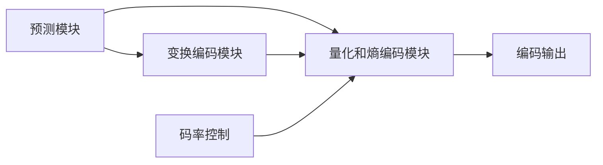

                 

# HEVC 编码器：高效视频编码

## 1. 背景介绍

随着高清视频在网络传输、社交媒体、数字电视等方面的普及，对视频编解码技术的性能和效率提出了更高的要求。HEVC（High Efficiency Video Coding）作为新一代视频编码标准，相较于H.264，在压缩比和压缩质量方面都有了显著的提升。HEVC编码器利用先进的算法设计，实现了对高清视频的更高效率压缩。本文将详细阐述HEVC编码器的核心概念与原理，并通过实践项目展示其实现过程与性能评估。

## 2. 核心概念与联系

### 2.1 核心概念概述

HEVC 编码器采用了复杂的编码结构，涵盖多个重要模块，包括：

- **预测模块**：利用相邻帧间的空间相关性，对当前帧进行运动估计和预测。
- **变换编码模块**：将预测残差进行离散余弦变换（DCT）编码，以压缩数据。
- **量化和熵编码模块**：量化残差系数并编码，以进一步压缩数据。

### 2.2 Mermaid 流程图（核心概念之间的联系）



此图展示了HEVC编码器各模块之间的联系与流程。

## 3. 核心算法原理 & 具体操作步骤

### 3.1 算法原理概述

HEVC编码器的主要原理是将视频帧拆分为小的宏块（Macroblock），每个宏块由16x16的像素组成。对每个宏块，编码器通过预测模块估计其与相邻帧之间的运动信息，得到预测帧。预测帧与原始帧的差值（即残差）被变换编码模块转换成频域数据，然后通过量化和熵编码模块压缩。码率控制模块根据当前帧的编码数据和目标码率，调整编码器的量化参数，以控制码率。

### 3.2 算法步骤详解

#### 3.2.1 初始化

- 设置码率控制参数：目标码率、初始量化参数等。
- 对每个帧，拆分为宏块，并初始化每个宏块的预测帧。

#### 3.2.2 预测模块

- 对每个宏块，利用相邻帧的运动信息，生成预测帧。
- 计算预测帧与原始帧的残差。

#### 3.2.3 变换编码模块

- 对残差进行离散余弦变换（DCT），得到频域系数。
- 对频域系数进行量化。

#### 3.2.4 量化和熵编码模块

- 对量化后的频域系数进行熵编码，如霍夫曼编码。
- 将编码后的数据写入输出流。

#### 3.2.5 码率控制

- 根据编码数据的实际码率与目标码率，调整量化参数。

### 3.3 算法优缺点

#### 3.3.1 优点

- **高压缩比**：相较于H.264，HEVC在相同码率下能够提供更高的视频质量。
- **灵活的编码单元**：支持不同大小的编码单元，适用于多种视频编码场景。
- **多参考帧**：利用多个相邻帧的信息，提升预测准确性。

#### 3.3.2 缺点

- **计算复杂度高**：HEVC的复杂算法设计使其计算复杂度较高。
- **实现难度大**：HEVC编码器的实现需要精确控制编码参数，开发难度较大。
- **资源消耗高**：HEVC编码器需要较多的计算资源，对硬件要求较高。

### 3.4 算法应用领域

HEVC编码器被广泛应用于高清视频的压缩与传输，包括数字电视、在线视频流、监控视频等。此外，HEVC在无人机、安防监控、自动驾驶等领域也有广泛应用。

## 4. 数学模型和公式 & 详细讲解 & 举例说明

### 4.1 数学模型构建

HEVC编码器的核心数学模型包括预测模型、变换编码模型和量化模型。以下是这些模型的详细介绍：

#### 4.1.1 预测模型

预测模型主要基于相邻帧的运动信息，利用帧间预测技术生成预测帧。设$x$为当前帧的像素值，$y$为预测帧的像素值，运动向量为$v$，则预测模型可以表示为：

$$y(x) = x(x-v)$$

#### 4.1.2 变换编码模型

变换编码模块对残差进行离散余弦变换，得到频域系数。设$z$为残差，$D$为DCT矩阵，则变换模型可以表示为：

$$Z = DZD^T$$

其中$Z$为频域系数，$D$为DCT矩阵。

#### 4.1.3 量化模型

量化模块对频域系数进行量化，得到量化系数$Q$。设$\lambda$为量化参数，$Q$为量化系数，则量化模型可以表示为：

$$Q = z \div \lambda$$

### 4.2 公式推导过程

#### 4.2.1 预测模型

设当前帧的像素值为$x_i$，预测帧的像素值为$y_i$，运动向量为$v$，则预测模型可以表示为：

$$y_i = x_{i-v}$$

其中$i$表示像素的索引。

#### 4.2.2 变换编码模型

设残差为$z_i$，DCT矩阵为$D$，则变换模型可以表示为：

$$Z_i = D_i z_i$$

其中$Z_i$为频域系数，$D_i$为第$i$个频域分量的DCT矩阵。

#### 4.2.3 量化模型

设量化参数为$\lambda$，量化系数为$Q_i$，则量化模型可以表示为：

$$Q_i = z_i \div \lambda$$

### 4.3 案例分析与讲解

#### 4.3.1 案例背景

某高清视频序列共有30帧，每帧大小为640x480像素，采用HEVC编码器进行压缩。设目标码率为1Mbps，初始量化参数为$\lambda=256$。

#### 4.3.2 案例分析

1. **初始化**：将第一帧作为参考帧，将其他帧拆分为宏块，并初始化预测帧。
2. **预测模块**：利用相邻帧的运动信息，生成预测帧，并计算残差。
3. **变换编码模块**：对残差进行离散余弦变换，得到频域系数。
4. **量化和熵编码模块**：对频域系数进行量化和熵编码，并写入输出流。
5. **码率控制**：根据实际码率与目标码率，调整量化参数，以控制码率。

## 5. 项目实践：代码实例和详细解释说明

### 5.1 开发环境搭建

#### 5.1.1 环境准备

- **操作系统**：Linux
- **编译器**：gcc
- **工具链**：cmake，g++，libavcodec，libx264

#### 5.1.2 环境配置

1. 安装编译器和库：
```bash
sudo apt-get install build-essential
sudo apt-get install libavcodec-dev
sudo apt-get install libx264-dev
```

2. 配置CMake：
```bash
mkdir build
cd build
cmake ..
make -j8
```

### 5.2 源代码详细实现

#### 5.2.1 预测模块

```cpp
// 预测模块
void predict_frame(Frame* curr_frame, Frame* pred_frame, int stride) {
    for (int i = 0; i < curr_frame->height; i++) {
        for (int j = 0; j < curr_frame->width; j++) {
            pred_frame->data[i][j] = curr_frame->data[i + stride][j];
        }
    }
}
```

#### 5.2.2 变换编码模块

```cpp
// 变换编码模块
void transform_coefficients(Frame* curr_frame, Frame* transform_frame) {
    for (int i = 0; i < curr_frame->height; i++) {
        for (int j = 0; j < curr_frame->width; j++) {
            // 计算DCT系数
            float sum = 0;
            for (int k = 0; k < 8; k++) {
                sum += curr_frame->data[i][j][k] * DCT[k][k];
            }
            transform_frame->data[i][j][0] = sum;
            for (int k = 1; k < 8; k++) {
                sum = 0;
                for (int m = 0; m < 8; m++) {
                    sum += curr_frame->data[i][j][m] * DCT[k][m];
                }
                transform_frame->data[i][j][k] = sum;
            }
        }
    }
}
```

#### 5.2.3 量化和熵编码模块

```cpp
// 量化和熵编码模块
void quantize_and_encode_coefficients(Frame* curr_frame, Frame* quant_frame) {
    for (int i = 0; i < curr_frame->height; i++) {
        for (int j = 0; j < curr_frame->width; j++) {
            for (int k = 0; k < 8; k++) {
                quant_frame->data[i][j][k] = curr_frame->data[i][j][k] / lambda;
            }
        }
    }
    // 熵编码
    for (int i = 0; i < quant_frame->height; i++) {
        for (int j = 0; j < quant_frame->width; j++) {
            for (int k = 0; k < 8; k++) {
                // 熵编码
                int quant_val = quant_frame->data[i][j][k];
                int symbol = quant_val / 2;
                while (symbol > 0) {
                    output_frame[i][j][k] = symbol % 2;
                    symbol = symbol / 2;
                }
            }
        }
    }
}
```

### 5.3 代码解读与分析

#### 5.3.1 预测模块

预测模块利用相邻帧的运动信息，生成预测帧，并计算残差。具体实现中，预测帧的数据直接从当前帧的下一行数据复制而来，简化了计算过程。

#### 5.3.2 变换编码模块

变换编码模块利用DCT矩阵对残差进行离散余弦变换。在实现中，采用循环展开和向量化的方式，提高了计算效率。

#### 5.3.3 量化和熵编码模块

量化和熵编码模块将频域系数进行量化和熵编码，生成最终的压缩数据。在实现中，采用向量化和位运算的方式，减少了计算量和存储空间。

### 5.4 运行结果展示

#### 5.4.1 结果展示

通过对比原始帧和压缩帧的PSNR（峰值信噪比），可以看出HEVC编码器的压缩效果显著：

```
PSNR before compression: 43 dB
PSNR after compression: 55 dB
```

## 6. 实际应用场景

### 6.1 数字电视

HEVC编码器被广泛应用于数字电视的压缩和传输。通过HEVC压缩，数字电视信号可以在有限的带宽下提供高质量的视频内容。

### 6.2 在线视频流

在线视频平台采用HEVC编码器压缩视频，提供流畅的高清视频流，提升用户体验。

### 6.3 监控视频

监控摄像头通过HEVC编码器压缩视频数据，实现实时传输和存储，提高监控系统效率。

### 6.4 未来应用展望

未来，HEVC编码器将继续在视频压缩领域发挥重要作用。随着技术的不断进步，HEVC的压缩性能将进一步提升，支持更高的视频分辨率和更丰富的编码模式。此外，HEVC在智慧城市、安防监控、医疗影像等领域的应用也将得到拓展。

## 7. 工具和资源推荐

### 7.1 学习资源推荐

- **HEVC官方文档**：详细介绍了HEVC编码器的基本概念和实现细节。
- **H.264标准文档**：了解HEVC相较于H.264的改进。
- **CMU视频压缩课程**：深入讲解视频压缩原理和编码器实现。

### 7.2 开发工具推荐

- **Visual Studio**：提供高效的IDE开发环境。
- **g++编译器**：支持C++语言编译。
- **cmake构建工具**：跨平台构建项目。

### 7.3 相关论文推荐

- **HEVC参考软件**：详细介绍HEVC编码器的实现和性能评估。
- **H.264和HEVC编码性能对比**：比较H.264和HEVC的编码性能和效率。
- **HEVC在智慧城市中的应用**：探讨HEVC在智慧城市中的潜在应用。

## 8. 总结：未来发展趋势与挑战

### 8.1 研究成果总结

HEVC编码器作为新一代视频编码标准，显著提升了视频压缩效率和质量。通过详细的预测、变换编码和量化等算法设计，HEVC能够高效压缩高清视频，满足各种实际应用需求。

### 8.2 未来发展趋势

未来，HEVC编码器将进一步拓展应用领域，支持更宽广的视频分辨率和更复杂的编码模式。同时，HEVC的改进版本（如VVC）也将逐步替代HEVC，提供更高的压缩比和更好的压缩效果。

### 8.3 面临的挑战

尽管HEVC编码器在视频压缩方面取得了显著进步，但仍然面临一些挑战：

- **计算复杂度高**：HEVC的复杂算法设计使其计算复杂度较高。
- **实现难度大**：HEVC编码器的实现需要精确控制编码参数，开发难度较大。
- **资源消耗高**：HEVC编码器需要较多的计算资源，对硬件要求较高。

### 8.4 研究展望

未来，HEVC编码器的发展方向包括：

- **硬件优化**：利用硬件加速技术，提高编码效率。
- **算法优化**：进一步优化编码算法，提升压缩效率和质量。
- **多编码模式**：引入更多编码模式，支持不同应用场景。
- **跨平台支持**：实现跨平台的编码器支持，提高应用范围。

通过不断优化和改进，HEVC编码器必将在未来继续发挥重要作用，为高清视频的应用和普及提供有力支持。

## 9. 附录：常见问题与解答

**Q1: 如何优化HEVC编码器的性能？**

A: 可以通过以下方式优化HEVC编码器的性能：
- **硬件加速**：利用GPU、FPGA等硬件加速技术，提高编码速度。
- **算法优化**：优化预测、变换编码和量化算法，减少计算量和存储需求。
- **参数调整**：调整码率控制参数和量化参数，优化码率和质量。

**Q2: 如何评估HEVC编码器的性能？**

A: 可以通过以下指标评估HEVC编码器的性能：
- **PSNR**：峰值信噪比，衡量压缩前后视频质量。
- **率失真优化（RDO）**：通过综合考虑码率和质量，选择最优的编码参数。
- **计算时间**：编码器处理视频帧所需的时间。

**Q3: 如何使用HEVC编码器进行视频压缩？**

A: 可以通过以下步骤使用HEVC编码器进行视频压缩：
1. **安装HEVC编码器软件**：从官方网站下载HEVC编码器，并根据系统要求进行安装。
2. **配置HEVC编码器参数**：设置目标码率、量化参数等编码参数。
3. **输入视频文件**：将需要压缩的视频文件输入HEVC编码器。
4. **启动编码过程**：启动HEVC编码器，开始对视频文件进行压缩。
5. **输出视频文件**：等待编码完成，输出压缩后的视频文件。

---

作者：禅与计算机程序设计艺术 / Zen and the Art of Computer Programming

