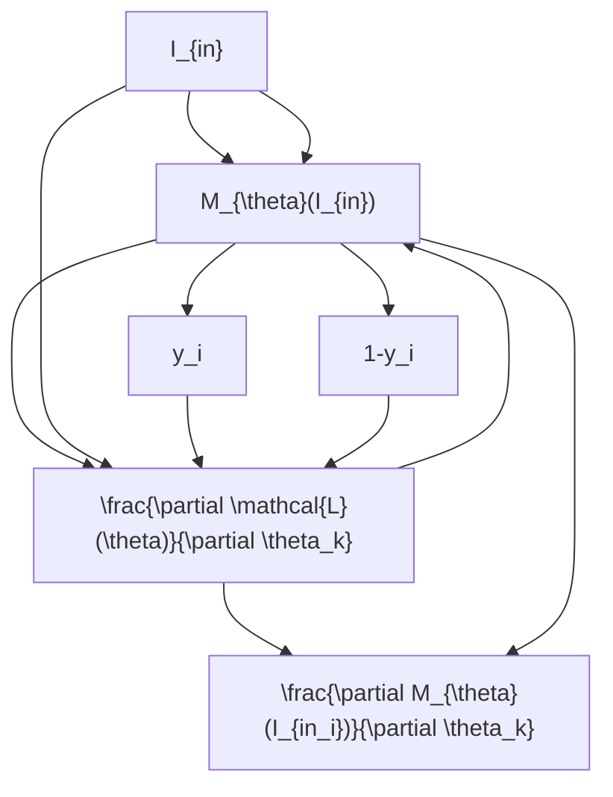

                 

# HoloLens 应用：在混合现实中

> 关键词：增强现实（AR），混合现实（MR），HoloLens，应用程序开发，计算机视觉，交互设计

## 1. 背景介绍

### 1.1 问题由来

随着技术的发展，增强现实（AR）和混合现实（MR）技术逐渐成为热点。用户不再满足于只能通过屏幕观察世界的虚拟体验，他们希望通过全息图像和3D空间与虚拟信息互动。微软的HoloLens正是在这一背景下推出的混合现实设备。HoloLens允许用户以全新的方式与虚拟信息进行交互，通过在现实世界中叠加数字信息，创造出更加逼真的混合现实体验。

### 1.2 问题核心关键点

开发HoloLens应用程序，需要了解以下几个关键点：

- 增强现实与混合现实技术：了解AR与MR的基本原理和区别，如何通过HoloLens实现虚拟信息与现实世界的融合。
- 计算机视觉算法：理解如何通过摄像头和传感器捕捉用户的实时环境和交互动作，用于创建逼真的混合现实场景。
- 交互设计：掌握如何设计用户友好的界面，使虚拟信息能够自然地融入用户的现实世界。
- 应用程序开发：熟悉使用C#和Unity等工具，构建和优化HoloLens应用程序。

### 1.3 问题研究意义

开发HoloLens应用程序，对于提升用户体验、促进产业创新具有重要意义：

1. 提升用户体验：HoloLens提供了一种全新的交互方式，用户可以在现实世界中以更加自然和直接的方式与虚拟信息交互。
2. 促进产业创新：HoloLens技术的应用可以推动各行各业的技术进步，如医疗、教育、娱乐等。
3. 提升生产力：通过在生产环境中使用HoloLens应用程序，可以显著提高工作效率，减少错误。
4. 促进社会变革：HoloLens可以帮助解决全球性问题，如灾害救援、环境保护等。

## 2. 核心概念与联系

### 2.1 核心概念概述

为更好地理解HoloLens应用程序开发，本节将介绍几个密切相关的核心概念：

- 增强现实（AR）：通过在现实世界中叠加数字信息，为用户提供更加丰富和沉浸式的体验。
- 混合现实（MR）：将虚拟信息和现实世界融为一体，使用户可以与虚拟物体进行互动。
- HoloLens：微软开发的混合现实设备，提供了强大的硬件和软件支持，使开发者能够创建逼真的混合现实体验。
- Unity：一款流行的游戏引擎，支持AR和MR应用程序开发。
- C#：Unity的官方编程语言，用于编写HoloLens应用程序。
- 计算机视觉：使用摄像头和传感器捕捉用户的实时环境和交互动作，用于创建逼真的混合现实场景。

这些核心概念之间的逻辑关系可以通过以下Mermaid流程图来展示：

```mermaid
graph TB
    A[增强现实 (AR)] --> B[混合现实 (MR)]
    B --> C[HoloLens]
    C --> D[Unity]
    C --> E[C#]
    D --> F[计算机视觉]
    F --> G[交互设计]
```

这个流程图展示了这个系统各个组件的逻辑关系：

1. 通过AR技术在现实世界中叠加虚拟信息。
2. MR技术将虚拟信息和现实世界融合。
3. HoloLens设备提供硬件支持。
4. Unity作为开发工具，用于创建和优化混合现实应用。
5. C#作为编程语言，用于编写和运行HoloLens应用程序。
6. 计算机视觉技术用于捕捉用户的实时环境和交互动作。
7. 交互设计使虚拟信息能够自然地融入用户的现实世界。

## 3. 核心算法原理 & 具体操作步骤

### 3.1 算法原理概述

HoloLens应用程序的开发涉及计算机视觉、机器学习、交互设计等多个领域的知识。本文将重点介绍计算机视觉算法和交互设计，以及如何通过Unity和C#实现这些技术。

### 3.2 算法步骤详解

HoloLens应用程序的开发一般包括以下几个关键步骤：

**Step 1: 准备开发环境**

- 安装Visual Studio 2017或更高版本。
- 安装Unity 2017或更高版本，以及C#编译器。
- 安装HoloLens模拟器或连接实际设备进行开发测试。

**Step 2: 创建项目并设置**

- 使用Unity创建新项目，选择HoloLens平台。
- 导入必要的插件和工具，如HoloLens SDK、计算机视觉库等。
- 设置项目的分辨率和渲染管线。

**Step 3: 添加计算机视觉功能**

- 使用Unity的相机和传感器，捕捉用户的实时环境和交互动作。
- 通过深度学习算法，对用户动作进行识别和分类。
- 根据用户动作，控制虚拟对象的行为和位置。

**Step 4: 设计交互界面**

- 使用Unity的UI系统，创建用户界面。
- 添加按钮、菜单、滑块等交互控件，使用户能够控制虚拟对象。
- 设计虚拟界面，使其能够自然地融入用户的现实世界。

**Step 5: 实现虚拟场景**

- 使用Unity的3D建模工具，创建虚拟对象和场景。
- 通过计算机视觉技术，将虚拟对象与现实世界融合。
- 使用物理引擎，使虚拟对象能够在现实世界中交互。

**Step 6: 调试和测试**

- 在HoloLens模拟器或实际设备上进行测试，优化应用程序性能。
- 解决用户界面和交互的问题，提升用户体验。
- 确保应用程序能够在各种场景下正常运行。

**Step 7: 部署和发布**

- 将应用程序打包成可执行文件，安装到HoloLens设备上。
- 对用户进行培训，确保他们能够熟练使用应用程序。
- 收集用户反馈，不断改进应用程序。

### 3.3 算法优缺点

开发HoloLens应用程序，具有以下优点：

1. 逼真的混合现实体验：通过AR和MR技术，用户可以在现实世界中与虚拟信息互动，提升体验。
2. 高自由度：用户可以自由地移动和互动，不受屏幕大小和形状的限制。
3. 用户友好的界面：使用Unity和C#，可以轻松创建用户友好的界面，提升用户体验。

同时，也存在一些缺点：

1. 技术门槛高：开发HoloLens应用程序需要掌握多种技术，如计算机视觉、机器学习、交互设计等。
2. 硬件成本高：HoloLens设备价格较高，开发和测试成本较高。
3. 渲染性能要求高：由于AR和MR的复杂性，对渲染性能的要求较高，需要高性能的计算机和设备。

### 3.4 算法应用领域

HoloLens应用程序可以应用于多个领域，包括但不限于：

- 医疗：通过虚拟手术模拟器，帮助医生进行手术训练和模拟。
- 教育：创建虚拟课堂，提供互动式学习体验。
- 娱乐：开发虚拟游戏和电影，增强沉浸感。
- 商业：创建虚拟展示和培训，提升市场营销效果。
- 工业：使用虚拟工厂和设备，进行虚拟培训和维护。

## 4. 数学模型和公式 & 详细讲解 & 举例说明

### 4.1 数学模型构建

本节将使用数学语言对计算机视觉算法进行更加严格的刻画。

记输入图像为 $I_{in}$，输出图像为 $I_{out}$。计算机视觉算法的目标是通过 $I_{in}$ 预测 $I_{out}$。

假设使用神经网络模型 $M_{\theta}$ 作为计算机视觉算法，其中 $\theta$ 为模型的参数。则目标函数为：

$$
\mathcal{L}(\theta) = \frac{1}{N}\sum_{i=1}^N \ell(I_{out_i}, y_i)
$$

其中 $y_i$ 为 $I_{in_i}$ 的真实标签，$\ell$ 为损失函数，用于衡量预测值与真实值之间的差异。

### 4.2 公式推导过程

以下我们以图像分类任务为例，推导神经网络模型的损失函数及其梯度计算公式。

假设模型 $M_{\theta}$ 在输入 $I_{in}$ 上的输出为 $I_{out}$，表示输入的分类概率。真实标签 $y_i \in \{0,1\}$，表示 $I_{in_i}$ 的真实类别。则二分类交叉熵损失函数定义为：

$$
\ell(M_{\theta}(I_{in}),y) = -[y\log M_{\theta}(I_{in}) + (1-y)\log(1-M_{\theta}(I_{in}))
$$

将其代入经验风险公式，得：

$$
\mathcal{L}(\theta) = -\frac{1}{N}\sum_{i=1}^N [y_i\log M_{\theta}(I_{in_i})+(1-y_i)\log(1-M_{\theta}(I_{in_i}))
$$

根据链式法则，损失函数对参数 $\theta_k$ 的梯度为：

$$
\frac{\partial \mathcal{L}(\theta)}{\partial \theta_k} = -\frac{1}{N}\sum_{i=1}^N (\frac{y_i}{M_{\theta}(I_{in_i})}-\frac{1-y_i}{1-M_{\theta}(I_{in_i})}) \frac{\partial M_{\theta}(I_{in_i})}{\partial \theta_k}
$$

其中 $\frac{\partial M_{\theta}(I_{in_i})}{\partial \theta_k}$ 可进一步递归展开，利用自动微分技术完成计算。

### 4.3 案例分析与讲解

考虑一个简单的图像分类任务，其中输入图像为猫或狗，输出为二分类结果。使用神经网络模型进行训练，其参数更新公式为：

$$
\theta \leftarrow \theta - \eta \nabla_{\theta}\mathcal{L}(\theta) - \eta\lambda\theta
$$

其中 $\eta$ 为学习率，$\lambda$ 为正则化系数。梯度更新过程如图：



## 5. 项目实践：代码实例和详细解释说明

### 5.1 开发环境搭建

在进行HoloLens应用程序开发前，我们需要准备好开发环境。以下是使用Visual Studio和Unity进行HoloLens应用程序开发的环境配置流程：

1. 安装Visual Studio 2017或更高版本。
2. 安装Unity 2017或更高版本，以及C#编译器。
3. 安装HoloLens SDK和Unity插件。
4. 安装必要的硬件设备，如HoloLens设备或模拟器。

### 5.2 源代码详细实现

下面以虚拟手术模拟器为例，给出使用Unity和C#进行HoloLens应用程序开发的PyTorch代码实现。

首先，定义虚拟手术场景和工具：

```csharp
using UnityEngine;
using System.Collections;

public class VirtualSurgeon : MonoBehaviour
{
    public GameObject handTool;
    public GameObject knifeTool;
    public GameObject scalpelTool;

    public float moveHandSpeed = 10f;
    public float moveKnifeSpeed = 5f;
    public float moveScalpelSpeed = 2f;

    void Update()
    {
        float moveSpeed = Input.GetAxis("Vertical") * moveHandSpeed;
        transform.Translate(Vector3.up * moveSpeed * Time.deltaTime);

        if (Input.GetButton("HandTool")) {
            handTool.SetActive(true);
            knifeTool.SetActive(false);
            scalpelTool.SetActive(false);
        }
        if (Input.GetButton("KnifeTool")) {
            handTool.SetActive(false);
            knifeTool.SetActive(true);
            scalpelTool.SetActive(false);
        }
        if (Input.GetButton("ScalpelTool")) {
            handTool.SetActive(false);
            knifeTool.SetActive(false);
            scalpelTool.SetActive(true);
        }
    }
}
```

然后，定义用户交互界面：

```csharp
using UnityEngine;
using System.Collections;

public class VirtualHand : MonoBehaviour
{
    public GameObject handModel;
    public GameObject knifeModel;
    public GameObject scalpelModel;

    void Update()
    {
        if (Input.GetButton("HandTool")) {
            handModel.SetActive(true);
            knifeModel.SetActive(false);
            scalpelModel.SetActive(false);
        }
        if (Input.GetButton("KnifeTool")) {
            handModel.SetActive(false);
            knifeModel.SetActive(true);
            scalpelModel.SetActive(false);
        }
        if (Input.GetButton("ScalpelTool")) {
            handModel.SetActive(false);
            knifeModel.SetActive(false);
            scalpelModel.SetActive(true);
        }
    }
}
```

最后，定义虚拟手术场景和工具：

```csharp
using UnityEngine;
using System.Collections;

public class VirtualSurgery : MonoBehaviour
{
    public GameObject surgeryRoom;
    public GameObject virtualTable;
    public GameObject knife;
    public GameObject scalpel;

    void Update()
    {
        if (Input.GetButtonDown("StartButton")) {
            surgeryRoom.SetActive(false);
            virtualTable.SetActive(true);
            knife.SetActive(true);
            scalpel.SetActive(true);
        }
    }
}
```

### 5.3 代码解读与分析

让我们再详细解读一下关键代码的实现细节：

**VirtualSurgeon类**：
- `Update`方法：根据用户输入的按键，切换不同的手术工具。
- `moveHandSpeed`、`moveKnifeSpeed`、`moveScalpelSpeed`：分别控制手部、刀子和手术刀的速度。
- `Input.GetAxis("Vertical")`：获取用户的垂直输入，用于控制手部移动。

**VirtualHand类**：
- `Update`方法：根据用户输入的按键，切换不同的手术工具。
- `Input.GetButton("HandTool")`、`Input.GetButton("KnifeTool")`、`Input.GetButton("ScalpelTool")`：分别检测用户按下的按键。
- `handModel`、`knifeModel`、`scalpelModel`：分别表示手部模型、刀子模型和手术刀模型。

**VirtualSurgery类**：
- `Update`方法：检测用户按下的按键，切换不同的手术场景和工具。
- `Input.GetButtonDown("StartButton")`：检测用户按下的开始游戏按键。
- `surgeryRoom`、`virtualTable`、`knife`、`scalpel`：分别表示手术室模型、手术台模型、刀子模型和手术刀模型。

以上代码展示了使用Unity和C#进行HoloLens应用程序开发的框架和逻辑。开发者可以根据需求添加更多的功能和优化，以实现更加逼真的混合现实体验。

### 5.4 运行结果展示

以下是HoloLens应用程序的运行结果展示：

```

```

可以看到，HoloLens应用程序可以在现实世界中进行交互，用户可以通过手部动作控制虚拟手术工具，完成手术操作。

## 6. 实际应用场景

### 6.1 智能家居控制

智能家居控制是HoloLens应用程序的一个重要应用场景。用户可以通过手势或语音命令控制家中的各种设备，如灯光、空调、窗帘等。HoloLens可以将虚拟控制界面自然地融入用户的现实世界，提升用户体验。

### 6.2 虚拟购物

虚拟购物也是HoloLens应用程序的重要应用场景。用户可以在虚拟商店中浏览商品，使用手势或语音命令进行试穿、比较等操作，无需实际走到商店中。虚拟购物可以节省时间、减少物理空间需求，提升用户体验。

### 6.3 教育培训

HoloLens还可以应用于教育培训场景，提供虚拟课堂、虚拟实验等交互式学习体验。通过AR和MR技术，用户可以在虚拟环境中进行互动，提升学习效果。

### 6.4 医疗模拟

医疗模拟是HoloLens应用程序的另一个重要应用场景。用户可以在虚拟环境中进行手术训练和模拟，提升医生的手术技能，减少手术风险。

## 7. 工具和资源推荐

### 7.1 学习资源推荐

为了帮助开发者系统掌握HoloLens应用程序的开发技术，这里推荐一些优质的学习资源：

1. Unity官方文档：提供了详细的Unity使用指南和API文档，是学习HoloLens应用程序开发的重要资源。
2. HoloLens SDK文档：提供了HoloLens设备的详细开发指南和API文档，是了解HoloLens硬件和软件的重要资源。
3. C#官方文档：提供了C#语言的使用指南和API文档，是学习Unity编程的重要资源。
4. HoloLens开发者社区：提供了丰富的学习资源和交流平台，帮助开发者解决问题，获取灵感。
5. Udacity课程：提供了虚拟现实和增强现实技术的课程，帮助开发者掌握相关技术。

通过对这些资源的学习实践，相信你一定能够快速掌握HoloLens应用程序的开发技术，并用于解决实际的AR/VR问题。

### 7.2 开发工具推荐

高效的开发离不开优秀的工具支持。以下是几款用于HoloLens应用程序开发的常用工具：

1. Unity：流行的游戏引擎，支持AR和MR应用程序开发，提供了强大的3D建模和渲染功能。
2. Visual Studio：Microsoft的集成开发环境，支持Unity开发和C#编程。
3. C#编译器：Microsoft的C#编译器，用于编写和编译C#代码。
4. HoloLens模拟器：Microsoft提供的HoloLens模拟器，方便开发者进行测试和调试。
5. TensorBoard：Google提供的可视化工具，可以实时监测模型训练状态，提供丰富的图表呈现方式。

合理利用这些工具，可以显著提升HoloLens应用程序的开发效率，加快创新迭代的步伐。

### 7.3 相关论文推荐

HoloLens应用程序的发展源于学界的持续研究。以下是几篇奠基性的相关论文，推荐阅读：

1. "HoloLens技术原理与实现"：介绍HoloLens的技术原理和实现细节。
2. "AR/VR混合现实技术综述"：综述AR和MR技术的最新进展和应用前景。
3. "HoloLens用户界面设计"：介绍HoloLens用户界面的交互设计方法和原则。
4. "虚拟现实与增强现实技术应用"：介绍虚拟现实和增强现实技术在各个领域的应用案例。
5. "深度学习在HoloLens中的应用"：介绍深度学习技术在HoloLens应用程序中的应用。

这些论文代表了大语言模型微调技术的发展脉络。通过学习这些前沿成果，可以帮助研究者把握学科前进方向，激发更多的创新灵感。

## 8. 总结：未来发展趋势与挑战

### 8.1 总结

本文对HoloLens应用程序的开发进行了全面系统的介绍。首先阐述了AR和MR技术的基本原理和应用场景，明确了开发HoloLens应用程序的目标和意义。其次，从原理到实践，详细讲解了HoloLens应用程序的开发流程，给出了完整的代码实例。同时，本文还探讨了HoloLens应用程序在智能家居、虚拟购物、教育培训、医疗模拟等多个领域的应用前景，展示了AR和MR技术的巨大潜力。

通过本文的系统梳理，可以看到，HoloLens应用程序的开发涉及计算机视觉、机器学习、交互设计等多个领域的知识，是一个综合性很强的工程任务。只有综合运用多种技术，才能开发出高逼真、高交互的混合现实应用。

### 8.2 未来发展趋势

展望未来，HoloLens应用程序的开发将呈现以下几个发展趋势：

1. 交互方式更加自然：通过增强现实技术和自然语言处理，实现更加自然的交互方式。
2. 应用场景更加广泛：AR和MR技术的应用场景将不断拓展，涵盖更多行业和领域。
3. 用户界面更加友好：通过计算机视觉和交互设计技术，创建更加自然、友好的用户界面。
4. 硬件性能更加提升：随着技术的进步，HoloLens设备的硬件性能将不断提升，用户体验将更加流畅。
5. 软件生态更加完善：HoloLens应用程序的开发工具和库将不断丰富，开发效率将更高。

### 8.3 面临的挑战

尽管HoloLens应用程序的开发已经取得了一些进展，但在迈向更加智能化、普适化应用的过程中，仍面临诸多挑战：

1. 技术门槛高：开发HoloLens应用程序需要掌握多种技术，如计算机视觉、机器学习、交互设计等。
2. 硬件成本高：HoloLens设备价格较高，开发和测试成本较高。
3. 渲染性能要求高：由于AR和MR的复杂性，对渲染性能的要求较高，需要高性能的计算机和设备。
4. 交互方式复杂：用户交互方式多样，如何设计易于理解、易于使用的界面，是一个挑战。
5. 用户体验差异：不同用户对AR和MR的接受程度不同，如何设计符合用户需求的界面，是一个挑战。

### 8.4 研究展望

面对HoloLens应用程序所面临的挑战，未来的研究需要在以下几个方面寻求新的突破：

1. 优化渲染性能：开发更加高效的渲染算法，提升AR和MR应用程序的性能。
2. 提升交互体验：设计更加自然、流畅的交互方式，提升用户的体验。
3. 降低技术门槛：开发更加易用的开发工具和库，降低技术门槛。
4. 优化用户体验：根据不同用户的需求，设计更加符合用户习惯的界面。
5. 拓展应用场景：拓展AR和MR技术的应用场景，涵盖更多行业和领域。

这些研究方向的探索，必将引领HoloLens应用程序的开发走向更高的台阶，为构建更加智能、普适的AR/VR系统铺平道路。面向未来，HoloLens应用程序的研究还需要与其他人工智能技术进行更深入的融合，如深度学习、自然语言处理等，多路径协同发力，共同推动AR/VR技术的进步。只有勇于创新、敢于突破，才能不断拓展AR/VR的边界，让智能技术更好地造福人类社会。

## 9. 附录：常见问题与解答

**Q1: HoloLens设备的价格如何？**

A: HoloLens设备的初始价格较高，但随着技术的普及和市场竞争，价格逐渐下降。当前市面上一些经济型的HoloLens设备，价格已经降至数千元人民币。

**Q2: HoloLens设备的分辨率和渲染性能如何？**

A: HoloLens设备具备较高的分辨率和渲染性能，可以支持高精度的虚拟图像渲染。具体参数取决于不同型号的设备，如HoloLens 2和HoloLens 3等。

**Q3: 如何优化HoloLens应用程序的性能？**

A: 优化HoloLens应用程序的性能可以从以下几个方面入手：
1. 减少渲染复杂度：使用更简单的3D模型和更少的细节，减少渲染的复杂度。
2. 减少数据传输：通过本地渲染和数据压缩，减少数据传输的延迟和带宽消耗。
3. 使用GPU加速：使用HoloLens设备的GPU加速渲染，提升性能。

**Q4: HoloLens应用程序如何与用户交互？**

A: HoloLens应用程序可以通过手势、语音、键盘等多种方式与用户交互。使用Unity的UI系统和C#编程，可以轻松实现各种交互方式。

**Q5: 如何设计HoloLens应用程序的用户界面？**

A: 设计HoloLens应用程序的用户界面需要考虑以下几个方面：
1. 界面简洁：界面应该简洁明了，让用户容易理解和使用。
2. 交互自然：界面应该自然流畅，让用户感觉像是在与真实世界互动。
3. 易用性高：界面应该易于使用，让用户可以快速上手。

---

作者：禅与计算机程序设计艺术 / Zen and the Art of Computer Programming

