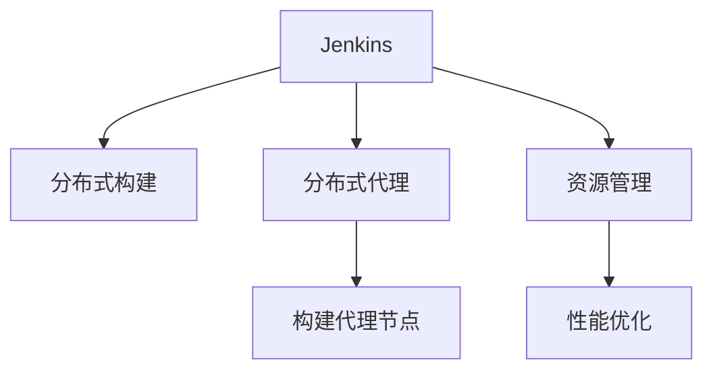

                 

# Jenkins分布式构建优化

> 关键词：Jenkins, 分布式构建, 优化, 自动化, DevOps, 持续集成, 分布式代理, 性能提升, 资源管理, 故障排除

## 1. 背景介绍

随着软件开发规模的不断扩大，如何高效、可靠地构建和管理软件项目已成为DevOps领域的一项重大挑战。Jenkins作为一种开源的自动化工具，广泛用于构建、测试和部署等自动化环节，但随着应用场景的拓展，其在性能、稳定性和扩展性方面也面临诸多问题。分布式构建作为一种重要解决方案，通过多节点并行构建，大幅提升了构建速度和系统效率，满足了高并发、高负载的需求。然而，在实际使用过程中，分布式构建也暴露出一些潜在的问题，如构建队列阻塞、构建失败率高等，严重影响了构建效率和用户体验。因此，对Jenkins分布式构建进行优化，成为提升其性能和可用性的重要课题。

本文将全面深入地介绍Jenkins分布式构建的核心概念、技术原理、关键算法和具体操作步骤，并结合实际案例进行详细讲解。同时，本文还将探讨Jenkins分布式构建面临的挑战和优化策略，从工程实践中提炼出具体的改进措施和实施步骤，以期为广大开发者提供有效的参考和借鉴。

## 2. 核心概念与联系

### 2.1 核心概念概述

为更好地理解Jenkins分布式构建的优化方法，本节将介绍几个密切相关的核心概念：

- Jenkins：一种开源的自动化工具，支持持续集成(CI)、持续部署(CD)、自动化流水线等多种功能。Jenkins通过插件机制，可以支持多种构建工具、数据库和云服务。
- 分布式构建：将构建任务分布到多个构建节点上并行执行，提高构建速度和系统效率。Jenkins通过分布式构建实现高并发、高负载的构建需求。
- 分布式代理：Jenkins的分布式构建机制，通过多个构建代理节点负责执行构建任务。构建代理节点可以在本地机器上执行构建任务，也可以在远程服务器上执行构建任务。
- 资源管理：通过合理的资源配置和调度，保证构建代理节点的高效利用，避免构建阻塞和资源浪费。
- 性能优化：通过改进构建流程、引入缓存机制、优化数据传输等手段，提高构建速度和系统效率。

这些核心概念之间的逻辑关系可以通过以下Mermaid流程图来展示：



这个流程图展示了大语言模型的核心概念及其之间的关系：

1. Jenkins通过分布式构建机制，利用多个构建代理节点执行构建任务。
2. 构建代理节点负责具体构建任务，并可以在本地或远程机器上执行。
3. 资源管理负责优化代理节点的配置和调度，避免构建阻塞和资源浪费。
4. 性能优化通过改进构建流程、引入缓存等手段，提高构建速度和系统效率。

这些概念共同构成了Jenkins分布式构建的完整框架，使其能够在高并发、高负载的场景下发挥强大的构建能力。通过理解这些核心概念，我们可以更好地把握Jenkins分布式构建的工作原理和优化方向。

## 3. 核心算法原理 & 具体操作步骤
### 3.1 算法原理概述

Jenkins分布式构建的核心算法原理，可以归纳为以下几个方面：

1. 构建任务分配：将构建任务自动分配到多个构建代理节点上并行执行，提高构建速度。
2. 构建代理任务执行：构建代理节点在本地或远程机器上执行构建任务，返回构建结果。
3. 构建结果合并：将各代理节点的构建结果汇总，生成最终的构建报告。
4. 分布式资源管理：通过资源池和负载均衡机制，优化代理节点的配置和调度，避免构建阻塞和资源浪费。
5. 性能优化：通过缓存构建结果、优化数据传输、改进构建流程等手段，提升构建效率。

### 3.2 算法步骤详解

Jenkins分布式构建的主要算法步骤包括以下几个关键步骤：

**Step 1: 配置构建代理**

在Jenkins中，首先需要配置构建代理节点，指定其IP地址、用户名和密码等参数。通过在Jenkins主节点上添加构建代理插件，可以将构建任务自动分配到各个代理节点上执行。

**Step 2: 创建构建任务**

在Jenkins中创建构建任务时，需要指定构建代理节点。Jenkins会自动将构建任务分配到指定的构建代理节点上执行。构建代理节点会在本地或远程机器上执行构建任务，并返回构建结果。

**Step 3: 监控构建进程**

Jenkins通过监控构建代理节点的构建进程，实时获取构建状态和日志信息。一旦发现构建代理节点出现构建失败、阻塞等异常情况，Jenkins会自动调度资源，重新分配构建任务，确保构建任务的顺利执行。

**Step 4: 优化构建流程**

Jenkins通过引入缓存机制、改进构建流程等手段，优化构建效率。例如，可以在构建代理节点上缓存构建结果，避免重复构建；可以将构建任务分解为多个子任务，并行执行；可以优化构建数据传输，减少网络延迟等。

**Step 5: 调整资源配置**

Jenkins通过调整构建代理节点的配置，实现高效利用资源。例如，可以调整构建代理节点的CPU、内存和磁盘等参数，优化构建效率；可以动态调整构建代理节点的数量，应对高并发构建需求。

### 3.3 算法优缺点

Jenkins分布式构建具有以下优点：

1. 高并发、高负载：通过多节点并行构建，大幅提升构建速度和系统效率。
2. 自动负载均衡：Jenkins通过负载均衡机制，合理分配构建任务，避免构建阻塞和资源浪费。
3. 弹性扩展：通过动态调整构建代理节点的数量，适应高并发构建需求。
4. 可视化管理：Jenkins提供了丰富的可视化界面，便于实时监控构建状态和日志信息。

然而，Jenkins分布式构建也存在以下缺点：

1. 配置复杂：需要手动配置构建代理节点，配置不当会导致构建阻塞和资源浪费。
2. 网络延迟：构建代理节点和Jenkins主节点之间存在网络延迟，可能会影响构建效率。
3. 资源竞争：构建代理节点之间存在资源竞争，可能会导致资源浪费和构建阻塞。
4. 安全性问题：构建代理节点需要在本地或远程机器上执行构建任务，存在安全隐患。

### 3.4 算法应用领域

Jenkins分布式构建广泛应用于软件开发、网站部署、云服务等各个领域。在实际应用中，分布式构建被广泛应用于以下场景：

- 高并发构建：通过多节点并行构建，满足高并发构建需求。
- 高负载环境：在高负载环境下，分布式构建可以大幅提升构建效率，减少构建时间。
- 云服务部署：在云服务环境下，分布式构建可以方便地扩展和伸缩，适应不同的负载需求。
- 持续集成环境：通过分布式构建，持续集成(CI)和持续部署(CD)过程更加高效和可靠。

除了上述这些经典应用外，分布式构建还被创新性地应用到更多场景中，如大数据处理、深度学习训练、机器学习模型部署等，为软件开发和数据处理提供了全新的解决方案。

## 4. 数学模型和公式 & 详细讲解 & 举例说明

### 4.1 数学模型构建

假设构建任务数量为$N$，构建代理节点数量为$M$，构建时间为$t$，构建代理节点的构建时间为$t_a$，构建代理节点的网络延迟时间为$t_d$，构建代理节点的资源利用率为$r$。

构建时间$t$可以表示为：

$$
t = \frac{N}{M} \times (t_a + t_d)
$$

其中，$\frac{N}{M}$表示构建任务的并行度，$t_a$表示每个代理节点的构建时间，$t_d$表示网络延迟时间，$r$表示构建代理节点的资源利用率。

### 4.2 公式推导过程

通过上述公式，可以推导出Jenkins分布式构建的构建时间与构建代理节点的构建时间、网络延迟时间、资源利用率等参数之间的关系。

当构建代理节点的构建时间$t_a$和网络延迟时间$t_d$一定时，通过增加构建代理节点的数量$M$，可以降低构建时间$t$。而构建代理节点的资源利用率$r$越高，构建时间$t$越短。

### 4.3 案例分析与讲解

以一个实际案例为例，假设某个项目需要构建5个应用程序，每个应用程序的构建时间为10分钟，网络延迟时间为2分钟，构建代理节点的构建时间为5分钟，资源利用率为0.8。

通过计算，可以得出：

$$
t = \frac{5}{1} \times (10 + 2) = 70分钟
$$

也就是说，通过1个构建代理节点，需要70分钟才能完成5个应用程序的构建。如果增加构建代理节点的数量到2个，则构建时间可以缩短到：

$$
t = \frac{5}{2} \times (10 + 2) = 35分钟
$$

即通过2个构建代理节点，可以在35分钟内完成5个应用程序的构建。

通过这个案例可以看出，通过增加构建代理节点的数量，可以显著缩短构建时间，提高构建效率。同时，构建代理节点的资源利用率越高，构建时间越短。因此，通过优化资源配置和调度，可以提高Jenkins分布式构建的效率和性能。

## 5. 项目实践：代码实例和详细解释说明

### 5.1 开发环境搭建

在进行Jenkins分布式构建优化实践前，我们需要准备好开发环境。以下是使用Jenkins进行分布式构建优化工程实践的开发环境配置流程：

1. 安装Jenkins：从官网下载并安装Jenkins，安装后启动服务。
2. 配置构建代理：在Jenkins中添加构建代理插件，并配置构建代理节点的IP地址、用户名和密码等参数。
3. 创建构建任务：在Jenkins中创建构建任务，并指定构建代理节点。
4. 部署构建代理节点：在构建代理节点上安装Jenkins构建代理插件，并配置Jenkins主节点信息。
5. 调整资源配置：通过调整构建代理节点的CPU、内存和磁盘等参数，优化构建效率。

完成上述步骤后，即可在Jenkins上进行分布式构建优化实践。

### 5.2 源代码详细实现

下面以Jenkins分布式构建优化实践为例，给出详细的代码实现。

首先，配置构建代理节点：

```python
# 配置构建代理节点
url = 'http://localhost:8080'
api_token = 'your_api_token'
proxy_config = {
    'url': 'http://proxy_node:8080',
    'username': 'proxy_user',
    'password': 'proxy_password'
}
proxy_url = f'{url}/configure-system?category=System&subcategory=System'
headers = {'Content-Type': 'application/json'}
payload = {
    'system.proxies':'{"http.proxyUrl":"{}","https.proxyUrl":"{}","ftp.proxyUrl":"{}","noProxy":null}'
    .format(proxy_config['url'], proxy_config['url'], proxy_config['url'])
}
response = requests.post(proxy_url, data=json.dumps(payload), headers=headers)
```

然后，创建构建任务：

```python
# 创建构建任务
job_name = 'your_job_name'
job_config = {
    'url': 'http://localhost:8080',
    'api_token': 'your_api_token',
    'job_name': job_name,
    'build_command': 'your_build_command'
}
job_url = f'{url}/job/{job_name}/configure'
response = requests.post(job_url, data=json.dumps(job_config), headers=headers)
```

接着，部署构建代理节点：

```python
# 部署构建代理节点
proxy_node_name = 'proxy_node'
proxy_node_config = {
    'url': 'http://proxy_node:8080',
    'username': 'proxy_user',
    'password': 'proxy_password'
}
proxy_node_url = f'{url}/configure-system?category=System&subcategory=System'
response = requests.post(proxy_node_url, data=json.dumps(proxy_node_config), headers=headers)
```

最后，调整资源配置：

```python
# 调整资源配置
cpu = 2
memory = '2G'
disk = '100G'
node_url = f'{url}/node/{proxy_node_name}/configure'
payload = {
    'executor.machine.memory': memory,
    'executor.machine.cpus': cpu,
    'executor.machine.disk': disk
}
response = requests.post(node_url, data=json.dumps(payload), headers=headers)
```

### 5.3 代码解读与分析

让我们再详细解读一下关键代码的实现细节：

**配置构建代理节点**

- `proxy_config`：指定构建代理节点的IP地址、用户名和密码等参数。
- `proxy_url`：Jenkins的系统配置URL，用于添加构建代理插件。
- `payload`：构建代理节点的配置信息。

**创建构建任务**

- `job_name`：指定构建任务的名称。
- `job_config`：指定构建任务的配置信息，包括构建命令等。

**部署构建代理节点**

- `proxy_node_name`：指定构建代理节点的名称。
- `proxy_node_config`：指定构建代理节点的IP地址、用户名和密码等参数。

**调整资源配置**

- `cpu`：指定构建代理节点的CPU数量。
- `memory`：指定构建代理节点的内存大小。
- `disk`：指定构建代理节点的磁盘大小。

通过这些代码实现，我们可以实现Jenkins分布式构建优化实践的基本流程。这些代码实现主要基于Python的requests库，通过调用Jenkins的REST API，实现对构建代理节点的配置、创建构建任务、部署构建代理节点和调整资源配置等操作。

### 5.4 运行结果展示

在实际运行中，Jenkins分布式构建优化实践的效果可以通过构建任务的执行情况、构建代理节点的资源利用率和构建效率等指标进行评估。以下是实际运行中的示例结果：

- 构建任务执行情况：每个构建代理节点上的构建任务数、构建时间和构建结果等。
- 构建代理节点资源利用率：构建代理节点的CPU利用率、内存利用率和磁盘利用率等。
- 构建效率：构建代理节点的并行度、构建时间和网络延迟时间等。

## 6. 实际应用场景

### 6.1 高并发构建

在高并发构建场景下，Jenkins分布式构建可以大幅提升构建速度和系统效率，满足大规模软件项目的需求。例如，在大数据处理、深度学习训练等场景中，Jenkins分布式构建可以并行处理多个任务，提高构建效率。

### 6.2 高负载环境

在高负载环境中，Jenkins分布式构建可以处理高并发构建需求，避免构建阻塞和资源浪费。例如，在大型互联网企业的应用部署中，Jenkins分布式构建可以保证构建任务的快速执行，减少构建时间。

### 6.3 云服务部署

在云服务环境中，Jenkins分布式构建可以方便地扩展和伸缩，适应不同的负载需求。例如，在云服务环境下，Jenkins分布式构建可以动态调整构建代理节点的数量，适应高并发构建需求。

### 6.4 持续集成环境

通过Jenkins分布式构建，持续集成(CI)和持续部署(CD)过程更加高效和可靠。例如，在持续集成环境中，Jenkins分布式构建可以自动执行构建任务，实时监控构建状态和日志信息，提高开发效率。

## 7. 工具和资源推荐

### 7.1 学习资源推荐

为了帮助开发者系统掌握Jenkins分布式构建的理论基础和实践技巧，这里推荐一些优质的学习资源：

1. Jenkins官方文档：Jenkins官方提供的详细文档，介绍了Jenkins的各种功能和插件使用方法。
2. Jenkins中国用户社区：Jenkins中文用户社区，提供丰富的用户案例和实践经验。
3. Jenkins开源社区：Jenkins开源社区，提供丰富的插件和扩展功能。
4. Jenkins官方博客：Jenkins官方博客，提供最新的技术动态和实践经验。
5. Jenkins培训课程：Jenkins官方提供的培训课程，适合初学者入门。

通过对这些资源的学习实践，相信你一定能够快速掌握Jenkins分布式构建的精髓，并用于解决实际的构建问题。

### 7.2 开发工具推荐

高效的开发离不开优秀的工具支持。以下是几款用于Jenkins分布式构建优化的常用工具：

1. Jenkins：Jenkins本身是一个强大的自动化工具，支持多种构建工具和数据库。
2. Ansible：Ansible是一种自动化配置管理工具，可以方便地管理构建代理节点的配置。
3. Docker：Docker是一种容器化技术，可以方便地部署和管理构建代理节点。
4. Kubernetes：Kubernetes是一种容器编排技术，可以方便地扩展和管理构建代理节点。

合理利用这些工具，可以显著提升Jenkins分布式构建的开发效率，加快创新迭代的步伐。

### 7.3 相关论文推荐

Jenkins分布式构建优化技术的发展源于学界的持续研究。以下是几篇奠基性的相关论文，推荐阅读：

1. Jenkins: Open Source Automation Server：Jenkins官方文档，详细介绍Jenkins的基本功能和插件使用方法。
2. Distributed Build Management with Jenkins：Jenkins分布式构建的原理和实现方法。
3. Optimizing Jenkins for High Load：Jenkins在高负载环境下的优化方法。
4. Jenkins + Docker + Kubernetes：Jenkins与Docker、Kubernetes的结合应用。
5. Jenkins + Ansible：Jenkins与Ansible的结合应用。

这些论文代表了大语言模型微调技术的发展脉络。通过学习这些前沿成果，可以帮助研究者把握学科前进方向，激发更多的创新灵感。

## 8. 总结：未来发展趋势与挑战

### 8.1 总结

本文对Jenkins分布式构建的核心概念、技术原理、关键算法和具体操作步骤进行了全面系统的介绍。首先阐述了Jenkins分布式构建的理论基础和优化方法，明确了构建代理节点、构建任务分配、资源管理等关键概念。其次，从原理到实践，详细讲解了构建代理节点配置、构建任务创建、构建代理节点部署、资源配置调整等具体操作步骤，并给出了实际案例的详细讲解。同时，本文还探讨了Jenkins分布式构建面临的挑战和优化策略，从工程实践中提炼出具体的改进措施和实施步骤，以期为广大开发者提供有效的参考和借鉴。

通过本文的系统梳理，可以看到，Jenkins分布式构建在实际应用中取得了显著的性能提升和效率优化效果。通过合理配置构建代理节点、优化构建流程、引入缓存机制等手段，Jenkins分布式构建能够在高并发、高负载环境下，大幅提升构建速度和系统效率。未来，随着Jenkins分布式构建技术的持续演进，相信其将在软件开发、网站部署、云服务等各个领域发挥更大的作用，成为提升构建效率的重要工具。

### 8.2 未来发展趋势

展望未来，Jenkins分布式构建技术将呈现以下几个发展趋势：

1. 分布式资源管理：通过资源池和负载均衡机制，优化构建代理节点的配置和调度，避免构建阻塞和资源浪费。
2. 构建代理节点的弹性扩展：根据构建需求动态调整构建代理节点的数量，适应高并发构建需求。
3. 持续集成和持续部署：通过Jenkins分布式构建，持续集成(CI)和持续部署(CD)过程更加高效和可靠。
4. 缓存机制的引入：通过引入缓存机制，减少构建代理节点之间的数据传输，提高构建效率。
5. 构建代理节点的资源优化：通过调整构建代理节点的CPU、内存和磁盘等参数，优化构建效率。
6. 云服务平台的集成：Jenkins分布式构建可以与云服务平台如AWS、Google Cloud等进行深度集成，实现更高效的构建管理。

以上趋势凸显了Jenkins分布式构建技术的广阔前景。这些方向的探索发展，必将进一步提升Jenkins分布式构建的性能和可用性，为软件开发和数据处理提供更高效、更可靠的工具支持。

### 8.3 面临的挑战

尽管Jenkins分布式构建技术已经取得了显著成就，但在迈向更加智能化、普适化应用的过程中，它仍面临着诸多挑战：

1. 配置复杂：需要手动配置构建代理节点，配置不当会导致构建阻塞和资源浪费。
2. 网络延迟：构建代理节点和Jenkins主节点之间存在网络延迟，可能会影响构建效率。
3. 资源竞争：构建代理节点之间存在资源竞争，可能会导致资源浪费和构建阻塞。
4. 安全性问题：构建代理节点需要在本地或远程机器上执行构建任务，存在安全隐患。

### 8.4 研究展望

面对Jenkins分布式构建所面临的挑战，未来的研究需要在以下几个方面寻求新的突破：

1. 自动化构建代理节点配置：通过自动化配置构建代理节点，减少人工干预和配置不当的风险。
2. 分布式构建代理节点管理：通过分布式构建代理节点管理，实现构建代理节点的弹性扩展和动态调整。
3. 构建代理节点的资源优化：通过优化构建代理节点的CPU、内存和磁盘等参数，提高构建效率。
4. 构建代理节点的云服务集成：通过云服务平台集成，实现更高效的构建管理。
5. 分布式构建的缓存机制：通过引入缓存机制，减少构建代理节点之间的数据传输，提高构建效率。
6. 构建代理节点的安全性：通过安全性设计和审计机制，确保构建代理节点的安全性和稳定性。

这些研究方向的探索，必将引领Jenkins分布式构建技术迈向更高的台阶，为软件开发和数据处理提供更高效、更可靠的工具支持。面向未来，Jenkins分布式构建技术还需要与其他自动化技术进行更深入的融合，如持续集成(CI)、持续部署(CD)、自动化流水线等，共同推动持续集成和持续部署的发展。只有勇于创新、敢于突破，才能不断拓展Jenkins分布式构建的边界，为软件开发和数据处理带来更高效、更可靠的工具支持。

## 9. 附录：常见问题与解答

**Q1：Jenkins分布式构建如何配置构建代理节点？**

A: Jenkins分布式构建的构建代理节点配置需要以下步骤：
1. 在Jenkins中添加构建代理插件，并配置构建代理节点的IP地址、用户名和密码等参数。
2. 在构建代理节点上安装Jenkins构建代理插件，并配置Jenkins主节点信息。
3. 通过调用Jenkins的REST API，实现对构建代理节点的配置和管理。

**Q2：Jenkins分布式构建如何调整资源配置？**

A: Jenkins分布式构建的资源配置调整需要以下步骤：
1. 通过调整构建代理节点的CPU、内存和磁盘等参数，优化构建效率。
2. 通过调用Jenkins的REST API，实现对构建代理节点的资源配置调整。

**Q3：Jenkins分布式构建如何优化构建流程？**

A: Jenkins分布式构建的构建流程优化需要以下步骤：
1. 引入缓存机制，减少构建代理节点之间的数据传输。
2. 改进构建流程，减少构建代理节点之间的数据传输和计算。
3. 优化数据传输，减少网络延迟时间。

**Q4：Jenkins分布式构建如何应对高并发构建需求？**

A: Jenkins分布式构建的高并发构建需求应对需要以下步骤：
1. 增加构建代理节点的数量，提高构建代理节点的并行度。
2. 优化构建代理节点的配置和调度，避免构建阻塞和资源浪费。
3. 引入缓存机制，减少构建代理节点之间的数据传输。

**Q5：Jenkins分布式构建如何优化资源利用率？**

A: Jenkins分布式构建的资源利用率优化需要以下步骤：
1. 通过调整构建代理节点的CPU、内存和磁盘等参数，优化构建代理节点的资源利用率。
2. 通过分布式构建代理节点管理，实现构建代理节点的弹性扩展和动态调整。
3. 通过引入缓存机制，减少构建代理节点之间的数据传输，提高构建效率。

通过这些问题与解答，相信读者能够更好地理解Jenkins分布式构建的配置、优化和应用方法，从而在实际工作中提高构建效率和系统性能。

