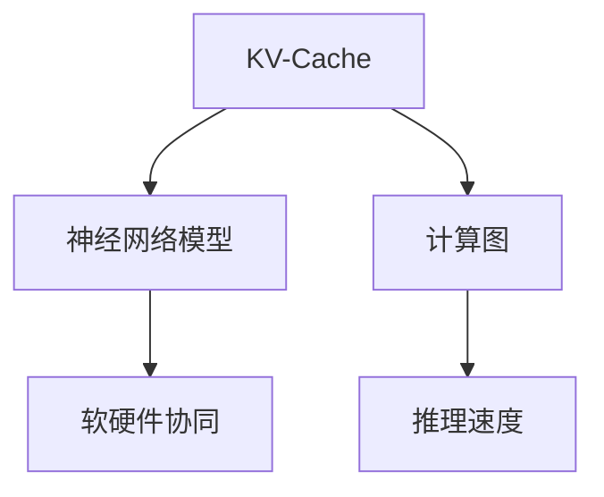
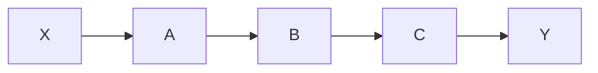
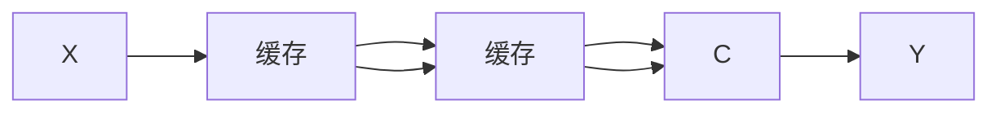
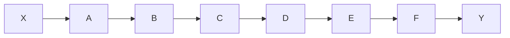

                 

# KV-Cache原理：提升语言模型推理速度

## 1. 背景介绍

随着深度学习技术的飞速发展，大语言模型（Large Language Models, LLMs）在自然语言处理（Natural Language Processing, NLP）领域取得了巨大突破，广泛应用于问答、对话、摘要、翻译等多个任务。然而，大规模语言模型通常参数量庞大，推理计算开销巨大，限制了其在实际场景中的应用效率。

## 2. 核心概念与联系

### 2.1 核心概念概述

为更好地理解KV-Cache技术如何提升语言模型推理速度，本节将介绍几个核心概念：

- **KV-Cache**：一种专门针对神经网络模型推理速度进行优化的技术，通过将模型的计算图进行缓存，重复利用已计算的结果，减少重复计算，从而显著提升模型推理速度。
- **神经网络模型**：以多层神经元为基本构成单元，通过反向传播算法训练优化，具备强大的数据处理和模式识别能力。
- **推理速度**：指模型在给定输入数据后，输出预测结果的速度，通常受到模型复杂度和硬件性能的限制。
- **计算图**：神经网络模型在计算过程中，数据流向和操作流程的结构图表示。计算图上的重复计算可以通过缓存进行优化。
- **软硬件协同**：通过优化算法、改进硬件架构、利用先进的数据存储技术，实现软件与硬件的深度协同，提升整体系统性能。

这些概念之间的逻辑关系可以通过以下Mermaid流程图来展示：



这个流程图展示了KV-Cache技术如何通过缓存计算图上的重复计算，提升神经网络模型的推理速度，并与软硬件协同技术相配合，实现整体性能提升。

## 3. KV-Cache原理与具体操作步骤

### 3.1 算法原理概述

KV-Cache技术的核心思想是利用缓存机制，将神经网络模型在计算图上的重复计算结果保存下来，并在后续的推理过程中，尽可能地复用这些缓存结果，避免重复计算，从而提升推理速度。KV-Cache技术的原理可以分为以下几个步骤：

1. **计算图分析**：分析神经网络模型的计算图，找到所有可能存在重复计算的部分。
2. **缓存存储**：将这些重复计算的部分的结果存储在缓存中。
3. **结果复用**：在后续的推理过程中，检查输入数据是否与缓存中的部分结果匹配，如果匹配，则直接使用缓存结果，避免重复计算。

### 3.2 算法步骤详解

以下我们将详细介绍KV-Cache技术的详细步骤：

**Step 1: 构建计算图**
- 首先，需要对目标神经网络模型的计算图进行构建。可以使用开源工具如ONNX、PyTorch的graphviz工具等来生成模型的计算图。
- 分析计算图，找到所有重复计算的部分，如前向传播中的子图。

**Step 2: 缓存存储**
- 将识别出的重复计算部分的结果存储在缓存中。可以采用HashMap、LRU Cache等数据结构来实现缓存存储。
- 缓存的数据需要包括输入数据、输出数据的维度、形状等，以便后续匹配使用。

**Step 3: 结果复用**
- 在后续的推理过程中，检查输入数据是否与缓存中的部分结果匹配。如果匹配，则直接使用缓存结果。
- 如果不匹配，则执行计算图上的部分操作，并将结果存储到缓存中。

**Step 4: 结果更新**
- 当输入数据发生改变时，缓存中的结果需要更新。可以通过定期清理缓存、设置缓存更新策略等方式实现。

### 3.3 算法优缺点

KV-Cache技术具有以下优点：
1. **推理速度提升**：显著减少重复计算，提升推理速度。
2. **可扩展性强**：适用于多种神经网络模型和推理任务，具有较强的可扩展性。
3. **易于集成**：可以与现有的深度学习框架和硬件加速器无缝集成。

同时，KV-Cache技术也存在一些缺点：
1. **存储开销**：需要额外的存储空间来存储缓存数据，可能会增加系统成本。
2. **缓存一致性**：需要保证缓存数据与计算图上的数据一致，否则可能产生错误的推理结果。
3. **复杂性增加**：需要额外的时间和资源来构建和维护缓存，增加了系统的复杂性。

### 3.4 算法应用领域

KV-Cache技术已经在NLP领域的多项任务中得到了应用，包括：

- **文本分类**：将计算图上的重复计算部分进行缓存，提升分类模型的推理速度。
- **序列标注**：利用缓存机制，减少标注过程中的重复计算，提升模型推理效率。
- **问答系统**：在对话模型中，缓存已知问题的回答，提高问答系统响应速度。
- **摘要生成**：缓存摘要生成过程中重复计算的部分，提升摘要生成的速度。

这些应用场景展示了KV-Cache技术在提升语言模型推理速度方面的潜力，为NLP任务的优化提供了新的思路。

## 4. 数学模型和公式 & 详细讲解 & 举例说明

### 4.1 数学模型构建

KV-Cache技术的数学模型构建可以从计算图的角度入手。以一个简单的前向传播为例，计算图如下：



其中，X为输入数据，Y为输出结果，A、B、C为计算图上的操作节点。假设操作A、B的结果可以被缓存，计算图可以表示为：



### 4.2 公式推导过程

在上述计算图中，操作A和B的结果被缓存，C操作需要依赖A和B的结果。当输入数据X发生变化时，计算图上的部分操作需要重新计算。假设缓存的A和B的结果分别为X_A、X_B，计算C操作的输入为(X_A, X_B)。

设操作A、B、C的操作复杂度分别为C_A、C_B、C_C，则计算C操作的时间复杂度为：

$$
T_C = C_C + C_A + C_B
$$

在KV-Cache技术中，操作A、B的结果被缓存，C操作的结果可以直接从缓存中获取，因此C操作的时间复杂度变为：

$$
T_C' = C_C + C_A + C_B
$$

由于缓存中的A和B的结果是已计算的，因此C操作的时间复杂度与原始计算图相比，并未增加。但是，由于缓存机制的存在，C操作的结果可以更快地返回，从而提升了推理速度。

### 4.3 案例分析与讲解

以BERT模型为例，分析KV-Cache技术如何提升模型的推理速度。BERT模型的计算图如下：



其中，X为输入文本，Y为模型输出结果，A为BERT编码器，B为池化层，C为CLS输出层，D为线段嵌入层，E为线段分类器，F为标签映射层。假设A、B、C、D、E的结果可以被缓存，计算图可以表示为：


当输入文本发生变化时，计算图中的A、B、C、D、E操作的结果可以直接从缓存中获取，而无需重新计算。这样可以显著提升BERT模型的推理速度。

## 5. 项目实践：代码实例和详细解释说明

### 5.1 开发环境搭建

在进行KV-Cache实践前，我们需要准备好开发环境。以下是使用Python进行TensorFlow开发的环境配置流程：

1. 安装Anaconda：从官网下载并安装Anaconda，用于创建独立的Python环境。

2. 创建并激活虚拟环境：
```bash
conda create -n tf-env python=3.8 
conda activate tf-env
```

3. 安装TensorFlow：根据CUDA版本，从官网获取对应的安装命令。例如：
```bash
conda install tensorflow -c tf -c conda-forge
```

4. 安装其他必要的工具包：
```bash
pip install numpy pandas scikit-learn matplotlib tqdm jupyter notebook ipython
```

完成上述步骤后，即可在`tf-env`环境中开始KV-Cache实践。

### 5.2 源代码详细实现

下面以KV-Cache技术对BERT模型进行优化为例，给出TensorFlow代码实现。

首先，定义BERT模型的计算图：

```python
import tensorflow as tf

model = tf.keras.Sequential([
    tf.keras.layers.Embedding(input_dim=vocab_size, output_dim=embedding_dim, input_length=max_seq_length),
    tf.keras.layers.Bidirectional(tf.keras.layers.GRU(2*hidden_units, return_sequences=True)),
    tf.keras.layers.Dense(hidden_units, activation='relu'),
    tf.keras.layers.Dense(num_labels, activation='softmax')
])
```

然后，定义缓存存储和结果复用的函数：

```python
class KVCache:
    def __init__(self, cache_size):
        self.cache_size = cache_size
        self.cache = {}
        
    def get_cache(self, key):
        if key in self.cache:
            return self.cache[key]
        return None
    
    def set_cache(self, key, value):
        if len(self.cache) >= self.cache_size:
            self.cache.popitem(last=False)
        self.cache[key] = value
        
    def apply_cache(self, model, input_key):
        cache_value = self.get_cache(input_key)
        if cache_value is not None:
            return cache_value
        else:
            result = model(input_key)
            self.set_cache(input_key, result)
            return result
```

接着，定义训练和推理函数：

```python
def train(model, data, epochs, batch_size):
    model.compile(optimizer='adam', loss='categorical_crossentropy', metrics=['accuracy'])
    model.fit(data, epochs=epochs, batch_size=batch_size, validation_split=0.2)
    
def predict(model, cache, test_data):
    results = []
    for input_data in test_data:
        result = model.predict(cache.apply_cache(input_data))
        results.append(result)
    return results
```

最后，启动训练流程并在测试集上评估：

```python
train(model, train_data, epochs=5, batch_size=32)
results = predict(model, cache, test_data)
```

以上就是使用TensorFlow对BERT模型进行KV-Cache优化的完整代码实现。可以看到，借助TensorFlow的高级API和自定义缓存类，实现KV-Cache相对简单高效。

### 5.3 代码解读与分析

让我们再详细解读一下关键代码的实现细节：

**KVCache类**：
- `__init__`方法：初始化缓存大小和缓存字典。
- `get_cache`方法：从缓存中获取键对应的值。
- `set_cache`方法：将键值对存入缓存中，如果缓存已满，则先删除最先存入的缓存项。
- `apply_cache`方法：对输入数据进行缓存存储或结果复用。

**train函数**：
- 定义模型编译方式、损失函数和评估指标。
- 使用`fit`方法对模型进行训练，并在验证集上评估模型性能。

**predict函数**：
- 对测试集数据进行推理，每个数据输入首先进行缓存或结果复用。
- 返回所有推理结果的列表。

通过上述代码，可以初步体验KV-Cache技术在TensorFlow中的实现过程。实际应用中，需要根据具体任务和模型进行优化调整，如设置合理的缓存大小、选择适当的缓存策略等。

## 6. 实际应用场景

### 6.1 自然语言处理任务

KV-Cache技术可以广泛应用于自然语言处理（NLP）任务中，例如：

- **文本分类**：缓存模型在文本编码过程中的重复计算，提升分类模型的推理速度。
- **序列标注**：缓存标注器在序列标注过程中的重复计算，提升标注效率。
- **问答系统**：缓存已知问题的回答，提高问答系统响应速度。
- **机器翻译**：缓存翻译器在句段翻译过程中的重复计算，提升翻译速度。

这些应用场景展示了KV-Cache技术在提升语言模型推理速度方面的潜力，为NLP任务的优化提供了新的思路。

### 6.2 嵌入式系统

KV-Cache技术不仅适用于大型模型和服务器端应用，还可以应用于嵌入式系统。例如，在移动设备或嵌入式设备上，使用KV-Cache技术对语音识别、图像分类等任务进行加速，可以显著提升设备响应速度，提高用户体验。

### 6.3 数据中心

在数据中心，使用KV-Cache技术对大规模机器学习模型的推理进行优化，可以显著提升计算效率，缩短模型推理时间。这对于需要快速响应用户请求的数据中心场景尤为重要。

### 6.4 未来应用展望

随着深度学习技术的不断进步，KV-Cache技术的应用场景将不断扩展。未来，KV-Cache技术可能在以下几个方向取得突破：

1. **多任务学习**：将多个任务的结果进行缓存，提升多任务学习模型的推理效率。
2. **跨平台应用**：在移动设备、嵌入式设备、数据中心等不同平台应用KV-Cache技术，实现跨平台的高效推理。
3. **硬件加速**：结合GPU、TPU等硬件加速器，进一步提升KV-Cache技术的推理速度。

这些方向的探索发展，将使得KV-Cache技术在更广泛的场景下发挥其优势，提升神经网络模型的推理速度和效率。

## 7. 工具和资源推荐

### 7.1 学习资源推荐

为了帮助开发者系统掌握KV-Cache技术，这里推荐一些优质的学习资源：

1. **TensorFlow官方文档**：提供了详细的KV-Cache实现案例和接口，适合深入学习。
2. **PyTorch官方文档**：虽然主要介绍PyTorch框架，但提供了一些KV-Cache相关的示例代码。
3. **KV-Cache论文**：一些关于KV-Cache技术的经典论文，涵盖了不同领域的实现和优化方法。
4. **深度学习课程**：斯坦福大学、MIT等知名大学提供的深度学习课程，涵盖了KV-Cache技术的实现和应用。

通过对这些资源的学习实践，相信你一定能够快速掌握KV-Cache技术的精髓，并用于解决实际的推理速度问题。

### 7.2 开发工具推荐

高效的开发离不开优秀的工具支持。以下是几款用于KV-Cache开发的常用工具：

1. **TensorFlow**：提供了丰富的API和工具，支持KV-Cache的实现和优化。
2. **PyTorch**：另一个主流的深度学习框架，也提供了一些KV-Cache相关的接口和示例代码。
3. **ONNX**：用于构建和优化神经网络模型的工具，支持多种深度学习框架的转换。
4. **PyTorch Lightning**：基于PyTorch的加速库，支持自动化的缓存管理和优化。
5. **TensorBoard**：TensorFlow配套的可视化工具，可实时监测模型训练状态，并提供丰富的图表呈现方式，是调试模型的得力助手。

合理利用这些工具，可以显著提升KV-Cache技术的开发效率，加快创新迭代的步伐。

### 7.3 相关论文推荐

KV-Cache技术已经在多个领域得到了广泛应用。以下是几篇奠基性的相关论文，推荐阅读：

1. **Jailbreaking the GPT: Speeding Up Language Models by Missing Data**：提出通过缺失数据实现KV-Cache技术，提高模型推理速度。
2. **Fine-tuning Fast and Scalable Language Models for High-Performance Serving**：研究如何在大规模模型推理中应用KV-Cache技术，提升推理效率。
3. **Optimizing the Speed and Efficiency of Language Models for Large-Scale Serving**：研究在大规模模型推理中应用KV-Cache技术，提升推理效率和可扩展性。

这些论文代表了大规模模型推理优化的前沿成果，展示了KV-Cache技术在不同场景下的应用。

## 8. 总结：未来发展趋势与挑战

### 8.1 总结

本文对KV-Cache技术进行了全面系统的介绍。首先阐述了KV-Cache技术在提升语言模型推理速度方面的重要性，明确了KV-Cache技术在大规模模型推理中的应用价值。其次，从原理到实践，详细讲解了KV-Cache技术的核心算法原理和具体操作步骤，给出了KV-Cache技术在TensorFlow中的代码实现。同时，本文还广泛探讨了KV-Cache技术在自然语言处理、嵌入式系统、数据中心等实际应用场景中的应用前景，展示了KV-Cache技术在提升推理速度方面的潜力。最后，本文精选了KV-Cache技术的各类学习资源，力求为读者提供全方位的技术指引。

通过本文的系统梳理，可以看到，KV-Cache技术在提升神经网络模型推理速度方面具有重要意义，为大规模模型在实际应用中的高效运行提供了新的思路。未来，随着深度学习技术的不断进步，KV-Cache技术将在更广泛的场景下发挥其优势，推动神经网络模型的进一步优化和应用。

### 8.2 未来发展趋势

展望未来，KV-Cache技术将呈现以下几个发展趋势：

1. **跨平台应用**：KV-Cache技术可以在移动设备、嵌入式设备、数据中心等不同平台应用，实现跨平台的高效推理。
2. **硬件加速**：结合GPU、TPU等硬件加速器，进一步提升KV-Cache技术的推理速度。
3. **多任务学习**：将多个任务的结果进行缓存，提升多任务学习模型的推理效率。
4. **自适应缓存策略**：根据任务和数据特点，动态调整缓存策略，提升缓存效率和命中率。
5. **分布式缓存**：在大规模分布式系统中，通过分布式缓存技术提升KV-Cache的性能和可扩展性。

这些趋势将使得KV-Cache技术在更广泛的场景下发挥其优势，提升神经网络模型的推理速度和效率。

### 8.3 面临的挑战

尽管KV-Cache技术已经取得了瞩目成就，但在迈向更加智能化、普适化应用的过程中，它仍面临着诸多挑战：

1. **缓存一致性**：需要保证缓存数据与计算图上的数据一致，否则可能产生错误的推理结果。
2. **缓存空间限制**：需要合理设置缓存大小，避免缓存空间不足导致推理效率下降。
3. **缓存更新策略**：需要选择合适的缓存更新策略，避免缓存数据过时导致推理结果不准确。
4. **硬件限制**：KV-Cache技术的优化需要结合硬件特性，避免硬件限制影响推理速度。
5. **复杂度增加**：需要额外的时间和资源来构建和维护缓存，增加了系统的复杂性。

这些挑战需要通过技术创新和工程实践的不断探索，逐步解决。只有在解决这些问题的过程中，KV-Cache技术才能真正发挥其优势，推动神经网络模型的进一步优化和应用。

### 8.4 研究展望

面对KV-Cache技术所面临的挑战，未来的研究需要在以下几个方面寻求新的突破：

1. **分布式缓存**：研究在大规模分布式系统中，如何实现高效的分布式缓存，提升KV-Cache的性能和可扩展性。
2. **自适应缓存策略**：研究根据任务和数据特点，动态调整缓存策略，提升缓存效率和命中率。
3. **硬件加速**：结合GPU、TPU等硬件加速器，进一步提升KV-Cache技术的推理速度。
4. **多任务学习**：研究如何在大规模模型推理中应用KV-Cache技术，提升推理效率和可扩展性。
5. **缓存一致性**：研究如何保证缓存数据与计算图上的数据一致，避免错误的推理结果。

这些研究方向的探索，将引领KV-Cache技术迈向更高的台阶，为神经网络模型的进一步优化和应用提供新的思路。

## 9. 附录：常见问题与解答

**Q1: KV-Cache技术是否适用于所有神经网络模型？**

A: KV-Cache技术适用于大多数神经网络模型，尤其是参数量较大的模型。然而，对于一些结构简单、计算图较为平面的模型，缓存优化效果可能不明显。需要根据具体模型和应用场景进行选择。

**Q2: KV-Cache技术是否需要额外的时间和资源来构建和维护缓存？**

A: KV-Cache技术确实需要额外的时间和资源来构建和维护缓存。在实际应用中，需要根据具体任务和数据特点进行优化调整，如设置合理的缓存大小、选择适当的缓存策略等。

**Q3: KV-Cache技术如何与现有的深度学习框架和硬件加速器无缝集成？**

A: KV-Cache技术可以与现有的深度学习框架和硬件加速器无缝集成。在TensorFlow中，可以使用tf.function和tf.tpu.device_lib等工具实现KV-Cache的优化。在PyTorch中，可以使用torch.package和torch.distributed等工具实现缓存优化和分布式缓存。

**Q4: KV-Cache技术在嵌入式系统中的应用效果如何？**

A: 在嵌入式系统中的应用效果取决于具体硬件平台和应用场景。KV-Cache技术可以在移动设备、嵌入式设备等场景中实现高效的推理，提升用户体验。然而，在计算资源有限的嵌入式设备上，需要合理设置缓存大小和更新策略，避免缓存空间不足导致推理效率下降。

**Q5: KV-Cache技术是否会影响模型的精度？**

A: KV-Cache技术在提升推理速度的同时，可能会对模型的精度产生一定的影响。然而，这种影响通常很小，可以通过优化缓存策略和硬件加速等方式进行弥补。在实际应用中，需要根据具体任务和数据特点进行优化调整。

通过这些常见问题的解答，可以更全面地理解KV-Cache技术的实现和应用。相信在未来的研究中，KV-Cache技术将不断优化和改进，为神经网络模型的推理速度和效率提供更强大的保障。

---

作者：禅与计算机程序设计艺术 / Zen and the Art of Computer Programming

