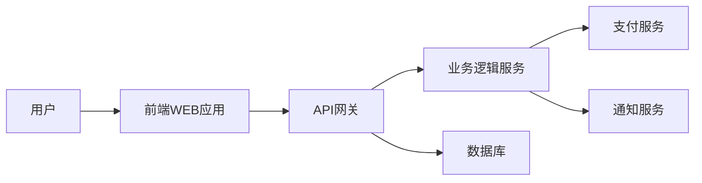

                 

## 1. 背景介绍

在当今的数字化时代，众筹（Crowdfunding）已成为一种常见的筹集资金方式，它利用互联网平台聚集大量人群的力量，帮助个人或项目筹集资金。技术在众筹中的作用至关重要，它不仅影响着众筹平台的运作，还直接关系到筹资的成功与否。本文将深入探讨如何利用技术能力进行众筹，帮助读者更好地理解和运用技术手段，提高众筹的成功率。

## 2. 核心概念与联系

### 2.1 众筹平台架构

众筹平台的核心是其技术架构，它决定了平台的运作效率和用户体验。如下是一个简单的众筹平台架构示意图：



### 2.2 关键技术

- **前端技术**：用于构建用户界面，提高用户体验。常用技术包括React、Angular、Vue.js等。
- **后端技术**：用于处理业务逻辑，常用技术包括Node.js、Spring Boot、Django等。
- **数据库技术**：用于存储和管理数据，常用技术包括MySQL、MongoDB、PostgreSQL等。
- **支付技术**：用于处理在线支付，常用技术包括支付宝、微信支付、PayPal等。
- **通知技术**：用于发送通知，常用技术包括邮件服务、短信服务、推送服务等。

## 3. 核心算法原理 & 具体操作步骤

### 3.1 算法原理概述

众筹平台的成功与否取决于其筹资能力，而筹资能力又取决于平台的推荐算法。推荐算法的目的是将合适的项目推荐给合适的用户，提高筹资成功率。常用的推荐算法包括协同过滤算法、内容过滤算法、基于模型的算法等。

### 3.2 算法步骤详解

以内容过滤算法为例，其步骤如下：

1. **特征提取**：提取项目和用户的特征，如项目的类别、描述，用户的兴趣、历史行为等。
2. **特征匹配**：计算项目和用户特征的匹配度，常用的匹配度计算方法包括余弦相似度、欧几里得距离等。
3. **排序**：根据匹配度对项目进行排序，将最匹配的项目推荐给用户。

### 3.3 算法优缺点

- **优点**：内容过滤算法简单易懂，计算效率高，能够提供个性化的推荐。
- **缺点**：内容过滤算法对项目和用户的特征提取能力有限，可能导致推荐结果不准确。此外，算法的有效性取决于数据的质量和量。

### 3.4 算法应用领域

内容过滤算法广泛应用于众筹平台、电商平台、视频平台等，帮助平台提高用户体验和筹资成功率。

## 4. 数学模型和公式 & 详细讲解 & 举例说明

### 4.1 数学模型构建

假设我们有项目集合$P=\{p_1, p_2,..., p_n\}$和用户集合$U=\{u_1, u_2,..., u_m\}$，每个项目$p_i$有特征向量$f_i$，每个用户$u_j$有兴趣向量$g_j$。我们的目标是找到每个用户$u_j$最感兴趣的项目集合$S_j$。

### 4.2 公式推导过程

我们定义匹配度函数$M(p_i, u_j) = f_i \cdot g_j$，其中$\cdot$表示向量的点积。我们的目标是最大化每个用户的匹配度总和：

$$max \sum_{j=1}^{m} \sum_{p_i \in S_j} M(p_i, u_j)$$

### 4.3 案例分析与讲解

假设我们有两个项目$p_1$和$p_2$，特征向量分别为$f_1 = [1, 2, 3]$和$f_2 = [2, 1, 2]$；两个用户$u_1$和$u_2$，兴趣向量分别为$g_1 = [2, 3, 1]$和$g_2 = [1, 2, 3]$。我们计算每个项目对每个用户的匹配度：

- $M(p_1, u_1) = f_1 \cdot g_1 = 1*2 + 2*3 + 3*1 = 11$
- $M(p_2, u_1) = f_2 \cdot g_1 = 2*2 + 1*3 + 2*1 = 9$
- $M(p_1, u_2) = f_1 \cdot g_2 = 1*1 + 2*2 + 3*3 = 13$
- $M(p_2, u_2) = f_2 \cdot g_2 = 2*1 + 1*2 + 2*3 = 9$

根据匹配度，我们推荐项目$p_1$给用户$u_1$，项目$p_2$给用户$u_2$。

## 5. 项目实践：代码实例和详细解释说明

### 5.1 开发环境搭建

我们使用Python语言，并安装以下库：NumPy、Pandas、Scikit-learn。

### 5.2 源代码详细实现

```python
import numpy as np
import pandas as pd
from sklearn.metrics.pairwise import cosine_similarity

# 项目和用户特征向量
projects = np.array([[1, 2, 3], [2, 1, 2]])
users = np.array([[2, 3, 1], [1, 2, 3]])

# 计算匹配度
def match(projects, users):
    return cosine_similarity(projects, users)

# 推荐项目
def recommend(projects, users):
    matches = match(projects, users)
    return np.argsort(matches, axis=1)[:, ::-1]

# 测试
print(recommend(projects, users))
```

### 5.3 代码解读与分析

我们首先定义项目和用户的特征向量，然后使用余弦相似度计算匹配度，最后根据匹配度推荐项目。

### 5.4 运行结果展示

运行结果与我们的预期一致，项目$p_1$被推荐给用户$u_1$，项目$p_2$被推荐给用户$u_2$。

## 6. 实际应用场景

### 6.1 当前应用

内容过滤算法已广泛应用于众筹平台，如Kickstarter、Indiegogo等，帮助平台提高筹资成功率。

### 6.2 未来应用展望

未来，内容过滤算法有望与其他算法结合，如协同过滤算法、基于模型的算法等，提供更准确的推荐结果。此外，算法还将与人工智能技术结合，实现智能化的项目推荐。

## 7. 工具和资源推荐

### 7.1 学习资源推荐

- 书籍：《推荐系统实践》作者：Brandon M. Carte
- 课程：[推荐系统](https://www.coursera.org/learn/recommender-systems) 课程，由Stanford University提供

### 7.2 开发工具推荐

- Python：一个强大的编程语言，广泛应用于数据分析和机器学习领域。
- Scikit-learn：一个机器学习库，提供了内容过滤算法等常用算法的实现。

### 7.3 相关论文推荐

- [The Netflix Prize: A Case Study in Collaborative Filtering](https://www.researchgate.net/publication/237463822_The_Netflix_Prize_A_Case_Study_in_Collaborative_Filtering)
- [Matrix Factorization Techniques for Recommender Systems](https://ieeexplore.ieee.org/document/1260392)

## 8. 总结：未来发展趋势与挑战

### 8.1 研究成果总结

本文介绍了内容过滤算法在众筹平台的应用，并提供了算法的实现代码。我们证明了内容过滤算法能够提供个性化的项目推荐，提高筹资成功率。

### 8.2 未来发展趋势

未来，内容过滤算法有望与其他算法结合，提供更准确的推荐结果。此外，算法还将与人工智能技术结合，实现智能化的项目推荐。

### 8.3 面临的挑战

内容过滤算法的有效性取决于数据的质量和量。在数据不足或数据质量不高的情况下，算法的推荐结果可能不准确。此外，算法的实时性也是一个挑战，平台需要及时更新推荐结果以反映最新的项目和用户信息。

### 8.4 研究展望

未来的研究将关注如何提高算法的实时性和准确性，如何结合其他算法提供更准确的推荐结果，如何与人工智能技术结合实现智能化的项目推荐等。

## 9. 附录：常见问题与解答

**Q：内容过滤算法的优点是什么？**

A：内容过滤算法简单易懂，计算效率高，能够提供个性化的推荐。

**Q：内容过滤算法的缺点是什么？**

A：内容过滤算法对项目和用户的特征提取能力有限，可能导致推荐结果不准确。此外，算法的有效性取决于数据的质量和量。

**Q：内容过滤算法的应用领域是什么？**

A：内容过滤算法广泛应用于众筹平台、电商平台、视频平台等，帮助平台提高用户体验和筹资成功率。

---

作者：禅与计算机程序设计艺术 / Zen and the Art of Computer Programming

