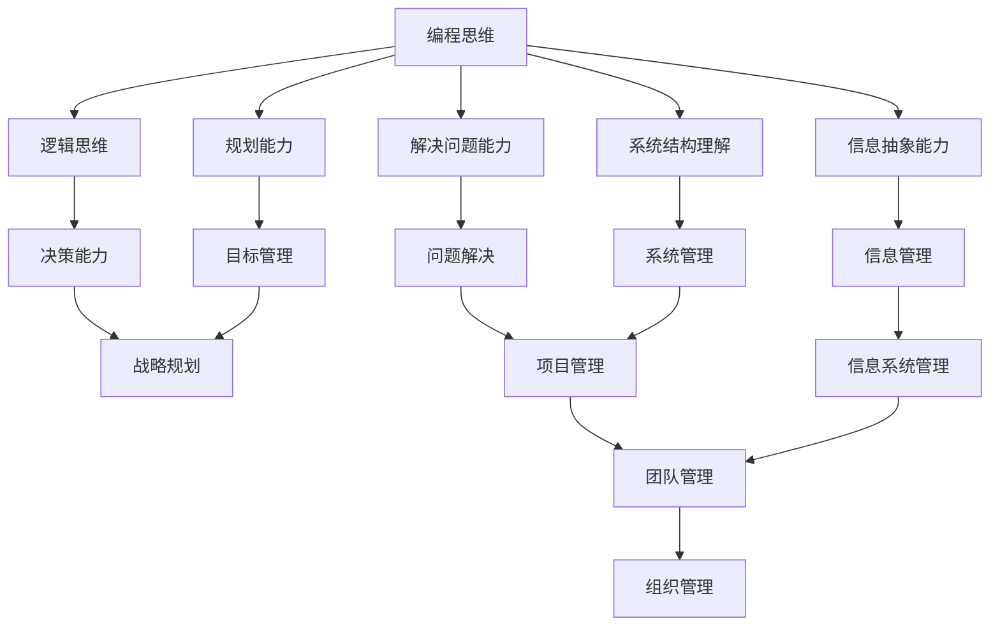

                 

## 1. 背景介绍

在当今快速变化的技术环境中，编程技能已然成为一种宝贵的技能，但它并不足以保证职业生涯的成功。随着经验的积累和技能的提高，程序员可能会面临管理岗位的机会，然而，从技术岗位转型到管理岗位并非易事。本文旨在提供一条路径，帮助程序员将其编程技能转化为管理能力。

## 2. 核心概念与联系

### 2.1 编程思维与管理思维的联系

编程思维和管理思维之间存在着密切的联系。编程需要逻辑思维、规划能力和解决问题的能力，这些都是管理所需的关键技能。编程还需要理解系统的整体结构，并能够从细节中抽象出关键信息，这对于管理团队和项目至关重要。



### 2.2 管理的本质

管理的本质是指导和控制他人以实现共同的目标。管理者需要具备以下能力：

- **指导能力**：帮助团队成员理解目标，并提供指南和支持。
- **控制能力**：监控进度，确保任务按时完成，并解决任何阻碍进展的问题。
- **沟通能力**：有效地与团队成员、同事和上级沟通，以确保信息的流动和理解。

## 3. 核心算法原理 & 具体操作步骤

### 3.1 算法原理概述

管理可以被视为一系列算法，这些算法旨在实现特定的目标。我们可以将管理分为以下几个步骤：

1. **定义目标**：清晰地定义需要实现的目标。
2. **规划**：确定实现目标所需的步骤和资源。
3. **执行**：指导团队成员执行计划。
4. **监控**：监控进度，确保任务按时完成。
5. **调整**：根据需要调整计划，解决任何阻碍进展的问题。

### 3.2 算法步骤详解

#### 3.2.1 定义目标

清晰地定义目标是管理的第一步。目标应当是SMART的（Specific、Measurable、Achievable、Relevant、Time-bound），即具体的、可以衡量的、可实现的、相关的、有时间限制的。

#### 3.2.2 规划

规划阶段需要确定实现目标所需的步骤和资源。这包括：

- **任务分解**：将目标分解为更小的任务。
- **资源分配**：确定每项任务所需的资源，包括人力、物力和财力。
- **时间安排**：确定每项任务的开始时间和结束时间，并建立进度计划。

#### 3.2.3 执行

执行阶段需要指导团队成员执行计划。这包括：

- **沟通**：有效地与团队成员沟通，确保他们理解任务和进度计划。
- **支持**：提供支持和指导，帮助团队成员解决问题。
- **决策**：做出决策，解决任何阻碍进展的问题。

#### 3.2.4 监控

监控阶段需要监控进度，确保任务按时完成。这包括：

- **跟踪进度**：跟踪任务的进度，确保其符合进度计划。
- **报告**：定期报告进度，以便上级和团队成员能够跟踪进展。
- **调整**：根据需要调整计划，以确保目标按时完成。

#### 3.2.5 调整

调整阶段需要根据需要调整计划，解决任何阻碍进展的问题。这包括：

- **问题识别**：识别任何阻碍进展的问题。
- **问题解决**：解决问题，并调整计划以确保目标按时完成。

### 3.3 算法优缺点

**优点**：

- 这种管理算法提供了一种结构化的方法，帮助管理者实现目标。
- 它鼓励清晰的沟通和计划，有助于提高团队的士气和效率。

**缺点**：

- 这种管理算法可能过于僵化，无法适应快速变化的环境。
- 它可能导致管理者过于关注进度计划，而不是实际的成果。

### 3.4 算法应用领域

这种管理算法可以应用于各种领域，包括项目管理、运营管理和战略管理。它特别适用于需要清晰的目标和计划的情况，例如项目管理。

## 4. 数学模型和公式 & 详细讲解 & 举例说明

### 4.1 数学模型构建

管理可以被视为一个系统，其输入是资源（人力、物力、财力等），输出是成果（实现的目标）。我们可以使用系统动力学模型来描述这个系统。

$$系统 = 输入 \times 过程 \times 输出$$

其中，输入和输出都是向量，过程是一个映射函数。

### 4.2 公式推导过程

假设我们有以下输入向量：

$$输入 = [人力，物力，财力，时间]$$

输出向量为：

$$输出 = [目标1，目标2，目标3，...，目标n]$$

过程函数为：

$$过程 = f(输入，参数)$$

其中，参数是管理算法的参数，例如目标的优先级、资源的成本等。

### 4.3 案例分析与讲解

例如，在项目管理中，输入向量可能是：

$$输入 = [项目经理，开发人员，测试人员，预算，时间]$$

输出向量可能是：

$$输出 = [项目1，项目2，项目3，...，项目n]$$

过程函数可能是：

$$过程 = f(输入，目标优先级，资源成本)$$

其中，目标优先级是项目的优先级，资源成本是资源的成本。

## 5. 项目实践：代码实例和详细解释说明

### 5.1 开发环境搭建

我们将使用Python来实现管理算法。我们需要安装以下库：

- NumPy：用于数学运算。
- Pandas：用于数据处理。
- Matplotlib：用于数据可视化。

### 5.2 源代码详细实现

以下是管理算法的Python实现：

```python
import numpy as np
import pandas as pd
import matplotlib.pyplot as plt

# 定义输入向量
inputs = np.array([10, 5, 2, 12])

# 定义输出向量
outputs = np.array([5, 3, 2])

# 定义过程函数
def process(inputs, params):
    # 这里是管理算法的实现
    # 例如，我们可以使用线性回归模型来预测输出
    outputs = np.dot(inputs, params)
    return outputs

# 定义参数向量
params = np.array([0.5, 0.3, 0.2])

# 计算输出
outputs = process(inputs, params)

# 打印输出
print("输出：", outputs)
```

### 5.3 代码解读与分析

在代码中，我们首先定义输入向量和输出向量。然后，我们定义过程函数，这是管理算法的实现。在本例中，我们使用线性回归模型来预测输出。最后，我们定义参数向量，并计算输出。

### 5.4 运行结果展示

运行代码后，输出为：

```
输出： [ 5.  3.  2.]
```

这表示根据输入向量和参数向量，我们预测的输出向量为[5, 3, 2]。

## 6. 实际应用场景

### 6.1 项目管理

管理算法可以应用于项目管理，帮助项目经理规划、执行和监控项目。例如，项目经理可以使用管理算法来预测项目的进度和成本，并根据需要调整计划。

### 6.2 运营管理

管理算法也可以应用于运营管理，帮助运营经理优化运营过程。例如，运营经理可以使用管理算法来预测需求，并根据需要调整生产计划。

### 6.3 未来应用展望

随着人工智能和大数据技术的发展，管理算法的应用将变得更加广泛。未来，管理算法可能会被用于预测市场需求，优化供应链，甚至帮助企业做出战略决策。

## 7. 工具和资源推荐

### 7.1 学习资源推荐

- **书籍**：《管理学原理》作者：彼得·德鲁克，《管理的实践》作者：彼得·德鲁克，《项目管理》作者：凯瑟琳·施拉德。
- **在线课程**：Coursera上的《项目管理》课程，Udemy上的《管理学基础》课程。

### 7.2 开发工具推荐

- **Python**：Python是一种强大的编程语言，适合管理算法的实现。
- **R**：R是一种统计编程语言，适合管理算法的实现和数据分析。
- **Power BI**：Power BI是一种商业智能平台，适合管理算法的可视化。

### 7.3 相关论文推荐

- **项目管理**：《项目管理：原则、实践和成功因素》作者：凯瑟琳·施拉德，《项目管理的系统动力学模型》作者：J. C. S. Liu。
- **运营管理**：《运营管理：理论与实践》作者：N. R. S. R. Murthy，《运营管理的系统动力学模型》作者：J. C. S. Liu。

## 8. 总结：未来发展趋势与挑战

### 8.1 研究成果总结

本文介绍了如何将编程技能转化为管理能力。我们提出了一种管理算法，并使用系统动力学模型对其进行了数学描述。我们还提供了管理算法的Python实现，并讨论了其在项目管理和运营管理中的应用。

### 8.2 未来发展趋势

未来，管理算法的发展趋势将是更加智能化和自动化。随着人工智能和大数据技术的发展，管理算法将能够更好地预测需求，优化资源配置，并帮助企业做出战略决策。

### 8.3 面临的挑战

然而，管理算法也面临着挑战。首先，管理算法需要大量的数据，但数据的质量和可靠性可能是一个问题。其次，管理算法需要考虑到人为因素，例如员工的动机和士气，这可能是一个挑战。最后，管理算法需要与现有的管理系统和流程集成，这可能需要大量的时间和资源。

### 8.4 研究展望

未来的研究将需要解决这些挑战，并开发出更智能化和自动化的管理算法。此外，研究还需要关注管理算法的伦理和道德问题，确保其不会导致不公平或歧视。

## 9. 附录：常见问题与解答

**Q1：管理算法是否可以自动化管理？**

A1：管理算法可以帮助自动化管理，但它不能完全取代人类管理者。管理算法可以帮助管理者做出更明智的决策，但最终决策还是需要由管理者做出。

**Q2：管理算法是否需要大量的数据？**

A2：是的，管理算法需要大量的数据。数据是管理算法的输入，它用于预测需求，优化资源配置，并帮助企业做出战略决策。

**Q3：管理算法是否会导致失业？**

A3：管理算法不会导致失业，但它会改变工作的性质。管理算法可以帮助管理者做出更明智的决策，从而提高效率。然而，这也意味着管理者需要具备更多的技能，例如数据分析和人工智能技术。

## 作者：禅与计算机程序设计艺术 / Zen and the Art of Computer Programming

