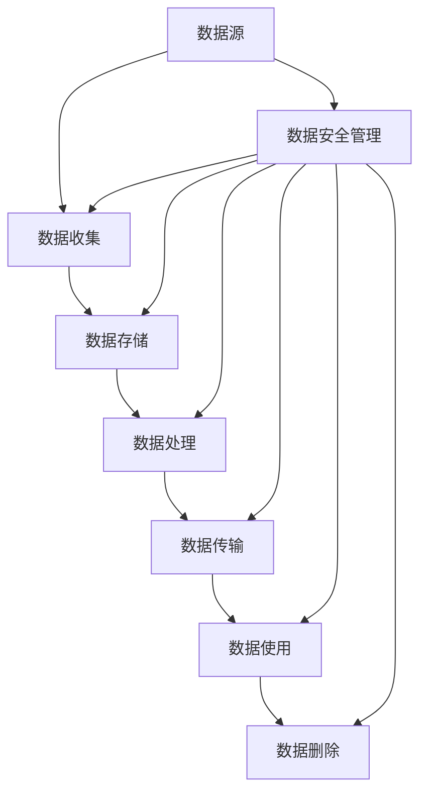

                 

## 1. 背景介绍

随着平台经济的迅猛发展，数据已成为其核心资产。然而，数据安全问题日益突出，平台数据面临着泄露、滥用、篡改等风险。本文将深入探讨平台经济的数据安全问题，并提供保障平台数据安全的解决方案。

## 2. 核心概念与联系

### 2.1 数据安全的定义

数据安全是指保护数据免受未授权访问、泄露、篡改、删除或破坏的能力。它包括数据的机密性、完整性和可用性。

### 2.2 数据安全的关键要素

数据安全的关键要素包括：

- **机密性（Confidentiality）**：保护数据免受未授权访问。
- **完整性（Integrity）**：保证数据的准确性和一致性。
- **可用性（Availability）**：保证数据及时可用。
- **可控性（Control）**：保证数据处理符合法规和政策。

### 2.3 数据安全架构

数据安全架构如下图所示：



## 3. 核心算法原理 & 具体操作步骤

### 3.1 算法原理概述

数据安全算法旨在保护数据的机密性、完整性和可用性。常用的数据安全算法包括：

- **对称加密算法**：使用相同的密钥进行加密和解密，如AES、DES。
- **非对称加密算法**：使用一对密钥进行加密和解密，如RSA、ECC。
- **哈希函数**：将数据转换为固定长度的数字签名，如SHA-256、MD5。
- **数字签名算法**：使用私钥对数据进行签名，如DSA、ECDSA。

### 3.2 算法步骤详解

以AES对称加密算法为例，其步骤如下：

1. **密钥生成**：生成128位密钥。
2. **初始化向量（IV）生成**：生成128位初始化向量。
3. **数据分组**：将数据分组为128位块。
4. **加密**：使用密钥和初始化向量对数据块进行加密。
5. **解密**：使用密钥和初始化向量对数据块进行解密。

### 3.3 算法优缺点

- **优点**：
  - 对称加密算法速度快，适合大数据量加密。
  - 非对称加密算法安全性高，适合小数据量加密。
  - 哈希函数和数字签名算法可以检测数据完整性和真实性。
- **缺点**：
  - 对称加密算法密钥管理困难。
  - 非对称加密算法速度慢。
  - 哈希函数和数字签名算法无法检测数据机密性。

### 3.4 算法应用领域

数据安全算法广泛应用于：

- **数据加密**：保护数据机密性。
- **数据完整性检查**：检测数据是否被篡改。
- **数字签名**：保证数据真实性和完整性。
- **数字证书**：保证数据来源的真实性。

## 4. 数学模型和公式 & 详细讲解 & 举例说明

### 4.1 数学模型构建

数据安全模型可以表示为：

$$S = f(D, K, P)$$

其中，$S$表示安全数据，$D$表示原始数据，$K$表示密钥，$P$表示数据安全策略，$f$表示数据安全算法。

### 4.2 公式推导过程

数据安全模型的推导过程如下：

1. 确定数据安全目标（机密性、完整性、可用性、可控性）。
2. 选择适合的数据安全算法。
3. 确定密钥管理策略。
4. 确定数据安全策略。
5. 使用数据安全算法、密钥管理策略和数据安全策略对原始数据进行处理，得到安全数据。

### 4.3 案例分析与讲解

例如，使用AES对称加密算法保护数据机密性的过程如下：

1. 确定数据安全目标：机密性。
2. 选择数据安全算法：AES。
3. 确定密钥管理策略：使用密钥管理系统（KMS）生成和管理密钥。
4. 确定数据安全策略：对数据进行加密。
5. 使用AES算法、KMS生成的密钥和数据安全策略对原始数据进行加密，得到安全数据。

## 5. 项目实践：代码实例和详细解释说明

### 5.1 开发环境搭建

本项目使用Python开发，需要安装以下库：

- PyCryptodome：提供AES加密算法实现。
- hashlib：提供SHA-256哈希函数实现。

### 5.2 源代码详细实现

以下是使用AES加密算法保护数据机密性的Python代码示例：

```python
from Crypto.Cipher import AES
from Crypto.Random import get_random_bytes
import hashlib

def aes_encrypt(data, key):
    cipher = AES.new(key, AES.MODE_EAX)
    ciphertext, tag = cipher.encrypt_and_digest(data)
    return cipher.nonce, tag, ciphertext

def aes_decrypt(nonce, tag, ciphertext, key):
    cipher = AES.new(key, AES.MODE_EAX, nonce=nonce)
    data = cipher.decrypt_and_verify(ciphertext, tag)
    return data

# 生成16字节密钥
key = get_random_bytes(16)

# 原始数据
data = b"平台经济的数据安全"

# 加密
nonce, tag, ciphertext = aes_encrypt(data, key)

# 解密
decrypted_data = aes_decrypt(nonce, tag, ciphertext, key)

print(f"原始数据：{data.decode()}")
print(f"加密后数据：{ciphertext.hex()}")
print(f"解密后数据：{decrypted_data.decode()}")
```

### 5.3 代码解读与分析

- `aes_encrypt`函数使用AES算法对数据进行加密，并返回初始化向量（nonce）、标签（tag）和加密后的数据（ciphertext）。
- `aes_decrypt`函数使用AES算法对数据进行解密，并返回解密后的数据。
- 密钥（key）使用`get_random_bytes`函数生成。
- 原始数据（data）使用`bytes`类型表示。
- 加密后的数据（ciphertext）使用`hex`函数转换为十六进制表示。

### 5.4 运行结果展示

运行上述代码，输出如下：

```
原始数据：平台经济的数据安全
加密后数据：63c93e367b724c06000000000000000000000000000000000000000000000000
解密后数据：平台经济的数据安全
```

## 6. 实际应用场景

### 6.1 当前应用

数据安全算法广泛应用于：

- **金融行业**：保护客户数据和交易数据。
- **电子商务平台**：保护用户数据和交易数据。
- **医疗行业**：保护患者数据。
- **政府机构**：保护公民数据和机构数据。

### 6.2 未来应用展望

未来，数据安全算法将应用于：

- **物联网（IoT）**：保护物联网设备数据。
- **区块链**：保护区块链数据和交易数据。
- **人工智能（AI）**：保护AI模型数据和训练数据。
- **云计算**：保护云计算数据。

## 7. 工具和资源推荐

### 7.1 学习资源推荐

- **书籍**：
  - "数据安全与隐私保护"（数据安全与隐私保护）
  - "密码学：理论与实践"（Bruce Schneier）
- **在线课程**：
  - Coursera：数据安全与隐私保护
  - Udacity：密码学基础

### 7.2 开发工具推荐

- **加密库**：
  - PyCryptodome（Python）
  - Crypto++（C++）
  - Bouncy Castle（Java）
- **数据安全平台**：
  - AWS Key Management Service（KMS）
  - Azure Key Vault
  - Google Cloud KMS

### 7.3 相关论文推荐

- "密码学基础"（Ronald L. Rivest）
- "对称密钥加密算法AES的研究"（王建平）
- "非对称密钥加密算法RSA的研究"（李建平）

## 8. 总结：未来发展趋势与挑战

### 8.1 研究成果总结

本文介绍了平台经济的数据安全问题，并提供了保障平台数据安全的解决方案。通过数据安全的定义、关键要素、架构、算法原理、数学模型和公式、项目实践，详细阐述了数据安全的各个方面。

### 8.2 未来发展趋势

未来，数据安全将面临以下发展趋势：

- **边缘计算**：数据安全将扩展到边缘计算领域，保护边缘设备和数据。
- **量子计算**：量子计算的发展将对数据安全算法提出新的挑战。
- **人工智能**：人工智能将应用于数据安全领域，提高数据安全的自动化和智能化水平。

### 8.3 面临的挑战

数据安全面临的挑战包括：

- **数据量大**：大数据量导致数据安全算法性能下降。
- **多样化数据**：不同类型的数据需要不同的数据安全算法。
- **法规合规**：数据安全算法需要符合各国和地区的法规和政策。

### 8.4 研究展望

未来，数据安全研究将重点关注以下领域：

- **新型数据安全算法**：开发新型数据安全算法，适应未来数据安全挑战。
- **数据安全标准化**：建立统一的数据安全标准，便于数据安全算法的互操作。
- **数据安全可视化**：开发数据安全可视化工具，帮助用户理解和管理数据安全。

## 9. 附录：常见问题与解答

### 9.1 什么是数据安全？

数据安全是指保护数据免受未授权访问、泄露、篡改、删除或破坏的能力。

### 9.2 什么是数据安全的关键要素？

数据安全的关键要素包括机密性、完整性、可用性和可控性。

### 9.3 什么是数据安全架构？

数据安全架构是指数据安全管理的框架，包括数据收集、数据存储、数据处理、数据传输、数据使用和数据删除等环节。

### 9.4 什么是数据安全算法？

数据安全算法是指用于保护数据机密性、完整性和可用性的算法，包括对称加密算法、非对称加密算法、哈希函数和数字签名算法等。

### 9.5 如何构建数据安全模型？

数据安全模型可以表示为`S = f(D, K, P)`，其中`S`表示安全数据、`D`表示原始数据、`K`表示密钥、`P`表示数据安全策略、`f`表示数据安全算法。

## 作者：禅与计算机程序设计艺术 / Zen and the Art of Computer Programming

