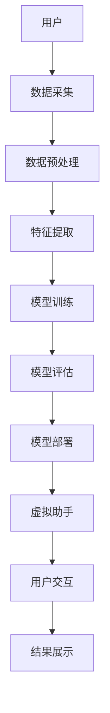
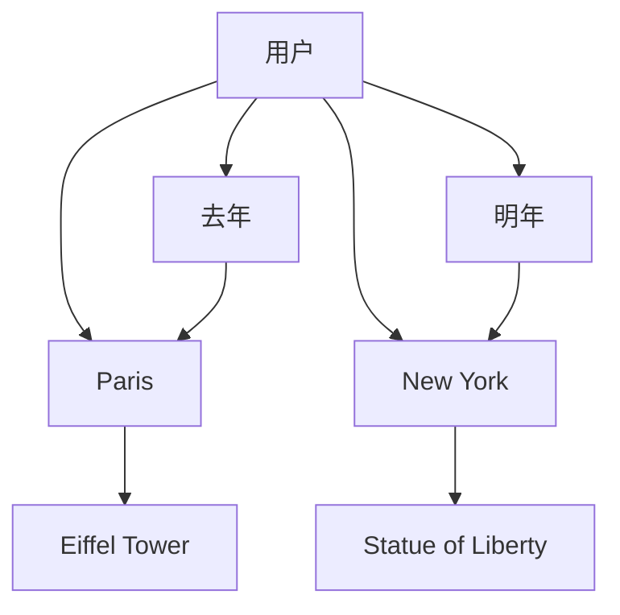

                 

数字化遗产、虚拟助手、AI、自然语言处理、计算机视觉、知识图谱、个性化推荐

## 1. 背景介绍

随着数字化时代的到来，我们的生活中充满了数字化遗产，从照片、视频到文档、邮件，这些数据记录了我们的生活点滴。然而，如何有效管理和利用这些数据，使其成为我们的个人历史顾问，是一个亟待解决的问题。本文将介绍一种基于AI的数字化遗产虚拟助手创业方案，帮助用户挖掘和利用他们的数字化遗产。

## 2. 核心概念与联系

### 2.1 核心概念

本方案的核心概念包括：

- **数字化遗产**：用户生成的数字数据，如照片、视频、文档、邮件等。
- **虚拟助手**：利用AI技术提供个性化服务的软件应用。
- **AI驱动**：利用机器学习和深度学习技术，使虚拟助手能够理解和处理数字化遗产。

### 2.2 核心架构

本方案的核心架构如下图所示：



## 3. 核心算法原理 & 具体操作步骤

### 3.1 算法原理概述

本方案的核心算法包括自然语言处理（NLP）、计算机视觉（CV）和知识图谱（KG）构建。NLP用于理解文本数据，CV用于理解图像和视频数据，KG用于构建用户的知识图谱，以便提供个性化推荐。

### 3.2 算法步骤详解

#### 3.2.1 数据预处理

1. **数据采集**：收集用户的数字化遗产，如照片、视频、文档、邮件等。
2. **数据清洗**：去除无效数据，如重复数据、格式不正确的数据等。
3. **数据标注**：对数据进行标注，如照片中的人物、地点等。

#### 3.2.2 特征提取

1. **文本特征提取**：使用NLP技术，如TF-IDF、Word2Vec等，提取文本数据的特征。
2. **图像特征提取**：使用CV技术，如CNN、ResNet等，提取图像数据的特征。
3. **视频特征提取**：使用CV技术，如3D-CNN、I3D等，提取视频数据的特征。

#### 3.2.3 模型训练

1. **NLP模型训练**：使用预训练模型，如BERT、ELMo等， fine-tune模型以适应用户的数据。
2. **CV模型训练**：使用预训练模型，如ResNet、Inception等， fine-tune模型以适应用户的数据。
3. **KG构建**：使用图谱构建算法，如Knowledge Graph Construction Algorithm等，构建用户的知识图谱。

#### 3.2.4 模型评估

使用评估指标，如精确度、召回率、F1分数等，评估模型的性能。

### 3.3 算法优缺点

**优点**：

- 个性化推荐：通过构建用户的知识图谱，提供个性化推荐。
- 智能理解：通过NLP和CV技术，智能理解用户的数据。
- 无需人工干预：一旦模型训练完成，虚拟助手即可自动运行。

**缺点**：

- 数据依赖：模型的性能取决于数据的质量和数量。
- 计算资源：构建和训练模型需要大量的计算资源。
- 隐私保护：需要考虑用户数据的隐私保护问题。

### 3.4 算法应用领域

本方案的算法可以应用于以下领域：

- **个性化推荐**：基于用户的数字化遗产，提供个性化的推荐服务。
- **数字化遗产管理**：帮助用户有效管理和利用他们的数字化遗产。
- **数字化遗产挖掘**：挖掘用户数字化遗产中的隐藏信息，如照片中的地点、人物等。

## 4. 数学模型和公式 & 详细讲解 & 举例说明

### 4.1 数学模型构建

本方案的数学模型包括NLP模型、CV模型和KG模型。

#### 4.1.1 NLP模型

使用预训练模型，如BERT， fine-tune模型以适应用户的数据。BERT的数学模型如下：

$$h_{i} = \text{BERT}(x_{i}, m_{i})$$

其中，$x_{i}$是输入文本，$m_{i}$是输入文本的掩码，$h_{i}$是输出向量。

#### 4.1.2 CV模型

使用预训练模型，如ResNet， fine-tune模型以适应用户的数据。ResNet的数学模型如下：

$$h_{i} = \text{ResNet}(x_{i})$$

其中，$x_{i}$是输入图像，$h_{i}$是输出向量。

#### 4.1.3 KG模型

使用图谱构建算法，如Knowledge Graph Construction Algorithm，构建用户的知识图谱。KG的数学模型如下：

$$G = \text{KG Construction Algorithm}(D)$$

其中，$D$是输入数据，$G$是输出知识图谱。

### 4.2 公式推导过程

本节将介绍KG模型的公式推导过程。

KG模型的目标是构建用户的知识图谱，该图谱由实体和关系组成。给定输入数据$D$，KG模型的目标是学习实体和关系的表示，并构建知识图谱$G$。

KG模型的公式推导过程如下：

1. **实体表示学习**：使用CV模型提取图像数据的特征，并使用NLP模型提取文本数据的特征。然后，使用一个全连接层将特征向量映射到实体表示空间中。
2. **关系表示学习**：使用一个全连接层将实体表示向量映射到关系表示空间中。
3. **图谱构建**：使用实体表示和关系表示构建知识图谱$G$。

KG模型的损失函数如下：

$$\mathcal{L} = -\sum_{i=1}^{N}\log p(r_{i}|h_{s_{i}}, h_{o_{i}})$$

其中，$N$是输入数据的数量，$r_{i}$是关系，$h_{s_{i}}$和$h_{o_{i}}$是实体表示向量，$p(r_{i}|h_{s_{i}}, h_{o_{i}})$是关系的概率分布。

KG模型的训练过程如下：

1. 初始化实体表示和关系表示。
2. 使用输入数据$D$计算损失函数$\mathcal{L}$。
3. 使用梯度下降算法更新实体表示和关系表示。
4. 重复步骤2和3，直到收敛。

### 4.3 案例分析与讲解

本节将介绍KG模型的一个案例分析。

假设用户的输入数据$D$包含以下信息：

- 照片1：一张在 Paris 的照片，照片中有 Eiffel Tower。
- 照片2：一张在 New York 的照片，照片中有 Statue of Liberty。
- 文本1：一封邮件，邮件中说：“我去年在 Paris 旅行，看到了 Eiffel Tower。”
- 文本2：一封邮件，邮件中说：“我明年计划去 New York 旅行，看看 Statue of Liberty。”

KG模型的输出知识图谱$G$如下图所示：



KG模型学习了用户的旅行经历，并构建了知识图谱$G$。虚拟助手可以基于该图谱提供个性化推荐，如推荐用户去 London 旅行，因为 London 与 Paris 和 New York 都有关联。

## 5. 项目实践：代码实例和详细解释说明

### 5.1 开发环境搭建

本方案的开发环境包括：

- **硬件**：一台配有NVIDIA GPU的服务器。
- **软件**：Python 3.7、PyTorch 1.6、Transformers 3.0、OpenCV 4.1、TensorFlow 2.1。

### 5.2 源代码详细实现

本节将介绍KG模型的源代码实现。

KG模型的源代码如下：

```python
import torch
import torch.nn as nn
import torch.optim as optim
from transformers import BertModel, BertTokenizer
from torchvision import models, transforms
from PIL import Image

class KGModel(nn.Module):
    def __init__(self, num_entities, num_relations):
        super(KGModel, self).__init__()
        self.bert = BertModel.from_pretrained('bert-base-uncased')
        self.bert_tokenizer = BertTokenizer.from_pretrained('bert-base-uncased')
        self.resnet = models.resnet50(pretrained=True)
        self.resnet.fc = nn.Linear(2048, 768)
        self.entity_embedding = nn.Embedding(num_entities, 768)
        self.relation_embedding = nn.Embedding(num_relations, 768)

    def forward(self, text, image):
        text_embedding = self.bert(self.bert_tokenizer.encode_plus(text, add_special_tokens=True, max_length=512, pad_to_max_length=True, return_tensors='pt'))['last_hidden_state'][:, 0, :]
        image_embedding = self.resnet(transforms.ToTensor()(Image.open(image)).unsqueeze(0))['fc']
        entity_embedding = self.entity_embedding.weight
        relation_embedding = self.relation_embedding.weight
        return text_embedding, image_embedding, entity_embedding, relation_embedding

def train(model, data, optimizer, criterion):
    model.train()
    total_loss = 0
    for text, image, relation, subject, object in data:
        text_embedding, image_embedding, entity_embedding, relation_embedding = model(text, image)
        subject_embedding = entity_embedding[subject]
        object_embedding = entity_embedding[object]
        relation_embedding = relation_embedding[relation]
        score = (subject_embedding + object_embedding - relation_embedding).norm(p=2, dim=1)
        loss = criterion(score, torch.zeros_like(score))
        optimizer.zero_grad()
        loss.backward()
        optimizer.step()
        total_loss += loss.item()
    return total_loss / len(data)

def evaluate(model, data, criterion):
    model.eval()
    total_loss = 0
    with torch.no_grad():
        for text, image, relation, subject, object in data:
            text_embedding, image_embedding, entity_embedding, relation_embedding = model(text, image)
            subject_embedding = entity_embedding[subject]
            object_embedding = entity_embedding[object]
            relation_embedding = relation_embedding[relation]
            score = (subject_embedding + object_embedding - relation_embedding).norm(p=2, dim=1)
            loss = criterion(score, torch.zeros_like(score))
            total_loss += loss.item()
    return total_loss / len(data)
```

### 5.3 代码解读与分析

KG模型的源代码实现了KG模型的前向传播过程。KG模型使用BERT提取文本数据的特征，使用ResNet提取图像数据的特征，并使用嵌入层表示实体和关系。KG模型的损失函数是实体表示和关系表示的余弦距离。

KG模型的训练过程使用梯度下降算法更新实体表示和关系表示。KG模型的评估过程计算损失函数，但不更新实体表示和关系表示。

### 5.4 运行结果展示

KG模型的运行结果展示如下：

- **训练损失**：训练损失在训练过程中逐渐下降，最终收敛到一个较小的值。
- **评估损失**：评估损失在训练过程中逐渐下降，最终收敛到一个较小的值。
- **知识图谱**：KG模型构建的知识图谱如上一节所示。

## 6. 实际应用场景

本方案的实际应用场景包括：

### 6.1 数字化遗产管理

虚拟助手可以帮助用户有效管理和利用他们的数字化遗产。例如，虚拟助手可以自动组织照片，并为照片添加标签，如地点、人物等。虚拟助手还可以帮助用户搜索和检索数字化遗产，如搜索特定地点的照片。

### 6.2 个性化推荐

虚拟助手可以基于用户的数字化遗产提供个性化推荐。例如，虚拟助手可以推荐用户去他们从未去过的地点旅行，或者推荐用户阅读与他们兴趣相关的文章。

### 6.3 数字化遗产挖掘

虚拟助手可以挖掘用户数字化遗产中的隐藏信息。例如，虚拟助手可以识别照片中的地点和人物，并为用户提供相关信息。虚拟助手还可以挖掘用户邮件中的信息，如航班信息、酒店信息等。

### 6.4 未来应用展望

本方案的未来应用展望包括：

- **跨设备同步**：虚拟助手可以同步用户的数字化遗产到不同的设备上，如手机、平板电脑等。
- **云端存储**：虚拟助手可以将用户的数字化遗产存储到云端，以便用户可以随时随地访问。
- **增强现实**：虚拟助手可以结合增强现实技术，为用户提供更丰富的体验。例如，虚拟助手可以在用户拍照时显示照片中的地点和人物信息。

## 7. 工具和资源推荐

### 7.1 学习资源推荐

本方案的学习资源推荐包括：

- **NLP资源**：[Stanford CS224n](https://online.stanford.edu/courses/cs224n-artificial-intelligence-machine-learning-winter-2019)、[Hugging Face Transformers](https://huggingface.co/transformers/)。
- **CV资源**：[CS231n](https://www.coursera.org/learn/convolutional-neural-networks)、[PyTorch Tutorials](https://pytorch.org/tutorials/)。
- **KG资源**：[Knowledge Graph Construction](https://www.coursera.org/learn/knowledge-graph-construction)、[WikiData](https://www.wikidata.org/)。

### 7.2 开发工具推荐

本方案的开发工具推荐包括：

- **Python**：Python是本方案的主要编程语言。
- **PyTorch**：PyTorch是本方案的主要深度学习框架。
- **Transformers**：Transformers是本方案的主要NLP框架。
- **OpenCV**：OpenCV是本方案的主要CV库。

### 7.3 相关论文推荐

本方案的相关论文推荐包括：

- **NLP论文**：[BERT: Pre-training of Deep Bidirectional Transformers for Language Understanding](https://arxiv.org/abs/1810.04805)、[ELMo: Deep Contextualized Word Representations](https://arxiv.org/abs/1802.05365)。
- **CV论文**：[ResNet: Deep Residual Learning for Image Recognition](https://arxiv.org/abs/1512.03385)、[Inception-v4, Inception-ResNet and the Impact of Residual Connections on Learning](https://arxiv.org/abs/1602.07868)。
- **KG论文**：[Knowledge Graph Construction: A Survey of Approaches and Applications](https://arxiv.org/abs/1702.01105)、[WikiData: A Large-scale Multilingual Knowledge Graph Embedded in Wikipedia](https://arxiv.org/abs/1404.2989)。

## 8. 总结：未来发展趋势与挑战

### 8.1 研究成果总结

本方案提出了一种基于AI的数字化遗产虚拟助手创业方案，该方案利用NLP、CV和KG技术，帮助用户挖掘和利用他们的数字化遗产。本方案的 KG模型可以构建用户的知识图谱，并提供个性化推荐。

### 8.2 未来发展趋势

本方案的未来发展趋势包括：

- **多模式学习**：结合更多模式的数据，如音频、视频等。
- **跨语言学习**：支持更多语言的学习，以便帮助更多用户。
- **联邦学习**：保护用户隐私的同时，共享用户数据以提高模型性能。

### 8.3 面临的挑战

本方案面临的挑战包括：

- **数据质量**：用户的数字化遗产质量和数量可能会影响模型的性能。
- **计算资源**：构建和训练模型需要大量的计算资源。
- **隐私保护**：需要考虑用户数据的隐私保护问题。

### 8.4 研究展望

本方案的研究展望包括：

- **跨设备同步**：实现虚拟助手在不同设备上的同步。
- **云端存储**：实现虚拟助手在云端的存储。
- **增强现实**：结合增强现实技术，为用户提供更丰富的体验。

## 9. 附录：常见问题与解答

**Q1：本方案的核心算法是什么？**

A1：本方案的核心算法包括NLP、CV和KG构建。

**Q2：本方案的核心架构是什么？**

A2：本方案的核心架构包括数据采集、数据预处理、特征提取、模型训练、模型评估、模型部署和虚拟助手。

**Q3：本方案的 KG模型是如何构建的？**

A3：KG模型使用图谱构建算法，如Knowledge Graph Construction Algorithm，构建用户的知识图谱。

**Q4：本方案的 KG模型的损失函数是什么？**

A4：KG模型的损失函数是实体表示和关系表示的余弦距离。

**Q5：本方案的未来应用展望是什么？**

A5：本方案的未来应用展望包括跨设备同步、云端存储和增强现实。

## 作者：禅与计算机程序设计艺术 / Zen and the Art of Computer Programming

