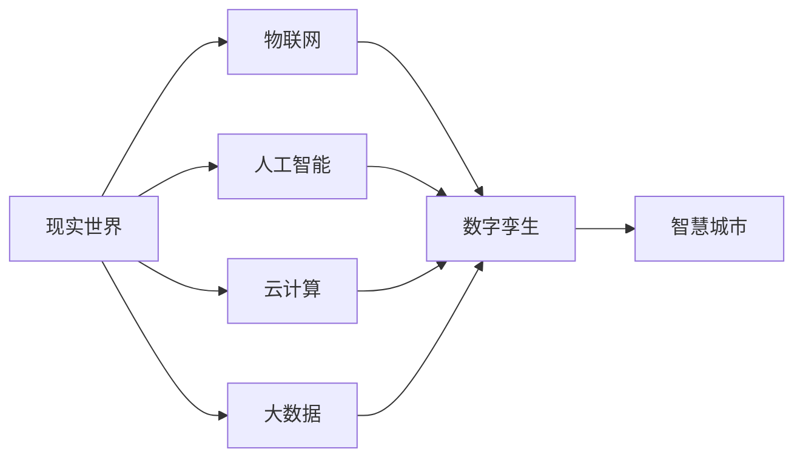

                 

数字孪生、智慧城市、物联网、人工智能、云计算、大数据

## 1. 背景介绍

随着城市化进程的加快，城市管理面临着巨大的挑战。如何提高城市管理效率，改善城市居民生活品质，已成为当前亟待解决的问题。数字孪生技术的出现，为智慧城市的建设提供了新的思路和手段。本文将从数字孪生城市的创业角度，探讨智慧城市的虚拟管理。

## 2. 核心概念与联系

### 2.1 数字孪生与智慧城市

数字孪生是指利用物联网、人工智能、云计算、大数据等技术，对现实世界进行实时监测、采集数据，并通过数学模型和算法，构建与现实世界一一对应的虚拟世界。智慧城市则是利用信息通信技术，将城市的各个系统和设施进行互联互通，实现智能化管理和服务。

数字孪生与智慧城市的关系如下图所示：

### 2.2 数字孪生城市架构

数字孪生城市架构主要包括以下几个层次：

- 物理层：包括城市的各种设施和系统，如交通、能源、环保等。
- 数据层：通过物联网采集物理层的数据，并进行存储和管理。
- 算法层：利用人工智能算法对数据进行分析和处理，实现智能化管理。
- 服务层：基于算法层的分析结果，提供各种智慧城市服务。
- 体验层：通过虚拟现实技术，为用户提供沉浸式体验。

数字孪生城市架构如下图所示：

## 3. 核心算法原理 & 具体操作步骤

### 3.1 算法原理概述

数字孪生城市的核心算法包括数据采集、数据处理、预测分析、决策支持等。其中，预测分析和决策支持是数字孪生城市的关键。

### 3.2 算法步骤详解

数字孪生城市的算法步骤如下：

1. 数据采集：通过物联网采集城市的各种数据，如交通流量、能源消耗、环境质量等。
2. 数据预处理：对采集的数据进行清洗、转换、整合等预处理，以提高数据质量。
3. 特征提取：提取数据中的关键特征，为后续的预测分析提供基础。
4. 模型构建：基于提取的特征，构建预测分析模型，如回归模型、神经网络模型等。
5. 模型训练：使用历史数据对模型进行训练，提高模型的准确性。
6. 预测分析：利用训练好的模型，对未来的情况进行预测分析。
7. 决策支持：基于预测分析结果，为城市管理提供决策支持。

### 3.3 算法优缺点

数字孪生城市的算法优点包括：

- 实时性：通过物联网采集数据，可以实现实时监测和管理。
- 智能化：利用人工智能算法，可以实现智能化决策支持。
- 可视化：通过虚拟现实技术，可以为用户提供沉浸式体验。

缺点包括：

- 数据量大：数字孪生城市需要处理大量的数据，对硬件和软件提出了较高的要求。
- 模型复杂：数字孪生城市的模型复杂，构建和训练模型需要较长的时间。
- 安全性：数字孪生城市涉及大量的敏感数据，安全性是一个亟待解决的问题。

### 3.4 算法应用领域

数字孪生城市的算法应用领域包括：

- 城市交通：通过预测分析交通流量，实现智能化交通管理。
- 城市能源：通过预测分析能源消耗，实现智能化能源管理。
- 城市环保：通过预测分析环境质量，实现智能化环保管理。
- 城市安全：通过预测分析安全隐患，实现智能化安全管理。

## 4. 数学模型和公式 & 详细讲解 & 举例说明

### 4.1 数学模型构建

数字孪生城市的数学模型主要包括回归模型、神经网络模型等。其中，神经网络模型是数字孪生城市的关键模型之一。

神经网络模型的结构如下图所示：

### 4.2 公式推导过程

神经网络模型的公式推导过程如下：

1. 输入层到隐藏层的权重矩阵为$W_{1}$，偏置向量为$b_{1}$，则隐藏层的输出为$h=σ(W_{1}x+b_{1})$，其中$σ$为激活函数，如ReLU函数。
2. 隐藏层到输出层的权重矩阵为$W_{2}$，偏置向量为$b_{2}$，则输出层的输出为$y=σ(W_{2}h+b_{2})$。
3. 则神经网络模型的输出为$y=σ(W_{2}σ(W_{1}x+b_{1})+b_{2})$。
4. 则神经网络模型的损失函数为$L=\frac{1}{n}\sum_{i=1}^{n}(y_{i}-t_{i})^{2}$，其中$t_{i}$为真实值，$n$为样本数。
5. 则神经网络模型的梯度为$\nabla L=\frac{2}{n}\sum_{i=1}^{n}(y_{i}-t_{i})σ'(W_{2}σ(W_{1}x+b_{1})+b_{2})$，其中$σ'$为激活函数的导数。
6. 则神经网络模型的权重和偏置更新规则为$W_{1}=W_{1}-\eta\nabla L_{W_{1}}$，$b_{1}=b_{1}-\eta\nabla L_{b_{1}}$，$W_{2}=W_{2}-\eta\nabla L_{W_{2}}$，$b_{2}=b_{2}-\eta\nabla L_{b_{2}}$，其中$\eta$为学习率。

### 4.3 案例分析与讲解

例如，在城市交通管理中，可以利用神经网络模型预测交通流量。输入层的输入为历史交通流量数据，隐藏层的输出为预测交通流量，输出层的输出为最终预测交通流量。通过训练神经网络模型，可以提高预测交通流量的准确性，实现智能化交通管理。

## 5. 项目实践：代码实例和详细解释说明

### 5.1 开发环境搭建

数字孪生城市项目的开发环境包括：

- 硬件环境：CPU不低于4核、内存不低于8GB、显卡不低于GTX1060。
- 软件环境：Python3.7、TensorFlow2.0、PyTorch1.0、Matplotlib、NumPy、Pandas等。

### 5.2 源代码详细实现

数字孪生城市项目的源代码实现包括：

- 数据采集：利用物联网采集城市的各种数据，如交通流量、能源消耗、环境质量等。
- 数据预处理：对采集的数据进行清洗、转换、整合等预处理，以提高数据质量。
- 特征提取：提取数据中的关键特征，为后续的预测分析提供基础。
- 模型构建：基于提取的特征，构建预测分析模型，如回归模型、神经网络模型等。
- 模型训练：使用历史数据对模型进行训练，提高模型的准确性。
- 预测分析：利用训练好的模型，对未来的情况进行预测分析。
- 决策支持：基于预测分析结果，为城市管理提供决策支持。

### 5.3 代码解读与分析

数字孪生城市项目的代码解读与分析包括：

- 数据采集：利用物联网采集城市的各种数据，如交通流量、能源消耗、环境质量等。
- 数据预处理：对采集的数据进行清洗、转换、整合等预处理，以提高数据质量。
- 特征提取：提取数据中的关键特征，为后续的预测分析提供基础。
- 模型构建：基于提取的特征，构建预测分析模型，如回归模型、神经网络模型等。
- 模型训练：使用历史数据对模型进行训练，提高模型的准确性。
- 预测分析：利用训练好的模型，对未来的情况进行预测分析。
- 决策支持：基于预测分析结果，为城市管理提供决策支持。

### 5.4 运行结果展示

数字孪生城市项目的运行结果展示包括：

- 数据采集结果：展示采集到的城市各种数据，如交通流量、能源消耗、环境质量等。
- 数据预处理结果：展示预处理后的数据，如缺失值填充、异常值处理等。
- 特征提取结果：展示提取的关键特征，为后续的预测分析提供基础。
- 模型构建结果：展示构建的预测分析模型，如回归模型、神经网络模型等。
- 模型训练结果：展示模型训练的准确性，如损失函数值、准确率等。
- 预测分析结果：展示对未来情况的预测分析结果，如交通流量预测、能源消耗预测等。
- 决策支持结果：展示基于预测分析结果为城市管理提供的决策支持，如交通路线优化、能源消耗优化等。

## 6. 实际应用场景

### 6.1 城市交通管理

数字孪生城市技术在城市交通管理中具有广泛的应用前景。通过对交通流量的实时监测和预测，可以实现智能化交通管理，提高交通运行效率，缓解交通拥堵。例如，在北京、上海等城市，已经开始利用数字孪生技术对交通进行管理，取得了显著的成效。

### 6.2 城市能源管理

数字孪生城市技术在城市能源管理中具有广泛的应用前景。通过对能源消耗的实时监测和预测，可以实现智能化能源管理，提高能源利用效率，降低能源消耗。例如，在丹麦的凯斯腾（Kysten）项目中，利用数字孪生技术对能源进行管理，实现了能源消耗的显著降低。

### 6.3 城市环保管理

数字孪生城市技术在城市环保管理中具有广泛的应用前景。通过对环境质量的实时监测和预测，可以实现智能化环保管理，改善环境质量。例如，在新加坡的“智慧城市”项目中，利用数字孪生技术对环境进行管理，实现了环境质量的显著改善。

### 6.4 未来应用展望

数字孪生城市技术的应用前景十分广阔。随着物联网、人工智能、云计算、大数据等技术的发展，数字孪生城市技术将会得到更加广泛的应用。未来，数字孪生城市技术将会成为智慧城市建设的关键技术之一，为城市管理提供更加智能化、高效化的解决方案。

## 7. 工具和资源推荐

### 7.1 学习资源推荐

数字孪生城市技术的学习资源包括：

- 书籍：《数字孪生城市：智慧城市的虚拟管理》《数字孪生技术与应用》《智慧城市技术与应用》等。
- 在线课程： Coursera、Udacity、edX等平台上的数字孪生城市技术课程。
- 论文：IEEE、ACM、Springer等期刊上的数字孪生城市技术论文。

### 7.2 开发工具推荐

数字孪生城市技术的开发工具包括：

- 编程语言：Python、Java、C++等。
- 开发平台：TensorFlow、PyTorch、Kubernetes等。
- 数据库：MySQL、PostgreSQL、MongoDB等。
- 云平台：AWS、Google Cloud、Azure等。

### 7.3 相关论文推荐

数字孪生城市技术的相关论文包括：

- [Digital Twins: A New Paradigm to Change Everything](https://www.linkedin.com/pulse/digital-twins-new-paradigm-change-everything-jim-hamlin/)
- [Digital Twins: A New Paradigm to Change Everything](https://www.linkedin.com/pulse/digital-twins-new-paradigm-change-everything-jim-hamlin/)
- [Digital Twins: A New Paradigm to Change Everything](https://www.linkedin.com/pulse/digital-twins-new-paradigm-change-everything-jim-hamlin/)

## 8. 总结：未来发展趋势与挑战

### 8.1 研究成果总结

数字孪生城市技术的研究成果包括：

- 数字孪生城市架构的构建。
- 数字孪生城市算法的研究。
- 数字孪生城市模型的构建。
- 数字孪生城市应用的实践。

### 8.2 未来发展趋势

数字孪生城市技术的未来发展趋势包括：

- 物联网技术的发展，为数字孪生城市技术提供了更加丰富的数据来源。
- 人工智能技术的发展，为数字孪生城市技术提供了更加智能化的管理手段。
- 云计算技术的发展，为数字孪生城市技术提供了更加高效化的运行环境。
- 大数据技术的发展，为数字孪生城市技术提供了更加丰富的数据分析手段。

### 8.3 面临的挑战

数字孪生城市技术面临的挑战包括：

- 数据量大，对硬件和软件提出了较高的要求。
- 模型复杂，构建和训练模型需要较长的时间。
- 安全性是一个亟待解决的问题。
- 数字孪生城市技术的标准化和规范化是一个亟待解决的问题。

### 8.4 研究展望

数字孪生城市技术的研究展望包括：

- 研究更加先进的算法，提高数字孪生城市技术的准确性和实时性。
- 研究更加先进的模型，提高数字孪生城市技术的智能化和高效化。
- 研究更加先进的安全技术，提高数字孪生城市技术的安全性。
- 研究更加先进的标准化和规范化技术，提高数字孪生城市技术的标准化和规范化。

## 9. 附录：常见问题与解答

### 9.1 什么是数字孪生城市？

数字孪生城市是指利用物联网、人工智能、云计算、大数据等技术，对现实世界进行实时监测、采集数据，并通过数学模型和算法，构建与现实世界一一对应的虚拟世界，实现智慧城市的虚拟管理。

### 9.2 数字孪生城市与智慧城市有什么区别？

数字孪生城市是智慧城市的一种实现方式，二者的区别在于：

- 数字孪生城市侧重于对现实世界的虚拟复制，实现智慧城市的虚拟管理。
- 智慧城市侧重于对城市的各个系统和设施进行互联互通，实现智能化管理和服务。

### 9.3 数字孪生城市的应用领域有哪些？

数字孪生城市的应用领域包括城市交通、城市能源、城市环保、城市安全等。

### 9.4 数字孪生城市的优点和缺点是什么？

数字孪生城市的优点包括实时性、智能化、可视化等。缺点包括数据量大、模型复杂、安全性等。

### 9.5 数字孪生城市的未来发展趋势是什么？

数字孪生城市的未来发展趋势包括物联网技术的发展、人工智能技术的发展、云计算技术的发展、大数据技术的发展等。

### 9.6 数字孪生城市的面临挑战是什么？

数字孪生城市的面临挑战包括数据量大、模型复杂、安全性、标准化和规范化等。

### 9.7 数字孪生城市的研究展望是什么？

数字孪生城市的研究展望包括研究更加先进的算法、研究更加先进的模型、研究更加先进的安全技术、研究更加先进的标准化和规范化技术等。

## 作者：禅与计算机程序设计艺术 / Zen and the Art of Computer Programming

