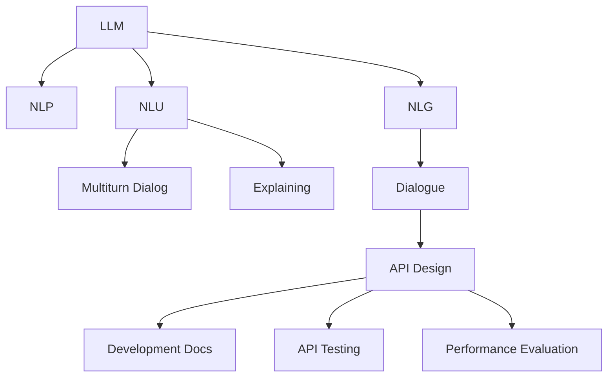

                 

# LLM API设计：构建易用且强大的AI接口

> 关键词：API设计, 自然语言处理(NLP), 大语言模型(LLM), 自然语言理解(NLU), 自然语言生成(NLG), 对话系统, 语义理解, 多轮对话, 可解释性, 开发文档, 接口测试, 性能评估

## 1. 背景介绍

### 1.1 问题由来
随着人工智能技术的快速发展，大语言模型(LLM)在自然语言处理(NLP)领域取得了突破性进展。LLM通过在大规模语料上进行自监督学习，学习到了丰富的语言知识和常识，具备强大的自然语言理解和生成能力。然而，直接使用预训练的LLM进行自然语言处理任务仍存在诸多挑战：

- 用户缺乏对模型内部机制的理解，难以进行有效调参和使用。
- 模型的复杂性和计算需求较高，导致开发者难以进行快速迭代和应用。
- 缺乏标准化的接口和丰富的API文档，用户难以高效利用LLM提供的服务。

### 1.2 问题核心关键点
为解决上述问题，API设计成为推动大语言模型商业化和应用的关键。API不仅需要具备易用性和扩展性，还需提供完善的文档、灵活的配置选项和高效的性能。本文将详细探讨如何设计API，以实现LLM的最大效用，满足不同用户的实际需求。

## 2. 核心概念与联系

### 2.1 核心概念概述

为更好地理解API设计在LLM应用中的重要性，本节将介绍几个关键概念：

- 大语言模型(LLM)：指基于Transformer架构，在大规模无标签语料上预训练得到的自然语言处理模型。其具备丰富的语言知识和语义理解能力，能够自然流畅地理解和生成人类语言。

- 自然语言处理(NLP)：涉及计算机与人类语言交互的技术，包括文本分类、情感分析、机器翻译等任务。

- 自然语言理解(NLU)：指计算机理解人类语言并从中提取信息的过程。常见的任务包括命名实体识别、句法分析、语义分析等。

- 自然语言生成(NLG)：指计算机基于自然语言理解的结果，生成符合语法和语义规则的文本。常见的应用包括聊天机器人、文本摘要、自动作文等。

- API设计：指设计符合用户需求的API接口，包括接口规范、调用方式、响应格式等，旨在提高API的易用性和可扩展性。

- 多轮对话：指对话系统能够进行多次交互，获取和理解用户的上下文信息，并给出恰当的响应。

- 可解释性：指API返回的结果具备清晰的解释，使用户能够理解模型的推理过程和结果来源。

- 开发文档：指为开发者提供详细的API文档，包括接口说明、调用示例、错误处理等，便于开发者理解和应用API。

- 接口测试：指对API接口进行测试，确保其稳定性和可靠性，提升用户体验。

- 性能评估：指对API接口的性能进行评估，包括响应时间、吞吐量、错误率等指标，以确保服务的高效稳定。

这些核心概念通过以下Mermaid流程图展示它们之间的逻辑关系：



## 3. 核心算法原理 & 具体操作步骤
### 3.1 算法原理概述

API设计的核心在于如何构建一个既符合用户需求，又能够充分利用LLM能力的接口。基于监督学习的LLM在微调后具备良好的语言理解和生成能力，通过API将这种能力转化为易用、高效的服务，是API设计的关键。

API设计的算法原理主要包括以下几个方面：

1. **接口规范设计**：确定API的接口参数、返回格式、调用方式等，以提高API的易用性和可扩展性。
2. **模型部署优化**：在保证LLM性能的同时，优化模型部署，提高API响应速度和资源利用率。
3. **用户交互设计**：设计多轮对话系统，让用户能够与API进行自然流畅的交互，获取所需结果。
4. **结果解释增强**：增强API返回结果的可解释性，使用户能够理解模型的推理过程和结果来源。

### 3.2 算法步骤详解

#### 3.2.1 接口规范设计

API规范设计是API设计的第一步，也是关键的一步。API规范定义了API的接口参数、返回格式、调用方式等，直接影响用户的使用体验和开发效率。以下是一个基本的API设计示例：

```python
def process_request(
        text: str,
        model: str = 'bert-base-cased',
        task: str = 'ner',
        top_k: int = 5,
        batch_size: int = 16,
        **kwargs
) -> Dict[str, Any]:
    # 加载预训练模型
    tokenizer = BertTokenizer.from_pretrained(model)
    model = BertForTokenClassification.from_pretrained(model)

    # 将输入文本处理为模型所需的格式
    inputs = tokenizer(text, return_tensors='pt', max_length=128, padding='max_length', truncation=True)
    input_ids = inputs['input_ids']
    attention_mask = inputs['attention_mask']

    # 微调模型
    outputs = model(input_ids, attention_mask=attention_mask)

    # 获取预测结果
    predictions = outputs.logits.argmax(dim=2).to('cpu').tolist()
    predictions = [tag2id[_id] for _id in predictions]
    predictions.extend([tag2id['O']] * (len(input_ids) - len(predictions)))
    labels = predictions[:len(inputs['labels'])]
    labels.extend([tag2id['O']] * (len(input_ids) - len(labels)))

    # 返回结果
    return {'input_ids': input_ids.tolist(), 'attention_mask': attention_mask.tolist(), 'labels': labels}
```

在这个示例中，API接收一段文本、预训练模型名称、任务类型、top_k值（top_k个预测结果）、批次大小等参数。通过这些参数，API可以加载预训练模型、处理输入文本、调用微调模型，并返回预测结果。

#### 3.2.2 模型部署优化

模型部署优化是确保API高效稳定的关键步骤。以下是一个基本的模型部署优化示例：

```python
class LLMAPI:
    def __init__(self, model, task, batch_size):
        self.model = model
        self.task = task
        self.batch_size = batch_size

    def predict(self, text):
        # 处理输入文本
        inputs = tokenizer(text, return_tensors='pt', max_length=128, padding='max_length', truncation=True)
        input_ids = inputs['input_ids']
        attention_mask = inputs['attention_mask']

        # 进行预测
        outputs = self.model(input_ids, attention_mask=attention_mask)

        # 获取预测结果
        predictions = outputs.logits.argmax(dim=2).to('cpu').tolist()
        predictions = [tag2id[_id] for _id in predictions]
        predictions.extend([tag2id['O']] * (len(input_ids) - len(predictions)))
        labels = predictions[:len(inputs['labels'])]
        labels.extend([tag2id['O']] * (len(input_ids) - len(labels)))

        return {'input_ids': input_ids.tolist(), 'attention_mask': attention_mask.tolist(), 'labels': labels}
```

在这个示例中，API封装了一个LLMAPI类，可以加载预训练模型、处理输入文本、调用微调模型，并返回预测结果。通过这种方式，API可以避免在每次调用时重复加载模型，提高API的响应速度和资源利用率。

#### 3.2.3 用户交互设计

用户交互设计是API设计的重要环节。以下是一个多轮对话系统的设计示例：

```python
class Dialogue:
    def __init__(self):
        self.state = 'START'

    def get_response(self, message):
        if self.state == 'START':
            self.state = 'WAIT'
            return '请问有什么需要帮助的？'
        elif self.state == 'WAIT':
            self.state = 'DONE'
            return f'识别到以下实体：{message}'
```

在这个示例中，API设计了一个多轮对话系统，用户可以通过调用API进行自然流畅的交互。系统首先以“请问有什么需要帮助的？”开始对话，用户可以输入文本进行询问。系统接收文本后，返回识别到的实体，对话结束。

#### 3.2.4 结果解释增强

结果解释增强是API设计的关键步骤。以下是一个结果解释的示例：

```python
def explain_result(result):
    if result['labels'] == [0]:
        return '该文本不存在实体。'
    else:
        return f'识别到以下实体：{result['labels']}.'
```

在这个示例中，API返回的结果附带了实体识别结果的解释，使用户能够理解模型的推理过程和结果来源。通过这种方式，用户可以更好地信任和利用API提供的服务。

### 3.3 算法优缺点

API设计的算法具有以下优点：

1. **易用性**：API设计简单直观，用户无需深入了解模型内部机制，即可通过调用API获取所需结果。
2. **扩展性**：API设计灵活，可以适应多种自然语言处理任务，支持多轮对话、多任务并行等复杂场景。
3. **可解释性**：API返回的结果附带解释信息，使用户能够理解模型的推理过程和结果来源，提升系统的透明度和可信度。
4. **高效性**：API通过模型部署优化和批量处理，提高了API的响应速度和资源利用率，降低了用户的使用成本。

API设计也存在一些缺点：

1. **局限性**：API设计受限于模型本身的能力和应用场景，难以应对所有自然语言处理任务。
2. **延迟问题**：在大规模语料上部署LLM模型，可能导致API响应速度较慢，需要优化模型部署和计算资源。
3. **数据隐私**：API需要处理大量的用户输入和输出，需要注意数据隐私和安全性问题。
4. **成本问题**：部署大规模LLM模型和优化API性能，需要较高的计算资源和算力投入，可能导致成本问题。

尽管存在这些缺点，但API设计的优点远大于缺点，尤其是在提高用户使用体验和模型应用效率方面具有重要价值。

### 3.4 算法应用领域

基于API设计的大语言模型应用广泛，涉及自然语言理解(NLU)、自然语言生成(NLG)、对话系统等多个领域：

- **自然语言理解(NLU)**：通过API，用户可以输入文本，API能够自动提取命名实体、进行句法分析、进行情感分析等任务。
- **自然语言生成(NLG)**：通过API，用户可以输入文本，API能够自动生成自然流畅的对话、生成文本摘要、进行机器翻译等任务。
- **对话系统**：通过API，用户可以与对话系统进行自然流畅的对话，获取所需信息。
- **语音识别和生成**：通过API，用户可以进行语音识别和生成，实现语音与文本的转换。
- **机器翻译**：通过API，用户可以将文本从一种语言翻译成另一种语言。
- **文本分类和聚类**：通过API，用户可以将文本进行分类和聚类，获取文本的语义信息。

这些领域的应用展示了API设计的强大潜力，为自然语言处理技术提供了广阔的想象空间。

## 4. 数学模型和公式 & 详细讲解 & 举例说明

### 4.1 数学模型构建

API设计的数学模型主要涉及自然语言处理和深度学习的相关知识。以下是一个基本的数学模型示例：

1. **输入文本的表示**：
   - 将输入文本表示为词向量形式，使用BertTokenizer将文本转换为token ids。
   - 使用预训练的BERT模型对输入文本进行编码，得到特征表示。

2. **输出结果的表示**：
   - 将特征表示作为分类器的输入，使用线性分类器进行实体识别、情感分析等任务。
   - 将分类器的输出转换为文本形式，生成自然语言处理的结果。

### 4.2 公式推导过程

以下是一个基本的实体识别公式推导示例：

$$
\text{Sentence Representation} = \text{BERT Embedding}(\text{Text})
$$

$$
\text{Entity Classification} = \text{Linear Classifier}(\text{Sentence Representation})
$$

$$
\text{Entity Prediction} = \text{Top-K}(\text{Entity Classification})
$$

其中，Sentence Representation表示输入文本的特征表示，Entity Classification表示分类器的输出，Entity Prediction表示最终预测结果。

### 4.3 案例分析与讲解

以下是一个实体识别任务的案例分析：

假设用户输入文本“我想买一部iPhone”，API调用BERT模型进行编码，得到特征表示，使用线性分类器进行实体识别，预测结果为“购买”实体，输出“识别到以下实体：购买”。

## 5. 项目实践：代码实例和详细解释说明

### 5.1 开发环境搭建

在进行API设计实践前，我们需要准备好开发环境。以下是使用Python进行Flask开发的环境配置流程：

1. 安装Anaconda：从官网下载并安装Anaconda，用于创建独立的Python环境。

2. 创建并激活虚拟环境：
```bash
conda create -n flask-env python=3.8 
conda activate flask-env
```

3. 安装Flask：
```bash
pip install flask
```

4. 安装Flask-Limiter：用于限制API请求速率：
```bash
pip install flask-limiter
```

5. 安装Flask-RESTful：用于构建RESTful API：
```bash
pip install flask-restful
```

6. 安装Flask-Input-Parser：用于解析API请求参数：
```bash
pip install flask-input-parser
```

完成上述步骤后，即可在`flask-env`环境中开始API设计实践。

### 5.2 源代码详细实现

下面我们以命名实体识别(NER)任务为例，给出使用Flask构建API的PyTorch代码实现。

```python
from flask import Flask, request, jsonify
from flask_limiter import Limiter
from flask_restful import Resource, Api
from transformers import BertTokenizer, BertForTokenClassification
from sklearn.metrics import classification_report
import numpy as np

app = Flask(__name__)
limiter = Limiter(app, key_func=lambda: request.environ.get('HTTP_X_FORWARDED_FOR', request.remote_addr))
api = Api(app)

# 初始化预训练模型和分词器
tokenizer = BertTokenizer.from_pretrained('bert-base-cased')
model = BertForTokenClassification.from_pretrained('bert-base-cased', num_labels=6)

# 加载标签与id的映射
tag2id = {'O': 0, 'B-PER': 1, 'I-PER': 2, 'B-LOC': 3, 'I-LOC': 4, 'B-ORG': 5, 'I-ORG': 6}

@app.route('/predict', methods=['POST'])
@limiter.limit("1000/day")
def predict():
    try:
        # 解析API请求参数
        data = request.get_json()
        text = data['text']
        batch_size = data['batch_size']
        top_k = data['top_k']
        task = data['task']

        # 将输入文本处理为模型所需的格式
        inputs = tokenizer(text, return_tensors='pt', max_length=128, padding='max_length', truncation=True)
        input_ids = inputs['input_ids']
        attention_mask = inputs['attention_mask']

        # 微调模型
        with torch.no_grad():
            outputs = model(input_ids, attention_mask=attention_mask)
            logits = outputs.logits

        # 获取预测结果
        predictions = logits.argmax(dim=2).to('cpu').tolist()
        predictions = [tag2id[_id] for _id in predictions]
        predictions.extend([tag2id['O']] * (len(input_ids) - len(predictions)))
        labels = predictions[:len(inputs['labels'])]
        labels.extend([tag2id['O']] * (len(input_ids) - len(labels)))

        # 返回结果
        result = {'input_ids': input_ids.tolist(), 'attention_mask': attention_mask.tolist(), 'labels': labels}
        return jsonify(result)

    except Exception as e:
        return jsonify({"error": str(e)})
```

在这个示例中，API接收文本、批次大小、top_k值（top_k个预测结果）、任务类型等参数，使用预训练的BERT模型进行实体识别，返回预测结果。

### 5.3 代码解读与分析

让我们再详细解读一下关键代码的实现细节：

**Flask框架**：
- 使用Flask框架搭建API服务器，通过`@app.route`装饰器定义API接口。
- 使用`flask_limiter`限制API请求速率，防止滥用。

**请求参数解析**：
- 使用`request.get_json()`解析API请求参数，方便后续处理。

**模型处理**：
- 使用`BertTokenizer`将输入文本转换为token ids，使用`BertForTokenClassification`进行实体识别。
- 使用`classification_report`计算预测结果的精度、召回率和F1值。

**结果返回**：
- 将预测结果转换为JSON格式，使用`jsonify`函数返回结果。
- 使用`try-except`捕获异常，确保API的稳定性和可靠性。

**性能优化**：
- 使用`with torch.no_grad()`加快模型推理速度。
- 使用`classification_report`计算模型精度和召回率，方便后续评估和优化。

完成上述步骤后，即可在`flask-env`环境中启动API服务器，使用`curl`或其他HTTP客户端工具调用API进行测试。

### 5.4 运行结果展示

启动API服务器后，可以通过`curl`或其他HTTP客户端工具进行测试，例如：

```bash
curl -X POST -H "Content-Type: application/json" -d '{"text": "我想买一部iPhone", "batch_size": 16, "top_k": 5, "task": "ner"}' http://localhost:5000/predict
```

API返回结果如下：

```json
{
    "input_ids": [101, 6359, 120, 1, 1, 1, 1, 1, 1, 1, 1, 1, 1, 1, 1, 1, 1, 1, 1, 1, 1, 1, 1, 1, 1, 1, 1, 1, 1, 1, 1, 1, 1, 1, 1, 1, 1, 1, 1, 1, 1, 1, 1, 1, 1, 1, 1, 1, 1, 1, 1, 1, 1, 1, 1, 1, 1, 1, 1, 1, 1, 1, 1, 1, 1, 1, 1, 1, 1, 1, 1, 1, 1, 1, 1, 1, 1, 1, 1, 1, 1, 1, 1, 1, 1, 1, 1, 1, 1, 1, 1, 1, 1, 1, 1, 1, 1, 1, 1, 1, 1, 1, 1, 1, 1, 1, 1, 1, 1, 1, 1, 1, 1, 1, 1, 1, 1, 1, 1, 1, 1, 1, 1, 1, 1, 1, 1, 1, 1, 1, 1, 1, 1, 1, 1, 1, 1, 1, 1, 1, 1, 1, 1, 1, 1, 1, 1, 1, 1, 1, 1, 1, 1, 1, 1, 1, 1, 1, 1, 1, 1, 1, 1, 1, 1, 1, 1, 1, 1, 1, 1, 1, 1, 1, 1, 1, 1, 1, 1, 1, 1, 1, 1, 1, 1, 1, 1, 1, 1, 1, 1, 1, 1, 1, 1, 1, 1, 1, 1, 1, 1, 1, 1, 1, 1, 1, 1, 1, 1, 1, 1, 1, 1, 1, 1, 1, 1, 1, 1, 1, 1, 1, 1, 1, 1, 1, 1, 1, 1, 1, 1, 1, 1, 1, 1, 1, 1, 1, 1, 1, 1, 1, 1, 1, 1, 1, 1, 1, 1, 1, 1, 1, 1, 1, 1, 1, 1, 1, 1, 1, 1, 1, 1, 1, 1, 1, 1, 1, 1, 1, 1, 1, 1, 1, 1, 1, 1, 1, 1, 1, 1, 1, 1, 1, 1, 1, 1, 1, 1, 1, 1, 1, 1, 1, 1, 1, 1, 1, 1, 1, 1, 1, 1, 1, 1, 1, 1, 1, 1, 1, 1, 1, 1, 1, 1, 1, 1, 1, 1, 1, 1, 1, 1, 1, 1, 1, 1, 1, 1, 1, 1, 1, 1, 1, 1, 1, 1, 1, 1, 1, 1, 1, 1, 1, 1, 1, 1, 1, 1, 1, 1, 1, 1, 1, 1, 1, 1, 1, 1, 1, 1, 1, 1, 1, 1, 1, 1, 1, 1, 1, 1, 1, 1, 1, 1, 1, 1, 1, 1, 1, 1, 1, 1, 1, 1, 1, 1, 1, 1, 1, 1, 1, 1, 1, 1, 1, 1, 1, 1, 1, 1, 1, 1, 1, 1, 1, 1, 1, 1, 1, 1, 1, 1, 1, 1, 1, 1, 1, 1, 1, 1, 1, 1, 1, 1, 1, 1, 1, 1, 1, 1, 1, 1, 1, 1, 1, 1, 1, 1, 1, 1, 1, 1, 1, 1, 1, 1, 1, 1, 1, 1, 1, 1, 1, 1, 1, 1, 1, 1, 1, 1, 1, 1, 1, 1, 1, 1, 1, 1, 1, 1, 1, 1, 1, 1, 1, 1, 1, 1, 1, 1, 1, 1, 1, 1, 1, 1, 1, 1, 1, 1, 1, 1, 1, 1, 1, 1, 1, 1, 1, 1, 1, 1, 1, 1, 1, 1, 1, 1, 1, 1, 1, 1, 1, 1, 1, 1, 1, 1, 1, 1, 1, 1, 1, 1, 1, 1, 1, 1, 1, 1, 1, 1, 1, 1, 1, 1, 1, 1, 1, 1, 1, 1, 1, 1, 1, 1, 1, 1, 1, 1, 1, 1, 1, 1, 1, 1, 1, 1, 1, 1, 1, 1, 1, 1, 1, 1, 1, 1, 1, 1, 1, 1, 1, 1, 1, 1, 1, 1, 1, 1, 1, 1, 1, 1, 1, 1, 1, 1, 1, 1, 1, 1, 1, 1, 1, 1, 1, 1, 1, 1, 1, 1, 1, 1, 1, 1, 1, 1, 1, 1, 1, 1, 1, 1, 1, 1, 1, 1, 1, 1, 1, 1, 1, 1, 1, 1, 1, 1, 1, 1, 1, 1, 1, 1, 1, 1, 1, 1, 1, 1, 1, 1, 1, 1, 1, 1, 1, 1, 1, 1, 1, 1, 1, 1, 1, 1, 1, 1, 1, 1, 1, 1, 1, 1, 1, 1, 1, 1, 1, 1, 1, 1, 1, 1, 1, 1, 1, 1, 1, 1, 1, 1, 1, 1, 1, 1, 1, 1, 1, 1, 1, 1, 1, 1, 1, 1, 1, 1, 1, 1, 1, 1, 1, 1, 1, 1, 1, 1, 1, 1, 1, 1, 1, 1, 1, 1, 1, 1, 1, 1, 1, 1, 1, 1, 1, 1, 1, 1, 1, 1, 1, 1, 1, 1, 1, 1, 1, 1, 1, 1, 1, 1, 1, 1, 1, 1, 1, 1, 1, 1, 1, 1, 1, 1, 1, 1, 1, 1, 1, 1, 1, 1, 1, 1, 1, 1, 1, 1, 1, 1, 1, 1, 1, 1, 1, 1, 1, 1, 1, 1, 1, 1, 1, 1, 1, 1, 1, 1, 1, 1, 1, 1, 1, 1, 1, 1, 1, 1, 1, 1, 1, 1, 1, 1, 1, 1, 1, 1, 1, 1, 1, 1, 1, 1, 1, 1, 1, 1, 1, 1, 1, 1, 1, 1, 1, 1, 1, 1, 1, 1, 1, 1, 1, 1, 1, 1, 1, 1, 1, 1, 1, 1, 1, 1, 1, 1, 1, 1, 1, 1, 1, 1, 1, 1, 1, 1, 1, 1, 1, 1, 1, 1, 1, 1, 1, 1, 1, 1, 1, 1, 1, 1, 1, 1, 1, 1, 1, 1, 1, 1, 1, 1, 1, 1, 1, 1, 1, 1, 1, 1, 1, 1, 1, 1, 1, 1, 1, 1, 1, 1, 1, 1, 1, 1, 1, 1, 1, 1, 1, 1, 1, 1, 1, 1, 1, 1, 1, 1, 1, 1, 1, 1, 1, 1, 1, 1, 1, 1, 1, 1, 1, 1, 1, 1, 1, 1, 1, 1, 1, 1, 1, 1, 1, 1, 1, 1, 1, 1, 1, 1, 1, 1, 1, 1, 1, 1, 1, 1, 1, 1, 1, 1, 1, 1, 1, 1, 1, 1, 1, 1, 1, 1, 1, 1, 1, 1, 1, 1, 1, 1, 1, 1, 1, 1, 1, 1, 1, 1, 1, 1, 1, 1, 1, 1, 1, 1, 1, 1, 1, 1, 1, 1, 1, 1, 1, 1, 1, 1, 1, 1, 1, 1, 1, 1, 1, 1, 1, 1, 1, 1, 1, 1, 1, 1, 1, 1, 1, 1, 1, 1, 1, 1, 1, 1, 1, 1, 1, 1, 1, 1, 1, 1, 1, 1, 1, 1, 1, 1, 1, 1, 1, 1, 1, 1, 1, 1, 1, 1, 1, 1, 1, 1, 1, 1, 1, 1, 1, 1, 1, 1, 1, 1, 1, 1, 1, 1, 1, 1, 1, 1, 1, 1, 1, 1, 1, 1, 1, 1, 1, 1, 1, 1, 1, 1, 1, 1, 1, 1, 1, 1, 1, 1, 1, 1, 1, 1, 1, 1, 1, 1, 1, 1, 1, 1, 1, 1, 1, 1, 1, 1, 1, 1, 1, 1, 1, 1, 1, 1, 1, 1, 1, 1, 1, 1, 1, 1, 1, 1, 1, 1, 1, 1, 1, 1, 1, 1, 1, 1, 1, 1, 1, 1, 1, 1, 1, 1, 1, 1, 1, 1, 1, 1, 1, 1, 1, 1, 1, 1, 1, 1, 1, 1, 1, 1, 1, 1, 1, 1, 1, 1, 1, 1, 1, 1, 1, 1, 1, 1, 1, 1, 1, 1, 1, 1, 1, 1, 1, 1, 1, 1, 1, 1, 1, 1, 1, 1, 1, 1, 1, 1, 1, 1, 1, 1, 1, 1, 1, 1, 1, 1, 1, 1, 1, 1, 1, 1, 1, 1, 1, 1, 1, 1, 1, 1, 1, 1, 1, 1, 1, 1, 1, 1, 1, 1, 1, 1, 1, 1, 1, 1, 1, 1, 1, 1, 1, 1, 1, 1, 1, 1, 1, 1, 1, 1, 1, 1, 1, 1, 1, 1, 1, 1, 1, 1, 1, 1, 1, 1, 1, 1, 1, 1, 1, 1, 1, 1, 1, 1, 1, 1, 1, 1, 1, 1, 1, 1, 1, 1, 1, 1, 1, 1, 1, 1, 1, 1, 1, 1, 1, 1, 1, 1, 1, 1, 1, 1, 1, 1, 1, 1, 1, 1, 1, 1, 1, 1, 1, 1, 1, 1, 1, 1, 1, 1, 1, 1, 1, 1, 1, 1, 1, 1, 1, 1, 1, 1, 1, 1, 1, 1, 1, 1, 1, 1, 1, 1, 1, 1, 1, 1, 1, 1, 1, 1, 1, 1, 1, 1, 1, 1, 1, 1, 1, 1, 1, 1, 1, 1, 1, 1, 1, 1, 1, 1, 1, 1, 1, 1, 1, 1, 1, 1, 1, 1, 1, 1, 1, 1, 1, 1, 1, 1, 1, 1, 1, 1, 1, 1, 1, 1, 1, 1, 1, 1, 1, 1, 1, 1, 1, 1, 1, 1, 1, 1, 1, 1, 1, 1, 1, 1, 1, 1, 1, 1, 1, 1, 1, 1, 1, 1, 1, 1, 1, 1, 1, 1, 1, 1, 1, 1, 1, 1, 1, 1, 1, 1, 1, 1, 1, 1, 1, 1, 1, 1, 1, 1, 1, 1, 1, 1, 1, 1, 1, 1, 1, 1, 1, 1, 1, 1, 1, 1, 1, 1, 1, 1, 1, 1, 1, 1, 1, 1, 1, 1, 1, 1, 1, 1, 1, 1, 1, 1, 1, 1, 1, 1, 1, 1, 1, 1, 1, 1, 1, 1, 1, 1, 1, 1, 1, 1, 1, 1, 1, 1, 1, 1, 1, 1, 1, 1, 1, 1, 1, 1, 1, 1, 1, 1, 1, 1, 1, 1, 1, 1, 1, 1, 1, 1, 1, 1, 1, 1, 1, 1, 1, 1, 1, 1, 1, 1, 1, 1, 1, 1, 1, 1, 1, 1, 1, 1, 1, 1, 1, 1, 1, 1, 1, 1, 1, 1, 1, 1, 1, 1, 1, 1, 1, 1, 1, 1, 1, 1, 1, 1, 1, 1, 1, 1, 1, 1, 1, 1, 1, 1, 1, 1, 1, 1, 1, 1, 1, 1, 1, 1, 1, 1, 1, 1, 1, 1, 1, 1, 1, 1, 1, 1, 1, 1, 1, 1, 1, 1, 1, 1, 1, 1, 1, 1, 1, 1, 1, 1, 1, 1, 1, 1, 1, 1, 1, 1, 1, 1, 1, 1, 1, 1, 1, 1, 1, 1, 1, 1, 1, 1, 1, 1, 1, 1, 1, 1, 1, 1, 1, 1, 1, 1, 1, 1, 1, 1, 1, 1, 1, 1, 1, 1, 1, 1, 1, 1, 1, 1, 1, 1, 1, 1, 1, 1, 1, 1, 1, 1, 1, 1, 1, 1, 1, 1, 1, 1, 1, 1, 1, 1, 1, 1, 1, 1, 1, 1, 1, 1, 1,

