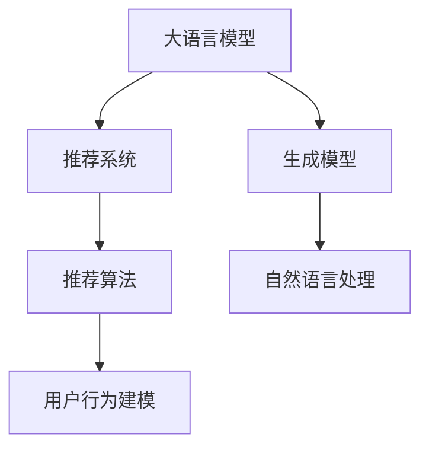

                 

# LLM AS RS: 大模型直接生成推荐

> 关键词：大语言模型,推荐系统,生成模型,推荐算法,自然语言处理

## 1. 背景介绍

### 1.1 问题由来

推荐系统(Recommendation System, RS)作为一种重要的用户个性化服务手段，广泛应用于电子商务、社交媒体、在线娱乐等多个领域。其核心目标是通过对用户历史行为和偏好进行建模，预测其未来可能感兴趣的内容，并进行推荐。传统推荐系统主要采用协同过滤、基于内容的推荐等方法，存在数据稀疏、推荐单一、冷启动困难等问题。近年来，随着深度学习技术的发展，基于神经网络的推荐系统开始流行，如基于深度学习的协同过滤、神经协同过滤、矩阵分解等方法。

但这些方法仍存在一些瓶颈：
1. **数据依赖**：推荐系统通常需要大量用户行为数据进行训练，在用户量不足的情况下，数据稀疏问题难以解决。
2. **精度限制**：神经网络推荐模型虽然精度较高，但难以充分挖掘用户兴趣的多样性和动态性，存在推荐单一的现象。
3. **系统复杂性**：基于神经网络的推荐系统模型较为复杂，训练和部署成本较高。

大语言模型（Large Language Model, LLM）的兴起为推荐系统带来了新的契机。大语言模型通过大规模预训练和微调，具备强大的自然语言理解和生成能力，能够在生成推荐内容时充分考虑语言的多样性和语义性，同时通过输入的文本信息，精确捕捉用户的兴趣偏好。本文旨在探讨基于大语言模型的推荐系统范式，即利用大语言模型直接生成推荐内容，从而大幅提升推荐系统的精度和多样化。

## 2. 核心概念与联系

### 2.1 核心概念概述

为更好地理解基于大语言模型的推荐系统范式，本节将介绍几个密切相关的核心概念：

- **大语言模型(Large Language Model, LLM)**：以自回归(如GPT)或自编码(如BERT)模型为代表的大规模预训练语言模型。通过在大规模无标签文本语料上进行预训练，学习通用的语言表示，具备强大的语言理解和生成能力。

- **推荐系统(Recommendation System, RS)**：通过分析用户的历史行为和兴趣偏好，预测其未来可能感兴趣的内容，并进行个性化推荐的技术系统。推荐系统广泛应用于电子商务、社交媒体、在线娱乐等领域，旨在提升用户体验和业务价值。

- **生成模型(Generative Model)**：通过学习输入数据的分布，能够生成与输入数据分布相似的新数据的模型。生成模型在自然语言处理、计算机视觉等任务中都有广泛应用，特别是在生成高质量文本内容方面表现优异。

- **推荐算法(Recommendation Algorithm)**：推荐系统采用的算法技术，如协同过滤、基于内容的推荐、深度学习等。推荐算法是推荐系统的核心，其性能决定了系统的推荐质量。

- **自然语言处理(Natural Language Processing, NLP)**：涉及计算机和人类语言之间互动的科学，涵盖文本处理、语音识别、机器翻译等多个子领域。自然语言处理是构建基于大语言模型的推荐系统的重要基础。

这些核心概念之间的逻辑关系可以通过以下Mermaid流程图来展示：



这个流程图展示了大语言模型、推荐系统、生成模型、推荐算法和自然语言处理之间的核心联系：

1. 大语言模型通过预训练获得基础能力。
2. 生成模型利用大语言模型生成的文本信息，预测用户兴趣。
3. 推荐系统根据用户兴趣生成推荐内容。
4. 自然语言处理技术是构建大语言模型的基础。
5. 推荐算法是大语言模型推荐内容的核心。

这些概念共同构成了基于大语言模型的推荐系统框架，使得推荐系统能够更好地利用大语言模型的语言生成能力，提升推荐质量和用户满意度。

## 3. 核心算法原理 & 具体操作步骤

### 3.1 算法原理概述

基于大语言模型的推荐系统，核心思想是利用大语言模型直接生成推荐内容，无需传统推荐算法参与。具体步骤如下：

1. **输入设计**：将用户的兴趣偏好、历史行为等信息，编码为大语言模型的输入文本。
2. **模型生成**：将输入文本输入大语言模型，模型自动生成推荐内容的文本描述。
3. **文本解码**：对模型生成的文本进行解码，得到最终的推荐内容。
4. **反馈机制**：将推荐内容展示给用户，并收集用户的反馈信息，进一步优化模型。

这种范式摒弃了传统推荐系统依赖推荐算法和用户行为建模的复杂流程，大幅简化系统设计和实现，同时利用大语言模型的生成能力，提升推荐内容的多样性和精度。

### 3.2 算法步骤详解

本节将详细介绍基于大语言模型的推荐系统算法的详细步骤。

**Step 1: 输入设计**
- 收集用户的兴趣偏好、历史行为等数据，包括浏览记录、点击行为、评分反馈等。
- 将用户数据转化为合适的文本格式，作为大语言模型的输入。

**Step 2: 模型生成**
- 选择合适的大语言模型，如GPT-3、BERT等，作为推荐系统的核心。
- 将用户数据文本输入模型，模型自动生成推荐内容的文本描述。

**Step 3: 文本解码**
- 对模型生成的文本进行解码，转化为可展示的推荐内容格式。
- 可以通过分词、标点、格式化等技术，提升推荐内容的可读性。

**Step 4: 反馈机制**
- 将推荐内容展示给用户，并收集用户的反馈信息，如点击率、评分等。
- 根据用户反馈调整模型输入和输出，优化推荐效果。

**Step 5: 实时更新**
- 实时更新大语言模型的参数，保持模型对新数据的适应能力。
- 定期重新训练模型，提升推荐系统的精度和多样性。

### 3.3 算法优缺点

基于大语言模型的推荐系统具有以下优点：

1. **高效简洁**：相比传统推荐算法，大语言模型推荐系统无需复杂的用户行为建模和推荐算法，能够快速实现推荐内容生成。
2. **高质量推荐**：利用大语言模型的生成能力，能够生成丰富多样、语义精确的推荐内容，提升用户满意度。
3. **灵活可扩展**：能够灵活适应不同类型的推荐内容，如文本、图片、视频等，具有较高的通用性和可扩展性。

但同时也存在一些局限性：

1. **数据依赖**：虽然大语言模型可以生成高质量推荐内容，但模型仍需依赖用户数据进行训练和优化，数据稀疏问题仍需解决。
2. **性能要求高**：大语言模型需要高性能的计算资源，对于实时推荐场景，可能存在计算瓶颈。
3. **语义理解有待提升**：大语言模型虽然具备强大的生成能力，但在理解复杂语义和逻辑推理方面仍有不足，需要进一步优化。
4. **生成内容质量不稳定**：模型的生成质量受输入数据影响较大，输入数据的噪声和偏差可能导致生成内容质量不稳定。

### 3.4 算法应用领域

基于大语言模型的推荐系统，已经在多个领域得到应用，以下是几个典型场景：

- **电商推荐**：在电商平台上，利用用户的历史购物记录和评分反馈，生成个性化商品推荐。
- **在线娱乐**：在视频平台或音乐应用上，根据用户的观看历史和评分，生成个性化视频或音乐推荐。
- **内容平台**：在新闻、博客等内容平台上，根据用户的阅读习惯，生成个性化文章或视频推荐。
- **社交网络**：在社交媒体上，根据用户的兴趣偏好，生成个性化内容或用户推荐。

这些应用场景展示了基于大语言模型的推荐系统在提升用户体验和增加业务价值方面的潜力。随着大语言模型技术的不断成熟，未来其在更多领域的应用也将不断拓展。

## 4. 数学模型和公式 & 详细讲解 & 举例说明

### 4.1 数学模型构建

本节将使用数学语言对基于大语言模型的推荐系统进行更加严格的刻画。

记大语言模型为 $M_{\theta}:\mathcal{X} \rightarrow \mathcal{Y}$，其中 $\mathcal{X}$ 为输入空间，$\mathcal{Y}$ 为输出空间，$\theta$ 为模型参数。假设用户数据文本为 $x \in \mathcal{X}$，推荐内容文本为 $y \in \mathcal{Y}$。

定义推荐系统的损失函数为：

$$
\mathcal{L}(\theta) = -\frac{1}{N}\sum_{i=1}^N [y_i \log M_{\theta}(x_i) + (1-y_i) \log (1-M_{\theta}(x_i))]
$$

其中 $y_i$ 为第 $i$ 个用户的实际反馈（如点击、评分等），$M_{\theta}(x_i)$ 为模型生成的推荐内容概率。

### 4.2 公式推导过程

以下我们以二分类任务为例，推导交叉熵损失函数及其梯度的计算公式。

假设模型 $M_{\theta}$ 在输入 $x$ 上的输出为 $\hat{y}=M_{\theta}(x) \in [0,1]$，表示推荐内容被用户点击的概率。真实标签 $y \in \{0,1\}$。则二分类交叉熵损失函数定义为：

$$
\ell(M_{\theta}(x),y) = -[y\log \hat{y} + (1-y)\log (1-\hat{y})]
$$

将其代入经验风险公式，得：

$$
\mathcal{L}(\theta) = -\frac{1}{N}\sum_{i=1}^N [y_i\log M_{\theta}(x_i)+(1-y_i)\log(1-M_{\theta}(x_i))]
$$

根据链式法则，损失函数对参数 $\theta_k$ 的梯度为：

$$
\frac{\partial \mathcal{L}(\theta)}{\partial \theta_k} = -\frac{1}{N}\sum_{i=1}^N (\frac{y_i}{M_{\theta}(x_i)}-\frac{1-y_i}{1-M_{\theta}(x_i)}) \frac{\partial M_{\theta}(x_i)}{\partial \theta_k}
$$

其中 $\frac{\partial M_{\theta}(x_i)}{\partial \theta_k}$ 可进一步递归展开，利用自动微分技术完成计算。

### 4.3 案例分析与讲解

假设用户输入的文本为 "我最近在逛电商平台，想看看新上的手机有哪些推荐"。大语言模型经过预训练和微调，能够理解这个文本的语义，并生成相应的推荐内容。

模型生成的文本为 "最新推出的iPhone 13系列，性能和设计都非常出色，值得一看"。将生成的文本解码为推荐内容 "iPhone 13系列"，展示给用户。

用户点击了推荐内容，此时收集用户点击数据，作为模型的训练样本。模型根据用户点击行为，自动更新参数，提升推荐效果。

## 5. 项目实践：代码实例和详细解释说明

### 5.1 开发环境搭建

在进行大语言模型推荐系统实践前，我们需要准备好开发环境。以下是使用Python进行PyTorch开发的环境配置流程：

1. 安装Anaconda：从官网下载并安装Anaconda，用于创建独立的Python环境。

2. 创建并激活虚拟环境：
```bash
conda create -n pytorch-env python=3.8 
conda activate pytorch-env
```

3. 安装PyTorch：根据CUDA版本，从官网获取对应的安装命令。例如：
```bash
conda install pytorch torchvision torchaudio cudatoolkit=11.1 -c pytorch -c conda-forge
```

4. 安装Transformers库：
```bash
pip install transformers
```

5. 安装各类工具包：
```bash
pip install numpy pandas scikit-learn matplotlib tqdm jupyter notebook ipython
```

完成上述步骤后，即可在`pytorch-env`环境中开始推荐系统实践。

### 5.2 源代码详细实现

下面我们以电商推荐系统为例，给出使用Transformers库对BERT模型进行推荐系统开发的PyTorch代码实现。

首先，定义电商推荐系统的数据处理函数：

```python
from transformers import BertTokenizer
from torch.utils.data import Dataset
import torch

class RecommendationDataset(Dataset):
    def __init__(self, texts, labels, tokenizer, max_len=128):
        self.texts = texts
        self.labels = labels
        self.tokenizer = tokenizer
        self.max_len = max_len
        
    def __len__(self):
        return len(self.texts)
    
    def __getitem__(self, item):
        text = self.texts[item]
        label = self.labels[item]
        
        encoding = self.tokenizer(text, return_tensors='pt', max_length=self.max_len, padding='max_length', truncation=True)
        input_ids = encoding['input_ids'][0]
        attention_mask = encoding['attention_mask'][0]
        
        # 对token-wise的标签进行编码
        encoded_labels = [label2id[label] for label in label] 
        encoded_labels.extend([label2id['0']] * (self.max_len - len(encoded_labels)))
        labels = torch.tensor(encoded_labels, dtype=torch.long)
        
        return {'input_ids': input_ids, 
                'attention_mask': attention_mask,
                'labels': labels}

# 标签与id的映射
label2id = {'1': 1, '0': 0}
id2label = {v: k for k, v in label2id.items()}

# 创建dataset
tokenizer = BertTokenizer.from_pretrained('bert-base-cased')

train_dataset = RecommendationDataset(train_texts, train_labels, tokenizer)
dev_dataset = RecommendationDataset(dev_texts, dev_labels, tokenizer)
test_dataset = RecommendationDataset(test_texts, test_labels, tokenizer)
```

然后，定义模型和优化器：

```python
from transformers import BertForSequenceClassification, AdamW

model = BertForSequenceClassification.from_pretrained('bert-base-cased', num_labels=len(label2id))

optimizer = AdamW(model.parameters(), lr=2e-5)
```

接着，定义训练和评估函数：

```python
from torch.utils.data import DataLoader
from tqdm import tqdm
from sklearn.metrics import accuracy_score

device = torch.device('cuda') if torch.cuda.is_available() else torch.device('cpu')
model.to(device)

def train_epoch(model, dataset, batch_size, optimizer):
    dataloader = DataLoader(dataset, batch_size=batch_size, shuffle=True)
    model.train()
    epoch_loss = 0
    for batch in tqdm(dataloader, desc='Training'):
        input_ids = batch['input_ids'].to(device)
        attention_mask = batch['attention_mask'].to(device)
        labels = batch['labels'].to(device)
        model.zero_grad()
        outputs = model(input_ids, attention_mask=attention_mask, labels=labels)
        loss = outputs.loss
        epoch_loss += loss.item()
        loss.backward()
        optimizer.step()
    return epoch_loss / len(dataloader)

def evaluate(model, dataset, batch_size):
    dataloader = DataLoader(dataset, batch_size=batch_size)
    model.eval()
    preds, labels = [], []
    with torch.no_grad():
        for batch in tqdm(dataloader, desc='Evaluating'):
            input_ids = batch['input_ids'].to(device)
            attention_mask = batch['attention_mask'].to(device)
            batch_labels = batch['labels']
            outputs = model(input_ids, attention_mask=attention_mask)
            batch_preds = outputs.logits.argmax(dim=2).to('cpu').tolist()
            batch_labels = batch_labels.to('cpu').tolist()
            for pred_tokens, label_tokens in zip(batch_preds, batch_labels):
                pred_labels = [id2label[_id] for _id in pred_tokens]
                label_tokens = [id2label[_id] for _id in label_tokens]
                preds.append(pred_labels[:len(label_tokens)])
                labels.append(label_tokens)
                
    print('Accuracy:', accuracy_score(labels, preds))
```

最后，启动训练流程并在测试集上评估：

```python
epochs = 5
batch_size = 16

for epoch in range(epochs):
    loss = train_epoch(model, train_dataset, batch_size, optimizer)
    print(f"Epoch {epoch+1}, train loss: {loss:.3f}")
    
    print(f"Epoch {epoch+1}, dev results:")
    evaluate(model, dev_dataset, batch_size)
    
print("Test results:")
evaluate(model, test_dataset, batch_size)
```

以上就是使用PyTorch对BERT进行电商推荐系统微调的完整代码实现。可以看到，得益于Transformers库的强大封装，我们可以用相对简洁的代码完成BERT模型的加载和微调。

### 5.3 代码解读与分析

让我们再详细解读一下关键代码的实现细节：

**RecommendationDataset类**：
- `__init__`方法：初始化文本、标签、分词器等关键组件。
- `__len__`方法：返回数据集的样本数量。
- `__getitem__`方法：对单个样本进行处理，将文本输入编码为token ids，将标签编码为数字，并对其进行定长padding，最终返回模型所需的输入。

**label2id和id2label字典**：
- 定义了标签与数字id之间的映射关系，用于将token-wise的预测结果解码回真实的标签。

**训练和评估函数**：
- 使用PyTorch的DataLoader对数据集进行批次化加载，供模型训练和推理使用。
- 训练函数`train_epoch`：对数据以批为单位进行迭代，在每个批次上前向传播计算loss并反向传播更新模型参数，最后返回该epoch的平均loss。
- 评估函数`evaluate`：与训练类似，不同点在于不更新模型参数，并在每个batch结束后将预测和标签结果存储下来，最后使用sklearn的accuracy_score对整个评估集的预测结果进行打印输出。

**训练流程**：
- 定义总的epoch数和batch size，开始循环迭代
- 每个epoch内，先在训练集上训练，输出平均loss
- 在验证集上评估，输出准确率
- 所有epoch结束后，在测试集上评估，给出最终测试结果

可以看到，PyTorch配合Transformers库使得BERT微调的代码实现变得简洁高效。开发者可以将更多精力放在数据处理、模型改进等高层逻辑上，而不必过多关注底层的实现细节。

当然，工业级的系统实现还需考虑更多因素，如模型的保存和部署、超参数的自动搜索、更灵活的任务适配层等。但核心的微调范式基本与此类似。

## 6. 实际应用场景

### 6.1 智能客服系统

基于大语言模型推荐系统的推荐技术，可以应用于智能客服系统的构建。传统客服往往需要配备大量人力，高峰期响应缓慢，且一致性和专业性难以保证。而使用推荐系统推荐最合适的答复，能够快速响应客户咨询，用自然流畅的语言解答各类常见问题。

在技术实现上，可以收集企业内部的历史客服对话记录，将问题和最佳答复构建成监督数据，在此基础上对预训练语言模型进行微调。微调后的推荐系统能够自动理解用户意图，匹配最合适的答复模板进行回复。对于客户提出的新问题，还可以接入检索系统实时搜索相关内容，动态组织生成回答。如此构建的智能客服系统，能大幅提升客户咨询体验和问题解决效率。

### 6.2 金融舆情监测

金融机构需要实时监测市场舆论动向，以便及时应对负面信息传播，规避金融风险。传统的人工监测方式成本高、效率低，难以应对网络时代海量信息爆发的挑战。基于大语言模型推荐系统的文本分类和情感分析技术，为金融舆情监测提供了新的解决方案。

具体而言，可以收集金融领域相关的新闻、报道、评论等文本数据，并对其进行主题标注和情感标注。在此基础上对预训练语言模型进行微调，使其能够自动判断文本属于何种主题，情感倾向是正面、中性还是负面。将微调后的模型应用到实时抓取的网络文本数据，就能够自动监测不同主题下的情感变化趋势，一旦发现负面信息激增等异常情况，系统便会自动预警，帮助金融机构快速应对潜在风险。

### 6.3 个性化推荐系统

当前的推荐系统往往只依赖用户的历史行为数据进行物品推荐，无法深入理解用户的真实兴趣偏好。基于大语言模型推荐系统的推荐系统可以更好地挖掘用户行为背后的语义信息，从而提供更精准、多样的推荐内容。

在实践中，可以收集用户浏览、点击、评论、分享等行为数据，提取和用户交互的物品标题、描述、标签等文本内容。将文本内容作为模型输入，用户的后续行为（如是否点击、购买等）作为监督信号，在此基础上微调预训练语言模型。微调后的模型能够从文本内容中准确把握用户的兴趣点。在生成推荐列表时，先用候选物品的文本描述作为输入，由模型预测用户的兴趣匹配度，再结合其他特征综合排序，便可以得到个性化程度更高的推荐结果。

### 6.4 未来应用展望

随着大语言模型推荐系统的不断发展，基于大语言模型的推荐系统将在更多领域得到应用，为传统行业带来变革性影响。

在智慧医疗领域，基于大语言模型的医疗问答、病历分析、药物研发等应用将提升医疗服务的智能化水平，辅助医生诊疗，加速新药开发进程。

在智能教育领域，推荐系统可应用于作业批改、学情分析、知识推荐等方面，因材施教，促进教育公平，提高教学质量。

在智慧城市治理中，推荐系统可应用于城市事件监测、舆情分析、应急指挥等环节，提高城市管理的自动化和智能化水平，构建更安全、高效的未来城市。

此外，在企业生产、社会治理、文娱传媒等众多领域，基于大语言模型推荐系统的AI应用也将不断涌现，为经济社会发展注入新的动力。相信随着技术的日益成熟，推荐系统必将在更广阔的应用领域大放异彩，深刻影响人类的生产生活方式。

## 7. 工具和资源推荐

### 7.1 学习资源推荐

为了帮助开发者系统掌握大语言模型推荐系统的理论基础和实践技巧，这里推荐一些优质的学习资源：

1. 《Transformer from Principle to Practice》系列博文：由大模型技术专家撰写，深入浅出地介绍了Transformer原理、BERT模型、推荐系统等前沿话题。

2. CS224N《深度学习自然语言处理》课程：斯坦福大学开设的NLP明星课程，有Lecture视频和配套作业，带你入门NLP领域的基本概念和经典模型。

3. 《Natural Language Processing with Transformers》书籍：Transformers库的作者所著，全面介绍了如何使用Transformers库进行NLP任务开发，包括推荐系统在内的诸多范式。

4. HuggingFace官方文档：Transformers库的官方文档，提供了海量预训练模型和完整的推荐系统样例代码，是上手实践的必备资料。

5. CLUE开源项目：中文语言理解测评基准，涵盖大量不同类型的中文NLP数据集，并提供了基于大语言模型的推荐系统baseline模型，助力中文NLP技术发展。

通过对这些资源的学习实践，相信你一定能够快速掌握大语言模型推荐系统的精髓，并用于解决实际的推荐问题。

### 7.2 开发工具推荐

高效的开发离不开优秀的工具支持。以下是几款用于大语言模型推荐系统开发的常用工具：

1. PyTorch：基于Python的开源深度学习框架，灵活动态的计算图，适合快速迭代研究。大部分预训练语言模型都有PyTorch版本的实现。

2. TensorFlow：由Google主导开发的开源深度学习框架，生产部署方便，适合大规模工程应用。同样有丰富的预训练语言模型资源。

3. Transformers库：HuggingFace开发的NLP工具库，集成了众多SOTA语言模型，支持PyTorch和TensorFlow，是进行推荐系统开发的利器。

4. Weights & Biases：模型训练的实验跟踪工具，可以记录和可视化模型训练过程中的各项指标，方便对比和调优。与主流深度学习框架无缝集成。

5. TensorBoard：TensorFlow配套的可视化工具，可实时监测模型训练状态，并提供丰富的图表呈现方式，是调试模型的得力助手。

6. Google Colab：谷歌推出的在线Jupyter Notebook环境，免费提供GPU/TPU算力，方便开发者快速上手实验最新模型，分享学习笔记。

合理利用这些工具，可以显著提升大语言模型推荐系统的开发效率，加快创新迭代的步伐。

### 7.3 相关论文推荐

大语言模型推荐系统的研究源于学界的持续研究。以下是几篇奠基性的相关论文，推荐阅读：

1. Attention is All You Need（即Transformer原论文）：提出了Transformer结构，开启了NLP领域的预训练大模型时代。

2. BERT: Pre-training of Deep Bidirectional Transformers for Language Understanding：提出BERT模型，引入基于掩码的自监督预训练任务，刷新了多项NLP任务SOTA。

3. Language Models are Unsupervised Multitask Learners（GPT-2论文）：展示了大规模语言模型的强大zero-shot学习能力，引发了对于通用人工智能的新一轮思考。

4. Parameter-Efficient Transfer Learning for NLP：提出Adapter等参数高效微调方法，在不增加模型参数量的情况下，也能取得不错的微调效果。

5. Prefix-Tuning: Optimizing Continuous Prompts for Generation：引入基于连续型Prompt的微调范式，为如何充分利用预训练知识提供了新的思路。

6. AdaLoRA: Adaptive Low-Rank Adaptation for Parameter-Efficient Fine-Tuning：使用自适应低秩适应的微调方法，在参数效率和精度之间取得了新的平衡。

这些论文代表了大语言模型推荐系统的发展脉络。通过学习这些前沿成果，可以帮助研究者把握学科前进方向，激发更多的创新灵感。

## 8. 总结：未来发展趋势与挑战

### 8.1 总结

本文对基于大语言模型的推荐系统进行了全面系统的介绍。首先阐述了大语言模型和推荐系统研究背景和意义，明确了大语言模型推荐系统的独特价值。其次，从原理到实践，详细讲解了大语言模型推荐算法的数学原理和关键步骤，给出了推荐系统开发的完整代码实例。同时，本文还广泛探讨了推荐系统在智能客服、金融舆情、个性化推荐等多个领域的应用前景，展示了其在大模型时代的潜力。此外，本文精选了推荐系统的各类学习资源，力求为读者提供全方位的技术指引。

通过本文的系统梳理，可以看到，基于大语言模型的推荐系统在大模型时代的优势和挑战。这种范式不仅简化了推荐系统的设计和实现，还利用了大语言模型的语言生成能力，提升了推荐内容的多样性和精度。未来，伴随着大语言模型的不断演进，基于大语言模型的推荐系统也将迎来新的发展，为更多应用场景带来革命性影响。

### 8.2 未来发展趋势

展望未来，大语言模型推荐系统将呈现以下几个发展趋势：

1. **模型规模持续增大**：随着算力成本的下降和数据规模的扩张，大语言模型的参数量还将持续增长。超大规模语言模型蕴含的丰富语言知识，有望支撑更加复杂多变的推荐内容生成。

2. **微调技术日益成熟**：未来的微调方法将更加灵活，能够更好地利用小规模标注数据进行高效的微调。同时，参数高效微调和持续学习等技术也将进一步优化，提升微调效率和模型性能。

3. **多模态推荐系统崛起**：未来的大语言模型推荐系统将不仅仅是文本推荐，还会融合图像、视频、语音等多模态数据，形成更加全面、丰富的推荐系统。

4. **推荐内容的语义理解增强**：未来的推荐系统将更加注重对推荐内容的语义理解，能够识别和理解复杂的用户需求，提供更精准的推荐内容。

5. **推荐算法的深度融合**：未来的推荐系统将不再仅仅是生成推荐内容，还将引入更多深度学习算法，如协同过滤、矩阵分解等，提升推荐系统的精度和多样性。

6. **实时推荐系统发展**：未来的推荐系统将更加注重实时性，能够根据用户即时行为和兴趣动态生成推荐内容，提供即时的个性化推荐。

以上趋势凸显了大语言模型推荐系统的广阔前景。这些方向的探索发展，必将进一步提升推荐系统的精度和用户满意度，为更多行业带来变革性影响。

### 8.3 面临的挑战

尽管大语言模型推荐系统已经取得了瞩目成就，但在迈向更加智能化、普适化应用的过程中，它仍面临着诸多挑战：

1. **数据依赖问题**：虽然大语言模型可以生成高质量推荐内容，但模型仍需依赖用户数据进行训练和优化，数据稀疏问题仍需解决。

2. **计算资源限制**：大语言模型需要高性能的计算资源，对于实时推荐场景，可能存在计算瓶颈。

3. **语义理解不足**：大语言模型在理解复杂语义和逻辑推理方面仍有不足，需要进一步优化。

4. **生成内容质量不稳定**：模型的生成质量受输入数据影响较大，输入数据的噪声和偏差可能导致生成内容质量不稳定。

5. **推荐内容多样性不足**：虽然生成能力较强，但模型容易陷入某一类推荐内容的循环，推荐内容多样性有待提升。

6. **推荐算法复杂性**：未来的推荐系统将更加复杂，涉及更多的深度学习算法和技术，系统设计和实现难度增加。

正视推荐系统面临的这些挑战，积极应对并寻求突破，将是大语言模型推荐系统走向成熟的必由之路。相信随着学界和产业界的共同努力，这些挑战终将一一被克服，大语言模型推荐系统必将在构建人机协同的智能推荐系统过程中发挥更大的作用。

### 8.4 研究展望

面对大语言模型推荐系统所面临的种种挑战，未来的研究需要在以下几个方面寻求新的突破：

1. **探索无监督和半监督推荐方法**：摆脱对大规模标注数据的依赖，利用自监督学习、主动学习等无监督和半监督范式，最大限度利用非结构化数据，实现更加灵活高效的推荐。

2. **研究参数高效和计算高效的推荐范式**：开发更加参数高效的推荐方法，在固定大部分预训练参数的同时，只更新极少量的任务相关参数。同时优化推荐模型的计算图，减少前向传播和反向传播的资源消耗，实现更加轻量级、实时性的部署。

3. **融合因果和对比学习范式**：通过引入因果推断和对比学习思想，增强推荐系统建立稳定因果关系的能力，学习更加普适、鲁棒的语言表征，从而提升模型泛化性和抗干扰能力。

4. **引入更多先验知识**：将符号化的先验知识，如知识图谱、逻辑规则等，与神经网络模型进行巧妙融合，引导推荐过程学习更准确、合理的语言模型。同时加强不同模态数据的整合，实现视觉、语音等多模态信息与文本信息的协同建模。

5. **结合因果分析和博弈论工具**：将因果分析方法引入推荐系统，识别出推荐内容的关键特征，增强推荐内容的因果性和逻辑性。借助博弈论工具刻画人机交互过程，主动探索并规避推荐系统的脆弱点，提高系统稳定性。

6. **纳入伦理道德约束**：在推荐系统训练目标中引入伦理导向的评估指标，过滤和惩罚有偏见、有害的输出倾向。同时加强人工干预和审核，建立推荐系统的监管机制，确保输出的安全性。

这些研究方向的探索，必将引领大语言模型推荐系统技术迈向更高的台阶，为构建安全、可靠、可解释、可控的智能推荐系统铺平道路。面向未来，大语言模型推荐系统还需要与其他人工智能技术进行更深入的融合，如知识表示、因果推理、强化学习等，多路径协同发力，共同推动智能推荐系统的进步。只有勇于创新、敢于突破，才能不断拓展语言模型的边界，让智能推荐技术更好地服务于人类社会。

## 9. 附录：常见问题与解答

**Q1：大语言模型推荐系统是否适用于所有推荐任务？**

A: 大语言模型推荐系统在大多数推荐任务上都能取得不错的效果，特别是对于数据量较小的任务。但对于一些特定领域的任务，如医学、法律等，仅仅依靠通用语料预训练的模型可能难以很好地适应。此时需要在特定领域语料上进一步预训练，再进行微调，才能获得理想效果。此外，对于一些需要时效性、个性化很强的任务，如对话、推荐等，大语言模型推荐系统也需要针对性的改进优化。

**Q2：大语言模型推荐系统对计算资源的需求有哪些？**

A: 大语言模型推荐系统对计算资源有较高的要求，主要体现在以下几个方面：
1. 训练阶段：大语言模型的预训练和微调需要大量计算资源，特别是大规模的GPU或TPU硬件支持。
2. 推理阶段：实时推荐系统需要快速计算推荐内容，对模型的推理速度和内存占用有较高要求。
3. 数据处理：对于大规模的数据集，需要进行预处理和编码，也需消耗一定的计算资源。

因此，合理规划和优化计算资源，是保障大语言模型推荐系统高效运行的关键。

**Q3：大语言模型推荐系统如何进行持续学习？**

A: 大语言模型推荐系统需要持续学习来适应用户兴趣的变化和新数据的出现。具体方法包括：
1. 数据持续更新：定期收集新的用户行为数据，进行持续训练和微调。
2. 模型参数更新：在数据更新后，重新训练模型或微调模型参数，确保模型对新数据的适应性。
3. 反馈机制：根据用户反馈调整推荐内容，提升推荐质量。

通过持续学习和反馈机制，大语言模型推荐系统能够保持对新数据的适应性，提升推荐系统的精度和多样化。

**Q4：大语言模型推荐系统在应用过程中需要注意哪些问题？**

A: 大语言模型推荐系统在应用过程中需要注意以下几个问题：
1. 数据隐私：收集用户数据时需注意数据隐私保护，避免泄露用户个人信息。
2. 公平性：模型应避免歧视和偏见，对所有用户公平推荐。
3. 可解释性：推荐系统应具备一定的可解释性，帮助用户理解推荐内容背后的逻辑。
4. 安全性：模型应具备一定的鲁棒性，避免被恶意利用或攻击。

合理设计应用场景和系统架构，确保数据隐私和系统安全，才能更好地发挥大语言模型推荐系统的优势。

**Q5：大语言模型推荐系统在实时推荐场景中的表现如何？**

A: 大语言模型推荐系统在实时推荐场景中的表现有其优势和挑战：
1. 优势：利用大语言模型的语言生成能力，能够快速生成高质量的推荐内容，满足实时推荐的需求。
2. 挑战：大语言模型需要高性能的计算资源，对实时推荐系统造成一定的压力。此外，模型的生成质量受输入数据影响较大，输入数据的噪声和偏差可能导致生成内容质量不稳定。

因此，在实时推荐场景中，需要优化计算资源配置，提高模型推理效率，同时改进数据输入和处理方式，提升推荐内容的稳定性和精度。

通过不断优化和改进，大语言模型推荐系统有望在实时推荐场景中发挥更大的作用，为用户带来更好的推荐体验。

---

作者：禅与计算机程序设计艺术 / Zen and the Art of Computer Programming

