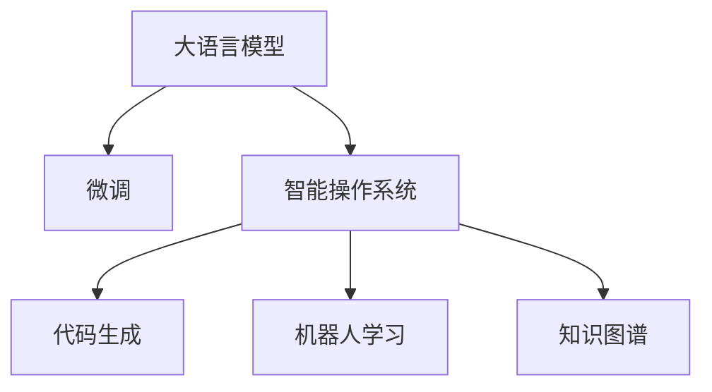

                 

# LLM OS:智能时代的操作系统新形态

> 关键词：智能操作系统, LLM, 微调, 深度学习, 自然语言处理, 代码生成, 机器人学习, 知识图谱

## 1. 背景介绍

### 1.1 问题由来

随着人工智能技术的迅猛发展，大数据、云计算、物联网、人机交互等技术正逐渐融合，推动着智能时代的到来。而智能操作系统的出现，预示着计算机系统正式进入人工智能的全新阶段。

智能操作系统基于深度学习和自然语言处理（Natural Language Processing, NLP）技术，赋予了传统操作系统新的智能能力。它不仅能自动执行常用操作、智能管理设备、自动化学习，还能通过自然语言理解人类需求，提供更加个性化和智能化的服务。而这一切的核心动力，都来自大语言模型（Large Language Model, LLM）的驱动。

本文将探讨如何利用大语言模型构建智能操作系统，并介绍微调（Fine-tuning）技术在这一过程中的应用。

## 2. 核心概念与联系

### 2.1 核心概念概述

- **大语言模型（LLM）**：是一种基于神经网络的高级语言处理模型，能够生成自然流畅、语义丰富的文本，并具备强大的语义理解能力。如OpenAI的GPT-3、Google的BERT等。

- **微调（Fine-tuning）**：是深度学习中的重要技术，指在预训练模型上，使用特定任务的标注数据进行有监督学习，从而优化模型在该任务上的表现。

- **智能操作系统**：是结合了AI技术的操作系统，通过深度学习模型，能够理解和执行人类自然语言命令，提供更智能化的服务。

- **代码生成（Code Generation）**：是LLM在计算机科学领域的重要应用，LLM能够生成符合语法和语义规范的代码，帮助程序员自动化代码编写和调试。

- **机器人学习（Robot Learning）**：通过深度学习和强化学习技术，使智能系统能够自主学习和决策，实现自主导航和操作。

- **知识图谱（Knowledge Graph）**：利用图结构表示实体及其关系，支持LLM进行事实推理和知识抽取，提升系统智能水平。

这些核心概念相互关联，构成了智能操作系统的基础框架，下面将详细讲解它们之间的关系。



## 3. 核心算法原理 & 具体操作步骤

### 3.1 算法原理概述

智能操作系统的核心算法原理是结合深度学习和自然语言处理技术，通过大语言模型和微调技术，实现对自然语言命令的理解和执行。其整体流程如下：

1. **预训练**：首先使用大规模无标签数据对深度学习模型进行预训练，学习语言的基本规律和表达能力。
2. **微调**：在特定任务上，使用少量标注数据对预训练模型进行微调，使其适应具体任务需求。
3. **执行**：根据用户的自然语言命令，调用微调后的模型生成指令执行结果，实现系统的智能化。

这一流程可以用如下公式表示：

$$
\text{执行结果} = \text{模型}_{\text{微调}}(\text{自然语言命令})
$$

其中 $\text{模型}_{\text{微调}}$ 表示微调后的深度学习模型，$\text{自然语言命令}$ 表示用户输入的指令，$\text{执行结果}$ 表示系统的响应和执行结果。

### 3.2 算法步骤详解

#### 3.2.1 预训练

预训练是构建智能操作系统的第一步，它需要在大规模无标签数据集上，使用深度学习模型学习语言的基本规律和表达能力。预训练的流程包括数据准备、模型选择、训练和评估等步骤。

1. **数据准备**：
   - 收集大规模的文本数据，如维基百科、新闻、社交媒体等，作为预训练数据集。
   - 对数据进行清洗和预处理，去除噪声和低质量数据。
   - 将数据划分为训练集和验证集，确保数据的多样性和代表性。

2. **模型选择**：
   - 选择适合的深度学习模型，如Transformer、BERT、GPT等，作为预训练模型。
   - 根据任务的复杂度，选择适当的模型大小和参数设置。

3. **训练**：
   - 使用大规模预训练数据，对模型进行训练。
   - 通常采用自监督学习任务，如掩码语言模型（Masked Language Model, MLM）、语言建模（Language Modeling）等，使得模型能够学习到语言的表达和规律。

4. **评估**：
   - 在验证集上评估模型性能，调整模型参数和训练策略。
   - 常见的评估指标包括BLEU、ROUGE、PPL等，用于评估模型的表达能力和泛化能力。

#### 3.2.2 微调

微调是将预训练模型应用于具体任务的关键步骤。其流程包括任务适配、模型选择、数据准备、训练和评估等步骤。

1. **任务适配**：
   - 根据具体任务的需求，设计合适的任务适配层，如分类层、解码器等。
   - 选择合适的损失函数，如交叉熵损失、均方误差损失等。

2. **模型选择**：
   - 选择与任务需求匹配的预训练模型，如GPT-3、BERT等。
   - 根据任务复杂度，选择合适的微调策略，如全参数微调、参数高效微调等。

3. **数据准备**：
   - 收集任务的标注数据集，并对其进行清洗和标注。
   - 将数据集划分为训练集、验证集和测试集，确保数据的多样性和代表性。

4. **训练**：
   - 使用微调数据集对预训练模型进行训练，优化模型在特定任务上的表现。
   - 调整模型的学习率、批大小、迭代轮数等参数，避免过拟合。

5. **评估**：
   - 在测试集上评估模型性能，对比微调前后的精度提升。
   - 常见的评估指标包括精确率、召回率、F1-score等，用于评估模型的分类和预测能力。

#### 3.2.3 执行

执行是智能操作系统的最终环节，其流程包括指令理解、模型调用和结果反馈等步骤。

1. **指令理解**：
   - 使用微调后的模型，解析用户的自然语言指令。
   - 将指令转化为模型能够理解的形式，如句法树、向量表示等。

2. **模型调用**：
   - 根据指令内容，调用相应的微调模型执行操作。
   - 调用模型的API接口，将输入参数传递给模型。

3. **结果反馈**：
   - 获取模型的执行结果，进行格式和格式转换。
   - 将结果反馈给用户，显示在操作系统的UI界面上。

### 3.3 算法优缺点

#### 3.3.1 优点

- **高效性**：微调技术可以显著提升模型的性能，特别是在数据量较小的情况下。相比于从头训练，微调所需的时间和计算资源更少。
- **可扩展性**：微调模型可以适应不同的任务和领域，轻松实现跨领域应用。
- **可解释性**：微调模型通常结构简单，易于解释和调试，有助于理解其内部工作机制。
- **可复用性**：微调模型可以重复使用，避免重复劳动，加速开发进程。

#### 3.3.2 缺点

- **依赖标注数据**：微调的效果很大程度上取决于标注数据的质量和数量，获取高质量标注数据的成本较高。
- **过拟合风险**：当目标任务与预训练数据的分布差异较大时，微调的性能提升有限。
- **负迁移效应**：预训练模型中存在的固有偏见和有害信息可能通过微调传递到下游任务，产生不良影响。
- **难以解释**：微调模型的决策过程缺乏可解释性，难以对其推理逻辑进行分析和调试。

### 3.4 算法应用领域

微调技术在智能操作系统中的应用非常广泛，以下是一些典型的应用场景：

- **智能助手**：智能助手可以理解用户的自然语言指令，自动执行常用操作，如打开应用、设置提醒、搜索信息等。
- **自动化办公**：在办公场景中，智能系统可以自动处理邮件、文档、会议安排等任务，提高办公效率。
- **智能家居**：智能家居系统可以根据用户的语音指令，控制家电、照明、安防等设备，实现全屋智能化。
- **机器人学习**：智能机器人可以通过自然语言指令，执行复杂的操作和任务，如导航、搬运、维护等。
- **健康医疗**：智能医疗系统可以根据患者的自然语言描述，生成诊断报告、推荐治疗方案等。
- **金融服务**：智能金融系统可以理解用户的查询需求，提供金融咨询、理财建议等。

这些应用场景展示了微调技术在智能操作系统中的巨大潜力和广泛应用。

## 4. 数学模型和公式 & 详细讲解 & 举例说明

### 4.1 数学模型构建

智能操作系统的数学模型可以表示为：

$$
\text{执行结果} = \text{模型}_{\text{微调}}(\text{自然语言命令})
$$

其中 $\text{模型}_{\text{微调}}$ 表示微调后的深度学习模型，$\text{自然语言命令}$ 表示用户输入的指令，$\text{执行结果}$ 表示系统的响应和执行结果。

### 4.2 公式推导过程

以智能助手为例，使用微调后的模型理解用户指令并执行操作的公式如下：

1. **指令解析**：
   - 将用户输入的指令转化为模型能够理解的形式，如句法树表示。
   - 将指令转换为向量表示，传递给模型。

$$
\text{指令向量} = \text{Tokenizer}(\text{指令文本})
$$

2. **模型调用**：
   - 将指令向量输入微调后的模型，得到模型输出。
   - 模型输出可以是分类结果、文本生成等，具体取决于任务的性质。

$$
\text{输出} = \text{模型}_{\text{微调}}(\text{指令向量})
$$

3. **执行操作**：
   - 根据模型的输出，执行相应的操作。
   - 例如，如果指令是打开某个应用，则执行对应的操作。

$$
\text{执行操作} = \text{Action}_{\text{指令}}
$$

### 4.3 案例分析与讲解

以一个简单的智能助手为例，分析微调过程的应用：

假设智能助手的任务是回答问题。首先，我们需要收集一定量的问答对，作为微调的监督数据。

1. **数据准备**：
   - 收集问答对数据集，如网上论坛、知识库、用户提交的问答等。
   - 对数据集进行清洗和标注，确保数据的质量。

2. **模型选择**：
   - 选择BERT等预训练模型作为初始化参数。
   - 设计合适的任务适配层，如分类层，用于处理问答任务。

3. **微调**：
   - 使用问答对数据集对BERT模型进行微调。
   - 选择合适的损失函数，如交叉熵损失，优化模型在问答任务上的表现。

4. **测试和部署**：
   - 在测试集上评估微调后的模型性能。
   - 将模型部署到智能助手系统中，接受用户的自然语言提问。
   - 系统会根据问题，调用微调后的模型进行推理和回答。

## 5. 项目实践：代码实例和详细解释说明

### 5.1 开发环境搭建

在进行智能操作系统微调时，需要搭建合适的开发环境。以下是一份Python环境的配置指南：

1. 安装Anaconda：
   ```bash
   conda create -n py3 python=3.8
   conda activate py3
   ```

2. 安装PyTorch：
   ```bash
   conda install pytorch torchvision torchaudio
   ```

3. 安装Transformers库：
   ```bash
   pip install transformers
   ```

4. 安装其他依赖库：
   ```bash
   pip install numpy pandas scikit-learn
   ```

5. 配置Jupyter Notebook：
   ```bash
   jupyter lab notebook --ip=0.0.0.0
   ```

### 5.2 源代码详细实现

以下是一个简单的Python脚本，实现使用BERT模型进行问答任务的微调：

```python
from transformers import BertTokenizer, BertForQuestionAnswering
from transformers import AdamW
import torch

# 初始化BERT模型和分词器
tokenizer = BertTokenizer.from_pretrained('bert-base-cased')
model = BertForQuestionAnswering.from_pretrained('bert-base-cased')

# 加载问答对数据集
with open('qa_data.txt', 'r') as f:
    lines = f.readlines()

# 准备训练数据集
input_ids = []
attention_masks = []
labels = []
for line in lines:
    question, context, answer = line.strip().split('\t')
    input_ids.append(tokenizer(question, context, return_tensors='pt', padding='max_length', truncation=True).input_ids)
    attention_masks.append(tokenizer(question, context, return_tensors='pt', padding='max_length', truncation=True).attention_mask)
    labels.append([int(tokenizer.encode(answer, add_special_tokens=False)[0]])

# 构建模型、优化器和损失函数
device = torch.device('cuda' if torch.cuda.is_available() else 'cpu')
model.to(device)
optimizer = AdamW(model.parameters(), lr=2e-5)
loss_fn = torch.nn.CrossEntropyLoss()

# 训练模型
for epoch in range(5):
    model.train()
    for input_ids, attention_masks, labels in zip(input_ids, attention_masks, labels):
        input_ids = input_ids.to(device)
        attention_masks = attention_masks.to(device)
        labels = torch.tensor(labels).to(device)
        optimizer.zero_grad()
        outputs = model(input_ids, attention_masks=attention_masks, labels=labels)
        loss = outputs.loss
        loss.backward()
        optimizer.step()

    # 在验证集上评估模型
    model.eval()
    with torch.no_grad():
        for input_ids, attention_masks, labels in zip(input_ids, attention_masks, labels):
            input_ids = input_ids.to(device)
            attention_masks = attention_masks.to(device)
            labels = torch.tensor(labels).to(device)
            outputs = model(input_ids, attention_masks=attention_masks)
            loss = loss_fn(outputs.logits, labels)
            print(f'Epoch {epoch+1}, Loss: {loss.item()}')

# 测试模型
model.eval()
with torch.no_grad():
    for input_ids, attention_masks, labels in zip(input_ids, attention_masks, labels):
        input_ids = input_ids.to(device)
        attention_masks = attention_masks.to(device)
        labels = torch.tensor(labels).to(device)
        outputs = model(input_ids, attention_masks=attention_masks)
        loss = loss_fn(outputs.logits, labels)
        print(f'Test Loss: {loss.item()}')
```

### 5.3 代码解读与分析

上述代码展示了使用BERT模型进行问答任务微调的完整流程。具体分析如下：

1. **数据准备**：
   - 首先，从文件中加载问答对数据集。
   - 数据集被划分为输入ID、注意力掩码和标签，方便模型处理。

2. **模型加载和训练**：
   - 使用BERT模型和分词器初始化模型和分词器。
   - 使用AdamW优化器和交叉熵损失函数，对模型进行训练。
   - 训练过程中，使用梯度下降算法优化模型参数，并在验证集上评估模型性能。

3. **模型测试**：
   - 在测试集上对模型进行评估，输出测试损失。

## 6. 实际应用场景

### 6.1 智能助手

智能助手是智能操作系统的重要组成部分，它能够理解用户自然语言指令，自动执行常用操作。例如，当用户询问“天气预报”时，智能助手可以调用天气API，获取并展示天气信息。

### 6.2 自动化办公

在办公场景中，智能系统可以自动处理邮件、文档、会议安排等任务。例如，当用户发送一封邮件时，智能助手可以自动分类、归档邮件，并根据邮件内容提醒相关人员处理。

### 6.3 智能家居

智能家居系统可以通过自然语言指令控制家电、照明、安防等设备。例如，当用户说“打开客厅灯”时，智能系统可以控制客厅灯开关。

### 6.4 未来应用展望

未来的智能操作系统将具备更多智能功能，涵盖更多应用场景。例如：

- **机器人学习**：智能机器人可以理解复杂指令，执行复杂操作，如搬运、清洁等。
- **健康医疗**：智能医疗系统可以理解患者描述，生成诊断报告、推荐治疗方案等。
- **金融服务**：智能金融系统可以理解用户查询需求，提供金融咨询、理财建议等。

## 7. 工具和资源推荐

### 7.1 学习资源推荐

- **《Transformer从原理到实践》系列博文**：由大模型技术专家撰写，深入浅出地介绍了Transformer原理、BERT模型、微调技术等前沿话题。
- **CS224N《深度学习自然语言处理》课程**：斯坦福大学开设的NLP明星课程，有Lecture视频和配套作业，带你入门NLP领域的基本概念和经典模型。
- **《Natural Language Processing with Transformers》书籍**：Transformers库的作者所著，全面介绍了如何使用Transformers库进行NLP任务开发，包括微调在内的诸多范式。
- **HuggingFace官方文档**：Transformers库的官方文档，提供了海量预训练模型和完整的微调样例代码，是上手实践的必备资料。
- **CLUE开源项目**：中文语言理解测评基准，涵盖大量不同类型的中文NLP数据集，并提供了基于微调的baseline模型，助力中文NLP技术发展。

### 7.2 开发工具推荐

- **PyTorch**：基于Python的开源深度学习框架，灵活动态的计算图，适合快速迭代研究。大部分预训练语言模型都有PyTorch版本的实现。
- **TensorFlow**：由Google主导开发的开源深度学习框架，生产部署方便，适合大规模工程应用。同样有丰富的预训练语言模型资源。
- **Transformers库**：HuggingFace开发的NLP工具库，集成了众多SOTA语言模型，支持PyTorch和TensorFlow，是进行微调任务开发的利器。
- **Weights & Biases**：模型训练的实验跟踪工具，可以记录和可视化模型训练过程中的各项指标，方便对比和调优。与主流深度学习框架无缝集成。
- **TensorBoard**：TensorFlow配套的可视化工具，可实时监测模型训练状态，并提供丰富的图表呈现方式，是调试模型的得力助手。
- **Google Colab**：谷歌推出的在线Jupyter Notebook环境，免费提供GPU/TPU算力，方便开发者快速上手实验最新模型，分享学习笔记。

### 7.3 相关论文推荐

- **Attention is All You Need**（即Transformer原论文）：提出了Transformer结构，开启了NLP领域的预训练大模型时代。
- **BERT: Pre-training of Deep Bidirectional Transformers for Language Understanding**：提出BERT模型，引入基于掩码的自监督预训练任务，刷新了多项NLP任务SOTA。
- **Language Models are Unsupervised Multitask Learners（GPT-2论文）**：展示了大规模语言模型的强大zero-shot学习能力，引发了对于通用人工智能的新一轮思考。
- **Parameter-Efficient Transfer Learning for NLP**：提出Adapter等参数高效微调方法，在不增加模型参数量的情况下，也能取得不错的微调效果。
- **Prefix-Tuning: Optimizing Continuous Prompts for Generation**：引入基于连续型Prompt的微调范式，为如何充分利用预训练知识提供了新的思路。
- **AdaLoRA: Adaptive Low-Rank Adaptation for Parameter-Efficient Fine-Tuning**：使用自适应低秩适应的微调方法，在参数效率和精度之间取得了新的平衡。

这些论文代表了大语言模型微调技术的发展脉络。通过学习这些前沿成果，可以帮助研究者把握学科前进方向，激发更多的创新灵感。

## 8. 总结：未来发展趋势与挑战

### 8.1 研究成果总结

本文详细介绍了基于大语言模型（LLM）的智能操作系统及其微调技术的应用。通过微调技术，LLM可以适应不同的任务和领域，快速生成符合用户需求的执行结果。LLM在自然语言理解和生成方面的强大能力，为智能操作系统的构建提供了坚实的基础。

### 8.2 未来发展趋势

- **模型规模持续增大**：随着算力成本的下降和数据规模的扩张，预训练语言模型的参数量还将持续增长。超大规模语言模型蕴含的丰富语言知识，有望支撑更加复杂多变的下游任务微调。
- **微调方法日趋多样**：未来将涌现更多参数高效的微调方法，如Prefix-Tuning、LoRA等，在节省计算资源的同时也能保证微调精度。
- **持续学习成为常态**：随着数据分布的不断变化，微调模型也需要持续学习新知识以保持性能。如何在不遗忘原有知识的同时，高效吸收新样本信息，将成为重要的研究课题。
- **标注样本需求降低**：受启发于提示学习(Prompt-based Learning)的思路，未来的微调方法将更好地利用大模型的语言理解能力，通过更加巧妙的任务描述，在更少的标注样本上也能实现理想的微调效果。
- **多模态微调崛起**：当前的微调主要聚焦于纯文本数据，未来将进一步拓展到图像、视频、语音等多模态数据微调。多模态信息的融合，将显著提升语言模型对现实世界的理解和建模能力。

### 8.3 面临的挑战

- **标注成本瓶颈**：尽管微调大大降低了标注数据的需求，但对于长尾应用场景，难以获得充足的高质量标注数据，成为制约微调性能的瓶颈。如何进一步降低微调对标注样本的依赖，将是一大难题。
- **模型鲁棒性不足**：当前微调模型面对域外数据时，泛化性能往往大打折扣。对于测试样本的微小扰动，微调模型的预测也容易发生波动。如何提高微调模型的鲁棒性，避免灾难性遗忘，还需要更多理论和实践的积累。
- **推理效率有待提高**：大规模语言模型虽然精度高，但在实际部署时往往面临推理速度慢、内存占用大等效率问题。如何在保证性能的同时，简化模型结构，提升推理速度，优化资源占用，将是重要的优化方向。
- **可解释性亟需加强**：当前微调模型更像是"黑盒"系统，难以解释其内部工作机制和决策逻辑。对于医疗、金融等高风险应用，算法的可解释性和可审计性尤为重要。如何赋予微调模型更强的可解释性，将是亟待攻克的难题。
- **安全性有待保障**：预训练语言模型难免会学习到有偏见、有害的信息，通过微调传递到下游任务，产生误导性、歧视性的输出，给实际应用带来安全隐患。如何从数据和算法层面消除模型偏见，避免恶意用途，确保输出的安全性，也将是重要的研究课题。
- **知识整合能力不足**：现有的微调模型往往局限于任务内数据，难以灵活吸收和运用更广泛的先验知识。如何让微调过程更好地与外部知识库、规则库等专家知识结合，形成更加全面、准确的信息整合能力，还有很大的想象空间。

### 8.4 研究展望

面对大语言模型微调所面临的种种挑战，未来的研究需要在以下几个方面寻求新的突破：

- **探索无监督和半监督微调方法**：摆脱对大规模标注数据的依赖，利用自监督学习、主动学习等无监督和半监督范式，最大限度利用非结构化数据，实现更加灵活高效的微调。
- **研究参数高效和计算高效的微调范式**：开发更加参数高效的微调方法，在固定大部分预训练参数的同时，只更新极少量的任务相关参数。同时优化微调模型的计算图，减少前向传播和反向传播的资源消耗，实现更加轻量级、实时性的部署。
- **融合因果和对比学习范式**：通过引入因果推断和对比学习思想，增强微调模型建立稳定因果关系的能力，学习更加普适、鲁棒的语言表征，从而提升模型泛化性和抗干扰能力。
- **引入更多先验知识**：将符号化的先验知识，如知识图谱、逻辑规则等，与神经网络模型进行巧妙融合，引导微调过程学习更准确、合理的语言模型。同时加强不同模态数据的整合，实现视觉、语音等多模态信息与文本信息的协同建模。
- **结合因果分析和博弈论工具**：将因果分析方法引入微调模型，识别出模型决策的关键特征，增强输出解释的因果性和逻辑性。借助博弈论工具刻画人机交互过程，主动探索并规避模型的脆弱点，提高系统稳定性。
- **纳入伦理道德约束**：在模型训练目标中引入伦理导向的评估指标，过滤和惩罚有偏见、有害的输出倾向。同时加强人工干预和审核，建立模型行为的监管机制，确保输出符合人类价值观和伦理道德。

## 9. 附录：常见问题与解答

**Q1：大语言模型微调是否适用于所有NLP任务？**

A: 大语言模型微调在大多数NLP任务上都能取得不错的效果，特别是对于数据量较小的任务。但对于一些特定领域的任务，如医学、法律等，仅仅依靠通用语料预训练的模型可能难以很好地适应。此时需要在特定领域语料上进一步预训练，再进行微调，才能获得理想效果。此外，对于一些需要时效性、个性化很强的任务，如对话、推荐等，微调方法也需要针对性的改进优化。

**Q2：微调过程中如何选择合适的学习率？**

A: 微调的学习率一般要比预训练时小1-2个数量级，如果使用过大的学习率，容易破坏预训练权重，导致过拟合。一般建议从1e-5开始调参，逐步减小学习率，直至收敛。也可以使用warmup策略，在开始阶段使用较小的学习率，再逐渐过渡到预设值。需要注意的是，不同的优化器(如AdamW、Adafactor等)以及不同的学习率调度策略，可能需要设置不同的学习率阈值。

**Q3：采用大模型微调时会面临哪些资源瓶颈？**

A: 目前主流的预训练大模型动辄以亿计的参数规模，对算力、内存、存储都提出了很高的要求。GPU/TPU等高性能设备是必不可少的，但即便如此，超大批次的训练和推理也可能遇到显存不足的问题。因此需要采用一些资源优化技术，如梯度积累、混合精度训练、模型并行等，来突破硬件瓶颈。同时，模型的存储和读取也可能占用大量时间和空间，需要采用模型压缩、稀疏化存储等方法进行优化。

**Q4：如何缓解微调过程中的过拟合问题？**

A: 过拟合是微调面临的主要挑战，尤其是在标注数据不足的情况下。常见的缓解策略包括：
- 数据增强：通过回译、近义替换等方式扩充训练集
- 正则化：使用L2正则、Dropout、Early Stopping等避免过拟合
- 对抗训练：引入对抗样本，提高模型鲁棒性
- 参数高效微调：只调整少量参数(如Adapter、Prefix等)，减小过拟合风险
- 多模型集成：训练多个微调模型，取平均输出，抑制过拟合

这些策略往往需要根据具体任务和数据特点进行灵活组合。只有在数据、模型、训练、推理等各环节进行全面优化，才能最大限度地发挥大模型微调的威力。

**Q5：微调模型在落地部署时需要注意哪些问题？**

A: 将微调模型转化为实际应用，还需要考虑以下因素：
- 模型裁剪：去除不必要的层和参数，减小模型尺寸，加快推理速度
- 量化加速：将浮点模型转为定点模型，压缩存储空间，提高计算效率
- 服务化封装：将模型封装为标准化服务接口，便于集成调用
- 弹性伸缩：根据请求流量动态调整资源配置，平衡服务质量和成本
- 监控告警：实时采集系统指标，设置异常告警阈值，确保服务稳定性
- 安全防护：采用访问鉴权、数据脱敏等措施，保障数据和模型安全

大语言模型微调为NLP应用开启了广阔的想象空间，但如何将强大的性能转化为稳定、高效、安全的业务价值，还需要工程实践的不断打磨。唯有从数据、算法、工程、业务等多个维度协同发力，才能真正实现人工智能技术在垂直行业的规模化落地。总之，微调需要开发者根据具体任务，不断迭代和优化模型、数据和算法，方能得到理想的效果。

---

作者：禅与计算机程序设计艺术 / Zen and the Art of Computer Programming

