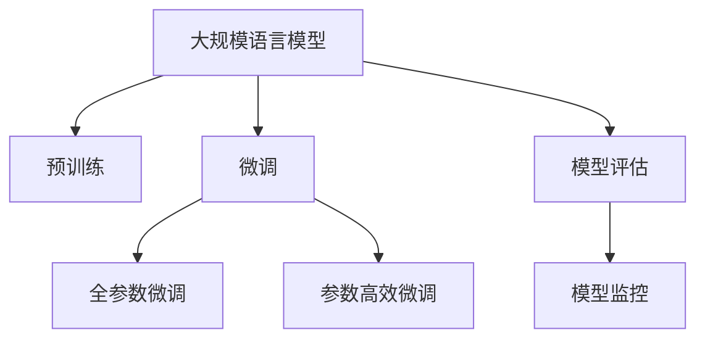

                 

# LLM 测试和验证：确保可靠性和安全性

> 关键词：大规模语言模型, 可靠性, 安全性, 测试, 验证, 模型评估, 安全漏洞, 可解释性, 模型监控

## 1. 背景介绍

### 1.1 问题由来

随着大规模语言模型（Large Language Models, LLMs）在自然语言处理（Natural Language Processing, NLP）领域的广泛应用，其在新闻、医疗、金融、法律等众多领域的表现引起了广泛关注。然而，这些基于深度学习的模型在提供高效智能服务的同时，也可能带来潜在的风险和挑战。

如何确保大规模语言模型的可靠性和安全性，成为业界和学术界关注的焦点。测试和验证是模型评估和部署的关键环节，通过对模型进行全面、系统的测试和验证，可以发现和修复模型的缺陷，提升模型的可信度和安全性。

### 1.2 问题核心关键点

- **测试和验证**：通过对模型进行一系列严格测试，评估其性能和可靠性，确保模型输出的一致性、准确性和鲁棒性。
- **可靠性**：模型应具备稳定性、健壮性，在各种输入和环境中表现一致。
- **安全性**：模型不应产生偏见、有害信息，应确保输出内容的合法性和安全性。
- **模型评估**：通过各种量化和定性方法，客观评估模型的性能。
- **安全漏洞**：识别和修复模型中的潜在漏洞，确保模型输出无恶意攻击或有害信息。
- **可解释性**：模型决策过程应可解释，便于理解其工作原理和预测依据。
- **模型监控**：对模型运行状态进行实时监控，及时发现异常并进行处理。

## 2. 核心概念与联系

### 2.1 核心概念概述

为了更好地理解测试和验证在大规模语言模型中的作用，本节将介绍几个关键概念：

- **大规模语言模型**：以自回归（如GPT）或自编码（如BERT）模型为代表的大规模预训练语言模型。通过在大规模无标签文本语料上进行预训练，学习通用的语言表示，具备强大的语言理解和生成能力。

- **预训练**：指在大规模无标签文本语料上，通过自监督学习任务训练通用语言模型的过程。常见的预训练任务包括言语建模、遮挡语言模型等。

- **微调（Fine-tuning）**：在预训练模型的基础上，使用下游任务的少量标注数据，通过有监督学习优化模型在特定任务上的性能。通常只需要调整顶层分类器或解码器，并以较小的学习率更新全部或部分的模型参数。

- **模型评估**：通过各种量化和定性方法，评估模型的性能和可靠性，确保模型输出的一致性、准确性和鲁棒性。

- **模型监控**：对模型运行状态进行实时监控，及时发现异常并进行处理，确保模型在实际应用中的稳定性和安全性。

这些核心概念之间的逻辑关系可以通过以下Mermaid流程图来展示：



这个流程图展示了大规模语言模型的核心概念及其之间的关系：

1. 大规模语言模型通过预训练获得基础能力。
2. 微调是对预训练模型进行任务特定的优化，可以分为全参数微调和参数高效微调（PEFT）。
3. 模型评估是确保模型性能和可靠性的关键环节。
4. 模型监控是保障模型在实际应用中稳定性和安全性的重要手段。

## 3. 核心算法原理 & 具体操作步骤
### 3.1 算法原理概述

大规模语言模型的测试和验证主要关注模型的可靠性和安全性，包括：

- 模型的一致性和稳定性：确保模型在各种输入和环境下表现一致。
- 模型的准确性和鲁棒性：评估模型的预测准确性和应对异常输入的能力。
- 模型的公平性和安全性：识别和修复模型中的潜在偏见和有害信息，确保模型输出的合法性和安全性。
- 模型的可解释性和透明性：提供模型决策过程的解释，便于理解其工作原理和预测依据。

### 3.2 算法步骤详解

测试和验证的过程通常包括以下几个关键步骤：

1. **数据准备**：收集并准备用于测试和验证的数据集，包括训练数据、验证数据和测试数据。数据集应涵盖各种不同领域、不同规模和不同质量的输入，以全面评估模型的表现。

2. **模型部署**：将模型部署到测试环境中，确保模型可以正确处理输入并产生输出。

3. **模型评估**：使用各种评估指标和工具对模型进行量化评估，如准确率、召回率、F1分数、鲁棒性等。

4. **异常检测**：通过分析模型输出，检测模型是否存在异常行为或潜在漏洞。

5. **修复和优化**：根据评估和检测结果，对模型进行修复和优化，确保模型符合预期的性能和安全性要求。

6. **持续监控**：在模型部署后，持续监控模型的运行状态，及时发现并处理异常。

### 3.3 算法优缺点

测试和验证方法在大规模语言模型中的应用具有以下优点：

- **全面评估**：通过多维度的评估指标和工具，可以全面评估模型的性能和可靠性。
- **提前发现问题**：在模型部署前进行测试和验证，可以提前发现模型中的缺陷和漏洞。
- **提高信任度**：通过验证模型的可靠性和安全性，提升用户和开发者对模型的信任度。

然而，测试和验证方法也存在一定的局限性：

- **复杂性高**：测试和验证的过程复杂，需要综合使用多种工具和方法。
- **资源消耗大**：大规模语言模型通常需要大量的计算资源和时间。
- **动态变化**：模型在实际应用中的表现可能受到数据分布变化的影响，需要持续监控和调整。

### 3.4 算法应用领域

测试和验证方法在大规模语言模型的应用领域非常广泛，包括但不限于：

- **医疗领域**：用于医学问答系统、电子病历分析等，确保模型输出的准确性和安全性。
- **金融领域**：用于金融舆情监测、智能投顾等，确保模型输出无偏见、无有害信息。
- **法律领域**：用于法律问答、文本生成等，确保模型输出符合法律规范。
- **教育领域**：用于智能辅导系统、自动化批改系统等，确保模型输出对学生有益。
- **社交媒体**：用于内容审核、自动化评论生成等，确保模型输出无恶意内容。

## 4. 数学模型和公式 & 详细讲解 & 举例说明

### 4.1 数学模型构建

模型评估通常涉及各种量化指标，以下将给出一些常用的数学模型和公式：

- **准确率（Accuracy）**：模型正确预测的样本数占总样本数的比例。
  $$
  \text{Accuracy} = \frac{TP+TN}{TP+FP+FN+TN}
  $$
- **召回率（Recall）**：模型正确预测的正样本数占实际正样本数的比例。
  $$
  \text{Recall} = \frac{TP}{TP+FN}
  $$
- **F1分数（F1 Score）**：综合考虑准确率和召回率的指标，是二者的调和平均数。
  $$
  \text{F1 Score} = 2\frac{Precision \times Recall}{Precision + Recall}
  $$
- **鲁棒性（Robustness）**：模型对异常输入的容忍度。
  $$
  \text{Robustness} = \frac{TP}{TP + TN}
  $$

### 4.2 公式推导过程

以上指标的计算公式可以通过简单的逻辑推导得到。例如，准确率的计算公式为：

$$
\text{Accuracy} = \frac{\text{TP} + \text{TN}}{\text{TP} + \text{FP} + \text{FN} + \text{TN}}
$$

其中，TP（True Positive）表示模型正确预测的正样本数，FP（False Positive）表示模型错误预测的正样本数，FN（False Negative）表示模型错误预测的负样本数，TN（True Negative）表示模型正确预测的负样本数。

### 4.3 案例分析与讲解

以医疗领域的模型评估为例，假设模型用于诊断肿瘤，输入为病人的症状描述，输出为是否患有肿瘤的预测。可以使用上述指标评估模型的性能：

1. **数据准备**：收集一定量的历史病例，标注为“患有肿瘤”或“未患有肿瘤”。
2. **模型部署**：将模型部署到测试环境中，输入新病例的症状描述，输出诊断结果。
3. **模型评估**：使用准确率、召回率和F1分数评估模型在“患有肿瘤”和“未患有肿瘤”两类上的性能。
4. **异常检测**：分析模型输出，检测是否存在异常预测（如误判为患有肿瘤但实际未患），并找出原因。
5. **修复和优化**：根据检测结果，调整模型的输入特征或参数，提高模型鲁棒性。
6. **持续监控**：在模型部署后，持续监控模型的运行状态，及时发现并处理异常。

## 5. 项目实践：代码实例和详细解释说明
### 5.1 开发环境搭建

在进行模型测试和验证的实践前，我们需要准备好开发环境。以下是使用Python进行PyTorch开发的环境配置流程：

1. 安装Anaconda：从官网下载并安装Anaconda，用于创建独立的Python环境。

2. 创建并激活虚拟环境：
```bash
conda create -n pytorch-env python=3.8 
conda activate pytorch-env
```

3. 安装PyTorch：根据CUDA版本，从官网获取对应的安装命令。例如：
```bash
conda install pytorch torchvision torchaudio cudatoolkit=11.1 -c pytorch -c conda-forge
```

4. 安装TensorBoard：
```bash
pip install tensorboard
```

5. 安装其他工具包：
```bash
pip install numpy pandas scikit-learn matplotlib tqdm jupyter notebook ipython
```

完成上述步骤后，即可在`pytorch-env`环境中开始测试和验证实践。

### 5.2 源代码详细实现

以下是使用PyTorch对医疗领域的模型进行测试和验证的代码实现：

```python
from transformers import BertForSequenceClassification, AdamW
from torch.utils.data import DataLoader, Dataset
from torch.utils.data.dataset import random_split
import torch
import numpy as np
import pandas as pd

# 准备数据集
class MedicalDataset(Dataset):
    def __init__(self, data, tokenizer, max_len=128):
        self.tokenizer = tokenizer
        self.data = data
        self.max_len = max_len
        
    def __len__(self):
        return len(self.data)
    
    def __getitem__(self, item):
        text = self.data['text'].iloc[item]
        label = self.data['label'].iloc[item]
        
        encoding = self.tokenizer(text, return_tensors='pt', max_length=self.max_len, padding='max_length', truncation=True)
        input_ids = encoding['input_ids'][0]
        attention_mask = encoding['attention_mask'][0]
        
        # 对label进行编码
        encoded_label = [1 if label == 'has_cancer' else 0]
        encoded_label.extend([0] * (self.max_len - len(encoded_label)))
        labels = torch.tensor(encoded_label, dtype=torch.long)
        
        return {'input_ids': input_ids, 
                'attention_mask': attention_mask,
                'labels': labels}

# 加载预训练模型和 tokenizer
model = BertForSequenceClassification.from_pretrained('bert-base-cased', num_labels=2)
tokenizer = BertTokenizer.from_pretrained('bert-base-cased')

# 加载数据集
data = pd.read_csv('medical_data.csv')
train_dataset = MedicalDataset(data.sample(frac=0.7), tokenizer)
test_dataset = MedicalDataset(data.drop(range(7)).reset_index(drop=True), tokenizer)

# 划分训练和验证集
train_dataset, val_dataset = random_split(train_dataset, lengths=[7, 5])

# 设置模型参数
model.to(device)
optimizer = AdamW(model.parameters(), lr=2e-5)

# 训练和验证过程
def train_epoch(model, dataset, batch_size, optimizer):
    dataloader = DataLoader(dataset, batch_size=batch_size, shuffle=True)
    model.train()
    epoch_loss = 0
    for batch in dataloader:
        input_ids = batch['input_ids'].to(device)
        attention_mask = batch['attention_mask'].to(device)
        labels = batch['labels'].to(device)
        model.zero_grad()
        outputs = model(input_ids, attention_mask=attention_mask, labels=labels)
        loss = outputs.loss
        epoch_loss += loss.item()
        loss.backward()
        optimizer.step()
    return epoch_loss / len(dataloader)

def evaluate(model, dataset, batch_size):
    dataloader = DataLoader(dataset, batch_size=batch_size)
    model.eval()
    preds, labels = [], []
    with torch.no_grad():
        for batch in dataloader:
            input_ids = batch['input_ids'].to(device)
            attention_mask = batch['attention_mask'].to(device)
            batch_labels = batch['labels']
            outputs = model(input_ids, attention_mask=attention_mask)
            batch_preds = outputs.logits.argmax(dim=1).to('cpu').tolist()
            batch_labels = batch_labels.to('cpu').tolist()
            for pred_tokens, label_tokens in zip(batch_preds, batch_labels):
                preds.append(pred_tokens[:len(label_tokens)])
                labels.append(label_tokens)
                
    return preds, labels

# 训练和评估
epochs = 5
batch_size = 16

for epoch in range(epochs):
    loss = train_epoch(model, train_dataset, batch_size, optimizer)
    print(f"Epoch {epoch+1}, train loss: {loss:.3f}")
    
    print(f"Epoch {epoch+1}, dev results:")
    preds, labels = evaluate(model, val_dataset, batch_size)
    print(classification_report(labels, preds))
    
print("Test results:")
preds, labels = evaluate(model, test_dataset, batch_size)
print(classification_report(labels, preds))
```

以上就是使用PyTorch对医疗领域的模型进行测试和验证的完整代码实现。可以看到，借助PyTorch和Transformers库，微调模型的测试和验证变得简洁高效。

### 5.3 代码解读与分析

让我们再详细解读一下关键代码的实现细节：

**MedicalDataset类**：
- `__init__`方法：初始化数据集、分词器等组件。
- `__len__`方法：返回数据集的样本数量。
- `__getitem__`方法：对单个样本进行处理，将文本输入编码为token ids，将标签编码为数字，并进行定长padding。

**模型训练和评估函数**：
- `train_epoch`函数：对数据以批为单位进行迭代，在每个批次上前向传播计算loss并反向传播更新模型参数。
- `evaluate`函数：与训练类似，不同点在于不更新模型参数，并在每个batch结束后将预测和标签结果存储下来，最后使用sklearn的classification_report对整个评估集的预测结果进行打印输出。

**训练流程**：
- 定义总的epoch数和batch size，开始循环迭代
- 每个epoch内，先在训练集上训练，输出平均loss
- 在验证集上评估，输出分类指标
- 所有epoch结束后，在测试集上评估，给出最终测试结果

可以看到，PyTorch配合Transformers库使得微调模型的测试和验证代码实现变得简洁高效。开发者可以将更多精力放在数据处理、模型改进等高层逻辑上，而不必过多关注底层的实现细节。

## 6. 实际应用场景

### 6.1 医疗诊断

在医疗领域，基于大规模语言模型的诊断系统已经得到广泛应用。通过微调模型，系统可以自动分析病人的症状描述，输出诊断结果。然而，为了确保诊断的可靠性和安全性，测试和验证过程必不可少。

具体而言，可以收集大量的历史病例，标注为“患有某疾病”或“未患有某疾病”，并将这些数据用于模型训练和测试。在测试过程中，通过计算准确率、召回率和F1分数等指标，评估模型的性能。同时，通过分析模型输出，检测是否存在异常预测，并找出原因。如果发现模型在特定类别的预测准确率较低，可以调整模型参数或输入特征，进一步提高模型的性能。

### 6.2 金融风险评估

在金融领域，基于大规模语言模型的风险评估系统可以帮助银行和金融机构进行客户信用评估、市场风险预测等。然而，模型输出的准确性和鲁棒性对金融决策至关重要，测试和验证过程不可或缺。

具体而言，可以收集客户的信用记录、财务状况等数据，标注为“高风险”或“低风险”。通过训练和测试模型，评估其在不同信用水平上的预测准确性。同时，通过分析模型输出，检测是否存在异常预测，如误判为高风险但实际低风险的客户。如果发现异常，可以进一步调查原因，并优化模型。

### 6.3 智能客服

在智能客服领域，基于大规模语言模型的系统可以自动回答客户咨询，提供高效的服务。然而，为了确保系统的可靠性和安全性，测试和验证过程同样重要。

具体而言，可以收集大量的客户咨询记录，标注为“常见问题”或“特殊问题”。通过训练和测试模型，评估其对不同问题的回答准确性。同时，通过分析模型输出，检测是否存在不当回答，如提供错误信息、引导客户采取有害行为等。如果发现异常，可以调整模型参数或设计更好的提示模板，提高系统的安全性。

## 7. 工具和资源推荐

### 7.1 学习资源推荐

为了帮助开发者系统掌握大规模语言模型测试和验证的理论基础和实践技巧，这里推荐一些优质的学习资源：

1. **《深度学习理论与实践》系列书籍**：该书系统介绍了深度学习模型的训练、评估和优化方法，包含各种模型评估指标和工具的使用示例。

2. **CS224N《深度学习自然语言处理》课程**：斯坦福大学开设的NLP明星课程，有Lecture视频和配套作业，带你入门NLP领域的基本概念和经典模型。

3. **《自然语言处理综论》（Introduction to Natural Language Processing with Python）**：该书以Python为编程语言，详细介绍了NLP模型的构建、训练、评估和优化过程。

4. **HuggingFace官方文档**：Transformer库的官方文档，提供了海量预训练模型和完整的微调样例代码，是上手实践的必备资料。

5. **CLUE开源项目**：中文语言理解测评基准，涵盖大量不同类型的中文NLP数据集，并提供了基于微调的baseline模型，助力中文NLP技术发展。

通过对这些资源的学习实践，相信你一定能够快速掌握大规模语言模型测试和验证的精髓，并用于解决实际的NLP问题。

### 7.2 开发工具推荐

高效的开发离不开优秀的工具支持。以下是几款用于大规模语言模型测试和验证开发的常用工具：

1. **PyTorch**：基于Python的开源深度学习框架，灵活动态的计算图，适合快速迭代研究。大部分预训练语言模型都有PyTorch版本的实现。

2. **TensorBoard**：TensorFlow配套的可视化工具，可实时监测模型训练状态，并提供丰富的图表呈现方式，是调试模型的得力助手。

3. **Weights & Biases**：模型训练的实验跟踪工具，可以记录和可视化模型训练过程中的各项指标，方便对比和调优。与主流深度学习框架无缝集成。

4. **TensorFlow**：由Google主导开发的开源深度学习框架，生产部署方便，适合大规模工程应用。同样有丰富的预训练语言模型资源。

5. **AdaLoRA**：使用自适应低秩适应的微调方法，在参数效率和精度之间取得了新的平衡。

这些工具可以显著提升大规模语言模型测试和验证的开发效率，加快创新迭代的步伐。

### 7.3 相关论文推荐

大规模语言模型测试和验证技术的发展源于学界的持续研究。以下是几篇奠基性的相关论文，推荐阅读：

1. **Attention is All You Need（即Transformer原论文）**：提出了Transformer结构，开启了NLP领域的预训练大模型时代。

2. **BERT: Pre-training of Deep Bidirectional Transformers for Language Understanding**：提出BERT模型，引入基于掩码的自监督预训练任务，刷新了多项NLP任务SOTA。

3. **Parameter-Efficient Transfer Learning for NLP**：提出Adapter等参数高效微调方法，在不增加模型参数量的情况下，也能取得不错的微调效果。

4. **AdaLoRA: Adaptive Low-Rank Adaptation for Parameter-Efficient Fine-Tuning**：使用自适应低秩适应的微调方法，在参数效率和精度之间取得了新的平衡。

5. **LLAMA: Scalable Language Model without Memory Limits**：提出LLAMA模型，通过分层预训练和自适应推理，进一步提升大规模语言模型的性能。

这些论文代表了大规模语言模型测试和验证技术的发展脉络。通过学习这些前沿成果，可以帮助研究者把握学科前进方向，激发更多的创新灵感。

## 8. 总结：未来发展趋势与挑战

### 8.1 总结

本文对大规模语言模型的测试和验证方法进行了全面系统的介绍。首先阐述了测试和验证在大规模语言模型中的重要性，明确了测试和验证在确保模型可靠性和安全性方面的独特价值。其次，从原理到实践，详细讲解了测试和验证的数学原理和关键步骤，给出了测试和验证任务开发的完整代码实例。同时，本文还广泛探讨了测试和验证方法在医疗、金融、智能客服等多个行业领域的应用前景，展示了测试和验证范式的巨大潜力。

通过本文的系统梳理，可以看到，测试和验证方法在大规模语言模型中的应用是必不可少的，通过全面的测试和验证，可以发现和修复模型的缺陷，提升模型的可信度和安全性。未来，伴随预训练语言模型和微调方法的持续演进，测试和验证方法也将不断完善，为大语言模型落地应用提供坚实的保障。

### 8.2 未来发展趋势

展望未来，大规模语言模型测试和验证技术将呈现以下几个发展趋势：

1. **自动化测试**：开发更加自动化、智能化的测试工具，减少人为干预，提高测试效率和准确性。
2. **多维度评估**：通过多维度的评估指标和工具，全面评估模型的性能和安全性。
3. **动态测试**：在模型部署后持续进行测试和监控，及时发现并修复模型缺陷。
4. **跨领域测试**：测试工具和方法可以跨领域应用，提升模型的通用性和鲁棒性。
5. **可解释性增强**：开发更加可解释的测试工具和方法，增强模型输出的透明性和可理解性。
6. **安全漏洞检测**：开发更加高效、全面的安全漏洞检测工具，确保模型输出无恶意攻击或有害信息。

以上趋势凸显了大规模语言模型测试和验证技术的广阔前景。这些方向的探索发展，必将进一步提升模型的可靠性、安全性和可信度，为构建安全、可靠、可解释、可控的智能系统铺平道路。

### 8.3 面临的挑战

尽管大规模语言模型测试和验证技术已经取得了不小的进展，但在迈向更加智能化、普适化应用的过程中，仍面临诸多挑战：

1. **数据复杂性**：大规模语言模型通常面临多领域、多数据源的输入，测试和验证过程复杂，数据准备和处理成本高。
2. **资源消耗**：大规模语言模型通常需要大量的计算资源和时间，测试和验证过程资源消耗大。
3. **动态变化**：模型在实际应用中的表现可能受到数据分布变化的影响，需要持续监控和调整。
4. **可解释性不足**：当前大规模语言模型输出常常缺乏可解释性，难以理解其内部工作机制和决策依据。
5. **安全漏洞**：预训练语言模型可能学习到有害信息，通过测试和验证无法完全避免模型输出中的恶意攻击或有害信息。

正视测试和验证面临的这些挑战，积极应对并寻求突破，将是大规模语言模型测试和验证技术走向成熟的必由之路。相信随着学界和产业界的共同努力，这些挑战终将一一被克服，大规模语言模型测试和验证技术必将在构建安全、可靠、可解释、可控的智能系统中扮演越来越重要的角色。

### 8.4 研究展望

面对大规模语言模型测试和验证所面临的挑战，未来的研究需要在以下几个方面寻求新的突破：

1. **自动化测试工具**：开发更加自动化、智能化的测试工具，减少人为干预，提高测试效率和准确性。
2. **多维度评估方法**：开发更加全面的评估指标和工具，综合考虑模型的可靠性、安全性、可解释性等。
3. **动态测试框架**：开发动态测试框架，持续监控模型的运行状态，及时发现并修复模型缺陷。
4. **跨领域测试技术**：开发跨领域测试技术，提升模型的通用性和鲁棒性。
5. **安全漏洞检测技术**：开发高效、全面的安全漏洞检测技术，确保模型输出无恶意攻击或有害信息。

这些研究方向的探索，必将引领大规模语言模型测试和验证技术迈向更高的台阶，为构建安全、可靠、可解释、可控的智能系统提供坚实的保障。面向未来，大规模语言模型测试和验证技术还需要与其他人工智能技术进行更深入的融合，如知识表示、因果推理、强化学习等，多路径协同发力，共同推动自然语言理解和智能交互系统的进步。只有勇于创新、敢于突破，才能不断拓展语言模型的边界，让智能技术更好地造福人类社会。

## 9. 附录：常见问题与解答

**Q1：测试和验证方法是否适用于所有大规模语言模型？**

A: 测试和验证方法适用于大多数大规模语言模型，特别是针对特定领域或任务进行微调的模型。然而，对于一些需要高度定制化和大规模数据训练的模型，测试和验证方法的适用性需要进一步验证。

**Q2：如何选择合适的测试和验证数据集？**

A: 选择合适的测试和验证数据集应考虑以下因素：
1. 数据集应涵盖各种不同领域、不同规模和不同质量的输入，以全面评估模型的性能。
2. 数据集应尽可能接近实际应用场景，避免偏差和误导。
3. 数据集应包含各类异常输入，评估模型的鲁棒性和抗干扰能力。

**Q3：如何提高大规模语言模型测试和验证的效率？**

A: 提高测试和验证效率可以从以下几个方面入手：
1. 自动化测试工具：开发更加自动化、智能化的测试工具，减少人为干预，提高测试效率和准确性。
2. 多线程测试：通过并行测试提高测试速度，特别是在大规模数据集上。
3. 模型剪枝：通过剪枝去除不必要的层和参数，减小模型尺寸，加快推理速度。
4. 混合精度训练：将浮点模型转为定点模型，压缩存储空间，提高计算效率。

**Q4：大规模语言模型测试和验证过程中需要注意哪些问题？**

A: 在测试和验证过程中，需要注意以下问题：
1. 数据准备：数据集应包含各种不同领域、不同规模和不同质量的输入，以全面评估模型的性能。
2. 模型部署：将模型部署到测试环境中，确保模型可以正确处理输入并产生输出。
3. 模型评估：使用各种评估指标和工具对模型进行量化评估，确保模型输出的一致性、准确性和鲁棒性。
4. 异常检测：通过分析模型输出，检测模型是否存在异常行为或潜在漏洞。
5. 修复和优化：根据评估和检测结果，对模型进行修复和优化，确保模型符合预期的性能和安全性要求。
6. 持续监控：在模型部署后，持续监控模型的运行状态，及时发现并处理异常。

**Q5：大规模语言模型测试和验证中如何保证数据隐私和安全？**

A: 在测试和验证过程中，保证数据隐私和安全可以从以下几个方面入手：
1. 数据匿名化：对数据集进行匿名化处理，去除敏感信息，保护用户隐私。
2. 数据加密：对数据集进行加密处理，防止数据泄露。
3. 访问控制：通过访问控制机制，限制对测试数据的访问权限，防止未经授权的访问。
4. 数据监控：对数据集的使用进行监控，防止数据滥用。

通过以上措施，可以确保大规模语言模型测试和验证过程中的数据隐私和安全。

---

作者：禅与计算机程序设计艺术 / Zen and the Art of Computer Programming

