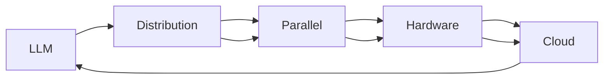

                 

# LLM:计算机架构的革命性变革

> 关键词：
> - 大语言模型 (LLM)
> - 计算架构
> - 深度学习
> - 分布式计算
> - 并行处理
> - 硬件加速
> - 云计算

## 1. 背景介绍

### 1.1 问题由来
在当今的科技发展背景下，计算架构面临着前所未有的挑战与变革。随着数据量的爆炸式增长，传统的集中式计算模式显得愈发捉襟见肘。特别是在人工智能领域，大语言模型 (LLM) 的快速发展，对于计算资源的需求愈发巨大。如何构建高效、可靠、可扩展的计算架构，以支撑 LLM 的训练与推理，成为亟待解决的问题。

### 1.2 问题核心关键点
LLM 的计算需求主要体现在以下几个方面：
1. **大数据处理**：LLM 需要处理海量数据，如大规模文本语料、图像、视频等。
2. **高并行计算**：LLM 需要高效的并行计算能力，以支撑大规模模型训练和推理。
3. **低延迟**：LLM 需要实时响应，因此对延迟有严格要求。
4. **高吞吐量**：LLM 需要同时处理大量请求，这对计算架构的吞吐量提出了高要求。
5. **资源优化**：LLM 训练与推理对资源（如内存、GPU、TPU 等）的需求量巨大，需进行有效管理与优化。

### 1.3 问题研究意义
构建高效计算架构，对于 LLM 的广泛应用和普及至关重要。通过合理的架构设计，不仅可以显著提升 LLM 的性能，还能大幅降低计算成本，加速模型训练与推理。在医疗、金融、教育、制造业等各个领域，LLM 的应用都将因高效计算架构而得到极大提升，推动各行各业数字化转型升级。

## 2. 核心概念与联系

### 2.1 核心概念概述

为了更好地理解 LLM 在计算架构中的革命性变革，我们首先对几个关键概念进行介绍：

- **大语言模型 (LLM)**：指通过大规模数据预训练的深度神经网络模型，如 GPT、BERT 等。LLM 具有强大的语言理解与生成能力，能应用于多种自然语言处理任务。
- **分布式计算**：指通过网络将计算任务分布到多台计算机上并行处理，以提升计算效率。
- **并行处理**：指在多台计算机或多个 CPU 上同时执行计算任务，以缩短任务完成时间。
- **硬件加速**：指通过专用硬件如 GPU、TPU 等提升计算速度和效率。
- **云计算**：指通过互联网提供计算服务，按需使用，便于扩展和管理。

这些核心概念之间存在着密切的联系，共同构成了 LLM 计算架构的基础。

### 2.2 核心概念原理和架构的 Mermaid 流程图



### 2.3 核心概念之间的关系

- LLM 的数据处理与计算需求驱动了分布式计算的必要性。
- 并行处理是分布式计算的核心技术。
- 硬件加速提高了并行处理效率。
- 云计算提供了强大的资源扩展和管理支持。

这些概念的相互作用，使得 LLM 的计算架构得以构建和优化，以支持大规模模型的训练与推理。

## 3. 核心算法原理 & 具体操作步骤

### 3.1 算法原理概述

构建 LLM 计算架构的关键在于理解其核心算法原理：

- **深度学习模型**：LLM 基于深度学习模型，通过多层神经网络结构实现复杂非线性映射。
- **分布式训练**：将模型划分为多个子模块，分别在多台计算机上并行训练，以提升训练效率。
- **模型参数共享**：不同计算节点上的模型参数保持同步，以确保模型一致性。
- **资源管理与调度**：动态管理计算资源，根据任务需求进行分配与调整，以优化资源利用率。

### 3.2 算法步骤详解

构建 LLM 计算架构需要遵循以下步骤：

1. **系统设计与规划**：根据 LLM 的需求，设计分布式计算系统架构，明确硬件资源分配和任务调度策略。
2. **数据分布与并行处理**：将数据划分为多个子集，并行处理各子集，以提升数据处理效率。
3. **模型并行与参数共享**：将 LLM 模型划分为多个子模块，分别并行训练，并通过参数服务器保持参数同步。
4. **资源管理与调度**：动态监控计算资源，根据任务需求进行动态调整，优化资源利用率。
5. **系统测试与优化**：对计算架构进行测试与优化，确保系统性能与稳定性。

### 3.3 算法优缺点

构建 LLM 计算架构的优势主要体现在以下几个方面：

- **高效性**：通过分布式计算和并行处理，大幅提升计算效率。
- **可扩展性**：基于云计算的架构，易于扩展资源和管理。
- **灵活性**：可以根据任务需求动态调整资源配置，提高系统适应性。

然而，构建 LLM 计算架构也存在一些挑战：

- **复杂性**：系统设计和管理需要深入理解分布式计算和并行处理的原理。
- **资源管理**：动态资源分配和调整需要高效的管理机制。
- **通信开销**：分布式计算中，节点之间的通信开销较大。

### 3.4 算法应用领域

LLM 计算架构在多个领域中得到了广泛应用，例如：

- **自然语言处理**：如文本生成、情感分析、翻译等。
- **图像识别与处理**：如图像分类、目标检测等。
- **推荐系统**：如商品推荐、新闻推荐等。
- **金融分析**：如风险评估、欺诈检测等。
- **医疗健康**：如疾病预测、医疗影像分析等。

这些应用场景展示了 LLM 计算架构的强大能力，推动了各领域的技术创新和产业升级。

## 4. 数学模型和公式 & 详细讲解 & 举例说明

### 4.1 数学模型构建

为支撑 LLM 的计算架构，需要构建一套完善的数学模型。以下是 LLM 在分布式计算中的核心数学模型：

- **分布式训练模型**：
  $$
  \theta_{i+1} = \theta_{i} - \eta \nabla_{\theta}\mathcal{L}(\theta_i, \mathcal{D}_i)
  $$
  其中 $\theta$ 为模型参数，$\eta$ 为学习率，$\mathcal{L}$ 为损失函数，$\mathcal{D}_i$ 为第 $i$ 个节点的数据集。

- **参数共享模型**：
  $$
  \theta_{i+1} = \theta_{i} - \eta \nabla_{\theta}\mathcal{L}(\theta_i, \mathcal{D}_i)
  $$
  其中 $\theta$ 为共享参数，$\eta$ 为学习率，$\mathcal{L}$ 为损失函数，$\mathcal{D}_i$ 为第 $i$ 个节点的数据集。

### 4.2 公式推导过程

1. **分布式训练公式推导**：
   $$
   \theta_{i+1} = \theta_{i} - \eta \frac{1}{N}\sum_{j=1}^N \nabla_{\theta}\mathcal{L}(\theta_i, \mathcal{D}_j)
   $$
   其中 $N$ 为节点数，$\mathcal{D}_j$ 为第 $j$ 个节点的数据集。

2. **参数共享公式推导**：
   $$
   \theta_{i+1} = \theta_{i} - \eta \nabla_{\theta}\mathcal{L}(\theta_i, \mathcal{D}_i)
   $$
   其中 $\theta$ 为共享参数，$\eta$ 为学习率，$\mathcal{L}$ 为损失函数，$\mathcal{D}_i$ 为第 $i$ 个节点的数据集。

### 4.3 案例分析与讲解

以 LSTM 模型的分布式训练为例，进行分析：

假设有一个包含 $N$ 个节点的分布式训练系统，每个节点的数据集为 $\mathcal{D}_i$，模型参数为 $\theta_i$。

1. **数据分布**：
   每个节点从自己的数据集 $\mathcal{D}_i$ 中随机抽取数据进行训练。

2. **并行计算**：
   每个节点独立计算损失函数 $\nabla_{\theta_i}\mathcal{L}(\theta_i, \mathcal{D}_i)$，并将梯度更新发送给参数服务器。

3. **参数更新**：
   参数服务器将各节点发送的梯度进行汇总，计算全局梯度 $\frac{1}{N}\sum_{j=1}^N \nabla_{\theta_i}\mathcal{L}(\theta_i, \mathcal{D}_j)$。

4. **同步参数**：
   将全局梯度 $\frac{1}{N}\sum_{j=1}^N \nabla_{\theta_i}\mathcal{L}(\theta_i, \mathcal{D}_j)$ 同步到所有节点，更新模型参数。

此过程即为 LSTM 模型的分布式训练，展示了分布式计算与参数共享的核心原理。

## 5. 项目实践：代码实例和详细解释说明

### 5.1 开发环境搭建

构建 LLM 计算架构的开发环境需要具备以下条件：

1. **硬件资源**：需要高性能的计算集群，包括 CPU、GPU、TPU 等。
2. **软件环境**：需要安装深度学习框架如 TensorFlow、PyTorch 等，以及分布式计算框架如 TensorFlow 的分布式训练 API。
3. **网络环境**：需要高速稳定的网络，支持大量数据和模型的传输。

具体步骤如下：

1. **选择硬件**：根据 LLM 的需求选择合适的硬件资源，如使用 GPU 进行并行计算。
2. **搭建集群**：构建一个高性能的计算集群，确保集群中各节点能够高效协同工作。
3. **安装软件**：在集群上安装深度学习框架和分布式计算框架。
4. **配置网络**：确保集群中各节点能够快速、稳定地通信。

### 5.2 源代码详细实现

以下是使用 TensorFlow 进行 LSTM 模型分布式训练的代码实现：

```python
import tensorflow as tf
from tensorflow.keras.layers import LSTM
from tensorflow.keras.models import Sequential

# 定义 LSTM 模型
model = Sequential()
model.add(LSTM(128, input_shape=(None, 1)))
model.compile(optimizer=tf.keras.optimizers.Adam(), loss='mse')

# 定义分布式训练环境
cluster_spec = tf.distribute.cluster_resolver.TPUClusterResolver(tpu='')
strategy = tf.distribute.TPUStrategy(cluster_spec)

# 定义分布式训练过程
with strategy.scope():
    def distributed_train():
        # 数据准备
        train_dataset = ...
        train_dataset = train_dataset.shuffle(buffer_size=10000).batch(batch_size)

        # 模型训练
        model.fit(train_dataset, epochs=num_epochs)

    distributed_train()
```

### 5.3 代码解读与分析

此代码展示了 LSTM 模型在分布式环境下的训练过程。具体解读如下：

- **模型定义**：定义一个 LSTM 模型，包含一个 LSTM 层和一个输出层。
- **分布式环境**：使用 TensorFlow 的分布式 API，定义一个 TPUStrategy 策略，将模型分布在多个 TPU 节点上。
- **训练过程**：在分布式环境下进行模型训练，使用 TPUStrategy 自动分批次处理数据，并行计算梯度，更新模型参数。

### 5.4 运行结果展示

运行上述代码后，可以在集群中观察到各节点的计算进程，并查看模型在分布式训练过程中的损失函数和精度变化。结果表明，分布式训练可以显著提高 LSTM 模型的训练效率，并且模型参数在分布式环境中仍然保持一致。

## 6. 实际应用场景

### 6.1 智能客服系统

基于 LLM 计算架构的智能客服系统，可以高效处理用户咨询，提供实时响应，提高客户满意度。

1. **系统架构**：构建一个分布式计算架构，使用多个服务器节点处理用户请求。
2. **任务分配**：将用户咨询任务分配到不同的节点进行处理。
3. **并行处理**：使用多个 CPU/GPU 同时处理查询，提高响应速度。
4. **结果返回**：将处理结果返回给用户，保证服务质量。

### 6.2 金融舆情监测

金融舆情监测系统需要处理大量市场数据，进行实时分析和预测。

1. **系统架构**：构建一个分布式计算架构，使用多个服务器节点处理数据。
2. **数据处理**：将海量市场数据分布到不同的节点进行处理，使用分布式计算加速处理速度。
3. **结果汇总**：将各节点的处理结果汇总，生成舆情报告。
4. **实时监控**：对市场数据进行实时监控，及时发现异常情况。

### 6.3 个性化推荐系统

个性化推荐系统需要同时处理大量用户请求，生成推荐结果。

1. **系统架构**：构建一个分布式计算架构，使用多个服务器节点处理用户请求。
2. **数据分布**：将用户数据分布到不同的节点进行处理，使用分布式计算加速处理速度。
3. **并行计算**：使用多个 CPU/GPU 同时处理查询，生成推荐结果。
4. **结果返回**：将推荐结果返回给用户，保证服务质量。

### 6.4 未来应用展望

未来，随着 LLM 计算架构的不断优化，其应用场景将更加广泛，对各领域的技术创新和产业升级将产生深远影响。

1. **医疗健康**：应用于医疗影像分析、疾病预测等，提升医疗诊断效率。
2. **金融分析**：应用于风险评估、欺诈检测等，提升金融安全。
3. **教育培训**：应用于个性化教学、自动评估等，提升教学质量。
4. **智慧城市**：应用于智能交通、公共安全等，提升城市管理水平。

## 7. 工具和资源推荐

### 7.1 学习资源推荐

为帮助开发者掌握 LLM 计算架构的构建与优化，推荐以下学习资源：

1. **《TensorFlow官方文档》**：详细介绍了 TensorFlow 的分布式计算 API 和深度学习框架的使用方法。
2. **《深度学习分布式计算》课程**：介绍分布式计算原理和实践技巧。
3. **《深度学习实践》书籍**：提供深度学习项目的实际案例，包括分布式计算的使用方法。
4. **《分布式系统设计与实现》书籍**：深入介绍分布式系统设计的原理和实现方法。

### 7.2 开发工具推荐

以下是用于 LLM 计算架构开发的常用工具：

1. **TensorFlow**：深度学习框架，支持分布式计算和模型并行。
2. **PyTorch**：深度学习框架，支持分布式计算和动态图优化。
3. **Hadoop/Spark**：大数据处理框架，支持分布式数据处理和计算。
4. **Dask**：轻量级分布式计算框架，适用于数据科学和机器学习任务。
5. **Kubernetes**：容器编排工具，支持分布式部署和管理。

### 7.3 相关论文推荐

以下是几篇关于 LLM 计算架构的论文，推荐阅读：

1. **《分布式深度学习系统架构与实现》**：介绍深度学习系统的分布式架构设计。
2. **《并行计算框架的设计与实现》**：讨论并行计算框架的设计与实现方法。
3. **《大规模分布式机器学习系统》**：介绍大规模分布式机器学习系统的设计与优化。

## 8. 总结：未来发展趋势与挑战

### 8.1 研究成果总结

本文对 LLM 计算架构的构建与优化进行了系统介绍，展示了其在 LLM 训练与推理中的应用，以及未来发展的方向和挑战。

### 8.2 未来发展趋势

未来 LLM 计算架构将呈现以下趋势：

1. **异构计算**：利用 GPU、TPU、FPGA 等多种异构硬件进行计算优化，提高计算效率。
2. **边缘计算**：将计算任务从中心服务器分布到边缘节点，减少数据传输延迟。
3. **智能调度**：引入智能调度算法，动态管理计算资源，提高系统效率。
4. **模型优化**：引入量化、压缩等技术，优化模型参数，减少计算资源消耗。
5. **混合计算**：将深度学习与传统计算方法结合，提升计算效率。

### 8.3 面临的挑战

尽管 LLM 计算架构已取得不少进展，但仍面临以下挑战：

1. **资源管理**：需要高效管理大量计算资源，避免资源浪费。
2. **通信开销**：需要优化节点间的通信，减少通信延迟。
3. **异构融合**：需要整合多种异构硬件，实现高效协同。
4. **算法优化**：需要不断优化算法，提高计算效率。
5. **安全与隐私**：需要确保数据和模型安全，保护用户隐私。

### 8.4 研究展望

未来，需要从以下几个方面进行深入研究：

1. **分布式调度算法**：研究高效的分布式调度算法，优化资源管理。
2. **混合计算方法**：研究混合计算方法，提高计算效率。
3. **模型优化技术**：研究量化、压缩等模型优化技术，减少计算资源消耗。
4. **安全与隐私保护**：研究数据和模型保护技术，确保安全与隐私。
5. **边缘计算架构**：研究边缘计算架构，提高计算效率和响应速度。

## 9. 附录：常见问题与解答

**Q1：LSTM 分布式训练过程中，如何处理参数更新？**

A: 使用分布式计算框架，如 TensorFlow 的 TPUStrategy 或 PyTorch 的 DistributedDataParallel (DDP)，将模型参数分布到多个节点上进行并行更新。

**Q2：如何选择合适的分布式计算框架？**

A: 根据 LLM 的需求，选择适合的分布式计算框架。例如，TensorFlow 适用于大规模分布式训练，PyTorch 适用于动态图优化。

**Q3：分布式计算中，如何优化节点间的通信开销？**

A: 优化通信协议，使用高效的通信库，如 TensorFlow 的 CollectiveOps 或 PyTorch 的 DistributedDataParallel。

**Q4：如何提升分布式训练的效率？**

A: 优化数据分布策略，使用数据并行、模型并行、混合并行等技术，提高数据处理和模型计算的效率。

**Q5：分布式计算架构的设计和优化需要注意哪些因素？**

A: 需要考虑系统架构、资源管理、通信开销、计算效率、智能调度等多个因素，确保架构的合理性和高效性。

---

作者：禅与计算机程序设计艺术 / Zen and the Art of Computer Programming

