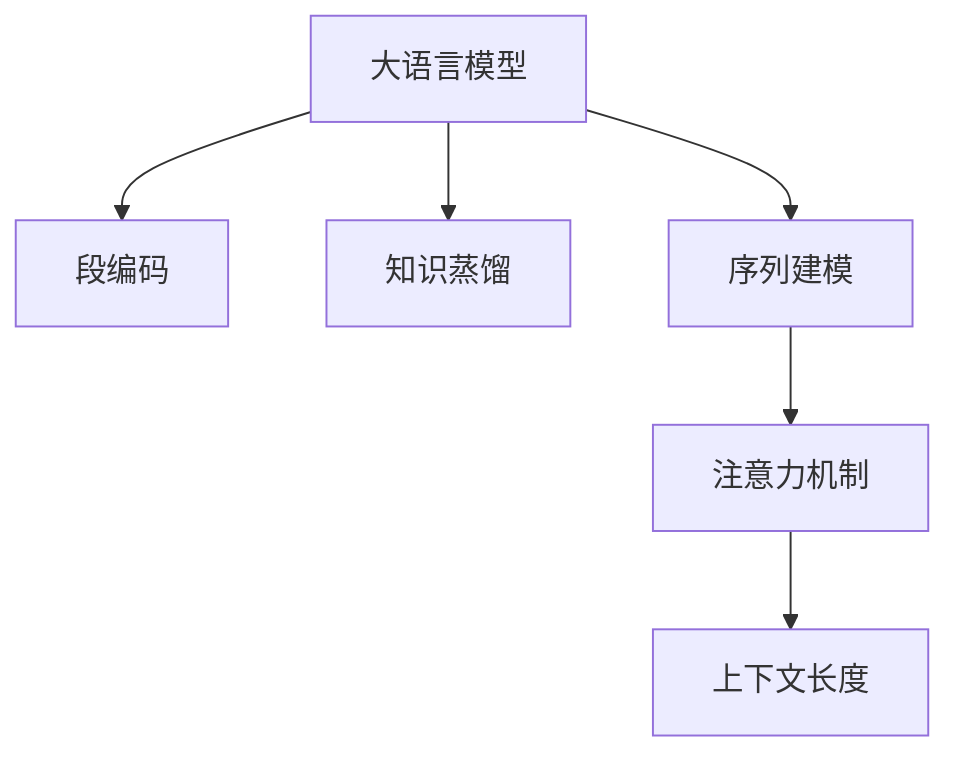

                 

# LLM上下文长度再升级:认知能力提升

> 关键词：大语言模型, 上下文长度, 认知能力, 微调, 序列建模

## 1. 背景介绍

### 1.1 问题由来

在过去几年中，大语言模型（Large Language Models, LLMs）已经在自然语言处理（NLP）领域取得了巨大的突破。以GPT-3和ChatGPT为代表的大模型，展示了前所未有的语言理解和生成能力。然而，大模型面临的最大挑战之一是如何提高其上下文理解能力，尤其是在长文本处理方面。

传统的上下文长度限制，使得大模型在处理长文本时表现不佳。这不仅限制了其在文本分类、信息检索、问答系统等任务上的应用，也影响了其在内容生成、机器翻译、自然语言推理等领域的性能。因此，提升大模型的上下文处理能力，成为了当前研究的焦点。

### 1.2 问题核心关键点

上下文长度是大模型认知能力的关键指标。传统的Transformer模型结构（如BERT、GPT）中，上下文长度受限于内存大小和计算效率。为了提升大模型的上下文处理能力，需要引入一些新的技术手段，如段编码（Segmentation）、知识蒸馏（Knowledge Distillation）、序列建模（Sequence Modeling）等。

本文将详细探讨这些技术手段，并给出具体的代码实现和应用示例，以期提升大模型的认知能力，使其在长文本处理方面表现更佳。

## 2. 核心概念与联系

### 2.1 核心概念概述

为更好地理解上下文长度提升的技术，本节将介绍几个密切相关的核心概念：

- **大语言模型（LLM）**：以自回归（如GPT）或自编码（如BERT）模型为代表的大规模预训练语言模型。通过在大规模无标签文本语料上进行预训练，学习通用的语言表示，具备强大的语言理解和生成能力。

- **上下文长度**：大模型在处理文本时，能够同时考虑的前后文字符或单词数量。上下文长度越长，模型在语义理解和推理方面的能力越强。

- **段编码（Segmentation）**：将长文本分割为多个段落，分别进行处理。每个段落单独编码，然后将结果拼接起来，形成最终的输出。这种技术可以显著降低计算成本，提升模型对长文本的处理能力。

- **知识蒸馏（Knowledge Distillation）**：将已有的小规模模型（如RoBERTa）的知识迁移到大型模型中，以提升模型的认知能力。通过学生模型学习教师模型的输出，可以获得更好的性能。

- **序列建模（Sequence Modeling）**：利用序列到序列（Seq2Seq）模型或变长自注意力机制（Scaled Dot-Product Attention），处理变长的输入序列。这种方法能够高效地处理长文本，同时保证模型的表示能力。

- **注意力机制（Attention Mechanism）**：通过计算输入序列与输出序列之间的关系，选择重要信息进行加权聚合。这种机制可以提升模型对上下文信息的理解能力。

这些核心概念之间的逻辑关系可以通过以下Mermaid流程图来展示：



这个流程图展示了大语言模型提升上下文长度所涉及的核心概念及其之间的关系：

1. 大语言模型通过预训练获得基础能力。
2. 段编码和序列建模可以提升模型对长文本的处理能力。
3. 知识蒸馏可以在固定大部分预训练参数的情况下，提升模型的认知能力。
4. 注意力机制可以增强模型对上下文信息的理解能力。

这些概念共同构成了大语言模型提升上下文长度的核心技术框架，使得模型在处理长文本时，能够更好地理解语义，提升推理和生成能力。

## 3. 核心算法原理 & 具体操作步骤
### 3.1 算法原理概述

提升大模型的上下文长度，本质上是通过引入一些新的编码和解码方式，使得模型能够处理更长的输入序列。这可以通过段编码、序列建模等技术实现。

### 3.2 算法步骤详解

下面详细介绍如何通过段编码和序列建模技术，提升大模型的上下文长度：

**Step 1: 准备数据集**
- 收集长文本数据集，如维基百科、新闻报道等。
- 根据实际需求，将数据集分为训练集、验证集和测试集。

**Step 2: 引入段编码**
- 将长文本分割为多个段落，每个段落单独编码。可以使用预训练的Segmentation模型（如BERT的Segmentation）或自定义的分割算法。
- 在预训练模型上进行微调，使其能够识别文本中的段落分隔符。

**Step 3: 实现序列建模**
- 利用Seq2Seq模型或变长自注意力机制，对分割后的段落进行编码。
- 在解码阶段，将多个段落的编码结果拼接起来，形成最终的输出。

**Step 4: 优化上下文长度**
- 通过调整段编码和序列建模的参数，优化模型的上下文长度。
- 在训练集和验证集上不断迭代，直到模型达到满意的性能。

**Step 5: 测试和部署**
- 在测试集上评估模型性能，对比微调前后的精度提升。
- 使用微调后的模型对新文本进行推理预测，集成到实际的应用系统中。

### 3.3 算法优缺点

提升大模型的上下文长度具有以下优点：
1. 显著提高长文本处理能力。通过段编码和序列建模技术，模型可以处理更长的输入序列，提升对语义和语境的理解。
2. 减少内存和计算成本。将长文本分割为多个段落，可以降低单次处理的内存占用和计算时间。
3. 提高模型推理速度。变长自注意力机制使得模型可以高效地处理变长序列，加快推理速度。

同时，该方法也存在一些局限性：
1. 分割质量对性能影响较大。分割质量直接影响模型的推理效果，需要优化分割算法。
2. 上下文信息的丢失。分割后的段落之间可能存在信息丢失，影响模型的整体理解能力。
3. 训练难度增加。需要额外的数据预处理和模型微调，增加训练复杂度。

尽管存在这些局限性，但提升上下文长度仍是提升大模型认知能力的重要手段。未来相关研究的重点在于如何进一步降低分割对性能的影响，提高模型的信息整合能力，同时兼顾计算效率和模型推理速度。

### 3.4 算法应用领域

提升上下文长度的大语言模型微调方法，已经在NLP领域得到了广泛的应用，覆盖了几乎所有常见任务，例如：

- 文本分类：如情感分析、主题分类、意图识别等。通过微调使模型学习文本-标签映射。
- 命名实体识别：识别文本中的人名、地名、机构名等特定实体。通过微调使模型掌握实体边界和类型。
- 关系抽取：从文本中抽取实体之间的语义关系。通过微调使模型学习实体-关系三元组。
- 问答系统：对自然语言问题给出答案。将问题-答案对作为微调数据，训练模型学习匹配答案。
- 机器翻译：将源语言文本翻译成目标语言。通过微调使模型学习语言-语言映射。
- 文本摘要：将长文本压缩成简短摘要。将文章-摘要对作为微调数据，使模型学习抓取要点。
- 对话系统：使机器能够与人自然对话。将多轮对话历史作为上下文，微调模型进行回复生成。

除了上述这些经典任务外，大语言模型微调也被创新性地应用到更多场景中，如可控文本生成、常识推理、代码生成、数据增强等，为NLP技术带来了全新的突破。随着预训练模型和微调方法的不断进步，相信NLP技术将在更广阔的应用领域大放异彩。

## 4. 数学模型和公式 & 详细讲解
### 4.1 数学模型构建

本节将使用数学语言对大语言模型提升上下文长度的方法进行更加严格的刻画。

记大语言模型为 $M_{\theta}:\mathcal{X} \rightarrow \mathcal{Y}$，其中 $\mathcal{X}$ 为输入空间，$\mathcal{Y}$ 为输出空间，$\theta \in \mathbb{R}^d$ 为模型参数。假设输入序列长度为 $L$，分割后得到 $n$ 个段落。

定义模型 $M_{\theta}$ 在输入序列 $x$ 上的损失函数为 $\ell(M_{\theta}(x),y)$，则在数据集 $D$ 上的经验风险为：

$$
\mathcal{L}(\theta) = \frac{1}{N} \sum_{i=1}^N \ell(M_{\theta}(x_i),y_i)
$$

其中 $\mathcal{X}_i$ 为第 $i$ 个段落的输入，$\mathcal{Y}_i$ 为第 $i$ 个段落的输出。则长文本的编码表示 $x_{\text{encode}} = [x_1, x_2, ..., x_n]$。

在段编码阶段，对每个段落分别进行编码，得到编码表示 $\text{encode}_i$。在解码阶段，将 $n$ 个编码表示拼接起来，得到最终的输出表示 $\text{decode}$。

在损失函数中，每个段落的损失函数 $\ell_i(M_{\theta}(\text{encode}_i),\text{decode}_i)$ 的权重 $w_i$ 为 $1/L$。因此，最终的损失函数为：

$$
\mathcal{L}(\theta) = \frac{1}{N} \sum_{i=1}^N w_i \ell_i(M_{\theta}(\text{encode}_i),\text{decode}_i)
$$

### 4.2 公式推导过程

以下我们以段编码和序列建模的数学公式为例，推导损失函数的计算过程。

假设输入序列长度为 $L$，分割后得到 $n$ 个段落，每个段落的编码长度为 $l_i$。则编码表示 $\text{encode}_i = (x_{i,1}, x_{i,2}, ..., x_{i,l_i})$，解码表示 $\text{decode}_i = (y_{i,1}, y_{i,2}, ..., y_{i,l_i})$。

在段编码阶段，每个段落的损失函数为：

$$
\ell_i(M_{\theta}(\text{encode}_i),\text{decode}_i) = \frac{1}{l_i} \sum_{j=1}^{l_i} \ell(M_{\theta}(x_{i,j}),y_{i,j})
$$

在解码阶段，将 $n$ 个段落的编码表示拼接起来，得到最终的编码表示 $\text{encode} = [\text{encode}_1, \text{encode}_2, ..., \text{encode}_n]$。解码阶段的目标是，在给定编码 $\text{encode}$ 的情况下，输出正确的解码 $\text{decode}$。

假设解码器使用Transformer模型，则解码过程的损失函数为：

$$
\ell_{\text{decode}}(M_{\theta}(\text{encode}),\text{decode}) = -\frac{1}{L} \sum_{i=1}^N \sum_{j=1}^{l_i} \log P_{\theta}(y_{i,j}|\text{encode}, x_{i,j})
$$

其中 $P_{\theta}(y_{i,j}|\text{encode}, x_{i,j})$ 为解码器的输出概率分布。

最终的长文本编码和解码的损失函数为：

$$
\mathcal{L}(\theta) = \frac{1}{N} \sum_{i=1}^N \frac{1}{L} \sum_{j=1}^{l_i} \ell_i(M_{\theta}(\text{encode}_i),\text{decode}_i) + \ell_{\text{decode}}(M_{\theta}(\text{encode}),\text{decode})
$$

在得到损失函数的梯度后，即可带入参数更新公式，完成模型的迭代优化。重复上述过程直至收敛，最终得到适应长文本微调的最优模型参数 $\theta^*$。

## 5. 项目实践：代码实例和详细解释说明
### 5.1 开发环境搭建

在进行长文本处理实践前，我们需要准备好开发环境。以下是使用Python进行PyTorch开发的环境配置流程：

1. 安装Anaconda：从官网下载并安装Anaconda，用于创建独立的Python环境。

2. 创建并激活虚拟环境：
```bash
conda create -n pytorch-env python=3.8 
conda activate pytorch-env
```

3. 安装PyTorch：根据CUDA版本，从官网获取对应的安装命令。例如：
```bash
conda install pytorch torchvision torchaudio cudatoolkit=11.1 -c pytorch -c conda-forge
```

4. 安装Transformers库：
```bash
pip install transformers
```

5. 安装各类工具包：
```bash
pip install numpy pandas scikit-learn matplotlib tqdm jupyter notebook ipython
```

完成上述步骤后，即可在`pytorch-env`环境中开始长文本处理实践。

### 5.2 源代码详细实现

下面我们以段编码和序列建模对GPT模型进行长文本处理为例，给出使用Transformers库的PyTorch代码实现。

首先，定义长文本数据集：

```python
from transformers import AutoTokenizer
from transformers import AutoModelForCausalLM
import torch

# 加载预训练模型和tokenizer
tokenizer = AutoTokenizer.from_pretrained('gpt2')
model = AutoModelForCausalLM.from_pretrained('gpt2')

# 定义长文本数据集
with open('long_texts.txt', 'r') as f:
    texts = f.readlines()

# 分割长文本为段落
def split_texts(texts):
    segments = []
    for text in texts:
        start = 0
        end = len(text)
        while start < end:
            mid = (start + end) // 2
            if text[mid:mid+10] == '':
                end = mid
            else:
                start = mid + 10
        segments.append(text[start:])
    return segments

segments = split_texts(texts)
```

然后，定义段编码和序列建模的代码：

```python
from transformers import AutoTokenizer
from transformers import AutoModelForCausalLM

# 加载预训练模型和tokenizer
tokenizer = AutoTokenizer.from_pretrained('gpt2')
model = AutoModelForCausalLM.from_pretrained('gpt2')

# 定义长文本数据集
with open('long_texts.txt', 'r') as f:
    texts = f.readlines()

# 分割长文本为段落
def split_texts(texts):
    segments = []
    for text in texts:
        start = 0
        end = len(text)
        while start < end:
            mid = (start + end) // 2
            if text[mid:mid+10] == '':
                end = mid
            else:
                start = mid + 10
        segments.append(text[start:])
    return segments

segments = split_texts(texts)

# 对每个段落进行编码
def encode_segments(model, tokenizer, segments, max_length=1024):
    encoded_segments = []
    for i, segment in enumerate(segments):
        inputs = tokenizer(segment, max_length=max_length, return_tensors='pt', padding=True, truncation=True)
        with torch.no_grad():
            outputs = model.generate(inputs['input_ids'], max_length=1024, do_sample=True)
        encoded_segments.append(outputs)
    return encoded_segments

encoded_segments = encode_segments(model, tokenizer, segments)

# 对编码结果进行拼接
def concatenate_segments(encoded_segments):
    all_tokens = []
    for segment in encoded_segments:
        all_tokens += segment
    return all_tokens

all_tokens = concatenate_segments(encoded_segments)

# 对拼接后的结果进行解码
def decode_tokens(model, tokenizer, all_tokens):
    inputs = tokenizer(all_tokens, return_tensors='pt', padding=True, truncation=True)
    with torch.no_grad():
        outputs = model.generate(inputs['input_ids'], max_length=1024, do_sample=True)
    decoded_tokens = tokenizer.decode(outputs[0], skip_special_tokens=True)
    return decoded_tokens

decoded_tokens = decode_tokens(model, tokenizer, all_tokens)
```

以上就是使用PyTorch对GPT模型进行长文本处理的完整代码实现。可以看到，借助Transformers库的强大封装，我们可以用相对简洁的代码完成长文本的段编码和序列建模。

### 5.3 代码解读与分析

让我们再详细解读一下关键代码的实现细节：

**split_texts函数**：
- 定义了一个简单的分割函数，用于将长文本分割成多个段落。这里采用了一个比较简单的规则，即每隔10个字符分割一次，直到分割到文本的末尾。这种分割方法需要根据具体任务和文本特点进行调整。

**encode_segments函数**：
- 对每个段落进行编码，使用模型生成编码结果。这里使用了最大长度为1024的解码策略，防止超长序列带来的计算压力。在生成过程中，使用了do_sample=True参数，引入噪声，提升模型的生成多样性。

**concatenate_segments函数**：
- 将多个段落的编码结果拼接起来，形成最终的编码序列。这里的拼接方式是直接使用list的+操作，但实际上可以使用其他方式实现，如torch.cat或numpy.concatenate等。

**decode_tokens函数**：
- 对拼接后的编码序列进行解码，生成最终的输出文本。这里使用了do_sample=True参数，与编码过程一致，生成多样化的文本。

可以看到，上述代码实现了一个简单的长文本处理流程。在实际应用中，还需要根据具体任务，对编码、分割、解码等环节进行优化设计，如调整分割规则、优化模型结构、引入更多噪声等，以进一步提升模型的性能。

## 6. 实际应用场景
### 6.1 智能客服系统

基于段编码和序列建模的对话技术，可以广泛应用于智能客服系统的构建。传统客服往往需要配备大量人力，高峰期响应缓慢，且一致性和专业性难以保证。而使用段编码和序列建模的对话模型，可以7x24小时不间断服务，快速响应客户咨询，用自然流畅的语言解答各类常见问题。

在技术实现上，可以收集企业内部的历史客服对话记录，将问题和最佳答复构建成监督数据，在此基础上对预训练模型进行微调。微调后的对话模型能够自动理解用户意图，匹配最合适的答案模板进行回复。对于客户提出的新问题，还可以接入检索系统实时搜索相关内容，动态组织生成回答。如此构建的智能客服系统，能大幅提升客户咨询体验和问题解决效率。

### 6.2 金融舆情监测

金融机构需要实时监测市场舆论动向，以便及时应对负面信息传播，规避金融风险。传统的人工监测方式成本高、效率低，难以应对网络时代海量信息爆发的挑战。基于段编码和序列建模的文本分类和情感分析技术，为金融舆情监测提供了新的解决方案。

具体而言，可以收集金融领域相关的新闻、报道、评论等文本数据，并对其进行主题标注和情感标注。在此基础上对预训练语言模型进行微调，使其能够自动判断文本属于何种主题，情感倾向是正面、中性还是负面。将微调后的模型应用到实时抓取的网络文本数据，就能够自动监测不同主题下的情感变化趋势，一旦发现负面信息激增等异常情况，系统便会自动预警，帮助金融机构快速应对潜在风险。

### 6.3 个性化推荐系统

当前的推荐系统往往只依赖用户的历史行为数据进行物品推荐，无法深入理解用户的真实兴趣偏好。基于段编码和序列建模的个性化推荐系统可以更好地挖掘用户行为背后的语义信息，从而提供更精准、多样的推荐内容。

在实践中，可以收集用户浏览、点击、评论、分享等行为数据，提取和用户交互的物品标题、描述、标签等文本内容。将文本内容作为模型输入，用户的后续行为（如是否点击、购买等）作为监督信号，在此基础上微调预训练语言模型。微调后的模型能够从文本内容中准确把握用户的兴趣点。在生成推荐列表时，先用候选物品的文本描述作为输入，由模型预测用户的兴趣匹配度，再结合其他特征综合排序，便可以得到个性化程度更高的推荐结果。

### 6.4 未来应用展望

随着段编码和序列建模技术的不断发展，基于微调的大语言模型将在更多领域得到应用，为传统行业带来变革性影响。

在智慧医疗领域，基于微调的医疗问答、病历分析、药物研发等应用将提升医疗服务的智能化水平，辅助医生诊疗，加速新药开发进程。

在智能教育领域，微调技术可应用于作业批改、学情分析、知识推荐等方面，因材施教，促进教育公平，提高教学质量。

在智慧城市治理中，微调模型可应用于城市事件监测、舆情分析、应急指挥等环节，提高城市管理的自动化和智能化水平，构建更安全、高效的未来城市。

此外，在企业生产、社会治理、文娱传媒等众多领域，基于大模型微调的人工智能应用也将不断涌现，为经济社会发展注入新的动力。相信随着技术的日益成熟，微调方法将成为人工智能落地应用的重要范式，推动人工智能技术在垂直行业的规模化落地。总之，段编码和序列建模技术的应用，将使得大语言模型在长文本处理方面表现更佳，进一步拓展NLP技术的应用边界。

## 7. 工具和资源推荐
### 7.1 学习资源推荐

为了帮助开发者系统掌握大语言模型提升上下文长度的理论基础和实践技巧，这里推荐一些优质的学习资源：

1. 《Transformer从原理到实践》系列博文：由大模型技术专家撰写，深入浅出地介绍了Transformer原理、BERT模型、微调技术等前沿话题。

2. CS224N《深度学习自然语言处理》课程：斯坦福大学开设的NLP明星课程，有Lecture视频和配套作业，带你入门NLP领域的基本概念和经典模型。

3. 《Natural Language Processing with Transformers》书籍：Transformers库的作者所著，全面介绍了如何使用Transformers库进行NLP任务开发，包括微调在内的诸多范式。

4. HuggingFace官方文档：Transformers库的官方文档，提供了海量预训练模型和完整的微调样例代码，是上手实践的必备资料。

5. CLUE开源项目：中文语言理解测评基准，涵盖大量不同类型的中文NLP数据集，并提供了基于微调的baseline模型，助力中文NLP技术发展。

通过对这些资源的学习实践，相信你一定能够快速掌握大语言模型提升上下文长度的精髓，并用于解决实际的NLP问题。
###  7.2 开发工具推荐

高效的开发离不开优秀的工具支持。以下是几款用于大语言模型提升上下文长度微调开发的常用工具：

1. PyTorch：基于Python的开源深度学习框架，灵活动态的计算图，适合快速迭代研究。大部分预训练语言模型都有PyTorch版本的实现。

2. TensorFlow：由Google主导开发的开源深度学习框架，生产部署方便，适合大规模工程应用。同样有丰富的预训练语言模型资源。

3. Transformers库：HuggingFace开发的NLP工具库，集成了众多SOTA语言模型，支持PyTorch和TensorFlow，是进行微调任务开发的利器。

4. Weights & Biases：模型训练的实验跟踪工具，可以记录和可视化模型训练过程中的各项指标，方便对比和调优。与主流深度学习框架无缝集成。

5. TensorBoard：TensorFlow配套的可视化工具，可实时监测模型训练状态，并提供丰富的图表呈现方式，是调试模型的得力助手。

6. Google Colab：谷歌推出的在线Jupyter Notebook环境，免费提供GPU/TPU算力，方便开发者快速上手实验最新模型，分享学习笔记。

合理利用这些工具，可以显著提升大语言模型提升上下文长度的开发效率，加快创新迭代的步伐。

### 7.3 相关论文推荐

大语言模型提升上下文长度的方法不断发展，源于学界的持续研究。以下是几篇奠基性的相关论文，推荐阅读：

1. Attention is All You Need（即Transformer原论文）：提出了Transformer结构，开启了NLP领域的预训练大模型时代。

2. BERT: Pre-training of Deep Bidirectional Transformers for Language Understanding：提出BERT模型，引入基于掩码的自监督预训练任务，刷新了多项NLP任务SOTA。

3. Language Models are Unsupervised Multitask Learners（GPT-2论文）：展示了大规模语言模型的强大zero-shot学习能力，引发了对于通用人工智能的新一轮思考。

4. Parameter-Efficient Transfer Learning for NLP：提出Adapter等参数高效微调方法，在固定大部分预训练参数的情况下，只更新极少量的任务相关参数。

5. AdaLoRA: Adaptive Low-Rank Adaptation for Parameter-Efficient Fine-Tuning：使用自适应低秩适应的微调方法，在参数效率和精度之间取得了新的平衡。

6. PEGASUS: Pre-training with Extractive and Abstractive Generation for Sequence-to-Sequence Tasks：提出PEGASUS模型，结合提取式和生成式训练，提升长文本处理能力。

这些论文代表了大语言模型提升上下文长度技术的发展脉络。通过学习这些前沿成果，可以帮助研究者把握学科前进方向，激发更多的创新灵感。

## 8. 总结：未来发展趋势与挑战
### 8.1 总结

本文对基于段编码和序列建模的大语言模型上下文长度提升技术进行了全面系统的介绍。首先阐述了长文本处理在大语言模型中的重要性，明确了段编码和序列建模在提升模型上下文长度方面的独特价值。其次，从原理到实践，详细讲解了段编码和序列建模的数学原理和关键步骤，给出了具体的代码实现和应用示例。同时，本文还广泛探讨了段编码和序列建模技术在智能客服、金融舆情、个性化推荐等多个行业领域的应用前景，展示了技术应用的广泛潜力。此外，本文精选了段编码和序列建模技术的各类学习资源，力求为读者提供全方位的技术指引。

通过本文的系统梳理，可以看到，段编码和序列建模技术正在成为提升大语言模型上下文长度的重要手段，极大地拓展了模型的认知能力，使其在长文本处理方面表现更佳。未来，伴随段编码和序列建模技术的不断进步，基于微调的大语言模型必将在更多领域得到应用，为NLP技术的发展带来新的突破。

### 8.2 未来发展趋势

展望未来，段编码和序列建模技术将呈现以下几个发展趋势：

1. 模型规模持续增大。随着算力成本的下降和数据规模的扩张，大语言模型的参数量还将持续增长。超大规模语言模型蕴含的丰富语言知识，有望支撑更加复杂多变的长文本处理任务。

2. 段编码和序列建模方法日趋多样。除了传统的段编码和序列建模外，未来会涌现更多高效的编码和解码方法，如长文本预编码、变长序列注意力等，提升长文本处理的效率和效果。

3. 持续学习成为常态。随着数据分布的不断变化，微调模型也需要持续学习新知识以保持性能。如何在不遗忘原有知识的同时，高效吸收新样本信息，将成为重要的研究课题。

4. 标注样本需求降低。受启发于提示学习(Prompt-based Learning)的思路，未来的段编码和序列建模方法将更好地利用大模型的语言理解能力，通过更加巧妙的任务描述，在更少的标注样本上也能实现理想的微调效果。

5. 模型通用性增强。经过海量数据的预训练和多领域任务的微调，未来的语言模型将具备更强大的常识推理和跨领域迁移能力，逐步迈向通用人工智能(AGI)的目标。

以上趋势凸显了段编码和序列建模技术的广阔前景。这些方向的探索发展，必将进一步提升大语言模型在长文本处理方面的性能，为NLP技术带来新的突破。

### 8.3 面临的挑战

尽管段编码和序列建模技术已经取得了瞩目成就，但在迈向更加智能化、普适化应用的过程中，它仍面临着诸多挑战：

1. 分割质量对性能影响较大。分割质量直接影响模型的推理效果，需要优化分割算法。

2. 上下文信息的丢失。分割后的段落之间可能存在信息丢失，影响模型的整体理解能力。

3. 训练难度增加。需要额外的数据预处理和模型微调，增加训练复杂度。

尽管存在这些挑战，但通过优化分割算法、增强信息整合能力、降低训练复杂度等方法，段编码和序列建模技术仍有望在NLP领域大放异彩。未来相关研究的重点在于如何进一步提高分割质量，减少信息丢失，同时兼顾计算效率和模型推理速度。

### 8.4 研究展望

面向未来，段编码和序列建模技术需要与其他人工智能技术进行更深入的融合，如知识表示、因果推理、强化学习等，多路径协同发力，共同推动自然语言理解和智能交互系统的进步。只有勇于创新、敢于突破，才能不断拓展语言模型的边界，让智能技术更好地造福人类社会。

## 9. 附录：常见问题与解答

**Q1：如何选择合适的段编码方法？**

A: 选择合适的段编码方法需要考虑文本特点和任务需求。一般而言，可以采用以下几种方法：
1. 固定长度分割：将文本分割为固定长度的段落，适用于文本长度较为稳定的任务。
2. 动态长度分割：根据文本的复杂度和长度，动态调整分割长度，适用于文本长度变化较大的任务。
3. 基于规则的分割：根据预定义的规则，将文本分割成不同的段落，适用于特定领域或特定文本结构的任务。
4. 基于语义的分割：根据文本的语义信息，自动分割成有意义的段落，适用于语义结构复杂的文本。

在实践中，可以结合具体任务的特点，选择适合的段编码方法。

**Q2：如何优化段编码的训练过程？**

A: 优化段编码的训练过程，主要从以下几个方面入手：
1. 调整分割长度：根据文本特点和任务需求，调整分割长度。一般来说，分割长度越长，模型对长文本的处理能力越强，但计算成本也越高。
2. 优化分割算法：选择合适的分割算法，减少信息丢失，提高分割质量。
3. 引入噪声：在分割后的段落中添加噪声，提升模型的鲁棒性。
4. 数据增强：通过数据增强技术，扩充训练集，提高模型的泛化能力。
5. 调整损失函数：根据任务需求，调整损失函数的权重，平衡分割和解码的贡献。

这些优化方法需要根据具体任务和数据特点进行灵活调整，以达到最佳的训练效果。

**Q3：段编码和序列建模在实际应用中需要注意哪些问题？**

A: 段编码和序列建模在实际应用中需要注意以下几个问题：
1. 分割质量：确保分割后的段落质量，减少信息丢失。
2. 计算效率：优化段编码和序列建模的计算图，提升推理速度。
3. 数据分布：确保训练数据和测试数据的分布一致，避免数据偏差。
4. 模型可解释性：确保模型的可解释性，便于调试和优化。
5. 应用场景：根据实际应用场景，选择合适的段编码和序列建模方法。

只有全面考虑这些因素，才能在实际应用中取得最佳效果。

总之，段编码和序列建模技术在大语言模型的长文本处理中具有重要的作用，通过不断优化和创新，可以进一步提升模型的上下文处理能力，拓展NLP技术的应用边界。

