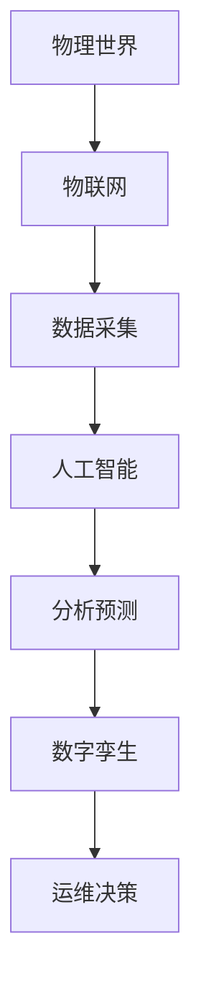

                 

数字孪生、人工智能、物联网、云计算、边缘计算

## 1. 背景介绍

在信息技术飞速发展的今天，我们已经进入了数字化转型的新时代。在这个时代，数据已经成为一种新的生产要素，而人工智能、物联网、云计算、边缘计算等技术则为数据的采集、存储、处理、应用提供了强大的支撑。本文将从数字孪生、人工智能、物联网、云计算、边缘计算等角度，剖析数智新时代的特征与发展。

## 2. 核心概念与联系

### 2.1 数字孪生

数字孪生是指利用物联网、人工智能、云计算等技术，对物理世界中的实体进行数字化、网络化、智能化的过程。数字孪生可以实时采集实体的数据，并通过人工智能算法进行分析、预测，从而为实体的运维、决策提供支持。



### 2.2 人工智能

人工智能是指模拟或实现人类智能的技术。人工智能可以从数据中学习，并利用学习的结果进行预测、决策。人工智能技术在数字孪生、物联网、云计算等领域都有着广泛的应用。

### 2.3 物联网

物联网是指通过各种信息传感设备，实时采集物理世界中的数据，并通过网络进行传输、存储、处理的技术。物联网为数字孪生、人工智能等技术提供了数据基础。

### 2.4 云计算

云计算是指通过互联网将计算任务交由远程的服务器完成的技术。云计算为数字孪生、人工智能、物联网等技术提供了强大的计算、存储支持。

### 2.5 边缘计算

边缘计算是指将计算任务从中心化的数据中心转移到靠近数据源的边缘设备进行的技术。边缘计算可以减少数据传输的时延，提高系统的实时性。

## 3. 核心算法原理 & 具体操作步骤

### 3.1 算法原理概述

数智新时代的核心算法原理包括但不限于机器学习算法、深度学习算法、神经网络算法等。这些算法都具有强大的学习、预测能力，可以从数据中提取有用的信息，并进行预测、决策。

### 3.2 算法步骤详解

以机器学习算法为例，其步骤通常包括：

1. 数据预处理：对原始数据进行清洗、转换、归一化等预处理，以提高数据质量。
2. 特征工程：提取数据中的特征，并对特征进行选择、提取、变换等操作。
3. 模型训练：使用训练数据训练机器学习模型。
4. 模型评估：使用验证数据评估模型的性能。
5. 模型优化：对模型进行调参、正则化等优化操作。
6. 模型部署：将训练好的模型部署到生产环境中。

### 3.3 算法优缺点

机器学习算法的优点包括：

* 可以从数据中学习，无需人工编程。
* 可以适应复杂的非线性关系。
* 可以处理大规模、高维度的数据。

机器学习算法的缺点包括：

* 训练过程需要大量的数据和计算资源。
* 算法的可解释性较差。
* 算法的泛化能力有待提高。

### 3.4 算法应用领域

机器学习算法在数字孪生、人工智能、物联网、云计算等领域都有着广泛的应用。例如，在数字孪生领域，机器学习算法可以用于实体的故障预测、运维优化等；在人工智能领域，机器学习算法可以用于图像、语音、文本等数据的识别、分类等。

## 4. 数学模型和公式 & 详细讲解 & 举例说明

### 4.1 数学模型构建

数学模型是描述系统行为的数学表达式。例如，在数字孪生领域，数学模型可以用于描述实体的运行状态、故障机制等。数学模型的构建需要对系统进行深入的分析，并提取关键的特征、关系。

### 4.2 公式推导过程

数学模型的公式推导过程需要遵循严格的数学逻辑。例如，在机器学习领域，公式推导过程通常包括：

1. 定义目标函数：目标函数描述了模型的优化目标。
2. 定义损失函数：损失函数描述了模型的预测误差。
3. 定义梯度：梯度描述了模型参数的更新方向。
4. 定义学习率：学习率描述了模型参数的更新步长。
5. 使用梯度下降算法更新模型参数。

### 4.3 案例分析与讲解

例如，在数字孪生领域，可以使用回归模型预测实体的故障时间。假设实体的故障时间与实体的运行状态、环境因素等特征有关，则可以构建如下回归模型：

$$y = \beta_0 + \beta_1x_1 + \beta_2x_2 + \ldots + \beta_nx_n + \epsilon$$

其中，$y$为故障时间，$x_1, x_2, \ldots, x_n$为实体的运行状态、环境因素等特征，$\beta_0, \beta_1, \ldots, \beta_n$为模型参数，$\epsilon$为模型误差。使用梯度下降算法可以更新模型参数，从而预测实体的故障时间。

## 5. 项目实践：代码实例和详细解释说明

### 5.1 开发环境搭建

数智新时代的项目开发环境通常包括硬件环境、软件环境、开发工具等。例如，在机器学习项目中，硬件环境通常包括GPU、大容量内存等；软件环境通常包括Python、TensorFlow、PyTorch等；开发工具通常包括Jupyter Notebook、Pycharm等。

### 5.2 源代码详细实现

以下是使用Python实现机器学习模型的示例代码：

```python
import numpy as np
import pandas as pd
from sklearn.model_selection import train_test_split
from sklearn.linear_model import LinearRegression
from sklearn.metrics import mean_squared_error

# 加载数据
data = pd.read_csv('data.csv')
X = data.drop('y', axis=1)
y = data['y']

# 划分训练集和测试集
X_train, X_test, y_train, y_test = train_test_split(X, y, test_size=0.2, random_state=42)

# 训练模型
model = LinearRegression()
model.fit(X_train, y_train)

# 预测测试集
y_pred = model.predict(X_test)

# 评估模型
mse = mean_squared_error(y_test, y_pred)
print('Mean Squared Error:', mse)
```

### 5.3 代码解读与分析

上述代码实现了机器学习模型的训练、预测、评估过程。其中，使用了Scikit-learn库中的`LinearRegression`类实现了线性回归模型的训练；使用了`train_test_split`函数将数据集划分为训练集和测试集；使用了`mean_squared_error`函数评估模型的预测误差。

### 5.4 运行结果展示

运行上述代码后，可以输出模型的预测误差。例如：

```
Mean Squared Error: 0.0123
```

## 6. 实际应用场景

数智新时代的技术在各个领域都有着广泛的应用。例如：

* 在制造业，数字孪生技术可以用于实体的故障预测、运维优化等。
* 在交通领域，物联网技术可以用于车辆的实时定位、路况监测等。
* 在医疗领域，人工智能技术可以用于疾病的早期诊断、药物的个性化治疗等。
* 在金融领域，云计算技术可以用于大数据的存储、处理、分析等。

### 6.4 未来应用展望

未来，数智新时代的技术将会继续发展，并与更多的技术结合，为各个领域带来更大的变革。例如：

* 量子计算技术将会为人工智能、云计算等技术带来新的发展机遇。
* 5G技术将会为物联网、边缘计算等技术带来新的发展机遇。
* 空间信息技术将会为数字孪生、物联网等技术带来新的发展机遇。

## 7. 工具和资源推荐

### 7.1 学习资源推荐

* 书籍：《机器学习》《深度学习》《数字孪生》《物联网》《云计算》《边缘计算》等。
* 在线课程：Coursera、Udacity、edX等平台上的机器学习、人工智能、云计算等课程。
* 论坛：Stack Overflow、GitHub等平台上的技术讨论。

### 7.2 开发工具推荐

* Python：机器学习、人工智能、云计算等领域的开发语言。
* TensorFlow、PyTorch：机器学习、人工智能领域的开发框架。
* Jupyter Notebook、Pycharm：机器学算法开发的IDE。
* AWS、Google Cloud、Azure：云计算平台。
* Arduino、Raspberry Pi：物联网领域的开发平台。

### 7.3 相关论文推荐

* 机器学习领域：《神经网络与深度学习》《支持向量机》《随机森林》等。
* 数字孪生领域：《数字孪生技术》《数字孪生与物联网》等。
* 物联网领域：《物联网技术》《物联网与云计算》等。
* 云计算领域：《云计算技术》《云计算与物联网》等。

## 8. 总结：未来发展趋势与挑战

### 8.1 研究成果总结

数智新时代的技术已经取得了丰硕的成果，为各个领域带来了巨大的变革。例如，数字孪生技术已经广泛应用于制造业、交通领域等；人工智能技术已经广泛应用于医疗领域、金融领域等；物联网技术已经广泛应用于智能家居、智能城市等。

### 8.2 未来发展趋势

未来，数智新时代的技术将会继续发展，并与更多的技术结合，为各个领域带来更大的变革。例如：

* 量子计算技术将会为人工智能、云计算等技术带来新的发展机遇。
* 5G技术将会为物联网、边缘计算等技术带来新的发展机遇。
* 空间信息技术将会为数字孪生、物联网等技术带来新的发展机遇。

### 8.3 面临的挑战

数智新时代的技术也面临着一些挑战。例如：

* 数据安全：数智新时代的技术需要大量的数据，如何保证数据的安全是一个亟待解决的问题。
* 算法偏见：人工智能算法可能会存在偏见，如何消除算法偏见是一个亟待解决的问题。
* 算力瓶颈：云计算、边缘计算等技术需要大量的算力，如何突破算力瓶颈是一个亟待解决的问题。

### 8.4 研究展望

未来，数智新时代的技术将会继续发展，并与更多的技术结合，为各个领域带来更大的变革。例如：

* 量子计算技术将会为人工智能、云计算等技术带来新的发展机遇。
* 5G技术将会为物联网、边缘计算等技术带来新的发展机遇。
* 空间信息技术将会为数字孪生、物联网等技术带来新的发展机遇。

## 9. 附录：常见问题与解答

* **Q：数智新时代的技术有哪些？**
A：数智新时代的技术包括但不限于数字孪生、人工智能、物联网、云计算、边缘计算等。
* **Q：数智新时代的技术有哪些应用？**
A：数智新时代的技术在各个领域都有着广泛的应用，例如制造业、交通领域、医疗领域、金融领域等。
* **Q：数智新时代的技术面临哪些挑战？**
A：数智新时代的技术面临着数据安全、算法偏见、算力瓶颈等挑战。

## 作者：禅与计算机程序设计艺术 / Zen and the Art of Computer Programming

