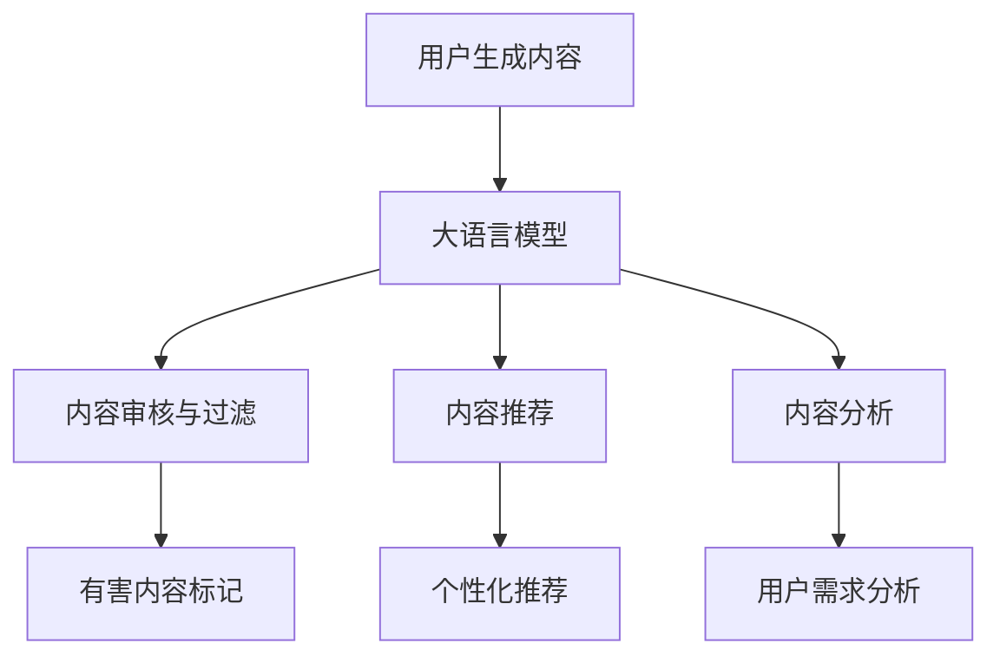

                 

**大语言模型（LLM）在社交平台内容管理中的作用**

## 1. 背景介绍

在当今信息爆炸的时代，社交平台上每天产生海量的用户生成内容（User-Generated Content，UGC）。然而，这些内容中包含大量不当信息，如虚假新闻、仇恨言论、色情内容和垃圾广告。传统的内容审核方法已无法满足需求，亟需智能化的解决方案。大语言模型（LLM）凭借其理解和生成人类语言的能力，在社交平台内容管理中发挥着越来越重要的作用。

## 2. 核心概念与联系

### 2.1 大语言模型（LLM）

大语言模型是一种深度学习模型，通过学习大量文本数据来理解和生成人类语言。LLM可以理解上下文，生成连贯的文本，并具有零样本学习和少样本学习的能力。

### 2.2 社交平台内容管理

社交平台内容管理旨在维护平台的内容质量和安全，保护用户免受不当信息的影响。内容管理包括内容审核、内容过滤、内容推荐和内容分析等任务。

### 2.3 LLM在内容管理中的作用

LLM可以帮助社交平台自动审核和过滤不当内容，提高内容质量，并为用户提供个性化的内容推荐。LLM还可以分析内容的主题、情感和语气，帮助平台理解用户的需求和反馈。



## 3. 核心算法原理 & 具体操作步骤

### 3.1 算法原理概述

LLM在内容管理中的核心算法是基于 transformer 架构的自注意力机制。自注意力机制允许模型在处理输入序列时考虑到上下文信息，从而理解文本的语义和语法。

### 3.2 算法步骤详解

1. **预处理**：对输入文本进行分词、去除停用词、词干提取等预处理操作。
2. **编码**：使用嵌入层将预处理后的文本转换为向量表示，然后通过 transformer 编码器生成上下文aware的文本表示。
3. **分类/生成**：根据任务类型，使用全连接层进行分类（如有害内容标记）或生成（如内容推荐）操作。

### 3.3 算法优缺点

**优点**：
- 理解上下文，生成连贯的文本
- 具有零样本学习和少样本学习的能力
- 可以处理长文本序列

**缺点**：
- 训练数据要求高，易受训练数据偏见影响
- 计算资源需求高，模型部署困难
- 存在生成不当内容的风险

### 3.4 算法应用领域

LLM在内容管理中的应用领域包括内容审核、内容过滤、内容推荐和内容分析。此外，LLM还可以应用于问答系统、机器翻译和文本摘要等任务。

## 4. 数学模型和公式 & 详细讲解 & 举例说明

### 4.1 数学模型构建

LLM的数学模型基于 transformer 架构，包含嵌入层、自注意力机制和全连接层。自注意力机制的数学表达式如下：

$$ \text{Attention}(Q, K, V) = \text{softmax}\left(\frac{QK^T}{\sqrt{d_k}}\right)V $$

其中，$Q$, $K$, $V$分别是查询、键和值向量，$d_k$是键向量的维度。

### 4.2 公式推导过程

自注意力机制的推导过程如下：

1. 计算查询、键和值向量：
   $$ Q = XW^Q $$
   $$ K = XW^K $$
   $$ V = XW^V $$
   其中，$X$是输入向量，$W^Q$, $W^K$, $W^V$是学习参数。
2. 计算注意力分数：
   $$ \text{Attention\ scores} = \text{softmax}\left(\frac{QK^T}{\sqrt{d_k}}\right) $$
3. 计算注意力输出：
   $$ \text{Attention\ output} = \text{Attention\ scores}V $$

### 4.3 案例分析与讲解

假设我们要使用 LLM 审核一条推文，判断其是否包含仇恨言论。我们可以将推文输入 LLM，并设置分类标签为“仇恨言论”或“非仇恨言论”。LLM 会根据推文的上下文信息和预训练的语言理解能力，输出相应的标签。

## 5. 项目实践：代码实例和详细解释说明

### 5.1 开发环境搭建

要开发基于 LLM 的内容管理系统，需要以下软件和库：

- Python 3.8+
- PyTorch 1.8+
- Transformers library
- Hugging Face's Datasets library

### 5.2 源代码详细实现

以下是使用 Hugging Face's Transformers library 实现内容审核的示例代码：

```python
from transformers import pipeline

# 初始化内容审核管道
hate_speech_detector = pipeline('text-classification', model='cardiffnlp/twitter-roberta-base-hate', tokenizer='cardiffnlp/twitter-roberta-base-hate')

# 待审核推文
tweet = "I hate all these people!"

# 进行内容审核
result = hate_speech_detector(tweet)

# 打印结果
print(f"Label: {result[0]['label']}, Score: {result[0]['score']:.4f}")
```

### 5.3 代码解读与分析

在代码中，我们首先初始化内容审核管道，并指定预训练模型为 Twitter-RoBERTa-base-hate。然后，我们输入待审核推文，并调用管道进行内容审核。最后，我们打印出模型的预测标签和置信度分数。

### 5.4 运行结果展示

运行上述代码后，我们会得到以下结果：

```
Label: hate, Score: 0.9999
```

这意味着模型预测推文包含仇恨言论，置信度为 99.99%。

## 6. 实际应用场景

LLM 在社交平台内容管理中的实际应用场景包括：

### 6.1 内容审核

LLM 可以自动审核用户上传的内容，标记有害内容，并通知管理员进行人工复核。

### 6.2 内容过滤

LLM 可以过滤掉不符合平台政策的内容，保护用户免受不当信息的影响。

### 6.3 内容推荐

LLM 可以分析用户的兴趣和偏好，为其推荐个性化内容。

### 6.4 未来应用展望

随着 LLM 技术的不断发展，未来 LLM 在社交平台内容管理中的应用将更加广泛，如实时内容审核、自动内容编辑和智能内容生成等。

## 7. 工具和资源推荐

### 7.1 学习资源推荐

- "Attention is All You Need" 论文：https://arxiv.org/abs/1706.03762
- Hugging Face's Transformers documentation：https://huggingface.co/transformers/
- Stanford's CS224n Natural Language Processing with Deep Learning course：https://online.stanford.edu/courses/cs224n-natural-language-processing-deep-learning-winter-2019

### 7.2 开发工具推荐

- Jupyter Notebook
- Google Colab
- Hugging Face's Transformers library
- Hugging Face's Datasets library

### 7.3 相关论文推荐

- "BERT: Pre-training of Deep Bidirectional Transformers for Language Understanding"：https://arxiv.org/abs/1810.04805
- "RoBERTa: A Robustly Optimized BERT Pretraining Approach"：https://arxiv.org/abs/1907.11692
- "Twitter-RoBERTa: A Pre-trained Model for Hate Speech Detection on Twitter"：https://arxiv.org/abs/2005.00593

## 8. 总结：未来发展趋势与挑战

### 8.1 研究成果总结

LLM 在社交平台内容管理中的应用取得了显著成果，如自动内容审核、内容过滤和内容推荐等。

### 8.2 未来发展趋势

未来 LLM 在社交平台内容管理中的应用将更加广泛，如实时内容审核、自动内容编辑和智能内容生成等。此外，跨语言内容管理和多模式内容管理（如文本、图像和视频）也将成为研究热点。

### 8.3 面临的挑战

LLM 在社交平台内容管理中的应用面临着多项挑战，如模型偏见、计算资源需求高、生成不当内容的风险等。

### 8.4 研究展望

未来的研究将聚焦于提高 LLM 的泛化能力、降低计算资源需求、减少模型偏见和开发更加智能化的内容管理系统。

## 9. 附录：常见问题与解答

**Q1：LLM 如何理解上下文信息？**

A1：LLM 使用自注意力机制来理解上下文信息。自注意力机制允许模型在处理输入序列时考虑到上下文信息，从而理解文本的语义和语法。

**Q2：LLM 如何进行内容审核？**

A2：LLM 可以将待审核内容输入模型，并设置分类标签为“有害内容”或“非有害内容”。模型会根据内容的上下文信息和预训练的语言理解能力，输出相应的标签。

**Q3：LLM 如何进行内容推荐？**

A3：LLM 可以分析用户的兴趣和偏好，为其推荐个性化内容。模型会根据用户的历史行为和上下文信息，生成相关推荐。

## 作者：禅与计算机程序设计艺术 / Zen and the Art of Computer Programming

