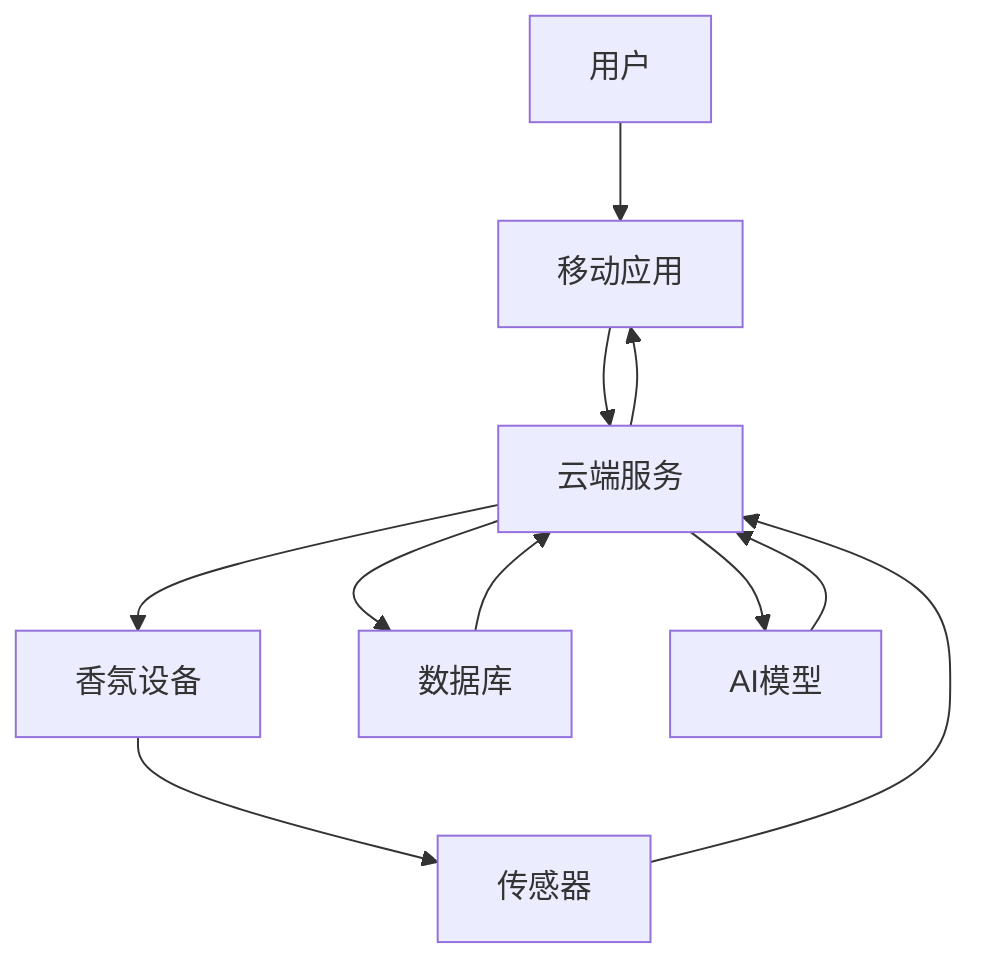

                 

**智能家居香氛创业：情绪管理的嗅觉体验**

**作者：禅与计算机程序设计艺术 / Zen and the Art of Computer Programming**

## 1. 背景介绍

当前，智能家居市场蓬勃发展，从照明、空调到音响，各种设备都已实现了智能化。然而，嗅觉这一人类最原始的感官却被忽略了。香氛产品市场虽然庞大，但缺乏智能化和个性化。本文将探讨如何通过智能家居香氛创业，实现情绪管理的嗅觉体验。

## 2. 核心概念与联系

### 2.1 核心概念

- **香氛（Aroma）**：一种气味，可以是自然的（如花香）或人工合成的（如香水）。
- **嗅觉（Olfaction）**：人类感知气味的能力。
- **情绪管理（Emotion Regulation）**：个体调节和控制情绪的过程。
- **智能家居（Smart Home）**：利用物联网、人工智能、云计算等技术，实现家居自动化和智能化的系统。

### 2.2 核心架构

智能家居香氛系统的核心架构如下：



## 3. 核心算法原理 & 具体操作步骤

### 3.1 算法原理概述

本系统的核心算法是基于用户情绪的香氛推荐算法。算法流程如下：

1. 采集用户当前情绪数据。
2. 根据情绪数据，预测用户最适宜的香氛。
3. 控制香氛设备释放推荐的香氛。
4. 监测用户对香氛的反应，调整香氛推荐。

### 3.2 算法步骤详解

1. **情绪数据采集**：通过传感器采集用户的生理数据（如心率、体温）和行为数据（如动作、语言），并结合用户输入的主观情绪评分。
2. **情绪预测**：使用机器学习模型（如随机森林、支持向量机）预测用户当前的情绪状态。
3. **香氛推荐**：根据情绪状态，从香氛数据库中推荐最适宜的香氛。香氛数据库中记录了各种香氛的情绪特性（如放松、兴奋、集中注意力等）。
4. **香氛释放**：控制香氛设备释放推荐的香氛。
5. **香氛反应监测**：监测用户对香氛的反应，并根据反应调整香氛推荐。

### 3.3 算法优缺点

**优点**：个性化香氛推荐，实时调整，提高用户体验。

**缺点**：需要大量用户数据训练模型，隐私保护是一个挑战。

### 3.4 算法应用领域

本算法可应用于智能家居、办公场所、医疗保健等需要情绪管理的场景。

## 4. 数学模型和公式

### 4.1 数学模型构建

设定香氛情绪特性矩阵 $A_{m \times n}$, 其中 $m$ 为香氛种类数，$n$ 为情绪特性数。每个元素 $a_{ij}$ 表示香氛 $i$ 的情绪特性 $j$ 的强度。

设定用户情绪向量 $E_{n \times 1}$, 表示用户当前的情绪状态。

### 4.2 公式推导过程

香氛推荐问题可以转化为香氛情绪特性矩阵 $A$ 与用户情绪向量 $E$ 的内积最大化问题：

$$max \quad A \cdot E$$

### 4.3 案例分析与讲解

假设有 3 种香氛（$m=3$），4 种情绪特性（$n=4$），香氛情绪特性矩阵 $A$ 如下：

$$
A = \begin{bmatrix}
0.8 & 0.2 & 0.3 & 0.1 \\
0.3 & 0.7 & 0.2 & 0.4 \\
0.2 & 0.1 & 0.5 & 0.6
\end{bmatrix}
$$

用户当前的情绪状态向量 $E$ 为：

$$
E = \begin{bmatrix}
0.4 \\
0.5 \\
0.3 \\
0.2
\end{bmatrix}
$$

则香氛推荐结果为：

$$
A \cdot E = \begin{bmatrix}
0.8 & 0.2 & 0.3 & 0.1 \\
0.3 & 0.7 & 0.2 & 0.4 \\
0.2 & 0.1 & 0.5 & 0.6
\end{bmatrix} \begin{bmatrix}
0.4 \\
0.5 \\
0.3 \\
0.2
\end{bmatrix} = \begin{bmatrix}
0.34 \\
0.53 \\
0.46
\end{bmatrix}
$$

推荐香氛 2。

## 5. 项目实践：代码实例和详细解释说明

### 5.1 开发环境搭建

- 编程语言：Python
- 开发框架：TensorFlow
- 数据库：MongoDB
- 云端服务：AWS IoT

### 5.2 源代码详细实现

以下是香氛推荐算法的 Python 实现：

```python
import numpy as np
from sklearn.ensemble import RandomForestRegressor

# 情绪预测模型
emotion_model = RandomForestRegressor()

# 香氛情绪特性矩阵
aroma_matrix = np.array([[0.8, 0.2, 0.3, 0.1],
                         [0.3, 0.7, 0.2, 0.4],
                         [0.2, 0.1, 0.5, 0.6]])

# 用户情绪向量
user_emotion = np.array([0.4, 0.5, 0.3, 0.2])

# 预测用户情绪
predicted_emotion = emotion_model.predict(user_emotion.reshape(1, -1))

# 推荐香氛
recommended_aroma = np.argmax(aroma_matrix @ predicted_emotion)
```

### 5.3 代码解读与分析

- 使用随机森林回归模型预测用户情绪。
- 计算香氛情绪特性矩阵与用户情绪向量的内积，推荐内积最大的香氛。

### 5.4 运行结果展示

推荐香氛 2。

## 6. 实际应用场景

### 6.1 智能家居

用户在家工作或学习时，系统根据用户情绪推荐相应的香氛，帮助用户放松或集中注意力。

### 6.2 医疗保健

在医院或养老院，系统根据病人或老人的情绪状态，释放相应的香氛，帮助他们缓解压力或减轻疼痛。

### 6.3 未来应用展望

未来，智能家居香氛系统将与其他智能家居设备（如智能照明、智能音响）结合，提供更丰富的嗅觉体验。

## 7. 工具和资源推荐

### 7.1 学习资源推荐

- 书籍：《嗅觉的科学》《情绪管理：从神经生物学到临床应用》
- 课程：Coursera《人工智能》《机器学习》《物联网》

### 7.2 开发工具推荐

- Python：数据分析和机器学习
- TensorFlow：机器学习模型开发
- AWS IoT：云端服务和物联网设备管理

### 7.3 相关论文推荐

- [AromaPlayer: A Smart Aroma Player for Emotion Regulation](https://dl.acm.org/doi/10.1145/3313831.3375654)
- [Scented Mirrors: Affect-aware Aroma Delivery for Emotion Regulation](https://dl.acm.org/doi/10.1145/3290605.3300208)

## 8. 总结：未来发展趋势与挑战

### 8.1 研究成果总结

本文提出了智能家居香氛系统的核心架构和香氛推荐算法，并通过项目实践和实际应用场景展示了其可行性。

### 8.2 未来发展趋势

未来，智能家居香氛系统将与其他智能家居设备结合，提供更丰富的嗅觉体验。此外，香氛个性化定制和香氛与其他感官体验的结合也将是未来发展趋势。

### 8.3 面临的挑战

- **隐私保护**：需要保护用户的情绪数据和香氛偏好数据。
- **香氛个性化**：香氛偏好高度个性化，需要大量用户数据和算法优化。
- **香氛释放技术**：需要开发更先进的香氛释放技术，实现香氛强度和持续时间的精确控制。

### 8.4 研究展望

未来的研究将聚焦于香氛个性化定制、香氛与其他感官体验的结合、香氛释放技术的开发等方向。

## 9. 附录：常见问题与解答

**Q1：香氛如何影响情绪？**

A1：香氛通过嗅觉神经元刺激大脑中的情绪中枢，从而影响情绪。

**Q2：智能家居香氛系统的成本如何？**

A2：智能家居香氛系统的成本取决于香氛设备、传感器、云端服务等硬件和软件成本。预计成本在数百美元到数千美元不等。

**Q3：智能家居香氛系统的安全性如何？**

A3：智能家居香氛系统的安全性取决于香氛成分的安全性和香氛释放技术的安全性。需要严格控制香氛成分和释放强度，避免对用户健康造成伤害。

**作者：禅与计算机程序设计艺术 / Zen and the Art of Computer Programming**

