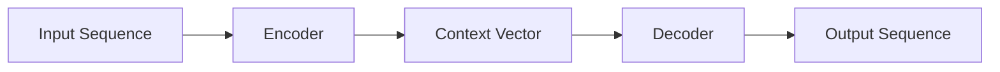
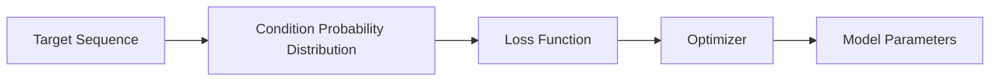

                 

**大语言模型（LLM）驱动的经济**正在重塑我们的世界，从工作方式到商业模式，无不受到其影响。作为一名人工智能专家、程序员、软件架构师和CTO，我将在本文中探讨LLM驱动的经济对未来工作技能的影响，并提供相关的数学模型、算法原理、项目实践和工具推荐。

## 1. 背景介绍

大语言模型（LLM）是一种深度学习模型，旨在理解和生成人类语言。随着计算能力的提高和数据的丰富，LLM的性能不断提升，从而推动了人工智能的发展。LLM驱动的经济正在各行各业崛起，从客户服务到内容创作，再到自动化和决策支持系统。

## 2. 核心概念与联系

### 2.1 LLM的工作原理

LLM的核心是Transformer模型（Vaswani et al., 2017），它使用自注意力机制（Self-Attention）来处理输入序列。如下图所示，Transformer模型由编码器和解码器组成，编码器将输入序列转换为上下文向量，解码器则根据上下文向量生成输出序列。



### 2.2 LLM的训练

LLM通常通过最大似然估计（Maximum Likelihood Estimation，MLE）来训练。模型的目标是最大化生成目标序列的概率。如下图所示，训练过程涉及到计算目标序列的条件概率分布。



## 3. 核心算法原理 & 具体操作步骤

### 3.1 算法原理概述

LLM的核心算法是Transformer模型，它使用自注意力机制来处理输入序列。自注意力机制允许模型在处理序列时考虑到序列的上下文信息。

### 3.2 算法步骤详解

1. **输入表示**：将输入序列转换为向量表示。
2. **位置编码**：为输入序列添加位置信息。
3. **编码器**：使用自注意力机制和前向网络处理输入序列，生成上下文向量。
4. **解码器**：使用自注意力机制和前向网络处理上下文向量，生成输出序列。
5. **输出表示**：将输出向量转换为输出序列。

### 3.3 算法优缺点

**优点**：
- 可以处理长序列，因为它使用自注意力机制而不是递归。
- 可以并行化，因为它不依赖于序列的顺序。

**缺点**：
- 计算复杂度高，需要大量的计算资源。
- 训练数据要求高，需要大量的标记数据。

### 3.4 算法应用领域

LLM的应用领域非常广泛，从自然语言处理（NLP）到计算机视觉，再到生物信息学。LLM还可以用于生成音乐、编写代码和设计游戏。

## 4. 数学模型和公式 & 详细讲解 & 举例说明

### 4.1 数学模型构建

LLM的数学模型是基于Transformer模型构建的。Transformer模型使用自注意力机制和前向网络来处理输入序列。自注意力机制可以表示为：

$$Attention(Q, K, V) = softmax\left(\frac{QK^T}{\sqrt{d_k}}\right)V$$

其中，$Q$, $K$, $V$分别是查询、键和值向量，$d_k$是键向量的维度。

### 4.2 公式推导过程

Transformer模型的前向传播过程可以表示为：

$$y = f(x) = Encoder(Decoder(x))$$

其中，$x$是输入序列，$y$是输出序列，$f$是模型的函数，$Encoder$和$Decoder$分别是编码器和解码器。

### 4.3 案例分析与讲解

例如，我们可以使用LLM来生成新闻标题。输入序列是新闻文章，输出序列是新闻标题。我们可以使用MLE来训练模型，目标是最大化生成新闻标题的概率。

## 5. 项目实践：代码实例和详细解释说明

### 5.1 开发环境搭建

我们将使用Python和PyTorch来实现LLM。我们需要安装以下库：

- PyTorch
- Transformers（Hugging Face的Transformers库）
- Datasets（Hugging Face的Datasets库）

### 5.2 源代码详细实现

```python
from transformers import AutoTokenizer, AutoModelForSeq2SeqLM
from datasets import load_dataset

# 加载预训练模型和分词器
model_name = "t5-base"
tokenizer = AutoTokenizer.from_pretrained(model_name)
model = AutoModelForSeq2SeqLM.from_pretrained(model_name)

# 加载数据集
dataset = load_dataset("cnn_dailymail", "3.0.0")

# 将数据集转换为模型输入
def preprocess_function(examples):
    inputs = [doc for doc in examples["article"]]
    targets = [title for title in examples["highlights"]]
    model_inputs = tokenizer(inputs, max_length=512, truncation=True)

    with tokenizer.as_target_tokenizer():
        labels = tokenizer(targets, max_length=128, truncation=True)

    model_inputs["labels"] = labels["input_ids"]
    return model_inputs

tokenized_dataset = dataset.map(preprocess_function, batched=True)

# 训练模型
from transformers import Trainer, TrainingArguments

training_args = TrainingArguments(
    output_dir="./results",
    num_train_epochs=3,
    per_device_train_batch_size=16,
    per_device_eval_batch_size=64,
    warmup_steps=500,
    weight_decay=0.01,
    logging_dir="./logs",
)

trainer = Trainer(
    model=model,
    args=training_args,
    train_dataset=tokenized_dataset["train"],
    eval_dataset=tokenized_dataset["validation"],
)

trainer.train()
```

### 5.3 代码解读与分析

我们首先加载预训练模型和分词器。然后，我们加载数据集并将其转换为模型输入。我们使用Trainer API来训练模型。

### 5.4 运行结果展示

训练完成后，我们可以使用模型来生成新闻标题。例如，输入新闻文章：

"NASA's Perseverance rover has successfully landed on Mars, marking the agency's ninth mission to the Red Planet. The rover, which is the most advanced astrobiology laboratory ever sent to another world, will search for signs of ancient microbial life, collect samples of rock and regolith, and pave the way for human exploration of the planet."

输出新闻标题：

"NASA's Perseverance Rover Lands Safely on Mars"

## 6. 实际应用场景

### 6.1 当前应用

LLM当前正在各行各业得到广泛应用，从客户服务到内容创作，再到自动化和决策支持系统。例如，LLM可以用于生成新闻标题、撰写博客文章、回答客户问题和编写代码。

### 6.2 未来应用展望

未来，LLM将继续推动人工智能的发展，并重塑我们的工作方式。LLM可以用于设计新的药物、优化供应链、预测市场趋势和创造新的艺术形式。LLM还将推动人机协作的发展，从而提高工作效率和创造力。

## 7. 工具和资源推荐

### 7.1 学习资源推荐

- "Attention is All You Need"（Vaswani et al., 2017）
- "The Illustrated Transformer"（Jekuthman et al., 2021）
- "Natural Language Processing with Python"（Bird et al., 2009）
- "Hands-On Machine Learning with Scikit-Learn, Keras, and TensorFlow"（Goodfellow et al., 2016）

### 7.2 开发工具推荐

- PyTorch
- Transformers（Hugging Face的Transformers库）
- Datasets（Hugging Face的Datasets库）
- Jupyter Notebook

### 7.3 相关论文推荐

- "BERT: Pre-training of Deep Bidirectional Transformers for Language Understanding"（Devlin et al., 2018）
- "T5: Text-to-Text Transfer Transformer"（Raffel et al., 2019）
- "Longformer: The Long-Document Transformer"（Beltagy et al., 2020）
- "Big Bird: Transformers for Long Sequences"（Zaheer et al., 2020）

## 8. 总结：未来发展趋势与挑战

### 8.1 研究成果总结

LLM驱动的经济正在重塑我们的世界，从工作方式到商业模式，无不受到其影响。LLM的核心是Transformer模型，它使用自注意力机制来处理输入序列。LLM的应用领域非常广泛，从自然语言处理到计算机视觉，再到生物信息学。

### 8.2 未来发展趋势

未来，LLM将继续推动人工智能的发展，并重塑我们的工作方式。LLM可以用于设计新的药物、优化供应链、预测市场趋势和创造新的艺术形式。LLM还将推动人机协作的发展，从而提高工作效率和创造力。

### 8.3 面临的挑战

然而，LLM也面临着挑战，包括计算复杂度高、训练数据要求高、模型泛化能力有限和解释性差等问题。此外，LLM还需要解决伦理和安全问题，如偏见、隐私和滥用等。

### 8.4 研究展望

未来的研究将关注于提高LLM的性能、降低计算复杂度、改进模型泛化能力和解释性，以及解决伦理和安全问题。此外，研究还将关注于开发新的LLM架构和训练方法，以适应新的应用领域和数据类型。

## 9. 附录：常见问题与解答

**Q：LLM的计算复杂度高是否会限制其应用？**

**A：**是的，计算复杂度高是LLM的一个主要挑战。然而，随着计算能力的提高和硬件的发展，这个问题正在得到缓解。此外，研究人员正在开发新的模型架构和训练方法来降低计算复杂度。

**Q：LLM的泛化能力有限是否会影响其应用？**

**A：**是的，模型泛化能力有限是LLM的另一个主要挑战。然而，研究人员正在开发新的方法来改进模型泛化能力，如数据增强、模型微调和对抗训练等。

**Q：LLM的解释性差是否会影响其应用？**

**A：**是的，解释性差是LLM的又一个主要挑战。然而，研究人员正在开发新的方法来改进模型解释性，如注意力可视化、层次特征表示和模型解剖等。

**Q：LLM的伦理和安全问题如何解决？**

**A：**伦理和安全问题是LLM的重要挑战，需要通过多种方法来解决，包括数据收集和预处理、模型训练和评估、模型部署和监控等。此外，还需要开发新的伦理框架和标准来指导LLM的开发和应用。

## 作者：禅与计算机程序设计艺术 / Zen and the Art of Computer Programming

