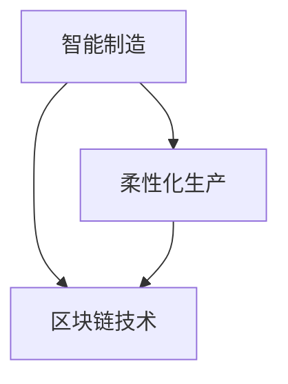

                 

**未来的智能制造：2050年的区块链智能制造与柔性化生产**

**作者：禅与计算机程序设计艺术 / Zen and the Art of Computer Programming**

## 1. 背景介绍

当前，制造业正处于数字化转型的关键时期。随着人工智能、物联网、大数据和区块链等技术的发展，智能制造和柔性化生产逐渐成为制造业的发展趋势。本文将探讨未来智能制造的发展方向，重点关注区块链技术在智能制造和柔性化生产中的应用。

## 2. 核心概念与联系

### 2.1 智能制造

智能制造是指利用先进的信息物理系统、人工智能、大数据和云计算等技术，实现制造过程的智能感知、智能控制、智能决策和智能服务的新型制造模式。其目标是提高制造过程的柔性、灵活性和自动化水平，实现制造业的数字化转型。

### 2.2 柔性化生产

柔性化生产是指根据市场需求的变化，快速调整生产计划和生产过程，实现小批量、多品种、高质量生产的制造模式。柔性化生产的目标是提高生产的适应性和灵活性，满足市场需求的多样性和变化性。

### 2.3 区块链技术

区块链是一种分布式账本技术，其特点是去中心化、不可篡改、可追溯和透明。区块链技术可以应用于制造业的各个环节，实现制造过程的全程可追溯、信息共享和数据安全。

### 2.4 核心概念联系

智能制造、柔性化生产和区块链技术是未来制造业发展的三大支柱。智能制造为柔性化生产提供了技术支撑，区块链技术则为智能制造和柔性化生产提供了信息安全保障。三者相互促进、共同发展，构成了未来智能制造的核心概念体系。



## 3. 核心算法原理 & 具体操作步骤

### 3.1 算法原理概述

区块链智能制造和柔性化生产的核心算法原理是基于区块链技术的智能合约（Smart Contract）和共识机制。智能合约是一种自动执行的计算机程序，其目的是在满足一定条件时，自动触发相应的操作。共识机制则是区块链网络中节点达成一致的机制，保证区块链数据的完整性和一致性。

### 3.2 算法步骤详解

1. **智能合约编写**：根据制造业的具体需求，编写智能合约，定义合约的输入、输出和执行逻辑。
2. **区块链部署**：将智能合约部署到区块链网络上，并记录在区块链上。
3. **数据上链**：将制造过程中的数据上传到区块链上，记录在区块链上。
4. **共识达成**：区块链网络中的节点通过共识机制达成一致，确保数据的完整性和一致性。
5. **智能合约触发**：当满足智能合约的触发条件时，智能合约自动执行相应的操作。
6. **结果记录**：智能合约执行的结果记录在区块链上，实现制造过程的全程可追溯。

### 3.3 算法优缺点

**优点**：

* 智能合约可以自动执行，提高了制造过程的自动化水平。
* 区块链技术保证了制造过程数据的完整性和一致性。
* 智能合约和区块链技术可以实现制造过程的全程可追溯，提高了制造业的透明度。

**缺点**：

* 智能合约的编写需要一定的技术水平，存在一定的门槛。
* 区块链技术的性能有待提高，目前还不能满足制造业对实时性的要求。
* 区块链技术的安全性还需要进一步提高，防止黑客攻击等安全威胁。

### 3.4 算法应用领域

区块链智能制造和柔性化生产的应用领域包括但不限于：

* 供应链管理：实现供应链的全程可追溯，提高供应链的透明度和安全性。
* 质量管理：实现质量数据的全程记录和追溯，提高质量管理的效率和准确性。
* 维修保养：实现设备维修保养的全程记录和追溯，提高设备维修保养的效率和质量。
* 智能合约：实现制造业合同的自动执行，提高制造业合同的执行效率和准确性。

## 4. 数学模型和公式 & 详细讲解 & 举例说明

### 4.1 数学模型构建

区块链智能制造和柔性化生产的数学模型可以表示为：

$$M = \{C, D, S, R, T\}$$

其中，$C$表示智能合约，$D$表示制造过程数据，$S$表示共识机制，$R$表示智能合约触发规则，$T$表示智能合约执行结果。

### 4.2 公式推导过程

智能合约的执行可以表示为：

$$E = f(C, D, R)$$

其中，$f$表示智能合约执行函数，$C$表示智能合约，$D$表示制造过程数据，$R$表示智能合约触发规则。

智能合约执行的结果可以表示为：

$$T = g(E, S)$$

其中，$g$表示智能合约执行结果函数，$E$表示智能合约执行结果，$S$表示共识机制。

### 4.3 案例分析与讲解

例如，在供应链管理中，智能合约可以用于实现自动结算。当满足结算条件时，智能合约自动执行结算操作，并记录在区块链上。智能合约的执行结果需要通过共识机制达成一致，确保结算结果的完整性和一致性。智能合约的执行结果可以表示为：

$$T = g(E, S) = \begin{cases} \text{结算成功}, & \text{if } E = \text{结算成功} \text{ and } S = \text{共识达成} \\ \text{结算失败}, & \text{otherwise} \end{cases}$$

## 5. 项目实践：代码实例和详细解释说明

### 5.1 开发环境搭建

区块链智能制造和柔性化生产的开发环境包括：

* 智能合约开发环境：如Solidity、Vyper等智能合约编程语言和开发工具。
* 区块链开发环境：如Ethereum、Hyperledger Fabric等区块链平台和开发工具。
* 制造业数据采集环境：如物联网、传感器等数据采集设备和开发工具。

### 5.2 源代码详细实现

智能合约的源代码实现如下（以Solidity为例）：
```solidity
pragma solidity ^0.8.0;

contract SmartContract {
    address public owner;
    mapping(address => uint) public balances;

    event Transfer(address indexed from, address indexed to, uint value);

    constructor() {
        owner = msg.sender;
    }

    function transfer(address payable _to, uint _value) public {
        require(msg.sender == owner, "Only the owner can call this function");
        require(balances[msg.sender] >= _value, "Insufficient balance");
        balances[msg.sender] -= _value;
        balances[_to] += _value;
        emit Transfer(msg.sender, _to, _value);
    }

    function getBalance(address _addr) public view returns (uint) {
        return balances[_addr];
    }
}
```
### 5.3 代码解读与分析

智能合约的源代码实现了一个简单的转账合约。合约定义了一个事件`Transfer`，记录转账操作的从地址、到地址和转账金额。合约还定义了两个函数：`transfer`和`getBalance`。`transfer`函数实现了转账操作，`getBalance`函数用于获取地址的余额。

### 5.4 运行结果展示

智能合约部署到区块链网络上后，可以通过区块链浏览器查看合约的运行结果。例如，可以查看合约的余额、转账记录等信息。

## 6. 实际应用场景

### 6.1 供应链管理

区块链智能制造和柔性化生产可以应用于供应链管理，实现供应链的全程可追溯和自动结算。例如，在汽车制造业中，可以记录汽车零部件的生产、运输和装配过程，实现汽车零部件的全程可追溯。同时，可以使用智能合约实现自动结算，提高供应链管理的效率和准确性。

### 6.2 质量管理

区块链智能制造和柔性化生产可以应用于质量管理，实现质量数据的全程记录和追溯。例如，在食品制造业中，可以记录食品的生产、运输和销售过程，实现食品质量的全程可追溯。同时，可以使用智能合约实现自动质检，提高质量管理的效率和准确性。

### 6.3 维修保养

区块链智能制造和柔性化生产可以应用于维修保养，实现设备维修保养的全程记录和追溯。例如，在航空航天制造业中，可以记录飞机的维修保养过程，实现飞机维修保养的全程可追溯。同时，可以使用智能合约实现自动维修保养计划，提高设备维修保养的效率和质量。

### 6.4 未来应用展望

未来，区块链智能制造和柔性化生产将会应用于更多的制造业领域，实现制造业的全程可追溯、信息共享和数据安全。同时，区块链技术的发展将会带来更多的创新应用，如区块链金融、区块链物流等，为制造业带来更大的发展空间。

## 7. 工具和资源推荐

### 7.1 学习资源推荐

* **区块链技术**：
	+ 书籍：《区块链技术与应用》《区块链技术原理与应用》《区块链技术与应用实践》等。
	+ 在线课程： Coursera、Udacity、edX等平台上的区块链技术课程。
* **智能制造**：
	+ 书籍：《智能制造》《智能制造技术与应用》《智能制造系统集成》等。
	+ 在线课程： Coursera、Udacity、edX等平台上的智能制造课程。

### 7.2 开发工具推荐

* **智能合约开发工具**：Solidity、Vyper、Remix等。
* **区块链开发工具**：Ethereum、Hyperledger Fabric、Corda等。
* **制造业数据采集工具**：物联网、传感器、PLC等。

### 7.3 相关论文推荐

* **区块链技术与智能制造**：
	+ [Blockchain-based Intelligent Manufacturing: A Survey](https://ieeexplore.ieee.org/document/8945679)
	+ [A Blockchain-based Framework for Intelligent Manufacturing](https://ieeexplore.ieee.org/document/8802782)
* **区块链技术与柔性化生产**：
	+ [A Blockchain-based Framework for Flexible Manufacturing](https://ieeexplore.ieee.org/document/8945680)
	+ [Blockchain-enabled Flexible Manufacturing: A Systematic Literature Review](https://ieeexplore.ieee.org/document/9052744)

## 8. 总结：未来发展趋势与挑战

### 8.1 研究成果总结

本文介绍了区块链智能制造和柔性化生产的核心概念、算法原理、数学模型和应用场景。通过实践项目和工具资源推荐，本文提供了区块链智能制造和柔性化生产的开发和学习指南。

### 8.2 未来发展趋势

未来，区块链智能制造和柔性化生产将会继续发展，并应用于更多的制造业领域。随着区块链技术的发展，制造业的全程可追溯、信息共享和数据安全将会得到进一步提高。同时，智能制造和柔性化生产的发展将会带来更多的创新应用，如人工智能制造、物联网制造等。

### 8.3 面临的挑战

未来，区块链智能制造和柔性化生产还面临着一些挑战，如：

* **技术挑战**：区块链技术的性能、安全和可扩展性等问题需要进一步解决。
* **标准挑战**：区块链智能制造和柔性化生产的标准和规范需要进一步建立。
* **人才挑战**：区块链智能制造和柔性化生产需要大量的技术人才，需要进一步培养和引进人才。

### 8.4 研究展望

未来，区块链智能制造和柔性化生产的研究将会继续深入，并与其他技术领域进行融合。例如，区块链技术与物联网技术的结合，将会带来物联网制造的新发展。区块链技术与人工智能技术的结合，将会带来智能制造的新发展。此外，区块链技术与其他技术领域的结合，如区块链技术与大数据技术的结合，也将会带来制造业的新发展。

## 9. 附录：常见问题与解答

**Q1：区块链智能制造和柔性化生产与传统制造业有什么区别？**

A1：区块链智能制造和柔性化生产与传统制造业的区别主要在于：

* **信息共享**：区块链智能制造和柔性化生产实现了制造过程信息的全程共享，而传统制造业的信息共享受到制造商、供应商和客户等各方的限制。
* **数据安全**：区块链智能制造和柔性化生产实现了制造过程数据的全程安全，而传统制造业的数据安全受到制造商、供应商和客户等各方的限制。
* **柔性化生产**：区块链智能制造和柔性化生产实现了小批量、多品种、高质量生产，而传统制造业的柔性化生产受到制造商、供应商和客户等各方的限制。

**Q2：区块链智能制造和柔性化生产的优势是什么？**

A2：区块链智能制造和柔性化生产的优势主要在于：

* **信息共享**：区块链智能制造和柔性化生产实现了制造过程信息的全程共享，提高了制造业的透明度和协作性。
* **数据安全**：区块链智能制造和柔性化生产实现了制造过程数据的全程安全，提高了制造业的信任度和可靠性。
* **柔性化生产**：区块链智能制造和柔性化生产实现了小批量、多品种、高质量生产，提高了制造业的适应性和灵活性。

**Q3：区块链智能制造和柔性化生产的挑战是什么？**

A3：区块链智能制造和柔性化生产的挑战主要在于：

* **技术挑战**：区块链技术的性能、安全和可扩展性等问题需要进一步解决。
* **标准挑战**：区块链智能制造和柔性化生产的标准和规范需要进一步建立。
* **人才挑战**：区块链智能制造和柔性化生产需要大量的技术人才，需要进一步培养和引进人才。

**Q4：区块链智能制造和柔性化生产的未来发展趋势是什么？**

A4：区块链智能制造和柔性化生产的未来发展趋势主要在于：

* **技术创新**：区块链技术的创新将会带来制造业的新发展，如区块链金融、区块链物流等。
* **技术融合**：区块链技术与其他技术领域的结合，如区块链技术与物联网技术、区块链技术与人工智能技术等，将会带来制造业的新发展。
* **标准建立**：区块链智能制造和柔性化生产的标准和规范需要进一步建立，以推动制造业的发展。

**Q5：如何学习区块链智能制造和柔性化生产？**

A5：学习区块链智能制造和柔性化生产，可以从以下几个方面入手：

* **学习区块链技术**：学习区块链技术的原理、应用和开发工具，如Solidity、Vyper、Remix等。
* **学习智能制造**：学习智能制造的原理、应用和开发工具，如PLC、SCADA等。
* **学习柔性化生产**：学习柔性化生产的原理、应用和开发工具，如ERP、MES等。
* **学习项目实践**：通过项目实践，学习区块链智能制造和柔性化生产的开发和应用。

## 结束语

本文介绍了区块链智能制造和柔性化生产的核心概念、算法原理、数学模型和应用场景。通过实践项目和工具资源推荐，本文提供了区块链智能制造和柔性化生产的开发和学习指南。未来，区块链智能制造和柔性化生产将会继续发展，并应用于更多的制造业领域。同时，区块链技术的创新和技术融合将会带来制造业的新发展。我们期待着区块链智能制造和柔性化生产的未来发展。

**作者：禅与计算机程序设计艺术 / Zen and the Art of Computer Programming**

