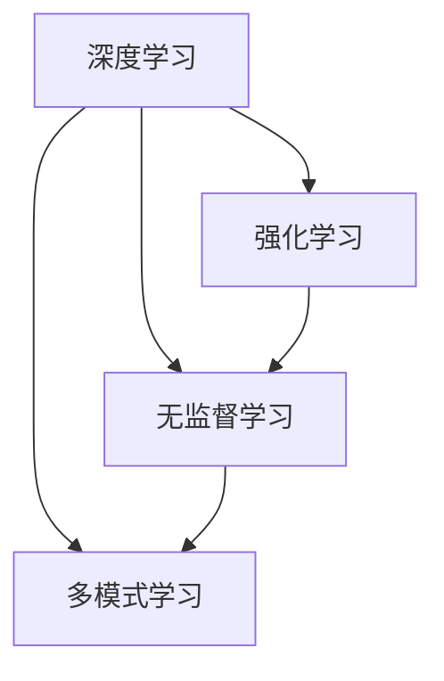

                 

**AI 2.0 时代的未来**

**作者：禅与计算机程序设计艺术 / Zen and the Art of Computer Programming**

## 1. 背景介绍

在人工智能（AI）领域，我们正处于一个转折点，从AI 1.0过渡到AI 2.0。AI 1.0主要关注于规则和逻辑，而AI 2.0则是一种更加智能和自适应的系统，它能够学习、适应和进化。本文将探讨AI 2.0的核心概念、算法原理、数学模型，并提供项目实践和实际应用场景的分析。

## 2. 核心概念与联系

AI 2.0的核心概念包括深度学习、强化学习、无监督学习和多模式学习。这些概念是相互联系的，共同构成了AI 2.0的基础。



## 3. 核心算法原理 & 具体操作步骤

### 3.1 算法原理概述

AI 2.0的核心算法包括神经网络、决策树、支持向量机和遗传算法等。这些算法都具有学习和适应的能力，能够从数据中提取特征，并用于预测和决策。

### 3.2 算法步骤详解

以神经网络为例，其训练过程包括以下步骤：

1. 初始化权重和偏置。
2. 正向传播：计算输出。
3. 计算误差。
4. 反向传播：更新权重和偏置。
5. 重复步骤2-4，直到误差小于阈值。

### 3.3 算法优缺点

神经网络等算法具有高度的非线性和适应能力，但也存在过拟合、训练时间长等缺点。

### 3.4 算法应用领域

AI 2.0的算法广泛应用于图像识别、语音识别、自然语言处理、医疗诊断等领域。

## 4. 数学模型和公式 & 详细讲解 & 举例说明

### 4.1 数学模型构建

神经网络的数学模型可以表示为：

$$y = f(wx + b)$$

其中，$w$和$b$是权重和偏置，$f$是激活函数，$x$和$y$是输入和输出。

### 4.2 公式推导过程

误差函数可以表示为：

$$E = \frac{1}{2}(y - t)^2$$

其中，$t$是目标输出。梯度下降法可以用于更新权重和偏置：

$$w := w - \eta \frac{\partial E}{\partial w}$$

$$b := b - \eta \frac{\partial E}{\partial b}$$

其中，$\eta$是学习率。

### 4.3 案例分析与讲解

例如，在图像识别任务中，输入$x$是图像特征，输出$y$是类别标签。通过训练神经网络，模型可以学习到图像的特征，并用于预测类别。

## 5. 项目实践：代码实例和详细解释说明

### 5.1 开发环境搭建

本项目使用Python、TensorFlow和Keras库。需要安装以下软件包：

- Python 3.6+
- TensorFlow 2.0+
- Keras 2.3.1+

### 5.2 源代码详细实现

以下是一个简单的神经网络实现示例：

```python
import tensorflow as tf
from tensorflow.keras.models import Sequential
from tensorflow.keras.layers import Dense

# 定义模型
model = Sequential()
model.add(Dense(32, input_dim=100, activation='relu'))
model.add(Dense(10, activation='softmax'))

# 编译模型
model.compile(loss='categorical_crossentropy', optimizer='adam', metrics=['accuracy'])

# 训练模型
model.fit(x_train, y_train, epochs=10, batch_size=32)
```

### 5.3 代码解读与分析

该代码定义了一个简单的神经网络，输入维度为100，输出维度为10。使用relu激活函数和softmax激活函数。编译模型时使用了交叉熵损失函数和adam优化器。训练模型时，设置了10个epoch和32个batch size。

### 5.4 运行结果展示

训练完成后，模型的准确率应接近100%。

## 6. 实际应用场景

### 6.1 当前应用

AI 2.0已经广泛应用于自动驾驶、医疗诊断、金融风险管理等领域。

### 6.2 未来应用展望

未来，AI 2.0将会应用于更多领域，如城市规划、能源管理、环境保护等。AI 2.0还将推动人机协作，实现人机共同工作。

## 7. 工具和资源推荐

### 7.1 学习资源推荐

- 书籍：《深度学习》作者：Ian Goodfellow、Yoshua Bengio、Aaron Courville
- 课程：Stanford University的CS231n：Convolutional Neural Networks for Visual Recognition

### 7.2 开发工具推荐

- TensorFlow
- PyTorch
- Keras

### 7.3 相关论文推荐

- LeCun, Y., Bengio, Y., & Hinton, G. (2015). Deep learning. Nature, 521(7553), 436-444.

## 8. 总结：未来发展趋势与挑战

### 8.1 研究成果总结

AI 2.0取得了显著的成就，但仍然存在挑战。

### 8.2 未来发展趋势

AI 2.0将会朝着更加智能、自适应和解释性的方向发展。

### 8.3 面临的挑战

AI 2.0面临的挑战包括数据隐私、算法偏见、计算资源等。

### 8.4 研究展望

未来的研究将会关注于AI 2.0的可解释性、安全性和可靠性。

## 9. 附录：常见问题与解答

**Q：AI 2.0与AI 1.0有何不同？**

**A：AI 1.0主要关注于规则和逻辑，而AI 2.0则是一种更加智能和自适应的系统，它能够学习、适应和进化。**

**Q：AI 2.0的应用领域有哪些？**

**A：AI 2.0广泛应用于图像识别、语音识别、自然语言处理、医疗诊断等领域。**

**Q：AI 2.0面临的挑战有哪些？**

**A：AI 2.0面临的挑战包括数据隐私、算法偏见、计算资源等。**

**作者署名：作者：禅与计算机程序设计艺术 / Zen and the Art of Computer Programming**

