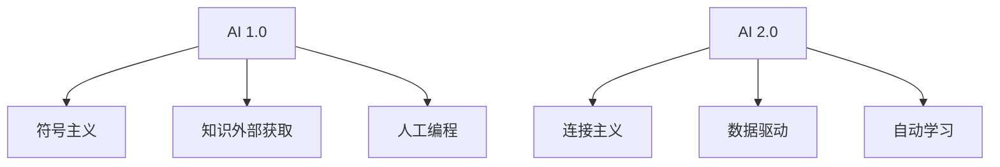

                 

**AI 2.0 时代的社会价值**

**作者：禅与计算机程序设计艺术 / Zen and the Art of Computer Programming**

## 1. 背景介绍

在人工智能（AI）飞速发展的今天，我们正处于AI 2.0时代的黎明。AI 2.0是指以深度学习为代表的新一代人工智能，它具有更强的学习能力和更广泛的应用领域。本文将从技术、社会和伦理等角度，探讨AI 2.0时代的社会价值。

## 2. 核心概念与联系

### 2.1 AI 1.0与AI 2.0的区别

AI 1.0时代以符号主义为代表，强调知识的外部获取和人工编程。而AI 2.0时代则以连接主义为代表，强调数据驱动和自动学习。二者的区别如下图所示：



### 2.2 AI 2.0的核心技术

AI 2.0的核心技术包括深度学习、强化学习、无监督学习等。其中，深度学习是AI 2.0的核心，它通过构建多层神经网络，模拟人类大脑的学习过程，实现自动学习。

## 3. 核心算法原理 & 具体操作步骤

### 3.1 深度学习原理概述

深度学习的原理是通过构建多层神经网络，模拟人类大脑的学习过程，实现自动学习。它的基本单位是神经元，神经元之间通过权重连接，构成神经网络。

### 3.2 深度学习步骤详解

深度学习的步骤包括数据预处理、模型构建、训练和测试。其中，训练过程包括前向传播、反向传播和权重更新。具体步骤如下：

1. 数据预处理：对数据进行清洗、标准化和分割。
2. 模型构建：构建神经网络模型，设置超参数。
3. 训练：输入数据，进行前向传播，计算误差，进行反向传播，更新权重。
4. 测试：输入测试数据，进行预测，评估模型性能。

### 3.3 深度学习优缺点

深度学习的优点包括自动学习能力强、表达能力强、泛化能力好。缺点包括数据需求量大、训练时间长、解释性差。

### 3.4 深度学习应用领域

深度学习的应用领域包括图像识别、语音识别、自然语言处理、医疗影像分析等。

## 4. 数学模型和公式 & 详细讲解 & 举例说明

### 4.1 深度学习数学模型构建

深度学习的数学模型是神经网络，它由多层神经元组成。每层神经元与下一层神经元全连接，构成一个权重矩阵。输入数据通过权重矩阵进行线性变换，再通过激活函数进行非线性变换，输出结果。

### 4.2 公式推导过程

设输入数据为$x$, 权重矩阵为$W$, 偏置向量为$b$, 激活函数为$f$, 则第$l$层神经元的输出为：

$$a^{(l)} = f(W^{(l)}a^{(l-1)} + b^{(l)})$$

其中，$a^{(0)} = x$为输入数据，$a^{(L)}$为输出结果，$L$为神经网络的层数。

### 4.3 案例分析与讲解

例如，构建一个二层全连接神经网络，用于分类任务。设输入数据为$x \in \mathbb{R}^{n}$, 则输出结果为：

$$y = \sigma(W^{(2)}f(W^{(1)}x + b^{(1)})) + b^{(2)}$$

其中，$\sigma$为sigmoid激活函数，$W^{(1)} \in \mathbb{R}^{m \times n}, b^{(1)} \in \mathbb{R}^{m}$，$W^{(2)} \in \mathbb{R}^{k \times m}, b^{(2)} \in \mathbb{R}^{k}$，$m$为隐藏层神经元数，$k$为输出类别数。

## 5. 项目实践：代码实例和详细解释说明

### 5.1 开发环境搭建

本项目使用Python语言，并依赖TensorFlow深度学习框架。环境搭建如下：

```bash
pip install tensorflow
```

### 5.2 源代码详细实现

以下是一个简单的二层全连接神经网络的实现代码：

```python
import tensorflow as tf

# 定义输入数据
x = tf.placeholder(tf.float32, [None, 784])
# 定义输出标签
y_ = tf.placeholder(tf.float32, [None, 10])

# 定义权重和偏置
W1 = tf.Variable(tf.truncated_normal([784, 500], stddev=0.1))
b1 = tf.Variable(tf.zeros([500]))
W2 = tf.Variable(tf.truncated_normal([500, 10], stddev=0.1))
b2 = tf.Variable(tf.zeros([10]))

# 定义前向传播过程
a1 = tf.nn.relu(tf.matmul(x, W1) + b1)
y = tf.matmul(a1, W2) + b2

# 定义损失函数
cross_entropy = tf.reduce_mean(tf.nn.softmax_cross_entropy_with_logits(labels=y_, logits=y))

# 定义训练过程
train_step = tf.train.GradientDescentOptimizer(0.5).minimize(cross_entropy)
```

### 5.3 代码解读与分析

代码首先定义输入数据$x$和输出标签$y\_$, 然后定义权重$W$和偏置$b$. 之后，定义前向传播过程，使用ReLU激活函数构建二层全连接神经网络。然后，定义损失函数，使用交叉熵函数计算预测结果与真实标签的差异。最后，定义训练过程，使用梯度下降法最小化损失函数。

### 5.4 运行结果展示

运行训练过程，可以训练出一个能够正确识别手写数字的神经网络模型。

## 6. 实际应用场景

### 6.1 图像识别

深度学习在图像识别领域取得了重大突破，例如人脸识别、物体识别等。例如，Facebook的DeepFace项目使用深度学习技术实现了高精度的人脸识别。

### 6.2 语音识别

深度学习在语音识别领域也取得了重大突破，例如语音转写、语音助手等。例如，Google的Speech-to-Text项目使用深度学习技术实现了高精度的语音转写。

### 6.3 未来应用展望

未来，深度学习将会应用于更多领域，例如自动驾驶、医疗影像分析等。例如，Waymo的自动驾驶项目使用深度学习技术实现了高精度的物体检测和跟踪。

## 7. 工具和资源推荐

### 7.1 学习资源推荐

推荐阅读《深度学习》一书，该书由好未来创始人张邦鑫编著，全面介绍了深度学习的原理和应用。此外，还可以关注机器之心（[机器之心](https://www.jiqizhixin.com/)）等人工智能媒体。

### 7.2 开发工具推荐

推荐使用TensorFlow、PyTorch等深度学习框架进行开发。此外，还可以使用Keras、PaddlePaddle等高级API进行开发。

### 7.3 相关论文推荐

推荐阅读《ImageNet Classification with Deep Convolutional Neural Networks》等经典论文，该论文介绍了深度学习在图像识别领域的应用。

## 8. 总结：未来发展趋势与挑战

### 8.1 研究成果总结

本文介绍了AI 2.0时代的社会价值，从技术、社会和伦理等角度进行了分析。深度学习是AI 2.0的核心技术，具有强大的学习能力和广泛的应用领域。但是，深度学习也面临着数据需求量大、训练时间长、解释性差等挑战。

### 8.2 未来发展趋势

未来，深度学习将会继续发展，出现更多创新的架构和算法。此外，深度学习还将与其他人工智能技术结合，实现更强大的智能系统。例如，深度学习与强化学习的结合，实现了更强大的决策系统。

### 8.3 面临的挑战

未来，深度学习还将面临着数据隐私、算法偏见等伦理挑战。如何保护数据隐私，如何消除算法偏见，是深度学习需要解决的关键问题。

### 8.4 研究展望

未来，深度学习的研究将会朝着更小、更快、更智能的方向发展。例如，如何构建更小的模型，如何提高模型训练速度，如何实现更智能的学习系统，都是未来深度学习研究的方向。

## 9. 附录：常见问题与解答

**Q1：什么是AI 2.0？**

**A1：AI 2.0是指以深度学习为代表的新一代人工智能，它具有更强的学习能力和更广泛的应用领域。**

**Q2：深度学习的优缺点是什么？**

**A2：深度学习的优点包括自动学习能力强、表达能力强、泛化能力好。缺点包括数据需求量大、训练时间长、解释性差。**

**Q3：深度学习的应用领域有哪些？**

**A3：深度学习的应用领域包括图像识别、语音识别、自然语言处理、医疗影像分析等。**

**Q4：如何构建深度学习模型？**

**A4：构建深度学习模型的步骤包括数据预处理、模型构建、训练和测试。其中，训练过程包括前向传播、反向传播和权重更新。**

**Q5：未来深度学习的发展趋势是什么？**

**A5：未来，深度学习将会继续发展，出现更多创新的架构和算法。此外，深度学习还将与其他人工智能技术结合，实现更强大的智能系统。**

**Q6：未来深度学习面临的挑战是什么？**

**A6：未来，深度学习还将面临着数据隐私、算法偏见等伦理挑战。如何保护数据隐私，如何消除算法偏见，是深度学习需要解决的关键问题。**

**Q7：未来深度学习的研究方向是什么？**

**A7：未来，深度学习的研究将会朝着更小、更快、更智能的方向发展。例如，如何构建更小的模型，如何提高模型训练速度，如何实现更智能的学习系统，都是未来深度学习研究的方向。**

## 结束语

本文从技术、社会和伦理等角度，介绍了AI 2.0时代的社会价值。深度学习是AI 2.0的核心技术，具有强大的学习能力和广泛的应用领域。但是，深度学习也面临着数据需求量大、训练时间长、解释性差等挑战。未来，深度学习将会继续发展，出现更多创新的架构和算法。但是，如何保护数据隐私，如何消除算法偏见，是深度学习需要解决的关键问题。未来，深度学习的研究将会朝着更小、更快、更智能的方向发展。我们期待着深度学习的未来。

**作者：禅与计算机程序设计艺术 / Zen and the Art of Computer Programming**

