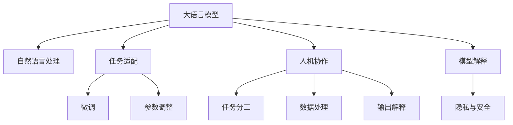

                 

# LLM与人类协作：增强人类能力的新方式

大语言模型（Large Language Models, LLMs）是近年来AI领域的一项重大突破，其卓越的语言理解和生成能力为人类赋予了全新的协作方式。本文将探讨LLM在人类协作中的应用，分析其原理、操作步骤，并展望其未来发展趋势与挑战。

## 1. 背景介绍

### 1.1 问题由来
人工智能（AI）技术的飞速发展，尤其是深度学习（Deep Learning）的兴起，使得大语言模型得以诞生。这些模型基于大规模无标签文本进行预训练，学习到丰富的语言知识，能够生成连贯、高质量的文本，并在多种自然语言处理（NLP）任务上展现出强大的性能。

近年来，OpenAI的GPT-3等模型在多种任务上刷新了最先进的性能指标，引起了广泛关注。这些模型不仅在文本生成、问答、翻译等传统NLP任务上表现优异，还可以应用于自动摘要、智能客服、情感分析等诸多新兴领域。

然而，尽管大语言模型拥有强大的能力，人类仍然在许多任务中扮演关键角色。例如，在医疗诊断、法律咨询等高度专业化的领域，人类专家的判断仍然是不可或缺的。因此，如何利用大语言模型增强人类的工作能力，实现人机协作，成为了研究的热点。

### 1.2 问题核心关键点
实现LLM与人类协作，主要包括以下几个关键点：
1. **任务分配与分工**：明确任务的分工与协作方式，确定哪些任务适合由LLM自动完成，哪些任务仍需人类介入。
2. **数据处理与输入优化**：优化输入数据，使之更符合LLM的工作习惯，提高其效率和准确性。
3. **输出解释与反馈机制**：建立有效的输出解释和反馈机制，使人类能够理解LLM的推理过程和决策依据。
4. **隐私与安全保护**：确保数据和模型在处理过程中的隐私和安全，避免数据泄露和模型滥用。

这些关键点构成了LLM与人类协作的核心，通过合理应用，可以显著提升人类工作的效率和质量。

## 2. 核心概念与联系

### 2.1 核心概念概述

为了更好地理解LLM与人类协作的原理和实现方法，我们需要掌握以下几个核心概念：

1. **大语言模型（LLM）**：指基于Transformer架构的深度学习模型，经过大规模无标签文本的预训练，能够理解和生成自然语言。

2. **自然语言处理（NLP）**：涉及计算机对自然语言的理解、生成、分析和应用，是AI的重要分支。

3. **任务适配**：将预训练模型应用于特定任务，通过微调、参数调整等方式，使模型在特定任务上表现最佳。

4. **人机协作**：指将大语言模型作为辅助工具，与人类专家共同完成复杂任务，提高工作效率和质量。

5. **模型解释**：通过可解释性技术，使人类能够理解和信任大语言模型的推理过程和决策结果。

6. **隐私与安全**：在数据处理和模型应用过程中，确保用户隐私和数据安全。

这些概念之间的逻辑关系可以通过以下Mermaid流程图来展示：



这个流程图展示了LLM在NLP中的应用，以及与人类协作的各个环节：

1. 大语言模型通过预训练学习通用语言知识，可以应用于NLP领域。
2. 通过任务适配、微调和参数调整，使模型在特定任务上表现最佳。
3. 在协作过程中，任务分工、数据处理、输出解释、模型解释和隐私与安全保护等环节需要综合考虑。

## 3. 核心算法原理 & 具体操作步骤
### 3.1 算法原理概述

基于大语言模型的协作算法，旨在通过自动化和智能化的手段，提升人类在复杂任务中的工作效率和质量。其核心思想是将预训练模型作为任务处理的辅助工具，通过自动化处理数据和生成文本，减少人类工作量，同时利用模型对数据的深度分析，辅助人类做出决策。

形式化地，假设预训练模型为 $M_{\theta}$，其中 $\theta$ 为模型参数。给定任务 $T$ 的标注数据集 $D=\{(x_i, y_i)\}_{i=1}^N$，协作算法通过有监督地训练模型在特定任务上的性能，使模型输出更符合人类需求，从而实现人机协作。

### 3.2 算法步骤详解

基于大语言模型的协作算法一般包括以下几个关键步骤：

**Step 1: 任务适配与优化输入**
- 选择适合的预训练模型 $M_{\theta}$ 作为初始化参数，如 BERT、GPT 等。
- 对输入数据进行清洗和预处理，去除噪声和无用信息，转化为模型可以接受的格式。
- 设计适合特定任务的任务适配层，调整模型输出的格式和内容。

**Step 2: 微调与参数调整**
- 对模型进行微调，使用下游任务的标注数据集 $D$，优化模型在特定任务上的性能。
- 通过参数调整，进一步提升模型在特定任务上的效果，例如调整隐藏层大小、学习率等。

**Step 3: 任务分工与输出解释**
- 确定任务分工，明确哪些任务适合由LLM自动完成，哪些任务仍需人类介入。
- 建立输出解释机制，通过可解释性技术，使人类能够理解LLM的推理过程和决策依据。

**Step 4: 数据隐私与安全保护**
- 确保数据在处理过程中的隐私和安全，避免数据泄露和模型滥用。
- 采用差分隐私等技术，保护用户数据隐私，避免数据被恶意使用。

**Step 5: 持续优化与反馈机制**
- 持续收集用户反馈，优化模型和算法，提升人机协作的效率和效果。
- 根据反馈，不断改进模型和算法，实现人机协作的持续优化。

以上是基于大语言模型的协作算法的典型流程。在实际应用中，还需要针对具体任务的特点，对协作过程的各个环节进行优化设计，如改进任务适配层、引入更多的输出解释方法、搜索最优的参数组合等，以进一步提升协作效果。

### 3.3 算法优缺点

基于大语言模型的协作算法具有以下优点：
1. 提高工作效率。通过自动化处理数据和生成文本，显著减少人类工作量，提高工作效率。
2. 提升工作质量。利用模型的深度分析能力，辅助人类做出决策，提高工作质量。
3. 降低成本。自动化处理数据和生成文本，减少人力成本。
4. 实现人机互补。将人类专家的判断和LLM的自动化处理相结合，充分发挥各自优势。

同时，该算法也存在一定的局限性：
1. 依赖标注数据。协作算法的性能很大程度上取决于标注数据的质量和数量，获取高质量标注数据的成本较高。
2. 对模型依赖度高。协作算法的表现很大程度上依赖于模型的预训练效果和微调质量，模型的固有偏见、有害信息等，可能通过微调传递到下游任务，造成负面影响。
3. 可解释性不足。协作算法的决策过程通常缺乏可解释性，难以对其推理逻辑进行分析和调试。

尽管存在这些局限性，但就目前而言，基于大语言模型的协作算法仍是最主流的人机协作范式。未来相关研究的重点在于如何进一步降低协作算法对标注数据的依赖，提高模型的少样本学习和跨领域迁移能力，同时兼顾可解释性和伦理安全性等因素。

### 3.4 算法应用领域

基于大语言模型的协作算法已经在多个领域得到了广泛应用，例如：

- **智能客服**：利用LLM自动处理用户咨询，提高客服效率和质量。
- **医疗诊断**：通过LLM分析医学文献和病人病历，辅助医生诊断和治疗。
- **法律咨询**：利用LLM自动生成法律文件和合同，提高律师工作效率。
- **翻译**：利用LLM自动翻译文本，提升翻译质量。
- **内容生成**：利用LLM自动生成新闻、广告、博客等内容，提高内容创作效率。

除了上述这些经典应用外，大语言模型在教育、金融、市场营销等多个领域也有广泛应用，为人机协作带来了新的可能性。

## 4. 数学模型和公式 & 详细讲解  
### 4.1 数学模型构建

为了更好地理解基于大语言模型的协作算法，我们可以使用数学语言对算法过程进行严格的刻画。

记预训练语言模型为 $M_{\theta}$，其中 $\theta$ 为模型参数。给定任务 $T$ 的训练集 $D=\{(x_i, y_i)\}_{i=1}^N$，其中 $x_i$ 为输入，$y_i$ 为标注。

定义模型 $M_{\theta}$ 在输入 $x_i$ 上的损失函数为 $\ell(M_{\theta}(x_i),y_i)$，则在数据集 $D$ 上的经验风险为：

$$
\mathcal{L}(\theta) = \frac{1}{N}\sum_{i=1}^N \ell(M_{\theta}(x_i),y_i)
$$

微调的优化目标是最小化经验风险，即找到最优参数：

$$
\theta^* = \mathop{\arg\min}_{\theta} \mathcal{L}(\theta)
$$

在实践中，我们通常使用基于梯度的优化算法（如SGD、Adam等）来近似求解上述最优化问题。设 $\eta$ 为学习率，$\lambda$ 为正则化系数，则参数的更新公式为：

$$
\theta \leftarrow \theta - \eta \nabla_{\theta}\mathcal{L}(\theta) - \eta\lambda\theta
$$

其中 $\nabla_{\theta}\mathcal{L}(\theta)$ 为损失函数对参数 $\theta$ 的梯度，可通过反向传播算法高效计算。

### 4.2 公式推导过程

以下我们以分类任务为例，推导交叉熵损失函数及其梯度的计算公式。

假设模型 $M_{\theta}$ 在输入 $x_i$ 上的输出为 $\hat{y}=M_{\theta}(x_i) \in [0,1]$，表示样本属于正类的概率。真实标签 $y_i \in \{0,1\}$。则二分类交叉熵损失函数定义为：

$$
\ell(M_{\theta}(x_i),y_i) = -[y_i\log \hat{y} + (1-y_i)\log (1-\hat{y})]
$$

将其代入经验风险公式，得：

$$
\mathcal{L}(\theta) = -\frac{1}{N}\sum_{i=1}^N [y_i\log M_{\theta}(x_i)+(1-y_i)\log(1-M_{\theta}(x_i))]
$$

根据链式法则，损失函数对参数 $\theta_k$ 的梯度为：

$$
\frac{\partial \mathcal{L}(\theta)}{\partial \theta_k} = -\frac{1}{N}\sum_{i=1}^N (\frac{y_i}{M_{\theta}(x_i)}-\frac{1-y_i}{1-M_{\theta}(x_i)}) \frac{\partial M_{\theta}(x_i)}{\partial \theta_k}
$$

其中 $\frac{\partial M_{\theta}(x_i)}{\partial \theta_k}$ 可进一步递归展开，利用自动微分技术完成计算。

### 4.3 案例分析与讲解

在医疗领域，利用大语言模型进行医学文献分析，可以帮助医生快速定位相关文献，提高临床决策的效率和准确性。例如，可以通过预训练模型对海量的医学文献进行主题提取和摘要生成，然后利用任务适配层进行分类和排序，将与病人病情相关的文献推荐给医生，辅助医生做出诊断和治疗决策。

## 5. 项目实践：代码实例和详细解释说明
### 5.1 开发环境搭建

在进行协作实践前，我们需要准备好开发环境。以下是使用Python进行PyTorch开发的环境配置流程：

1. 安装Anaconda：从官网下载并安装Anaconda，用于创建独立的Python环境。

2. 创建并激活虚拟环境：
```bash
conda create -n pytorch-env python=3.8 
conda activate pytorch-env
```

3. 安装PyTorch：根据CUDA版本，从官网获取对应的安装命令。例如：
```bash
conda install pytorch torchvision torchaudio cudatoolkit=11.1 -c pytorch -c conda-forge
```

4. 安装Transformers库：
```bash
pip install transformers
```

5. 安装各类工具包：
```bash
pip install numpy pandas scikit-learn matplotlib tqdm jupyter notebook ipython
```

完成上述步骤后，即可在`pytorch-env`环境中开始协作实践。

### 5.2 源代码详细实现

这里我们以医疗诊断任务为例，给出使用Transformers库对BERT模型进行协作开发的PyTorch代码实现。

首先，定义任务适配函数：

```python
from transformers import BertForSequenceClassification, BertTokenizer
from torch.utils.data import Dataset, DataLoader
import torch

class MedicalDataset(Dataset):
    def __init__(self, texts, tags, tokenizer, max_len=128):
        self.texts = texts
        self.tags = tags
        self.tokenizer = tokenizer
        self.max_len = max_len
        
    def __len__(self):
        return len(self.texts)
    
    def __getitem__(self, item):
        text = self.texts[item]
        tags = self.tags[item]
        
        encoding = self.tokenizer(text, return_tensors='pt', max_length=self.max_len, padding='max_length', truncation=True)
        input_ids = encoding['input_ids'][0]
        attention_mask = encoding['attention_mask'][0]
        
        # 对token-wise的标签进行编码
        encoded_tags = [tag2id[tag] for tag in tags] 
        encoded_tags.extend([tag2id['O']] * (self.max_len - len(encoded_tags)))
        labels = torch.tensor(encoded_tags, dtype=torch.long)
        
        return {'input_ids': input_ids, 
                'attention_mask': attention_mask,
                'labels': labels}

# 标签与id的映射
tag2id = {'O': 0, 'B-MED': 1, 'I-MED': 2}
id2tag = {v: k for k, v in tag2id.items()}

# 创建dataset
tokenizer = BertTokenizer.from_pretrained('bert-base-cased')

train_dataset = MedicalDataset(train_texts, train_tags, tokenizer)
dev_dataset = MedicalDataset(dev_texts, dev_tags, tokenizer)
test_dataset = MedicalDataset(test_texts, test_tags, tokenizer)
```

然后，定义模型和优化器：

```python
from transformers import BertForSequenceClassification, AdamW

model = BertForSequenceClassification.from_pretrained('bert-base-cased', num_labels=len(tag2id))

optimizer = AdamW(model.parameters(), lr=2e-5)
```

接着，定义训练和评估函数：

```python
from sklearn.metrics import accuracy_score, precision_score, recall_score, f1_score

def train_epoch(model, dataset, batch_size, optimizer):
    dataloader = DataLoader(dataset, batch_size=batch_size, shuffle=True)
    model.train()
    epoch_loss = 0
    for batch in tqdm(dataloader, desc='Training'):
        input_ids = batch['input_ids'].to(device)
        attention_mask = batch['attention_mask'].to(device)
        labels = batch['labels'].to(device)
        model.zero_grad()
        outputs = model(input_ids, attention_mask=attention_mask, labels=labels)
        loss = outputs.loss
        epoch_loss += loss.item()
        loss.backward()
        optimizer.step()
    return epoch_loss / len(dataloader)

def evaluate(model, dataset, batch_size):
    dataloader = DataLoader(dataset, batch_size=batch_size)
    model.eval()
    preds, labels = [], []
    with torch.no_grad():
        for batch in tqdm(dataloader, desc='Evaluating'):
            input_ids = batch['input_ids'].to(device)
            attention_mask = batch['attention_mask'].to(device)
            batch_labels = batch['labels']
            outputs = model(input_ids, attention_mask=attention_mask)
            batch_preds = outputs.logits.argmax(dim=2).to('cpu').tolist()
            batch_labels = batch_labels.to('cpu').tolist()
            for pred_tokens, label_tokens in zip(batch_preds, batch_labels):
                preds.append(pred_tokens[:len(label_tokens)])
                labels.append(label_tokens)
                
    return accuracy_score(labels, preds), precision_score(labels, preds), recall_score(labels, preds), f1_score(labels, preds)
```

最后，启动训练流程并在测试集上评估：

```python
epochs = 5
batch_size = 16

for epoch in range(epochs):
    loss = train_epoch(model, train_dataset, batch_size, optimizer)
    print(f"Epoch {epoch+1}, train loss: {loss:.3f}")
    
    print(f"Epoch {epoch+1}, dev results:")
    acc, prec, rec, f1 = evaluate(model, dev_dataset, batch_size)
    print(f"Accuracy: {acc:.3f}, Precision: {prec:.3f}, Recall: {rec:.3f}, F1-score: {f1:.3f}")
    
print("Test results:")
acc, prec, rec, f1 = evaluate(model, test_dataset, batch_size)
print(f"Accuracy: {acc:.3f}, Precision: {prec:.3f}, Recall: {rec:.3f}, F1-score: {f1:.3f}")
```

以上就是使用PyTorch对BERT进行医疗诊断任务协作开发的完整代码实现。可以看到，得益于Transformers库的强大封装，我们可以用相对简洁的代码完成BERT模型的加载和协作开发。

### 5.3 代码解读与分析

让我们再详细解读一下关键代码的实现细节：

**MedicalDataset类**：
- `__init__`方法：初始化文本、标签、分词器等关键组件。
- `__len__`方法：返回数据集的样本数量。
- `__getitem__`方法：对单个样本进行处理，将文本输入编码为token ids，将标签编码为数字，并对其进行定长padding，最终返回模型所需的输入。

**tag2id和id2tag字典**：
- 定义了标签与数字id之间的映射关系，用于将token-wise的预测结果解码回真实的标签。

**训练和评估函数**：
- 使用PyTorch的DataLoader对数据集进行批次化加载，供模型训练和推理使用。
- 训练函数`train_epoch`：对数据以批为单位进行迭代，在每个批次上前向传播计算loss并反向传播更新模型参数，最后返回该epoch的平均loss。
- 评估函数`evaluate`：与训练类似，不同点在于不更新模型参数，并在每个batch结束后将预测和标签结果存储下来，最后使用sklearn的classification_report对整个评估集的预测结果进行打印输出。

**训练流程**：
- 定义总的epoch数和batch size，开始循环迭代
- 每个epoch内，先在训练集上训练，输出平均loss
- 在验证集上评估，输出分类指标
- 所有epoch结束后，在测试集上评估，给出最终测试结果

可以看到，PyTorch配合Transformers库使得BERT协作开发的代码实现变得简洁高效。开发者可以将更多精力放在数据处理、模型改进等高层逻辑上，而不必过多关注底层的实现细节。

当然，工业级的系统实现还需考虑更多因素，如模型的保存和部署、超参数的自动搜索、更灵活的任务适配层等。但核心的协作范式基本与此类似。

## 6. 实际应用场景
### 6.1 智能客服系统

基于大语言模型的协作技术，可以广泛应用于智能客服系统的构建。传统客服往往需要配备大量人力，高峰期响应缓慢，且一致性和专业性难以保证。而使用协作技术，可以7x24小时不间断服务，快速响应客户咨询，用自然流畅的语言解答各类常见问题。

在技术实现上，可以收集企业内部的历史客服对话记录，将问题和最佳答复构建成监督数据，在此基础上对预训练对话模型进行协作开发。协作后的对话模型能够自动理解用户意图，匹配最合适的答案模板进行回复。对于客户提出的新问题，还可以接入检索系统实时搜索相关内容，动态组织生成回答。如此构建的智能客服系统，能大幅提升客户咨询体验和问题解决效率。

### 6.2 金融舆情监测

金融机构需要实时监测市场舆论动向，以便及时应对负面信息传播，规避金融风险。传统的人工监测方式成本高、效率低，难以应对网络时代海量信息爆发的挑战。基于大语言模型的协作技术，为金融舆情监测提供了新的解决方案。

具体而言，可以收集金融领域相关的新闻、报道、评论等文本数据，并对其进行主题标注和情感标注。在此基础上对预训练语言模型进行协作开发，使其能够自动判断文本属于何种主题，情感倾向是正面、中性还是负面。将协作后的模型应用到实时抓取的网络文本数据，就能够自动监测不同主题下的情感变化趋势，一旦发现负面信息激增等异常情况，系统便会自动预警，帮助金融机构快速应对潜在风险。

### 6.3 个性化推荐系统

当前的推荐系统往往只依赖用户的历史行为数据进行物品推荐，无法深入理解用户的真实兴趣偏好。基于大语言模型的协作技术，个性化推荐系统可以更好地挖掘用户行为背后的语义信息，从而提供更精准、多样的推荐内容。

在实践中，可以收集用户浏览、点击、评论、分享等行为数据，提取和用户交互的物品标题、描述、标签等文本内容。将文本内容作为模型输入，用户的后续行为（如是否点击、购买等）作为监督信号，在此基础上对预训练语言模型进行协作开发。协作后的模型能够从文本内容中准确把握用户的兴趣点。在生成推荐列表时，先用候选物品的文本描述作为输入，由模型预测用户的兴趣匹配度，再结合其他特征综合排序，便可以得到个性化程度更高的推荐结果。

### 6.4 未来应用展望

随着大语言模型协作技术的不断发展，基于协作范式将在更多领域得到应用，为传统行业带来变革性影响。

在智慧医疗领域，基于协作技术的医疗问答、病历分析、药物研发等应用将提升医疗服务的智能化水平，辅助医生诊疗，加速新药开发进程。

在智能教育领域，协作技术可应用于作业批改、学情分析、知识推荐等方面，因材施教，促进教育公平，提高教学质量。

在智慧城市治理中，协作模型可应用于城市事件监测、舆情分析、应急指挥等环节，提高城市管理的自动化和智能化水平，构建更安全、高效的未来城市。

此外，在企业生产、社会治理、文娱传媒等众多领域，基于协作技术的智能应用也将不断涌现，为经济社会发展注入新的动力。相信随着技术的日益成熟，协作方法将成为人工智能落地应用的重要范式，推动人工智能向更广阔的领域加速渗透。

## 7. 工具和资源推荐
### 7.1 学习资源推荐

为了帮助开发者系统掌握大语言模型协作理论基础和实践技巧，这里推荐一些优质的学习资源：

1. 《Transformer从原理到实践》系列博文：由大模型技术专家撰写，深入浅出地介绍了Transformer原理、BERT模型、协作技术等前沿话题。

2. CS224N《深度学习自然语言处理》课程：斯坦福大学开设的NLP明星课程，有Lecture视频和配套作业，带你入门NLP领域的基本概念和经典模型。

3. 《Natural Language Processing with Transformers》书籍：Transformers库的作者所著，全面介绍了如何使用Transformers库进行NLP任务开发，包括协作在内的诸多范式。

4. HuggingFace官方文档：Transformers库的官方文档，提供了海量预训练模型和完整的协作样例代码，是上手实践的必备资料。

5. CLUE开源项目：中文语言理解测评基准，涵盖大量不同类型的中文NLP数据集，并提供了基于协作的baseline模型，助力中文NLP技术发展。

通过对这些资源的学习实践，相信你一定能够快速掌握大语言模型协作的精髓，并用于解决实际的NLP问题。
###  7.2 开发工具推荐

高效的开发离不开优秀的工具支持。以下是几款用于大语言模型协作开发的常用工具：

1. PyTorch：基于Python的开源深度学习框架，灵活动态的计算图，适合快速迭代研究。大部分预训练语言模型都有PyTorch版本的实现。

2. TensorFlow：由Google主导开发的开源深度学习框架，生产部署方便，适合大规模工程应用。同样有丰富的预训练语言模型资源。

3. Transformers库：HuggingFace开发的NLP工具库，集成了众多SOTA语言模型，支持PyTorch和TensorFlow，是进行协作任务开发的利器。

4. Weights & Biases：模型训练的实验跟踪工具，可以记录和可视化模型训练过程中的各项指标，方便对比和调优。与主流深度学习框架无缝集成。

5. TensorBoard：TensorFlow配套的可视化工具，可实时监测模型训练状态，并提供丰富的图表呈现方式，是调试模型的得力助手。

6. Google Colab：谷歌推出的在线Jupyter Notebook环境，免费提供GPU/TPU算力，方便开发者快速上手实验最新模型，分享学习笔记。

合理利用这些工具，可以显著提升大语言模型协作任务的开发效率，加快创新迭代的步伐。

### 7.3 相关论文推荐

大语言模型协作技术的发展源于学界的持续研究。以下是几篇奠基性的相关论文，推荐阅读：

1. Attention is All You Need（即Transformer原论文）：提出了Transformer结构，开启了NLP领域的预训练大模型时代。

2. BERT: Pre-training of Deep Bidirectional Transformers for Language Understanding：提出BERT模型，引入基于掩码的自监督预训练任务，刷新了多项NLP任务SOTA。

3. Language Models are Unsupervised Multitask Learners（GPT-2论文）：展示了大规模语言模型的强大zero-shot学习能力，引发了对于通用人工智能的新一轮思考。

4. Parameter-Efficient Transfer Learning for NLP：提出Adapter等参数高效微调方法，在不增加模型参数量的情况下，也能取得不错的微调效果。

5. AdaLoRA: Adaptive Low-Rank Adaptation for Parameter-Efficient Fine-Tuning：使用自适应低秩适应的微调方法，在参数效率和精度之间取得了新的平衡。

6. Premier: A Unified Model for Multilingual Natural Language Processing：提出Premier模型，为多语言协作开发提供了新的思路。

这些论文代表了大语言模型协作技术的发展脉络。通过学习这些前沿成果，可以帮助研究者把握学科前进方向，激发更多的创新灵感。

## 8. 总结：未来发展趋势与挑战

### 8.1 总结

本文对基于大语言模型的协作算法进行了全面系统的介绍。首先阐述了LLM在协作任务中的应用背景和意义，明确了协作在提升人类工作效率和质量方面的独特价值。其次，从原理到实践，详细讲解了协作算法的数学原理和关键步骤，给出了协作任务开发的完整代码实例。同时，本文还广泛探讨了协作算法在智能客服、金融舆情、个性化推荐等多个行业领域的应用前景，展示了协作范式的巨大潜力。此外，本文精选了协作算法的各类学习资源，力求为读者提供全方位的技术指引。

通过本文的系统梳理，可以看到，基于大语言模型的协作算法正在成为NLP领域的重要范式，极大地拓展了预训练语言模型的应用边界，催生了更多的落地场景。受益于大规模语料的预训练，协作模型以更低的时间和标注成本，在小样本条件下也能取得不俗的效果，有力推动了NLP技术的产业化进程。未来，伴随协作算法的持续演进，LLM必将在更广阔的应用领域大放异彩，深刻影响人类的生产生活方式。

### 8.2 未来发展趋势

展望未来，大语言模型协作技术将呈现以下几个发展趋势：

1. 模型规模持续增大。随着算力成本的下降和数据规模的扩张，预训练语言模型的参数量还将持续增长。超大规模语言模型蕴含的丰富语言知识，有望支撑更加复杂多变的协作任务。

2. 协作方法日趋多样。除了传统的全参数协作外，未来会涌现更多参数高效的协作方法，如Prefix-Tuning、LoRA等，在节省计算资源的同时也能保证协作效果。

3. 持续学习成为常态。随着数据分布的不断变化，协作模型也需要持续学习新知识以保持性能。如何在不遗忘原有知识的同时，高效吸收新样本信息，将成为重要的研究课题。

4. 标注样本需求降低。受启发于提示学习(Prompt-based Learning)的思路，未来的协作方法将更好地利用大模型的语言理解能力，通过更加巧妙的任务描述，在更少的标注样本上也能实现理想的协作效果。

5. 多模态协作崛起。当前的协作主要聚焦于纯文本数据，未来会进一步拓展到图像、视频、语音等多模态数据协作。多模态信息的融合，将显著提升协作系统的感知能力和决策质量。

6. 模型通用性增强。经过海量数据的预训练和多领域任务的协作，未来的语言模型将具备更强大的常识推理和跨领域迁移能力，逐步迈向通用人工智能(AGI)的目标。

以上趋势凸显了大语言模型协作技术的广阔前景。这些方向的探索发展，必将进一步提升协作系统的性能和应用范围，为人类认知智能的进化带来深远影响。

### 8.3 面临的挑战

尽管大语言模型协作技术已经取得了瞩目成就，但在迈向更加智能化、普适化应用的过程中，它仍面临着诸多挑战：

1. 标注成本瓶颈。虽然协作算法依赖标注数据，但对于长尾应用场景，难以获得充足的高质量标注数据，成为制约协作性能的瓶颈。如何进一步降低协作算法对标注数据的依赖，将是一大难题。

2. 模型鲁棒性不足。当前协作模型面对域外数据时，泛化性能往往大打折扣。对于测试样本的微小扰动，协作模型的输出也容易发生波动。如何提高协作模型的鲁棒性，避免灾难性遗忘，还需要更多理论和实践的积累。

3. 推理效率有待提高。大规模语言模型虽然精度高，但在实际部署时往往面临推理速度慢、内存占用大等效率问题。如何在保证性能的同时，简化模型结构，提升推理速度，优化资源占用，将是重要的优化方向。

4. 可解释性亟需加强。当前协作模型的决策过程通常缺乏可解释性，难以对其推理逻辑进行分析和调试。对于医疗、金融等高风险应用，算法的可解释性和可审计性尤为重要。如何赋予协作模型更强的可解释性，将是亟待攻克的难题。

5. 安全性有待保障。预训练语言模型难免会学习到有偏见、有害的信息，通过协作传递到下游任务，产生误导性、歧视性的输出，给实际应用带来安全隐患。如何从数据和算法层面消除模型偏见，避免恶意用途，确保输出的安全性，也将是重要的研究课题。

6. 知识整合能力不足。现有的协作模型往往局限于任务内数据，难以灵活吸收和运用更广泛的先验知识。如何让协作过程更好地与外部知识库、规则库等专家知识结合，形成更加全面、准确的信息整合能力，还有很大的想象空间。

正视协作面临的这些挑战，积极应对并寻求突破，将是大语言模型协作走向成熟的必由之路。相信随着学界和产业界的共同努力，这些挑战终将一一被克服，大语言模型协作必将在构建人机协同的智能时代中扮演越来越重要的角色。

### 8.4 研究展望

面对大语言模型协作所面临的种种挑战，未来的研究需要在以下几个方面寻求新的突破：

1. 探索无监督和半监督协作方法。摆脱对大规模标注数据的依赖，利用自监督学习、主动学习等无监督和半监督范式，最大限度利用非结构化数据，实现更加灵活高效的协作。

2. 研究参数高效和计算高效的协作范式。开发更加参数高效的协作方法，在固定大部分预训练参数的同时，只更新极少量的任务相关参数。同时优化协作模型的计算图，减少前向传播和反向传播的资源消耗，实现更加轻量级、实时性的部署。

3. 融合因果和对比学习范式。通过引入因果推断和对比学习思想，增强协作模型建立稳定因果关系的能力，学习更加普适、鲁棒的语言表征，从而提升协作模型的泛化性和抗干扰能力。

4. 引入更多先验知识。将符号化的先验知识，如知识图谱、逻辑规则等，与神经网络模型进行巧妙融合，引导协作过程学习更准确、合理的语言模型。同时加强不同模态数据的整合，实现视觉、语音等多模态信息与文本信息的协同建模。

5. 结合因果分析和博弈论工具。将因果分析方法引入协作模型，识别出模型决策的关键特征，增强输出解释的因果性和逻辑性。借助博弈论工具刻画人机交互过程，主动探索并规避模型的脆弱点，提高系统稳定性。

6. 纳入伦理道德约束。在模型训练目标中引入伦理导向的评估指标，过滤和惩罚有偏见、有害的输出倾向。同时加强人工干预和审核，建立模型行为的监管机制，确保输出符合人类价值观和伦理道德。

这些研究方向的探索，必将引领大语言模型协作技术迈向更高的台阶，为构建安全、可靠、可解释、可控的智能系统铺平道路。面向未来，大语言模型协作技术还需要与其他人工智能技术进行更深入的融合，如知识表示、因果推理、强化学习等，多路径协同发力，共同推动自然语言理解和智能交互系统的进步。只有勇于创新、敢于突破，才能不断拓展语言模型的边界，让智能技术更好地造福人类社会。

## 9. 附录：常见问题与解答

**Q1：大语言模型协作是否适用于所有NLP任务？**

A: 大语言模型协作在大多数NLP任务上都能取得不错的效果，特别是对于数据量较小的任务。但对于一些特定领域的任务，如医学、法律等，仅仅依靠通用语料预训练的模型可能难以很好地适应。此时需要在特定领域语料上进一步预训练，再进行协作，才能获得理想效果。此外，对于一些需要时效性、个性化很强的任务，如对话、推荐等，协作方法也需要针对性的改进优化。

**Q2：协作过程中如何选择合适的学习率？**

A: 协作的学习率一般要比预训练时小1-2个数量级，如果使用过大的学习率，容易破坏预训练权重，导致过拟合。一般建议从1e-5开始调参，逐步减小学习率，直至收敛。也可以使用warmup策略，在开始阶段使用较小的学习率，再逐渐过渡到预设值。需要注意的是，不同的优化器(如AdamW、Adafactor等)以及不同的学习率调度策略，可能需要设置不同的学习率阈值。

**Q3：采用大模型协作时会面临哪些资源瓶颈？**

A: 目前主流的预训练大模型动辄以亿计的参数规模，对算力、内存、存储都提出了很高的要求。GPU/TPU等高性能设备是必不可少的，但即便如此，超大批次的训练和推理也可能遇到显存不足的问题。因此需要采用一些资源优化技术，如梯度积累、混合精度训练、模型并行等，来突破硬件瓶颈。同时，模型的存储和读取也可能占用大量时间和空间，需要采用模型压缩、稀疏化存储等方法进行优化。

**Q4：如何缓解协作过程中的过拟合问题？**

A: 过拟合是协作面临的主要挑战，尤其是在标注数据不足的情况下。常见的缓解策略包括：
1. 数据增强：通过回译、近义替换等方式扩充训练集
2. 正则化：使用L2正则、Dropout、Early Stopping等避免过拟合
3. 对抗训练：引入对抗样本，提高模型鲁棒性
4. 参数高效协作：只调整少量参数(如Adapter、Prefix等)，减小过拟合风险
5. 多模型集成：训练多个协作模型，取平均输出，抑制过拟合

这些策略往往需要根据具体任务和数据特点进行灵活组合。只有在数据、模型、训练、推理等各环节进行全面优化，才能最大限度地发挥大语言模型协作的威力。

**Q5：协作模型在落地部署时需要注意哪些问题？**

A: 将协作模型转化为实际应用，还需要考虑以下因素：
1. 模型裁剪：去除不必要的层和参数，减小模型尺寸，加快推理速度
2. 量化加速：将浮点模型转为定点模型，压缩存储空间，提高计算效率
3. 服务化封装：将模型封装为标准化服务接口，便于集成调用
4. 弹性伸缩：根据请求流量动态调整资源配置，平衡服务质量和成本
5. 监控告警：实时采集系统指标，设置异常告警阈值，确保服务稳定性
6. 安全防护：采用访问鉴权、数据脱敏等措施，保障数据和模型安全

大语言模型协作为NLP应用开启了广阔的想象空间，但如何将强大的性能转化为稳定、高效、安全的业务价值，还需要工程实践的不断打磨。唯有从数据、算法、工程、业务等多个维度协同发力，才能真正实现人工智能技术在垂直行业的规模化落地。总之，协作需要开发者根据具体任务，不断迭代和优化模型、数据和算法，方能得到理想的效果。

---

作者：禅与计算机程序设计艺术 / Zen and the Art of Computer Programming

