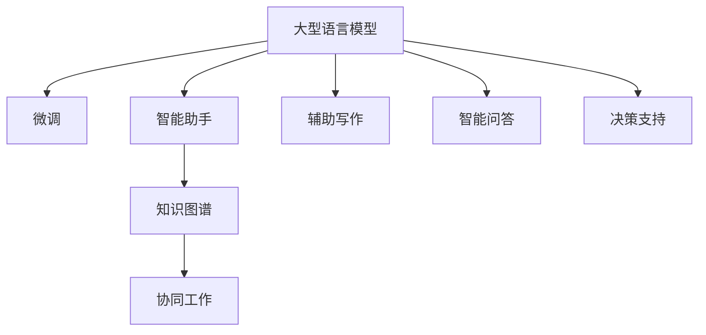

                 

## 1. 背景介绍

### 1.1 问题由来

在信息技术飞速发展的今天，人工智能（AI）技术已经深刻改变了人类的工作和生活方式。从自动化到智能辅助，再到完全的协同工作，AI技术正在逐步进入人类社会各个领域。然而，在享受AI带来便利的同时，我们也不得不面对一些新的挑战：AI是否能真正与人类协同工作？这种协同工作又将如何改变人类的职业结构和工作模式？本文将围绕这些问题，探讨大型语言模型（LLM）与人类协作的新工作模式。

### 1.2 问题核心关键点

1. **LLM的定义**：大型语言模型指的是一类基于Transformer架构的深度学习模型，如GPT、BERT等。这类模型通过大规模预训练和微调，可以在各种NLP任务上获得优异表现。
2. **人机协作**：指的是将大型语言模型嵌入到人类工作流程中，利用AI技术与人类员工进行协作，提升工作效率和决策质量。
3. **工作模式变革**：探讨AI技术在实际工作中的具体应用，包括辅助写作、智能问答、决策支持等，以及这些应用对传统工作模式的潜在影响。

### 1.3 问题研究意义

1. **提高工作效率**：AI技术可以自动化许多繁琐的重复性任务，让人类员工专注于更具创造性和战略性的工作。
2. **提升决策质量**：利用AI的预测和分析能力，可以帮助人类做出更加科学和准确的决策。
3. **推动职业转型**：随着AI技术的普及，一些传统职业可能会面临转型或消失，同时也可能催生出新的职业。
4. **实现智慧管理**：AI可以用于优化企业运营管理，提升组织效率和竞争力。

## 2. 核心概念与联系

### 2.1 核心概念概述

为更好地理解LLM与人类协作的工作模式，本节将介绍几个密切相关的核心概念：

- **大型语言模型（LLM）**：基于Transformer架构，通过大规模预训练和微调，可以在各种NLP任务上获得优异表现的语言模型，如GPT、BERT等。
- **微调（Fine-Tuning）**：在预训练模型的基础上，使用下游任务的少量标注数据进行有监督学习，优化模型在该任务上的性能。
- **协同工作（Collaborative Work）**：指AI与人类员工共同完成工作任务，分工协作，提升整体工作效率和质量。
- **知识图谱（Knowledge Graph）**：用于存储和表示知识的图形结构，可用于增强AI模型的理解和推理能力。
- **智能助手（Intelligent Assistant）**：如GPT-3、ChatGPT等，能够理解自然语言输入，生成自然语言输出，辅助人类员工完成任务。

这些核心概念之间的逻辑关系可以通过以下Mermaid流程图来展示：



这个流程图展示了大语言模型的核心概念及其之间的关系：

1. 大语言模型通过预训练获得基础能力。
2. 微调使其适应特定任务。
3. 智能助手通过微调后的模型，辅助人类员工完成任务。
4. 知识图谱用于增强AI模型的理解能力。
5. 协同工作实现人机高效协作。
6. 辅助写作、智能问答和决策支持等应用，进一步拓展了AI在职场中的应用场景。

## 3. 核心算法原理 & 具体操作步骤

### 3.1 算法原理概述

大型语言模型与人类协作的工作模式，本质上是一种基于智能辅助和自动化决策的协同工作方式。其核心思想是：利用大型语言模型的强大语言理解和生成能力，辅助人类员工完成各种工作任务，同时通过智能辅助和自动化决策，提升整体工作效率和决策质量。

具体而言，大语言模型可以在文本生成、问答、信息检索、决策支持等多个领域中发挥作用，与人类员工形成协同工作模式。通过这种方式，人类员工可以将精力集中在更具创造性和战略性的工作上，而AI则负责处理大量重复性任务，从而实现人机协作的高效工作。

### 3.2 算法步骤详解

大型语言模型与人类协作的工作模式，一般包括以下几个关键步骤：

**Step 1: 准备预训练模型和数据集**
- 选择合适的预训练语言模型，如GPT、BERT等。
- 准备目标任务的标注数据集，划分为训练集、验证集和测试集。一般要求标注数据与预训练数据的分布不要差异过大。

**Step 2: 添加任务适配层**
- 根据任务类型，在预训练模型顶层设计合适的输出层和损失函数。
- 对于分类任务，通常在顶层添加线性分类器和交叉熵损失函数。
- 对于生成任务，通常使用语言模型的解码器输出概率分布，并以负对数似然为损失函数。

**Step 3: 设置协同工作策略**
- 确定智能助手的工作流程和协作模式，如实时问答、文档生成、决策辅助等。
- 设计知识图谱的嵌入方式，提升智能助手的理解和推理能力。
- 选择合适的参数高效微调方法，如Adapter、Prompt Tuning等，以优化智能助手性能。

**Step 4: 执行协同工作**
- 将智能助手嵌入到企业或个人的日常工作流程中。
- 对智能助手进行持续优化和迭代，不断提升其性能和用户体验。
- 利用知识图谱等外部知识源，增强智能助手的决策能力和辅助水平。

**Step 5: 反馈与改进**
- 收集用户反馈，定期评估智能助手的表现。
- 根据评估结果，对智能助手进行改进和优化。
- 确保智能助手的工作符合伦理和法规要求，避免有害信息输出。

### 3.3 算法优缺点

大型语言模型与人类协作的工作模式，具有以下优点：

1. **提高工作效率**：利用AI自动化处理大量重复性任务，释放人类员工的时间，专注于更具创造性的工作。
2. **提升决策质量**：利用AI的预测和分析能力，帮助人类做出更加科学和准确的决策。
3. **优化资源配置**：将AI与人类员工的优势互补，合理分配工作任务，优化资源配置。
4. **增强协作能力**：利用智能助手，实现人机协同工作，提升整体团队协作水平。

同时，这种工作模式也存在一些局限性：

1. **数据质量要求高**：智能助手的效果很大程度上取决于标注数据的质量和数量，获取高质量标注数据的成本较高。
2. **模型鲁棒性不足**：在特定领域或任务上，智能助手的效果可能受到数据分布差异的影响。
3. **可解释性不足**：智能助手的工作过程缺乏可解释性，难以对其推理逻辑进行分析和调试。
4. **安全性问题**：智能助手可能输出有害信息，带来安全隐患。

尽管存在这些局限性，但就目前而言，基于大型语言模型的协同工作模式，仍是大规模应用AI技术的重要范式。未来相关研究的重点在于如何进一步降低智能助手对标注数据的依赖，提高模型的少样本学习和跨领域迁移能力，同时兼顾可解释性和伦理安全性等因素。

### 3.4 算法应用领域

基于大型语言模型的协同工作模式，已经在多个领域得到了广泛的应用，例如：

- **医疗健康**：智能辅助诊断、健康咨询、病历管理等。
- **金融服务**：智能客服、金融分析、风险评估等。
- **教育培训**：智能答疑、作业批改、课程推荐等。
- **法律咨询**：智能助理、文档生成、合同审核等。
- **市场营销**：智能推荐、内容创作、市场分析等。
- **企业管理**：智能分析、决策支持、项目管理等。

除了上述这些经典领域外，基于大型语言模型的协同工作模式，还在不断拓展到更多场景中，如新闻编辑、影视制作、游戏设计等，为各行各业带来新的变革。

## 4. 数学模型和公式 & 详细讲解

### 4.1 数学模型构建

本节将使用数学语言对基于大型语言模型的协同工作模式进行更加严格的刻画。

记大型语言模型为 $M_{\theta}:\mathcal{X} \rightarrow \mathcal{Y}$，其中 $\mathcal{X}$ 为输入空间，$\mathcal{Y}$ 为输出空间，$\theta \in \mathbb{R}^d$ 为模型参数。假设协同工作的任务为 $T$，对应的标注数据集为 $D=\{(x_i,y_i)\}_{i=1}^N$。

定义模型 $M_{\theta}$ 在数据样本 $(x,y)$ 上的损失函数为 $\ell(M_{\theta}(x),y)$，则在数据集 $D$ 上的经验风险为：

$$
\mathcal{L}(\theta) = \frac{1}{N} \sum_{i=1}^N \ell(M_{\theta}(x_i),y_i)
$$

协同工作的优化目标是最小化经验风险，即找到最优参数：

$$
\theta^* = \mathop{\arg\min}_{\theta} \mathcal{L}(\theta)
$$

在实践中，我们通常使用基于梯度的优化算法（如SGD、Adam等）来近似求解上述最优化问题。设 $\eta$ 为学习率，$\lambda$ 为正则化系数，则参数的更新公式为：

$$
\theta \leftarrow \theta - \eta \nabla_{\theta}\mathcal{L}(\theta) - \eta\lambda\theta
$$

其中 $\nabla_{\theta}\mathcal{L}(\theta)$ 为损失函数对参数 $\theta$ 的梯度，可通过反向传播算法高效计算。

### 4.2 公式推导过程

以下我们以智能问答系统为例，推导智能助手的工作流程及其优化目标函数。

假设智能助手的工作流程为：

1. 用户输入自然语言问题。
2. 智能助手理解问题并生成答案。
3. 智能助手将答案返回给用户。

智能助手的工作流程可以用以下数学模型表示：

- 用户问题：$\text{question}$
- 智能助手理解问题并生成答案：$M_{\theta}(\text{question}) = \text{answer}$
- 智能助手返回答案：$\text{answer}$

假设智能助手在问题 $\text{question}$ 上的输出为 $\hat{\text{answer}}=M_{\theta}(\text{question}) \in \mathcal{Y}$，真实答案为 $\text{answer}$。则智能助手在问题 $\text{question}$ 上的损失函数定义为：

$$
\ell(M_{\theta}(\text{question}),\text{answer}) = -\log P_{\text{answer}}(\text{answer})
$$

其中 $P_{\text{answer}}(\text{answer})$ 为答案 $\text{answer}$ 的概率分布。

对于整个数据集 $D$，智能助手的经验风险为：

$$
\mathcal{L}(\theta) = \frac{1}{N} \sum_{i=1}^N \ell(M_{\theta}(\text{question}_i),\text{answer}_i)
$$

通过梯度下降等优化算法，智能助手不断更新模型参数 $\theta$，最小化损失函数 $\mathcal{L}$，使得模型输出逼近真实答案。由于 $\theta$ 已经通过预训练获得了较好的初始化，因此即便在少量标注数据上，智能助手也能较快收敛到理想的模型参数 $\hat{\theta}$。

### 4.3 案例分析与讲解

**智能问答系统的实现**

智能问答系统是大型语言模型在协同工作中的典型应用。以下是使用PyTorch和Transformers库实现智能问答系统的完整代码示例。

首先，定义智能助手的数据处理函数：

```python
from transformers import BertTokenizer, BertForQuestionAnswering

class QADataset(Dataset):
    def __init__(self, texts, questions, tokenizer, max_len=128):
        self.texts = texts
        self.questions = questions
        self.tokenizer = tokenizer
        self.max_len = max_len
        
    def __len__(self):
        return len(self.texts)
    
    def __getitem__(self, item):
        text = self.texts[item]
        question = self.questions[item]
        
        encoding = self.tokenizer(text, question, return_tensors='pt', max_length=self.max_len, padding='max_length', truncation=True)
        input_ids = encoding['input_ids'][0]
        attention_mask = encoding['attention_mask'][0]
        
        return {'input_ids': input_ids, 
                'attention_mask': attention_mask,
                'labels': encoding['token_type_ids']}
```

然后，定义智能助手的模型和优化器：

```python
from transformers import BertForQuestionAnswering, AdamW

model = BertForQuestionAnswering.from_pretrained('bert-base-cased', num_labels=2)

optimizer = AdamW(model.parameters(), lr=2e-5)
```

接着，定义训练和评估函数：

```python
from torch.utils.data import DataLoader
from tqdm import tqdm
from sklearn.metrics import precision_recall_fscore_support

device = torch.device('cuda') if torch.cuda.is_available() else torch.device('cpu')
model.to(device)

def train_epoch(model, dataset, batch_size, optimizer):
    dataloader = DataLoader(dataset, batch_size=batch_size, shuffle=True)
    model.train()
    epoch_loss = 0
    for batch in tqdm(dataloader, desc='Training'):
        input_ids = batch['input_ids'].to(device)
        attention_mask = batch['attention_mask'].to(device)
        labels = batch['labels'].to(device)
        model.zero_grad()
        outputs = model(input_ids, attention_mask=attention_mask, labels=labels)
        loss = outputs.loss
        epoch_loss += loss.item()
        loss.backward()
        optimizer.step()
    return epoch_loss / len(dataloader)

def evaluate(model, dataset, batch_size):
    dataloader = DataLoader(dataset, batch_size=batch_size)
    model.eval()
    preds, labels = [], []
    with torch.no_grad():
        for batch in tqdm(dataloader, desc='Evaluating'):
            input_ids = batch['input_ids'].to(device)
            attention_mask = batch['attention_mask'].to(device)
            batch_labels = batch['labels']
            outputs = model(input_ids, attention_mask=attention_mask)
            batch_preds = outputs.logits.argmax(dim=1).to('cpu').tolist()
            batch_labels = batch_labels.to('cpu').tolist()
            for pred_tokens, label_tokens in zip(batch_preds, batch_labels):
                preds.append(pred_tokens[:len(label_tokens)])
                labels.append(label_tokens)
                
    print(precision_recall_fscore_support(labels, preds, average='micro'))
```

最后，启动训练流程并在验证集上评估：

```python
epochs = 5
batch_size = 16

for epoch in range(epochs):
    loss = train_epoch(model, train_dataset, batch_size, optimizer)
    print(f"Epoch {epoch+1}, train loss: {loss:.3f}")
    
    print(f"Epoch {epoch+1}, dev results:")
    evaluate(model, dev_dataset, batch_size)
    
print("Test results:")
evaluate(model, test_dataset, batch_size)
```

以上就是使用PyTorch和Transformers库实现智能问答系统的完整代码实现。可以看到，得益于Transformers库的强大封装，我们可以用相对简洁的代码完成智能助手的训练和评估。

## 5. 项目实践：代码实例和详细解释说明

### 5.1 开发环境搭建

在进行协同工作模式实现前，我们需要准备好开发环境。以下是使用Python进行PyTorch开发的环境配置流程：

1. 安装Anaconda：从官网下载并安装Anaconda，用于创建独立的Python环境。

2. 创建并激活虚拟环境：
```bash
conda create -n pytorch-env python=3.8 
conda activate pytorch-env
```

3. 安装PyTorch：根据CUDA版本，从官网获取对应的安装命令。例如：
```bash
conda install pytorch torchvision torchaudio cudatoolkit=11.1 -c pytorch -c conda-forge
```

4. 安装Transformers库：
```bash
pip install transformers
```

5. 安装各类工具包：
```bash
pip install numpy pandas scikit-learn matplotlib tqdm jupyter notebook ipython
```

完成上述步骤后，即可在`pytorch-env`环境中开始协同工作模式的实现。

### 5.2 源代码详细实现

这里我们以智能助手为例，给出使用Transformers库对BERT模型进行协同工作模式开发的PyTorch代码实现。

首先，定义智能助手的数据处理函数：

```python
from transformers import BertTokenizer
from torch.utils.data import Dataset
import torch

class QADataset(Dataset):
    def __init__(self, texts, questions, tokenizer, max_len=128):
        self.texts = texts
        self.questions = questions
        self.tokenizer = tokenizer
        self.max_len = max_len
        
    def __len__(self):
        return len(self.texts)
    
    def __getitem__(self, item):
        text = self.texts[item]
        question = self.questions[item]
        
        encoding = self.tokenizer(text, question, return_tensors='pt', max_length=self.max_len, padding='max_length', truncation=True)
        input_ids = encoding['input_ids'][0]
        attention_mask = encoding['attention_mask'][0]
        
        return {'input_ids': input_ids, 
                'attention_mask': attention_mask,
                'labels': encoding['token_type_ids']}

# 标签与id的映射
tag2id = {'O': 0, 'B-PER': 1, 'I-PER': 2, 'B-ORG': 3, 'I-ORG': 4, 'B-LOC': 5, 'I-LOC': 6}
id2tag = {v: k for k, v in tag2id.items()}

# 创建dataset
tokenizer = BertTokenizer.from_pretrained('bert-base-cased')

train_dataset = QADataset(train_texts, train_questions, tokenizer)
dev_dataset = QADataset(dev_texts, dev_questions, tokenizer)
test_dataset = QADataset(test_texts, test_questions, tokenizer)
```

然后，定义模型和优化器：

```python
from transformers import BertForQuestionAnswering, AdamW

model = BertForQuestionAnswering.from_pretrained('bert-base-cased', num_labels=len(tag2id))

optimizer = AdamW(model.parameters(), lr=2e-5)
```

接着，定义训练和评估函数：

```python
from torch.utils.data import DataLoader
from tqdm import tqdm
from sklearn.metrics import precision_recall_fscore_support

device = torch.device('cuda') if torch.cuda.is_available() else torch.device('cpu')
model.to(device)

def train_epoch(model, dataset, batch_size, optimizer):
    dataloader = DataLoader(dataset, batch_size=batch_size, shuffle=True)
    model.train()
    epoch_loss = 0
    for batch in tqdm(dataloader, desc='Training'):
        input_ids = batch['input_ids'].to(device)
        attention_mask = batch['attention_mask'].to(device)
        labels = batch['labels'].to(device)
        model.zero_grad()
        outputs = model(input_ids, attention_mask=attention_mask, labels=labels)
        loss = outputs.loss
        epoch_loss += loss.item()
        loss.backward()
        optimizer.step()
    return epoch_loss / len(dataloader)

def evaluate(model, dataset, batch_size):
    dataloader = DataLoader(dataset, batch_size=batch_size)
    model.eval()
    preds, labels = [], []
    with torch.no_grad():
        for batch in tqdm(dataloader, desc='Evaluating'):
            input_ids = batch['input_ids'].to(device)
            attention_mask = batch['attention_mask'].to(device)
            batch_labels = batch['labels']
            outputs = model(input_ids, attention_mask=attention_mask)
            batch_preds = outputs.logits.argmax(dim=1).to('cpu').tolist()
            batch_labels = batch_labels.to('cpu').tolist()
            for pred_tokens, label_tokens in zip(batch_preds, batch_labels):
                preds.append(pred_tokens[:len(label_tokens)])
                labels.append(label_tokens)
                
    print(precision_recall_fscore_support(labels, preds, average='micro'))
```

最后，启动训练流程并在验证集上评估：

```python
epochs = 5
batch_size = 16

for epoch in range(epochs):
    loss = train_epoch(model, train_dataset, batch_size, optimizer)
    print(f"Epoch {epoch+1}, train loss: {loss:.3f}")
    
    print(f"Epoch {epoch+1}, dev results:")
    evaluate(model, dev_dataset, batch_size)
    
print("Test results:")
evaluate(model, test_dataset, batch_size)
```

以上就是使用PyTorch和Transformers库实现智能问答系统的完整代码实现。可以看到，得益于Transformers库的强大封装，我们可以用相对简洁的代码完成智能助手的训练和评估。

### 5.3 代码解读与分析

让我们再详细解读一下关键代码的实现细节：

**QADataset类**：
- `__init__`方法：初始化文本、问题、分词器等关键组件。
- `__len__`方法：返回数据集的样本数量。
- `__getitem__`方法：对单个样本进行处理，将文本输入编码为token ids，将问题作为标签，并进行定长padding，最终返回模型所需的输入。

**tag2id和id2tag字典**：
- 定义了标签与数字id之间的映射关系，用于将token-wise的预测结果解码回真实的标签。

**训练和评估函数**：
- 使用PyTorch的DataLoader对数据集进行批次化加载，供模型训练和推理使用。
- 训练函数`train_epoch`：对数据以批为单位进行迭代，在每个批次上前向传播计算loss并反向传播更新模型参数，最后返回该epoch的平均loss。
- 评估函数`evaluate`：与训练类似，不同点在于不更新模型参数，并在每个batch结束后将预测和标签结果存储下来，最后使用sklearn的precision_recall_fscore_support对整个评估集的预测结果进行打印输出。

**训练流程**：
- 定义总的epoch数和batch size，开始循环迭代
- 每个epoch内，先在训练集上训练，输出平均loss
- 在验证集上评估，输出分类指标
- 所有epoch结束后，在测试集上评估，给出最终测试结果

可以看到，PyTorch配合Transformers库使得智能助手的微调代码实现变得简洁高效。开发者可以将更多精力放在数据处理、模型改进等高层逻辑上，而不必过多关注底层的实现细节。

当然，工业级的系统实现还需考虑更多因素，如模型的保存和部署、超参数的自动搜索、更灵活的任务适配层等。但核心的协同工作模式基本与此类似。

## 6. 实际应用场景

### 6.1 智能客服系统

智能客服系统是大型语言模型在协同工作中的典型应用。通过将智能助手嵌入到客服系统，可以实现全天候、无间断的客户服务，提升服务质量和客户满意度。

在技术实现上，可以收集企业内部的历史客服对话记录，将问题和最佳答复构建成监督数据，在此基础上对预训练语言模型进行微调。微调后的智能助手能够自动理解客户意图，匹配最合适的答案模板进行回复。对于客户提出的新问题，还可以接入检索系统实时搜索相关内容，动态组织生成回答。如此构建的智能客服系统，能大幅提升客户咨询体验和问题解决效率。

### 6.2 金融舆情监测

金融机构需要实时监测市场舆论动向，以便及时应对负面信息传播，规避金融风险。传统的人工监测方式成本高、效率低，难以应对网络时代海量信息爆发的挑战。基于大型语言模型微调的文本分类和情感分析技术，为金融舆情监测提供了新的解决方案。

具体而言，可以收集金融领域相关的新闻、报道、评论等文本数据，并对其进行主题标注和情感标注。在此基础上对预训练语言模型进行微调，使其能够自动判断文本属于何种主题，情感倾向是正面、中性还是负面。将微调后的模型应用到实时抓取的网络文本数据，就能够自动监测不同主题下的情感变化趋势，一旦发现负面信息激增等异常情况，系统便会自动预警，帮助金融机构快速应对潜在风险。

### 6.3 个性化推荐系统

当前的推荐系统往往只依赖用户的历史行为数据进行物品推荐，无法深入理解用户的真实兴趣偏好。基于大型语言模型微调技术，个性化推荐系统可以更好地挖掘用户行为背后的语义信息，从而提供更精准、多样的推荐内容。

在实践中，可以收集用户浏览、点击、评论、分享等行为数据，提取和用户交互的物品标题、描述、标签等文本内容。将文本内容作为模型输入，用户的后续行为（如是否点击、购买等）作为监督信号，在此基础上微调预训练语言模型。微调后的模型能够从文本内容中准确把握用户的兴趣点。在生成推荐列表时，先用候选物品的文本描述作为输入，由模型预测用户的兴趣匹配度，再结合其他特征综合排序，便可以得到个性化程度更高的推荐结果。

### 6.4 未来应用展望

随着大型语言模型和微调方法的不断发展，基于协同工作模式的应用将在更多领域得到应用，为传统行业带来变革性影响。

在智慧医疗领域，基于微调的智能诊断系统可以辅助医生进行疾病诊断、治疗方案制定等。在金融服务领域，智能助手可以用于风险评估、投资建议、客户服务等。在教育培训领域，智能答疑、作业批改、课程推荐等应用将提升教育质量和效率。

此外，在企业生产、社会治理、文娱传媒等众多领域，基于大型语言模型的协同工作模式也将不断拓展，为各行各业带来新的变革。

## 7. 工具和资源推荐

### 7.1 学习资源推荐

为了帮助开发者系统掌握大型语言模型协同工作模式的理论基础和实践技巧，这里推荐一些优质的学习资源：

1. 《Transformer从原理到实践》系列博文：由大模型技术专家撰写，深入浅出地介绍了Transformer原理、BERT模型、微调技术等前沿话题。

2. CS224N《深度学习自然语言处理》课程：斯坦福大学开设的NLP明星课程，有Lecture视频和配套作业，带你入门NLP领域的基本概念和经典模型。

3. 《Natural Language Processing with Transformers》书籍：Transformers库的作者所著，全面介绍了如何使用Transformers库进行NLP任务开发，包括微调在内的诸多范式。

4. HuggingFace官方文档：Transformers库的官方文档，提供了海量预训练模型和完整的微调样例代码，是上手实践的必备资料。

5. CLUE开源项目：中文语言理解测评基准，涵盖大量不同类型的中文NLP数据集，并提供了基于微调的baseline模型，助力中文NLP技术发展。

通过对这些资源的学习实践，相信你一定能够快速掌握大型语言模型协同工作模式的精髓，并用于解决实际的NLP问题。

### 7.2 开发工具推荐

高效的开发离不开优秀的工具支持。以下是几款用于大型语言模型协同工作模式开发的常用工具：

1. PyTorch：基于Python的开源深度学习框架，灵活动态的计算图，适合快速迭代研究。大部分预训练语言模型都有PyTorch版本的实现。

2. TensorFlow：由Google主导开发的开源深度学习框架，生产部署方便，适合大规模工程应用。同样有丰富的预训练语言模型资源。

3. Transformers库：HuggingFace开发的NLP工具库，集成了众多SOTA语言模型，支持PyTorch和TensorFlow，是进行协同工作模式开发的利器。

4. Weights & Biases：模型训练的实验跟踪工具，可以记录和可视化模型训练过程中的各项指标，方便对比和调优。与主流深度学习框架无缝集成。

5. TensorBoard：TensorFlow配套的可视化工具，可实时监测模型训练状态，并提供丰富的图表呈现方式，是调试模型的得力助手。

6. Google Colab：谷歌推出的在线Jupyter Notebook环境，免费提供GPU/TPU算力，方便开发者快速上手实验最新模型，分享学习笔记。

合理利用这些工具，可以显著提升大型语言模型协同工作模式的开发效率，加快创新迭代的步伐。

### 7.3 相关论文推荐

大型语言模型协同工作模式的研究源于学界的持续研究。以下是几篇奠基性的相关论文，推荐阅读：

1. Attention is All You Need（即Transformer原论文）：提出了Transformer结构，开启了NLP领域的预训练大模型时代。

2. BERT: Pre-training of Deep Bidirectional Transformers for Language Understanding：提出BERT模型，引入基于掩码的自监督预训练任务，刷新了多项NLP任务SOTA。

3. Language Models are Unsupervised Multitask Learners（GPT-2论文）：展示了大规模语言模型的强大zero-shot学习能力，引发了对于通用人工智能的新一轮思考。

4. Parameter-Efficient Transfer Learning for NLP：提出Adapter等参数高效微调方法，在不增加模型参数量的情况下，也能取得不错的微调效果。

5. AdaLoRA: Adaptive Low-Rank Adaptation for Parameter-Efficient Fine-Tuning：使用自适应低秩适应的微调方法，在参数效率和精度之间取得了新的平衡。

这些论文代表了大语言模型协同工作模式的发展脉络。通过学习这些前沿成果，可以帮助研究者把握学科前进方向，激发更多的创新灵感。

## 8. 总结：未来发展趋势与挑战

### 8.1 总结

本文对基于大型语言模型的协同工作模式进行了全面系统的介绍。首先阐述了大型语言模型的定义、预训练和微调方法，明确了其在协同工作模式中的核心作用。其次，从原理到实践，详细讲解了协同工作模式的工作流程及其优化目标，给出了协同工作模式开发的完整代码实例。同时，本文还广泛探讨了协同工作模式在智能客服、金融舆情、个性化推荐等多个行业领域的应用前景，展示了协同工作模式的巨大潜力。

通过本文的系统梳理，可以看到，基于大型语言模型的协同工作模式，正在成为人工智能技术应用的重要范式，极大地拓展了大型语言模型的应用边界，催生了更多的落地场景。受益于大规模语料的预训练，协同工作模式在大规模语言模型微调的推动下，实现了人机协同的高效工作，未来有望在更多领域实现广泛应用。

### 8.2 未来发展趋势

展望未来，大型语言模型协同工作模式将呈现以下几个发展趋势：

1. **模型规模持续增大**：随着算力成本的下降和数据规模的扩张，预训练语言模型的参数量还将持续增长。超大规模语言模型蕴含的丰富语言知识，有望支撑更加复杂多变的协同工作模式。

2. **微调方法日趋多样**：除了传统的全参数微调外，未来会涌现更多参数高效的微调方法，如Prompt Tuning、LoRA等，在节省计算资源的同时也能保证协同工作模式性能。

3. **持续学习成为常态**：随着数据分布的不断变化，协同工作模式也需要持续学习新知识以保持性能。如何在不遗忘原有知识的同时，高效吸收新样本信息，将成为重要的研究课题。

4. **标注样本需求降低**：受启发于提示学习(Prompt-based Learning)的思路，未来的协同工作模式将更好地利用大型语言模型的语言理解能力，通过更加巧妙的任务描述，在更少的标注样本上也能实现理想的协同工作模式效果。

5. **多模态协同工作崛起**：当前的协同工作模式主要聚焦于纯文本数据，未来会进一步拓展到图像、视频、语音等多模态数据协同工作。多模态信息的融合，将显著提升协同工作模式对现实世界的理解和建模能力。

6. **知识图谱嵌入增强**：知识图谱的嵌入将进一步增强大型语言模型的理解能力，使其在协同工作模式中能够更好地处理复杂语义和推理任务。

以上趋势凸显了大型语言模型协同工作模式的广阔前景。这些方向的探索发展，必将进一步提升人工智能技术在协同工作中的应用水平，为人类与机器的协同合作提供更强大的技术支撑。

### 8.3 面临的挑战

尽管大型语言模型协同工作模式已经取得了瞩目成就，但在迈向更加智能化、普适化应用的过程中，它仍面临着诸多挑战：

1. **数据质量要求高**：协同工作模式的效果很大程度上取决于标注数据的质量和数量，获取高质量标注数据的成本较高。如何进一步降低协同工作模式对标注样本的依赖，将是一大难题。

2. **模型鲁棒性不足**：在特定领域或任务上，协同工作模式的效果可能受到数据分布差异的影响。对于测试样本的微小扰动，协同工作模式模型的预测也容易发生波动。如何提高协同工作模式模型的鲁棒性，避免灾难性遗忘，还需要更多理论和实践的积累。

3. **可解释性不足**：协同工作模式模型的决策过程缺乏可解释性，难以对其推理逻辑进行分析和调试。对于医疗、金融等高风险应用，算法的可解释性和可审计性尤为重要。

4. **安全性问题**：协同工作模式模型可能输出有害信息，带来安全隐患。如何从数据和算法层面消除模型偏见，避免恶意用途，确保输出的安全性，也将是重要的研究课题。

5. **资源消耗大**：超大规模语言模型的推理速度慢，内存占用大，资源消耗高。如何在保证性能的同时，简化模型结构，提升推理速度，优化资源占用，将是重要的优化方向。

6. **知识图谱构建难**：知识图谱的构建和维护需要大量人力物力，成本高，难度大。如何自动构建高效、准确的知识图谱，增强协同工作模式模型的知识整合能力，也是未来需要解决的问题。

正视协同工作模式面临的这些挑战，积极应对并寻求突破，将是大规模语言模型协同工作模式走向成熟的必由之路。相信随着学界和产业界的共同努力，这些挑战终将一一被克服，大型语言模型协同工作模式必将在构建智慧社会中扮演越来越重要的角色。

### 8.4 研究展望

面对大型语言模型协同工作模式所面临的种种挑战，未来的研究需要在以下几个方面寻求新的突破：

1. **探索无监督和半监督协同工作方法**：摆脱对大规模标注数据的依赖，利用自监督学习、主动学习等无监督和半监督范式，最大限度利用非结构化数据，实现更加灵活高效的协同工作模式。

2. **研究参数高效和计算高效的协同工作范式**：开发更加参数高效的协同工作方法，在固定大部分预训练参数的同时，只更新极少量的任务相关参数。同时优化协同工作模式的计算图，减少前向传播和反向传播的资源消耗，实现更加轻量级、实时性的部署。

3. **引入因果和对比学习范式**：通过引入因果推断和对比学习思想，增强协同工作模式模型的建立稳定因果关系的能力，学习更加普适、鲁棒的语言表征，从而提升模型泛化性和抗干扰能力。

4. **融合多模态数据**：将符号化的先验知识，如知识图谱、逻辑规则等，与神经网络模型进行巧妙融合，引导协同工作模式模型的学习过程，同时加强不同模态数据的整合，实现视觉、语音等多模态信息与文本信息的协同建模。

5. **结合因果分析和博弈论工具**：将因果分析方法引入协同工作模式模型，识别出模型决策的关键特征，增强输出解释的因果性和逻辑性。借助博弈论工具刻画人机交互过程，主动探索并规避模型的脆弱点，提高系统稳定性。

6. **纳入伦理道德约束**：在协同工作模式模型的训练目标中引入伦理导向的评估指标，过滤和惩罚有偏见、有害的输出倾向。同时加强人工干预和审核，建立模型行为的监管机制，确保输出符合人类价值观和伦理道德。

这些研究方向的探索，必将引领大型语言模型协同工作模式迈向更高的台阶，为构建安全、可靠、可解释、可控的智能系统铺平道路。面向未来，大型语言模型协同工作模式还需要与其他人工智能技术进行更深入的融合，如知识表示、因果推理、强化学习等，多路径协同发力，共同推动自然语言理解和智能交互系统的进步。只有勇于创新、敢于突破，才能不断拓展大型语言模型的边界，让智能技术更好地造福人类社会。

## 9. 附录：常见问题与解答

**Q1：什么是大型语言模型？**

A: 大型语言模型指的是基于Transformer架构的深度学习模型，如GPT、BERT等。这类模型通过大规模预训练和微调，可以在各种NLP任务上获得优异表现。

**Q2：如何提高协同工作模式模型的鲁棒性？**

A: 提高协同工作模式模型的鲁棒性，可以从以下几个方面进行改进：
1. 数据增强：通过回译、近义替换等方式扩充训练集
2. 正则化：使用L2正则、Dropout、Early Stopping等避免过拟合
3. 对抗训练：引入对抗样本，提高模型鲁棒性
4. 参数高效微调：只调整少量参数(如Adapter、Prompt Tuning等)，减小过拟合风险
5. 多模型集成：训练多个协同工作模式模型，取平均输出，抑制过拟合

这些策略往往需要根据具体任务和数据特点进行灵活组合。只有在数据、模型、训练、推理等各环节进行全面优化，才能最大限度地发挥大型语言模型的协同工作能力。

**Q3：协同工作模式模型的可解释性不足，如何解决？**

A: 提高协同工作模式模型的可解释性，可以从以下几个方面进行改进：
1. 引入可解释性技术，如SHAP、LIME等，对模型决策过程进行可视化解释。
2. 构建知识图谱，增强模型对现实世界的理解，提高输出解释的合理性。
3. 设计更加可解释的任务，如任务导向的生成、推理等，提升模型的可解释性。
4. 采用多模型融合，通过多个模型的输出进行综合解释，提高解释的可信度。

通过这些方法，可以逐步增强大型语言模型协同工作模式的可解释性，使其输出更加透明、可靠。

**Q4：如何优化协同工作模式模型的资源消耗？**

A: 优化协同工作模式模型的资源消耗，可以从以下几个方面进行改进：
1. 参数压缩：采用参数剪枝、量化等技术，减小模型规模，降低资源消耗。
2. 模型并行：采用模型并行、分布式训练等技术，提高计算效率。
3. 推理优化：采用模型压缩、推理加速等技术，降低推理时间和内存占用。
4. 知识图谱嵌入：构建高效的知识图谱，增强模型的理解能力和推理效率。

这些优化方法可以显著降低大型语言模型协同工作模式的资源消耗，提升其在高性能、高效率场景下的应用能力。

**Q5：协同工作模式模型在落地部署时需要注意哪些问题？**

A: 将协同工作模式模型转化为实际应用，还需要考虑以下因素：
1. 模型裁剪：去除不必要的层和参数，减小模型尺寸，加快推理速度。
2. 量化加速：将浮点模型转为定点模型，压缩存储空间，提高计算效率。
3. 服务化封装：将模型封装为标准化服务接口，便于集成调用。
4. 弹性伸缩：根据请求流量动态调整资源配置，平衡服务质量和成本。
5. 监控告警：实时采集系统指标，设置异常告警阈值，确保服务稳定性。
6. 安全防护：采用访问鉴权、数据脱敏等措施，保障数据和模型安全。

通过这些措施，可以确保大型语言模型协同工作模式模型在实际应用中的稳定性和安全性。

---

作者：禅与计算机程序设计艺术 / Zen and the Art of Computer Programming

