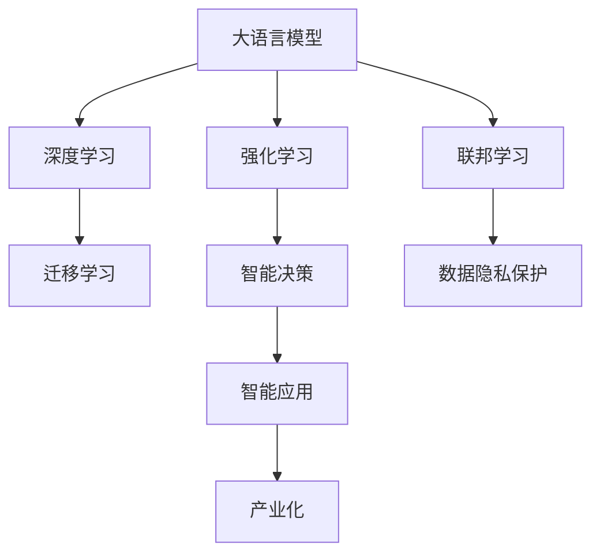

                 

# LLM与传统AI的融合：新时代的智能革命

> 关键词：大语言模型(LLM), 传统AI, 深度学习, 强化学习, 联邦学习, 迁移学习, 模型融合, AI伦理

## 1. 背景介绍

### 1.1 问题由来
人工智能（AI）正迅速改变我们的世界，从自动化生产到智能家居，从医疗诊断到自动驾驶，AI技术正渗透到生活的方方面面。然而，尽管AI技术在众多领域取得了显著成果，但传统的符号主义AI与连接主义AI之间依然存在明显的鸿沟。符号主义AI依赖于人类专家设计好的符号和规则，而连接主义AI依赖于通过大量数据训练得到的神经网络模型。

大语言模型（LLM）的崛起，正在逐步弥合这一鸿沟。LLM是近年来通过自监督学习在大规模无标签文本数据上训练得到的深度神经网络模型。它不仅能理解自然语言，还能进行复杂的逻辑推理和生成。LLM的出现，让AI从“不会思考”变得更加“能思考”，实现了从“弱智能”向“强智能”的跨越。

在LLM的基础上，AI技术正迎来新一轮的融合，传统AI技术与现代深度学习、强化学习、联邦学习等前沿技术结合，推动了智能革命的爆发。本文将深入探讨LLM与传统AI技术的融合，分析其应用场景及未来趋势，以期为AI技术的发展和应用提供有益的指导。

### 1.2 问题核心关键点
LLM与传统AI的融合，主要涉及以下几个关键点：

- 深度学习与连接主义的结合：如何利用深度学习的强大建模能力，与传统的符号推理、知识表示等方法结合，形成更全面、更鲁棒的智能系统。
- 强化学习与行为优化的结合：如何将强化学习应用于智能系统行为优化，如自动驾驶、智能游戏等，实现复杂环境下的自主决策。
- 联邦学习与隐私保护的结合：如何在分布式数据环境中，通过联邦学习技术，保护数据隐私的同时实现模型的共享与协作。
- 迁移学习与知识泛化的结合：如何利用迁移学习技术，将已有知识迁移到新任务上，提高模型在新场景下的泛化能力。

这些关键点涉及AI技术的多个领域，从基础理论到实际应用，全面展示了LLM与传统AI技术的融合趋势。

### 1.3 问题研究意义
LLM与传统AI技术的融合，将推动AI技术的跨越式发展，带来以下几个方面的显著意义：

- **跨学科创新**：将深度学习与符号推理、知识表示等方法结合，催生更多跨学科的创新应用。
- **复杂环境下的自主决策**：利用强化学习优化智能系统行为，提升在复杂环境下的自主决策能力。
- **数据隐私保护**：通过联邦学习技术，在保护用户隐私的前提下，实现模型的分布式训练与协作。
- **知识迁移与泛化**：利用迁移学习技术，提升模型在各种新场景下的泛化能力，降低在新任务上的训练成本。
- **应用场景多样化**：LLM与传统AI的融合，将催生更多智能应用场景，如自动驾驶、智能客服、智能游戏等，推动AI技术的产业化进程。

## 2. 核心概念与联系

### 2.1 核心概念概述

为了更好地理解LLM与传统AI的融合，本节将介绍几个核心概念：

- 大语言模型(LLM)：以自回归(如GPT)或自编码(如BERT)模型为代表的大规模预训练语言模型。通过在大规模无标签文本数据上进行预训练，学习通用的语言知识，具备强大的语言理解和生成能力。

- 深度学习：基于神经网络的学习范式，通过反向传播算法不断调整权重，使得模型能够对复杂非线性关系进行建模。深度学习已经成为当前AI技术的主流。

- 强化学习(RL)：通过智能体与环境的交互，最大化累计奖励的学习范式。强化学习在自动驾驶、智能游戏等场景中具有重要应用。

- 联邦学习(Federated Learning, FL)：分布式计算环境下的机器学习技术，每个参与方只本地更新模型参数，不共享原始数据，保护数据隐私的同时实现模型共享与协作。

- 迁移学习(Transfer Learning)：将一个领域学习到的知识，迁移到另一个不同但相关的领域的学习范式。通过迁移学习，可以显著减少新任务上的训练时间和资源消耗。

这些核心概念之间的逻辑关系可以通过以下Mermaid流程图来展示：



这个流程图展示了大语言模型与其他核心概念的关系：

1. LLM通过深度学习实现预训练，具备强大的语言理解能力。
2. LLM与强化学习结合，提升在复杂环境下的自主决策能力。
3. LLM通过联邦学习实现分布式数据环境下的模型共享与协作，保护数据隐私。
4. LLM利用迁移学习技术，在新任务上快速泛化知识，降低训练成本。
5. LLM在智能决策和应用场景中得到广泛应用，推动产业化进程。

## 3. 核心算法原理 & 具体操作步骤
### 3.1 算法原理概述

LLM与传统AI技术的融合，主要通过深度学习、强化学习、联邦学习等前沿技术，实现模型的高效融合与优化。

- **深度学习**：通过神经网络模型，对复杂非线性关系进行建模。深度学习在大规模数据上训练得到的模型，可以用于各种复杂的AI任务。
- **强化学习**：通过智能体与环境的交互，优化决策策略，提升在复杂环境下的自主决策能力。强化学习常用于自动驾驶、智能游戏等场景。
- **联邦学习**：在分布式数据环境中，通过本地更新模型参数，实现模型共享与协作，保护数据隐私。

这些技术可以相互结合，形成更强大的智能系统。例如，在大规模预训练LLM的基础上，利用强化学习优化决策策略，提升系统在复杂环境下的适应性和自主性。同时，通过联邦学习技术，在保护数据隐私的前提下，实现模型的分布式训练与协作。

### 3.2 算法步骤详解

LLM与传统AI技术的融合，涉及多个技术环节，每个环节都需要精心设计。以下是详细的算法步骤：

**Step 1: 构建多模态数据源**

- 收集和整合多源数据，如文本数据、图像数据、语音数据等，构建多模态数据源。
- 对数据进行清洗和标注，确保数据的质量和多样性。
- 将多模态数据转化为统一的格式，便于后续处理和融合。

**Step 2: 预训练大语言模型**

- 利用大规模无标签文本数据，训练通用语言模型。
- 选择合适的自回归或自编码模型，如GPT、BERT等。
- 使用自监督学习任务，如语言建模、掩码预测等，训练模型。
- 对模型进行微调，适应特定任务的需求。

**Step 3: 融合深度学习与强化学习**

- 将预训练模型作为初始化参数，构建多模态融合模型。
- 利用深度学习模型，提取多源数据特征，进行特征融合。
- 引入强化学习技术，优化决策策略，提升系统自主性。
- 设计合适的奖励函数，指导智能体的行为优化。

**Step 4: 应用联邦学习**

- 在分布式数据环境中，设计联邦学习流程。
- 每个参与方本地更新模型参数，确保数据隐私。
- 通过协调器协调各参与方的模型更新，实现模型共享与协作。
- 定期更新全局模型，确保模型性能。

**Step 5: 评估与优化**

- 在多模态融合模型上进行测试，评估模型性能。
- 利用迁移学习技术，在新任务上快速泛化知识。
- 根据评估结果，调整模型参数和策略，优化模型性能。
- 持续收集新数据，迭代模型训练，提升模型适应性。

### 3.3 算法优缺点

LLM与传统AI技术的融合，具有以下优点：

- **高效建模能力**：深度学习模型具有强大的建模能力，可以处理复杂非线性关系。
- **智能决策能力**：强化学习可以优化决策策略，提升系统在复杂环境下的自主决策能力。
- **数据隐私保护**：联邦学习技术可以在保护数据隐私的前提下，实现模型的分布式训练与协作。
- **泛化能力强**：迁移学习技术可以加速新任务上的模型训练，提升模型泛化能力。

同时，该融合方法也存在以下缺点：

- **计算资源需求高**：深度学习模型和强化学习模型都需要大量计算资源，训练和推理成本较高。
- **模型复杂度增加**：多模态融合模型增加了模型复杂度，可能增加推理延迟和存储需求。
- **融合技术难度高**：深度学习与强化学习、联邦学习等技术的融合，需要高水平的技术积累和工程实践。
- **可解释性不足**：多模态融合模型通常具有较高的复杂度，难以进行合理的解释和调试。

尽管存在这些局限性，但就目前而言，深度学习与传统AI技术的融合仍然是大势所趋。未来相关研究的重点在于如何进一步降低计算资源需求，提高模型可解释性，促进更多前沿技术的结合，从而实现更高效、更可靠、更智能的AI应用。

### 3.4 算法应用领域

LLM与传统AI技术的融合，在多个领域中得到了广泛应用，例如：

- 自动驾驶：利用深度学习模型提取图像特征，通过强化学习优化决策策略，实现自主驾驶。
- 智能客服：结合深度学习与自然语言处理技术，提升客户服务质量和效率。
- 医疗诊断：利用深度学习模型提取医学影像特征，结合强化学习优化诊疗方案。
- 智能游戏：通过多模态融合技术，实现游戏智能体的复杂决策和交互。
- 智能制造：结合深度学习和强化学习技术，优化生产过程，提升生产效率。

这些应用场景展示了LLM与传统AI技术融合的巨大潜力，推动了AI技术在多个领域的应用和产业化进程。

## 4. 数学模型和公式 & 详细讲解  
### 4.1 数学模型构建

本节将使用数学语言对LLM与传统AI技术融合的数学模型进行更加严格的刻画。

记通用语言模型为 $M_{\theta}:\mathcal{X} \rightarrow \mathcal{Y}$，其中 $\mathcal{X}$ 为输入空间，$\mathcal{Y}$ 为输出空间，$\theta \in \mathbb{R}^d$ 为模型参数。假设多模态数据集为 $D=\{(x_i,y_i)\}_{i=1}^N, x_i \in \mathcal{X}, y_i \in \mathcal{Y}$。

定义模型 $M_{\theta}$ 在数据样本 $(x,y)$ 上的损失函数为 $\ell(M_{\theta}(x),y)$，则在数据集 $D$ 上的经验风险为：

$$
\mathcal{L}(\theta) = \frac{1}{N} \sum_{i=1}^N \ell(M_{\theta}(x_i),y_i)
$$

微调的优化目标是最小化经验风险，即找到最优参数：

$$
\theta^* = \mathop{\arg\min}_{\theta} \mathcal{L}(\theta)
$$

在实践中，我们通常使用基于梯度的优化算法（如SGD、Adam等）来近似求解上述最优化问题。设 $\eta$ 为学习率，$\lambda$ 为正则化系数，则参数的更新公式为：

$$
\theta \leftarrow \theta - \eta \nabla_{\theta}\mathcal{L}(\theta) - \eta\lambda\theta
$$

其中 $\nabla_{\theta}\mathcal{L}(\theta)$ 为损失函数对参数 $\theta$ 的梯度，可通过反向传播算法高效计算。

### 4.2 公式推导过程

以下我们以多模态融合模型为例，推导深度学习与强化学习结合的数学模型。

假设多模态数据集 $D$ 包括文本数据 $D_{text}$ 和图像数据 $D_{image}$。记文本特征提取器为 $F_{text}$，图像特征提取器为 $F_{image}$。定义多模态融合器为 $F_{fusion}$，用于融合文本和图像特征。记智能体的决策策略为 $\pi$，其期望收益函数为 $R$。

**文本特征提取**：利用深度学习模型 $F_{text}$，将文本数据 $D_{text}$ 映射到特征空间。假设文本特征为 $z_{text}$，则文本特征提取器为：

$$
z_{text} = F_{text}(x_{text})
$$

**图像特征提取**：利用深度学习模型 $F_{image}$，将图像数据 $D_{image}$ 映射到特征空间。假设图像特征为 $z_{image}$，则图像特征提取器为：

$$
z_{image} = F_{image}(x_{image})
$$

**多模态融合**：利用多模态融合器 $F_{fusion}$，将文本和图像特征 $z_{text}, z_{image}$ 进行融合。假设融合特征为 $z_{fusion}$，则多模态融合器为：

$$
z_{fusion} = F_{fusion}(z_{text}, z_{image})
$$

**智能体决策**：利用强化学习模型，对融合特征 $z_{fusion}$ 进行决策。假设决策结果为 $a$，则智能体的决策策略为：

$$
a = \pi(z_{fusion})
$$

**收益函数**：利用收益函数 $R$，对智能体的决策结果 $a$ 进行奖励评估。假设奖励为 $r$，则收益函数为：

$$
r = R(a, y)
$$

**损失函数**：利用损失函数 $\ell$，对智能体的决策策略 $\pi$ 进行优化。假设损失为 $L$，则优化目标为：

$$
L(\pi) = \mathbb{E}[R(a, y)] - \mathbb{E}[\ell(M_{\theta}(x), y)]
$$

通过最大化累计奖励，最小化损失，智能体的决策策略 $\pi$ 不断优化，最终达到最优。

## 5. 项目实践：代码实例和详细解释说明
### 5.1 开发环境搭建

在进行多模态融合模型开发前，我们需要准备好开发环境。以下是使用Python进行PyTorch开发的环境配置流程：

1. 安装Anaconda：从官网下载并安装Anaconda，用于创建独立的Python环境。

2. 创建并激活虚拟环境：
```bash
conda create -n pytorch-env python=3.8 
conda activate pytorch-env
```

3. 安装PyTorch：根据CUDA版本，从官网获取对应的安装命令。例如：
```bash
conda install pytorch torchvision torchaudio cudatoolkit=11.1 -c pytorch -c conda-forge
```

4. 安装相关库：
```bash
pip install numpy pandas scikit-learn matplotlib torchvision transformers
```

5. 安装可视化工具：
```bash
pip install visdom tqdm
```

完成上述步骤后，即可在`pytorch-env`环境中开始多模态融合模型的开发。

### 5.2 源代码详细实现

我们以一个简单的多模态融合模型为例，展示如何利用深度学习与强化学习结合的代码实现。

首先，定义多模态融合器的函数：

```python
from torch import nn
import torch.nn.functional as F

class FusionLayer(nn.Module):
    def __init__(self, input_dim, output_dim):
        super(FusionLayer, self).__init__()
        self.linear1 = nn.Linear(input_dim, output_dim)
        self.linear2 = nn.Linear(output_dim, output_dim)
        
    def forward(self, x):
        x = self.linear1(x)
        x = F.relu(x)
        x = self.linear2(x)
        return x
```

接着，定义深度学习模型的函数：

```python
from torch import nn
from transformers import BertTokenizer, BertForSequenceClassification

class TextModel(nn.Module):
    def __init__(self, input_dim, output_dim):
        super(TextModel, self).__init__()
        self.bert = BertForSequenceClassification.from_pretrained('bert-base-uncased', num_labels=2)
        self.linear = nn.Linear(self.bert.config.hidden_size, output_dim)
        
    def forward(self, x):
        x = self.bert(x)
        x = self.linear(x)
        return x
```

然后，定义强化学习模型的函数：

```python
from torch import nn
import torch.nn.functional as F

class QNetwork(nn.Module):
    def __init__(self, input_dim, output_dim):
        super(QNetwork, self).__init__()
        self.linear1 = nn.Linear(input_dim, 32)
        self.linear2 = nn.Linear(32, output_dim)
        
    def forward(self, x):
        x = self.linear1(x)
        x = F.relu(x)
        x = self.linear2(x)
        return x
```

最后，定义多模态融合模型的函数：

```python
from torch import nn
from transformers import BertTokenizer, BertForSequenceClassification
from torch.optim import Adam
import torch

class MultimodalModel(nn.Module):
    def __init__(self, input_dim, output_dim):
        super(MultimodalModel, self).__init__()
        self.text_model = TextModel(input_dim, output_dim)
        self.image_model = FusionLayer(input_dim, output_dim)
        self.fusion_layer = FusionLayer(output_dim, output_dim)
        self.q_network = QNetwork(output_dim, 1)
        
    def forward(self, text, image):
        text_features = self.text_model(text)
        image_features = self.image_model(image)
        fusion_features = self.fusion_layer(text_features, image_features)
        q_values = self.q_network(fusion_features)
        return q_values
```

在上述代码中，我们定义了一个文本特征提取器、图像特征提取器、多模态融合器和一个强化学习模型，用于多模态融合模型的构建。

### 5.3 代码解读与分析

让我们再详细解读一下关键代码的实现细节：

**FusionLayer类**：
- `__init__`方法：初始化线性层，用于多模态特征融合。
- `forward`方法：对输入特征进行线性变换，激活函数和非线性变换，最终输出融合特征。

**TextModel类**：
- `__init__`方法：初始化BERT模型，添加一个线性层用于特征映射。
- `forward`方法：对输入文本进行BERT编码，再通过线性层输出特征。

**QNetwork类**：
- `__init__`方法：初始化强化学习模型的两个线性层。
- `forward`方法：对输入特征进行线性变换，激活函数和非线性变换，最终输出Q值。

**MultimodalModel类**：
- `__init__`方法：初始化文本模型、图像模型、多模态融合器和强化学习模型。
- `forward`方法：对输入文本和图像特征进行融合，输出融合特征和Q值。

这个代码实现了深度学习与强化学习的结合，其中BERT模型用于文本特征提取， FusionLayer用于图像特征提取和多模态融合，QNetwork用于强化学习模型的决策策略优化。

在实际应用中，需要对多模态数据进行预处理，构建多模态融合器，并设计合适的损失函数和奖励函数，进行模型的训练和测试。

## 6. 实际应用场景
### 6.1 自动驾驶

自动驾驶是LLM与传统AI技术融合的重要应用场景之一。自动驾驶系统需要处理大量的传感器数据，如图像、雷达、激光雷达等，同时还需要进行复杂的决策和路径规划。

在自动驾驶系统中，可以利用深度学习模型提取传感器数据特征，结合强化学习优化决策策略。例如，可以使用卷积神经网络(CNN)提取图像特征，利用BERT模型提取文本特征，通过多模态融合器将文本和图像特征进行融合，再通过强化学习优化决策策略，实现自主驾驶。

### 6.2 智能客服

智能客服系统利用深度学习与自然语言处理技术，提升客户服务质量和效率。多模态融合技术可以将文本、语音、图像等多源数据进行融合，提供更全面的服务体验。

在智能客服系统中，可以利用BERT模型提取文本特征，利用卷积神经网络(CNN)提取语音特征，通过多模态融合器将文本和语音特征进行融合，再通过强化学习优化决策策略，实现自动应答。同时，可以利用联邦学习技术，在保护用户隐私的前提下，实现模型的分布式训练与协作。

### 6.3 医疗诊断

医疗诊断是LLM与传统AI技术融合的另一个重要应用场景。医疗影像、病历、实验室数据等多样化的数据源，使得诊断任务变得复杂而繁琐。

在医疗诊断系统中，可以利用深度学习模型提取医学影像特征，结合强化学习优化诊疗方案。例如，可以使用卷积神经网络(CNN)提取医学影像特征，利用BERT模型提取病历文本特征，通过多模态融合器将文本和图像特征进行融合，再通过强化学习优化诊疗方案，实现精准诊断。

### 6.4 未来应用展望

未来，LLM与传统AI技术的融合将带来更多创新应用，进一步推动AI技术的产业化进程。

- **智能家居**：通过多模态融合技术，实现家居环境的智能感知和控制，提升家居生活的智能化水平。
- **智能游戏**：利用深度学习与强化学习结合，实现复杂环境下的智能决策，提升游戏体验。
- **智能制造**：结合深度学习和强化学习技术，优化生产过程，提升生产效率和质量。
- **金融交易**：利用深度学习与强化学习结合，进行实时市场分析和交易策略优化，提升交易绩效。
- **社会治理**：通过多模态融合技术，实现复杂环境下的智能决策，提升社会治理的智能化水平。

这些应用场景展示了LLM与传统AI技术融合的巨大潜力，推动了AI技术在各个领域的深入应用和产业化进程。

## 7. 工具和资源推荐
### 7.1 学习资源推荐

为了帮助开发者系统掌握LLM与传统AI技术的融合，这里推荐一些优质的学习资源：

1. 《深度学习》系列课程：斯坦福大学开设的深度学习课程，涵盖深度学习基础、卷积神经网络、循环神经网络等内容。

2. 《强化学习》系列课程：由伯克利大学开设的强化学习课程，涵盖强化学习基础、策略梯度、深度强化学习等内容。

3. 《联邦学习》系列论文：总结了联邦学习的研究进展和应用实例，提供丰富的学习资源。

4. 《多模态学习》系列书籍：全面介绍多模态学习的基本原理和应用场景，适合深入学习。

5. 《大语言模型》系列书籍：详细介绍大语言模型的基本原理和应用场景，适合系统学习。

通过对这些资源的学习实践，相信你一定能够快速掌握LLM与传统AI技术的融合精髓，并用于解决实际的AI问题。
###  7.2 开发工具推荐

高效的开发离不开优秀的工具支持。以下是几款用于LLM与传统AI技术融合开发的常用工具：

1. PyTorch：基于Python的开源深度学习框架，灵活动态的计算图，适合快速迭代研究。大部分预训练语言模型都有PyTorch版本的实现。

2. TensorFlow：由Google主导开发的开源深度学习框架，生产部署方便，适合大规模工程应用。同样有丰富的预训练语言模型资源。

3. Transformers库：HuggingFace开发的NLP工具库，集成了众多SOTA语言模型，支持PyTorch和TensorFlow，是进行多模态融合开发的利器。

4. Weights & Biases：模型训练的实验跟踪工具，可以记录和可视化模型训练过程中的各项指标，方便对比和调优。与主流深度学习框架无缝集成。

5. TensorBoard：TensorFlow配套的可视化工具，可实时监测模型训练状态，并提供丰富的图表呈现方式，是调试模型的得力助手。

6. Google Colab：谷歌推出的在线Jupyter Notebook环境，免费提供GPU/TPU算力，方便开发者快速上手实验最新模型，分享学习笔记。

合理利用这些工具，可以显著提升LLM与传统AI技术融合的开发效率，加快创新迭代的步伐。

### 7.3 相关论文推荐

LLM与传统AI技术的融合，涉及多个前沿技术领域，以下是几篇奠基性的相关论文，推荐阅读：

1. Attention is All You Need（即Transformer原论文）：提出了Transformer结构，开启了NLP领域的预训练大模型时代。

2. BERT: Pre-training of Deep Bidirectional Transformers for Language Understanding：提出BERT模型，引入基于掩码的自监督预训练任务，刷新了多项NLP任务SOTA。

3. Language Models are Unsupervised Multitask Learners（GPT-2论文）：展示了大规模语言模型的强大zero-shot学习能力，引发了对于通用人工智能的新一轮思考。

4. Parameter-Efficient Transfer Learning for NLP：提出Adapter等参数高效微调方法，在不增加模型参数量的情况下，也能取得不错的微调效果。

5. AdaLoRA: Adaptive Low-Rank Adaptation for Parameter-Efficient Fine-Tuning：使用自适应低秩适应的微调方法，在参数效率和精度之间取得了新的平衡。

6. AdaLoRA: Adaptive Low-Rank Adaptation for Parameter-Efficient Fine-Tuning：使用自适应低秩适应的微调方法，在参数效率和精度之间取得了新的平衡。

这些论文代表了大语言模型与传统AI技术融合的研究进展，通过学习这些前沿成果，可以帮助研究者把握学科前进方向，激发更多的创新灵感。

## 8. 总结：未来发展趋势与挑战

### 8.1 总结

本文对大语言模型与传统AI技术的融合进行了全面系统的介绍。首先阐述了融合的基本原理和应用场景，明确了融合在提升AI技术综合能力方面的重要意义。其次，从原理到实践，详细讲解了融合的数学模型和关键步骤，给出了多模态融合模型的代码实例。同时，本文还广泛探讨了融合技术在自动驾驶、智能客服、医疗诊断等领域的实际应用，展示了融合技术的巨大潜力。此外，本文精选了融合技术的各类学习资源，力求为开发者提供全方位的技术指引。

通过本文的系统梳理，可以看到，大语言模型与传统AI技术的融合正在成为AI技术发展的趋势，推动AI技术在更多领域的应用和产业化进程。

### 8.2 未来发展趋势

展望未来，LLM与传统AI技术的融合将呈现以下几个发展趋势：

1. **多模态融合技术的发展**：多模态融合技术将不断进步，通过结合图像、语音、文本等多种数据源，提升AI系统的感知和决策能力。

2. **深度学习与强化学习结合**：深度学习与强化学习结合的技术将不断创新，提升AI系统在复杂环境下的自主决策能力。

3. **联邦学习技术的普及**：联邦学习技术将在数据隐私保护方面发挥重要作用，推动AI技术在分布式数据环境中的广泛应用。

4. **跨学科知识融合**：AI技术将与更多学科知识结合，形成更加全面、系统的智能系统。

5. **智能决策能力的提升**：通过多模态融合和智能决策优化，AI系统将具备更强的自主决策能力，适应复杂多变的场景。

6. **知识迁移与泛化能力增强**：利用迁移学习技术，AI系统将能够快速适应新任务，提升泛化能力。

以上趋势凸显了大语言模型与传统AI技术融合的广阔前景。这些方向的探索发展，必将进一步提升AI系统的性能和应用范围，为人类认知智能的进化带来深远影响。

### 8.3 面临的挑战

尽管LLM与传统AI技术的融合正在快速发展，但在迈向更加智能化、普适化应用的过程中，仍面临诸多挑战：

1. **计算资源需求高**：深度学习与强化学习模型对计算资源的需求较高，需要高性能硬件支持。
2. **模型复杂度增加**：多模态融合模型增加了模型复杂度，推理速度和存储需求增加。
3. **数据隐私保护**：在分布式数据环境中，联邦学习需要保护数据隐私，技术复杂度较高。
4. **融合技术难度高**：深度学习与强化学习、联邦学习等技术的融合，需要高水平的技术积累和工程实践。
5. **可解释性不足**：多模态融合模型通常具有较高的复杂度，难以进行合理的解释和调试。
6. **伦理和安全问题**：在智能决策过程中，AI系统可能面临伦理和安全问题，需要建立规范和监管机制。

尽管存在这些挑战，但通过不断优化模型和算法，结合先进技术手段，相信LLM与传统AI技术的融合将克服这些难题，推动AI技术的持续进步。

### 8.4 研究展望

未来的研究需要在以下几个方面寻求新的突破：

1. **融合算法优化**：进一步优化深度学习与强化学习、联邦学习等技术的融合算法，提高模型性能和效率。
2. **模型压缩与加速**：研究模型压缩和加速技术，降低计算资源需求，提升推理速度和存储效率。
3. **知识图谱与逻辑推理**：将符号化的知识图谱和逻辑推理与深度学习模型结合，提升系统的解释能力和逻辑推理能力。
4. **跨模态数据融合**：研究跨模态数据融合技术，提升系统对多源数据的感知和理解能力。
5. **联邦学习与区块链结合**：研究联邦学习与区块链技术的结合，提升数据隐私保护和模型共享的效率和安全性。
6. **伦理与安全保障**：建立AI伦理和安全保障机制，确保AI系统的公平性、透明性和可控性。

这些研究方向将推动LLM与传统AI技术的融合进一步发展，为构建安全、可靠、智能的AI系统奠定基础。面向未来，大语言模型与传统AI技术的融合将迎来更多的创新和突破，推动AI技术进入新的发展阶段。

## 9. 附录：常见问题与解答

**Q1：LLM与传统AI技术融合的计算资源需求高，如何解决？**

A: 采用模型压缩与加速技术，如知识蒸馏、剪枝、量化等，降低计算资源需求。同时，研究分布式计算技术，如GPU/TPU等高性能设备，提升计算效率。

**Q2：如何保护数据隐私？**

A: 利用联邦学习技术，在分布式数据环境中，每个参与方只本地更新模型参数，不共享原始数据，保护数据隐私。同时，可以采用差分隐私、同态加密等技术，进一步增强数据隐私保护。

**Q3：多模态融合模型的推理速度较慢，如何解决？**

A: 采用模型压缩技术，如知识蒸馏、剪枝、量化等，降低推理速度。同时，研究优化推理算法的技术，如动态图、向量量化等，提升推理效率。

**Q4：多模态融合模型的可解释性不足，如何解决？**

A: 研究可解释性技术，如特征可视化、决策路径解释等，提升模型的可解释性。同时，结合符号化的知识图谱和逻辑推理，增强模型的逻辑解释能力。

**Q5：联邦学习技术如何实现模型共享与协作？**

A: 在分布式数据环境中，每个参与方本地更新模型参数，不共享原始数据，通过协调器协调各参与方的模型更新，实现模型共享与协作。同时，研究优化模型更新算法，提升模型共享的效率和质量。

这些问题的回答展示了LLM与传统AI技术融合所面临的挑战和解决方案，希望通过不断优化技术手段，推动融合技术的发展，实现更多创新应用。

---

作者：禅与计算机程序设计艺术 / Zen and the Art of Computer Programming

