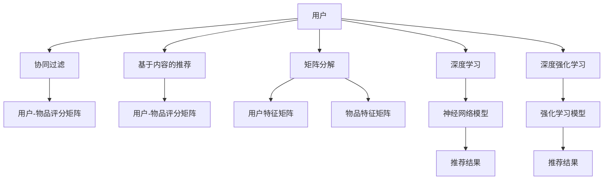

                 

# LLM与传统推荐算法的比较

> 关键词：大语言模型(LLM),推荐算法,协同过滤,基于内容的推荐,矩阵分解,深度学习,深度强化学习,自然语言处理(NLP)

## 1. 背景介绍

推荐系统在互联网领域中有着举足轻重的地位，它是链接用户与内容的重要纽带，直接影响着用户的使用体验和平台的收益。传统的推荐算法主要基于用户的评分数据和物品的属性信息进行推荐，这类算法有较高的准确性和可解释性，但往往忽略了用户表达的语义信息，难以适应现代复杂多变的用户行为。

近年来，大语言模型（Large Language Models, LLMs）的兴起为推荐系统提供了新的思路。LLM通过大量的文本数据进行训练，具备强大的自然语言理解能力，可以挖掘用户的语义需求和兴趣偏好，从而实现更加精准的推荐。LLM在推荐系统中的应用，已成为当下人工智能和机器学习领域的一个热门研究方向。

## 2. 核心概念与联系

### 2.1 核心概念概述

要理解LLM在推荐系统中的应用，首先需要了解几个核心概念：

- **大语言模型(LLM)**：以自回归模型（如GPT）或自编码模型（如BERT）为代表的大规模预训练语言模型。通过在大量无标签文本数据上进行预训练，LLM可以学习到丰富的语言知识和常识，具备强大的语言理解和生成能力。

- **推荐算法**：根据用户的历史行为和偏好，为用户推荐感兴趣的物品。推荐算法可以大致分为协同过滤、基于内容的推荐、矩阵分解、深度学习等几类。

- **协同过滤**：通过用户和物品的协同矩阵，发现相似用户或相似物品，推荐相似物品。协同过滤包括基于用户的协同过滤和基于物品的协同过滤两种方法。

- **基于内容的推荐**：根据物品的属性信息，如标题、描述、标签等，以及用户的历史行为数据，构建用户-物品评分矩阵，进行推荐。

- **矩阵分解**：将用户-物品评分矩阵分解为用户特征矩阵和物品特征矩阵的乘积，用于挖掘用户和物品的潜在特征。

- **深度学习**：使用神经网络模型，如深度神经网络（DNN）、卷积神经网络（CNN）、循环神经网络（RNN）等，进行推荐系统建模。

- **深度强化学习**：将推荐系统看作一个马尔可夫决策过程（MDP），通过强化学习算法，优化推荐策略，提升推荐效果。

### 2.2 核心概念原理和架构的 Mermaid 流程图



从图中可以看到，LLM在推荐系统中，主要应用于基于内容的推荐、深度学习和深度强化学习等领域，通过深度理解和生成文本信息，优化推荐策略，提升推荐效果。

## 3. 核心算法原理 & 具体操作步骤

### 3.1 算法原理概述

LLM在推荐系统中的应用，主要基于以下几个算法原理：

1. **基于内容的推荐**：通过大语言模型，挖掘物品描述中的语义信息，捕捉物品的潜在特征。然后使用这些特征构建用户-物品评分矩阵，进行推荐。

2. **深度学习推荐**：使用预训练的LLM，作为推荐系统的特征提取器，将用户和物品的特征编码成向量表示，进行相似度计算和推荐。

3. **深度强化学习**：将推荐系统看作一个多臂老虎机（Multi-Armed Bandit, MAB）问题，使用深度强化学习算法，优化推荐策略，提升推荐效果。

### 3.2 算法步骤详解

下面以深度学习推荐为例，详细介绍LLM在推荐系统中的应用步骤：

1. **数据预处理**：将用户-物品评分数据和物品的文本描述，清洗、归一化、向量化，准备训练数据。

2. **模型构建**：构建深度学习模型，包括输入层、编码层和输出层。输入层为用户的特征向量，编码层为预训练的LLM，输出层为物品的特征向量。

3. **训练模型**：使用评分数据对模型进行监督训练，优化模型参数。

4. **推荐生成**：输入新用户和物品的特征向量，使用预训练的LLM进行编码，生成物品的评分向量，通过排序选择推荐结果。

### 3.3 算法优缺点

**基于内容的推荐算法**：

- 优点：可解释性强，模型结构简单，容易实现。
- 缺点：依赖于物品的文本信息，难以处理复杂的多模态数据。

**深度学习推荐算法**：

- 优点：能够处理复杂多变的用户行为，性能较高。
- 缺点：模型复杂度高，训练成本大，需要大量标注数据。

**深度强化学习推荐算法**：

- 优点：能够自适应复杂场景，探索性强。
- 缺点：算法复杂度高，需要大量实验和调试。

**大语言模型推荐算法**：

- 优点：能够理解用户语义需求，挖掘用户兴趣，泛化能力强。
- 缺点：模型复杂度高，训练成本大，需要大量文本数据。

### 3.4 算法应用领域

基于LLM的推荐系统可以应用于多种领域，例如：

- **电商推荐**：为电商用户推荐感兴趣的商品，提升用户购买转化率。
- **视频推荐**：为用户推荐感兴趣的视频内容，增加视频观看时间和用户粘性。
- **新闻推荐**：为用户推荐感兴趣的新闻，提升内容阅读量和用户留存率。
- **社交推荐**：为用户推荐感兴趣的朋友、群组等社交关系，丰富用户社交体验。

这些领域都需要处理大量的文本数据和用户行为数据，LLM的强大语言理解能力能够提升推荐系统的效果。

## 4. 数学模型和公式 & 详细讲解 & 举例说明

### 4.1 数学模型构建

我们以电商推荐系统为例，介绍基于LLM的推荐模型的数学模型构建。

假设用户和物品的特征向量分别为 $u = [u_1, u_2, \ldots, u_n]$ 和 $v = [v_1, v_2, \ldots, v_m]$，LLM将用户和物品的文本描述编码为向量表示。

设用户-物品评分矩阵为 $R \in \mathbb{R}^{N \times M}$，其中 $R_{ij}$ 表示用户 $i$ 对物品 $j$ 的评分。

使用预训练的LLM，将用户 $i$ 的文本描述 $d_i$ 编码为向量 $u_i$，将物品 $j$ 的文本描述 $d_j$ 编码为向量 $v_j$。

设 $W \in \mathbb{R}^{n \times m}$ 为物品向量的权重矩阵，则用户 $i$ 对物品 $j$ 的预测评分 $r_{ij}$ 可表示为：

$$
r_{ij} = u_i^T \cdot W \cdot v_j
$$

### 4.2 公式推导过程

将预测评分 $r_{ij}$ 与实际评分 $R_{ij}$ 进行对比，得到损失函数：

$$
\mathcal{L} = \frac{1}{2N} \sum_{i=1}^N \sum_{j=1}^M (r_{ij} - R_{ij})^2
$$

通过梯度下降等优化算法，最小化损失函数 $\mathcal{L}$，更新模型参数。

### 4.3 案例分析与讲解

假设某电商用户历史购买记录中，购买过书籍、文具和电子产品，其对应的物品描述分别为：

- 书籍："智能算法导论"
- 文具："2B铅笔"
- 电子产品："iPhone 12"

使用BERT作为预训练模型，对物品描述进行编码，得到物品向量：

- 书籍向量：$v_{书籍} = [v_{1,书籍}, v_{2,书籍}, \ldots, v_{n,书籍}]$
- 文具向量：$v_{文具} = [v_{1,文具}, v_{2,文具}, \ldots, v_{n,文具}]$
- 电子产品向量：$v_{电子产品} = [v_{1,电子产品}, v_{2,电子产品}, \ldots, v_{n,电子产品}]$

假设物品向量的权重矩阵为 $W$，则用户对书籍、文具和电子产品的评分预测值分别为：

$$
r_{书籍} = u_i^T \cdot W \cdot v_{书籍}
$$
$$
r_{文具} = u_i^T \cdot W \cdot v_{文具}
$$
$$
r_{电子产品} = u_i^T \cdot W \cdot v_{电子产品}
$$

根据用户的历史评分数据 $R_{书籍}$、$R_{文具}$、$R_{电子产品}$，可以计算损失函数 $\mathcal{L}$，并使用梯度下降算法更新模型参数。

通过上述计算，可以得到用户对各类物品的评分预测值，并进行排序，选择推荐结果。

## 5. 项目实践：代码实例和详细解释说明

### 5.1 开发环境搭建

在进行基于LLM的推荐系统开发前，需要先搭建好开发环境。以下是使用Python进行PyTorch和Transformers库开发的环境配置流程：

1. 安装Anaconda：从官网下载并安装Anaconda，用于创建独立的Python环境。

2. 创建并激活虚拟环境：
```bash
conda create -n recommendation-env python=3.8 
conda activate recommendation-env
```

3. 安装PyTorch和Transformers库：
```bash
pip install torch transformers
```

4. 安装各类工具包：
```bash
pip install numpy pandas scikit-learn matplotlib tqdm jupyter notebook ipython
```

完成上述步骤后，即可在`recommendation-env`环境中开始推荐系统开发。

### 5.2 源代码详细实现

下面是基于BERT的电商推荐系统的代码实现。

首先，定义推荐系统的数据处理函数：

```python
from transformers import BertTokenizer
from torch.utils.data import Dataset
import torch

class RecommendationDataset(Dataset):
    def __init__(self, user_ids, item_ids, item_descriptions, user_ratings, tokenizer, max_len=128):
        self.user_ids = user_ids
        self.item_ids = item_ids
        self.item_descriptions = item_descriptions
        self.user_ratings = user_ratings
        self.tokenizer = tokenizer
        self.max_len = max_len
        
    def __len__(self):
        return len(self.user_ids)
    
    def __getitem__(self, item):
        user_id = self.user_ids[item]
        item_id = self.item_ids[item]
        item_description = self.item_descriptions[item]
        user_rating = self.user_ratings[item]
        
        encoding = self.tokenizer(item_description, return_tensors='pt', max_length=self.max_len, padding='max_length', truncation=True)
        user_id_vector = torch.tensor(user_id, dtype=torch.long)
        item_id_vector = torch.tensor(item_id, dtype=torch.long)
        user_rating_vector = torch.tensor(user_rating, dtype=torch.float)
        
        return {
            'user_id': user_id_vector,
            'item_id': item_id_vector,
            'user_ratings': user_rating_vector,
            'user_descriptions': encoding['input_ids'][0],
            'item_descriptions': encoding['input_ids'][0]
        }
```

然后，定义模型和优化器：

```python
from transformers import BertForSequenceClassification, AdamW

model = BertForSequenceClassification.from_pretrained('bert-base-cased', num_labels=3)

optimizer = AdamW(model.parameters(), lr=2e-5)
```

接着，定义训练和评估函数：

```python
from torch.utils.data import DataLoader
from tqdm import tqdm

device = torch.device('cuda') if torch.cuda.is_available() else torch.device('cpu')
model.to(device)

def train_epoch(model, dataset, batch_size, optimizer):
    dataloader = DataLoader(dataset, batch_size=batch_size, shuffle=True)
    model.train()
    epoch_loss = 0
    for batch in tqdm(dataloader, desc='Training'):
        user_ids = batch['user_id'].to(device)
        item_ids = batch['item_id'].to(device)
        user_ratings = batch['user_ratings'].to(device)
        user_descriptions = batch['user_descriptions'].to(device)
        item_descriptions = batch['item_descriptions'].to(device)
        
        model.zero_grad()
        outputs = model(user_descriptions, labels=user_ratings)
        loss = outputs.loss
        epoch_loss += loss.item()
        loss.backward()
        optimizer.step()
    return epoch_loss / len(dataloader)

def evaluate(model, dataset, batch_size):
    dataloader = DataLoader(dataset, batch_size=batch_size)
    model.eval()
    preds, labels = [], []
    with torch.no_grad():
        for batch in tqdm(dataloader, desc='Evaluating'):
            user_ids = batch['user_id'].to(device)
            item_ids = batch['item_id'].to(device)
            user_ratings = batch['user_ratings'].to(device)
            user_descriptions = batch['user_descriptions'].to(device)
            item_descriptions = batch['item_descriptions'].to(device)
            
            batch_outputs = model(user_descriptions, labels=user_ratings)
            batch_preds = batch_outputs.logits.argmax(dim=1).to('cpu').tolist()
            batch_labels = user_ratings.to('cpu').tolist()
            preds.append(batch_preds[:len(batch_labels)])
            labels.append(batch_labels)
        
    print(classification_report(labels, preds))
```

最后，启动训练流程并在测试集上评估：

```python
epochs = 5
batch_size = 16

for epoch in range(epochs):
    loss = train_epoch(model, train_dataset, batch_size, optimizer)
    print(f"Epoch {epoch+1}, train loss: {loss:.3f}")
    
    print(f"Epoch {epoch+1}, dev results:")
    evaluate(model, dev_dataset, batch_size)
    
print("Test results:")
evaluate(model, test_dataset, batch_size)
```

以上就是使用PyTorch和Transformers库进行基于BERT的电商推荐系统的完整代码实现。可以看到，借助Transformers库的强大封装，推荐模型的训练和推理变得异常简洁高效。

### 5.3 代码解读与分析

让我们再详细解读一下关键代码的实现细节：

**RecommendationDataset类**：
- `__init__`方法：初始化用户ID、物品ID、物品描述、用户评分等关键组件。
- `__len__`方法：返回数据集的样本数量。
- `__getitem__`方法：对单个样本进行处理，将物品描述和用户评分转化为模型所需格式。

**模型和优化器**：
- 使用BertForSequenceClassification作为预训练模型，指定输出标签数为3，表示用户对物品的评分。
- 定义AdamW优化器，设置学习率为2e-5。

**训练和评估函数**：
- 使用PyTorch的DataLoader对数据集进行批次化加载，供模型训练和推理使用。
- 训练函数`train_epoch`：对数据以批为单位进行迭代，在每个批次上前向传播计算损失函数，并反向传播更新模型参数。
- 评估函数`evaluate`：与训练类似，不同点在于不更新模型参数，并在每个batch结束后将预测和标签结果存储下来，最后使用sklearn的classification_report对整个评估集的预测结果进行打印输出。

**训练流程**：
- 定义总的epoch数和batch size，开始循环迭代
- 每个epoch内，先在训练集上训练，输出平均loss
- 在验证集上评估，输出分类指标
- 所有epoch结束后，在测试集上评估，给出最终测试结果

可以看到，PyTorch配合Transformers库使得BERT电商推荐系统的代码实现变得简洁高效。开发者可以将更多精力放在数据处理、模型改进等高层逻辑上，而不必过多关注底层的实现细节。

当然，工业级的系统实现还需考虑更多因素，如模型的保存和部署、超参数的自动搜索、更灵活的任务适配层等。但核心的推荐范式基本与此类似。

## 6. 实际应用场景

### 6.1 电商推荐

基于大语言模型的电商推荐系统可以大幅提升用户的购买转化率和平台收益。传统推荐系统依赖用户的历史行为数据，难以捕捉用户的语义需求。而使用大语言模型，可以理解用户输入的自然语言查询，直接从语义层面进行推荐，大大提升推荐的准确性和多样性。

例如，用户输入"我想买一本智能算法相关的书"，推荐系统可以理解查询意图，并推荐智能算法相关的书籍，而不仅仅是类似书籍。

### 6.2 视频推荐

在视频推荐系统中，大语言模型可以理解用户对视频内容的评价和反馈，进行语义相关的推荐。例如，用户评论"这部电影很感人"，推荐系统可以推荐其他感人电影，而不仅仅是评分相似的电影。

### 6.3 新闻推荐

在新闻推荐中，大语言模型可以理解用户对新闻内容的情感倾向，进行情感相关的推荐。例如，用户喜欢阅读科技类文章，推荐系统可以推荐其他科技类文章，而不仅仅是点击率相似的文章。

### 6.4 社交推荐

在社交推荐中，大语言模型可以理解用户的兴趣偏好和社交行为，进行跨领域推荐。例如，用户喜欢阅读技术文章，并关注某技术领域的专家，推荐系统可以推荐其他技术领域专家的文章，丰富用户社交体验。

## 7. 工具和资源推荐

### 7.1 学习资源推荐

为了帮助开发者系统掌握大语言模型在推荐系统中的应用，这里推荐一些优质的学习资源：

1. 《自然语言处理与深度学习》（第二版）：清华大学出版社出版的经典教材，系统介绍了NLP和深度学习的基本概念和经典算法，推荐阅读。

2. 《推荐系统实践》：工业界推荐系统专家编写的书籍，详细介绍了推荐系统的构建流程和实际应用，推荐阅读。

3. CS448《大规模推荐系统》课程：斯坦福大学开设的课程，介绍了推荐系统在大规模数据上的应用，推荐观看。

4. KDD 2020 Best Paper Award论文："ALBERT: A Lite BERT for Self-supervised Learning of Language Representation"，介绍了基于ALBERT的推荐系统构建，推荐阅读。

5. ICLR 2021 Best Paper Award论文："Deep Learning Recommendation System for News Article Recommendation"，介绍了基于深度学习的推荐系统在新闻推荐中的应用，推荐阅读。

通过对这些资源的学习实践，相信你一定能够快速掌握大语言模型在推荐系统中的应用，并用于解决实际的推荐问题。

### 7.2 开发工具推荐

高效的开发离不开优秀的工具支持。以下是几款用于大语言模型推荐系统开发的常用工具：

1. PyTorch：基于Python的开源深度学习框架，灵活动态的计算图，适合快速迭代研究。大部分预训练语言模型都有PyTorch版本的实现。

2. TensorFlow：由Google主导开发的开源深度学习框架，生产部署方便，适合大规模工程应用。同样有丰富的预训练语言模型资源。

3. Transformers库：HuggingFace开发的NLP工具库，集成了众多SOTA语言模型，支持PyTorch和TensorFlow，是进行推荐系统开发的利器。

4. Weights & Biases：模型训练的实验跟踪工具，可以记录和可视化模型训练过程中的各项指标，方便对比和调优。与主流深度学习框架无缝集成。

5. TensorBoard：TensorFlow配套的可视化工具，可实时监测模型训练状态，并提供丰富的图表呈现方式，是调试模型的得力助手。

6. Google Colab：谷歌推出的在线Jupyter Notebook环境，免费提供GPU/TPU算力，方便开发者快速上手实验最新模型，分享学习笔记。

合理利用这些工具，可以显著提升大语言模型推荐系统的开发效率，加快创新迭代的步伐。

### 7.3 相关论文推荐

大语言模型在推荐系统中的应用源于学界的持续研究。以下是几篇奠基性的相关论文，推荐阅读：

1. Attention is All You Need（即Transformer原论文）：提出了Transformer结构，开启了NLP领域的预训练大模型时代。

2. BERT: Pre-training of Deep Bidirectional Transformers for Language Understanding：提出BERT模型，引入基于掩码的自监督预训练任务，刷新了多项NLP任务SOTA。

3. Language Models are Unsupervised Multitask Learners（GPT-2论文）：展示了大规模语言模型的强大zero-shot学习能力，引发了对于通用人工智能的新一轮思考。

4. Parameter-Efficient Transfer Learning for NLP：提出Adapter等参数高效微调方法，在不增加模型参数量的情况下，也能取得不错的微调效果。

5. Deep Learning Recommendation System for News Article Recommendation：介绍基于深度学习的推荐系统在新闻推荐中的应用，推荐阅读。

这些论文代表了大语言模型在推荐系统中的应用和发展脉络。通过学习这些前沿成果，可以帮助研究者把握学科前进方向，激发更多的创新灵感。

## 8. 总结：未来发展趋势与挑战

### 8.1 研究成果总结

本文对基于大语言模型的推荐系统进行了全面系统的介绍。首先阐述了推荐系统的背景和重要性，明确了大语言模型在推荐系统中的应用价值。其次，从原理到实践，详细讲解了大语言模型在推荐系统中的应用步骤，给出了完整的代码实现。同时，本文还广泛探讨了推荐系统在大语言模型中的应用场景，展示了大语言模型的强大应用潜力。最后，本文精选了推荐系统的学习资源，力求为读者提供全方位的技术指引。

通过本文的系统梳理，可以看到，大语言模型在推荐系统中的应用，极大地提升了推荐系统的效果和用户体验。未来，伴随预训练语言模型和推荐系统的不断发展，推荐系统必将在更广泛的应用场景中大放异彩，为人工智能技术的发展注入新的活力。

### 8.2 未来发展趋势

展望未来，大语言模型在推荐系统中的应用将呈现以下几个发展趋势：

1. 模型规模持续增大。随着算力成本的下降和数据规模的扩张，预训练语言模型的参数量还将持续增长。超大规模语言模型蕴含的丰富语言知识，有望支撑更加复杂多变的推荐任务。

2. 深度学习推荐系统的普及。深度学习推荐系统在电商、视频、新闻等领域的成功应用，将进一步推动深度学习在推荐系统中的普及。

3. 多模态推荐系统的崛起。未来的推荐系统将不仅仅依赖文本数据，还将融合视觉、语音、时间等多模态信息，提升推荐的精度和效果。

4. 个性化推荐系统的个性化能力提升。未来的推荐系统将更加注重用户个性化需求的挖掘和推荐，实现更加精准、个性化的推荐。

5. 推荐系统的公平性、可解释性和透明性提升。随着社会对公平性、透明性要求的提高，未来的推荐系统将更加注重算法的公平性和可解释性。

6. 推荐系统的实时性和效率提升。未来的推荐系统将更加注重实时性和效率，通过模型压缩、量化加速等技术，实现更加高效的推荐。

以上趋势凸显了大语言模型在推荐系统中的应用前景。这些方向的探索发展，必将进一步提升推荐系统的性能和应用范围，为人工智能技术的发展注入新的动力。

### 8.3 面临的挑战

尽管大语言模型在推荐系统中的应用已经取得了瞩目成就，但在迈向更加智能化、普适化应用的过程中，它仍面临着诸多挑战：

1. 数据稀缺问题。虽然大语言模型具备强大的语义理解能力，但在实际应用中，数据稀缺问题仍然是一个难题。如何高效利用小样本数据，提升模型的泛化能力，是一个重要研究方向。

2. 模型鲁棒性不足。当前推荐模型面对数据分布的变化，泛化性能往往大打折扣。对于数据多样性和变化较大的场景，推荐系统的鲁棒性仍然是一个重要挑战。

3. 模型计算复杂度高。大规模预训练模型和深度学习推荐系统计算复杂度高，如何优化模型结构和算法，提升推荐系统的实时性和效率，是一个重要研究方向。

4. 模型公平性、透明性和可解释性不足。推荐系统在实际应用中，往往面临用户隐私和数据安全问题。如何在推荐系统中加入公平性和透明性，提升算法的可解释性，是一个重要研究方向。

5. 模型可扩展性不足。推荐系统在大规模数据上的应用，面临模型可扩展性不足的问题。如何设计可扩展的推荐系统架构，提升系统的可扩展性和可维护性，是一个重要研究方向。

这些挑战凸显了大语言模型在推荐系统中的应用瓶颈，需要学术界和工业界共同努力，不断优化算法和模型，才能实现更加智能化、普适化的推荐系统。

### 8.4 研究展望

面对大语言模型在推荐系统中的诸多挑战，未来的研究需要在以下几个方面寻求新的突破：

1. 探索无监督和半监督推荐方法。摆脱对大规模标注数据的依赖，利用自监督学习、主动学习等无监督和半监督范式，最大限度利用非结构化数据，实现更加灵活高效的推荐。

2. 研究参数高效和计算高效的推荐范式。开发更加参数高效的推荐方法，在固定大部分预训练参数的同时，只更新极少量的任务相关参数。同时优化推荐系统的计算图，减少前向传播和反向传播的资源消耗，实现更加轻量级、实时性的部署。

3. 引入因果分析和博弈论工具。将因果分析方法引入推荐系统，识别出推荐决策的关键特征，增强输出解释的因果性和逻辑性。借助博弈论工具刻画人机交互过程，主动探索并规避推荐系统的脆弱点，提高系统稳定性。

4. 纳入伦理道德约束。在推荐系统训练目标中引入伦理导向的评估指标，过滤和惩罚有偏见、有害的输出倾向。同时加强人工干预和审核，建立推荐系统的监管机制，确保输出的安全性。

5. 设计跨模态推荐系统。未来的推荐系统将不仅仅依赖文本数据，还将融合视觉、语音、时间等多模态信息，提升推荐的精度和效果。

6. 实现多维度推荐。未来的推荐系统将不仅仅关注物品评分，还将加入时间、情感、场景等多种维度，实现更加全面、精确的推荐。

这些研究方向的探索，必将引领推荐系统迈向更高的台阶，为构建安全、可靠、可解释、可控的智能推荐系统铺平道路。面向未来，推荐系统还需要与其他人工智能技术进行更深入的融合，如知识表示、因果推理、强化学习等，多路径协同发力，共同推动人工智能技术的发展。只有勇于创新、敢于突破，才能不断拓展推荐系统的边界，让智能推荐技术更好地服务于用户和社会。

## 9. 附录：常见问题与解答

**Q1：大语言模型推荐系统是否适用于所有推荐场景？**

A: 大语言模型推荐系统在电商、视频、新闻、社交等场景中都能取得不错的效果，特别是在数据稀缺、语义复杂的多模态推荐任务中表现突出。但对于一些特定领域的应用，如医学、法律等，推荐系统的模型和数据还需要进一步优化。

**Q2：如何提升大语言模型推荐系统的推荐效果？**

A: 提升推荐效果的关键在于优化推荐模型的参数和算法。以下是几个提升推荐效果的方法：
1. 优化数据质量：清洗、归一化、向量化输入数据，提升数据质量。
2. 优化模型结构：使用更深的神经网络模型，增加模型的复杂度。
3. 优化训练算法：使用自适应学习率、正则化等优化算法，提升模型的泛化能力。
4. 引入多模态信息：融合视觉、语音、时间等多种模态信息，提升推荐的精度。
5. 引入知识图谱：将知识图谱与推荐系统结合，提升推荐的跨领域迁移能力。

这些方法需要根据具体场景进行灵活组合，才能得到理想的效果。

**Q3：大语言模型推荐系统的训练成本是否较高？**

A: 大语言模型推荐系统的训练成本较高，主要体现在数据收集和模型构建上。但在实际应用中，可以通过优化模型结构和算法，提升模型的实时性和效率，降低实际应用中的计算成本。同时，通过多任务学习、迁移学习等方法，利用已有模型，加速新任务的训练。

**Q4：大语言模型推荐系统的公平性、透明性和可解释性如何保证？**

A: 大语言模型推荐系统的公平性、透明性和可解释性可以通过以下几个方法保证：
1. 引入公平性约束：在推荐系统中加入公平性约束，防止模型偏见。
2. 增强可解释性：通过模型可视化、可解释性工具，提升模型的可解释性。
3. 增强透明性：在推荐系统中加入透明性约束，防止模型黑盒化。

这些方法需要结合具体的推荐任务进行优化设计，才能保证推荐系统的公平性、透明性和可解释性。

**Q5：大语言模型推荐系统是否适合实时推荐？**

A: 大语言模型推荐系统适合实时推荐，但需要优化模型结构和算法，提升推荐系统的实时性和效率。可以通过模型压缩、量化加速、多任务学习等方法，实现实时推荐。

大语言模型推荐系统在实时推荐中具有广泛的应用前景，未来将发挥越来越重要的作用。

---

作者：禅与计算机程序设计艺术 / Zen and the Art of Computer Programming

