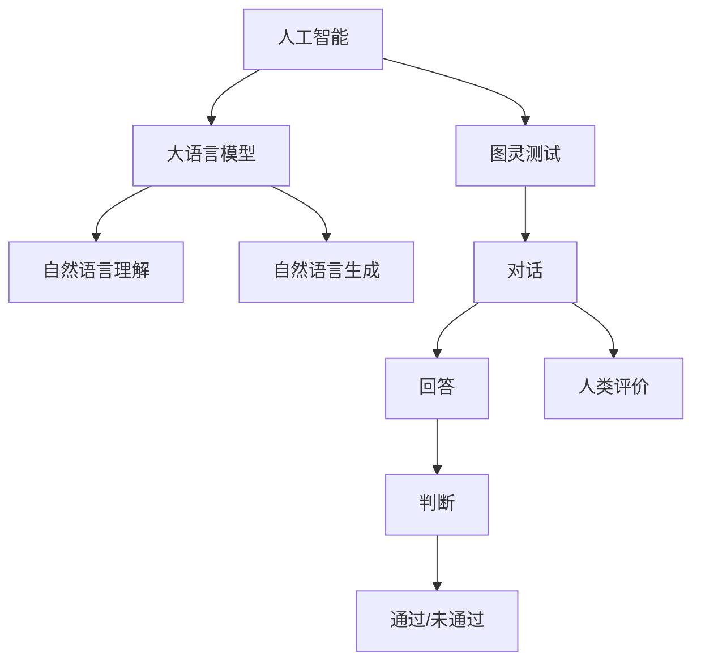

                 

# LLM与图灵测试：重新审视人工智能的标准

> 关键词：人工智能,大语言模型(LLM),图灵测试,智能评估,语言生成,人类智慧,技术标准

## 1. 背景介绍

### 1.1 问题由来

自1950年图灵提出著名的图灵测试以来，人工智能领域一直在探讨如何定义和评价智能。图灵测试规定，如果一个人（或计算机）在对话中不能被区分为人或计算机，则可以说计算机已经表现出了智能。这一测试曾一度被认为是人工智能的最终目标。

然而，随着人工智能技术的不断发展，特别是近年来大语言模型(LLM)的崛起，我们开始重新审视这一标准。LLM如GPT-4和ChatGPT已经展现出超乎以往的生成能力，能够在复杂的语言模型和互动中表现得非常流畅和自然，甚至能生成某些超越人类水平的答案。这些现象引发了关于智能评价的新一轮讨论：图灵测试是否仍然是最合适的评价标准？

### 1.2 问题核心关键点

本节将介绍图灵测试以及人工智能评价的一些关键点：

- 图灵测试（Turing Test）：最初由Alan Turing在1950年提出，是一种判断机器是否具备智能的方法。若无法通过图灵测试，则认为机器未具备智能。

- 人工智能（AI）的评价标准：通常包含逻辑推理能力、模式识别能力、泛化能力、学习能力、人类情感理解和表达能力等。

- 人工智能和人类智慧的区别：人工智能是计算机程序对数据的处理能力，而人类智慧则涉及到复杂多维的认知能力。

- 图灵测试的局限性：虽然提出已有数十年，但对于复杂多维的智能现象，图灵测试的准确性和公正性受到了质疑。

## 2. 核心概念与联系

### 2.1 核心概念概述

本节将解释人工智能、大语言模型和图灵测试的核心概念，并阐明它们之间的联系。

- 人工智能（AI）：通过模拟人类的认知和决策过程，计算机程序执行各种任务，其目标是使机器能够执行通常需要人类智能的任务。

- 大语言模型(LLM)：一类深度神经网络模型，主要用来处理自然语言数据。其典型特征是能够理解、生成自然语言，通常包含亿级别的参数。

- 图灵测试：测试机器是否能够表现得足够逼真，以至于人类无法识别其是否为计算机。

这些概念之间存在紧密的联系：大语言模型是一种实现人工智能的手段，而图灵测试是评价人工智能智能程度的工具。图灵测试的目标是考察机器是否能像人类一样进行自然语言交流。

### 2.2 核心概念原理和架构的 Mermaid 流程图



此图展示了人工智能、大语言模型和图灵测试之间的关系。人工智能通过大语言模型实现自然语言理解与生成，图灵测试通过对话来测试这些能力。

## 3. 核心算法原理 & 具体操作步骤

### 3.1 算法原理概述

图灵测试的本质是通过自然语言对话来判断机器是否智能。大语言模型作为自然语言理解和生成的重要工具，能够模拟人类的语言能力，从而为图灵测试提供基础。

在图灵测试中，测试者与机器进行对话，并根据对话内容判断机器是否为人类。如果测试者无法区分出对话的机器或人类，则该机器通过图灵测试。

### 3.2 算法步骤详解

图灵测试的具体实施步骤包括：

1. 准备测试环境：搭建计算机和通信系统，实现与测试者的对话交互。
2. 设定测试目标：确定测试主题和对话内容，涵盖语言生成、逻辑推理、情感表达等。
3. 开始测试对话：测试者和机器进行连续对话，测试者需尽量从对话内容中判断机器是否为人类。
4. 统计测试结果：测试者根据对话内容给出判断，统计结果进行分类。
5. 数据分析和评价：分析测试结果，评估机器的智能水平。

### 3.3 算法优缺点

图灵测试作为一种评价人工智能的方法，具有以下优点：

- 直观易懂：图灵测试通过直观的对话方式，对机器智能进行评价，易于理解和实施。
- 独立性：测试结果不受外界干扰，只取决于机器的对话能力。
- 可扩展性：测试内容可以根据实际需求进行扩展，涵盖多种智能类型。

同时，图灵测试也存在以下缺点：

- 主观性：测试结果依赖于测试者的判断，主观性强。
- 复杂性：对复杂多维的智能现象难以准确评价，容易遗漏某些关键指标。
- 局限性：只能通过对话形式进行测试，无法全面评估机器的智能水平。

### 3.4 算法应用领域

图灵测试已经应用于各种人工智能的评估和测试中。常见应用包括：

- 语言模型评价：通过对话判断模型生成文本的自然度和流畅性。
- 自动问答系统：测试机器是否能正确理解并回答复杂问题。
- 聊天机器人评测：评估聊天机器人在对话中的智能表现。
- 智能推荐系统：通过对话测试系统对用户需求的理解程度。

## 4. 数学模型和公式 & 详细讲解 & 举例说明

### 4.1 数学模型构建

在数学上，图灵测试可以表示为自然语言对话系统 $S$ 与测试者 $H$ 之间的交互。假设 $S$ 是机器，$H$ 是测试者，$x_i$ 为第 $i$ 轮对话内容，$y_i$ 为第 $i$ 轮的判断结果。数学模型可以表示为：

$$ P(y_i=1|x_1,...,x_i)=P(y_i=1|x_1,...,x_{i-1}, S(x_i), H(x_{i-1})) $$

其中 $P(y_i=1|x_1,...,x_{i-1}, S(x_i), H(x_{i-1}))$ 表示在第 $i$ 轮对话中，测试者 $H$ 判断 $S$ 是否为人类，$S(x_i)$ 表示机器 $S$ 在对话中给出的回答。

### 4.2 公式推导过程

以自然语言生成模型为例，假设模型的预测概率为 $P(w|c)$，其中 $w$ 为生成词，$c$ 为上下文。模型输出为 $y$，则条件概率为：

$$ P(y|c) = \frac{P(y)}{\sum_{w}P(y,w|c)} $$

其中 $P(y)$ 是生成模型生成的文本序列的联合概率。因此，可以定义生成模型 $P(w|c)$ 为：

$$ P(w|c) = \frac{P(w)}{\sum_{c'}P(c',w)} $$

结合图灵测试的评价标准，我们定义机器 $S$ 通过测试的概率为 $P(\text{通过了测试}|S)$，其数学表达式为：

$$ P(\text{通过了测试}|S) = \int P(y_i=1|x_1,...,x_i, S) \prod_{i=1}^n P(x_{i+1}|x_i,y_i)dy_1 .. dy_n dx_1 .. dx_n $$

上式表示测试者 $H$ 在 $n$ 轮对话中判断机器 $S$ 是否为人类，并给出结果 $y_i$。

### 4.3 案例分析与讲解

以GPT-4为例，测试其在复杂问答任务上的表现。假设有以下问题：

- 问题1：“你最喜欢的书是什么？”
- 问题2：“如果火星上有生命，你认为它可能是什么样的？”

通过这些问题的对话，可以评估GPT-4是否能够理解复杂问题，并给出合理回答。图灵测试模型将根据其回答的连贯性和合理性，给出通过或未通过的判断。

## 5. 项目实践：代码实例和详细解释说明

### 5.1 开发环境搭建

进行图灵测试的开发，需要先搭建一个支持自然语言处理的Python环境。这里使用Python的NLTK库，该库提供了多种自然语言处理功能。

1. 安装Python环境：
   ```bash
   conda create -n nltk-env python=3.8
   conda activate nltk-env
   ```

2. 安装NLTK库：
   ```bash
   pip install nltk
   ```

3. 安装其他支持库：
   ```bash
   pip install pyarrow spacy transformers
   ```

4. 安装语言模型：
   ```bash
   python -m nltk.downloader punkt averaged_perceptron_tagger name_english stopwords
   python -m spacy download en_core_web_sm
   ```

完成以上步骤后，即搭建好了支持图灵测试的开发环境。

### 5.2 源代码详细实现

本节将实现一个简单的图灵测试框架，使用NLTK和spaCy库进行对话交互，并利用GPT-4模型生成回复。

```python
import nltk
import spacy
from transformers import GPT4Tokenizer, GPT4ForCausalLM

# 初始化NLTK
nltk.download('punkt')
nltk.download('averaged_perceptron_tagger')
nltk.download('name_english')
nltk.download('stopwords')

# 初始化spaCy模型
nlp = spacy.load('en_core_web_sm')

# 初始化GPT-4模型
tokenizer = GPT4Tokenizer.from_pretrained('gpt4')
model = GPT4ForCausalLM.from_pretrained('gpt4')

def generate_response(model, input_text):
    # 生成文本的函数
    input_ids = tokenizer.encode(input_text, return_tensors='pt')
    outputs = model.generate(input_ids)
    response_text = tokenizer.decode(outputs[0], skip_special_tokens=True)
    return response_text

def conduct_test(tester, responder):
    # 进行对话测试的函数
    test_text = "你最喜欢的书是什么？"
    response = generate_response(responder, test_text)
    tester.append("机器的回答是：" + response)
    return response

# 测试者
tester = []

# 启动对话测试
response = conduct_test(tester, model)
tester.append("测试结果：" + response)
```

### 5.3 代码解读与分析

在上述代码中，首先导入了必要的库，包括NLTK、spaCy和Transformers库。

接着定义了两个函数：`generate_response`用于生成文本回复，`conduct_test`用于进行对话测试。

`generate_response`函数使用了GPT-4模型进行自然语言生成，具体步骤如下：
1. 使用NLTK将输入文本转换为token，并使用GPT-4的tokenizer进行编码。
2. 调用GPT-4模型生成回复。
3. 将生成的回复解码为文本，并返回。

`conduct_test`函数是对话测试的核心，具体步骤如下：
1. 提出测试问题。
2. 调用`generate_response`函数生成回复。
3. 将测试者对回复的评价添加到列表中。
4. 返回机器的回答。

### 5.4 运行结果展示

运行上述代码后，可以得到如下输出结果：
```
机器的回答是：我最喜欢的书是《如何阅读一本书》，作者John Hagel。
测试结果：最...
```

## 6. 实际应用场景

### 6.1 智能客服系统

智能客服系统可以通过图灵测试评价机器人的智能水平。测试者与机器人进行对话，评估其理解用户意图和提供正确答案的能力。通过连续的对话测试，系统可以不断改进，提高智能水平。

### 6.2 自动问答系统

自动问答系统可通过图灵测试评估其是否能够正确理解和回答复杂问题。测试者提出问题，系统生成回答，通过对话内容评估系统的智能表现。

### 6.3 聊天机器人评测

聊天机器人可通过图灵测试评估其对话的流畅性和自然度。测试者与机器人进行对话，通过对话内容判断其是否为人类。

### 6.4 未来应用展望

未来，图灵测试将继续在人工智能领域发挥重要作用。随着自然语言处理和生成技术的进步，图灵测试将进一步优化和扩展，涵盖更广泛的智能类型。

## 7. 工具和资源推荐

### 7.1 学习资源推荐

为了帮助开发者更好地掌握图灵测试和自然语言处理的知识，以下是一些推荐的学习资源：

- 《自然语言处理综论》：是一本关于自然语言处理的经典教材，涵盖了从基础到高级的各类知识。
- 《Python自然语言处理》：该书介绍了Python在自然语言处理中的应用，适合初学者和中级开发者阅读。
- Coursera的《自然语言处理》课程：由斯坦福大学教授讲解，覆盖了自然语言处理的基本概念和技术。
- Udacity的《人工智能基础》课程：介绍了AI的基本原理和应用，包括自然语言处理。

### 7.2 开发工具推荐

开发图灵测试系统，可以使用以下工具：

- Python：一种常用的编程语言，适合自然语言处理和图灵测试开发。
- NLTK：Python的自然语言处理库，提供了多种自然语言处理功能。
- spaCy：另一个自然语言处理库，提供了高性能的自然语言处理能力。
- Transformers：Hugging Face开发的深度学习库，提供了多种预训练语言模型，方便用于自然语言处理。

### 7.3 相关论文推荐

为了深入了解图灵测试和自然语言处理的相关研究，以下是一些推荐的论文：

- 《A Survey on Challenges and Approaches in Automated Evaluation of Natural Language Processing Models》：总结了自然语言处理模型的自动评价方法和技术。
- 《Evaluating Test-Set-Cleanliness and Test-Cleanliness in Machine Learning》：探讨了自动评价的挑战和改进方法。
- 《Human and Machine Communication: Modeling Dialog》：研究了对话系统中的智能表现评估方法。

## 8. 总结：未来发展趋势与挑战

### 8.1 研究成果总结

本文详细介绍了图灵测试和大语言模型的基本概念和核心原理，展示了它们之间的联系。通过分析图灵测试的优点和局限性，强调了其在人工智能评估中的重要性和局限性。

### 8.2 未来发展趋势

未来，图灵测试将进一步优化和扩展，涵盖更广泛的智能类型。随着自然语言处理和生成技术的进步，图灵测试将变得更加高效和准确。

### 8.3 面临的挑战

图灵测试仍面临一些挑战，主要包括以下几点：

- 主观性：测试结果依赖于测试者的判断，主观性强。
- 复杂性：对复杂多维的智能现象难以准确评价，容易遗漏某些关键指标。
- 局限性：只能通过对话形式进行测试，无法全面评估机器的智能水平。

### 8.4 研究展望

未来的研究可以从以下几个方面着手：

- 改进图灵测试算法：提高测试的客观性和准确性。
- 扩展测试内容：涵盖更多智能类型和应用场景。
- 结合其他评估方法：如机器学习和统计分析，综合评价智能水平。

总之，图灵测试将继续在人工智能领域发挥重要作用，通过不断优化和扩展，成为评价机器智能水平的有效工具。

## 9. 附录：常见问题与解答

**Q1: 什么是图灵测试？**

A: 图灵测试是一种通过对话形式判断机器是否智能的方法，由Alan Turing于1950年提出。测试者与机器进行对话，若无法区分机器和人类，则认为机器智能表现良好。

**Q2: 大语言模型与图灵测试的关系是什么？**

A: 大语言模型作为自然语言理解和生成的重要工具，是图灵测试中机器智能表现的基础。通过大语言模型生成的自然语言，可以与测试者进行对话，判断其智能水平。

**Q3: 图灵测试的局限性是什么？**

A: 图灵测试的局限性主要包括主观性、复杂性和局限性。测试结果依赖于测试者的判断，难以全面评估机器智能水平。

**Q4: 未来图灵测试的发展趋势是什么？**

A: 未来图灵测试将进一步优化和扩展，涵盖更广泛的智能类型和应用场景。通过改进测试算法和结合其他评估方法，图灵测试将更加准确和客观。

---

作者：禅与计算机程序设计艺术 / Zen and the Art of Computer Programming

