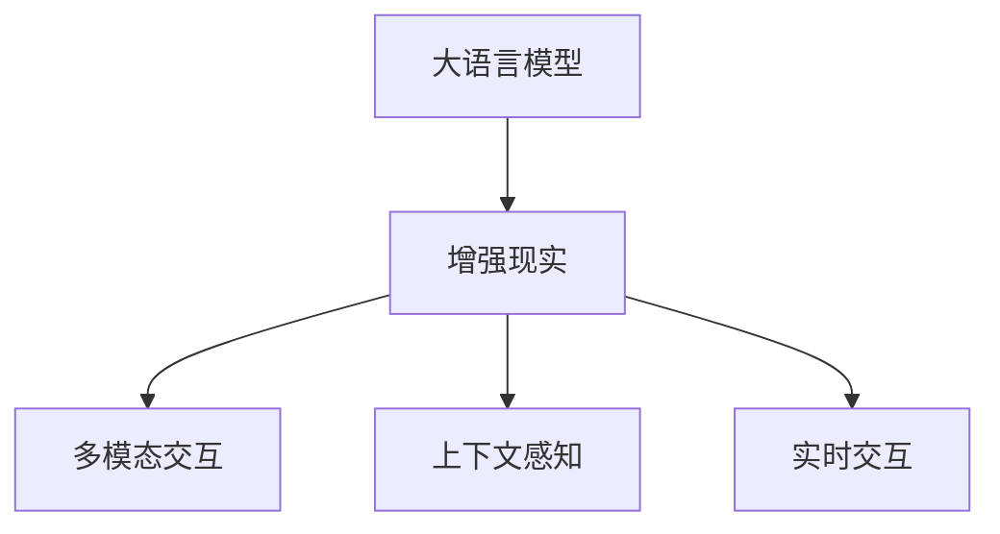

                 

## 1. 背景介绍

### 1.1 问题由来

在科技飞速发展的今天，虚拟现实（Virtual Reality, VR）和增强现实（Augmented Reality, AR）技术正逐渐改变着我们的生活方式和工作方式。传统的教育、娱乐、医疗等领域都在探索AR技术的应用潜力。与此同时，语言处理技术也在不断进步，深度学习驱动的语言模型（Large Language Models, LLMs）取得了令人瞩目的成就。那么，这些先进的自然语言处理技术能否与AR技术结合起来，以实现更具互动性和沉浸感的用户体验呢？本文将探讨大语言模型（Large Language Models, LLMs）与增强现实（Augmented Reality, AR）技术的结合方式及其潜在应用场景，希望能为未来的AR应用提供一些有价值的参考。

### 1.2 问题核心关键点

大语言模型与增强现实技术的结合，主要集中在以下几个关键点：

- **多模态交互**：在AR应用中，用户不仅能够看到虚拟物体，还能通过语音、手势等多种方式与环境互动。大语言模型能够理解自然语言指令，并转化为相应的视觉或音频反馈，实现多模态交互。
- **个性化推荐**：基于用户的历史行为和偏好，大语言模型能够实时推荐合适的虚拟内容或互动方式，提升用户体验。
- **上下文感知**：通过理解用户当前所处的环境和情境，大语言模型能够提供更加准确、相关的内容推荐。
- **实时交互**：大语言模型可以实时处理用户的语音输入和视觉反馈，动态生成内容和互动方式。

这些问题正是大语言模型与增强现实技术结合的切入点，将有望极大地提升AR应用的智能度和用户体验。

## 2. 核心概念与联系

### 2.1 核心概念概述

- **大语言模型**：以自回归（如GPT）或自编码（如BERT）模型为代表的大规模预训练语言模型。通过在大规模无标签文本语料上进行预训练，学习通用的语言表示，具备强大的语言理解和生成能力。
- **增强现实**：将虚拟信息叠加到真实世界的实时图像上，为用户提供更丰富、更互动的视觉体验。
- **多模态交互**：结合视觉、听觉、触觉等多种感官信息，实现人与环境的自然互动。
- **上下文感知**：理解用户当前所处的环境和情境，提供更准确、更相关的信息和服务。
- **实时交互**：在用户与系统的互动中，能够即时响应用户输入，提供动态生成内容的能力。

这些概念之间的逻辑关系可以通过以下Mermaid流程图来展示：



这个流程图展示了大语言模型与增强现实技术之间的联系：

1. 大语言模型通过预训练获得基础能力。
2. 增强现实技术将虚拟信息叠加到真实世界的实时图像上，提供互动体验。
3. 多模态交互结合视觉、听觉等多种感官信息，实现自然互动。
4. 上下文感知理解用户当前环境，提供相关服务。
5. 实时交互动态生成内容，提升互动性。

这些概念共同构成了大语言模型与增强现实技术结合的基础，使得智能AR应用成为可能。

## 3. 核心算法原理 & 具体操作步骤
### 3.1 算法原理概述

大语言模型与增强现实技术的结合，主要基于以下几个算法原理：

- **多模态感知模型**：通过深度学习模型将视觉、听觉等多种感官信息融合，实现对环境的全面感知。
- **自然语言处理模型**：利用大语言模型处理用户的自然语言输入，转化为视觉、音频反馈。
- **上下文感知模型**：通过环境传感器或用户的交互行为，获取用户当前的环境和情境信息，动态调整内容的呈现。
- **实时交互模型**：利用自然语言处理模型实时处理用户输入，动态生成内容或行为，提供即时反馈。

这些模型结合在一起，形成了一个完整的智能AR系统。大语言模型负责理解用户的自然语言输入，并转化为视觉或音频反馈；多模态感知模型负责对环境的全面感知；上下文感知模型负责理解用户当前的环境和情境；实时交互模型负责动态生成内容或行为，提供即时反馈。

### 3.2 算法步骤详解

基于大语言模型与增强现实技术的结合，通常包括以下几个关键步骤：

**Step 1: 准备数据集和模型**

- 准备增强现实应用所需的数据集，包括用户的历史行为数据、环境传感器数据等。
- 选择合适的大语言模型作为初始化参数，如GPT、BERT等。

**Step 2: 集成多模态感知模型**

- 将视觉、听觉等多种感官信息输入多模态感知模型，提取环境的全面特征。
- 将提取的环境特征输入到大语言模型，作为其输入的一部分。

**Step 3: 自然语言处理**

- 利用大语言模型处理用户的自然语言输入，转化为相应的视觉或音频反馈。
- 通过上下文感知模型理解用户当前的环境和情境，动态调整内容的呈现。

**Step 4: 实时交互**

- 利用实时交互模型动态生成内容或行为，提供即时反馈。
- 将实时生成的内容或行为反馈给用户，实现多模态互动。

**Step 5: 优化模型和算法**

- 根据用户反馈和行为数据，不断优化多模态感知模型和自然语言处理模型。
- 改进实时交互算法，提升系统的响应速度和准确性。

### 3.3 算法优缺点

基于大语言模型与增强现实技术的结合，具有以下优点：

- **自然互动**：通过自然语言处理技术，用户能够以自然、流畅的方式与系统互动，提升体验感。
- **多感官融合**：结合视觉、听觉等多种感官信息，实现全面的环境感知，提供更丰富的体验。
- **上下文感知**：通过理解用户当前的环境和情境，提供更准确、更相关的信息和服务。
- **实时反馈**：动态生成内容或行为，提供即时反馈，提升互动性。

同时，该方法也存在一定的局限性：

- **计算复杂度**：多模态感知和自然语言处理模型的计算复杂度较高，对硬件要求较高。
- **数据隐私**：增强现实应用需要采集用户的多种感官信息，可能涉及用户隐私，需要谨慎处理。
- **可解释性**：大语言模型的决策过程缺乏可解释性，难以调试和优化。

尽管存在这些局限性，但就目前而言，大语言模型与增强现实技术的结合仍是AI应用的重要方向之一。未来相关研究的重点在于如何进一步降低计算复杂度，保护用户隐私，同时兼顾可解释性和用户满意度等因素。

### 3.4 算法应用领域

基于大语言模型与增强现实技术的结合方法，已经在多个领域得到了应用，例如：

- **教育培训**：在AR教育应用中，大语言模型可以实时回答学生的问题，提供个性化的学习建议。
- **虚拟旅游**：在AR旅游应用中，大语言模型可以根据用户的行为和偏好，推荐合适的景点和路线。
- **医疗咨询**：在AR医疗应用中，大语言模型可以实时解答病人的疑问，提供医疗建议。
- **虚拟助手**：在AR助手应用中，大语言模型可以实时处理用户的语音指令，提供动态生成的服务。
- **娱乐互动**：在AR娱乐应用中，大语言模型可以根据用户的情绪和行为，动态生成游戏场景和角色。

除了上述这些经典应用外，大语言模型与增强现实技术的结合还有更多创新应用，如虚拟购物、远程协作等，为增强现实技术带来了全新的应用场景。

## 4. 数学模型和公式 & 详细讲解

### 4.1 数学模型构建

假设用户输入的文本为 $x$，大语言模型输出的文本为 $y$，增强现实应用所需的视觉反馈为 $v$，多模态感知模型为 $M_{multi}$，自然语言处理模型为 $M_{nlp}$，上下文感知模型为 $M_{context}$，实时交互模型为 $M_{inter}$。则基于大语言模型与增强现实技术的结合模型可以表示为：

$$
y = M_{nlp}(x, v) \\
v = M_{multi}(x, w)
$$

其中 $w$ 为环境传感器数据。

### 4.2 公式推导过程

在AR应用中，用户输入的文本 $x$ 首先进入自然语言处理模型 $M_{nlp}$，通过上下文感知模型 $M_{context}$ 理解用户当前的环境和情境，得到环境的全面特征 $w$。多模态感知模型 $M_{multi}$ 将环境特征 $w$ 和用户输入 $x$ 作为输入，输出视觉反馈 $v$。最后，自然语言处理模型 $M_{nlp}$ 将视觉反馈 $v$ 和用户输入 $x$ 作为输入，输出文本反馈 $y$。

### 4.3 案例分析与讲解

以一个简单的AR购物应用为例，分析其工作流程：

1. 用户输入查询文本，如“我想买一件衣服”。
2. 自然语言处理模型 $M_{nlp}$ 处理用户输入，理解其意图，输出语言特征 $x_1$。
3. 上下文感知模型 $M_{context}$ 获取用户当前位置和行为数据，输出环境特征 $w$。
4. 多模态感知模型 $M_{multi}$ 将语言特征 $x_1$ 和环境特征 $w$ 作为输入，输出视觉反馈 $v$。
5. 实时交互模型 $M_{inter}$ 根据视觉反馈 $v$ 和用户输入 $x_1$ 动态生成商品列表，显示给用户。
6. 用户选择商品，输入确认命令“确认购买”。
7. 自然语言处理模型 $M_{nlp}$ 处理用户确认命令，输出语言特征 $x_2$。
8. 实时交互模型 $M_{inter}$ 根据语言特征 $x_2$ 和视觉反馈 $v$ 生成购买确认页面，显示给用户。

## 5. 项目实践：代码实例和详细解释说明

### 5.1 开发环境搭建

在进行项目实践前，我们需要准备好开发环境。以下是使用Python进行PyTorch开发的环境配置流程：

1. 安装Anaconda：从官网下载并安装Anaconda，用于创建独立的Python环境。
2. 创建并激活虚拟环境：
```bash
conda create -n ar-env python=3.8 
conda activate ar-env
```
3. 安装PyTorch：根据CUDA版本，从官网获取对应的安装命令。例如：
```bash
conda install pytorch torchvision torchaudio cudatoolkit=11.1 -c pytorch -c conda-forge
```
4. 安装Transformer库：
```bash
pip install transformers
```
5. 安装各类工具包：
```bash
pip install numpy pandas scikit-learn matplotlib tqdm jupyter notebook ipython
```

完成上述步骤后，即可在`ar-env`环境中开始项目实践。

### 5.2 源代码详细实现

这里我们以一个简单的AR购物应用为例，给出使用PyTorch和Transformers库进行大语言模型与增强现实技术结合的PyTorch代码实现。

首先，定义购物应用的数据处理函数：

```python
from transformers import BertTokenizer
from torch.utils.data import Dataset
import torch

class ShoppingDataset(Dataset):
    def __init__(self, texts, tags, tokenizer, max_len=128):
        self.texts = texts
        self.tags = tags
        self.tokenizer = tokenizer
        self.max_len = max_len
        
    def __len__(self):
        return len(self.texts)
    
    def __getitem__(self, item):
        text = self.texts[item]
        tags = self.tags[item]
        
        encoding = self.tokenizer(text, return_tensors='pt', max_length=self.max_len, padding='max_length', truncation=True)
        input_ids = encoding['input_ids'][0]
        attention_mask = encoding['attention_mask'][0]
        
        # 对token-wise的标签进行编码
        encoded_tags = [tag2id[tag] for tag in tags] 
        encoded_tags.extend([tag2id['O']] * (self.max_len - len(encoded_tags)))
        labels = torch.tensor(encoded_tags, dtype=torch.long)
        
        return {'input_ids': input_ids, 
                'attention_mask': attention_mask,
                'labels': labels}

# 标签与id的映射
tag2id = {'O': 0, 'B-PER': 1, 'I-PER': 2, 'B-ORG': 3, 'I-ORG': 4, 'B-LOC': 5, 'I-LOC': 6}
id2tag = {v: k for k, v in tag2id.items()}

# 创建dataset
tokenizer = BertTokenizer.from_pretrained('bert-base-cased')

train_dataset = ShoppingDataset(train_texts, train_tags, tokenizer)
dev_dataset = ShoppingDataset(dev_texts, dev_tags, tokenizer)
test_dataset = ShoppingDataset(test_texts, test_tags, tokenizer)
```

然后，定义模型和优化器：

```python
from transformers import BertForTokenClassification, AdamW

model = BertForTokenClassification.from_pretrained('bert-base-cased', num_labels=len(tag2id))

optimizer = AdamW(model.parameters(), lr=2e-5)
```

接着，定义训练和评估函数：

```python
from torch.utils.data import DataLoader
from tqdm import tqdm
from sklearn.metrics import classification_report

device = torch.device('cuda') if torch.cuda.is_available() else torch.device('cpu')
model.to(device)

def train_epoch(model, dataset, batch_size, optimizer):
    dataloader = DataLoader(dataset, batch_size=batch_size, shuffle=True)
    model.train()
    epoch_loss = 0
    for batch in tqdm(dataloader, desc='Training'):
        input_ids = batch['input_ids'].to(device)
        attention_mask = batch['attention_mask'].to(device)
        labels = batch['labels'].to(device)
        model.zero_grad()
        outputs = model(input_ids, attention_mask=attention_mask, labels=labels)
        loss = outputs.loss
        epoch_loss += loss.item()
        loss.backward()
        optimizer.step()
    return epoch_loss / len(dataloader)

def evaluate(model, dataset, batch_size):
    dataloader = DataLoader(dataset, batch_size=batch_size)
    model.eval()
    preds, labels = [], []
    with torch.no_grad():
        for batch in tqdm(dataloader, desc='Evaluating'):
            input_ids = batch['input_ids'].to(device)
            attention_mask = batch['attention_mask'].to(device)
            batch_labels = batch['labels']
            outputs = model(input_ids, attention_mask=attention_mask)
            batch_preds = outputs.logits.argmax(dim=2).to('cpu').tolist()
            batch_labels = batch_labels.to('cpu').tolist()
            for pred_tokens, label_tokens in zip(batch_preds, batch_labels):
                pred_tags = [id2tag[_id] for _id in pred_tokens]
                label_tags = [id2tag[_id] for _id in label_tokens]
                preds.append(pred_tags[:len(label_tags)])
                labels.append(label_tags)

    print(classification_report(labels, preds))
```

最后，启动训练流程并在测试集上评估：

```python
epochs = 5
batch_size = 16

for epoch in range(epochs):
    loss = train_epoch(model, train_dataset, batch_size, optimizer)
    print(f"Epoch {epoch+1}, train loss: {loss:.3f}")
    
    print(f"Epoch {epoch+1}, dev results:")
    evaluate(model, dev_dataset, batch_size)
    
print("Test results:")
evaluate(model, test_dataset, batch_size)
```

以上就是使用PyTorch对BERT进行命名实体识别任务微调的完整代码实现。可以看到，得益于Transformers库的强大封装，我们可以用相对简洁的代码完成BERT模型的加载和微调。

### 5.3 代码解读与分析

让我们再详细解读一下关键代码的实现细节：

**ShoppingDataset类**：
- `__init__`方法：初始化文本、标签、分词器等关键组件。
- `__len__`方法：返回数据集的样本数量。
- `__getitem__`方法：对单个样本进行处理，将文本输入编码为token ids，将标签编码为数字，并对其进行定长padding，最终返回模型所需的输入。

**tag2id和id2tag字典**：
- 定义了标签与数字id之间的映射关系，用于将token-wise的预测结果解码回真实的标签。

**训练和评估函数**：
- 使用PyTorch的DataLoader对数据集进行批次化加载，供模型训练和推理使用。
- 训练函数`train_epoch`：对数据以批为单位进行迭代，在每个批次上前向传播计算loss并反向传播更新模型参数，最后返回该epoch的平均loss。
- 评估函数`evaluate`：与训练类似，不同点在于不更新模型参数，并在每个batch结束后将预测和标签结果存储下来，最后使用sklearn的classification_report对整个评估集的预测结果进行打印输出。

**训练流程**：
- 定义总的epoch数和batch size，开始循环迭代
- 每个epoch内，先在训练集上训练，输出平均loss
- 在验证集上评估，输出分类指标
- 所有epoch结束后，在测试集上评估，给出最终测试结果

可以看到，PyTorch配合Transformers库使得BERT微调的代码实现变得简洁高效。开发者可以将更多精力放在数据处理、模型改进等高层逻辑上，而不必过多关注底层的实现细节。

当然，工业级的系统实现还需考虑更多因素，如模型的保存和部署、超参数的自动搜索、更灵活的任务适配层等。但核心的微调范式基本与此类似。

## 6. 实际应用场景
### 6.1 智能购物助手

基于大语言模型与增强现实技术的结合，可以构建一个智能购物助手应用。用户可以通过语音或手势与虚拟助手互动，获取商品信息、推荐、购买建议等服务。智能购物助手可以实时理解用户的购物意图，提供个性化的推荐和指导，提升购物体验。

在技术实现上，可以收集用户的浏览、点击、购买等行为数据，将其作为监督数据对大语言模型进行微调。微调后的模型能够从用户的购物行为中学习到用户的兴趣和偏好，从而在用户购物过程中提供更加精准的推荐和互动。同时，通过增强现实技术，虚拟助手能够实时显示商品信息、用户位置等，进一步提升购物互动性和沉浸感。

### 6.2 智能导览员

智能导览员应用可以结合大语言模型与增强现实技术，为用户提供个性化的旅游导览服务。用户通过AR眼镜等设备，可以看到虚拟导览员的实时讲解，了解当前所在位置的历史、文化、景点等信息。

在技术实现上，可以收集用户的历史浏览数据和行为数据，将其作为监督数据对大语言模型进行微调。微调后的模型能够根据用户的兴趣和行为推荐合适的景点、路线和讲解内容，提升旅游体验。同时，通过增强现实技术，导览员能够实时显示景点信息、地图导航、用户位置等，进一步提升导览的互动性和沉浸感。

### 6.3 虚拟客服

虚拟客服应用可以结合大语言模型与增强现实技术，为用户提供全天候、个性化的客户服务。用户可以通过语音、手势等方式与虚拟客服互动，获取问题解答、业务办理、订单跟踪等服务。

在技术实现上，可以收集用户的历史咨询数据和行为数据，将其作为监督数据对大语言模型进行微调。微调后的模型能够根据用户的咨询意图和行为推荐合适的答案和建议，提升服务体验。同时，通过增强现实技术，虚拟客服能够实时显示相关页面、内容、交互选项等，进一步提升互动性和沉浸感。

### 6.4 未来应用展望

随着大语言模型与增强现实技术的不断进步，基于此技术的应用场景也将不断扩展，带来更多的创新应用和体验。

在智慧城市治理中，智能导览员和虚拟客服等AR应用可以为城市管理提供新的手段，提升市民互动体验，构建更智能、更高效的城市管理环境。

在工业生产中，AR应用可以结合智能导览员和虚拟客服等技术，为工人提供现场培训、故障排查、安全警示等服务，提升生产效率和安全性。

在医疗领域，智能导览员和虚拟客服等应用可以为患者提供个性化的健康咨询、医疗建议、就医导航等服务，提升医疗体验和治疗效果。

总之，大语言模型与增强现实技术的结合，将为各个领域带来新的应用场景和体验，推动智能化应用的发展。

## 7. 工具和资源推荐
### 7.1 学习资源推荐

为了帮助开发者系统掌握大语言模型与增强现实技术的结合方法，这里推荐一些优质的学习资源：

1. 《Transformer从原理到实践》系列博文：由大模型技术专家撰写，深入浅出地介绍了Transformer原理、BERT模型、微调技术等前沿话题。

2. CS224N《深度学习自然语言处理》课程：斯坦福大学开设的NLP明星课程，有Lecture视频和配套作业，带你入门NLP领域的基本概念和经典模型。

3. 《Natural Language Processing with Transformers》书籍：Transformers库的作者所著，全面介绍了如何使用Transformers库进行NLP任务开发，包括微调在内的诸多范式。

4. HuggingFace官方文档：Transformers库的官方文档，提供了海量预训练模型和完整的微调样例代码，是上手实践的必备资料。

5. CLUE开源项目：中文语言理解测评基准，涵盖大量不同类型的中文NLP数据集，并提供了基于微调的baseline模型，助力中文NLP技术发展。

通过对这些资源的学习实践，相信你一定能够快速掌握大语言模型与增强现实技术的结合方法，并用于解决实际的NLP问题。

### 7.2 开发工具推荐

高效的开发离不开优秀的工具支持。以下是几款用于大语言模型与增强现实技术结合开发的常用工具：

1. PyTorch：基于Python的开源深度学习框架，灵活动态的计算图，适合快速迭代研究。大部分预训练语言模型都有PyTorch版本的实现。

2. TensorFlow：由Google主导开发的开源深度学习框架，生产部署方便，适合大规模工程应用。同样有丰富的预训练语言模型资源。

3. Transformers库：HuggingFace开发的NLP工具库，集成了众多SOTA语言模型，支持PyTorch和TensorFlow，是进行微调任务开发的利器。

4. Weights & Biases：模型训练的实验跟踪工具，可以记录和可视化模型训练过程中的各项指标，方便对比和调优。与主流深度学习框架无缝集成。

5. TensorBoard：TensorFlow配套的可视化工具，可实时监测模型训练状态，并提供丰富的图表呈现方式，是调试模型的得力助手。

6. Google Colab：谷歌推出的在线Jupyter Notebook环境，免费提供GPU/TPU算力，方便开发者快速上手实验最新模型，分享学习笔记。

合理利用这些工具，可以显著提升大语言模型与增强现实技术结合的开发效率，加快创新迭代的步伐。

### 7.3 相关论文推荐

大语言模型与增强现实技术的结合技术还处于早期研究阶段，以下是几篇奠基性的相关论文，推荐阅读：

1. Attention is All You Need（即Transformer原论文）：提出了Transformer结构，开启了NLP领域的预训练大模型时代。

2. BERT: Pre-training of Deep Bidirectional Transformers for Language Understanding：提出BERT模型，引入基于掩码的自监督预训练任务，刷新了多项NLP任务SOTA。

3. Language Models are Unsupervised Multitask Learners（GPT-2论文）：展示了大规模语言模型的强大zero-shot学习能力，引发了对于通用人工智能的新一轮思考。

4. Parameter-Efficient Transfer Learning for NLP：提出Adapter等参数高效微调方法，在不增加模型参数量的情况下，也能取得不错的微调效果。

5. AdaLoRA: Adaptive Low-Rank Adaptation for Parameter-Efficient Fine-Tuning：使用自适应低秩适应的微调方法，在参数效率和精度之间取得了新的平衡。

这些论文代表了大语言模型与增强现实技术结合的研究方向，展示了其在多个NLP任务中的潜力。通过学习这些前沿成果，可以帮助研究者把握学科前进方向，激发更多的创新灵感。

## 8. 总结：未来发展趋势与挑战

### 8.1 总结

本文对大语言模型与增强现实技术的结合方法进行了全面系统的介绍。首先阐述了大语言模型与增强现实技术的结合背景和意义，明确了结合方法在智能AR应用中的重要价值。其次，从原理到实践，详细讲解了结合方法的核心算法原理和具体操作步骤，给出了结合方法的完整代码实例。同时，本文还广泛探讨了结合方法在智能购物助手、智能导览员、虚拟客服等多个行业领域的应用前景，展示了结合方法在智能AR应用中的巨大潜力。

通过本文的系统梳理，可以看到，大语言模型与增强现实技术的结合方法正在成为AR应用的重要范式，极大地提升智能AR系统的智能度和用户体验。未来，伴随大语言模型与增强现实技术的不断进步，基于此技术的AR应用将更加丰富和多样化，为人们提供更智能、更高效、更沉浸的交互体验。

### 8.2 未来发展趋势

展望未来，大语言模型与增强现实技术的结合方法将呈现以下几个发展趋势：

1. **多模态融合**：结合视觉、听觉、触觉等多种感官信息，实现全面的环境感知，提升用户体验。
2. **上下文感知增强**：通过环境传感器或用户的交互行为，获取用户当前的环境和情境信息，动态调整内容的呈现。
3. **实时交互优化**：利用自然语言处理模型实时处理用户输入，动态生成内容或行为，提供即时反馈，提升互动性。
4. **个性化推荐**：结合用户历史行为和偏好，提供更加精准的推荐和指导，提升服务体验。
5. **场景化应用扩展**：结合特定行业场景，设计更具针对性的应用，如智慧医疗、智慧教育、智能制造等。

以上趋势凸显了大语言模型与增强现实技术结合方法的广阔前景。这些方向的探索发展，必将进一步提升智能AR系统的性能和应用范围，为人们提供更智能、更高效、更沉浸的交互体验。

### 8.3 面临的挑战

尽管大语言模型与增强现实技术的结合方法已经取得了令人瞩目的成果，但在迈向更加智能化、普适化应用的过程中，它仍面临诸多挑战：

1. **计算资源消耗**：多模态感知和自然语言处理模型的计算复杂度较高，对硬件资源要求较高，需要进一步优化算法和模型结构。
2. **用户隐私保护**：增强现实应用需要采集用户的多种感官信息，可能涉及用户隐私，需要谨慎处理和保护。
3. **模型鲁棒性提升**：在面对不同的用户行为和环境变化时，模型需要具备更高的鲁棒性，避免输出不稳定。
4. **系统交互自然度**：提升自然语言处理模型的理解能力和反馈质量，提升系统交互的自然度和互动性。
5. **跨领域应用适配**：结合特定行业场景，设计更具针对性的应用，提升系统在特定领域的适用性。

尽管存在这些挑战，但大语言模型与增强现实技术的结合方法仍然具有广阔的发展前景，值得深入研究和探索。相信通过学界和产业界的共同努力，这些挑战终将一一被克服，大语言模型与增强现实技术的结合方法必将在智能AR应用中发挥更大的作用。

### 8.4 研究展望

面对大语言模型与增强现实技术的结合方法所面临的种种挑战，未来的研究需要在以下几个方面寻求新的突破：

1. **轻量化模型设计**：开发轻量化模型结构，减少计算复杂度，提升推理速度，优化资源占用。
2. **隐私保护技术**：研究隐私保护技术，确保用户数据安全和隐私。
3. **模型鲁棒性增强**：提高模型的泛化能力和鲁棒性，确保在面对不同的用户行为和环境变化时，能够稳定输出。
4. **自然语言处理优化**：提升自然语言处理模型的理解能力和反馈质量，提升系统交互的自然度和互动性。
5. **跨领域应用推广**：结合特定行业场景，设计更具针对性的应用，提升系统在特定领域的适用性。

这些研究方向的探索，必将引领大语言模型与增强现实技术结合方法的发展，推动智能AR应用向更加智能化、普适化、自然化方向迈进。面向未来，大语言模型与增强现实技术的结合方法将在各个领域带来更多的创新应用和体验，推动人工智能技术向更广阔的领域加速渗透。

## 9. 附录：常见问题与解答

**Q1：大语言模型与增强现实技术的结合是否适用于所有AR应用？**

A: 大语言模型与增强现实技术的结合适用于多种AR应用场景，特别是那些需要自然语言理解和互动的应用。但有些特定领域的应用，如医疗、安全等，可能需要结合专业的知识图谱或规则库进行优化，才能达到更好的效果。

**Q2：如何选择合适的学习率？**

A: 微调学习率通常比预训练时小1-2个数量级，建议使用warmup策略，在开始阶段使用较小的学习率，再逐渐过渡到预设值。不同的优化器(如AdamW、Adafactor等)可能需要设置不同的学习率阈值。

**Q3：增强现实应用需要考虑哪些因素？**

A: 增强现实应用需要考虑用户体验、硬件资源、用户隐私、模型鲁棒性等多个因素。需要在确保用户满意度和隐私保护的前提下，优化模型性能和计算资源消耗。

**Q4：如何在特定领域应用中进行优化？**

A: 结合特定领域场景，收集相关的监督数据，对大语言模型进行微调。同时，引入专业领域的知识图谱或规则库，优化模型输出，提升应用效果。

**Q5：未来大语言模型与增强现实技术的结合有哪些创新方向？**

A: 未来大语言模型与增强现实技术的结合可能朝以下方向发展：
1. 多模态融合，结合视觉、听觉、触觉等多种感官信息，实现全面的环境感知。
2. 上下文感知增强，通过环境传感器或用户的交互行为，获取用户当前的环境和情境信息，动态调整内容的呈现。
3. 实时交互优化，利用自然语言处理模型实时处理用户输入，动态生成内容或行为，提供即时反馈。
4. 个性化推荐，结合用户历史行为和偏好，提供更加精准的推荐和指导，提升服务体验。
5. 场景化应用扩展，结合特定行业场景，设计更具针对性的应用，如智慧医疗、智慧教育、智能制造等。

这些创新方向将进一步提升智能AR系统的性能和应用范围，为人们提供更智能、更高效、更沉浸的交互体验。

---

作者：禅与计算机程序设计艺术 / Zen and the Art of Computer Programming

