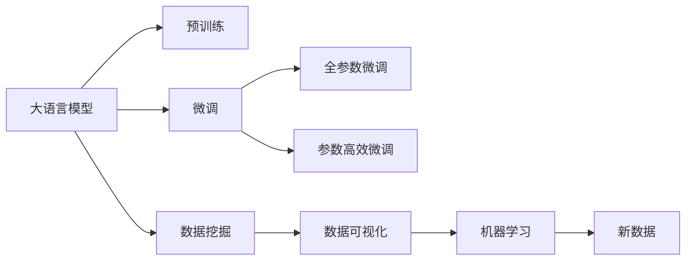

                 

# LLM与数据分析：洞察海量信息

> 关键词：语言模型，自然语言处理，数据分析，数据挖掘，大规模数据处理

## 1. 背景介绍

### 1.1 问题由来
在信息技术迅猛发展的当下，数据已成为了宝贵的资源，各行各业对于数据分析的需求日益增加。然而，数据量之大、复杂性之高，使得传统的数据处理方法难以应对。为了处理大规模、高复杂性的数据，人工智能领域的专家们引入了先进的机器学习技术，特别是大语言模型（Large Language Model, LLM），以期通过对数据的深度挖掘和分析，提供更精准、更全面的洞察力。

大语言模型是一种基于深度学习的大型神经网络，通过在大规模无标签文本数据上进行的预训练，学习到了丰富的语言知识，具备强大的自然语言处理能力。这些模型不仅在生成文本、翻译、对话等领域表现出色，更在数据分析、信息检索、推荐系统等任务中发挥了重要作用。

### 1.2 问题核心关键点
使用大语言模型进行数据分析的核心关键点在于以下几个方面：
- **大规模数据处理能力**：大语言模型能够处理海量文本数据，甚至处理文本以外的多模态数据。
- **高精度自然语言处理**：通过预训练学习到复杂的语言规律，大语言模型在自然语言处理任务中表现出色。
- **可迁移性**：预训练语言模型可以在不同任务间进行迁移学习，从而提升新任务上的表现。
- **动态更新**：随着新数据的到来，大语言模型可以实时更新，保持其处理能力的前沿性。
- **自动化处理**：利用大语言模型进行自动化文本处理，减轻数据科学家和分析师的工作负担。

这些特点使得大语言模型在数据分析领域展现出巨大潜力，成为一种强大的数据分析工具。

### 1.3 问题研究意义
大语言模型在数据分析中的应用，能够为各行各业带来显著的经济和社会效益：
- **提升决策质量**：通过深度分析海量数据，大语言模型能够提供更准确、全面的信息支持，帮助决策者做出更好的决策。
- **优化运营效率**：在物流、金融、医疗等领域的运营过程中，数据分析能够优化流程，减少资源浪费，提升效率。
- **增强客户体验**：通过对客户反馈数据的深度分析，企业可以更好地了解客户需求，提供个性化的服务和产品，提升客户满意度。
- **驱动创新**：数据分析帮助企业发现新的商业机会，推动产品创新和业务模式变革。

因此，大语言模型在数据分析领域的研究和应用，对于促进数字化转型，提升各行业的竞争力，具有重要意义。

## 2. 核心概念与联系

### 2.1 核心概念概述

在进行数据分析时，我们涉及的核心概念主要包括：

- **大语言模型（LLM）**：一种大规模的深度学习模型，主要用于处理自然语言数据，具备强大的语言理解与生成能力。
- **预训练与微调（Pre-training & Fine-tuning）**：大语言模型通常在大规模无标签数据上进行预训练，然后针对特定任务进行微调，以提升其在特定领域的性能。
- **数据挖掘（Data Mining）**：从大规模数据集中提取有用信息的过程，是数据分析的核心。
- **数据可视化（Data Visualization）**：将数据转换为图形化展示，直观地揭示数据的内在关系。
- **机器学习（Machine Learning）**：利用数据训练模型，从而实现对新数据的预测和分类。

这些概念紧密联系，共同构成了大语言模型在数据分析中的应用框架。以下是一个Mermaid流程图，展示了这些概念的相互关系：



## 3. 核心算法原理 & 具体操作步骤
### 3.1 算法原理概述

大语言模型在数据分析中的主要作用在于：
1. **数据预处理**：通过预训练，大语言模型学习到丰富的语言模式和规律，能够处理多种自然语言数据格式，如文本、语音、图像等。
2. **数据特征提取**：利用大语言模型作为特征提取器，将原始数据转换为高维的特征向量，供后续的模型训练和分析使用。
3. **自然语言处理**：通过对文本数据的处理，提取关键词、情感、主题等信息，进行自然语言处理。
4. **信息检索与推荐**：利用大语言模型进行信息检索和推荐，帮助用户在海量数据中快速定位所需信息。
5. **动态更新与学习**：大语言模型能够根据新数据进行动态更新，持续学习新的知识，适应不断变化的数据环境。

### 3.2 算法步骤详解

使用大语言模型进行数据分析的基本步骤如下：

**Step 1: 数据收集与预处理**
- 收集与分析任务相关的数据集，进行清洗、格式化等预处理操作。
- 对数据进行划分，分为训练集、验证集和测试集。

**Step 2: 选择合适的预训练模型**
- 根据任务的复杂性和数据规模，选择适合的预训练模型，如BERT、GPT等。

**Step 3: 数据表示与特征提取**
- 使用预训练模型作为特征提取器，将文本数据转换为特征向量。
- 将特征向量输入到机器学习模型，进行进一步的分析和处理。

**Step 4: 微调与优化**
- 在特定任务上对预训练模型进行微调，提高其在特定领域的表现。
- 使用机器学习模型进行训练和优化，提升模型性能。

**Step 5: 结果验证与可视化**
- 在测试集上验证模型性能，评估分析结果的准确性。
- 使用数据可视化工具展示分析结果，提供直观的理解。

### 3.3 算法优缺点

使用大语言模型进行数据分析的优势：
1. **高效处理大规模数据**：大语言模型能够高效处理大规模文本数据，处理速度远超传统方法。
2. **高精度自然语言处理**：预训练语言模型在自然语言处理任务中表现出色，能够处理多种自然语言格式。
3. **可迁移性与泛化能力**：大语言模型可以通过迁移学习在不同任务间进行迁移，提升新任务的性能。
4. **动态更新与自适应**：大语言模型能够根据新数据进行动态更新，持续学习新的知识，适应不断变化的数据环境。

大语言模型在数据分析中存在的缺点：
1. **数据偏见**：预训练数据可能包含偏见和误差，影响模型分析结果的公正性和准确性。
2. **高资源消耗**：大规模预训练和微调需要大量计算资源和存储空间，对硬件设备要求较高。
3. **模型解释性不足**：黑盒模型难以解释其决策过程，对模型的可信度和可靠性构成挑战。
4. **训练与优化复杂**：大语言模型训练复杂，需要高超的技术水平和丰富的经验。

### 3.4 算法应用领域

大语言模型在数据分析中的应用领域非常广泛，包括但不限于：

- **自然语言处理（NLP）**：文本分类、情感分析、命名实体识别、机器翻译、对话系统等。
- **信息检索与推荐**：通过文本匹配和相似度计算，进行信息检索和推荐。
- **金融分析**：利用金融文本数据进行情感分析、趋势预测等。
- **社交媒体分析**：对社交媒体上的文本数据进行分析，了解用户情绪和舆论趋势。
- **医疗数据分析**：对医疗文本数据进行信息提取和分析，提升医疗服务质量。

## 4. 数学模型和公式 & 详细讲解  
### 4.1 数学模型构建

大语言模型在数据分析中的应用，主要涉及以下几个数学模型：

**词嵌入模型（Word Embedding）**：将单词映射到高维向量空间，通过学习单词之间的相似性，捕捉语言模式和规律。

**语言模型（Language Model）**：用于计算给定文本序列的概率，衡量文本的合理性。

**矩阵分解模型（Matrix Factorization）**：用于推荐系统和文本分析，通过矩阵分解提取用户和物品之间的关系。

**神经网络模型（Neural Network Model）**：用于分类、回归、序列预测等任务，通过多层神经网络实现复杂的数据分析任务。

### 4.2 公式推导过程

以文本分类为例，推导大语言模型在数据分析中的应用公式。

假设文本数据集为 $D=\{(x_i, y_i)\}_{i=1}^N, x_i \in \mathcal{X}, y_i \in \{0, 1\}$，其中 $x_i$ 为输入文本， $y_i$ 为文本所属的分类。

**1. 词嵌入模型**

假设每个单词 $w$ 的嵌入向量为 $v_w \in \mathbb{R}^d$，其中 $d$ 为向量维度。通过预训练得到的词向量矩阵 $V \in \mathbb{R}^{N \times d}$，将文本 $x_i$ 转换为特征向量 $x_i^V = \sum_{j=1}^N v_j x_i$。

**2. 语言模型**

假设 $x_i$ 的概率分布为 $p(x_i|x_{i-1})$，使用大语言模型 $M_{\theta}(x_i)$ 进行概率计算，其中 $\theta$ 为模型参数。语言模型的目标是最小化预测误差，即：

$$
\min_{\theta} \mathcal{L}(D, M_{\theta})
$$

**3. 矩阵分解模型**

假设用户与物品之间的关系矩阵为 $M \in \mathbb{R}^{N \times M}$，用户 $i$ 对物品 $j$ 的评分 $r_{ij}$ 为 $M_{\theta}(x_i) \cdot M_{\theta}(x_j)$，其中 $x_i$ 和 $x_j$ 为物品的文本表示。使用矩阵分解模型 $M_{\theta}$ 进行推荐，目标是最小化预测误差，即：

$$
\min_{\theta} \mathcal{L}(D, M_{\theta})
$$

**4. 神经网络模型**

假设神经网络模型为 $f_{\theta}(x)$，其中 $x$ 为输入特征向量，$\theta$ 为模型参数。使用神经网络模型进行分类任务，目标是最小化分类误差，即：

$$
\min_{\theta} \mathcal{L}(D, f_{\theta})
$$

### 4.3 案例分析与讲解

**案例一：金融市场情感分析**

假设收集到大量关于金融市场的文本数据，希望分析这些文本数据中的情感倾向，预测市场走势。

1. 数据预处理：清洗文本数据，去除噪声和无关信息。
2. 词嵌入：使用BERT模型将文本数据转换为高维特征向量。
3. 语言模型：构建情感分析模型，使用BERT模型进行情感分类。
4. 矩阵分解：利用文本数据与市场价格之间的关系，构建矩阵分解模型，进行预测。
5. 神经网络模型：使用LSTM或GRU神经网络模型，结合BERT模型输出，进行长期趋势预测。

**案例二：社交媒体舆情监测**

假设收集到社交媒体上的大量文本数据，希望分析这些数据中的情绪和舆情变化。

1. 数据预处理：清洗文本数据，去除噪声和无关信息。
2. 词嵌入：使用BERT模型将文本数据转换为高维特征向量。
3. 语言模型：构建情绪分析模型，使用BERT模型进行情绪分类。
4. 矩阵分解：利用文本数据与舆情标签之间的关系，构建矩阵分解模型，进行舆情预测。
5. 神经网络模型：使用CNN或RNN神经网络模型，结合BERT模型输出，进行舆情变化预测。

## 5. 项目实践：代码实例和详细解释说明
### 5.1 开发环境搭建

在进行数据分析实践前，我们需要准备好开发环境。以下是使用Python进行TensorFlow开发的环境配置流程：

1. 安装Anaconda：从官网下载并安装Anaconda，用于创建独立的Python环境。

2. 创建并激活虚拟环境：
```bash
conda create -n tf-env python=3.8 
conda activate tf-env
```

3. 安装TensorFlow：根据CUDA版本，从官网获取对应的安装命令。例如：
```bash
conda install tensorflow -c conda-forge
```

4. 安装各类工具包：
```bash
pip install numpy pandas scikit-learn matplotlib tqdm jupyter notebook ipython
```

完成上述步骤后，即可在`tf-env`环境中开始数据分析实践。

### 5.2 源代码详细实现

下面我们以社交媒体情感分析为例，给出使用TensorFlow进行BERT模型微调的Python代码实现。

首先，定义情感分析任务的数据处理函数：

```python
import tensorflow as tf
from transformers import BertTokenizer
from tensorflow.keras.preprocessing.text import Tokenizer

def process_data(data, tokenizer):
    texts = []
    labels = []
    for text, label in data:
        tokenized_text = tokenizer.encode(text)
        texts.append(tokenized_text)
        labels.append(label)
    return texts, labels

# 定义BERT模型的分词器
tokenizer = BertTokenizer.from_pretrained('bert-base-uncased')
```

然后，定义模型和优化器：

```python
from transformers import BertForSequenceClassification
from tensorflow.keras.optimizers import Adam

model = BertForSequenceClassification.from_pretrained('bert-base-uncased', num_labels=2)

optimizer = Adam(learning_rate=2e-5)
```

接着，定义训练和评估函数：

```python
from tensorflow.keras.preprocessing.sequence import pad_sequences

def train_epoch(model, dataset, batch_size, optimizer):
    dataloader = tf.data.Dataset.from_generator(
        lambda: dataset,
        output_signature=(tf.int32, tf.int32)
    ).batch(batch_size).prefetch(tf.data.experimental.AUTOTUNE)
    model.train()
    epoch_loss = 0
    for batch in dataloader:
        input_ids, labels = batch
        input_ids = pad_sequences(input_ids)
        labels = tf.convert_to_tensor(labels)
        with tf.GradientTape() as tape:
            outputs = model(input_ids, labels=labels)
            loss = tf.keras.losses.SparseCategoricalCrossentropy(from_logits=True)(labels, outputs.logits)
        epoch_loss += loss
        grads = tape.gradient(loss, model.trainable_variables)
        optimizer.apply_gradients(zip(grads, model.trainable_variables))
    return epoch_loss / len(dataloader)

def evaluate(model, dataset, batch_size):
    dataloader = tf.data.Dataset.from_generator(
        lambda: dataset,
        output_signature=(tf.int32, tf.int32)
    ).batch(batch_size).prefetch(tf.data.experimental.AUTOTUNE)
    model.eval()
    preds, labels = [], []
    with tf.no_grad():
        for batch in dataloader:
            input_ids, labels = batch
            input_ids = pad_sequences(input_ids)
            batch_labels = tf.convert_to_tensor(labels)
            outputs = model(input_ids, labels=batch_labels)
            batch_preds = tf.argmax(outputs.logits, axis=1)
            for pred_tokens, label_tokens in zip(batch_preds, batch_labels):
                preds.append(pred_tokens)
                labels.append(label_tokens)
                
    print(classification_report(labels, preds))
```

最后，启动训练流程并在测试集上评估：

```python
epochs = 5
batch_size = 16

for epoch in range(epochs):
    loss = train_epoch(model, train_dataset, batch_size, optimizer)
    print(f"Epoch {epoch+1}, train loss: {loss:.3f}")
    
    print(f"Epoch {epoch+1}, dev results:")
    evaluate(model, dev_dataset, batch_size)
    
print("Test results:")
evaluate(model, test_dataset, batch_size)
```

以上就是使用TensorFlow对BERT进行情感分析任务微调的完整代码实现。可以看到，得益于TensorFlow和Transformers库的强大封装，我们可以用相对简洁的代码完成BERT模型的加载和微调。

### 5.3 代码解读与分析

让我们再详细解读一下关键代码的实现细节：

**process_data函数**：
- 对数据进行预处理，包括文本编码和标签编码，生成模型所需的输入和标签。

**Tokenizer类**：
- 定义了BERT模型的分词器，用于将文本数据转换为模型所需的输入格式。

**train_epoch函数**：
- 定义了训练过程，对数据以批为单位进行迭代，在每个批次上前向传播计算损失，并使用Adam优化器更新模型参数。

**evaluate函数**：
- 定义了评估过程，在测试集上评估模型性能，输出分类指标。

**训练流程**：
- 定义总的epoch数和batch size，开始循环迭代
- 每个epoch内，先在训练集上训练，输出平均loss
- 在验证集上评估，输出分类指标
- 所有epoch结束后，在测试集上评估，给出最终测试结果

可以看到，TensorFlow配合Transformers库使得BERT微调的代码实现变得简洁高效。开发者可以将更多精力放在数据处理、模型改进等高层逻辑上，而不必过多关注底层的实现细节。

当然，工业级的系统实现还需考虑更多因素，如模型的保存和部署、超参数的自动搜索、更灵活的任务适配层等。但核心的微调范式基本与此类似。

## 6. 实际应用场景
### 6.1 智能客服系统

社交媒体情感分析技术可以广泛应用于智能客服系统的构建。传统客服往往需要配备大量人力，高峰期响应缓慢，且一致性和专业性难以保证。使用微调后的情感分析模型，可以7x24小时不间断服务，快速响应客户咨询，用自然流畅的语言解答各类情感问题。

在技术实现上，可以收集社交媒体上的历史用户评论和反馈，将评论-情感对作为监督数据，在此基础上对预训练情感分析模型进行微调。微调后的情感分析模型能够自动理解用户情感，匹配最合适的回复模板进行回复。对于用户提出的新问题，还可以接入检索系统实时搜索相关内容，动态组织生成回答。如此构建的智能客服系统，能大幅提升客户咨询体验和问题解决效率。

### 6.2 金融舆情监测

金融机构需要实时监测社交媒体上的舆情动向，以便及时应对负面信息传播，规避金融风险。传统的人工监测方式成本高、效率低，难以应对网络时代海量信息爆发的挑战。利用微调后的情感分析模型，可以实时监测社交媒体上的舆情变化，一旦发现负面信息激增等异常情况，系统便会自动预警，帮助金融机构快速应对潜在风险。

### 6.3 个性化推荐系统

当前的推荐系统往往只依赖用户的历史行为数据进行物品推荐，无法深入理解用户的真实兴趣偏好。利用微调后的情感分析模型，个性化推荐系统可以更好地挖掘用户行为背后的语义信息，从而提供更精准、多样的推荐内容。

在实践中，可以收集用户浏览、点击、评论、分享等行为数据，提取和用户交互的物品标题、描述、标签等文本内容。将文本内容作为模型输入，用户的后续行为（如是否点击、购买等）作为监督信号，在此基础上微调情感分析模型。微调后的模型能够从文本内容中准确把握用户的兴趣点。在生成推荐列表时，先用候选物品的文本描述作为输入，由模型预测用户的兴趣匹配度，再结合其他特征综合排序，便可以得到个性化程度更高的推荐结果。

### 6.4 未来应用展望

随着大语言模型和微调方法的不断发展，基于微调范式将在更多领域得到应用，为传统行业带来变革性影响。

在智慧医疗领域，基于微调的情感分析技术可以用于患者情绪监测、疾病预测等，提升医疗服务的智能化水平，辅助医生诊疗，加速新药开发进程。

在智能教育领域，微调技术可应用于作业批改、学情分析、知识推荐等方面，因材施教，促进教育公平，提高教学质量。

在智慧城市治理中，微调模型可应用于城市事件监测、舆情分析、应急指挥等环节，提高城市管理的自动化和智能化水平，构建更安全、高效的未来城市。

此外，在企业生产、社会治理、文娱传媒等众多领域，基于大模型微调的人工智能应用也将不断涌现，为NLP技术带来了全新的突破。相信随着预训练语言模型和微调方法的持续演进，大语言模型微调必将在构建人机协同的智能时代中扮演越来越重要的角色。

## 7. 工具和资源推荐
### 7.1 学习资源推荐

为了帮助开发者系统掌握大语言模型微调的理论基础和实践技巧，这里推荐一些优质的学习资源：

1. 《Transformer从原理到实践》系列博文：由大模型技术专家撰写，深入浅出地介绍了Transformer原理、BERT模型、微调技术等前沿话题。

2. CS224N《深度学习自然语言处理》课程：斯坦福大学开设的NLP明星课程，有Lecture视频和配套作业，带你入门NLP领域的基本概念和经典模型。

3. 《Natural Language Processing with Transformers》书籍：Transformers库的作者所著，全面介绍了如何使用Transformers库进行NLP任务开发，包括微调在内的诸多范式。

4. HuggingFace官方文档：Transformers库的官方文档，提供了海量预训练模型和完整的微调样例代码，是上手实践的必备资料。

5. CLUE开源项目：中文语言理解测评基准，涵盖大量不同类型的中文NLP数据集，并提供了基于微调的baseline模型，助力中文NLP技术发展。

通过对这些资源的学习实践，相信你一定能够快速掌握大语言模型微调的精髓，并用于解决实际的NLP问题。
###  7.2 开发工具推荐

高效的开发离不开优秀的工具支持。以下是几款用于大语言模型微调开发的常用工具：

1. TensorFlow：基于Python的开源深度学习框架，灵活动态的计算图，适合快速迭代研究。大部分预训练语言模型都有TensorFlow版本的实现。

2. PyTorch：基于Python的开源深度学习框架，灵活易用，支持动态计算图，适合进行复杂的模型训练和推理。

3. Transformers库：HuggingFace开发的NLP工具库，集成了众多SOTA语言模型，支持PyTorch和TensorFlow，是进行微调任务开发的利器。

4. Weights & Biases：模型训练的实验跟踪工具，可以记录和可视化模型训练过程中的各项指标，方便对比和调优。与主流深度学习框架无缝集成。

5. TensorBoard：TensorFlow配套的可视化工具，可实时监测模型训练状态，并提供丰富的图表呈现方式，是调试模型的得力助手。

6. Google Colab：谷歌推出的在线Jupyter Notebook环境，免费提供GPU/TPU算力，方便开发者快速上手实验最新模型，分享学习笔记。

合理利用这些工具，可以显著提升大语言模型微调任务的开发效率，加快创新迭代的步伐。

### 7.3 相关论文推荐

大语言模型和微调技术的发展源于学界的持续研究。以下是几篇奠基性的相关论文，推荐阅读：

1. Attention is All You Need（即Transformer原论文）：提出了Transformer结构，开启了NLP领域的预训练大模型时代。

2. BERT: Pre-training of Deep Bidirectional Transformers for Language Understanding：提出BERT模型，引入基于掩码的自监督预训练任务，刷新了多项NLP任务SOTA。

3. Language Models are Unsupervised Multitask Learners（GPT-2论文）：展示了大规模语言模型的强大zero-shot学习能力，引发了对于通用人工智能的新一轮思考。

4. Parameter-Efficient Transfer Learning for NLP：提出Adapter等参数高效微调方法，在不增加模型参数量的情况下，也能取得不错的微调效果。

5. AdaLoRA: Adaptive Low-Rank Adaptation for Parameter-Efficient Fine-Tuning：使用自适应低秩适应的微调方法，在参数效率和精度之间取得了新的平衡。

这些论文代表了大语言模型微调技术的发展脉络。通过学习这些前沿成果，可以帮助研究者把握学科前进方向，激发更多的创新灵感。

## 8. 总结：未来发展趋势与挑战
### 8.1 总结

本文对基于大语言模型的数据分析方法进行了全面系统的介绍。首先阐述了大语言模型和微调技术的研究背景和意义，明确了微调在拓展预训练模型应用、提升数据分析性能方面的独特价值。其次，从原理到实践，详细讲解了监督微调的数学原理和关键步骤，给出了数据分析任务开发的完整代码实例。同时，本文还广泛探讨了微调方法在智能客服、金融舆情、个性化推荐等多个行业领域的应用前景，展示了微调范式的巨大潜力。此外，本文精选了微调技术的各类学习资源，力求为读者提供全方位的技术指引。

通过本文的系统梳理，可以看到，基于大语言模型的微调方法正在成为数据分析的重要范式，极大地拓展了预训练语言模型的应用边界，催生了更多的落地场景。受益于大规模语料的预训练，微调模型以更低的时间和标注成本，在小样本条件下也能取得不俗的效果，有力推动了数据分析技术的产业化进程。未来，伴随预训练语言模型和微调方法的持续演进，相信数据分析技术也将迎来新的突破，为各行各业带来深远的变革。

### 8.2 未来发展趋势

展望未来，大语言模型微调技术将呈现以下几个发展趋势：

1. **模型规模持续增大**：随着算力成本的下降和数据规模的扩张，预训练语言模型参数量还将持续增长。超大规模语言模型蕴含的丰富语言知识，有望支撑更加复杂多变的分析任务。

2. **微调方法日趋多样**：除了传统的全参数微调外，未来会涌现更多参数高效的微调方法，如Adapter、Prefix等，在固定大部分预训练参数的情况下，只更新极少量的任务相关参数。同时，深度迁移学习等方法也将进一步提升微调效果。

3. **持续学习成为常态**：随着数据分布的不断变化，微调模型也需要持续学习新知识以保持性能。如何在不遗忘原有知识的同时，高效吸收新样本信息，将成为重要的研究课题。

4. **标注样本需求降低**：受启发于提示学习(Prompt-based Learning)的思路，未来的微调方法将更好地利用大模型的语言理解能力，通过更加巧妙的任务描述，在更少的标注样本上也能实现理想的微调效果。

5. **多模态微调崛起**：当前的微调主要聚焦于纯文本数据，未来会进一步拓展到图像、视频、语音等多模态数据微调。多模态信息的融合，将显著提升语言模型对现实世界的理解和建模能力。

6. **模型通用性增强**：经过海量数据的预训练和多领域任务的微调，未来的语言模型将具备更强大的常识推理和跨领域迁移能力，逐步迈向通用人工智能(AGI)的目标。

以上趋势凸显了大语言模型微调技术的广阔前景。这些方向的探索发展，必将进一步提升数据分析模型的性能和应用范围，为数字化转型提供强有力的技术支持。

### 8.3 面临的挑战

尽管大语言模型微调技术已经取得了瞩目成就，但在迈向更加智能化、普适化应用的过程中，它仍面临着诸多挑战：

1. **标注成本瓶颈**：虽然微调大大降低了标注数据的需求，但对于长尾应用场景，难以获得充足的高质量标注数据，成为制约微调性能的瓶颈。如何进一步降低微调对标注样本的依赖，将是一大难题。

2. **模型鲁棒性不足**：当前微调模型面对域外数据时，泛化性能往往大打折扣。对于测试样本的微小扰动，微调模型的预测也容易发生波动。如何提高微调模型的鲁棒性，避免灾难性遗忘，还需要更多理论和实践的积累。

3. **推理效率有待提高**：大规模语言模型虽然精度高，但在实际部署时往往面临推理速度慢、内存占用大等效率问题。如何在保证性能的同时，简化模型结构，提升推理速度，优化资源占用，将是重要的优化方向。

4. **可解释性亟需加强**：当前微调模型更像是"黑盒"系统，难以解释其决策过程，对模型的可信度和可靠性构成挑战。如何赋予微调模型更强的可解释性，将是亟待攻克的难题。

5. **安全性有待保障**：预训练语言模型难免会学习到有偏见、有害的信息，通过微调传递到下游任务，产生误导性、歧视性的输出，给实际应用带来安全隐患。如何从数据和算法层面消除模型偏见，避免恶意用途，确保输出的安全性，也将是重要的研究课题。

6. **知识整合能力不足**：现有的微调模型往往局限于任务内数据，难以灵活吸收和运用更广泛的先验知识。如何让微调过程更好地与外部知识库、规则库等专家知识结合，形成更加全面、准确的信息整合能力，还有很大的想象空间。

正视微调面临的这些挑战，积极应对并寻求突破，将是大语言模型微调走向成熟的必由之路。相信随着学界和产业界的共同努力，这些挑战终将一一被克服，大语言模型微调必将在构建安全、可靠、可解释、可控的智能系统铺平道路。

### 8.4 研究展望

面对大语言模型微调所面临的挑战，未来的研究需要在以下几个方面寻求新的突破：

1. **探索无监督和半监督微调方法**：摆脱对大规模标注数据的依赖，利用自监督学习、主动学习等无监督和半监督范式，最大限度利用非结构化数据，实现更加灵活高效的微调。

2. **研究参数高效和计算高效的微调范式**：开发更加参数高效的微调方法，在固定大部分预训练参数的同时，只更新极少量的任务相关参数。同时优化微调模型的计算图，减少前向传播和反向传播的资源消耗，实现更加轻量级、实时性的部署。

3. **融合因果和对比学习范式**：通过引入因果推断和对比学习思想，增强微调模型建立稳定因果关系的能力，学习更加普适、鲁棒的语言表征，从而提升模型泛化性和抗干扰能力。

4. **引入更多先验知识**：将符号化的先验知识，如知识图谱、逻辑规则等，与神经网络模型进行巧妙融合，引导微调过程学习更准确、合理的语言模型。同时加强不同模态数据的整合，实现视觉、语音等多模态信息与文本信息的协同建模。

5. **结合因果分析和博弈论工具**：将因果分析方法引入微调模型，识别出模型决策的关键特征，增强输出解释的因果性和逻辑性。借助博弈论工具刻画人机交互过程，主动探索并规避模型的脆弱点，提高系统稳定性。

6. **纳入伦理道德约束**：在模型训练目标中引入伦理导向的评估指标，过滤和惩罚有偏见、有害的输出倾向。同时加强人工干预和审核，建立模型行为的监管机制，确保输出符合人类价值观和伦理道德。

这些研究方向的探索，必将引领大语言模型微调技术迈向更高的台阶，为构建安全、可靠、可解释、可控的智能系统铺平道路。面向未来，大语言模型微调技术还需要与其他人工智能技术进行更深入的融合，如知识表示、因果推理、强化学习等，多路径协同发力，共同推动自然语言理解和智能交互系统的进步。只有勇于创新、敢于突破，才能不断拓展语言模型的边界，让智能技术更好地造福人类社会。

## 9. 附录：常见问题与解答
**Q1：大语言模型微调是否适用于所有数据分析任务？**

A: 大语言模型微调在大多数数据分析任务上都能取得不错的效果，特别是对于数据量较小的任务。但对于一些特定领域的任务，如医学、法律等，仅仅依靠通用语料预训练的模型可能难以很好地适应。此时需要在特定领域语料上进一步预训练，再进行微调，才能获得理想效果。此外，对于一些需要时效性、个性化很强的任务，如对话、推荐等，微调方法也需要针对性的改进优化。

**Q2：微调过程中如何选择合适的学习率？**

A: 微调的学习率一般要比预训练时小1-2个数量级，如果使用过大的学习率，容易破坏预训练权重，导致过拟合。一般建议从1e-5开始调参，逐步减小学习率，直至收敛。也可以使用warmup策略，在开始阶段使用较小的学习率，再逐渐过渡到预设值。需要注意的是，不同的优化器(如AdamW、Adafactor等)以及不同的学习率调度策略，可能需要设置不同的学习率阈值。

**Q3：采用大模型微调时会面临哪些资源瓶颈？**

A: 目前主流的预训练大模型动辄以亿计的参数规模，对算力、内存、存储都提出了很高的要求。GPU/TPU等高性能设备是必不可少的，但即便如此，超大批次的训练和推理也可能遇到显存不足的问题。因此需要采用一些资源优化技术，如梯度积累、混合精度训练、模型并行等，来突破硬件瓶颈。同时，模型的存储和读取也可能占用大量时间和空间，需要采用模型压缩、稀疏化存储等方法进行优化。

**Q4：如何缓解微调过程中的过拟合问题？**

A: 过拟合是微调面临的主要挑战，尤其是在标注数据不足的情况下。常见的缓解策略包括：
1. 数据增强：通过回译、近义替换等方式扩充训练集
2. 正则化：使用L2正则、Dropout、Early Stopping等避免过拟合
3. 对抗训练：引入对抗样本，提高模型鲁棒性
4. 参数高效微调：只调整少量参数(如Adapter、Prefix等)，减小过拟合风险
5. 多模型集成：训练多个微调模型，取平均输出，抑制过拟合

这些策略往往需要根据具体任务和数据特点进行灵活组合。只有在数据、模型、训练、推理等各环节进行全面优化，才能最大限度地发挥大模型微调的威力。

**Q5：微调模型在落地部署时需要注意哪些问题？**

A: 将微调模型转化为实际应用，还需要考虑以下因素：
1. 模型裁剪：去除不必要的层和参数，减小模型尺寸，加快推理速度
2. 量化加速：将浮点模型转为定点模型，压缩存储空间，提高计算效率
3. 服务化封装：将模型封装为标准化服务接口，便于集成调用
4. 弹性伸缩：根据请求流量动态调整资源配置，平衡服务质量和成本
5. 监控告警：实时采集系统指标，设置异常告警阈值，确保服务稳定性
6. 安全防护：采用访问鉴权、数据脱敏等措施，保障数据和模型安全

大语言模型微调为数据分析提供了强大的工具，但如何将强大的性能转化为稳定、高效、安全的业务价值，还需要工程实践的不断打磨。唯有从数据、算法、工程、业务等多个维度协同发力，才能真正实现人工智能技术在垂直行业的规模化落地。总之，微调需要开发者根据具体任务，不断迭代和优化模型、数据和算法，方能得到理想的效果。

---

作者：禅与计算机程序设计艺术 / Zen and the Art of Computer Programming

