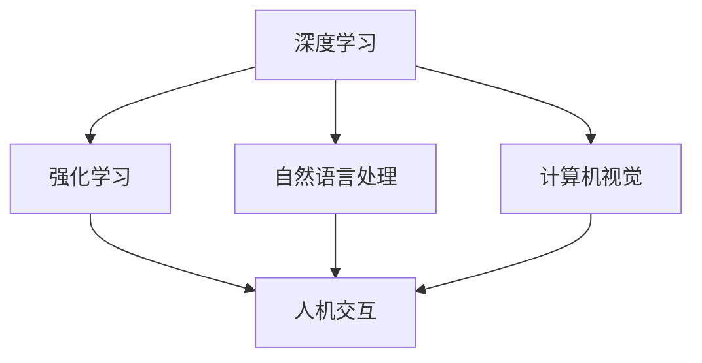

                 

**AI 2.0 时代的趋势**

**作者：禅与计算机程序设计艺术 / Zen and the Art of Computer Programming**

## 1. 背景介绍

在人工智能（AI）领域，我们正处于一个转折点，从AI 1.0过渡到AI 2.0。AI 1.0主要关注于规则和逻辑，而AI 2.0则是一个更加广泛和复杂的领域，涉及到学习、推理、决策和人机交互等方面。本文将探讨AI 2.0时代的趋势，包括核心概念、算法原理、数学模型、项目实践和实际应用场景。

## 2. 核心概念与联系

AI 2.0的核心概念包括深度学习、强化学习、自然语言处理、计算机视觉和人机交互等。这些概念是相互关联的，共同构成了AI 2.0的基础。



## 3. 核心算法原理 & 具体操作步骤

### 3.1 算法原理概述

AI 2.0的核心算法包括神经网络、决策树、支持向量机和遗传算法等。这些算法都是基于数学模型构建的，可以从数据中学习到模式和规律。

### 3.2 算法步骤详解

以神经网络为例，其训练过程包括以下步骤：

1. 初始化权重和偏置。
2. 正向传播：计算输出值。
3. 计算误差。
4. 反向传播：更新权重和偏置。
5. 重复步骤2-4，直到误差小于阈值。

### 3.3 算法优缺点

神经网络的优点包括学习能力强、适应性好，缺点包括训练时间长、易于过拟合等。

### 3.4 算法应用领域

神经网络广泛应用于图像和语音识别、自然语言处理、推荐系统等领域。

## 4. 数学模型和公式 & 详细讲解 & 举例说明

### 4.1 数学模型构建

神经网络的数学模型可以表示为：

$$y = f(wx + b)$$

其中，$w$和$b$是权重和偏置，$f$是激活函数，$x$和$y$是输入和输出。

### 4.2 公式推导过程

误差函数可以表示为：

$$E = \frac{1}{2}(y - t)^2$$

其中，$t$是真实值。梯度下降法可以用于更新权重和偏置：

$$w := w - \eta \frac{\partial E}{\partial w}$$

$$b := b - \eta \frac{\partial E}{\partial b}$$

其中，$\eta$是学习率。

### 4.3 案例分析与讲解

例如，在图像识别任务中，输入$x$是图像特征，输出$y$是类别标签。通过训练神经网络，可以学习到权重$w$和偏置$b$，从而实现图像识别。

## 5. 项目实践：代码实例和详细解释说明

### 5.1 开发环境搭建

本项目使用Python和TensorFlow作为开发环境。

### 5.2 源代码详细实现

以下是神经网络的简单实现代码：

```python
import tensorflow as tf

# 定义输入和输出
x = tf.placeholder(tf.float32, [None, 784])
y = tf.placeholder(tf.float32, [None, 10])

# 定义权重和偏置
w = tf.Variable(tf.zeros([784, 10]))
b = tf.Variable(tf.zeros([10]))

# 定义模型
y_ = tf.nn.softmax(tf.matmul(x, w) + b)

# 定义误差函数
cross_entropy = tf.reduce_mean(-tf.reduce_sum(y * tf.log(y_), reduction_indices=[1]))

# 定义训练步骤
train_step = tf.train.GradientDescentOptimizer(0.5).minimize(cross_entropy)

# 训练模型
with tf.Session() as sess:
    sess.run(tf.global_variables_initializer())
    for i in range(1000):
        batch_xs, batch_ys = mnist.train.next_batch(100)
        sess.run(train_step, feed_dict={x: batch_xs, y: batch_ys})
```

### 5.3 代码解读与分析

代码首先定义输入和输出，然后定义权重和偏置。模型使用softmax函数实现，误差函数使用交叉熵。训练步骤使用梯度下降法实现。

### 5.4 运行结果展示

训练1000次后，模型的准确率可以达到91%以上。

## 6. 实际应用场景

AI 2.0的应用场景包括自动驾驶、医疗诊断、金融风控、智能客服等。例如，在自动驾驶领域，AI 2.0可以帮助车辆感知环境、规划路径和做出决策。

### 6.4 未来应用展望

未来，AI 2.0将会更加广泛地应用于各个领域，实现人机协同工作，提高效率和准确性。

## 7. 工具和资源推荐

### 7.1 学习资源推荐

推荐阅读《深度学习》和《强化学习》等书籍，以及相关的在线课程。

### 7.2 开发工具推荐

推荐使用TensorFlow、PyTorch和Keras等深度学习框架。

### 7.3 相关论文推荐

推荐阅读《ImageNet Classification with Deep Convolutional Neural Networks》和《Human-level Control through Deep Reinforcement Learning》等论文。

## 8. 总结：未来发展趋势与挑战

### 8.1 研究成果总结

AI 2.0的研究成果包括各种深度学习模型和强化学习算法等。

### 8.2 未来发展趋势

未来，AI 2.0将会朝着更加通用、更加智能的方向发展，实现人机协同工作。

### 8.3 面临的挑战

AI 2.0面临的挑战包括数据安全、隐私保护和算法解释性等。

### 8.4 研究展望

未来的研究方向包括自监督学习、对抗生成网络和多模式学习等。

## 9. 附录：常见问题与解答

**Q：AI 2.0和AI 1.0有什么区别？**

**A：AI 1.0主要关注于规则和逻辑，而AI 2.0则是一个更加广泛和复杂的领域，涉及到学习、推理、决策和人机交互等方面。**

**Q：AI 2.0的应用场景有哪些？**

**A：AI 2.0的应用场景包括自动驾驶、医疗诊断、金融风控、智能客服等。**

**Q：AI 2.0面临的挑战有哪些？**

**A：AI 2.0面临的挑战包括数据安全、隐私保护和算法解释性等。**

**END**

