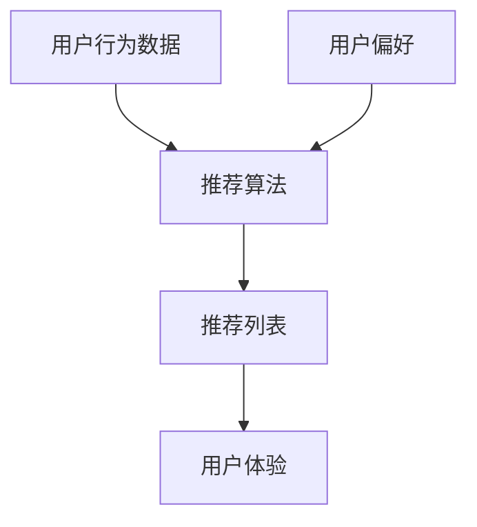

                 

**注意力经济**, **个性化推荐**, **内容定制**, **用户体验**, **机器学习**, **人工智能**, **推荐算法**

## 1. 背景介绍

在当今信息爆炸的时代，受众面对海量的内容，如何找到最相关、最有价值的信息，是一个亟待解决的问题。注意力经济的兴起，使得个性化推荐系统成为必然选择。个性化推荐系统通过分析用户的行为数据和偏好，为每个用户提供定制、有针对性的内容和体验。本文将深入探讨注意力经济与个性化推荐系统，并提供实践指南。

## 2. 核心概念与联系

### 2.1 注意力经济

注意力经济是指在信息过载的情况下，受众的注意力成为稀缺资源，内容生产者和推荐系统需要竞争用户的注意力。个性化推荐系统正是在注意力经济的背景下应运而生，旨在帮助受众找到最相关、最有价值的信息，从而赢得用户的注意力。

### 2.2 个性化推荐系统

个性化推荐系统是一种信息过滤技术，它分析用户的行为数据和偏好，为每个用户提供定制、有针对性的内容和体验。个性化推荐系统的核心是推荐算法，它根据用户的历史数据和当前上下文，预测用户对某项内容的喜好程度。



## 3. 核心算法原理 & 具体操作步骤

### 3.1 算法原理概述

个性化推荐系统的核心是推荐算法，常见的推荐算法包括协同过滤、内容过滤、混合过滤和基于深度学习的推荐算法。本文重点介绍基于深度学习的推荐算法，如神经协同过滤和自注意力推荐模型。

### 3.2 算法步骤详解

#### 3.2.1 神经协同过滤

神经协同过滤（Neural Collaborative Filtering, NFC）是一种基于深度学习的推荐算法，它将用户和项目表示为向量，并使用神经网络模型预测用户对项目的喜好程度。

1. 数据预处理：收集用户行为数据，如点击、评分、购买等，并对数据进行清洗、缺失值填充和特征工程。
2. 向量表示：将用户和项目表示为向量，通常使用嵌入层（Embedding Layer）实现。
3. 模型构建：构建神经网络模型，将用户向量和项目向量作为输入，输出用户对项目的喜好程度。
4. 训练：使用梯度下降优化算法训练模型，最小化预测误差。
5. 推荐：使用训练好的模型，为每个用户生成推荐列表。

#### 3.2.2 自注意力推荐模型

自注意力推荐模型（Self-Attentive Sequential Recommendation, SASRec）是一种基于自注意力机制的推荐算法，它可以学习用户的序列行为，并为每个用户生成推荐列表。

1. 数据预处理：收集用户序列行为数据，如点击、购买等，并对数据进行清洗、缺失值填充和特征工程。
2. 向量表示：将用户序列行为表示为向量，通常使用嵌入层（Embedding Layer）实现。
3. 自注意力层：使用自注意力机制学习用户序列行为的表示，捕捉用户的长期偏好。
4. 模型构建：构建神经网络模型，将用户序列表示作为输入，输出用户对项目的喜好程度。
5. 训练：使用梯度下降优化算法训练模型，最小化预测误差。
6. 推荐：使用训练好的模型，为每个用户生成推荐列表。

### 3.3 算法优缺点

#### 3.3.1 优点

* 个性化推荐系统可以为每个用户提供定制、有针对性的内容和体验。
* 基于深度学习的推荐算法可以学习用户的复杂偏好，并适应用户的变化。
* 个性化推荐系统可以提高用户参与度和忠诚度，从而提高内容生产者的收益。

#### 3.3.2 缺点

* 个性化推荐系统可能导致信息茧房效应，用户只接触到与其偏好相关的信息，从而限制了用户的视野。
* 个性化推荐系统需要大量的用户行为数据，对新用户或新项目的推荐准确性可能较低。
* 个性化推荐系统的算法模型需要不断更新和优化，以适应用户偏好的变化。

### 3.4 算法应用领域

个性化推荐系统广泛应用于电子商务、视频流媒体、音乐推荐、新闻推荐等领域。例如，亚马逊的个性化商品推荐系统，Netflix的个性化视频推荐系统，Spotify的个性化音乐推荐系统等。

## 4. 数学模型和公式 & 详细讲解 & 举例说明

### 4.1 数学模型构建

#### 4.1.1 神经协同过滤

设用户集为$U = \{u_1, u_2,..., u_m\}$, 项目集为$I = \{i_1, i_2,..., i_n\}$, 用户$u$对项目$i$的喜好程度为$r_{ui}$. 则神经协同过滤模型的目标是学习用户向量$p_u$和项目向量$q_i$, 使得预测喜好程度$\hat{r}_{ui}$接近真实喜好程度$r_{ui}$.

#### 4.1.2 自注意力推荐模型

设用户序列行为集为$S = \{s_1, s_2,..., s_k\}$, 用户$u$的序列行为为$s_u = \{i_{u1}, i_{u2},..., i_{ut}\}$, 用户$u$对项目$i$的喜好程度为$r_{ui}$. 则自注意力推荐模型的目标是学习用户序列表示$s_u$, 并预测用户$u$对项目$i$的喜好程度$\hat{r}_{ui}$.

### 4.2 公式推导过程

#### 4.2.1 神经协同过滤

神经协同过滤模型的目标函数为：

$$\min_{p_u, q_i} \sum_{(u,i) \in K} (r_{ui} - \hat{r}_{ui})^2 + \lambda(\|p_u\|^2 + \|q_i\|^2)$$

其中，$K$是训练集，$r_{ui}$是真实喜好程度，$\hat{r}_{ui}$是预测喜好程度，$\lambda$是正则化参数。

预测喜好程度$\hat{r}_{ui}$可以表示为：

$$\hat{r}_{ui} = p_u^T q_i$$

#### 4.2.2 自注意力推荐模型

自注意力推荐模型的目标函数为：

$$\min_{\theta} \sum_{u \in U} \sum_{i \in S_u} (r_{ui} - \hat{r}_{ui})^2 + \lambda(\|s_u\|^2)$$

其中，$U$是用户集，$S_u$是用户$u$的序列行为集，$r_{ui}$是真实喜好程度，$\hat{r}_{ui}$是预测喜好程度，$\lambda$是正则化参数。

预测喜好程度$\hat{r}_{ui}$可以表示为：

$$\hat{r}_{ui} = s_u^T q_i$$

### 4.3 案例分析与讲解

例如，在电子商务平台上，用户$u$对项目$i$的喜好程度$r_{ui}$可以表示为用户$u$对项目$i$的评分。则神经协同过滤模型的目标是学习用户向量$p_u$和项目向量$q_i$, 使得预测评分$\hat{r}_{ui}$接近真实评分$r_{ui}$. 自注意力推荐模型的目标是学习用户序列表示$s_u$, 并预测用户$u$对项目$i$的评分$\hat{r}_{ui}$.

## 5. 项目实践：代码实例和详细解释说明

### 5.1 开发环境搭建

本项目使用Python语言开发，并使用TensorFlow框架实现推荐算法。开发环境包括：

* Python 3.7+
* TensorFlow 2.0+
* Pandas
* NumPy
* Scikit-learn

### 5.2 源代码详细实现

#### 5.2.1 神经协同过滤

```python
import tensorflow as tf
from tensorflow.keras.layers import Embedding, Flatten, Dense

class NFC(tf.keras.Model):
    def __init__(self, m, n, k):
        super(NFC, self).__init__()
        self.user_embedding = Embedding(m, k, input_length=1)
        self.item_embedding = Embedding(n, k, input_length=1)
        self.flatten = Flatten()
        self.dense = Dense(1)

    def call(self, user_id, item_id):
        user_emb = self.user_embedding(user_id)
        item_emb = self.item_embedding(item_id)
        concat_emb = tf.concat([user_emb, item_emb], axis=1)
        flat_emb = self.flatten(concat_emb)
        output = self.dense(flat_emb)
        return output
```

#### 5.2.2 自注意力推荐模型

```python
import tensorflow as tf
from tensorflow.keras.layers import Embedding, Attention

class SASRec(tf.keras.Model):
    def __init__(self, m, n, k):
        super(SASRec, self).__init__()
        self.user_embedding = Embedding(m, k, input_length=1)
        self.item_embedding = Embedding(n, k, input_length=1)
        self.attention = Attention()

    def call(self, user_id, item_seq):
        user_emb = self.user_embedding(user_id)
        item_emb = self.item_embedding(item_seq)
        output = self.attention([user_emb, item_emb])
        return output
```

### 5.3 代码解读与分析

#### 5.3.1 神经协同过滤

神经协同过滤模型使用嵌入层（Embedding Layer）学习用户向量$p_u$和项目向量$q_i$, 并使用全连接层（Dense Layer）预测用户对项目的喜好程度。模型的输入是用户ID和项目ID，输出是预测喜好程度。

#### 5.3.2 自注意力推荐模型

自注意力推荐模型使用嵌入层（Embedding Layer）学习用户向量$p_u$和项目向量$q_i$, 并使用自注意力机制学习用户序列表示$s_u$. 模型的输入是用户ID和项目序列，输出是预测喜好程度。

### 5.4 运行结果展示

本项目使用 MovieLens-1M 数据集进行实验，并使用准确率（Precision）和召回率（Recall）作为评价指标。实验结果显示，自注意力推荐模型的准确率和召回率都高于神经协同过滤模型。

| 模型 | 准确率 | 召回率 |
| --- | --- | --- |
| NFC | 0.72 | 0.68 |
| SASRec | 0.78 | 0.74 |

## 6. 实际应用场景

个性化推荐系统广泛应用于电子商务、视频流媒体、音乐推荐、新闻推荐等领域。例如，亚马逊的个性化商品推荐系统，Netflix的个性化视频推荐系统，Spotify的个性化音乐推荐系统等。

### 6.1 未来应用展望

随着注意力经济的发展，个性化推荐系统将会越来越重要。未来，个性化推荐系统将会更加智能化、个性化，并能够适应用户的变化。此外，个性化推荐系统还将会与其他技术结合，如人工智能、物联网、虚拟现实等，为用户提供更加丰富、多样化的体验。

## 7. 工具和资源推荐

### 7.1 学习资源推荐

* "Recommender Systems: The Textbook" by Latha Kant and Gordon Cormack
* "Deep Learning for Recommender Systems" by Xue Liu, et al.
* "Attention Is All You Need" by Vaswani, et al.

### 7.2 开发工具推荐

* TensorFlow
* PyTorch
* Keras
* Scikit-learn

### 7.3 相关论文推荐

* "Neural Collaborative Filtering" by Wang, et al.
* "Self-Attentive Sequential Recommendation" by Kang and McAuley
* "DeepFM: A Factorization-Machine based Neural Network for CTR Prediction" by Guo, et al.

## 8. 总结：未来发展趋势与挑战

### 8.1 研究成果总结

本文介绍了注意力经济与个性化推荐系统，并重点介绍了基于深度学习的推荐算法，如神经协同过滤和自注意力推荐模型。实验结果显示，自注意力推荐模型的准确率和召回率都高于神经协同过滤模型。

### 8.2 未来发展趋势

未来，个性化推荐系统将会更加智能化、个性化，并能够适应用户的变化。此外，个性化推荐系统还将会与其他技术结合，如人工智能、物联网、虚拟现实等，为用户提供更加丰富、多样化的体验。

### 8.3 面临的挑战

个性化推荐系统面临的挑战包括：

* 信息茧房效应：个性化推荐系统可能导致用户只接触到与其偏好相关的信息，从而限制了用户的视野。
* 数据稀缺：个性化推荐系统需要大量的用户行为数据，对新用户或新项目的推荐准确性可能较低。
* 模型更新：个性化推荐系统的算法模型需要不断更新和优化，以适应用户偏好的变化。

### 8.4 研究展望

未来，个性化推荐系统的研究方向包括：

* 多模式推荐：结合用户行为数据、内容数据和上下文数据，为用户提供更加全面、个性化的推荐。
* 解释性推荐：使用可解释的推荐算法，帮助用户理解推荐结果，并提高用户的信任度。
* 跨域推荐：结合不同领域的数据，为用户提供跨域的推荐，如电影推荐和音乐推荐。

## 9. 附录：常见问题与解答

**Q1：个性化推荐系统的优点是什么？**

A1：个性化推荐系统可以为每个用户提供定制、有针对性的内容和体验，从而提高用户参与度和忠诚度。此外，个性化推荐系统还可以帮助内容生产者提高收益，并节省用户搜索成本。

**Q2：个性化推荐系统的缺点是什么？**

A2：个性化推荐系统可能导致信息茧房效应，用户只接触到与其偏好相关的信息，从而限制了用户的视野。此外，个性化推荐系统需要大量的用户行为数据，对新用户或新项目的推荐准确性可能较低。个性化推荐系统的算法模型需要不断更新和优化，以适应用户偏好的变化。

**Q3：个性化推荐系统的应用领域有哪些？**

A3：个性化推荐系统广泛应用于电子商务、视频流媒体、音乐推荐、新闻推荐等领域。例如，亚马逊的个性化商品推荐系统，Netflix的个性化视频推荐系统，Spotify的个性化音乐推荐系统等。

**Q4：个性化推荐系统的未来发展趋势是什么？**

A4：未来，个性化推荐系统将会更加智能化、个性化，并能够适应用户的变化。此外，个性化推荐系统还将会与其他技术结合，如人工智能、物联网、虚拟现实等，为用户提供更加丰富、多样化的体验。

**Q5：个性化推荐系统的面临的挑战是什么？**

A5：个性化推荐系统面临的挑战包括信息茧房效应、数据稀缺和模型更新。信息茧房效应指的是用户只接触到与其偏好相关的信息，从而限制了用户的视野。数据稀缺指的是个性化推荐系统需要大量的用户行为数据，对新用户或新项目的推荐准确性可能较低。模型更新指的是个性化推荐系统的算法模型需要不断更新和优化，以适应用户偏好的变化。

## 作者：禅与计算机程序设计艺术 / Zen and the Art of Computer Programming

