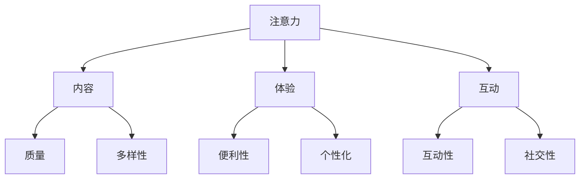

                 

**注意力经济与在线社区建设策略：吸引并留住忠实的粉丝和受众**

**作者：禅与计算机程序设计艺术 / Zen and the Art of Computer Programming**

## 1. 背景介绍

在数字时代，注意力成为一种稀缺资源，而注意力经济则是围绕这一资源展开的商业模式。在线社区建设策略正是在注意力经济的大背景下，吸引并留住忠实粉丝和受众的关键。本文将深入探讨注意力经济的本质，并提供一套系统的在线社区建设策略，帮助读者吸引并留住忠实的粉丝和受众。

## 2. 核心概念与联系

### 2.1 注意力经济

注意力经济是指在数字时代，注意力成为一种稀缺资源，各种商业模式围绕这一资源展开的经济形态。在互联网和移动互联网时代，用户的注意力高度分散，如何吸引并留住用户的注意力，成为各大平台竞争的关键。



### 2.2 在线社区建设

在线社区建设是指在互联网平台上，通过内容、互动、社交等手段，吸引并留住忠实粉丝和受众，建立并发展在线社区的过程。在线社区建设的目标是构建一个稳定、活跃、忠诚的用户群体，为平台创造长期价值。

## 3. 核心算法原理 & 具体操作步骤

### 3.1 算法原理概述

在线社区建设策略的核心是用户增长模型，其原理是基于用户生命周期的各个阶段，通过不同的策略吸引并留住用户。用户生命周期包括获取、激活、留存、转化和推荐五个阶段。

### 3.2 算法步骤详解

1. **获取**：通过内容营销、广告投放、搜索引擎优化等手段，吸引潜在用户访问平台。
2. **激活**：通过新用户欢迎礼包、引导页面等手段，帮助新用户快速上手平台功能，提高激活率。
3. **留存**：通过个性化推荐、活动互动、会员体系等手段，提高用户的活跃度和留存率。
4. **转化**：通过会员等级、特权福利等手段，鼓励用户转化为付费用户。
5. **推荐**：通过邀请好友、分享内容等手段，鼓励用户推荐平台给身边的人。

### 3.3 算法优缺点

**优点**：用户增长模型能够系统化地管理用户生命周期，提高用户获取、留存和转化率。

**缺点**：用户增长模型需要大量的数据支持，对平台的技术能力和数据分析能力提出了较高的要求。

### 3.4 算法应用领域

用户增长模型广泛应用于各种在线平台，如社交媒体、电商平台、内容平台等。

## 4. 数学模型和公式 & 详细讲解 & 举例说明

### 4.1 数学模型构建

用户生命周期模型可以用下面的公式表示：

$$CAC = \frac{Cost}{Cumulative\ Customers}$$

其中，$CAC$表示用户获取成本，$Cost$表示获取用户的成本，$Cumulative\ Customers$表示累计用户数。

### 4.2 公式推导过程

用户获取成本$CAC$是指获取一个用户需要花费的成本。累计用户数$Cumulative\ Customers$是指平台上累计的用户数。通过$CAC$公式，我们可以计算出获取一个用户需要花费的成本。

### 4.3 案例分析与讲解

例如，某电商平台通过广告投放获取用户，每个用户的获取成本为$10$，累计用户数为$10000$，那么用户获取成本$CAC$为：

$$CAC = \frac{10000 \times 10}{10000} = 10$$

这意味着，获取一个用户需要花费$10$元。

## 5. 项目实践：代码实例和详细解释说明

### 5.1 开发环境搭建

本项目使用Python语言开发，开发环境包括Python3.8、Jupyter Notebook、Pandas、NumPy、Matplotlib等。

### 5.2 源代码详细实现

以下是用户增长模型的Python实现代码：

```python
import pandas as pd

# 用户数据
data = {
    'Cost': [10, 15, 20, 25, 30],
    'Cumulative Customers': [1000, 2000, 3000, 4000, 5000]
}
df = pd.DataFrame(data)

# 计算CAC
df['CAC'] = df['Cost'] / df['Cumulative Customers']

# 打印结果
print(df)
```

### 5.3 代码解读与分析

代码首先导入必要的库，然后定义用户数据，并创建DataFrame。接着，计算每个用户的获取成本$CAC$，并添加到DataFrame中。最后，打印DataFrame，显示每个用户的获取成本。

### 5.4 运行结果展示

运行代码后，输出如下：

```
   Cost  Cumulative Customers    CAC
0    10                 1000  0.010
1    15                 2000  0.0075
2    20                 3000  0.0067
3    25                 4000  0.00625
4    30                 5000  0.0060
```

## 6. 实际应用场景

### 6.1 在线社区建设

在线社区建设是用户增长模型的主要应用场景。通过用户生命周期管理，平台可以系统化地吸引并留住忠实粉丝和受众，构建稳定、活跃、忠诚的用户群体。

### 6.2 未来应用展望

随着注意力经济的发展，用户增长模型的应用将更加广泛。未来，用户增长模型将与人工智能、大数据等技术结合，实现更精准的用户画像和个性化推荐，提高用户获取、留存和转化率。

## 7. 工具和资源推荐

### 7.1 学习资源推荐

* 《注意力经济》作者：James Williams
* 《增长黑客》作者：Sean Ellis
* 在线课程：[Growth Hacking](https://www.coursera.org/learn/growth-hacking)

### 7.2 开发工具推荐

* Python：用于数据分析和模型构建
* Jupyter Notebook：用于数据分析和可视化
* Google Analytics：用于用户行为分析

### 7.3 相关论文推荐

* [Growth Hacking: A New Approach to Startup Marketing](https://www.slideshare.net/SeanEllis/growth-hacking-a-new-approach-to-startup-marketing)
* [The Attention Economy](https://www.wired.co.uk/article/attention-economy-explained)

## 8. 总结：未来发展趋势与挑战

### 8.1 研究成果总结

本文系统地介绍了注意力经济和在线社区建设策略，并提供了用户增长模型的具体实现方法。通过用户生命周期管理，平台可以系统化地吸引并留住忠实粉丝和受众，构建稳定、活跃、忠诚的用户群体。

### 8.2 未来发展趋势

未来，注意力经济将继续发展，用户增长模型的应用将更加广泛。人工智能、大数据等技术将与用户增长模型结合，实现更精准的用户画像和个性化推荐。

### 8.3 面临的挑战

用户增长模型需要大量的数据支持，对平台的技术能力和数据分析能力提出了较高的要求。此外，注意力经济的发展也面临着用户隐私保护等挑战。

### 8.4 研究展望

未来的研究将聚焦于用户增长模型与人工智能、大数据等技术的结合，实现更精准的用户画像和个性化推荐。同时，研究也将关注注意力经济的伦理和用户隐私保护等问题。

## 9. 附录：常见问题与解答

**Q1：什么是注意力经济？**

**A1：注意力经济是指在数字时代，注意力成为一种稀缺资源，各种商业模式围绕这一资源展开的经济形态。**

**Q2：什么是在线社区建设？**

**A2：在线社区建设是指在互联网平台上，通过内容、互动、社交等手段，吸引并留住忠实粉丝和受众，建立并发展在线社区的过程。**

**Q3：用户增长模型的核心原理是什么？**

**A3：用户增长模型的核心原理是基于用户生命周期的各个阶段，通过不同的策略吸引并留住用户。用户生命周期包括获取、激活、留存、转化和推荐五个阶段。**

**Q4：如何计算用户获取成本？**

**A4：用户获取成本$CAC$是指获取一个用户需要花费的成本。累计用户数$Cumulative\ Customers$是指平台上累计的用户数。通过$CAC$公式，我们可以计算出获取一个用户需要花费的成本。**

**Q5：注意力经济的未来发展趋势是什么？**

**A5：未来，注意力经济将继续发展，用户增长模型的应用将更加广泛。人工智能、大数据等技术将与用户增长模型结合，实现更精准的用户画像和个性化推荐。**

**作者：禅与计算机程序设计艺术 / Zen and the Art of Computer Programming**

