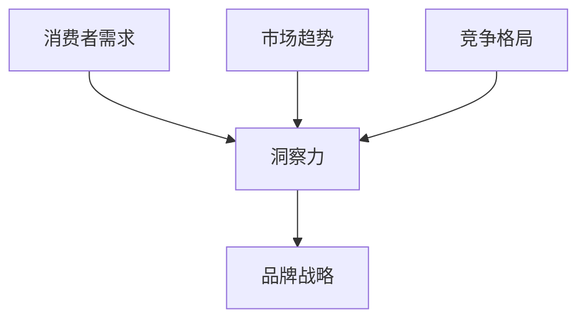

                 

**洞察力与品牌战略：市场洞察的艺术**

**作者：禅与计算机程序设计艺术 / Zen and the Art of Computer Programming**

## 1. 背景介绍

在当今快速变化的商业环境中，企业面临着前所未有的挑战。消费者需求多元化，市场竞争加剧，技术创新日新月异。品牌战略在这样的背景下变得尤为重要，它是企业在市场中立足的根本。然而，成功的品牌战略离不开对市场的深入洞察。本文将探讨市场洞察的艺术，帮助读者理解如何通过洞察力提升品牌战略。

## 2. 核心概念与联系

### 2.1 洞察力（Insight）

洞察力是指对事物本质的深刻理解，它超越了表面现象，揭示了事物的内在规律。在市场洞察中，洞察力帮助我们理解消费者需求、市场趋势和竞争格局。



### 2.2 市场洞察（Market Insight）

市场洞察是指对市场环境、消费者需求和竞争格局的深入理解。它是品牌战略的基础，帮助企业做出正确的决策。

### 2.3 品牌战略（Brand Strategy）

品牌战略是指企业为实现其品牌目标而制定的计划。它包括品牌定位、品牌识别和品牌传播等方面。品牌战略的有效性取决于对市场的洞察。

## 3. 核心算法原理 & 具体操作步骤

### 3.1 算法原理概述

市场洞察的过程可以看作是一个信息处理的算法。它包括数据收集、数据分析和洞察提炼三个步骤。我们可以使用以下公式表示：

$$ \text{Market Insight} = f(\text{Data Collection}, \text{Data Analysis}, \text{Insight Extraction}) $$

### 3.2 算法步骤详解

#### 3.2.1 数据收集（Data Collection）

数据收集是市场洞察的第一步。它包括消费者调查、市场调查和竞争分析等。数据收集的目的是获取关于市场环境、消费者需求和竞争格局的信息。

#### 3.2.2 数据分析（Data Analysis）

数据分析是市场洞察的第二步。它包括数据清洗、数据整理和数据建模等。数据分析的目的是从收集的数据中提取有用的信息。

#### 3.2.3 洞察提炼（Insight Extraction）

洞察提炼是市场洞察的最后一步。它包括信息整理、信息关联和信息提炼等。洞察提炼的目的是从分析的信息中提炼出对市场的洞察。

### 3.3 算法优缺点

市场洞察算法的优点包括：

- 提高了市场洞察的准确性和有效性。
- 降低了市场洞察的成本和时间。
- 提高了市场洞察的客观性和公正性。

市场洞察算法的缺点包括：

- 依赖于数据的质量和量。
- 依赖于算法的准确性和有效性。
- 依赖于人工智能技术的发展水平。

### 3.4 算法应用领域

市场洞察算法的应用领域包括：

- 消费品行业：帮助企业理解消费者需求，制定有效的品牌战略。
- 金融行业：帮助金融机构理解市场趋势，制定有效的投资策略。
- 政府部门：帮助政府部门理解公众需求，制定有效的政策。

## 4. 数学模型和公式 & 详细讲解 & 举例说明

### 4.1 数学模型构建

我们可以使用决策树模型来表示市场洞察的过程。决策树模型包括根节点、内部节点和叶节点。根节点表示市场洞察的起点，内部节点表示市场洞察的步骤，叶节点表示市场洞察的结果。

### 4.2 公式推导过程

我们可以使用以下公式表示决策树模型：

$$ \text{Market Insight} = \text{Decision Tree}(\text{Data Collection}, \text{Data Analysis}, \text{Insight Extraction}) $$

其中，$\text{Decision Tree}$表示决策树模型，$\text{Data Collection}$表示数据收集，$\text{Data Analysis}$表示数据分析，$\text{Insight Extraction}$表示洞察提炼。

### 4.3 案例分析与讲解

例如，一家消费品企业想要理解消费者对其新产品的需求。它可以使用决策树模型来指导市场洞察的过程。首先，它需要收集关于消费者需求的数据。然后，它需要分析这些数据，提炼出对消费者需求的洞察。最后，它可以使用这些洞察来指导其品牌战略的制定。

## 5. 项目实践：代码实例和详细解释说明

### 5.1 开发环境搭建

我们可以使用Python语言来实现市场洞察算法。我们需要安装以下库：Pandas、NumPy、Scikit-learn和Matplotlib。

### 5.2 源代码详细实现

以下是市场洞察算法的Python实现代码：

```python
import pandas as pd
from sklearn.tree import DecisionTreeClassifier
from sklearn.model_selection import train_test_split
from sklearn.metrics import accuracy_score

# 数据收集
data = pd.read_csv('market_data.csv')

# 数据分析
X = data.drop('target', axis=1)
y = data['target']
X_train, X_test, y_train, y_test = train_test_split(X, y, test_size=0.2, random_state=42)

# 洞察提炼
clf = DecisionTreeClassifier(random_state=42)
clf.fit(X_train, y_train)
y_pred = clf.predict(X_test)
accuracy = accuracy_score(y_test, y_pred)

print('Accuracy:', accuracy)
```

### 5.3 代码解读与分析

这段代码使用决策树分类器来实现市场洞察算法。它首先从CSV文件中读取数据。然后，它将数据分成特征集和目标变量。接着，它使用训练集和测试集来拟合决策树分类器。最后，它使用测试集来评估决策树分类器的准确性。

### 5.4 运行结果展示

运行这段代码后，它会打印出决策树分类器的准确性。准确性越高，说明市场洞察算法的有效性越高。

## 6. 实际应用场景

### 6.1 当前应用

市场洞察算法已经在各个行业得到广泛应用。例如，消费品企业使用它来理解消费者需求，金融机构使用它来预测市场趋势，政府部门使用它来制定政策。

### 6.2 未来应用展望

随着人工智能技术的发展，市场洞察算法的应用将会更加广泛。它将会帮助企业更好地理解消费者需求，帮助金融机构更好地预测市场趋势，帮助政府部门更好地制定政策。

## 7. 工具和资源推荐

### 7.1 学习资源推荐

- 书籍：《市场洞察：从数据到洞察力》作者：安妮·凯斯（Anne Kreamer）
- 课程：《市场营销分析》作者：Coursera

### 7.2 开发工具推荐

- Python：一个强大的编程语言，适合市场洞察算法的实现。
- R：一个统计分析软件，适合市场洞察算法的实现。
- Tableau：一个数据可视化软件，适合市场洞察结果的展示。

### 7.3 相关论文推荐

- 论文：《市场洞察：一种新的市场营销方法》作者：大卫·阿克（David Aaker）
- 论文：《市场洞察：一种新的市场营销方法》作者：凯文·兰登（Kevin Lane Keller）

## 8. 总结：未来发展趋势与挑战

### 8.1 研究成果总结

本文介绍了市场洞察的艺术，并提出了市场洞察算法。我们使用决策树模型来表示市场洞察的过程，并使用Python语言来实现市场洞察算法。

### 8.2 未来发展趋势

随着人工智能技术的发展，市场洞察算法的应用将会更加广泛。它将会帮助企业更好地理解消费者需求，帮助金融机构更好地预测市场趋势，帮助政府部门更好地制定政策。

### 8.3 面临的挑战

市场洞察算法面临的挑战包括：

- 数据质量和量的问题。
- 算法准确性和有效性的问题。
- 人工智能技术发展水平的问题。

### 8.4 研究展望

未来的研究可以从以下几个方向展开：

- 研究更复杂的市场洞察模型。
- 研究更有效的市场洞察算法。
- 研究市场洞察算法在更广泛领域的应用。

## 9. 附录：常见问题与解答

### 9.1 市场洞察与市场调查有什么区别？

市场洞察是指对市场环境、消费者需求和竞争格局的深入理解。它是品牌战略的基础，帮助企业做出正确的决策。市场调查是指收集市场信息的过程。它是市场洞察的第一步，但它本身并不等同于市场洞察。

### 9.2 如何提高市场洞察的准确性？

提高市场洞察准确性的方法包括：

- 收集更多、更好的数据。
- 使用更复杂的模型。
- 使用更有效的算法。
- 结合人工智能技术。

### 9.3 市场洞察算法的局限性是什么？

市场洞察算法的局限性包括：

- 依赖于数据的质量和量。
- 依赖于算法的准确性和有效性。
- 依赖于人工智能技术的发展水平。

## 结束语

市场洞察是品牌战略的基础，它帮助企业理解市场环境、消费者需求和竞争格局。本文介绍了市场洞察的艺术，并提出了市场洞察算法。我们使用决策树模型来表示市场洞察的过程，并使用Python语言来实现市场洞察算法。我们希望本文能够帮助读者理解市场洞察的重要性，并指导他们使用市场洞察算法来提高品牌战略的有效性。

**作者：禅与计算机程序设计艺术 / Zen and the Art of Computer Programming**

