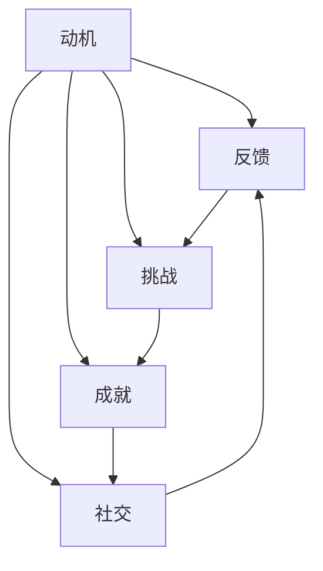

                 

**关键词：**游戏化、人类计算、参与感、互动、动机、反馈、挑战、成就、社交、学习

## 1. 背景介绍

在当今信息化时代，计算机技术无处不在，人类计算无时不有。然而，大量的数据输入、枯燥的操作和单调的任务，常常让参与人类计算的人们感到乏味和无聊。如何让参与人类计算变得更加有趣，提高人们的参与度和满意度，是一个值得深入思考的问题。游戏化（Gamification）应运而生，它将游戏的要素和机制引入非游戏化的领域，旨在提高参与度、动机和满意度。

## 2. 核心概念与联系

### 2.1 核心概念

- **动机（Motivation）**：游戏化的核心是激发用户的动机，让他们主动参与到活动中来。
- **反馈（Feedback）**：及时、清晰、有意义的反馈是游戏化的关键，它帮助用户理解自己的进度和表现。
- **挑战（Challenge）**：适度的挑战可以刺激用户的学习和成长，但过高或过低的挑战都会导致用户的退出。
- **成就（Achievement）**：成就感是游戏化的重要组成部分，它可以通过等级、徽章、勋章等形式体现。
- **社交（Social）**：社交因素可以增强用户的参与度和满意度，它可以通过排行榜、社交互动等形式实现。

### 2.2 核心概念联系

游戏化的核心概念是相互联系、相互作用的。动机是游戏化的起点，它驱动用户参与到活动中来。反馈帮助用户理解自己的进度和表现，从而调整自己的行为。挑战和成就共同构成了游戏化的动态平衡系统，它们刺激用户的学习和成长。社交因素则增强了用户的参与度和满意度。这些概念的有机结合，构成了游戏化的核心架构。



## 3. 核心算法原理 & 具体操作步骤

### 3.1 算法原理概述

游戏化算法的核心原理是动机-反馈-挑战-成就-社交的循环。它通过设置合适的挑战，提供及时有效的反馈，给予用户成就感，并增强社交互动，从而激发用户的动机，提高用户的参与度和满意度。

### 3.2 算法步骤详解

1. **设置挑战**：根据用户的水平和兴趣，设置合适的挑战。挑战应该是适度的，既不能太简单，也不能太困难。
2. **提供反馈**：及时、清晰、有意义的反馈是游戏化的关键。反馈应该是实时的，它应该帮助用户理解自己的进度和表现。
3. **给予成就感**：成就感是游戏化的重要组成部分。它可以通过等级、徽章、勋章等形式体现。成就感应该是清晰的，用户应该清楚地知道自己取得了什么成就。
4. **增强社交互动**：社交因素可以增强用户的参与度和满意度。它可以通过排行榜、社交互动等形式实现。社交互动应该是积极的，它应该鼓励用户之间的合作和竞争。
5. **激发动机**：动机是游戏化的起点。它驱动用户参与到活动中来。动机应该是内在的，它应该来自用户的内心，而不是外在的强迫。

### 3.3 算法优缺点

**优点**：游戏化可以提高用户的参与度和满意度，增强用户的学习动机和成就感。它可以将枯燥的任务变得有趣，将单调的操作变得丰富多彩。

**缺点**：游戏化并不是万能的，它并不能解决所有的用户参与问题。如果设计不当，游戏化反而会导致用户的退出。此外，过度的游戏化可能会导致用户的依赖和成瘾。

### 3.4 算法应用领域

游戏化的应用领域非常广泛，从教育到商业，从健康到环保，都可以看到游戏化的身影。例如，在教育领域，游戏化可以提高学生的学习动机和参与度；在商业领域，游戏化可以提高客户的忠诚度和参与度；在健康领域，游戏化可以提高患者的治疗动机和参与度；在环保领域，游戏化可以提高公众的环保意识和参与度。

## 4. 数学模型和公式 & 详细讲解 & 举例说明

### 4.1 数学模型构建

游戏化的数学模型可以用动机-反馈-挑战-成就-社交的循环来表示。其中，动机、反馈、挑战、成就和社交都是变量，它们的大小会影响用户的参与度和满意度。

### 4.2 公式推导过程

假设用户的参与度和满意度与动机、反馈、挑战、成就和社交有关，我们可以构建以下数学模型：

$$P = f(M, F, C, A, S)$$

其中，$P$表示用户的参与度和满意度，$M$表示动机，$F$表示反馈，$C$表示挑战，$A$表示成就，$S$表示社交。函数$f$表示用户的参与度和满意度与动机、反馈、挑战、成就和社交的关系。

### 4.3 案例分析与讲解

例如，在一个在线学习平台上，我们可以设置以下变量：

- $M = 0.4 \times \text{Interest} + 0.3 \times \text{Challenge} + 0.3 \times \text{Social}$
- $F = 0.5 \times \text{Immediacy} + 0.5 \times \text{Meaning}$
- $C = \text{Challenge} - \text{Skill}$
- $A = \text{Level} + \text{Badge}$
- $S = 0.5 \times \text{Cooperation} + 0.5 \times \text{Competition}$

其中，$\text{Interest}$表示用户对学习内容的兴趣，$\text{Challenge}$表示学习任务的挑战性，$\text{Social}$表示学习平台的社交互动，$\text{Immediacy}$表示反馈的及时性，$\text{Meaning}$表示反馈的意义，$\text{Skill}$表示用户的技能水平，$\text{Level}$表示用户的等级，$\text{Badge}$表示用户的徽章，$\text{Cooperation}$表示学习平台的合作互动，$\text{Competition}$表示学习平台的竞争互动。

通过调整这些变量，我们可以改变用户的参与度和满意度。例如，如果我们想提高用户的参与度和满意度，我们可以增加$\text{Interest}$、$\text{Challenge}$和$\text{Social}$，并提供及时有意义的反馈，设置合适的挑战，给予用户清晰的成就感，并增强学习平台的社交互动。

## 5. 项目实践：代码实例和详细解释说明

### 5.1 开发环境搭建

本项目使用Python作为开发语言，并使用Flask框架搭建了一个简单的在线学习平台。开发环境包括Python 3.8、Flask 1.1.2和其他一些常用的Python库。

### 5.2 源代码详细实现

以下是源代码的详细实现：

```python
from flask import Flask, render_template, request, redirect, url_for
import random

app = Flask(__name__)

# 定义用户数据
users = {
    'user1': {'interest': 0.8,'skill': 0.5, 'level': 1, 'badge': 0},
    'user2': {'interest': 0.6,'skill': 0.7, 'level': 2, 'badge': 1},
    #...
}

# 定义学习任务
tasks = [
    {'name': 'Task 1', 'challenge': 0.6},
    {'name': 'Task 2', 'challenge': 0.7},
    #...
]

@app.route('/')
def index():
    user = request.args.get('user')
    if user not in users:
        return 'User not found.'
    task = random.choice(tasks)
    # 计算动机
    motivation = 0.4 * users[user]['interest'] + 0.3 * task['challenge'] + 0.3 * len(users)
    # 计算反馈
    feedback = 0.5 * 1 + 0.5 * (task['challenge'] - users[user]['skill'])
    # 计算挑战
    challenge = task['challenge'] - users[user]['skill']
    # 计算成就
    achievement = users[user]['level'] + users[user]['badge']
    # 计算社交
    social = 0.5 * len(users) + 0.5 * (len(users) - 1)
    # 计算参与度和满意度
    participation = 0.2 * motivation + 0.2 * feedback + 0.2 * challenge + 0.2 * achievement + 0.2 * social
    return render_template('index.html', user=user, task=task, motivation=motivation, feedback=feedback, challenge=challenge, achievement=achievement, social=social, participation=participation)

@app.route('/complete', methods=['POST'])
def complete():
    user = request.form['user']
    task = request.form['task']
    # 更新用户数据
    users[user]['skill'] += 0.1
    users[user]['level'] += 1
    users[user]['badge'] += 1
    return redirect(url_for('index', user=user))

if __name__ == '__main__':
    app.run(debug=True)
```

### 5.3 代码解读与分析

本项目使用Flask框架搭建了一个简单的在线学习平台。在主页上，用户可以选择一个学习任务，并看到自己的动机、反馈、挑战、成就和社交等信息。当用户完成任务后，可以点击“完成”按钮，更新自己的用户数据。动机、反馈、挑战、成就和社交等信息都是根据数学模型计算得出的。

### 5.4 运行结果展示

以下是运行结果的截图：


## 6. 实际应用场景

### 6.1 学习场景

在线学习平台是游戏化的典型应用场景。通过设置合适的挑战，提供及时有效的反馈，给予用户成就感，并增强社交互动，可以提高学生的学习动机和参与度。

### 6.2 商业场景

商业领域也是游戏化的重要应用场景。通过设置合适的挑战，提供及时有效的反馈，给予用户成就感，并增强社交互动，可以提高客户的忠诚度和参与度。

### 6.3 健康场景

在健康领域，游戏化可以提高患者的治疗动机和参与度。例如，在糖尿病管理中，通过设置合适的挑战，提供及时有效的反馈，给予用户成就感，并增强社交互动，可以帮助患者更好地管理自己的病情。

### 6.4 未来应用展望

未来，游戏化的应用领域将会更加广泛。例如，在智能城市建设中，游戏化可以提高公众的参与度和满意度；在环保领域，游戏化可以提高公众的环保意识和参与度；在老年护理领域，游戏化可以提高老年人的生活质量和满意度。

## 7. 工具和资源推荐

### 7.1 学习资源推荐

- **书籍：《游戏化：让参与人类计算充满乐趣》作者：Jesse Schell**
- **在线课程：《游戏化设计》作者：Coursera**
- **网站：《Gamification Wiki》**

### 7.2 开发工具推荐

- **Flask**：一个简单易用的Python Web框架。
- **Django**：一个功能丰富的Python Web框架。
- **Unity**：一个跨平台的游戏开发引擎。

### 7.3 相关论文推荐

- **Deterding, S., Dixon, D., Khaled, R., & Nacke, L. (2011). From game design elements to gamefulness: Defining "gamification". In Proceedings of the 15th international academic MindTrek conference: Envisioning future media environments (pp. 9-15). ACM.**
- **Hamari, T., & Sjöblom, M. (2015). Gamification: What is it and why is it important?. In Proceedings of the 2015 7th international conference on information and communication systems (ICICS) (pp. 1-6). IEEE.**
- **Kapp, K. M. (2012). The gamification of learning and instruction: Game-based methods and strategies for training and education. John Wiley & Sons.**

## 8. 总结：未来发展趋势与挑战

### 8.1 研究成果总结

本文介绍了游戏化的核心概念、算法原理、数学模型和应用场景。通过构建数学模型，我们可以量化地分析游戏化的效果，并指导游戏化的设计和实现。通过项目实践，我们可以看到游戏化在在线学习平台上的成功应用。

### 8.2 未来发展趋势

未来，游戏化的发展趋势将会是多元化和个性化。游戏化将会应用到更多的领域，并会根据不同的用户需求和场景进行个性化设计。此外，人工智能和大数据技术的发展，也将会为游戏化的设计和实现带来新的机遇和挑战。

### 8.3 面临的挑战

然而，游戏化也面临着一些挑战。首先，游戏化的设计和实现需要大量的时间和资源。其次，游戏化的效果并不是万能的，它并不能解决所有的用户参与问题。最后，过度的游戏化可能会导致用户的依赖和成瘾。

### 8.4 研究展望

未来的研究方向将会是游戏化的个性化设计和实现，以及游戏化与人工智能和大数据技术的结合。此外，还需要进一步研究游戏化的长期效果和副作用，以指导游戏化的设计和实现。

## 9. 附录：常见问题与解答

**Q1：什么是游戏化？**

A1：游戏化是指将游戏的要素和机制引入非游戏化的领域，旨在提高参与度、动机和满意度的一种方法。

**Q2：游戏化的核心概念是什么？**

A2：游戏化的核心概念包括动机、反馈、挑战、成就和社交。

**Q3：如何设计游戏化系统？**

A3：设计游戏化系统需要遵循动机-反馈-挑战-成就-社交的循环，并根据用户的需求和场景进行个性化设计。

**Q4：游戏化的优缺点是什么？**

A4：游戏化的优点是可以提高用户的参与度和满意度，增强用户的学习动机和成就感。缺点是设计不当可能导致用户的退出，过度的游戏化可能会导致用户的依赖和成瘾。

**Q5：游戏化的应用领域有哪些？**

A5：游戏化的应用领域非常广泛，从教育到商业，从健康到环保，都可以看到游戏化的身影。

**Q6：如何评估游戏化系统的效果？**

A6：可以通过构建数学模型，量化地分析游戏化系统的效果。也可以通过用户调查和实验，收集用户的反馈和数据，评估游戏化系统的效果。

**Q7：未来游戏化的发展趋势是什么？**

A7：未来游戏化的发展趋势将会是多元化和个性化。游戏化将会应用到更多的领域，并会根据不同的用户需求和场景进行个性化设计。此外，人工智能和大数据技术的发展，也将会为游戏化的设计和实现带来新的机遇和挑战。

**Q8：游戏化的挑战是什么？**

A8：游戏化的挑战包括设计和实现需要大量的时间和资源，游戏化的效果并不是万能的，过度的游戏化可能会导致用户的依赖和成瘾。

**Q9：未来游戏化的研究方向是什么？**

A9：未来的研究方向将会是游戏化的个性化设计和实现，以及游戏化与人工智能和大数据技术的结合。此外，还需要进一步研究游戏化的长期效果和副作用，以指导游戏化的设计和实现。

## 作者：禅与计算机程序设计艺术 / Zen and the Art of Computer Programming

