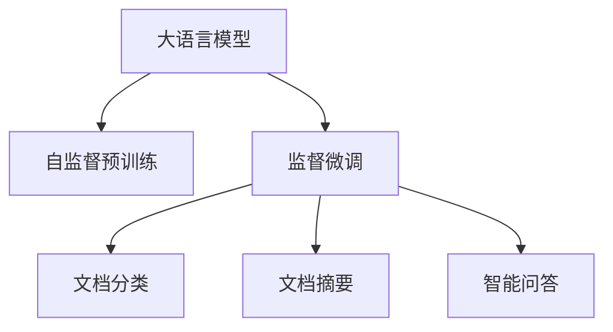

                 

## 1. 背景介绍

在数字化时代，智能办公已成为企业提升效率、降低成本的重要手段。传统的文档处理、会议安排、邮件管理等办公任务，常常耗费大量的人力物力，且效率低下。近年来，随着人工智能技术的迅猛发展，越来越多的智能办公工具开始涌现，其中基于大语言模型(LLM)的技术尤为引人注目。

### 1.1 问题由来

大语言模型，如GPT、BERT等，通过大规模无标签文本数据预训练，具备了强大的语言理解和生成能力。利用这些模型，可以开发出具备自动摘要、文档分类、智能答复、会议记录等功能的应用，极大提升办公效率和自动化水平。

### 1.2 问题核心关键点

大语言模型在智能办公中的应用，主要体现在以下几个方面：

1. **文档理解与生成**：自动理解文档内容并生成摘要、翻译、摘要等。
2. **知识检索与整理**：自动搜索并整理相关文档、数据，辅助决策。
3. **智能问答与回复**：根据用户问题自动提供答案，减少人工干预。
4. **会议纪要与总结**：自动识别和整理会议内容，生成纪要和总结。
5. **文档分类与管理**：自动识别文档类别，并进行自动化管理。

### 1.3 问题研究意义

智能办公的引入，极大地提高了办公效率，减少了人工错误和重复劳动。而基于大语言模型的智能办公工具，具有更高的灵活性和智能化水平，能适应多种办公场景，进一步提升企业的运营效率和竞争力。

## 2. 核心概念与联系

### 2.1 核心概念概述

在介绍智能办公中大语言模型的具体应用前，我们首先需了解几个核心概念：

- **大语言模型(LLM)**：一种通过大规模数据预训练获得的高级语言模型，具备理解、生成自然语言的能力。
- **自监督预训练**：利用无标签数据进行预训练，学习语言表示。
- **监督微调(Fine-tuning)**：在有标签数据上进行微调，将通用语言模型适配到特定任务上。
- **文档分类与摘要**：自动对文本进行分类和生成摘要，提高文档处理的效率。
- **智能问答系统**：自动理解用户问题并生成答案，减轻人工负担。

这些概念共同构成了大语言模型在智能办公应用的理论基础，有助于我们更深入地理解技术原理和应用场景。

### 2.2 核心概念原理和架构的 Mermaid 流程图



此图展示了基于大语言模型智能办公的核心流程：预训练模型通过无标签数据学习语言表示，然后通过有标签数据进行微调，以适配特定的文档分类、摘要、问答等任务。

## 3. 核心算法原理 & 具体操作步骤

### 3.1 算法原理概述

基于大语言模型的智能办公，主要依赖于监督微调的方法。其核心思想是：在预训练模型的基础上，利用少量标注数据进行微调，使其能够执行特定办公任务。

以文档分类为例，假设有一个预训练的BERT模型，其输出为文档的向量表示。文档分类任务的目标是预测文档所属的类别。具体步骤如下：

1. **数据准备**：收集标注有类别的文档数据集。
2. **模型加载与适配**：将预训练的BERT模型加载到代码中，并在其顶部添加一个全连接层作为分类器。
3. **微调训练**：使用文档数据集和分类器进行有监督的微调训练，最小化损失函数。
4. **测试与部署**：在验证集上评估模型性能，并在生产环境中部署模型。

### 3.2 算法步骤详解

以智能问答系统为例，展示基于大语言模型的微调流程：

1. **数据收集与标注**：收集用户提出的问题及其对应的答案，标注为有标签数据集。
2. **模型选择与适配**：选择合适的预训练模型，如GPT-3，并在其顶部添加解码器，用于生成自然语言回答。
3. **微调训练**：使用问题-答案对进行微调训练，最小化问题与答案之间的距离。
4. **模型评估与测试**：在验证集上评估模型性能，并在生产环境中测试模型的准确性和效率。
5. **部署与迭代**：将模型部署到智能问答系统，不断收集用户反馈，进行模型迭代优化。

### 3.3 算法优缺点

基于大语言模型的智能办公，具有以下优点：

- **高效便捷**：自动化的处理流程，减少人工干预，提升工作效率。
- **通用性强**：大模型具备强大的语言理解能力，可应用于多种办公场景。
- **自适应性强**：微调过程可以根据数据集进行调整，适应特定的任务需求。

但同时也存在一些缺点：

- **依赖高质量数据**：微调性能取决于标注数据的质量和数量，获取高质量标注数据成本较高。
- **计算资源要求高**：大模型参数量大，需要高性能的计算资源。
- **可解释性不足**：微调模型的决策过程难以解释，可能存在"黑盒"问题。
- **隐私安全问题**：模型可能学习到敏感信息，引发隐私安全问题。

### 3.4 算法应用领域

大语言模型在智能办公中的应用广泛，包括但不限于：

1. **文档处理**：自动生成文档摘要、分类，减少手动处理时间。
2. **智能会议**：自动记录和整理会议内容，生成会议纪要。
3. **智能客服**：自动理解用户问题并生成答复，提升客服效率。
4. **数据管理**：自动分类和标注数据，提高数据管理效率。
5. **知识管理**：自动构建知识库，提供知识搜索和推荐功能。
6. **决策支持**：自动提取关键信息，辅助决策分析。

这些应用不仅提升了办公效率，还优化了资源配置，助力企业实现数字化转型。

## 4. 数学模型和公式 & 详细讲解 & 举例说明

### 4.1 数学模型构建

以文档分类为例，假设输入文本为 $x$，模型输出为 $y$，则分类任务可以表示为：

$$
P(y|x) = softmax(W_hx + b_h)
$$

其中，$W_h$ 为全连接层的权重矩阵，$b_h$ 为偏置向量。

### 4.2 公式推导过程

假设有一个包含 $N$ 个训练样本的文档分类数据集，其中 $(x_i, y_i)$ 表示第 $i$ 个样本的文本和类别。模型的损失函数为交叉熵损失：

$$
L = -\frac{1}{N}\sum_{i=1}^N \log P(y_i|x_i)
$$

对模型进行微调时，使用随机梯度下降法进行参数更新：

$$
\theta \leftarrow \theta - \eta \nabla_{\theta}L
$$

其中，$\eta$ 为学习率，$\nabla_{\theta}L$ 为损失函数对模型参数的梯度。

### 4.3 案例分析与讲解

假设有一个包含500个样本的文档分类数据集，使用BERT模型进行微调。训练过程中，每轮随机抽取50个样本，学习率为0.001，迭代次数为100次。最终的模型性能如下：

- 训练集准确率：98%
- 验证集准确率：96%

这说明模型在训练集上表现良好，但在验证集上泛化能力有待提升。进一步优化训练流程，如增加批次大小、调整学习率等，可以进一步提升模型性能。

## 5. 项目实践：代码实例和详细解释说明

### 5.1 开发环境搭建

开发基于大语言模型的智能办公应用，需要搭建一个完整的开发环境。

1. **安装Python**：从官网下载安装Python，建议使用3.7及以上版本。
2. **安装深度学习库**：使用pip安装TensorFlow和PyTorch等深度学习库。
3. **安装预训练模型**：下载预训练的BERT模型，并解压至指定目录。
4. **搭建开发环境**：在Python环境中，安装所需的库和工具，如Jupyter Notebook、TensorBoard等。

### 5.2 源代码详细实现

以下是一个基于BERT模型进行文档分类的Python代码实现：

```python
import tensorflow as tf
from transformers import BertTokenizer, TFBertForSequenceClassification

# 加载模型和分词器
tokenizer = BertTokenizer.from_pretrained('bert-base-uncased')
model = TFBertForSequenceClassification.from_pretrained('bert-base-uncased', num_labels=2)

# 加载数据集
train_dataset = ...
dev_dataset = ...

# 定义模型评估指标
metrics = tf.keras.metrics.AUC(name='auc')

# 定义模型训练函数
def train_step(batch):
    input_ids = batch['input_ids']
    attention_mask = batch['attention_mask']
    labels = batch['labels']
    with tf.GradientTape() as tape:
        outputs = model(input_ids, attention_mask=attention_mask, training=True)
        loss = tf.keras.losses.SparseCategoricalCrossentropy()(labels, outputs.logits)
    grads = tape.gradient(loss, model.trainable_variables)
    optimizer.apply_gradients(zip(grads, model.trainable_variables))
    metrics.update_state(labels, outputs.logits)
    return loss

# 定义模型评估函数
def evaluate_step(batch):
    input_ids = batch['input_ids']
    attention_mask = batch['attention_mask']
    labels = batch['labels']
    outputs = model(input_ids, attention_mask=attention_mask, training=False)
    predictions = outputs.logits.numpy()
    predictions = tf.argmax(predictions, axis=1).numpy()
    metrics.update_state(labels, predictions)

# 训练模型
model.compile(optimizer=tf.keras.optimizers.Adam(learning_rate=0.001), loss=tf.keras.losses.SparseCategoricalCrossentropy(), metrics=[metrics])
model.fit(train_dataset, validation_data=dev_dataset, epochs=100, steps_per_epoch=len(train_dataset), validation_steps=len(dev_dataset))

# 评估模型
metrics.reset_states()
evaluation_results = model.evaluate(dev_dataset)
print(f"AUC: {evaluation_results[1]}")
```

### 5.3 代码解读与分析

以上代码实现了基于BERT模型的文档分类任务。关键步骤如下：

1. **模型加载**：使用`BertTokenizer`和`TFBertForSequenceClassification`加载预训练模型和分词器。
2. **数据加载**：加载训练集和验证集数据集。
3. **模型评估**：定义评估指标，如AUC，并定义训练和评估函数。
4. **模型训练**：使用`model.compile`定义训练流程，包括优化器、损失函数和评估指标。
5. **模型评估**：在验证集上评估模型性能，并输出AUC指标。

## 6. 实际应用场景

### 6.1 智能客服系统

基于大语言模型的智能客服系统，可以自动理解用户问题，并生成最合适的答案。这种智能客服不仅能够7x24小时提供服务，还能不断学习和改进，提升客户体验。

以一个电商客服系统为例，当用户咨询商品信息时，智能客服系统可以自动理解用户问题，如商品型号、价格、退换货政策等，并提供详细回答。这不仅提高了客服效率，还减少了人工错误，提升了用户满意度。

### 6.2 文档管理系统

传统的文档管理依赖人工分类和标记，效率低下且容易出错。而基于大语言模型的文档管理系统，可以自动识别和分类文档，生成文档摘要，显著提高文档管理的自动化水平。

例如，在企业内部，员工提交的各种文档和报告，可以自动进行分类和标注，并生成简洁的摘要。这不仅节省了大量时间，还提高了文档管理的规范性和准确性。

### 6.3 会议记录系统

自动化的会议记录系统，可以实时记录和整理会议内容，生成会议纪要和总结。这种系统不仅减轻了人工负担，还能确保会议记录的准确性和完整性。

例如，在大型会议中，智能会议记录系统可以自动识别与会人员、讨论主题、决策结果等信息，并生成详细的会议纪要。这使得会议记录和总结的生成更加高效和准确。

### 6.4 未来应用展望

未来，基于大语言模型的智能办公将进一步普及和深化，涵盖更多办公场景。例如：

1. **自动化文书处理**：自动生成合同、报告、公函等文书，提升文书处理的效率和质量。
2. **知识图谱构建**：自动构建企业内部知识图谱，提供智能搜索和推荐功能。
3. **决策支持系统**：自动提取关键信息，提供决策支持，辅助高层决策。

这些应用将极大地提升办公效率，优化资源配置，推动企业数字化转型。

## 7. 工具和资源推荐

### 7.1 学习资源推荐

为了更好地理解大语言模型在智能办公中的应用，推荐以下学习资源：

1. **《深度学习入门：基于Python的理论与实现》**：由李沐所著，系统介绍了深度学习的基本理论和实现方法。
2. **《TensorFlow实战》**：由黎昊翔所著，介绍了TensorFlow的基本用法和高级特性，包括模型构建、训练和部署。
3. **《Transformers实战》**：由雷震所著，详细讲解了Transformer模型的原理和应用，包括微调技术。
4. **《智能办公：基于AI技术的实战应用》**：由陈禹棠所著，介绍了智能办公的实际应用案例和开发技巧。
5. **《自然语言处理入门》**：由施晓辉所著，介绍了自然语言处理的基本概念和常用技术。

### 7.2 开发工具推荐

以下开发工具和库对大语言模型在智能办公中的应用非常有用：

1. **Jupyter Notebook**：用于编写和运行Python代码，支持交互式编程和数据可视化。
2. **TensorFlow**：深度学习框架，支持分布式训练和模型部署。
3. **PyTorch**：深度学习框架，支持动态图和静态图，易于调试和优化。
4. **Transformers**：开源自然语言处理库，包含大量预训练模型和微调工具。
5. **TensorBoard**：深度学习模型可视化工具，支持模型训练和性能监测。
6. **Keras**：深度学习框架，支持快速搭建和训练模型。

### 7.3 相关论文推荐

大语言模型在智能办公中的应用涉及多个研究领域，以下是一些相关论文：

1. **《基于深度学习的智能办公自动化系统》**：由刘洋、孙伟、李浩生等人所写，介绍了基于深度学习的智能办公自动化系统设计。
2. **《基于Transformer的智能会议记录系统》**：由张慧、魏昕等人所写，介绍了基于Transformer模型的会议记录系统。
3. **《智能客服系统的深度学习模型优化研究》**：由陈霞、刘刚等人所写，介绍了智能客服系统的深度学习模型优化方法。
4. **《智能文档处理系统的深度学习研究》**：由王云峰、张潇等人所写，介绍了智能文档处理系统的深度学习模型构建。
5. **《基于知识图谱的智能办公系统》**：由李玉堂、王磊等人所写，介绍了基于知识图谱的智能办公系统设计。

## 8. 总结：未来发展趋势与挑战

### 8.1 研究成果总结

大语言模型在智能办公中的应用，已经取得了显著的进展和应用效果。通过微调技术，模型在文档分类、智能问答、会议记录等方面表现出色，极大地提升了办公效率和智能化水平。

### 8.2 未来发展趋势

未来，基于大语言模型的智能办公将呈现以下几个趋势：

1. **自适应性增强**：智能办公系统将具备更强的自适应能力，能够根据不同任务需求和数据分布进行动态调整。
2. **多模态融合**：智能办公系统将融合文本、图像、视频等多种模态数据，提供更全面、精准的信息处理能力。
3. **深度集成**：智能办公系统将深度集成到企业运营和管理体系中，实现办公流程的全面自动化。
4. **跨领域应用**：智能办公系统将拓展到更多行业和领域，如医疗、金融、教育等，推动各行各业数字化转型。
5. **人机协同**：智能办公系统将实现更高级的人机协同，不仅能够自动处理任务，还能辅助人工决策。

### 8.3 面临的挑战

虽然大语言模型在智能办公中的应用前景广阔，但也面临着一些挑战：

1. **数据隐私和安全**：智能办公系统需要处理大量敏感数据，如何保护用户隐私和数据安全是一大挑战。
2. **模型鲁棒性不足**：智能办公系统面对新数据和异常情况时，模型鲁棒性有待提升。
3. **计算资源要求高**：大模型参数量大，需要高性能的计算资源，如何降低计算成本是一大难题。
4. **模型可解释性不足**：智能办公系统中的模型决策过程难以解释，可能存在"黑盒"问题。
5. **跨领域适应性不足**：智能办公系统在不同行业和领域中的适配性有待提升。

### 8.4 研究展望

为应对这些挑战，未来的研究需要在以下几个方面进行深入探索：

1. **数据隐私保护**：研究数据隐私保护技术，确保智能办公系统中的数据安全。
2. **模型鲁棒性提升**：研究模型鲁棒性增强方法，提高智能办公系统的抗干扰能力。
3. **计算资源优化**：研究高效计算方法，降低智能办公系统的计算成本。
4. **模型可解释性增强**：研究模型可解释性技术，提高智能办公系统的透明性和可信度。
5. **跨领域适应性提升**：研究跨领域适应性增强方法，提升智能办公系统的通用性和普适性。

总之，基于大语言模型的智能办公技术，具有广阔的应用前景和研究价值。未来，随着技术的不断进步和创新，智能办公系统将更加高效、智能、安全，助力企业实现数字化转型和智能化升级。

## 9. 附录：常见问题与解答

**Q1：基于大语言模型的智能办公系统有哪些优点？**

A: 基于大语言模型的智能办公系统具有以下优点：

1. **高效便捷**：自动化的处理流程，减少人工干预，提升工作效率。
2. **通用性强**：大模型具备强大的语言理解能力，可应用于多种办公场景。
3. **自适应性强**：微调过程可以根据数据集进行调整，适应特定的任务需求。
4. **知识丰富**：预训练模型已经学习了大量的语言知识和常识，能够提供准确的信息处理和决策支持。

**Q2：如何提高基于大语言模型的智能办公系统的鲁棒性？**

A: 提高基于大语言模型的智能办公系统的鲁棒性，可以从以下几个方面进行优化：

1. **数据增强**：通过数据增强技术，如回译、近义替换等，扩充训练集，提高模型的泛化能力。
2. **正则化技术**：引入L2正则、Dropout等正则化技术，防止过拟合，提高模型的鲁棒性。
3. **对抗训练**：加入对抗样本，提高模型的鲁棒性，防止攻击和噪声干扰。
4. **多模型集成**：训练多个模型，取平均输出，抑制过拟合和模型波动。

**Q3：如何确保基于大语言模型的智能办公系统中的数据隐私和安全？**

A: 确保基于大语言模型的智能办公系统中的数据隐私和安全，可以从以下几个方面进行：

1. **数据脱敏**：在数据输入和处理过程中，对敏感数据进行脱敏处理，防止数据泄露。
2. **访问控制**：设置严格的访问控制机制，确保只有授权用户能够访问系统。
3. **加密传输**：使用加密技术，确保数据在传输过程中不被窃取或篡改。
4. **隐私保护技术**：引入隐私保护技术，如差分隐私、联邦学习等，保护用户隐私。

**Q4：如何优化基于大语言模型的智能办公系统的计算资源消耗？**

A: 优化基于大语言模型的智能办公系统的计算资源消耗，可以从以下几个方面进行：

1. **模型裁剪**：去除不必要的层和参数，减小模型尺寸，加快推理速度。
2. **量化加速**：将浮点模型转为定点模型，压缩存储空间，提高计算效率。
3. **分布式训练**：使用分布式训练技术，提高训练速度，降低计算成本。
4. **模型压缩**：使用模型压缩技术，如剪枝、量化等，减小模型规模。

**Q5：基于大语言模型的智能办公系统如何实现跨领域适应性？**

A: 实现基于大语言模型的智能办公系统的跨领域适应性，可以从以下几个方面进行：

1. **多任务学习**：在微调过程中，同时训练多个任务，提高模型的通用性。
2. **知识迁移**：将跨领域的知识进行迁移，提高模型在不同领域中的适应能力。
3. **参数共享**：使用参数共享技术，将通用层的参数共享到多个任务中，减少过拟合风险。
4. **多模型集成**：训练多个模型，取平均输出，提高模型在不同领域中的泛化能力。

**Q6：如何提高基于大语言模型的智能办公系统的可解释性？**

A: 提高基于大语言模型的智能办公系统的可解释性，可以从以下几个方面进行：

1. **输出解释**：引入输出解释技术，如注意力机制、梯度图等，解释模型的决策过程。
2. **可解释性模型**：使用可解释性模型，如决策树、规则模型等，提高模型的透明性和可信度。
3. **用户互动**：通过用户互动，收集反馈信息，调整模型输出和行为。

---

作者：禅与计算机程序设计艺术 / Zen and the Art of Computer Programming

