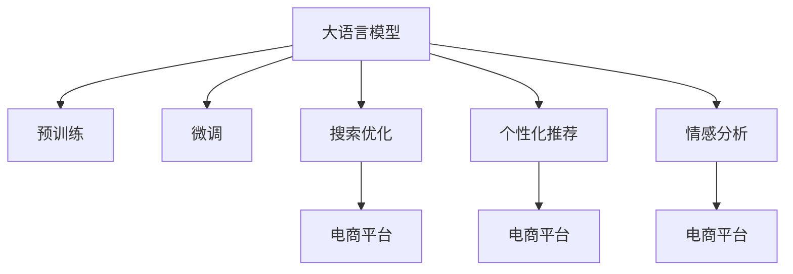

                 

# LLM与电子商务：重塑在线购物体验

> 关键词：
**大语言模型,电子商务,客户体验,个性化推荐,搜索优化,情感分析**

## 1. 背景介绍

随着电子商务市场的蓬勃发展，在线购物已成为用户生活中不可或缺的一部分。然而，如何提供个性化、高效且情感丰富的购物体验，是各大电商平台亟需解决的问题。近年来，大语言模型（Large Language Model, LLM）的兴起，为电商平台带来了革命性的变革，重塑了消费者的在线购物体验。

### 1.1 电子商务市场现状

全球电子商务市场在过去十年间持续增长，预计未来五年将继续保持高速发展态势。据统计，全球电商销售额占零售总额的比例将从2020年的16%增加到2025年的23%。中国作为全球最大的电商市场，其规模将从2020年的5.1万亿美元增加到2025年的10.5万亿美元。

尽管电商市场潜力巨大，但现有的购物体验仍存在诸多问题：

- 商品推荐不准确，用户难以发现真正感兴趣的商品。
- 搜索系统不智能，难以快速找到满意的商品。
- 客服响应缓慢，用户体验差。
- 退货流程复杂，退货率高。

这些问题极大地影响了消费者的购物体验，制约了电商平台的竞争力。

### 1.2 LLM与电商结合的趋势

随着大语言模型在NLP（自然语言处理）领域的突破，其强大的语言理解和生成能力，使其成为提升电商平台体验的重要工具。通过预训练和微调，LLM能够深度理解用户需求，提供个性化推荐，优化搜索系统，提升客服质量，从而显著提升电商平台的竞争力。

## 2. 核心概念与联系

### 2.1 核心概念概述

为了更好地理解LLM在电子商务中的应用，本节将介绍几个关键概念：

- 大语言模型（LLM）：通过自监督学习在大量文本数据上预训练的模型，具备强大的语言理解和生成能力。
- 电子商务（E-commerce）：通过互联网进行的买卖交易活动，涵盖搜索、推荐、客服等多个环节。
- 个性化推荐（Personalized Recommendation）：根据用户行为和偏好，向用户推荐可能感兴趣的商品。
- 搜索优化（Search Optimization）：通过算法优化，提升搜索系统的准确性和效率，帮助用户快速找到满意的商品。
- 情感分析（Sentiment Analysis）：分析用户评论、反馈等信息，理解用户的情感倾向。

这些概念之间的逻辑关系可以通过以下Mermaid流程图来展示：



这个流程图展示了大语言模型与电子商务应用的逻辑关系：

1. 大语言模型通过预训练获得基础能力。
2. 微调后的大语言模型可用于搜索优化、个性化推荐和情感分析。
3. 这些功能在电商平台中得以应用，提升用户购物体验。

## 3. 核心算法原理 & 具体操作步骤

### 3.1 算法原理概述

大语言模型在电子商务中的应用，主要是通过预训练-微调范式进行的。其核心思想是：使用大规模文本数据预训练模型，使其具备强大的语言理解和生成能力，然后针对电商平台的特定任务进行微调，优化模型性能。

假设预训练模型为 $M_{\theta}$，通过海量的无标签文本数据进行预训练。然后，针对电商平台的搜索、推荐和情感分析等任务，使用标注数据对模型进行微调。微调的目标是最大化模型在特定任务上的性能，通常使用交叉熵损失等方法。

### 3.2 算法步骤详解

基于大语言模型的电子商务应用，主要包括以下几个关键步骤：

**Step 1: 准备预训练模型和数据集**
- 选择合适的预训练语言模型 $M_{\theta}$ 作为初始化参数，如 BERT、GPT等。
- 准备电商平台的商品描述、用户评论、搜索历史等标注数据集，分为训练集、验证集和测试集。

**Step 2: 添加任务适配层**
- 根据具体任务，设计合适的输出层和损失函数。
- 例如，对于个性化推荐任务，可以在顶层添加一个输出层，使用交叉熵损失函数。
- 对于情感分析任务，可以设计一个分类器，输出用户评论的情感极性。

**Step 3: 设置微调超参数**
- 选择合适的优化算法及其参数，如 AdamW、SGD 等，设置学习率、批大小、迭代轮数等。
- 设置正则化技术及强度，包括权重衰减、Dropout、Early Stopping 等。

**Step 4: 执行梯度训练**
- 将训练集数据分批次输入模型，前向传播计算损失函数。
- 反向传播计算参数梯度，根据设定的优化算法和学习率更新模型参数。
- 周期性在验证集上评估模型性能，根据性能指标决定是否触发 Early Stopping。
- 重复上述步骤直到满足预设的迭代轮数或 Early Stopping 条件。

**Step 5: 测试和部署**
- 在测试集上评估微调后模型 $M_{\hat{\theta}}$ 的性能，对比微调前后的精度提升。
- 使用微调后的模型对新样本进行推理预测，集成到实际的应用系统中。
- 持续收集新的数据，定期重新微调模型，以适应数据分布的变化。

### 3.3 算法优缺点

基于大语言模型的电子商务应用具有以下优点：

1. **准确性高**：通过大规模预训练和微调，模型能够准确理解用户需求和产品信息，提供高精度的个性化推荐和搜索优化。
2. **效率高**：算法具有高效的训练和推理速度，能够实时响应用户需求。
3. **适应性强**：模型能够快速适应不同电商平台的数据分布和业务场景。
4. **用户友好**：算法可以理解自然语言，提供更加自然和友好的用户交互体验。

然而，该方法也存在一定的局限性：

1. **依赖标注数据**：微调效果很大程度上取决于标注数据的质量和数量，获取高质量标注数据的成本较高。
2. **泛化能力有限**：当目标任务与预训练数据的分布差异较大时，微调的性能提升有限。
3. **可解释性不足**：模型的决策过程缺乏可解释性，难以对其推理逻辑进行分析和调试。

尽管存在这些局限性，但就目前而言，基于大语言模型的电子商务应用是最主流范式。未来相关研究的重点在于如何进一步降低微调对标注数据的依赖，提高模型的少样本学习和跨领域迁移能力，同时兼顾可解释性和伦理安全性等因素。

### 3.4 算法应用领域

基于大语言模型的电子商务应用涵盖了电商平台的多个环节，例如：

- **个性化推荐**：根据用户历史浏览和购买记录，推荐可能感兴趣的商品。
- **搜索优化**：通过算法优化，提升搜索系统的准确性和效率，帮助用户快速找到满意的商品。
- **情感分析**：分析用户评论、反馈等信息，理解用户的情感倾向，优化用户体验。
- **智能客服**：通过自然语言理解，自动回答用户问题，提供7x24小时不间断服务。
- **商品描述生成**：根据用户输入的商品关键词，生成详细的商品描述。

这些应用使电商平台的运营更加智能化和高效，极大提升了用户购物体验。

## 4. 数学模型和公式 & 详细讲解 & 举例说明

### 4.1 数学模型构建

本节将使用数学语言对基于大语言模型的电子商务应用进行更加严格的刻画。

假设电商平台的商品描述为 $x$，用户评论为 $y$。定义模型 $M_{\theta}$ 在输入 $x$ 上的输出为 $\hat{y}$。

- **个性化推荐**：推荐系统可以将商品 $x$ 和用户评论 $y$ 作为训练样本，使用交叉熵损失函数进行微调。假设模型输出为 $\hat{y}$，则交叉熵损失函数为：
  $$
  \ell(M_{\theta}(x),y) = -[y\log \hat{y} + (1-y)\log (1-\hat{y})]
  $$

- **搜索优化**：搜索系统可以使用自然语言理解任务进行微调。假设用户输入的搜索词为 $q$，商品描述为 $x$，则可以使用掩码语言模型任务进行微调，目标是最大化模型在预测商品标题和描述的准确性。

- **情感分析**：情感分析系统可以使用情感分类任务进行微调。假设用户评论为 $y$，模型输出为 $\hat{y}$，则情感分类任务的目标是最大化模型预测正确的情感极性。

### 4.2 公式推导过程

以个性化推荐任务为例，推导交叉熵损失函数及其梯度的计算公式。

假设模型 $M_{\theta}$ 在输入 $x$ 上的输出为 $\hat{y}$，表示商品 $x$ 与用户评论 $y$ 匹配的概率。真实标签 $y \in \{0,1\}$。则二分类交叉熵损失函数定义为：
$$
\ell(M_{\theta}(x),y) = -[y\log \hat{y} + (1-y)\log (1-\hat{y})]
$$

将其代入经验风险公式，得：
$$
\mathcal{L}(\theta) = -\frac{1}{N}\sum_{i=1}^N [y_i\log M_{\theta}(x_i)+(1-y_i)\log(1-M_{\theta}(x_i))]
$$

根据链式法则，损失函数对参数 $\theta_k$ 的梯度为：
$$
\frac{\partial \mathcal{L}(\theta)}{\partial \theta_k} = -\frac{1}{N}\sum_{i=1}^N (\frac{y_i}{M_{\theta}(x_i)}-\frac{1-y_i}{1-M_{\theta}(x_i)}) \frac{\partial M_{\theta}(x_i)}{\partial \theta_k}
$$

其中 $\frac{\partial M_{\theta}(x_i)}{\partial \theta_k}$ 可进一步递归展开，利用自动微分技术完成计算。

### 4.3 案例分析与讲解

**案例分析**：

电商平台的个性化推荐系统使用了预训练的BERT模型，将其顶层微调成推荐模型。微调的目标是最大化推荐系统的准确性和效率。训练集包括用户历史浏览和购买记录，以及对应的商品信息。通过微调，模型能够理解用户需求，并根据商品的相似性推荐可能感兴趣的商品。

**讲解**：

1. **数据预处理**：将用户评论和商品描述分词，并去除停用词、特殊符号等噪音。
2. **模型微调**：使用预训练的BERT模型，对其顶层进行微调，添加输出层和交叉熵损失函数。
3. **训练过程**：使用随机梯度下降法，设定合适的学习率和批大小，在训练集上进行迭代训练。
4. **模型评估**：在验证集上评估模型性能，使用准确率、召回率等指标进行评估。
5. **部署应用**：将微调后的模型集成到推荐系统中，实时响应用户请求，提供个性化推荐。

## 5. 项目实践：代码实例和详细解释说明

### 5.1 开发环境搭建

在进行电子商务应用开发前，我们需要准备好开发环境。以下是使用Python进行PyTorch开发的环境配置流程：

1. 安装Anaconda：从官网下载并安装Anaconda，用于创建独立的Python环境。

2. 创建并激活虚拟环境：
```bash
conda create -n pytorch-env python=3.8 
conda activate pytorch-env
```

3. 安装PyTorch：根据CUDA版本，从官网获取对应的安装命令。例如：
```bash
conda install pytorch torchvision torchaudio cudatoolkit=11.1 -c pytorch -c conda-forge
```

4. 安装Transformers库：
```bash
pip install transformers
```

5. 安装各类工具包：
```bash
pip install numpy pandas scikit-learn matplotlib tqdm jupyter notebook ipython
```

完成上述步骤后，即可在`pytorch-env`环境中开始电子商务应用开发。

### 5.2 源代码详细实现

下面我们以电商平台的个性化推荐系统为例，给出使用Transformers库对BERT模型进行微调的PyTorch代码实现。

首先，定义推荐系统的数据处理函数：

```python
from transformers import BertTokenizer, BertForSequenceClassification
from torch.utils.data import Dataset
import torch

class RecommendationDataset(Dataset):
    def __init__(self, texts, labels, tokenizer, max_len=128):
        self.texts = texts
        self.labels = labels
        self.tokenizer = tokenizer
        self.max_len = max_len
        
    def __len__(self):
        return len(self.texts)
    
    def __getitem__(self, item):
        text = self.texts[item]
        label = self.labels[item]
        
        encoding = self.tokenizer(text, return_tensors='pt', max_length=self.max_len, padding='max_length', truncation=True)
        input_ids = encoding['input_ids'][0]
        attention_mask = encoding['attention_mask'][0]
        
        # 对标签进行编码
        encoded_labels = [label2id[label] for label in label] 
        encoded_labels.extend([label2id['O']] * (self.max_len - len(encoded_labels)))
        labels = torch.tensor(encoded_labels, dtype=torch.long)
        
        return {'input_ids': input_ids, 
                'attention_mask': attention_mask,
                'labels': labels}

# 标签与id的映射
label2id = {'1': 1, '0': 0}
id2label = {v: k for k, v in label2id.items()}

# 创建dataset
tokenizer = BertTokenizer.from_pretrained('bert-base-cased')

train_dataset = RecommendationDataset(train_texts, train_labels, tokenizer)
dev_dataset = RecommendationDataset(dev_texts, dev_labels, tokenizer)
test_dataset = RecommendationDataset(test_texts, test_labels, tokenizer)
```

然后，定义模型和优化器：

```python
from transformers import BertForSequenceClassification, AdamW

model = BertForSequenceClassification.from_pretrained('bert-base-cased', num_labels=len(label2id))

optimizer = AdamW(model.parameters(), lr=2e-5)
```

接着，定义训练和评估函数：

```python
from torch.utils.data import DataLoader
from tqdm import tqdm
from sklearn.metrics import accuracy_score

device = torch.device('cuda') if torch.cuda.is_available() else torch.device('cpu')
model.to(device)

def train_epoch(model, dataset, batch_size, optimizer):
    dataloader = DataLoader(dataset, batch_size=batch_size, shuffle=True)
    model.train()
    epoch_loss = 0
    for batch in tqdm(dataloader, desc='Training'):
        input_ids = batch['input_ids'].to(device)
        attention_mask = batch['attention_mask'].to(device)
        labels = batch['labels'].to(device)
        model.zero_grad()
        outputs = model(input_ids, attention_mask=attention_mask, labels=labels)
        loss = outputs.loss
        epoch_loss += loss.item()
        loss.backward()
        optimizer.step()
    return epoch_loss / len(dataloader)

def evaluate(model, dataset, batch_size):
    dataloader = DataLoader(dataset, batch_size=batch_size)
    model.eval()
    preds, labels = [], []
    with torch.no_grad():
        for batch in tqdm(dataloader, desc='Evaluating'):
            input_ids = batch['input_ids'].to(device)
            attention_mask = batch['attention_mask'].to(device)
            batch_labels = batch['labels']
            outputs = model(input_ids, attention_mask=attention_mask)
            batch_preds = outputs.logits.argmax(dim=2).to('cpu').tolist()
            batch_labels = batch_labels.to('cpu').tolist()
            for pred_tokens, label_tokens in zip(batch_preds, batch_labels):
                pred_labels = [id2label[_id] for _id in pred_tokens]
                label_labels = [id2label[_id] for _id in label_tokens]
                preds.append(pred_labels[:len(label_labels)])
                labels.append(label_labels)
                
    return accuracy_score(labels, preds)

```

最后，启动训练流程并在测试集上评估：

```python
epochs = 5
batch_size = 16

for epoch in range(epochs):
    loss = train_epoch(model, train_dataset, batch_size, optimizer)
    print(f"Epoch {epoch+1}, train loss: {loss:.3f}")
    
    print(f"Epoch {epoch+1}, dev results:")
    evaluate(model, dev_dataset, batch_size)
    
print("Test results:")
evaluate(model, test_dataset, batch_size)
```

以上就是使用PyTorch对BERT进行个性化推荐系统微调的完整代码实现。可以看到，得益于Transformers库的强大封装，我们可以用相对简洁的代码完成BERT模型的加载和微调。

### 5.3 代码解读与分析

让我们再详细解读一下关键代码的实现细节：

**RecommendationDataset类**：
- `__init__`方法：初始化商品描述、标签、分词器等关键组件。
- `__len__`方法：返回数据集的样本数量。
- `__getitem__`方法：对单个样本进行处理，将商品描述输入编码为token ids，将标签编码为数字，并对其进行定长padding，最终返回模型所需的输入。

**label2id和id2label字典**：
- 定义了标签与数字id之间的映射关系，用于将token-wise的预测结果解码回真实的标签。

**训练和评估函数**：
- 使用PyTorch的DataLoader对数据集进行批次化加载，供模型训练和推理使用。
- 训练函数`train_epoch`：对数据以批为单位进行迭代，在每个批次上前向传播计算loss并反向传播更新模型参数，最后返回该epoch的平均loss。
- 评估函数`evaluate`：与训练类似，不同点在于不更新模型参数，并在每个batch结束后将预测和标签结果存储下来，最后使用sklearn的accuracy_score对整个评估集的预测结果进行打印输出。

**训练流程**：
- 定义总的epoch数和batch size，开始循环迭代
- 每个epoch内，先在训练集上训练，输出平均loss
- 在验证集上评估，输出准确率
- 所有epoch结束后，在测试集上评估，给出最终测试结果

可以看到，PyTorch配合Transformers库使得BERT微调的代码实现变得简洁高效。开发者可以将更多精力放在数据处理、模型改进等高层逻辑上，而不必过多关注底层的实现细节。

当然，工业级的系统实现还需考虑更多因素，如模型的保存和部署、超参数的自动搜索、更灵活的任务适配层等。但核心的微调范式基本与此类似。

## 6. 实际应用场景

### 6.1 搜索优化

搜索优化是电子商务应用中最重要的环节之一。传统搜索系统往往依赖关键词匹配，难以理解用户真正的查询意图。通过大语言模型微调，可以实现更智能的搜索体验。

以电商平台为例，用户在搜索框中输入查询词“运动鞋”，传统的搜索系统可能会直接匹配“运动鞋”这个关键词，返回与“运动鞋”相关的商品列表。而使用大语言模型微调后，系统能够理解“运动鞋”的语义，识别出用户可能对“跑步鞋”、“训练鞋”等更具体类型的商品感兴趣。通过查询意图的理解，系统能够提供更精准的商品推荐。

### 6.2 个性化推荐

个性化推荐是提升用户购物体验的重要手段。传统推荐系统往往依赖用户的浏览和购买历史，难以对新用户进行有效推荐。通过大语言模型微调，可以大幅提升推荐系统的个性化程度。

以电商平台为例，用户在首页浏览“相机”类别时，系统会调用微调后的模型，根据用户对相机的兴趣程度，推荐不同品牌、型号、功能的相机。在用户继续浏览或购买其他商品时，系统还能不断更新推荐模型，提供更加符合用户需求的推荐。

### 6.3 智能客服

智能客服是电商平台用户体验的重要组成部分。传统的客服系统依赖人工客服，响应时间慢、效率低，无法24小时服务。通过大语言模型微调，可以实现7x24小时不间断的智能客服。

以电商平台为例，用户可以在购买商品时咨询客服，系统会调用微调后的模型，理解用户的意图，自动回答常见问题，并提供售前、售后等全方位的服务。对于无法处理的复杂问题，系统还能将用户请求转接给人工客服，提升整体用户体验。

### 6.4 未来应用展望

随着大语言模型和微调方法的不断发展，基于大语言模型的电子商务应用将呈现更多创新和突破。

- **多模态应用**：未来的搜索优化和个性化推荐系统将结合图像、视频等多模态数据，提升系统理解用户需求的能力。
- **跨领域应用**：大语言模型微调技术不仅适用于电子商务，还将拓展到金融、医疗、教育等多个领域，提升各个行业的运营效率和用户体验。
- **实时更新**：通过持续学习机制，大语言模型微调系统能够不断更新模型参数，适应新的业务需求和数据分布。
- **隐私保护**：随着用户隐私意识的提高，未来的推荐系统将更加注重数据隐私和安全，使用差分隐私等技术保护用户数据。

以上趋势凸显了大语言模型微调技术在电子商务领域的巨大潜力。这些方向的探索发展，必将进一步提升电子商务平台的智能化水平，为消费者带来更好的购物体验。

## 7. 工具和资源推荐

### 7.1 学习资源推荐

为了帮助开发者系统掌握大语言模型微调的理论基础和实践技巧，这里推荐一些优质的学习资源：

1. 《Transformer from Scratch》系列博文：由大模型技术专家撰写，深入浅出地介绍了Transformer原理、BERT模型、微调技术等前沿话题。

2. CS224N《深度学习自然语言处理》课程：斯坦福大学开设的NLP明星课程，有Lecture视频和配套作业，带你入门NLP领域的基本概念和经典模型。

3. 《Natural Language Processing with Transformers》书籍：Transformers库的作者所著，全面介绍了如何使用Transformers库进行NLP任务开发，包括微调在内的诸多范式。

4. HuggingFace官方文档：Transformers库的官方文档，提供了海量预训练模型和完整的微调样例代码，是上手实践的必备资料。

5. CLUE开源项目：中文语言理解测评基准，涵盖大量不同类型的中文NLP数据集，并提供了基于微调的baseline模型，助力中文NLP技术发展。

通过对这些资源的学习实践，相信你一定能够快速掌握大语言模型微调的精髓，并用于解决实际的电子商务问题。

### 7.2 开发工具推荐

高效的开发离不开优秀的工具支持。以下是几款用于大语言模型微调开发的常用工具：

1. PyTorch：基于Python的开源深度学习框架，灵活动态的计算图，适合快速迭代研究。大部分预训练语言模型都有PyTorch版本的实现。

2. TensorFlow：由Google主导开发的开源深度学习框架，生产部署方便，适合大规模工程应用。同样有丰富的预训练语言模型资源。

3. Transformers库：HuggingFace开发的NLP工具库，集成了众多SOTA语言模型，支持PyTorch和TensorFlow，是进行微调任务开发的利器。

4. Weights & Biases：模型训练的实验跟踪工具，可以记录和可视化模型训练过程中的各项指标，方便对比和调优。与主流深度学习框架无缝集成。

5. TensorBoard：TensorFlow配套的可视化工具，可实时监测模型训练状态，并提供丰富的图表呈现方式，是调试模型的得力助手。

6. Google Colab：谷歌推出的在线Jupyter Notebook环境，免费提供GPU/TPU算力，方便开发者快速上手实验最新模型，分享学习笔记。

合理利用这些工具，可以显著提升大语言模型微调的开发效率，加快创新迭代的步伐。

### 7.3 相关论文推荐

大语言模型和微调技术的发展源于学界的持续研究。以下是几篇奠基性的相关论文，推荐阅读：

1. Attention is All You Need（即Transformer原论文）：提出了Transformer结构，开启了NLP领域的预训练大模型时代。

2. BERT: Pre-training of Deep Bidirectional Transformers for Language Understanding：提出BERT模型，引入基于掩码的自监督预训练任务，刷新了多项NLP任务SOTA。

3. Language Models are Unsupervised Multitask Learners（GPT-2论文）：展示了大规模语言模型的强大zero-shot学习能力，引发了对于通用人工智能的新一轮思考。

4. Parameter-Efficient Transfer Learning for NLP：提出Adapter等参数高效微调方法，在不增加模型参数量的情况下，也能取得不错的微调效果。

5. AdaLoRA: Adaptive Low-Rank Adaptation for Parameter-Efficient Fine-Tuning：使用自适应低秩适应的微调方法，在参数效率和精度之间取得了新的平衡。

这些论文代表了大语言模型微调技术的发展脉络。通过学习这些前沿成果，可以帮助研究者把握学科前进方向，激发更多的创新灵感。

## 8. 总结：未来发展趋势与挑战

### 8.1 总结

本文对基于大语言模型的电子商务应用进行了全面系统的介绍。首先阐述了电子商务市场现状和存在的问题，明确了基于大语言模型微调的重要性和潜力。其次，从原理到实践，详细讲解了基于大语言模型的电子商务应用，包括搜索优化、个性化推荐、智能客服等环节。同时，本文还广泛探讨了这些技术在实际应用中的效果和挑战。

通过本文的系统梳理，可以看到，基于大语言模型的电子商务应用已经成为电商平台的核心竞争力，极大地提升了用户体验和运营效率。未来，伴随大语言模型和微调方法的不断演进，基于大语言模型的电子商务应用还将迎来更多创新和突破。

### 8.2 未来发展趋势

展望未来，大语言模型微调技术在电子商务领域将呈现以下几个发展趋势：

1. **个性化推荐**：推荐系统将更加精准，能够根据用户历史行为和实时反馈，提供个性化推荐。
2. **搜索优化**：搜索系统将结合自然语言理解，提供更智能的搜索体验。
3. **智能客服**：智能客服将更加自然，能够理解复杂自然语言，提供更高效的客服服务。
4. **跨领域应用**：大语言模型微调技术不仅适用于电子商务，还将拓展到金融、医疗、教育等多个领域，提升各个行业的运营效率和用户体验。
5. **实时更新**：通过持续学习机制，大语言模型微调系统能够不断更新模型参数，适应新的业务需求和数据分布。
6. **隐私保护**：随着用户隐私意识的提高，未来的推荐系统将更加注重数据隐私和安全，使用差分隐私等技术保护用户数据。

以上趋势凸显了大语言模型微调技术在电子商务领域的巨大潜力。这些方向的探索发展，必将进一步提升电子商务平台的智能化水平，为消费者带来更好的购物体验。

### 8.3 面临的挑战

尽管大语言模型微调技术在电子商务领域取得了显著成效，但在迈向更加智能化、普适化应用的过程中，它仍面临着诸多挑战：

1. **数据隐私问题**：电商平台的搜索、推荐、客服等应用需要大量用户数据支持，如何保护用户隐私和数据安全，是亟需解决的问题。
2. **计算资源限制**：大语言模型微调所需的计算资源较多，如何在有限的计算资源下，实现高效的微调，是技术实现的难点。
3. **业务模型适配**：不同的电商平台业务模型不同，如何将大语言模型微调技术适配到不同的应用场景中，是需要深入探索的问题。
4. **可解释性不足**：模型决策过程缺乏可解释性，难以对其推理逻辑进行分析和调试。
5. **模型鲁棒性不足**：模型面对域外数据时，泛化性能往往大打折扣，如何提高模型鲁棒性，避免灾难性遗忘，还需要更多理论和实践的积累。

尽管存在这些挑战，但未来大语言模型微调技术在电子商务领域的应用前景依然广阔。相信通过持续的创新和探索，这些挑战终将一一被克服，大语言模型微调技术将在电子商务领域实现更大突破。

### 8.4 研究展望

面对大语言模型微调面临的挑战，未来的研究需要在以下几个方面寻求新的突破：

1. **数据隐私保护**：研究差分隐私、联邦学习等技术，保护用户隐私和数据安全。
2. **计算资源优化**：开发高效的模型压缩、稀疏化存储等技术，减少计算资源消耗。
3. **业务模型适配**：研究模型迁移学习、知识图谱等技术，提高模型适配不同业务场景的能力。
4. **模型可解释性**：研究可解释性算法，如LIME、SHAP等，增强模型决策的透明度和可解释性。
5. **模型鲁棒性提升**：研究模型鲁棒性提升技术，如自适应学习、对抗训练等，提高模型泛化性能。

这些研究方向的探索，必将引领大语言模型微调技术在电子商务领域的进一步发展，推动电商平台的智能化和高效化进程。

## 9. 附录：常见问题与解答

**Q1：大语言模型微调在电子商务应用中是否存在数据隐私问题？**

A: 大语言模型微调需要大量的用户数据进行训练，因此数据隐私问题是一个亟需解决的问题。解决方式包括：
1. **差分隐私**：通过添加噪声和限制信息泄露，保护用户隐私。
2. **联邦学习**：将数据分布式存储在多个节点上，每个节点只训练本地模型，不共享原始数据。
3. **隐私计算**：使用多方安全计算等技术，确保数据在本地处理时不会被泄露。

**Q2：如何提高大语言模型微调的计算效率？**

A: 提高大语言模型微调的计算效率可以从以下几个方面入手：
1. **模型压缩**：使用剪枝、量化、蒸馏等技术，减小模型规模，提升推理速度。
2. **并行计算**：利用GPU、TPU等硬件资源，采用模型并行、数据并行等策略，加速训练和推理。
3. **优化算法**：选择高效的优化算法，如AdamW、Adafactor等，提升训练效率。
4. **缓存技术**：使用缓存技术，减少重复计算，提升计算速度。

**Q3：大语言模型微调在电子商务应用中如何适配不同的业务场景？**

A: 大语言模型微调适配不同的业务场景，需要根据具体业务需求，进行模型迁移学习、模型微调等操作。
1. **迁移学习**：在大语言模型上，先进行通用领域微调，再在特定领域上微调，形成跨领域适应性。
2. **任务适配层**：针对具体任务，设计合适的输出层和损失函数，实现任务适配。
3. **多任务学习**：同时进行多个任务的微调，提升模型在多个任务上的性能。
4. **领域特定知识**：引入领域特定的知识图谱、规则库等，增强模型对特定领域的理解能力。

**Q4：如何提高大语言模型微调的鲁棒性？**

A: 提高大语言模型微调的鲁棒性可以从以下几个方面入手：
1. **对抗训练**：在训练过程中，引入对抗样本，提升模型对噪音的鲁棒性。
2. **自适应学习**：采用自适应学习算法，根据数据分布变化，动态调整模型参数。
3. **多模型集成**：训练多个微调模型，取平均输出，抑制过拟合和偏差。
4. **正则化**：使用L2正则、Dropout等技术，防止模型过拟合。
5. **模型压缩**：使用剪枝、量化等技术，减小模型规模，提高鲁棒性。

这些技术能够有效提升大语言模型微调的鲁棒性，使其在实际应用中更加稳定和可靠。

---

作者：禅与计算机程序设计艺术 / Zen and the Art of Computer Programming

