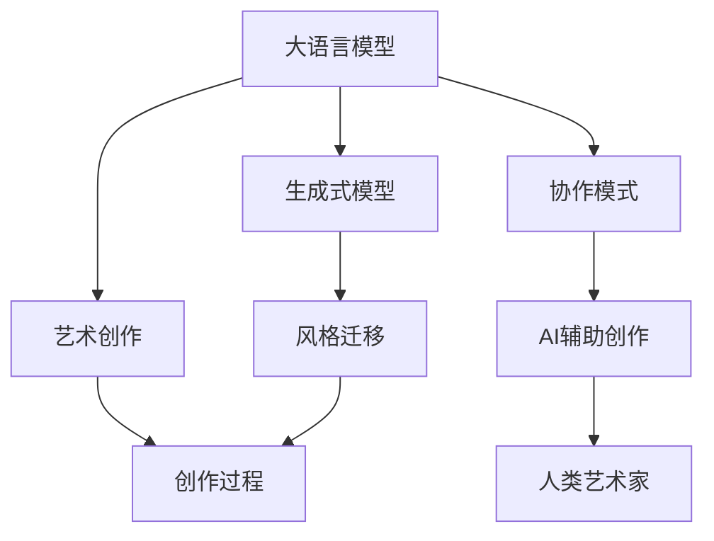

                 

# LLM与艺术创作：AI与人类艺术家的协作

> 关键词：大语言模型,生成式模型,艺术创作,风格迁移,创作过程,协作模式,创新实践

## 1. 背景介绍

在AI技术飞速发展的今天，大语言模型（LLM）已经在自然语言处理、机器翻译、信息检索等多个领域取得了突破性进展。然而，在人类最富创造力的艺术创作领域，AI却始终未能大放异彩。直到生成式模型的出现，AI与人类艺术家的协作模式才迎来了新的可能性。

生成式模型，特别是基于大语言模型的艺术创作工具，正在逐步改变艺术创作的流程和方式。这些工具不仅能生成全新的艺术作品，还能辅助人类艺术家提升创作效率，甚至激发创作灵感。艺术与科技的融合，正在开启一个全新的创作时代。

## 2. 核心概念与联系

### 2.1 核心概念概述

为更好地理解AI与艺术创作结合的原理与实践，我们首先需要了解几个关键概念：

- 大语言模型（LLM）：如GPT-3、BERT等，是一种基于深度学习的模型，可以生成连贯、上下文相关的文本。
- 生成式模型：能够根据输入生成输出，广泛应用于文本生成、图像生成等领域。
- 艺术创作：一种涉及视觉、听觉、文本等媒介的创造性活动，需要高度的创造力和情感表达。
- 风格迁移：将一种艺术风格的特征迁移到另一种作品上，生成具有特定风格的艺术作品。
- 创作过程：从构思、实践到完成的整个创作流程。
- 协作模式：AI与人类艺术家之间的互动模式，旨在优化创作过程，提升创作成果。

这些概念之间的逻辑关系可以通过以下Mermaid流程图来展示：



这个流程图展示了大语言模型、生成式模型、艺术创作、风格迁移、创作过程以及协作模式之间的联系：

1. 大语言模型通过生成式模型，能够将文本转换为视觉艺术、音乐等媒介的创作灵感。
2. 风格迁移技术可以将艺术作品的风格特征迁移到新作品上，生成新的艺术作品。
3. 艺术创作过程本身是一个高度创造性的活动，AI可以通过辅助生成、风格迁移等方式提高创作效率。
4. AI与人类艺术家的协作模式，旨在优化创作流程，提升创作成果。

这些概念共同构成了AI与艺术创作结合的理论框架，使得AI在艺术领域的应用成为可能。

## 3. 核心算法原理 & 具体操作步骤
### 3.1 算法原理概述

AI与艺术创作的结合，本质上是一种基于生成式模型和风格迁移技术的创作过程优化。其核心思想是：利用大语言模型生成的文本作为启发，通过生成式模型将文本转换为视觉或听觉艺术作品，同时使用风格迁移技术将特定风格的特征迁移到新作品上。

具体而言，假设有文本描述$T$，希望将其转换为视觉艺术作品$A$。首先，大语言模型能够根据$T$生成一系列与$T$相关的文本描述$T'$。然后，使用生成式模型将$T'$转换为对应的艺术作品$A'$，并应用风格迁移技术，将艺术作品$A'$的风格特征迁移到$A$上，最终生成艺术作品$A$。

### 3.2 算法步骤详解

基于生成式模型和风格迁移技术的艺术创作过程一般包括以下几个关键步骤：

**Step 1: 文本描述准备**
- 收集与艺术创作相关的文本描述，如故事梗概、角色介绍等。
- 将文本描述$T$输入大语言模型，生成一系列相关文本描述$T'$。

**Step 2: 文本到图像生成**
- 使用生成式模型（如GANs、VAEs等）将文本描述$T'$转换为对应的图像作品$A'$。
- 选择适合的生成式模型和训练数据，对模型进行微调以适应文本描述的生成任务。

**Step 3: 风格迁移**
- 确定目标艺术风格，如古典主义、印象派、抽象主义等。
- 选择适当的风格迁移算法（如CycleGAN、StyleGAN等），将艺术作品$A'$的风格特征迁移到新作品$A$上。
- 对风格迁移算法进行微调，以匹配具体的风格需求。

**Step 4: 最终创作**
- 将经过风格迁移处理后的艺术作品$A$作为创作成果。
- 人类艺术家可以在此基础上进行进一步的调整和完善。

### 3.3 算法优缺点

基于生成式模型和风格迁移技术的艺术创作方法具有以下优点：
1. 创新性强：AI能够根据输入生成全新的艺术作品，开辟了新的创作路径。
2. 效率高：相较于传统的手工创作，AI辅助创作可以显著提高创作效率。
3. 可定制性：AI能够根据不同的文本描述生成特定风格的艺术作品，满足多样化需求。

然而，该方法也存在一些局限性：
1. 风格迁移的效果很大程度上取决于模型的质量和训练数据的丰富程度。
2. 生成的作品可能缺乏艺术家的情感表达和独特性。
3. 模型的训练和部署需要大量的计算资源，成本较高。
4. 生成的作品可能存在版权问题，涉及伦理和法律风险。

尽管存在这些局限性，基于生成式模型和风格迁移技术的艺术创作方法仍是大有潜力的。随着技术的不断进步和应用场景的拓展，AI在艺术创作中的应用将变得更加广泛和深入。

### 3.4 算法应用领域

生成式模型和风格迁移技术在艺术创作中的应用已经涉及多个领域，例如：

- 视觉艺术创作：包括绘画、雕塑、设计等，利用GANs、VAEs等生成视觉作品。
- 音乐创作：利用RNN、WaveNet等生成音乐作品，结合风格迁移技术产生独特的音乐风格。
- 文本到图像生成：将文学作品转换为视觉艺术作品，如根据小说情节生成插画。
- 图像到图像生成：将一张图像转换为具有特定风格的作品，如将摄影作品转换为油画风格。
- 交互式艺术：利用自然语言处理技术生成互动式艺术作品，如根据观众的文本输入实时生成图像。

除了以上这些典型应用外，AI在艺术创作中的应用还在不断扩展，为艺术家和观众提供了更多的创作和体验方式。随着技术的成熟和算力提升，未来的艺术创作将更加多样化和个性化。

## 4. 数学模型和公式 & 详细讲解 & 举例说明
### 4.1 数学模型构建

在艺术创作中，我们可以使用生成对抗网络（GANs）和变分自编码器（VAEs）等生成式模型来生成新的艺术作品。以GANs为例，其核心思想是使用两个神经网络，一个生成网络$G$和一个判别网络$D$，交替进行训练，使得生成网络能够生成逼真的艺术作品。

GANs的损失函数由生成损失和判别损失组成：

$$
\mathcal{L} = \mathcal{L}_{gen} + \mathcal{L}_{disc}
$$

其中，生成损失$\mathcal{L}_{gen}$表示生成网络$G$生成的假样本与真实样本的差异，判别损失$\mathcal{L}_{disc}$表示判别网络$D$对假样本和真样本的区分能力。

### 4.2 公式推导过程

GANs的生成损失和判别损失分别如下：

$$
\mathcal{L}_{gen} = \mathbb{E}_{z \sim p_z}[log(D(G(z)))]
$$

$$
\mathcal{L}_{disc} = \mathbb{E}_{x \sim p_x}[log(D(x))] + \mathbb{E}_{z \sim p_z}[log(1 - D(G(z)))]
$$

其中，$z$为噪声向量，$p_z$为噪声向量分布，$x$为真实样本，$p_x$为真实样本分布。

以图像生成为例，假设输入的文本描述为$T$，使用大语言模型生成多个相关的文本描述$T'$，然后通过GANs将这些文本描述转换为图像作品$A'$。接下来，使用CycleGAN等风格迁移算法将$A'$的风格特征迁移到新作品$A$上。

### 4.3 案例分析与讲解

为了更好地理解GANs在艺术创作中的应用，我们可以举一个具体的案例。

假设我们希望生成一幅表现城市风景的油画作品，首先输入大语言模型生成多个相关文本描述，例如：

- 一个阳光明媚的早晨，一群人在公园里散步。
- 傍晚时分，一位孤独的人在城市街道上漫步。
- 一座现代城市的夜景，高楼林立，灯火辉煌。

然后，将这些文本描述输入GANs，生成多个相应的图像作品$A'$。接着，使用CycleGAN等风格迁移算法，将这些图像作品的风格特征迁移到新的油画作品$A$上，最终生成一幅具有特定风格的城市风景油画。

## 5. 项目实践：代码实例和详细解释说明
### 5.1 开发环境搭建

在进行艺术创作实践前，我们需要准备好开发环境。以下是使用Python进行TensorFlow开发的环境配置流程：

1. 安装Anaconda：从官网下载并安装Anaconda，用于创建独立的Python环境。

2. 创建并激活虚拟环境：
```bash
conda create -n art-env python=3.8 
conda activate art-env
```

3. 安装TensorFlow：根据CUDA版本，从官网获取对应的安装命令。例如：
```bash
conda install tensorflow -c tf -c conda-forge
```

4. 安装Keras：用于快速搭建神经网络模型。
```bash
pip install keras
```

5. 安装相关工具包：
```bash
pip install numpy matplotlib tensorboard pandas scikit-learn
```

完成上述步骤后，即可在`art-env`环境中开始艺术创作实践。

### 5.2 源代码详细实现

下面以图像生成为例，给出使用TensorFlow和GANs进行艺术创作的PyTorch代码实现。

```python
import tensorflow as tf
from tensorflow.keras.layers import Input, Dense, Conv2D, BatchNormalization, Reshape, UpSampling2D, Activation
from tensorflow.keras.models import Model

# 定义生成网络
def build_generator(input_dim):
    inputs = Input(shape=(input_dim,))
    x = Dense(128 * 16 * 16)(inputs)
    x = BatchNormalization()(x)
    x = Activation('relu')(x)
    x = Reshape((16, 16, 128))(x)
    
    x = Conv2D(64, 3, padding='same')(x)
    x = BatchNormalization()(x)
    x = Activation('relu')(x)
    x = Conv2DTranspose(64, 3, strides=2, padding='same')(x)
    
    x = Conv2D(1, 3, padding='same')(x)
    x = Activation('sigmoid')(x)
    
    generator = Model(inputs, x)
    return generator

# 定义判别网络
def build_discriminator(input_dim):
    inputs = Input(shape=(input_dim,))
    x = Conv2D(64, 3, strides=2, padding='same')(inputs)
    x = BatchNormalization()(x)
    x = Activation('relu')(x)
    
    x = Conv2D(128, 3, strides=2, padding='same')(x)
    x = BatchNormalization()(x)
    x = Activation('relu')(x)
    
    x = Flatten()(x)
    x = Dense(1, activation='sigmoid')(x)
    
    discriminator = Model(inputs, x)
    return discriminator

# 定义GANs模型
def build_gan(generator, discriminator):
    combined = generator(inputs)
    validity = discriminator(combined)
    
    discriminator.trainable = False
    
    model = Model(inputs, validity)
    return model

# 准备数据
data = load_images_from_disk()  # 从磁盘加载图像数据
generator = build_generator(input_dim)
discriminator = build_discriminator(input_dim)
gan = build_gan(generator, discriminator)

# 定义损失函数
cross_entropy = tf.keras.losses.BinaryCrossentropy(from_logits=True)
generator_loss = cross_entropy(tf.ones_like(discriminator.output), discriminator.output)
discriminator_loss = cross_entropy(tf.zeros_like(discriminator.output), discriminator.output)
gan_loss = cross_entropy(tf.ones_like(discriminator.output), discriminator.output)

# 定义优化器
optimizer = tf.keras.optimizers.Adam(learning_rate=0.0002)

# 训练GANs模型
def train_step(images):
    noise = tf.random.normal([batch_size, input_dim])
    with tf.GradientTape() as gen_tape, tf.GradientTape() as disc_tape:
        generated_images = generator(noise, training=True)
        real_output = discriminator(images, training=True)
        fake_output = discriminator(generated_images, training=True)
        
        gen_loss = generator_loss(fake_output)
        disc_loss = discriminator_loss(real_output) + discriminator_loss(fake_output)
        
    gradients_of_generator = gen_tape.gradient(gen_loss, generator.trainable_variables)
    gradients_of_discriminator = disc_tape.gradient(disc_loss, discriminator.trainable_variables)
    
    optimizer.apply_gradients(zip(gradients_of_generator, generator.trainable_variables))
    optimizer.apply_gradients(zip(gradients_of_discriminator, discriminator.trainable_variables))
    
# 训练循环
for epoch in range(epochs):
    for batch in dataset:
        train_step(batch)
```

### 5.3 代码解读与分析

让我们再详细解读一下关键代码的实现细节：

**GANs模型定义**：
- 使用Keras构建生成器和判别器网络。生成器使用Dense层和卷积层，判别器使用卷积层和全连接层。
- 定义GANs模型时，将判别器固定，仅训练生成器。

**数据准备**：
- 加载图像数据，将其作为模型输入。

**损失函数定义**：
- 使用二元交叉熵损失函数计算生成器和判别器的损失。

**优化器定义**：
- 使用Adam优化器进行模型参数更新。

**训练循环**：
- 对每个批次的数据进行前向传播和反向传播，更新生成器和判别器的参数。

**实际应用**：
- 使用上述代码训练GANs模型后，可以生成任意风格的图像作品，如艺术作品、插画等。

## 6. 实际应用场景
### 6.1 艺术创作工具

基于生成式模型和风格迁移技术的艺术创作工具，已经广泛应用于各种艺术形式中，例如：

- 绘画：使用GANs生成具有特定风格的绘画作品，辅助艺术家进行创作。
- 设计：利用VAEs生成设计草图，帮助设计师快速设计出初步方案。
- 动画：使用生成式模型生成动画场景和角色，为动画制作提供创意来源。

这些工具不仅能够辅助艺术家创作，还能激发艺术家的创作灵感，加速创作过程，提升创作成果。

### 6.2 艺术教育

在艺术教育领域，生成式模型和风格迁移技术也有着广泛的应用前景。例如：

- 艺术创作教程：使用生成式模型生成艺术作品，辅助教师讲解创作技巧和理论。
- 艺术作品鉴赏：使用生成式模型生成各种风格的艺术作品，帮助学生更好地理解不同艺术流派的特点。
- 艺术作品分析：使用风格迁移技术将不同风格的艺术作品融合在一起，帮助学生分析和比较不同作品之间的差异。

这些应用不仅能够提高艺术教育的质量，还能激发学生的创造力和想象力，培养其艺术素养。

### 6.3 艺术展览

在艺术展览中，生成式模型和风格迁移技术的应用已经得到了初步验证。例如：

- 虚拟艺术展：使用生成式模型生成虚拟艺术作品，通过VR/AR技术展示给观众。
- 交互式艺术装置：利用自然语言处理技术生成互动式艺术装置，观众可以实时参与创作。

这些应用不仅能够提高艺术展览的互动性和趣味性，还能让观众更好地理解和体验艺术作品。

### 6.4 未来应用展望

随着生成式模型和风格迁移技术的不断进步，未来在艺术创作中的应用将更加广泛和深入。例如：

- 自动生成艺术作品：AI能够根据输入的文本描述自动生成艺术作品，开辟新的艺术创作路径。
- 个性化艺术创作：AI能够根据用户偏好和历史数据生成个性化的艺术作品，满足不同用户的需求。
- 艺术作品修复：利用生成式模型对受损的艺术作品进行修复和复原，挽救文化艺术品。

这些应用将进一步拓展AI在艺术创作中的潜力，为艺术创作和展示带来新的可能性。

## 7. 工具和资源推荐
### 7.1 学习资源推荐

为了帮助开发者系统掌握生成式模型和风格迁移技术，这里推荐一些优质的学习资源：

1. 《生成对抗网络：理论与实现》系列博文：由AI领域的专家撰写，详细介绍了GANs的理论基础和实践技巧。

2. 斯坦福大学《深度学习》课程：斯坦福大学开设的深度学习明星课程，涵盖了生成对抗网络等前沿内容。

3. 《深度学习与神经网络》书籍：Ian Goodfellow等编著，全面介绍了深度学习模型的理论基础和实践技巧。

4. 《Generative Adversarial Nets》论文：GANs的奠基性论文，提供了生成对抗网络的基本原理和实现方法。

5. Kaggle竞赛平台：提供大量的生成式模型和风格迁移竞赛，可以学习和实践最新的模型和算法。

通过对这些资源的学习实践，相信你一定能够快速掌握生成式模型和风格迁移技术的精髓，并用于解决实际的创作问题。

### 7.2 开发工具推荐

高效的开发离不开优秀的工具支持。以下是几款用于生成式模型和风格迁移开发的常用工具：

1. TensorFlow：由Google主导开发的深度学习框架，支持GPU/TPU加速，适合大规模工程应用。

2. PyTorch：基于Python的开源深度学习框架，灵活便捷，适合快速迭代研究。

3. Keras：基于TensorFlow和Theano的高层次深度学习API，方便快速搭建神经网络模型。

4. TensorBoard：TensorFlow配套的可视化工具，可实时监测模型训练状态，并提供丰富的图表呈现方式。

5. Weights & Biases：模型训练的实验跟踪工具，可以记录和可视化模型训练过程中的各项指标。

6. NVIDIA CUDA SDK：提供GPU加速库，支持TensorFlow和PyTorch等深度学习框架。

合理利用这些工具，可以显著提升生成式模型和风格迁移任务的开发效率，加快创新迭代的步伐。

### 7.3 相关论文推荐

生成式模型和风格迁移技术的发展源于学界的持续研究。以下是几篇奠基性的相关论文，推荐阅读：

1. Generative Adversarial Nets：Goodfellow等提出的生成对抗网络，奠定了GANs的基础。

2. Deep Image Prior：学习基于内容的图像生成，生成具有特定内容的艺术作品。

3. Neural Style Transfer：利用神经网络将一幅图像的风格迁移到另一幅图像上，生成具有特定风格的艺术作品。

4. Progressively Growing GANs：通过渐进式增长网络结构，提高GANs的生成能力和稳定性。

5. StyleGAN：通过级联式的生成网络结构，生成高分辨率的艺术作品，解决GANs中的模式崩溃问题。

这些论文代表了大语言模型微调技术的发展脉络。通过学习这些前沿成果，可以帮助研究者把握学科前进方向，激发更多的创新灵感。

## 8. 总结：未来发展趋势与挑战
### 8.1 总结

本文对基于生成式模型和风格迁移技术的艺术创作方法进行了全面系统的介绍。首先阐述了生成式模型和风格迁移技术的研究背景和意义，明确了其在艺术创作中的独特价值。其次，从原理到实践，详细讲解了生成式模型和风格迁移技术的数学原理和关键步骤，给出了艺术创作任务开发的完整代码实例。同时，本文还广泛探讨了这些技术在艺术创作、艺术教育、艺术展览等多个领域的应用前景，展示了其在艺术创作中的应用潜力。此外，本文精选了生成式模型和风格迁移技术的各类学习资源，力求为读者提供全方位的技术指引。

通过本文的系统梳理，可以看到，基于生成式模型和风格迁移技术的艺术创作方法正在逐步改变艺术创作的方式和流程，为艺术家和观众带来了新的创作体验。未来，随着生成式模型和风格迁移技术的不断进步和应用场景的拓展，AI在艺术创作中的应用将更加广泛和深入。

### 8.2 未来发展趋势

展望未来，生成式模型和风格迁移技术在艺术创作中将呈现以下几个发展趋势：

1. 生成能力的提升。随着生成式模型和训练数据的不断丰富，生成艺术作品的质量和多样性将进一步提升。

2. 多模态融合。生成式模型不仅能够生成图像作品，还能生成音频、视频等多模态的艺术作品，为艺术家提供更多创作媒介。

3. 实时生成。实时生成技术将使艺术创作变得更加动态和互动，观众可以实时参与创作过程。

4. 个性化创作。AI能够根据用户的偏好和历史数据生成个性化的艺术作品，满足不同用户的需求。

5. 跨领域应用。生成式模型和风格迁移技术将在更多领域得到应用，如医学、法律等，拓展AI在艺术创作中的应用范围。

以上趋势凸显了生成式模型和风格迁移技术的广阔前景。这些方向的探索发展，必将进一步提升艺术创作的效果和效率，为艺术家和观众带来全新的体验。

### 8.3 面临的挑战

尽管生成式模型和风格迁移技术在艺术创作中已经取得了瞩目成就，但在迈向更加智能化、普适化应用的过程中，它仍面临着诸多挑战：

1. 生成作品的质量和多样性。当前生成的艺术作品可能缺乏艺术家的情感表达和独特性。如何提升生成作品的创作水平，使其更加符合艺术家的创作意图，仍然是一个亟待解决的难题。

2. 算力和资源的消耗。生成式模型和风格迁移技术通常需要大量的计算资源和存储空间，如何降低资源消耗，提高生成效率，也是一项重要的研究方向。

3. 模型的公平性和安全性。AI生成的艺术作品可能存在版权问题，涉及伦理和法律风险。如何保护艺术家的版权，确保生成的作品符合法律规范，也是生成式模型应用中不可忽视的问题。

4. 用户体验的提升。如何让AI更好地与艺术家互动，提高用户体验，增强互动性，也是未来研究的一个重要方向。

5. 艺术作品的评价和评估。如何客观、公正地评价生成式模型生成的艺术作品，是一个亟待解决的问题。

6. 数据隐私和保护。艺术家创作过程涉及大量个人信息，如何保护数据隐私，防止数据泄露，也是生成式模型应用中需要考虑的重要因素。

正视生成式模型和风格迁移技术面临的这些挑战，积极应对并寻求突破，将是大语言模型微调走向成熟的必由之路。相信随着学界和产业界的共同努力，这些挑战终将一一被克服，生成式模型和风格迁移技术必将在艺术创作中发挥更大的作用。

### 8.4 研究展望

面对生成式模型和风格迁移技术所面临的挑战，未来的研究需要在以下几个方面寻求新的突破：

1. 提升生成作品的质量和多样性。研究如何利用深度学习、生成对抗网络等技术，提高生成作品的创作水平，使其更加符合艺术家的创作意图。

2. 降低资源消耗。研究如何通过模型压缩、量化等技术，降低生成式模型的资源消耗，提高生成效率。

3. 增强公平性和安全性。研究如何保护艺术家的版权，确保生成的作品符合法律规范，同时保护数据隐私，防止数据泄露。

4. 提升用户体验。研究如何增强与艺术家的互动性，提高用户体验，使AI更好地服务于艺术创作过程。

5. 客观评价生成作品。研究如何客观、公正地评价生成式模型生成的艺术作品，为艺术创作提供科学的评估标准。

这些研究方向将进一步推动生成式模型和风格迁移技术在艺术创作中的应用，为艺术家和观众带来更加丰富、多样、高质量的艺术体验。

## 9. 附录：常见问题与解答

**Q1：生成式模型生成的艺术作品质量如何？**

A: 当前生成式模型生成的艺术作品质量已经相当高，但仍存在一些不足之处。例如，生成的作品可能缺乏艺术家的情感表达和独特性，某些细节和过渡可能不够自然。未来，通过进一步优化模型结构和训练数据，生成作品的质量将进一步提升。

**Q2：如何提高生成式模型的生成效率？**

A: 提高生成式模型的生成效率，需要从多个方面进行优化。例如，使用模型压缩、量化等技术降低计算资源消耗，使用多模态融合技术提高生成效率，使用异步训练、分布式训练等技术提高训练速度。

**Q3：生成式模型生成的艺术作品如何应用？**

A: 生成式模型生成的艺术作品可以应用于艺术创作、艺术教育、艺术展览等多个领域。例如，用于辅助艺术家创作、用于艺术教学、用于虚拟艺术展览等。

**Q4：如何保护生成式模型生成的艺术作品的版权？**

A: 保护生成式模型生成的艺术作品的版权，需要制定明确的政策和规范，确保作品的原创性和合法性。可以通过数字版权保护技术、版权声明、版权登记等方式进行保护。

**Q5：生成式模型生成的艺术作品如何评估？**

A: 评估生成式模型生成的艺术作品，可以从多个维度进行。例如，从风格、内容、情感、技术等方面进行综合评估，或通过专家评审、观众投票等方式进行客观评价。

**Q6：如何增强生成式模型与艺术家的互动性？**

A: 增强生成式模型与艺术家的互动性，可以通过自然语言处理技术实现。例如，在生成过程中引入用户输入，根据用户反馈进行实时调整和优化，使生成过程更加动态和互动。

通过这些问答，相信你对生成式模型和风格迁移技术在艺术创作中的应用有了更深入的了解。未来，随着技术的不断进步和应用的广泛推广，生成式模型和风格迁移技术必将在艺术创作中发挥更大的作用，为艺术创作带来更多创新和可能性。

