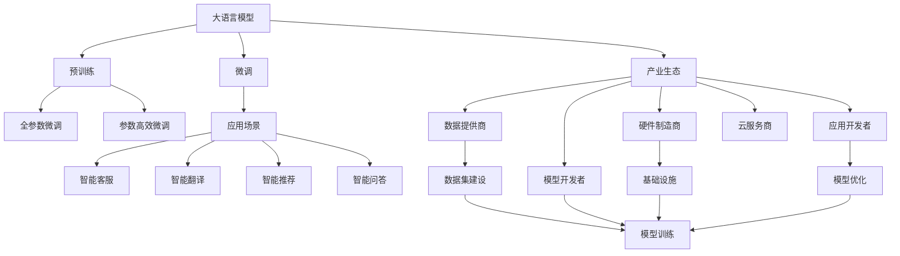

                 

# LLM产业链生态:从无到有的蓬勃发展

> 关键词：
大语言模型,预训练,微调,Fine-tuning,产业生态,技术链条,基础设施,应用场景,未来展望

## 1. 背景介绍

### 1.1 问题由来
近年来，大语言模型(LLM, Large Language Model)技术的发展极大地推动了自然语言处理(NLP, Natural Language Processing)领域的创新，并逐渐形成了一个广泛的产业生态系统。LLM技术不仅仅是一个单一的模型，而是一个涉及到预训练、微调、应用、优化等多个环节的综合技术体系。其从最初的研究实验室的课题，逐渐演变为一个涵盖数据、算法、硬件、软件等多方面的完整产业链。

### 1.2 问题核心关键点
要深刻理解LLM产业链的蓬勃发展，首先要明确几个核心关键点：

- **预训练**：使用大规模无标签数据进行模型的初始化训练，赋予模型初步的语言表达和理解能力。
- **微调**：在预训练的基础上，使用特定任务的有标签数据进一步训练模型，使其能够针对特定任务进行优化。
- **产业生态**：包括数据集建设、模型训练、模型部署、模型优化等多个环节，形成一个完整的产业体系。
- **技术链条**：从数据采集、预处理、模型训练到模型优化、应用部署的全链条技术流程。
- **基础设施**：支撑LLM产业链发展的各种软硬件设施，如高性能计算、存储、网络等。
- **应用场景**：LLM模型在智能客服、智能翻译、智能推荐、智能问答等多个领域的实际应用。

通过这些核心关键点的梳理，我们能够更全面地理解LLM产业链生态从无到有的蓬勃发展过程。

## 2. 核心概念与联系

### 2.1 核心概念概述

为了更好地理解LLM产业链生态的发展，本节将介绍几个关键概念及其相互联系：

- **大语言模型(LLM)**：使用自回归(如GPT系列)或自编码(如BERT)模型架构，在预训练和微调后具备强大的自然语言处理能力。
- **预训练(Pre-training)**：在大量无标签数据上训练模型，使其能够获取通用的语言表达和理解能力。
- **微调(Fine-tuning)**：在预训练模型的基础上，使用特定任务的有标签数据进行进一步训练，提升模型针对具体任务的性能。
- **产业生态**：包括数据提供商、模型开发者、硬件制造商、云服务商等多个环节，形成一个互依互存的技术生态系统。
- **技术链条**：从数据采集、预处理、模型训练到模型优化、应用部署的全链条技术流程，涉及数据科学、机器学习、软件工程、云计算等多个领域。
- **基础设施**：如高性能计算、存储、网络设施等，是LLM产业链健康发展的基础保障。

这些概念之间的逻辑关系可以通过以下Mermaid流程图来展示：



这个流程图展示了大语言模型产业链的核心概念及其相互联系：

1. 大语言模型通过预训练获得初始化表达能力。
2. 微调将通用能力适配到特定任务，提升模型性能。
3. 数据提供商、模型开发者、硬件制造商、云服务商等多方协作，形成完整的产业生态。
4. 模型通过应用开发者转化为实际应用场景，带来商业价值。
5. 数据集建设、模型训练、模型优化等技术环节相互依存，构成完整的技术链条。

这些概念共同构成了LLM产业链生态的基础框架，支撑着大语言模型技术的持续发展和应用。

## 3. 核心算法原理 & 具体操作步骤
### 3.1 算法原理概述

LLM产业链生态的构建，离不开算法的支撑。预训练和微调是大语言模型技术中的两个关键环节，其算法原理如下：

**预训练**：
- **自监督学习**：在无标签数据上，通过设计各种自监督任务（如语言建模、掩码语言建模、对偶预测等）训练模型。
- **自回归模型**：如GPT系列，通过前缀预测的方式，训练模型预测下一个词或句子。
- **自编码模型**：如BERT系列，通过输入文本的掩码和下一句预测任务，训练模型学习文本表示。

**微调**：
- **全参数微调**：将预训练模型作为初始化参数，针对特定任务的标注数据进行微调。
- **参数高效微调**：只调整预训练模型中的特定层，保留大部分预训练权重不变。

### 3.2 算法步骤详解

预训练和微调的具体操作步骤如下：

**预训练步骤**：
1. **数据收集**：收集大规模无标签文本数据。
2. **模型设计**：选择适当的模型架构，如自回归、自编码等。
3. **自监督学习**：设计自监督任务，并使用这些任务训练模型。
4. **参数更新**：通过反向传播和优化算法（如Adam、SGD等）更新模型参数。
5. **模型评估**：在验证集上评估模型性能，优化超参数。

**微调步骤**：
1. **任务适配**：设计特定任务的适配层和损失函数。
2. **数据准备**：准备标注数据集，划分为训练集、验证集和测试集。
3. **模型初始化**：将预训练模型作为初始参数，微调部分或全部层。
4. **模型训练**：使用训练集训练模型，定期在验证集上评估性能。
5. **模型测试**：在测试集上评估模型性能，进行参数微调。

### 3.3 算法优缺点

基于预训练和微调的LLM技术，具有以下优点：
1. **高效性**：预训练和微调可以显著减少对标注数据的需求，提高模型训练效率。
2. **通用性**：预训练模型在多种任务上具有泛化能力，微调可以提升特定任务的表现。
3. **可扩展性**：LLM技术可以轻松扩展到不同的应用领域和任务。
4. **鲁棒性**：微调后的模型对噪声和扰动具有较强的鲁棒性。

同时，也存在以下缺点：
1. **计算成本高**：预训练和微调需要大量计算资源和长时间训练。
2. **模型复杂度**：模型参数量大，推理复杂。
3. **数据依赖**：微调效果依赖于标注数据的质量和数量。
4. **解释性不足**：黑盒模型难以解释其内部工作机制。

### 3.4 算法应用领域

预训练和微调技术已经广泛应用于各种NLP任务，包括：

- **文本分类**：情感分析、主题分类、意图识别等。
- **命名实体识别**：识别文本中的人名、地名、机构名等特定实体。
- **关系抽取**：从文本中抽取实体之间的语义关系。
- **问答系统**：对自然语言问题给出答案。
- **机器翻译**：将源语言文本翻译成目标语言。
- **文本摘要**：将长文本压缩成简短摘要。
- **对话系统**：使机器能够与人自然对话。

这些技术不仅在学术界获得了广泛认可，还在工业界得到了大量应用。

## 4. 数学模型和公式 & 详细讲解 & 举例说明

### 4.1 数学模型构建

预训练和微调的技术细节可以通过数学模型来进一步刻画。

**预训练模型**：
假设预训练模型为 $M_{\theta}$，其中 $\theta$ 为模型参数。定义模型 $M_{\theta}$ 在输入 $x$ 上的输出为 $y=M_{\theta}(x)$。

**微调模型**：
假设微调任务为分类任务，标注数据集为 $D=\{(x_i,y_i)\}_{i=1}^N$，其中 $x_i$ 为输入样本，$y_i$ 为标签。定义微调后的模型为 $M_{\theta}$，其中 $\theta$ 为模型参数。

### 4.2 公式推导过程

以二分类任务为例，推导预训练和微调模型的公式：

**预训练公式**：
- **自回归模型**：
  $$
  \mathcal{L}_{train}(\theta) = -\frac{1}{N}\sum_{i=1}^N \sum_{j=1}^{T-1}y_j\log M_{\theta}(x_{ij})
  $$
  其中 $T$ 为序列长度，$x_{ij}$ 为序列中第 $i$ 个样本的第 $j$ 个词。

- **自编码模型**：
  $$
  \mathcal{L}_{train}(\theta) = -\frac{1}{N}\sum_{i=1}^N (\log M_{\theta}(x_i) + \log(1-M_{\theta}(x_i)))
  $$

**微调公式**：
假设微调任务为二分类任务，则微调模型输出为 $y=M_{\theta}(x)$，定义交叉熵损失函数为：
$$
\ell(M_{\theta}(x),y) = -[y\log M_{\theta}(x) + (1-y)\log(1-M_{\theta}(x))]
$$
则微调模型的经验风险为：
$$
\mathcal{L}(\theta) = -\frac{1}{N}\sum_{i=1}^N \ell(M_{\theta}(x_i),y_i)
$$

### 4.3 案例分析与讲解

以BERT模型为例，推导其在微调中的具体实现：

1. **输入编码**：使用BERT模型对输入文本进行编码，得到表示向量 $h$。
2. **分类层**：在表示向量 $h$ 上添加线性分类层和softmax函数，输出分类概率 $p$。
3. **损失函数**：使用交叉熵损失函数 $\ell(p,y)$ 计算预测结果与真实标签的差异。
4. **优化算法**：使用Adam等优化算法，最小化损失函数 $\mathcal{L}(\theta)$，更新模型参数。

## 5. 项目实践：代码实例和详细解释说明

### 5.1 开发环境搭建

**1. 安装Python**
安装Python 3.7及以上版本。

**2. 安装TensorFlow和TensorBoard**
```bash
pip install tensorflow tensorboard
```

**3. 安装Pandas和NumPy**
```bash
pip install pandas numpy
```

**4. 安装BERT预训练模型**
```bash
pip install transformers
```

### 5.2 源代码详细实现

以下是一个简单的代码实现，用于微调BERT模型进行文本分类任务：

```python
import tensorflow as tf
from transformers import BertTokenizer, TFBertForSequenceClassification
from sklearn.model_selection import train_test_split
import pandas as pd
import numpy as np

# 加载数据集
data = pd.read_csv('data.csv')

# 分割训练集和测试集
train_data, test_data = train_test_split(data, test_size=0.2)

# 加载BERT模型
tokenizer = BertTokenizer.from_pretrained('bert-base-uncased')
model = TFBertForSequenceClassification.from_pretrained('bert-base-uncased', num_labels=2)

# 编码训练数据
train_encodings = tokenizer(train_data['text'].tolist(), truncation=True, padding=True, max_length=512)
test_encodings = tokenizer(test_data['text'].tolist(), truncation=True, padding=True, max_length=512)

# 转换为TensorFlow数据集
train_dataset = tf.data.Dataset.from_tensor_slices((
    dict(train_encodings),
    train_data['label'].tolist()
))
test_dataset = tf.data.Dataset.from_tensor_slices((
    dict(test_encodings),
    test_data['label'].tolist()
))

# 定义模型
def create_model(input_ids, attention_mask, labels):
    outputs = model(input_ids, attention_mask=attention_mask, labels=labels)
    return outputs.logits

# 训练模型
model.compile(optimizer=tf.keras.optimizers.Adam(learning_rate=2e-5), loss=tf.keras.losses.BinaryCrossentropy(from_logits=True), metrics=['accuracy'])
history = model.fit(train_dataset.shuffle(1024).batch(16), epochs=10, validation_data=test_dataset.shuffle(1024).batch(16))

# 评估模型
model.evaluate(test_dataset.shuffle(1024).batch(16))
```

### 5.3 代码解读与分析

**数据加载和预处理**：
- 使用Pandas加载CSV数据集。
- 使用BERT模型中的`BertTokenizer`对文本进行分词和编码。
- 使用TensorFlow的`Dataset`对编码后的数据进行批处理和打乱。

**模型定义和编译**：
- 定义一个简单的预测函数`create_model`，将输入的编码数据和标签作为模型的输入，并返回模型的预测结果。
- 使用`model.compile`方法编译模型，定义优化器、损失函数和评价指标。

**模型训练和评估**：
- 使用`model.fit`方法训练模型，定义训练数据集和验证数据集。
- 使用`model.evaluate`方法评估模型在测试集上的性能。

## 6. 实际应用场景

### 6.1 智能客服系统

智能客服系统是LLM技术的一个重要应用场景。通过微调模型，智能客服可以理解自然语言问题，并给出准确的回答。以下是一个简单的实现示例：

```python
# 加载数据集
data = pd.read_csv('data.csv')

# 分割训练集和测试集
train_data, test_data = train_test_split(data, test_size=0.2)

# 加载BERT模型
tokenizer = BertTokenizer.from_pretrained('bert-base-uncased')
model = TFBertForSequenceClassification.from_pretrained('bert-base-uncased', num_labels=2)

# 编码训练数据
train_encodings = tokenizer(train_data['text'].tolist(), truncation=True, padding=True, max_length=512)
test_encodings = tokenizer(test_data['text'].tolist(), truncation=True, padding=True, max_length=512)

# 转换为TensorFlow数据集
train_dataset = tf.data.Dataset.from_tensor_slices((
    dict(train_encodings),
    train_data['label'].tolist()
))
test_dataset = tf.data.Dataset.from_tensor_slices((
    dict(test_encodings),
    test_data['label'].tolist()
))

# 定义模型
def create_model(input_ids, attention_mask, labels):
    outputs = model(input_ids, attention_mask=attention_mask, labels=labels)
    return outputs.logits

# 训练模型
model.compile(optimizer=tf.keras.optimizers.Adam(learning_rate=2e-5), loss=tf.keras.losses.BinaryCrossentropy(from_logits=True), metrics=['accuracy'])
history = model.fit(train_dataset.shuffle(1024).batch(16), epochs=10, validation_data=test_dataset.shuffle(1024).batch(16))

# 评估模型
model.evaluate(test_dataset.shuffle(1024).batch(16))
```

### 6.2 金融舆情监测

金融舆情监测是LLM技术的另一个重要应用场景。通过微调模型，可以实时监测金融市场的舆情变化，及时预警潜在的风险。以下是一个简单的实现示例：

```python
# 加载数据集
data = pd.read_csv('data.csv')

# 分割训练集和测试集
train_data, test_data = train_test_split(data, test_size=0.2)

# 加载BERT模型
tokenizer = BertTokenizer.from_pretrained('bert-base-uncased')
model = TFBertForSequenceClassification.from_pretrained('bert-base-uncased', num_labels=2)

# 编码训练数据
train_encodings = tokenizer(train_data['text'].tolist(), truncation=True, padding=True, max_length=512)
test_encodings = tokenizer(test_data['text'].tolist(), truncation=True, padding=True, max_length=512)

# 转换为TensorFlow数据集
train_dataset = tf.data.Dataset.from_tensor_slices((
    dict(train_encodings),
    train_data['label'].tolist()
))
test_dataset = tf.data.Dataset.from_tensor_slices((
    dict(test_encodings),
    test_data['label'].tolist()
))

# 定义模型
def create_model(input_ids, attention_mask, labels):
    outputs = model(input_ids, attention_mask=attention_mask, labels=labels)
    return outputs.logits

# 训练模型
model.compile(optimizer=tf.keras.optimizers.Adam(learning_rate=2e-5), loss=tf.keras.losses.BinaryCrossentropy(from_logits=True), metrics=['accuracy'])
history = model.fit(train_dataset.shuffle(1024).batch(16), epochs=10, validation_data=test_dataset.shuffle(1024).batch(16))

# 评估模型
model.evaluate(test_dataset.shuffle(1024).batch(16))
```

### 6.3 个性化推荐系统

个性化推荐系统是LLM技术的另一个重要应用场景。通过微调模型，可以理解用户的兴趣和偏好，提供个性化的推荐服务。以下是一个简单的实现示例：

```python
# 加载数据集
data = pd.read_csv('data.csv')

# 分割训练集和测试集
train_data, test_data = train_test_split(data, test_size=0.2)

# 加载BERT模型
tokenizer = BertTokenizer.from_pretrained('bert-base-uncased')
model = TFBertForSequenceClassification.from_pretrained('bert-base-uncased', num_labels=2)

# 编码训练数据
train_encodings = tokenizer(train_data['text'].tolist(), truncation=True, padding=True, max_length=512)
test_encodings = tokenizer(test_data['text'].tolist(), truncation=True, padding=True, max_length=512)

# 转换为TensorFlow数据集
train_dataset = tf.data.Dataset.from_tensor_slices((
    dict(train_encodings),
    train_data['label'].tolist()
))
test_dataset = tf.data.Dataset.from_tensor_slices((
    dict(test_encodings),
    test_data['label'].tolist()
))

# 定义模型
def create_model(input_ids, attention_mask, labels):
    outputs = model(input_ids, attention_mask=attention_mask, labels=labels)
    return outputs.logits

# 训练模型
model.compile(optimizer=tf.keras.optimizers.Adam(learning_rate=2e-5), loss=tf.keras.losses.BinaryCrossentropy(from_logits=True), metrics=['accuracy'])
history = model.fit(train_dataset.shuffle(1024).batch(16), epochs=10, validation_data=test_dataset.shuffle(1024).batch(16))

# 评估模型
model.evaluate(test_dataset.shuffle(1024).batch(16))
```

## 7. 工具和资源推荐

### 7.1 学习资源推荐

为了帮助开发者掌握LLM产业链生态的开发，这里推荐一些优质的学习资源：

- **《深度学习与自然语言处理》课程**：斯坦福大学的NLP课程，涵盖自然语言处理的基本概念和经典模型。
- **《自然语言处理综述》论文**：系统总结了自然语言处理领域的现状和未来发展趋势。
- **《大规模预训练语言模型》书籍**：介绍大规模预训练语言模型的原理、构建和应用。
- **Transformers官方文档**：HuggingFace提供的预训练模型和微调工具的详细介绍。
- **LLM产业链生态论坛**：汇集行业专家和从业者，交流技术进展和应用实践。

### 7.2 开发工具推荐

LLM产业链生态的开发需要多种工具的支持。以下是几款常用的开发工具：

- **PyTorch**：深度学习框架，提供了丰富的预训练模型和微调工具。
- **TensorFlow**：Google开发的深度学习框架，提供了强大的计算图和模型部署能力。
- **TensorBoard**：用于可视化模型训练过程的工具，提供丰富的图表和分析功能。
- **Pandas**：数据分析工具，用于数据预处理和清洗。
- **NumPy**：数值计算工具，用于矩阵运算和高效计算。

### 7.3 相关论文推荐

LLM产业链生态的研究涉及多个领域，以下是几篇有代表性的论文：

- **《BERT: Pre-training of Deep Bidirectional Transformers for Language Understanding》**：介绍BERT模型及其在预训练和微调中的应用。
- **《GPT-3: Language Models are Few-shot Learners》**：展示GPT-3模型的强大zero-shot学习能力。
- **《AdaLoRA: Adaptive Low-Rank Adaptation for Parameter-Efficient Fine-Tuning》**：提出AdaLoRA方法，提高微调模型的参数效率。
- **《Prompt-based Learning》**：介绍Prompt Learning方法，通过精心设计输入模板，提升微调效果。
- **《Parameter-Efficient Transfer Learning for NLP》**：提出Adapter等参数高效微调方法，减少微调对标注数据的需求。

## 8. 总结：未来发展趋势与挑战

### 8.1 研究成果总结

LLM产业链生态自提出以来，已经取得了显著的发展和突破。预训练和微调技术在NLP领域得到了广泛的应用，并逐步形成了成熟的产业生态系统。未来，随着技术的不断进步，LLM产业链生态将继续发展壮大，为NLP技术带来更多的创新和突破。

### 8.2 未来发展趋势

未来，LLM产业链生态的发展趋势如下：

- **模型规模持续增大**：随着计算能力的提升，预训练模型的参数量将继续增大，模型性能将得到进一步提升。
- **微调技术多样化**：除了传统的全参数微调和参数高效微调，更多新的微调方法将不断涌现，如Prefix-Tuning、LoRA等，进一步提高微调效率和效果。
- **持续学习成为常态**：LLM模型需要持续学习新知识以保持性能，增量学习和在线学习将成为重要的研究方向。
- **数据需求降低**：受启发于Prompt Learning，未来的微调方法将更好地利用大模型的语言理解能力，减少对标注数据的需求。
- **多模态微调崛起**：未来LLM产业链生态将更多地融合多模态数据，提升模型的全面性和鲁棒性。

### 8.3 面临的挑战

尽管LLM产业链生态已经取得了显著的进展，但仍然面临诸多挑战：

- **标注成本高昂**：高质量标注数据的获取成本高，限制了微调模型的应用范围。
- **模型复杂度高**：预训练和微调模型的计算复杂度大，推理效率较低。
- **数据隐私问题**：预训练和微调模型需要大量的数据支持，数据隐私保护问题亟需解决。
- **伦理和法律问题**：LLM模型的应用可能引发伦理和法律问题，如偏见、歧视等。

### 8.4 研究展望

面对这些挑战，未来的研究方向包括：

- **无监督和半监督学习**：探索不依赖标注数据的学习方法，提升模型的泛化能力。
- **计算资源优化**：优化模型结构和计算图，提升推理速度和效率。
- **数据隐私保护**：设计隐私保护技术，保护用户数据的隐私和安全。
- **伦理和法律规范**：制定LLM模型应用的伦理和法律规范，确保其安全性、可解释性和公平性。

通过不断探索和创新，LLM产业链生态将继续向更加智能、高效、安全的方向发展，为NLP技术带来更多的突破和应用。

## 9. 附录：常见问题与解答

**Q1：预训练和微调技术有什么区别？**

A: 预训练是指在大规模无标签数据上训练模型，学习通用的语言表达和理解能力。微调是指在预训练模型的基础上，使用特定任务的有标签数据进行进一步训练，提升模型在该任务上的性能。

**Q2：微调过程中如何选择学习率？**

A: 微调的学习率一般要比预训练时小1-2个数量级，如果使用过大的学习率，容易破坏预训练权重，导致过拟合。一般建议从1e-5开始调参，逐步减小学习率，直至收敛。

**Q3：微调过程中如何进行参数高效微调？**

A: 参数高效微调方法可以只调整预训练模型中的特定层，保留大部分预训练权重不变，以减少过拟合风险。常用的方法包括Adapter、LoRA等。

**Q4：微调模型在实际应用中需要注意哪些问题？**

A: 微调模型在实际应用中需要注意以下问题：
1. 数据预处理：确保数据格式正确，并进行必要的清洗和标准化。
2. 模型优化：选择合适的优化算法和超参数，进行模型优化。
3. 模型部署：选择合适的模型架构和部署方式，保证推理效率。
4. 模型监控：实时监控模型性能，及时发现和解决问题。

**Q5：LLM产业链生态的开发需要哪些步骤？**

A: LLM产业链生态的开发需要以下步骤：
1. 数据采集：收集大规模无标签数据进行预训练。
2. 模型设计：选择适当的模型架构和自监督任务。
3. 预训练：在无标签数据上进行预训练，学习通用语言表示。
4. 微调：在标注数据上进一步训练，提升模型在特定任务上的性能。
5. 应用部署：将微调后的模型应用到实际业务场景中，进行优化和部署。

**Q6：LLM产业链生态的产业生态包括哪些方面？**

A: LLM产业链生态的产业生态包括：
1. 数据提供商：提供大规模无标签和标注数据。
2. 模型开发者：设计预训练和微调算法，构建预训练和微调模型。
3. 硬件制造商：提供高性能计算和存储设施。
4. 云服务商：提供模型训练和推理服务。
5. 应用开发者：将模型应用到实际业务场景中，进行优化和部署。

这些关键问题的解答，有助于开发者更好地理解LLM产业链生态的开发和应用，加速技术的落地和产业化进程。

---

作者：禅与计算机程序设计艺术 / Zen and the Art of Computer Programming

