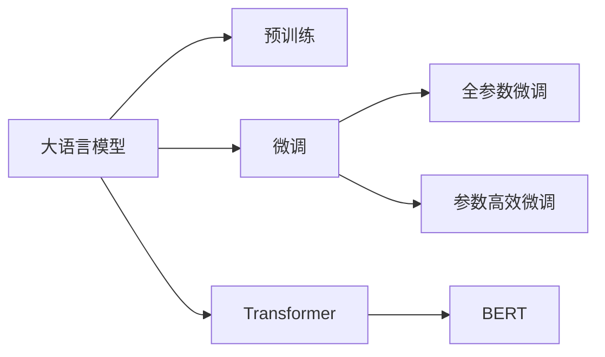

                 

# LLM内核设计：构建AI时代的系统底层

在人工智能的黄金时代，构建具有强大底层能力的系统已经成为推动AI技术发展的重要方向。特别地，语言模型（Language Model, LLM）作为AI的重要分支，其内核设计的精妙程度直接决定了上层应用的效果与性能。本文深入探讨了LLM内核设计的核心概念、算法原理、操作步骤、数学模型以及实际应用场景，旨在为读者提供全面、系统的LLM内核设计知识，并展望其未来发展趋势与挑战。

## 1. 背景介绍

随着深度学习技术的迅猛发展，大语言模型（Large Language Model, LLM）在自然语言处理（NLP）领域取得了显著成果。LLM如GPT、BERT等，通过在大规模无标签文本上预训练，学习到了语言知识和常识，具备了出色的语言理解和生成能力。然而，仅靠预训练并不足以应对特定领域的复杂需求。因此，基于监督学习的微调方法应运而生，通过少量标注数据对预训练模型进行优化，使其在特定任务上表现优异。

## 2. 核心概念与联系

### 2.1 核心概念概述

- **大语言模型（LLM）**：基于深度学习的模型，能够处理自然语言并具备强大的语义理解能力。
- **预训练**：在大规模无标签文本上训练模型，学习语言知识。
- **微调**：使用少量标注数据，对预训练模型进行特定任务优化。
- **Transformer**：一种基于自注意力机制的神经网络结构，是现代LLM的核心组成部分。
- **BERT**：由Google提出，使用掩码语言模型和下一句子预测进行预训练，是LLM的一个重要里程碑。

这些概念之间的逻辑关系可以通过以下Mermaid流程图展示：



## 3. 核心算法原理 & 具体操作步骤

### 3.1 算法原理概述

基于监督学习的微调方法是将预训练的LLM视为一种"特征提取器"，通过在特定任务上使用有标注数据进行微调，来优化模型在该任务上的表现。微调的核心在于如何有效利用预训练的知识，同时避免过拟合。具体来说，微调的目标是最小化损失函数，使得模型输出尽可能接近任务的真实标签。

### 3.2 算法步骤详解

1. **模型选择**：选择合适的预训练模型（如BERT、GPT等），作为微调的初始模型。
2. **数据准备**：准备任务的标注数据集，分为训练集、验证集和测试集。
3. **任务适配**：根据任务类型，设计适当的输出层和损失函数。
4. **超参数设置**：选择合适的优化器及其参数，如学习率、批大小、迭代轮数等。
5. **执行训练**：对训练集数据进行梯度下降，最小化损失函数。
6. **验证与测试**：在验证集上评估模型性能，根据性能调整超参数，最终在测试集上测试模型。

### 3.3 算法优缺点

**优点**：
- 简单高效，易于实现。
- 对少量标注数据仍能取得较好的效果。
- 适用于各种NLP任务。

**缺点**：
- 依赖标注数据，获取高质量标注数据成本较高。
- 迁移能力有限，任务与预训练数据分布差异较大时性能提升有限。
- 模型可能继承预训练模型的固有偏见，存在潜在风险。

### 3.4 算法应用领域

- **问答系统**：基于预训练模型的微调问答系统能够快速响应用户查询，提高服务效率。
- **机器翻译**：通过微调模型可以实现高效的文本翻译。
- **情感分析**：对文本进行情感极性分类，帮助企业理解用户反馈。
- **文本生成**：如对话生成、摘要生成等，提升内容生成质量。

## 4. 数学模型和公式 & 详细讲解 & 举例说明

### 4.1 数学模型构建

假设预训练模型为 $M_{\theta}$，其输入为 $x$，输出为 $y$，目标是最小化经验风险 $\mathcal{L}(\theta) = \frac{1}{N} \sum_{i=1}^N \ell(M_{\theta}(x_i),y_i)$。其中 $\ell$ 为特定任务的损失函数。

### 4.2 公式推导过程

以分类任务为例，假设 $y \in \{0,1\}$，$M_{\theta}(x) \in [0,1]$。损失函数定义为：$\ell(M_{\theta}(x),y) = -[y\log M_{\theta}(x) + (1-y)\log(1-M_{\theta}(x))]$。

### 4.3 案例分析与讲解

假设任务为情感分类，训练数据集为 $\{(x_i, y_i)\}_{i=1}^N$，模型输出为 $M_{\theta}(x_i) \in [0,1]$。模型在训练数据上的损失函数为：$\mathcal{L}(\theta) = -\frac{1}{N} \sum_{i=1}^N [y_i\log M_{\theta}(x_i) + (1-y_i)\log(1-M_{\theta}(x_i))]$。

## 5. 项目实践：代码实例和详细解释说明

### 5.1 开发环境搭建

使用Python进行开发，需要安装PyTorch和Transformers库，配置好GPU环境。

### 5.2 源代码详细实现

```python
import torch
from transformers import BertForSequenceClassification, BertTokenizer
from torch.utils.data import DataLoader
from sklearn.metrics import accuracy_score

# 初始化模型和分词器
model = BertForSequenceClassification.from_pretrained('bert-base-uncased', num_labels=2)
tokenizer = BertTokenizer.from_pretrained('bert-base-uncased')

# 准备训练数据
train_data = ... # 训练集数据
labels = ... # 训练集标签

# 准备数据集
def prepare_data(data):
    return [tokenizer.encode(text, add_special_tokens=True) for text in data]

# 训练过程
def train_epoch(model, data_loader, optimizer):
    model.train()
    for batch in data_loader:
        optimizer.zero_grad()
        inputs = torch.tensor(prepare_data(batch['input']), dtype=torch.long)
        labels = torch.tensor(batch['label'], dtype=torch.long)
        outputs = model(inputs)
        loss = outputs.loss
        loss.backward()
        optimizer.step()

# 评估过程
def evaluate(model, data_loader):
    model.eval()
    correct = 0
    total = 0
    with torch.no_grad():
        for batch in data_loader:
            inputs = torch.tensor(prepare_data(batch['input']), dtype=torch.long)
            labels = torch.tensor(batch['label'], dtype=torch.long)
            outputs = model(inputs)
            _, predicted = torch.max(outputs.logits, dim=1)
            total += labels.size(0)
            correct += (predicted == labels).sum().item()
    return accuracy_score(labels, predicted)

# 训练和评估
train_data_loader = DataLoader(train_data, batch_size=32)
val_data_loader = DataLoader(val_data, batch_size=32)
test_data_loader = DataLoader(test_data, batch_size=32)

optimizer = torch.optim.Adam(model.parameters(), lr=1e-5)
for epoch in range(10):
    train_epoch(model, train_data_loader, optimizer)
    acc = evaluate(model, val_data_loader)
    print(f'Epoch {epoch+1}, accuracy: {acc:.2f}')
```

### 5.3 代码解读与分析

这段代码实现了基于BERT模型的二分类任务微调过程。首先，加载预训练模型和分词器，然后准备训练数据集。接下来，定义数据准备函数 `prepare_data` 和训练过程 `train_epoch`，以及评估过程 `evaluate`。最后，进行模型训练和评估。

## 6. 实际应用场景

### 6.1 智能客服系统

智能客服系统可通过微调预训练模型，提供7x24小时不间断服务，自动理解和回复用户咨询，提升客户体验和解决效率。

### 6.2 金融舆情监测

金融舆情监测利用微调模型自动分析市场舆论，及时预警负面信息，辅助金融机构应对风险。

### 6.3 个性化推荐系统

个性化推荐系统利用微调模型，根据用户行为和兴趣生成推荐内容，提升推荐精准度和用户满意度。

### 6.4 未来应用展望

未来，大语言模型内核设计将向以下方向发展：
- 模型规模不断增大，适应更多复杂任务。
- 微调方法多样化，降低对标注数据的依赖。
- 持续学习成为常态，模型需要不断学习新知识。
- 提示学习和少样本学习等新技术逐渐普及。
- 多模态融合，提升跨领域适应能力。

## 7. 工具和资源推荐

### 7.1 学习资源推荐

- CS224N《深度学习自然语言处理》课程
- 《Natural Language Processing with Transformers》书籍
- 《Transformer from Scratch》博客系列

### 7.2 开发工具推荐

- PyTorch
- TensorFlow
- Transformers库
- Weights & Biases
- TensorBoard

### 7.3 相关论文推荐

- Attention is All You Need
- BERT: Pre-training of Deep Bidirectional Transformers for Language Understanding
- Parameter-Efficient Transfer Learning for NLP

## 8. 总结：未来发展趋势与挑战

### 8.1 研究成果总结

本文深入探讨了大语言模型的内核设计，阐述了基于监督学习的微调方法，并详细介绍了其操作步骤。通过案例分析，展示了微调技术在实际应用中的效果。

### 8.2 未来发展趋势

未来，大语言模型内核设计将向模型规模增大、微调方法多样化、持续学习、少样本学习和多模态融合等方向发展。

### 8.3 面临的挑战

尽管微调技术取得了显著成果，但仍面临标注数据依赖、模型鲁棒性、推理效率、可解释性和安全性等问题。

### 8.4 研究展望

未来研究需注重数据高效利用、模型鲁棒性提升、推理加速、可解释性和安全性保障，推动大语言模型内核设计向更高层次发展。

## 9. 附录：常见问题与解答

**Q1：如何处理过拟合问题？**

A: 可以采用数据增强、正则化、早停等技术来避免过拟合。

**Q2：如何提高模型推理效率？**

A: 模型裁剪、量化加速、服务化封装、弹性伸缩等技术可以有效提升模型推理效率。

**Q3：如何保证模型安全性？**

A: 引入伦理导向评估指标，设置异常告警阈值，构建模型行为监管机制。

**Q4：如何增强模型可解释性？**

A: 引入因果分析和博弈论工具，解释模型决策的因果逻辑。

---

作者：禅与计算机程序设计艺术 / Zen and the Art of Computer Programming

