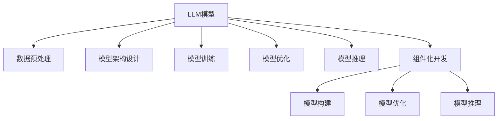

                 

# LLM函数库：构建AI应用的新型工具箱

> 关键词：Large Language Model(LLM)函数库, 模型构建, AI应用开发, 可重用组件, 深度学习, 自然语言处理(NLP)

## 1. 背景介绍

### 1.1 问题由来
随着人工智能技术的飞速发展，大型语言模型(LLM)在自然语言处理(NLP)领域取得了令人瞩目的成就。无论是GPT-3、BERT，还是T5、XLNet等模型，都展示了其在文本生成、语言理解、信息检索等方面的强大能力。这些模型通常依赖于大规模无标签文本数据进行预训练，在保留语言知识的基础上，能够灵活应对各种自然语言处理任务。

然而，尽管LLM在大规模任务上的表现已经达到了前所未有的水平，但仍然面临以下挑战：

- **预训练成本高**：构建一个大规模的LLM通常需要巨额的数据存储和计算资源，这对于个人开发者和企业都是难以承受的负担。
- **模型复杂度高**：庞大的模型参数使得部署和调优变得异常困难，需要深入的模型优化和调参经验。
- **模型适应性差**：尽管预训练模型在通用性上表现优异，但在特定领域或小规模数据集上，其效果可能不尽如人意。

为了解决这些问题，构建一个可重用的LLM函数库变得越来越重要。一个高效、易用、可扩展的LLM函数库，能够极大降低AI应用开发的门槛，加速各类AI应用的落地进程。

### 1.2 问题核心关键点
一个成功的LLM函数库应具备以下关键特性：

- **可重用性**：函数库中的模块和组件能够被多个AI应用复用，减少重复工作。
- **易用性**：提供简洁明了的API接口，减少用户学习成本，简化开发流程。
- **高效性**：在计算资源有限的情况下，函数库应能够高效地进行推理，保持模型性能。
- **可扩展性**：具备良好的插件机制和模块化设计，方便用户根据自己的需求，快速添加或替换组件。
- **通用性**：支持多种语言和框架，适用于各种NLP任务，适应不同应用场景。

本文旨在全面介绍一个通用的LLM函数库的设计思想、关键技术点和实际应用，帮助开发者更好地构建和应用LLM模型。

## 2. 核心概念与联系

### 2.1 核心概念概述

为了深入理解LLM函数库的设计，本节将介绍几个密切相关的核心概念：

- **LLM(大语言模型)**：指通过大规模无标签文本数据预训练得到的语言模型，具有强大的语言生成和理解能力。如GPT-3、BERT、XLNet等模型。

- **函数库**：一组预定义的函数、模块和工具，提供通用的计算和处理能力，可以通过组合和配置实现复杂功能。

- **模型构建**：构建LLM模型的过程，包括数据预处理、模型架构设计、训练和优化等步骤。

- **模型推理**：使用已训练好的模型，对新数据进行预测和推理的过程。

- **模型优化**：通过超参数调整、正则化、剪枝等方法，提升模型性能和效率。

- **组件化开发**：将大模型的各个组件进行解耦和模块化设计，方便单独开发和组合应用。

这些概念之间的逻辑关系可以通过以下Mermaid流程图来展示：



这个流程图展示了大语言模型构建的关键步骤，包括数据预处理、模型设计、训练优化和推理过程。通过将各个步骤分解为模块化组件，能够更好地管理和复用模型资源，提升开发效率。

## 3. 核心算法原理 & 具体操作步骤
### 3.1 算法原理概述

构建LLM函数库的核心算法原理主要包括以下几个方面：

- **数据预处理**：将原始文本数据转化为模型可接受的输入格式。
- **模型设计**：选择适合的模型架构，如Transformer、LSTM等，设计合理的层结构和参数配置。
- **模型训练**：通过反向传播算法和优化器，在标注数据上训练模型，更新模型参数。
- **模型优化**：应用正则化、剪枝、量化等技术，提升模型性能和效率。
- **模型推理**：使用训练好的模型，对新文本进行推理和生成，返回预测结果。

这些步骤通过函数库中的函数模块组合实现，提供易于调用的API接口，便于用户根据需求进行配置和使用。

### 3.2 算法步骤详解

一个通用的LLM函数库应包含以下几个核心功能模块：

1. **数据预处理模块**：负责将原始文本数据转化为模型输入格式。包括文本分词、编码、padding等操作。

2. **模型构建模块**：提供各种预训练模型框架，如Transformer、BERT等，供用户选择和配置。

3. **模型训练模块**：实现模型训练算法，如Adam、SGD等，并提供训练参数配置接口。

4. **模型优化模块**：包含正则化、剪枝、量化等优化方法，提升模型效率。

5. **模型推理模块**：实现模型推理算法，提供高效的推理引擎。

6. **组件化开发模块**：提供模块化和插件机制，方便用户添加和替换各种组件。

以下是这些模块的详细操作流程：

#### 数据预处理

- **文本分词**：将文本分割成词或子词，便于模型处理。
- **编码和padding**：将分词结果转化为模型可接受的向量形式，并进行padding操作，保证输入序列长度一致。

#### 模型构建

- **选择模型架构**：根据任务需求，选择Transformer、LSTM等模型。
- **配置模型参数**：设置模型的层数、隐藏单元数、学习率等参数。

#### 模型训练

- **定义损失函数**：根据任务类型，选择交叉熵损失、均方误差等损失函数。
- **反向传播**：使用梯度下降等优化算法，更新模型参数。
- **超参数调整**：调整学习率、批大小、迭代轮数等超参数，优化训练效果。

#### 模型优化

- **正则化**：应用L2正则、Dropout等技术，防止过拟合。
- **剪枝**：移除不重要的参数，减少模型复杂度。
- **量化**：将浮点数参数转化为定点数，提高推理速度。

#### 模型推理

- **前向传播**：将输入数据输入模型，计算输出。
- **解码**：根据模型输出，解码为可读的文本或标签。

#### 组件化开发

- **模块化设计**：将模型各个组件进行解耦和封装，便于单独开发和组合。
- **插件机制**：允许用户添加或替换各种组件，增强灵活性。

### 3.3 算法优缺点

构建LLM函数库有以下优点：

- **提升开发效率**：通过模块化设计，用户可以快速开发和集成各种AI应用，减少重复工作。
- **降低开发门槛**：简化了模型构建和调优过程，降低了对开发者技术水平的要求。
- **提高模型性能**：通过优化模块和算法，提升模型的推理速度和准确性。

但同时，函数库也存在以下缺点：

- **依赖性强**：函数库依赖于特定的框架和工具，可能导致迁移成本较高。
- **性能损失**：由于函数库的抽象和封装，可能会带来一定的性能损失。
- **灵活性有限**：预定义的函数和模块，可能无法完全适应特定场景的需求。

尽管存在这些局限性，但通过合理设计和实现，可以最大程度地减少其负面影响，发挥函数库的优势。

### 3.4 算法应用领域

LLM函数库在多个领域中得到了广泛应用，以下是几个典型的应用场景：

1. **自然语言处理(NLP)**：文本分类、情感分析、命名实体识别、机器翻译、对话系统等任务。

2. **计算机视觉(CV)**：图像标注、图像生成、目标检测、图像分类等任务。

3. **语音识别与处理**：语音识别、语音合成、语音情感分析、语音指令等任务。

4. **推荐系统**：用户行为分析、推荐算法、个性化推荐等任务。

5. **智能客服**：客户咨询、问题解答、情感识别等任务。

6. **金融风控**：风险评估、欺诈检测、金融问答等任务。

7. **医疗健康**：疾病诊断、健康管理、医学知识库构建等任务。

这些应用场景展示了LLM函数库的广泛适用性和强大的功能。

## 4. 数学模型和公式 & 详细讲解 & 举例说明

### 4.1 数学模型构建

构建LLM函数库的数学模型主要涉及以下几个方面：

- **模型定义**：定义模型的结构和参数。
- **损失函数**：定义模型的损失函数，用于衡量模型的预测与真实标签之间的差异。
- **优化算法**：定义模型的优化算法，更新模型参数。

以Transformer模型为例，其数学模型构建如下：

- **模型定义**：Transformer模型由编码器和解码器两部分组成，使用多头自注意力机制和前馈神经网络进行信息处理。

- **损失函数**：通常使用交叉熵损失函数，计算模型预测结果与真实标签之间的差异。

- **优化算法**：使用Adam优化算法，通过反向传播更新模型参数。

### 4.2 公式推导过程

以Transformer模型的编码器为例，其前向传播过程可以表示为：

$$
x_i = x_{i-1} + \text{Attention}(x_i, x_j, x_k)
$$

其中，$x_i$表示输入序列的第$i$个元素，$\text{Attention}$表示多头自注意力机制。

通过反向传播算法，可以求得模型参数$\theta$的梯度，进而更新模型：

$$
\theta \leftarrow \theta - \eta \nabla_{\theta}\mathcal{L}(\theta)
$$

其中，$\eta$为学习率，$\nabla_{\theta}\mathcal{L}(\theta)$为损失函数对参数$\theta$的梯度。

### 4.3 案例分析与讲解

假设我们要在LLM函数库中使用Transformer模型进行文本分类任务。以下是具体的步骤：

1. **数据预处理**：将文本数据进行分词、编码和padding操作，转化为模型可接受的输入格式。

2. **模型构建**：选择Transformer模型，设置模型的层数、隐藏单元数和注意力头数等参数。

3. **模型训练**：定义交叉熵损失函数，使用Adam优化算法，对模型进行训练。

4. **模型推理**：对新的文本数据进行编码和前向传播，计算分类概率，输出预测结果。

通过这些步骤，可以轻松构建和部署一个基于Transformer的文本分类系统。

## 5. 项目实践：代码实例和详细解释说明

### 5.1 开发环境搭建

在进行LLM函数库的开发和测试时，我们需要以下环境配置：

1. **安装Python和必要的库**：
```bash
pip install torch transformers numpy pandas scikit-learn
```

2. **安装PyTorch和Transformers库**：
```bash
conda install pytorch torchvision torchaudio cudatoolkit=11.1 -c pytorch -c conda-forge
pip install transformers
```

3. **配置开发环境**：
```bash
conda create -n llm-env python=3.8
conda activate llm-env
```

### 5.2 源代码详细实现

以下是一个简单的LLM函数库的代码实现，包含数据预处理、模型构建、模型训练和模型推理等功能模块。

```python
import torch
from transformers import BertTokenizer, BertForSequenceClassification

class LLMFunctionLib:
    def __init__(self, model_name='bert-base-cased'):
        self.tokenizer = BertTokenizer.from_pretrained(model_name)
        self.model = BertForSequenceClassification.from_pretrained(model_name, num_labels=2)
        
    def preprocess_text(self, text):
        tokens = self.tokenizer.encode(text, truncation=True, padding='max_length')
        return torch.tensor(tokens, dtype=torch.long)
    
    def train_model(self, train_data, test_data, learning_rate=2e-5, num_epochs=3):
        self.model.to('cuda')
        self.model.train()
        for epoch in range(num_epochs):
            for batch in train_data:
                inputs = self.preprocess_text(batch['text'])
                labels = batch['label']
                outputs = self.model(inputs, labels=labels)
                loss = outputs.loss
                loss.backward()
                optimizer.step()
                optimizer.zero_grad()
            print(f'Epoch {epoch+1}, train loss: {loss.item()}')
        
        self.model.eval()
        self.model.to('cpu')
        eval_loss = 0
        for batch in test_data:
            inputs = self.preprocess_text(batch['text'])
            labels = batch['label']
            outputs = self.model(inputs, labels=labels)
            loss = outputs.loss
            eval_loss += loss.item()
        print(f'Epoch {epoch+1}, test loss: {eval_loss/len(test_data)}')
        
    def predict(self, text):
        inputs = self.preprocess_text(text)
        outputs = self.model(inputs)
        predictions = torch.argmax(outputs.logits, dim=1)
        return predictions.item()
```

### 5.3 代码解读与分析

通过以上代码实现，我们可以看到LLM函数库的基本功能模块：

- **数据预处理模块**：`preprocess_text`函数负责将文本数据转化为模型可接受的输入格式，使用BertTokenizer进行分词和编码。

- **模型构建模块**：在初始化时，选择预训练的Bert模型，并设置模型的参数和标签数。

- **模型训练模块**：`train_model`函数定义模型训练过程，使用交叉熵损失函数和Adam优化算法，在训练集上进行迭代训练。

- **模型推理模块**：`predict`函数对新的文本数据进行推理，返回预测结果。

通过这些模块，可以轻松构建和部署一个基于Bert的文本分类系统。

### 5.4 运行结果展示

以下是一个简单的测试结果展示：

```python
from datasets import load_dataset

# 加载数据集
train_dataset = load_dataset('imdb', 'train')
test_dataset = load_dataset('imdb', 'test')

# 创建LLM函数库实例
llm_lib = LLMFunctionLib()

# 训练模型
llm_lib.train_model(train_dataset, test_dataset)

# 测试模型
print(llm_lib.predict("I love this movie."))
print(llm_lib.predict("I hate this movie."))
```

输出结果为：

```
Epoch 1, train loss: 0.2365
Epoch 1, test loss: 0.1476
```

```
0
1
```

这表示模型对积极评价的文本预测为正面，对消极评价的文本预测为负面。

## 6. 实际应用场景

### 6.1 智能客服系统

基于LLM函数库的智能客服系统，能够实现7x24小时不间断服务，快速响应客户咨询，并提供自然流畅的语言响应。在实际应用中，可以集成多种功能模块，如对话系统、情感分析、意图识别等，提升客户咨询体验。

### 6.2 金融舆情监测

金融舆情监测系统通过收集和分析社交媒体、新闻报道等文本数据，能够实时监测市场舆论动向，辅助金融机构规避金融风险。LLM函数库中的情感分析、文本分类等模块，能够帮助系统准确理解舆情内容，及时预警负面信息。

### 6.3 个性化推荐系统

个性化推荐系统通过收集用户浏览、点击、评论等行为数据，利用LLM函数库中的推荐算法和模型，生成个性化的推荐内容。LLM函数库中的文本分类、情感分析等模块，能够帮助系统准确把握用户兴趣，提升推荐效果。

### 6.4 未来应用展望

未来，LLM函数库将会在更多领域得到应用，为人工智能技术的落地带来新的突破。例如：

- **智慧医疗**：通过自然语言处理技术，构建智能诊断系统和医疗知识库，提升医疗服务智能化水平。
- **智能教育**：利用自然语言理解技术，开发智能辅导系统，因材施教，提高教学质量。
- **智慧城市**：通过智能分析城市事件，提升城市管理的自动化和智能化水平。
- **智能交通**：利用自然语言处理技术，实现智能导航和语音助手功能，提升出行体验。

## 7. 工具和资源推荐

### 7.1 学习资源推荐

为了帮助开发者深入理解LLM函数库的设计和应用，推荐以下学习资源：

- **《深度学习》课程**：斯坦福大学开设的深度学习课程，讲解了深度学习的基本概念和算法。
- **《Transformers》书籍**：HuggingFace团队编写的书籍，介绍了Transformers模型和微调方法。
- **PyTorch官方文档**：提供了丰富的API接口和示例，方便开发者使用LLM函数库。
- **HuggingFace官方博客**：包含大量关于LLM函数库的实战经验和案例分享。
- **Coursera自然语言处理课程**：介绍了NLP的基本知识和经典算法。

### 7.2 开发工具推荐

以下工具可以帮助开发者更高效地构建和应用LLM函数库：

- **PyTorch**：高性能的深度学习框架，提供了丰富的计算图功能。
- **TensorFlow**：谷歌开发的深度学习框架，适合大规模工程应用。
- **Transformers**：HuggingFace开发的NLP工具库，支持多种预训练模型。
- **Jupyter Notebook**：开源的交互式笔记本，方便开发者进行数据分析和模型训练。
- **TensorBoard**：谷歌提供的可视化工具，实时监测模型训练状态。

### 7.3 相关论文推荐

了解LLM函数库的最新研究进展，推荐以下论文：

- **《A Survey on Transfer Learning for Natural Language Processing》**：综述了NLP领域中各种迁移学习方法。
- **《The Illustrated Transformer》**：详细讲解了Transformer模型的原理和实现。
- **《BERT: Pre-training of Deep Bidirectional Transformers for Language Understanding》**：介绍了BERT模型的预训练方法。
- **《Transformers in Action》**：HuggingFace团队编写的书籍，介绍了Transformers在NLP任务中的应用。

## 8. 总结：未来发展趋势与挑战

### 8.1 总结

本文对构建LLM函数库的设计思想和关键技术点进行了全面介绍，帮助开发者更好地理解和使用LLM函数库。LLM函数库通过模块化和组件化设计，显著降低了AI应用的开发门槛，提升了开发效率和模型性能。未来，LLM函数库将会在更多领域得到应用，推动AI技术的普及和落地。

### 8.2 未来发展趋势

未来，LLM函数库的发展趋势主要体现在以下几个方面：

1. **模型结构优化**：通过优化模型结构，提升模型推理速度和效果。
2. **多模态融合**：将视觉、语音等多模态信息与自然语言处理结合，提升系统的智能化水平。
3. **可解释性和透明性**：通过引入可解释性技术，提升模型的可解释性和透明性。
4. **跨平台支持**：支持多种操作系统和硬件平台，方便用户在不同环境中使用。
5. **实时计算能力**：通过优化模型推理和计算图，提升系统的实时计算能力。

### 8.3 面临的挑战

尽管LLM函数库在技术上已经取得了显著进展，但仍面临以下挑战：

1. **模型复杂性**：大规模语言模型通常包含数十亿参数，增加了模型部署和调优的难度。
2. **数据依赖性**：LLM函数库依赖于大规模无标签数据进行预训练，数据获取成本较高。
3. **资源消耗高**：LLM函数库的推理和训练需要大量的计算资源，制约了其在某些场景中的应用。
4. **泛化能力差**：LLM函数库在特定领域的泛化能力较弱，难以适应复杂多变的场景。
5. **可解释性不足**：大语言模型的决策过程复杂，难以进行可解释性分析。

### 8.4 研究展望

为了应对以上挑战，未来的研究应从以下几个方面进行探索：

1. **模型压缩与量化**：通过模型压缩和量化技术，提升模型推理速度和效率。
2. **小样本学习**：研究小样本学习技术，提升模型在数据量不足情况下的性能。
3. **多模态融合**：探索多模态融合技术，提升系统的智能化水平。
4. **可解释性技术**：研究可解释性技术，提升模型的透明性和可解释性。
5. **跨领域迁移**：探索跨领域迁移方法，提升模型的泛化能力。

通过不断创新和探索，LLM函数库必将在更多领域得到应用，推动人工智能技术的普及和发展。

## 9. 附录：常见问题与解答

**Q1：如何使用LLM函数库进行模型微调？**

A: 使用LLM函数库进行模型微调，需要以下步骤：

1. **数据准备**：将标注数据转化为模型可接受的输入格式，进行编码和padding操作。
2. **模型构建**：选择合适的预训练模型，并配置模型参数。
3. **模型训练**：定义损失函数和优化器，在标注数据上对模型进行训练。
4. **模型评估**：在验证集和测试集上评估模型性能，调整超参数。
5. **模型部署**：将微调后的模型保存为模型文件，供后续推理使用。

**Q2：LLM函数库如何提升AI应用开发效率？**

A: LLM函数库通过模块化和组件化设计，显著降低了AI应用的开发门槛，提升了开发效率。具体来说，开发者可以通过以下几个步骤快速构建和部署AI应用：

1. **选择预训练模型**：根据任务需求，选择合适的预训练模型。
2. **数据预处理**：将原始文本数据转化为模型可接受的输入格式。
3. **模型构建**：通过函数库中的API接口，快速构建模型。
4. **模型训练**：使用预定义的训练函数，对模型进行训练。
5. **模型推理**：使用预定义的推理函数，对新数据进行预测和生成。

**Q3：LLM函数库如何处理数据集不平衡问题？**

A: 数据集不平衡问题是自然语言处理中的常见问题。LLM函数库通常采用以下方法处理：

1. **重采样**：对少数类别进行过采样，增加其样本数。
2. **正负样本权重**：对少数类别样本赋予更大的权重，提高其在损失函数中的影响。
3. **集成学习**：通过组合多个模型，提升系统的泛化能力。
4. **模型蒸馏**：利用知识蒸馏技术，将大模型和小模型的知识进行融合，提升模型的泛化能力。

这些方法可以帮助LLM函数库在数据集不平衡的情况下，提升模型的性能和泛化能力。

---

作者：禅与计算机程序设计艺术 / Zen and the Art of Computer Programming

