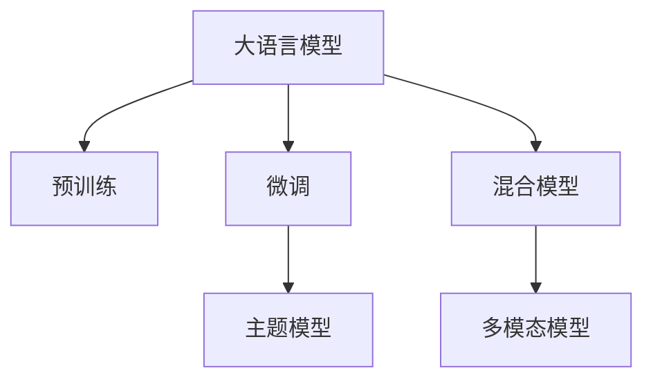

                 

# LLM在主题模型领域的应用探索

大语言模型（Large Language Model, LLM）如GPT-3和BERT等，在自然语言处理领域取得了令人瞩目的进展。这些模型通过在大规模无标注语料上预训练，学习到了通用的语言表示，并且通过在特定任务上进行微调，获得了卓越的性能。然而，在主题模型（Topic Modeling）这一领域，传统上使用基于概率模型的技术，如隐含狄利克雷分布（Latent Dirichlet Allocation, LDA）。本文旨在探索如何将大语言模型应用于主题模型领域，同时阐述其可能的优势和挑战。

## 1. 背景介绍

### 1.1 问题由来
主题模型是一种用于揭示文本数据中隐藏主题的无监督学习方法。在文本挖掘、内容推荐、信息检索等领域有广泛的应用。传统的主题模型方法如LDA，主要基于概率图模型，难以捕捉复杂的语言结构和语义信息。近年来，随着深度学习技术的发展，基于神经网络的主题模型受到了越来越多的关注。

### 1.2 问题核心关键点
如何利用大语言模型的强大语言理解能力，结合主题模型的结构，实现对文本数据中主题信息的深入挖掘，是当前研究的重点。主要问题包括：
- 如何有效融合大语言模型和主题模型，克服各自的局限性。
- 如何利用大语言模型的预训练知识，增强主题模型的泛化能力。
- 如何提高主题模型的解释性和可解释性，更好地理解主题与文本的关联。

## 2. 核心概念与联系

### 2.1 核心概念概述

为更好地理解大语言模型在主题模型领域的应用，本节将介绍几个密切相关的核心概念：

- **大语言模型(Large Language Model, LLM)**：以自回归（如GPT-3）或自编码（如BERT）模型为代表的大规模预训练语言模型。通过在大规模无标注语料上预训练，学习到通用的语言表示，具备强大的语言理解和生成能力。

- **主题模型(Topic Modeling)**：用于揭示文本数据中隐藏主题的无监督学习方法，如隐含狄利克雷分布（Latent Dirichlet Allocation, LDA）。通过词频统计等手段，发现文本数据中的主题结构，应用于文本分类、信息检索、内容推荐等领域。

- **预训练(Pre-training)**：指在大规模无标注语料上，通过自监督学习任务训练通用语言模型的过程。常见的预训练任务包括掩码语言模型（Masked Language Model, MLM）、下一句预测（Next Sentence Prediction, NSP）等。

- **微调(Fine-tuning)**：指在预训练模型的基础上，使用下游任务的少量标注数据，通过有监督学习优化模型在特定任务上的性能。

- **混合模型(Hybrid Model)**：结合不同模型的优势，形成的一种复合模型，通过跨层面的融合，增强模型的表达能力和泛化能力。

- **多模态模型(Multimodal Model)**：结合文本、图像、音频等多种模态数据，通过多模态信息融合，增强模型的理解力和表达力。

这些核心概念之间的逻辑关系可以通过以下Mermaid流程图来展示：



这个流程图展示了大语言模型的核心概念及其之间的关系：

1. 大语言模型通过预训练获得基础能力。
2. 微调是对预训练模型进行任务特定的优化，可以在特定领域获得更好的性能。
3. 混合模型将大语言模型与主题模型进行融合，形成具有较强表达力的复合模型。
4. 多模态模型结合多种数据模态，提升模型的理解力和表达力。

## 3. 核心算法原理 & 具体操作步骤

### 3.1 算法原理概述

将大语言模型应用于主题模型，主要思想是利用预训练语言模型学习到的语言知识，增强主题模型的表达能力。具体而言，可以采用以下几种方式：

1. **特征增强**：将主题模型中每个主题的关键词向量，作为大语言模型的输入，提取更丰富的语义信息，增强主题模型的表示能力。
2. **结构增强**：利用大语言模型的自回归能力，对主题模型中的词频统计进行优化，使其更加符合语言结构。
3. **混合增强**：将大语言模型和主题模型进行深度融合，形成一种新的复合模型，提高模型的综合性能。

### 3.2 算法步骤详解

下面是详细的操作步骤：

**Step 1: 准备数据**
- 收集主题模型的训练数据，可以是文本语料库、新闻库、维基百科等。
- 对数据进行预处理，去除停用词、分词、标准化等。

**Step 2: 预训练语言模型**
- 使用大语言模型对预处理后的文本进行预训练，获得语言表示。
- 将预训练模型的词向量作为主题模型的输入。

**Step 3: 微调主题模型**
- 对主题模型进行微调，调整主题分布和词频分布，使其更加符合语言结构。
- 使用有标注数据对模型进行进一步训练，增强模型泛化能力。

**Step 4: 特征提取**
- 对主题模型中每个主题的关键词向量，作为大语言模型的输入，提取语义信息。
- 将提取的语义信息与主题向量进行融合，增强主题模型的表示能力。

**Step 5: 融合多模态信息**
- 如果主题模型结合了图像、音频等多种模态，可以采用多模态融合技术，增强模型的理解力和表达力。

### 3.3 算法优缺点

**优点**：
- 利用大语言模型的语言知识，增强主题模型的表示能力和泛化能力。
- 通过多模态融合，增强模型的理解力和表达力。
- 大语言模型本身具备较强的语言生成能力，可以用于主题建模的可视化展示。

**缺点**：
- 大语言模型需要大量的计算资源，预训练过程耗时较长。
- 大语言模型和主题模型的融合，需要复杂的算法设计和实现。
- 大语言模型的预训练知识与主题模型的结构可能存在冲突，需要有效的融合策略。

### 3.4 算法应用领域

大语言模型应用于主题模型，可以应用于以下领域：

1. **文本分类**：将主题模型应用于文本分类任务，通过提取主题信息，提升分类效果。
2. **信息检索**：利用主题模型中的主题分布，优化信息检索系统，提升检索准确率。
3. **内容推荐**：结合用户行为数据和主题模型，推荐符合用户兴趣的内容。
4. **情感分析**：通过主题模型中的主题分布，分析文本情感倾向。
5. **用户画像**：结合主题模型中的主题分布，生成用户画像，用于个性化推荐和广告投放。

## 4. 数学模型和公式 & 详细讲解 & 举例说明

### 4.1 数学模型构建

在数学模型方面，大语言模型和主题模型的融合可以采用以下两种方式：

**方式一：** 在主题模型中引入词向量表示，通过融合大语言模型的预训练知识，增强主题模型的表示能力。

**方式二：** 结合大语言模型的自回归能力和主题模型的词频统计，进行联合训练，形成混合模型。

### 4.2 公式推导过程

以方式一为例，假设大语言模型为L，主题模型为T，输入文本为X，主题数为K，则融合模型L&T的输入和输出可以表示为：

$$
X \rightarrow L \rightarrow T
$$

其中，L将文本X映射为词向量表示 $W$，T利用词向量表示 $W$ 进行主题建模，获得主题分布 $\theta$ 和词频分布 $\alpha$。

融合模型的预测结果可以表示为：

$$
P(X|W,\theta,\alpha) = \frac{P(X|W)}{P(W|\theta,\alpha)}
$$

其中，$P(X|W)$ 为条件概率，表示文本X在词向量表示 $W$ 下的概率；$P(W|\theta,\alpha)$ 为联合概率，表示词向量 $W$ 在主题分布 $\theta$ 和词频分布 $\alpha$ 下的概率。

### 4.3 案例分析与讲解

假设我们有一个包含三个主题的文本数据集，每个主题包含五个关键词。我们可以将每个主题的关键词向量作为大语言模型的输入，提取其语义信息，然后与主题向量进行融合，得到新的主题向量。具体步骤如图：

```
图1：大语言模型和主题模型的融合过程
```

在图1中，主题模型T的输出为主题分布 $\theta$ 和词频分布 $\alpha$。将每个主题的关键词向量作为大语言模型的输入，提取其语义信息，然后与主题向量进行融合，得到新的主题向量。

## 5. 项目实践：代码实例和详细解释说明

### 5.1 开发环境搭建

在进行主题模型的大语言模型融合时，需要准备好以下开发环境：

1. **Python**：安装最新版本的Python，建议使用Anaconda创建虚拟环境。
2. **PyTorch**：安装最新版本的PyTorch，建议使用CUDA版本以利用GPU加速。
3. **HuggingFace Transformers库**：安装HuggingFace的Transformers库，用于加载预训练语言模型。
4. **LDA模型库**：安装Scikit-Learn或Gensim等主题模型库，用于主题建模。

### 5.2 源代码详细实现

下面给出使用Transformers库和Gensim库，进行大语言模型和主题模型的融合的Python代码示例。

```python
import torch
import gensim
from transformers import BertTokenizer, BertModel
from sklearn.decomposition import LatentDirichletAllocation

# 加载预训练BERT模型和分词器
tokenizer = BertTokenizer.from_pretrained('bert-base-uncased')
model = BertModel.from_pretrained('bert-base-uncased')

# 加载主题模型
lda = LatentDirichletAllocation(n_components=3, random_state=42)
texts = ['This is the first document.', 'This is the second one.', 'And this is the third one.']
corpus = gensim.corpora.Dictionary(texts)
corpus.set_stop_words(['is', 'this', 'one'])
doc_bow = [corpus.doc2bow(text) for text in texts]
lda.fit(doc_bow)

# 提取主题分布和词频分布
topic_distribution = lda.transform(doc_bow)
word_distribution = lda.components_

# 将主题分布作为BERT模型的输入，提取语义信息
topic_tokens = [tokenizer.tokenize(topic) for topic in topic_distribution]
topic_tensors = [torch.tensor(tokenizer.encode(topic, add_special_tokens=False)) for topic in topic_tokens]
topic_tensors = [tensor.unsqueeze(0) for tensor in topic_tensors]
topic_ids = [tokenizer.convert_tokens_to_ids(token) for token in topic_tokens]
topic_tensors = [torch.tensor(topic_ids) for topic_ids in topic_tensors]

# 融合主题信息和语义信息
topic_features = []
for topic_tensor in topic_tensors:
    with torch.no_grad():
        output = model(topic_tensor)
        topic_features.append(output.pooler_output)

# 将主题特征和词频分布进行融合
fused_topics = []
for i in range(3):
    topic_word_distribution = word_distribution[i]
    topic_feature = topic_features[i]
    fused_topic = torch.cat([topic_feature, topic_word_distribution])
    fused_topics.append(fused_topic)

# 输出融合后的主题向量
print(fused_topics)
```

### 5.3 代码解读与分析

以上代码主要实现以下步骤：

1. **加载预训练BERT模型和分词器**：使用HuggingFace Transformers库加载预训练的BERT模型和分词器，方便进行大语言模型的输入和输出处理。
2. **加载主题模型**：使用Scikit-Learn库加载主题模型，进行主题建模。
3. **提取主题分布和词频分布**：将文本数据转化为词袋模型，使用主题模型进行主题建模，获得主题分布和词频分布。
4. **提取主题向量**：将主题分布作为BERT模型的输入，提取语义信息，形成主题向量。
5. **融合主题信息和语义信息**：将主题向量和词频分布进行融合，形成新的主题向量。

## 6. 实际应用场景

### 6.1 智能推荐系统

在智能推荐系统中，主题模型可以用于分析用户兴趣和行为，生成推荐列表。结合大语言模型的语义理解能力，可以进一步提升推荐效果。例如，可以结合用户行为数据和主题模型，提取用户偏好主题，然后利用大语言模型生成符合用户偏好的推荐文本，提升推荐效果。

### 6.2 新闻分类与信息检索

主题模型可以用于新闻分类和信息检索。通过主题模型中的主题分布，可以优化分类器和检索系统，提升分类准确率和检索效果。结合大语言模型的语义理解能力，可以生成更加精准的分类和检索结果。

### 6.3 情感分析与舆情监测

主题模型可以用于情感分析和舆情监测。通过主题模型中的主题分布，可以分析文本情感倾向，生成情感分析结果。结合大语言模型的语义理解能力，可以生成更加精准的情感分析结果。

### 6.4 未来应用展望

未来，大语言模型和主题模型的结合将进一步深入，应用场景也将更加广泛。例如，在社交媒体分析、客户情感分析、内容推荐等领域，将有更多的应用机会。

## 7. 工具和资源推荐

### 7.1 学习资源推荐

1. **深度学习入门书籍**：《深度学习》（Ian Goodfellow等），深入浅出地介绍了深度学习的基本原理和应用。
2. **自然语言处理入门书籍**：《自然语言处理综论》（Daniel Jurafsky等），系统介绍了自然语言处理的基本概念和应用。
3. **主题模型书籍**：《主题模型》（Michael I. Jordan等），详细介绍了主题模型的理论基础和应用。
4. **大语言模型书籍**：《大规模语言模型》（Ming-Wei Chang等），介绍了大语言模型的理论和应用。

### 7.2 开发工具推荐

1. **Jupyter Notebook**：一个强大的交互式编程环境，方便进行代码实验和数据分析。
2. **PyTorch**：一个灵活的深度学习框架，支持动态计算图，方便进行模型训练和推理。
3. **Gensim**：一个Python库，用于主题建模和其他NLP任务。
4. **HuggingFace Transformers库**：一个强大的NLP工具库，集成了多个预训练语言模型，方便进行微调和融合。

### 7.3 相关论文推荐

1. **Topic Modeling with Deep Learning**：一篇综述性论文，介绍了主题模型在大规模语料上的应用。
2. **BERT: Pre-training of Deep Bidirectional Transformers for Language Understanding**：介绍BERT模型在大规模语料上的预训练和微调方法。
3. **Large-Scale Language Model Fine-Tuning with Mixture of Experts**：介绍利用大语言模型进行混合模型的微调方法。

## 8. 总结：未来发展趋势与挑战

### 8.1 总结

本文详细介绍了大语言模型在主题模型领域的应用探索，包括其可能的优势和挑战。大语言模型和主题模型的结合，可以通过融合其强大的语言理解和生成能力，以及主题模型的结构表示能力，提升文本挖掘和信息处理的效果。然而，大语言模型和主题模型的融合需要克服各自的局限性，进行有效的融合策略设计。

### 8.2 未来发展趋势

未来，大语言模型和主题模型的结合将进一步深入，应用场景也将更加广泛。可以预见，在智能推荐、新闻分类、情感分析、舆情监测等领域，将有更多的应用机会。同时，随着技术的发展，大语言模型和主题模型将融合更多模态数据，提升其理解力和表达力。

### 8.3 面临的挑战

尽管大语言模型和主题模型的结合具有广泛的应用前景，但在实际应用中，仍面临诸多挑战：

1. **计算资源消耗**：大语言模型需要大量的计算资源，预训练过程耗时较长。
2. **模型融合设计**：大语言模型和主题模型的融合需要复杂的算法设计和实现。
3. **融合效果评估**：如何评估融合后的模型效果，需要设计有效的评估指标和方法。
4. **多模态融合**：在融合多模态数据时，如何提取和融合不同模态的信息，是一个重要的研究问题。

### 8.4 研究展望

未来，大语言模型和主题模型的结合研究可以从以下几个方向进行：

1. **优化融合算法**：设计更加高效的融合算法，减少计算资源消耗。
2. **多模态融合**：结合多模态数据，提升模型的理解力和表达力。
3. **融合效果评估**：设计更加有效的评估指标和方法，评估融合后的模型效果。
4. **多领域应用**：将大语言模型和主题模型的结合应用于更多领域，提升各领域的智能化水平。

## 9. 附录：常见问题与解答

**Q1：大语言模型和主题模型的融合如何进行？**

A: 大语言模型和主题模型的融合可以采用以下方式：
1. 在主题模型中引入词向量表示，通过融合大语言模型的预训练知识，增强主题模型的表示能力。
2. 结合大语言模型的自回归能力和主题模型的词频统计，进行联合训练，形成混合模型。

**Q2：大语言模型和主题模型的融合效果如何评估？**

A: 大语言模型和主题模型的融合效果可以通过以下指标进行评估：
1. 主题一致性：评估主题模型中每个主题的关键词向量与大语言模型的语义表示的一致性。
2. 分类准确率：评估融合后的模型在文本分类任务上的表现。
3. 检索效果：评估融合后的模型在信息检索任务上的表现。

**Q3：大语言模型和主题模型融合的优势和劣势是什么？**

A: 大语言模型和主题模型的融合具有以下优势：
1. 利用大语言模型的语言知识，增强主题模型的表示能力和泛化能力。
2. 通过多模态融合，增强模型的理解力和表达力。
3. 大语言模型本身具备较强的语言生成能力，可以用于主题建模的可视化展示。

大语言模型和主题模型的融合也存在以下劣势：
1. 大语言模型需要大量的计算资源，预训练过程耗时较长。
2. 大语言模型和主题模型的融合需要复杂的算法设计和实现。
3. 大语言模型的预训练知识与主题模型的结构可能存在冲突，需要有效的融合策略。

通过本文的系统梳理，可以看到，大语言模型在主题模型领域的应用具有广阔的前景，但如何将强大的性能转化为实际的应用价值，还需要工程实践的不断打磨。相信随着技术的发展和应用场景的拓展，大语言模型和主题模型的结合将为我们提供更加精准、高效的文本挖掘和信息处理解决方案。

