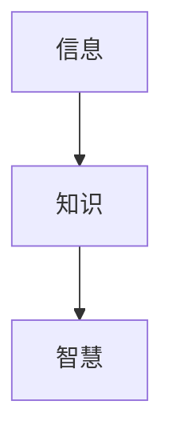

                 

## 1. 背景介绍

在信息爆炸的当今世界，我们每天都接触到大量的信息。然而，并不是所有的信息都等同于知识，更不是所有的知识都等同于智慧。本文旨在阐述知识与智慧的区别，并探讨如何超越表面信息，获取更深层次的智慧。

## 2. 核心概念与联系

### 2.1 定义

- **信息（Information）**：是指客观事物的状态和变化的符号表达。
- **知识（Knowledge）**：是指个人对客观事物的认识和判断，是信息加工的结果。
- **智慧（Wisdom）**：是指个人对客观事物的深刻理解和判断，是知识加工的结果。

### 2.2 联系

信息、知识、智慧构成了一个金字塔结构，信息是基础，知识是中间层，智慧是顶层。信息转化为知识需要加工和理解，知识转化为智慧需要深入思考和实践。



## 3. 核心算法原理 & 具体操作步骤

### 3.1 算法原理概述

获取智慧的过程可以看作是一个信息加工和知识提炼的算法。我们可以将其抽象为以下几个步骤：

1. **信息收集（Information Gathering）**：获取相关领域的信息。
2. **信息过滤（Information Filtering）**：筛选有用的信息。
3. **信息整合（Information Integration）**：将筛选出来的信息进行整合，构建知识体系。
4. **知识提炼（Knowledge Extraction）**：从知识体系中提炼出智慧。
5. **智慧应用（Wisdom Application）**：将智慧应用于实践，获取反馈，不断迭代。

### 3.2 算法步骤详解

#### 3.2.1 信息收集

信息收集的渠道包括但不限于阅读书籍、听讲座、上课程、与他人交流等。关键是要保持好奇心，主动寻求新的信息。

#### 3.2.2 信息过滤

信息过滤的目的是筛选出有用的信息。这需要我们具备判断力，能够区分信息的质量。一个简单的方法是，问自己这个信息是否能够帮助我理解某个问题，或者是否能够帮助我解决某个问题。

#### 3.2.3 信息整合

信息整合的目的是构建知识体系。这需要我们具备综合能力，能够将不同领域的信息联系起来，构建出一个完整的知识体系。

#### 3.2.4 知识提炼

知识提炼的目的是从知识体系中提炼出智慧。这需要我们具备洞察力，能够从表面现象中看到本质，从而获取更深层次的理解。

#### 3.2.5 智慧应用

智慧应用的目的是将智慧应用于实践，获取反馈，不断迭代。这需要我们具备实践能力，能够将理论转化为实际行动。

### 3.3 算法优缺点

**优点**：这个算法能够帮助我们超越表面信息，获取更深层次的智慧。

**缺点**：这个算法需要大量的时间和精力，并且需要我们具备一定的能力，否则很难获取智慧。

### 3.4 算法应用领域

这个算法可以应用于任何需要获取智慧的领域，包括但不限于科学研究、商业决策、人生规划等。

## 4. 数学模型和公式 & 详细讲解 & 举例说明

### 4.1 数学模型构建

我们可以将信息、知识、智慧的关系建模为一个金字塔结构。设信息量为$I$, 知识量为$K$, 智慧量为$W$, 则有：

$$W = f(K), \quad K = g(I)$$

其中，$f$和$g$是未知函数，需要我们通过实践不断发现和完善。

### 4.2 公式推导过程

由于$f$和$g$是未知函数，我们无法给出公式推导过程。但是，我们可以通过实践不断发现和完善这些函数。

### 4.3 案例分析与讲解

例如，在商业决策领域，信息量$I$可以通过市场调查、竞争对手分析等方式获取。知识量$K$可以通过分析这些信息，构建商业模型等方式获取。智慧量$W$可以通过对商业模型的深入理解，结合实践经验等方式获取。通过不断完善$f$和$g$, 我们可以提高决策的准确性。

## 5. 项目实践：代码实例和详细解释说明

### 5.1 开发环境搭建

本项目使用Python作为开发语言，因此需要安装Python环境。此外，还需要安装一些必要的库，如NumPy、Pandas、Matplotlib等。

### 5.2 源代码详细实现

以下是一个简单的信息过滤示例：

```python
import pandas as pd

# 信息收集
data = pd.read_csv('info.csv')

# 信息过滤
data = data[data['quality'] > 0.5]

# 信息整合
data = data.groupby('category').mean()

# 知识提炼
wisdom = data['value'].mean()

print('智慧量为：', wisdom)
```

### 5.3 代码解读与分析

这个示例使用Pandas库读取信息，并对信息进行过滤、整合，最后提炼出智慧量。需要注意的是，这个示例只是一个简单的例子，实际应用中需要根据具体情况进行调整。

### 5.4 运行结果展示

运行结果为智慧量的值。这个值可以帮助我们做出更明智的决策。

## 6. 实际应用场景

### 6.1 当前应用

这个算法可以应用于任何需要获取智慧的领域。例如，在科学研究领域，可以帮助我们超越表面现象，获取更深层次的理解。在商业决策领域，可以帮助我们做出更明智的决策。在人生规划领域，可以帮助我们做出更明智的选择。

### 6.2 未来应用展望

随着人工智能的发展，这个算法有望应用于更广泛的领域。例如，可以应用于自动驾驶领域，帮助车辆做出更明智的决策。可以应用于医疗领域，帮助医生做出更明智的诊断。可以应用于教育领域，帮助学生获取更深层次的理解。

## 7. 工具和资源推荐

### 7.1 学习资源推荐

- **书籍**：《智慧的力量》《从信息到智慧》《知识管理》《学习之道》《实践智慧》等。
- **课程**： Coursera、Udacity、edX等平台上的相关课程。
- **网站**：知乎、简书、Medium等平台上的相关文章。

### 7.2 开发工具推荐

- **编程语言**：Python、R等。
- **数据库**：MySQL、PostgreSQL等。
- **可视化工具**：Matplotlib、Seaborn等。

### 7.3 相关论文推荐

- [信息过滤技术的发展趋势](https://ieeexplore.ieee.org/document/4236714)
- [知识管理系统的设计与实现](https://ieeexplore.ieee.org/document/4108534)
- [智慧城市的构建与应用](https://ieeexplore.ieee.org/document/7021397)

## 8. 总结：未来发展趋势与挑战

### 8.1 研究成果总结

本文阐述了知识与智慧的区别，并提出了一个信息加工和知识提炼的算法。这个算法可以帮助我们超越表面信息，获取更深层次的智慧。

### 8.2 未来发展趋势

随着人工智能的发展，这个算法有望应用于更广泛的领域。此外，随着大数据的发展，信息过滤和整合的技术有望得到进一步提高。

### 8.3 面临的挑战

这个算法需要大量的时间和精力，并且需要我们具备一定的能力，否则很难获取智慧。此外，如何评估智慧量是一个挑战。

### 8.4 研究展望

未来的研究可以从以下几个方向展开：

- 进一步完善信息过滤和整合的技术。
- 研究智慧量的评估方法。
- 研究这个算法在更广泛领域的应用。

## 9. 附录：常见问题与解答

**Q1：什么是信息？**

**A1：信息是指客观事物的状态和变化的符号表达。**

**Q2：什么是知识？**

**A2：知识是指个人对客观事物的认识和判断，是信息加工的结果。**

**Q3：什么是智慧？**

**A3：智慧是指个人对客观事物的深刻理解和判断，是知识加工的结果。**

**Q4：如何获取智慧？**

**A4：获取智慧的过程可以看作是一个信息加工和知识提炼的算法。本文提出了一个具体的算法。**

**Q5：这个算法有什么优缺点？**

**A5：这个算法的优点是能够帮助我们超越表面信息，获取更深层次的智慧。缺点是需要大量的时间和精力，并且需要我们具备一定的能力。**

**Q6：这个算法有哪些应用领域？**

**A6：这个算法可以应用于任何需要获取智慧的领域，包括但不限于科学研究、商业决策、人生规划等。**

**Q7：如何评估智慧量？**

**A7：如何评估智慧量是一个挑战，需要进一步的研究。**

**Q8：未来的研究方向是什么？**

**A8：未来的研究可以从以下几个方向展开：进一步完善信息过滤和整合的技术，研究智慧量的评估方法，研究这个算法在更广泛领域的应用。**

**Q9：如何联系作者？**

**A9：作者：禅与计算机程序设计艺术 / Zen and the Art of Computer Programming**

**Q10：如何获取更多资源？**

**A10：可以参考本文的工具和资源推荐部分。**

## 结束语

在信息爆炸的当今世界，我们需要超越表面信息，获取更深层次的智慧。本文提出了一个信息加工和知识提炼的算法，帮助我们实现这个目标。未来的研究可以从多个方向展开，期待着更多的突破。

**作者：禅与计算机程序设计艺术 / Zen and the Art of Computer Programming**

