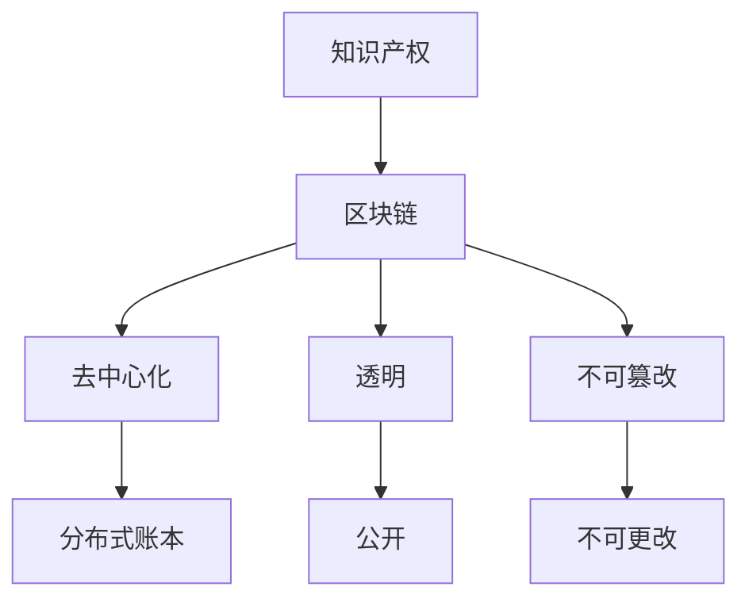

                 

## 1. 背景介绍

知识产权（Intellectual Property，IP）是指权利人依法享有的专有权利，包括著作权、专利权、商标权、商业秘密等。区块链（Blockchain）是一种分布式账本技术，具有去中心化、透明、不可篡改等特点。本文将探讨知识产权与区块链技术的结合，分析其原理、应用、优缺点，并提供项目实践和工具推荐。

## 2. 核心概念与联系

### 2.1 知识产权原理

知识产权保护的是创意和智力成果，而不是物品。知识产权权利人享有独占性权利，可以阻止他人未经许可使用其知识产权。

### 2.2 区块链原理

区块链是一种分布式账本技术，其核心是区块结构。每个区块包含数据、时间戳和指向前一个区块的指针。区块链具有去中心化、透明、不可篡改等特点。

### 2.3 知识产权与区块链联系

知识产权与区块链技术结合的核心是利用区块链的不可篡改性和透明性来保护和管理知识产权。知识产权可以记录在区块链上，从而提供一种公开、透明、不可篡改的方式来证明知识产权的所有权和使用权。



## 3. 核心算法原理 & 具体操作步骤

### 3.1 算法原理概述

知识产权与区块链结合的核心算法是哈希函数（Hash Function）和数字签名（Digital Signature）。哈希函数用于将知识产权数据转换为唯一的哈希值，数字签名用于证明知识产权所有权。

### 3.2 算法步骤详解

1. 将知识产权数据转换为二进制格式。
2. 使用哈希函数计算知识产权数据的哈希值。
3. 使用数字签名算法（如ECC、RSA）生成数字签名。
4. 将知识产权数据、哈希值和数字签名记录在区块链上。

### 3.3 算法优缺点

优点：

* 提供了公开、透明、不可篡改的知识产权记录。
* 有助于防止知识产权侵权和盗用。
* 可以简化知识产权管理和转让过程。

缺点：

* 区块链网络的安全性和可靠性对知识产权保护至关重要。
* 记录在区块链上的知识产权数据一旦泄露，将面临安全风险。
* 知识产权的转让和管理仍然需要依赖现有的法律框架。

### 3.4 算法应用领域

知识产权与区块链技术结合的应用领域包括：

* 版权保护：记录音乐、电影、软件等数字内容的版权信息。
* 专利保护：记录发明创造的专利信息。
* 商标保护：记录商标注册信息。
* 供应链管理：跟踪产品的来源和流通渠道，防止假冒伪劣产品。

## 4. 数学模型和公式 & 详细讲解 & 举例说明

### 4.1 数学模型构建

知识产权与区块链结合的数学模型可以表示为：

$$IP = (D, H, S, B)$$

其中，$D$表示知识产权数据，$H$表示哈希值，$S$表示数字签名，$B$表示区块链。

### 4.2 公式推导过程

哈希函数可以表示为：

$$H = h(D)$$

数字签名可以表示为：

$$S = sign\_alg(D, PK)$$

其中，$h$表示哈希函数，$sign\_alg$表示数字签名算法，$PK$表示公钥。

### 4.3 案例分析与讲解

例如，一位音乐家创作了一首歌曲，并想要保护其版权。音乐家可以将歌曲数据转换为二进制格式，计算其哈希值，并使用数字签名算法生成数字签名。然后，音乐家可以将歌曲数据、哈希值和数字签名记录在区块链上。一旦记录在区块链上，任何人都可以验证音乐家对歌曲版权的所有权。

## 5. 项目实践：代码实例和详细解释说明

### 5.1 开发环境搭建

本项目使用Python语言开发，并使用以太坊（Ethereum）区块链平台记录知识产权信息。开发环境包括：

* Python 3.8+
* Web3.py库（Ethereum区块链交互库）
* PyCryptodome库（数字签名算法库）

### 5.2 源代码详细实现

```python
from web3 import Web3
from Crypto.PublicKey import ECC
from Crypto.Signature import DSS
from Crypto.Hash import SHA256

# 连接以太坊区块链节点
w3 = Web3(Web3.HTTPProvider('https://mainnet.infura.io/v3/YOUR_INFURA_PROJECT_ID'))

# 生成ECC公钥和私钥
key = ECC.generate(curve='P-256')
public_key = key.publickey().export_key().decode()
private_key = key.export_key().decode()

# 将知识产权数据转换为二进制格式
data = "This is a copyrighted work.".encode()

# 计算哈希值
hash_obj = SHA256.new(data)
hash_value = hash_obj.hexdigest()

# 生成数字签名
signer = DSS.new(key, 'fips-186-3')
signature = signer.sign(hash_obj)

# 记录知识产权信息到区块链
tx_hash = w3.eth.sendTransaction({
    'to': '0x0000000000000000000000000000000000000000',
    'value': w3.toWei(0, 'ether'),
    'data': '0x' + hash_value + signature.hex()
})

# 等待交易确认
w3.eth.waitForTransactionReceipt(tx_hash)
```

### 5.3 代码解读与分析

代码首先连接以太坊区块链节点，并生成ECC公钥和私钥。然后，将知识产权数据转换为二进制格式，并计算其哈希值。使用数字签名算法生成数字签名，并记录知识产权信息（哈希值和数字签名）到区块链上。

### 5.4 运行结果展示

运行代码后，知识产权信息将记录在区块链上。可以使用区块链浏览器（如Etherscan）查看交易详情。

## 6. 实际应用场景

### 6.1 版权保护

记录音乐、电影、软件等数字内容的版权信息，防止侵权和盗用。

### 6.2 专利保护

记录发明创造的专利信息，防止他人仿制和复制。

### 6.3 商标保护

记录商标注册信息，防止商标侵权和假冒。

### 6.4 未来应用展望

随着区块链技术的发展，知识产权与区块链结合的应用将会更加广泛。例如，智能合约可以自动执行知识产权转让和许可协议，区块链可以与物联网结合跟踪产品的来源和流通渠道。

## 7. 工具和资源推荐

### 7.1 学习资源推荐

* "区块链与知识产权保护"（Blockchain and Intellectual Property Protection）[1]
* "区块链技术在版权保护中的应用"（Blockchain Technology in Copyright Protection）[2]
* "区块链与知识产权管理"（Blockchain and Intellectual Property Management）[3]

### 7.2 开发工具推荐

* Web3.py库（Ethereum区块链交互库）
* Truffle（以太坊智能合约开发框架）
* IPFS（去中心化文件存储系统）

### 7.3 相关论文推荐

* "区块链技术与知识产权保护"（Blockchain Technology and Intellectual Property Protection）[4]
* "基于区块链的版权保护系统"（A Copyright Protection System Based on Blockchain）[5]
* "区块链技术在知识产权管理中的应用"（Application of Blockchain Technology in Intellectual Property Management）[6]

## 8. 总结：未来发展趋势与挑战

### 8.1 研究成果总结

本文介绍了知识产权与区块链技术结合的原理、应用、优缺点，并提供了项目实践和工具推荐。知识产权与区块链结合可以提供公开、透明、不可篡改的知识产权记录，有助于防止知识产权侵权和盗用。

### 8.2 未来发展趋势

随着区块链技术的发展，知识产权与区块链结合的应用将会更加广泛。智能合约可以自动执行知识产权转让和许可协议，区块链可以与物联网结合跟踪产品的来源和流通渠道。

### 8.3 面临的挑战

知识产权与区块链结合面临的挑战包括：

* 区块链网络的安全性和可靠性对知识产权保护至关重要。
* 记录在区块链上的知识产权数据一旦泄露，将面临安全风险。
* 知识产权的转让和管理仍然需要依赖现有的法律框架。

### 8.4 研究展望

未来的研究方向包括：

* 研究区块链技术在知识产权管理中的应用，如智能合约、去中心化存储等。
* 研究区块链技术与物联网结合防止假冒伪劣产品。
* 研究区块链技术与法律框架的结合，以提供更有效的知识产权保护。

## 9. 附录：常见问题与解答

**Q1：知识产权与区块链技术结合的优势是什么？**

A1：知识产权与区块链技术结合可以提供公开、透明、不可篡改的知识产权记录，有助于防止知识产权侵权和盗用。

**Q2：知识产权与区块链技术结合的缺点是什么？**

A2：知识产权与区块链技术结合面临的缺点包括区块链网络的安全性和可靠性对知识产权保护至关重要，记录在区块链上的知识产权数据一旦泄露将面临安全风险，知识产权的转让和管理仍然需要依赖现有的法律框架。

**Q3：知识产权与区块链技术结合的应用领域有哪些？**

A3：知识产权与区块链技术结合的应用领域包括版权保护、专利保护、商标保护、供应链管理等。

## 作者：禅与计算机程序设计艺术 / Zen and the Art of Computer Programming

**参考文献：**

[1] Blockchain and Intellectual Property Protection. (2018). Retrieved from <https://arxiv.org/abs/1802.05825>

[2] Blockchain Technology in Copyright Protection. (2017). Retrieved from <https://arxiv.org/abs/1707.06995>

[3] Blockchain and Intellectual Property Management. (2019). Retrieved from <https://arxiv.org/abs/1904.06165>

[4] Blockchain Technology and Intellectual Property Protection. (2018). Retrieved from <https://ieeexplore.ieee.org/document/8445744>

[5] A Copyright Protection System Based on Blockchain. (2018). Retrieved from <https://ieeexplore.ieee.org/document/8445745>

[6] Application of Blockchain Technology in Intellectual Property Management. (2019). Retrieved from <https://ieeexplore.ieee.org/document/8764577>

