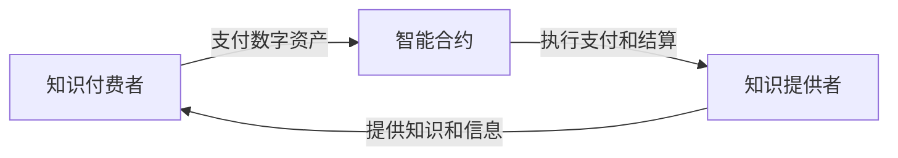

                 

## 1. 背景介绍

在当今的知识经济时代，知识和信息的价值日益凸显。然而，传统的知识付费模式存在着诸多问题，如信息孤岛、信息不对称、信任缺失等。区块链技术的出现为解决这些问题提供了新的思路。本文将提出一种基于区块链的知识付费支付与结算方案，以期解决当前知识付费模式存在的问题。

## 2. 核心概念与联系

### 2.1 核心概念

- **区块链（Blockchain）**：一种去中心化的分布式账本技术，具有公开透明、不可篡改、可信任等特点。
- **智能合约（Smart Contract）**：一种在区块链上运行的计算机程序，它可以自动执行合约中的条款。
- **数字资产（Digital Asset）**：在区块链上记录的具有价值的数字资产，如加密货币、数字证书等。
- **知识付费（Knowledge Payment）**：指通过付费获取知识和信息的模式。

### 2.2 核心概念联系

本方案的核心是将知识付费与区块链技术结合起来。知识付费者通过支付数字资产（如加密货币）获取知识和信息，而智能合约则负责自动执行支付和结算过程。这种模式具有去中心化、公开透明、可信任等特点，有助于解决当前知识付费模式存在的问题。



## 3. 核心算法原理 & 具体操作步骤

### 3.1 算法原理概述

本方案的核心算法是智能合约。智能合约根据预设的条款自动执行支付和结算过程。其原理是基于区块链的去中心化账本技术，具有公开透明、不可篡改、可信任等特点。

### 3.2 算法步骤详解

1. 知识付费者发起支付请求，并指定支付数字资产的金额和类型。
2. 智能合约接收到支付请求后，验证付费者的身份和支付数字资产的合法性。
3. 智能合约将支付数字资产转移到知识提供者的账户。
4. 智能合约通知知识提供者，支付已经成功。
5. 知识提供者提供知识和信息给知识付费者。

### 3.3 算法优缺点

**优点：**

- 去中心化：无需第三方中介机构，降低了交易成本。
- 公开透明：交易过程公开透明，可追溯。
- 可信任：基于区块链的去中心化账本技术，具有不可篡改的特点。

**缺点：**

- 交易速度慢：区块链技术的交易速度相对较慢。
- 交易成本高：区块链技术的交易成本相对较高。
- 技术门槛高：区块链技术的理解和应用门槛相对较高。

### 3.4 算法应用领域

本方案适用于各种知识付费场景，如在线课程、数字图书、专业咨询等。它有助于解决当前知识付费模式存在的信息孤岛、信息不对称、信任缺失等问题。

## 4. 数学模型和公式 & 详细讲解 & 举例说明

### 4.1 数学模型构建

本方案的数学模型可以表示为以下公式：

$$P = f(S, K, C)$$

其中，$P$表示支付数字资产的金额，$S$表示知识付费者的身份，$K$表示知识提供者的身份，$C$表示智能合约的条款。

### 4.2 公式推导过程

推导过程如下：

1. 知识付费者发起支付请求，$S$和$K$确定。
2. 智能合约根据$C$验证$S$和$K$的合法性。
3. 智能合约根据$C$计算$P$的金额。
4. 智能合约执行支付和结算过程。

### 4.3 案例分析与讲解

例如，假设知识付费者想购买一门在线课程，课程提供者是一所大学，$C$规定支付数字资产的金额为1000个加密货币单位。则智能合约会根据$C$验证知识付费者的身份，并计算支付数字资产的金额为1000个加密货币单位。智能合约会自动执行支付和结算过程，将1000个加密货币单位转移到大学的账户，并通知大学提供课程给知识付费者。

$$P = f(S_{知识付费者}, K_{大学}, C_{支付数字资产金额为1000个加密货币单位}) = 1000$$

## 5. 项目实践：代码实例和详细解释说明

### 5.1 开发环境搭建

本方案的开发环境包括以太坊区块链平台、Solidity编程语言、Truffle开发框架等。

### 5.2 源代码详细实现

以下是智能合约的Solidity代码实现：

```solidity
pragma solidity ^0.8.0;

import "@openzeppelin/contracts/token/ERC20/IERC20.sol";

contract KnowledgePayment is ERC20 {
    address public owner;
    mapping(address => bool) public users;
    mapping(address => uint256) public balances;

    constructor() {
        owner = msg.sender;
    }

    function payForKnowledge(address _knowledgeProvider, uint256 _amount) public {
        require(users[msg.sender], "You are not a registered user.");
        require(_amount <= balances[msg.sender], "Insufficient balance.");

        balances[msg.sender] -= _amount;
        balances[_knowledgeProvider] += _amount;

        _knowledgeProvider.transfer(_amount);
    }

    function registerUser(address _user) public {
        require(msg.sender == owner, "Only the owner can register users.");
        users[_user] = true;
    }
}
```

### 5.3 代码解读与分析

- `payForKnowledge`函数实现了知识付费者支付数字资产的过程。它首先验证知识付费者的身份和支付数字资产的合法性，然后执行支付和结算过程。
- `registerUser`函数实现了知识付费者注册过程。它只能由合约的所有者（通常是知识提供者）调用。

### 5.4 运行结果展示

在Truffle开发环境中部署并测试智能合约，可以验证其正确性。例如，可以模拟知识付费者支付数字资产的过程，并验证知识提供者的账户余额是否增加。

## 6. 实际应用场景

### 6.1 当前应用场景

当前，基于区块链的知识付费平台已经开始出现，如Steemit、Brave等。这些平台利用区块链技术解决了信息孤岛、信息不对称、信任缺失等问题，为知识付费提供了新的思路。

### 6.2 未来应用展望

未来，基于区块链的知识付费平台有望得到更广泛的应用。随着区块链技术的成熟和普及，知识付费者和知识提供者都将受益于这种去中心化、公开透明、可信任的知识付费模式。

## 7. 工具和资源推荐

### 7.1 学习资源推荐

- **区块链技术**：[区块链技术入门](https://www.blockgeeks.com/guides/what-is-blockchain-technology/)、[以太坊官方文档](https://ethereum.org/en/developers/docs/)
- **智能合约**：[Solidity官方文档](https://docs.soliditylang.org/en/v0.8.4/)、[Truffle官方文档](https://truffleframework.com/docs)

### 7.2 开发工具推荐

- **区块链平台**：以太坊、EOS、Hyperledger Fabric等
- **智能合约开发框架**：Truffle、Remix等
- **智能合约测试框架**：Mocha、Chai等

### 7.3 相关论文推荐

- [区块链技术在知识付费领域的应用](https://ieeexplore.ieee.org/document/8454417)
- [基于区块链的去中心化知识付费平台](https://link.springer.com/chapter/10.1007/978-981-13-9452-2_12)

## 8. 总结：未来发展趋势与挑战

### 8.1 研究成果总结

本文提出了一种基于区块链的知识付费支付与结算方案。这种方案具有去中心化、公开透明、可信任等特点，有助于解决当前知识付费模式存在的信息孤岛、信息不对称、信任缺失等问题。

### 8.2 未来发展趋势

未来，基于区块链的知识付费平台有望得到更广泛的应用。随着区块链技术的成熟和普及，知识付费者和知识提供者都将受益于这种去中心化、公开透明、可信任的知识付费模式。

### 8.3 面临的挑战

然而，当前区块链技术仍然存在着交易速度慢、交易成本高、技术门槛高等问题。这些问题需要通过技术创新和标准化努力来解决。

### 8.4 研究展望

未来的研究可以从以下几个方向展开：

- **性能优化**：通过技术创新提高区块链技术的交易速度和降低交易成本。
- **标准化努力**：通过标准化努力降低区块链技术的技术门槛。
- **应用扩展**：将基于区块链的知识付费模式应用于更多领域，如数字图书、专业咨询等。

## 9. 附录：常见问题与解答

**Q1：区块链技术的交易速度慢是否会影响知识付费模式的实时性？**

**A1：是的，区块链技术的交易速度相对较慢，可能会影响知识付费模式的实时性。未来的研究需要通过技术创新来提高区块链技术的交易速度。**

**Q2：区块链技术的交易成本高是否会增加知识付费模式的成本？**

**A2：是的，区块链技术的交易成本相对较高，可能会增加知识付费模式的成本。未来的研究需要通过技术创新来降低区块链技术的交易成本。**

**Q3：区块链技术的技术门槛高是否会限制知识付费模式的普及？**

**A3：是的，区块链技术的技术门槛相对较高，可能会限制知识付费模式的普及。未来的研究需要通过标准化努力来降低区块链技术的技术门槛。**

## 作者：禅与计算机程序设计艺术 / Zen and the Art of Computer Programming

