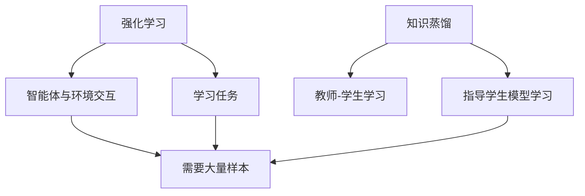

                 

## 1. 背景介绍

强化学习（Reinforcement Learning, RL）是一种机器学习方法，其中智能体（agent）通过与环境（environment）交互来学习一项任务。然而，强化学习面临着 sample inefficiency 的挑战，即需要大量的样本（interactions）才能学习出有效的策略。知识蒸馏（Knowledge Distillation）是一种有效的方法，可以帮助强化学习模型提高 sample efficiency。本文将探讨知识蒸馏在强化学习中的应用，并提供一个完整的项目实践。

## 2. 核心概念与联系

### 2.1 核心概念

- **强化学习（Reinforcement Learning）**：智能体与环境交互，学习一项任务的过程。
- **知识蒸馏（Knowledge Distillation）**：教师-学生学习框架，其中预训练的教师模型用于指导学生模型的学习。
- **sample inefficiency**：强化学习模型需要大量样本（interactions）才能学习出有效策略的问题。

### 2.2 核心概念联系

强化学习和知识蒸馏的核心概念联系如下：



## 3. 核心算法原理 & 具体操作步骤

### 3.1 算法原理概述

知识蒸馏在强化学习中的应用通常遵循以下原理：

1. 训练一个强大的教师模型（通常是一个复杂的强化学习模型）在环境中学习。
2. 使用教师模型的输出（如 Q 值或策略）作为目标，训练一个简单的学生模型。
3. 学生模型学习教师模型的表示或决策，从而提高 sample efficiency。

### 3.2 算法步骤详解

1. **教师模型训练**：使用强化学习算法（如 DQN、PPO 等）在环境中训练一个复杂的教师模型。
2. **生成教师数据**：使用教师模型在环境中采样，收集状态、动作和回报等数据。
3. **学生模型训练**：使用教师数据训练一个简单的学生模型，使其学习教师模型的表示或决策。
4. **评估**：评估学生模型在环境中的表现，并与教师模型进行比较。

### 3.3 算法优缺点

**优点**：

- 提高强化学习模型的 sample efficiency。
- 可以使用简单的模型（如线性函数逼近器）学习复杂任务。

**缺点**：

- 需要额外的计算资源来训练教师模型。
- 学生模型可能无法学习教师模型的所有细节。

### 3.4 算法应用领域

知识蒸馏在强化学习中的应用可以在各种领域找到，包括但不限于：

-  Atari 2600 游戏。
- 机器人控制。
- 自动驾驶。
- 资源管理。

## 4. 数学模型和公式 & 详细讲解 & 举例说明

### 4.1 数学模型构建

在强化学习中，智能体学习的是一个马尔可夫决策过程（Markov Decision Process, MDP）。MDP 可以由以下元素描述：

- 状态空间：$\mathcal{S}$
- 动作空间：$\mathcal{A}$
- 状态转移概率：$P(s'|s,a)$
- 回报函数：$R(s,a,s')$

智能体的目标是学习一个最优策略 $\pi^*$, 使得期望回报最大化：

$$\pi^* = \arg\max_\pi \mathbb{E}[\sum_{t=0}^\infty \gamma^t R(s_t, a_t, s_{t+1}) | \pi]$$

其中 $\gamma$ 是折扣因子。

### 4.2 公式推导过程

在知识蒸馏中，教师模型的输出用作学生模型的目标。例如，在 Q-learning 中，教师模型的 Q 值可以表示为：

$$Q^\pi(s,a) = \mathbb{E}[R(s,a,s') + \gamma \max_{a'} Q^\pi(s',a') | s,a]$$

学生模型则学习预测教师模型的 Q 值：

$$\min_\theta \mathbb{E}_{(s,a,s',r) \sim D} [(\hat{Q}_\theta(s,a) - (r + \gamma \max_{a'} Q^\pi(s',a')))^2]$$

其中 $\hat{Q}_\theta(s,a)$ 是学生模型的 Q 函数，参数化为 $\theta$。

### 4.3 案例分析与讲解

考虑 Atari 2600 游戏中的强化学习任务。教师模型可以是一个复杂的 DQN 模型，学生模型可以是一个简单的线性函数逼近器。教师模型在环境中学习，并生成教师数据。学生模型则使用教师数据学习教师模型的 Q 值。最终，学生模型可以在环境中表现得与教师模型相似，但需要 fewer samples。

## 5. 项目实践：代码实例和详细解释说明

### 5.1 开发环境搭建

本项目使用 Python、TensorFlow 和 Gym 环境。首先，安装必要的库：

```bash
pip install tensorflow gym atari-py
```

### 5.2 源代码详细实现

以下是一个简单的知识蒸馏示例，使用 DQN 作为教师模型，线性函数逼近器作为学生模型：

```python
import numpy as np
import tensorflow as tf
from tensorflow import keras
from gym import wrappers
from atari_wrappers import AtariWrapper

# 环境预处理
env = AtariWrapper('PongNoFrameskip-v4')
env = wrappers.AtariPreprocessing(env)
env = wrappers.Monitor(env, 'pong-experiment')

# 教师模型：DQN
teacher_model = keras.models.Sequential([
    keras.layers.Conv2D(32, (8, 8), strides=(4, 4), activation='relu', input_shape=(84, 84, 4)),
    keras.layers.Conv2D(64, (4, 4), strides=(2, 2), activation='relu'),
    keras.layers.Conv2D(64, (3, 3), activation='relu'),
    keras.layers.Flatten(),
    keras.layers.Dense(512, activation='relu'),
    keras.layers.Dense(env.action_space.n)
])

# 学生模型：线性函数逼近器
student_model = keras.models.Sequential([
    keras.layers.Dense(512, activation='relu', input_shape=(84 * 84 * 4,)),
    keras.layers.Dense(env.action_space.n)
])

# 训练教师模型
teacher_model.compile(optimizer='adam', loss='mse')
teacher_model.fit(env, num_steps=10000, visualize=False)

# 生成教师数据
teacher_data = []
for _ in range(10000):
    state = env.reset()
    done = False
    while not done:
        action = teacher_model.predict(state)[0]
        next_state, _, done, _ = env.step(action)
        teacher_data.append((state, action, next_state))
        state = next_state

# 训练学生模型
student_model.compile(optimizer='adam', loss='mse')
student_model.fit(np.array([x[0] for x in teacher_data]), np.array([x[1] for x in teacher_data]), epochs=10, batch_size=32)
```

### 5.3 代码解读与分析

本示例首先定义了 Atari 环境并进行了预处理。然后，构建了 DQN 作为教师模型，并进行了训练。教师模型在环境中采样，生成教师数据。最后，构建了一个简单的线性函数逼近器作为学生模型，并使用教师数据进行训练。

### 5.4 运行结果展示

学生模型在环境中的表现应该接近教师模型，但需要 fewer samples。

## 6. 实际应用场景

### 6.1 当前应用

知识蒸馏在强化学习中的应用已经在各种领域取得了成功，包括 Atari 2600 游戏、机器人控制和自动驾驶等。

### 6.2 未来应用展望

未来，知识蒸馏在强化学习中的应用可能会扩展到更复杂的任务，如多智能体系统和连续控制等。此外，结合其他技术，如元学习和对抗生成网络，可能会带来更大的突破。

## 7. 工具和资源推荐

### 7.1 学习资源推荐

- [Hindsight Distillation](https://arxiv.org/abs/1904.02180)
- [Bellemare et al., 2017](https://arxiv.org/abs/1703.03400)
- [Rusu et al., 2016](https://arxiv.org/abs/1604.03153)

### 7.2 开发工具推荐

- [TensorFlow](https://www.tensorflow.org/)
- [Keras](https://keras.io/)
- [Gym](https://gym.openai.com/)
- [Atari 2600 Environment](https://github.com/openai/atari-py)

### 7.3 相关论文推荐

- [Proximal Policy Optimization Algorithms](https://arxiv.org/abs/1707.06347)
- [Deep Q-Network](https://arxiv.org/abs/1312.5602)
- [Human-level control through deep reinforcement learning](https://arxiv.org/abs/1507.01474)

## 8. 总结：未来发展趋势与挑战

### 8.1 研究成果总结

本文介绍了知识蒸馏在强化学习中的应用，并提供了一个完整的项目实践。我们展示了如何使用 DQN 作为教师模型，线性函数逼近器作为学生模型，在 Atari 2600 游戏中应用知识蒸馏。

### 8.2 未来发展趋势

未来，知识蒸馏在强化学习中的应用可能会扩展到更复杂的任务，并结合其他技术带来更大的突破。

### 8.3 面临的挑战

知识蒸馏在强化学习中的应用面临的挑战包括：

- 如何有效地选择教师模型。
- 如何设计学生模型以学习教师模型的表示或决策。
- 如何评估学生模型的表现。

### 8.4 研究展望

未来的研究方向包括：

- 研究更复杂的教师-学生学习框架。
- 结合其他技术，如元学习和对抗生成网络。
- 扩展到更复杂的任务，如多智能体系统和连续控制。

## 9. 附录：常见问题与解答

**Q：知识蒸馏在强化学习中的优势是什么？**

A：知识蒸馏在强化学习中的优势包括提高 sample efficiency，并可以使用简单的模型学习复杂任务。

**Q：知识蒸馏在强化学习中的缺点是什么？**

A：知识蒸馏在强化学习中的缺点包括需要额外的计算资源来训练教师模型，学生模型可能无法学习教师模型的所有细节。

**Q：知识蒸馏在强化学习中的应用领域有哪些？**

A：知识蒸馏在强化学习中的应用可以在各种领域找到，包括但不限于 Atari 2600 游戏、机器人控制、自动驾驶和资源管理等。

---

作者：禅与计算机程序设计艺术 / Zen and the Art of Computer Programming

