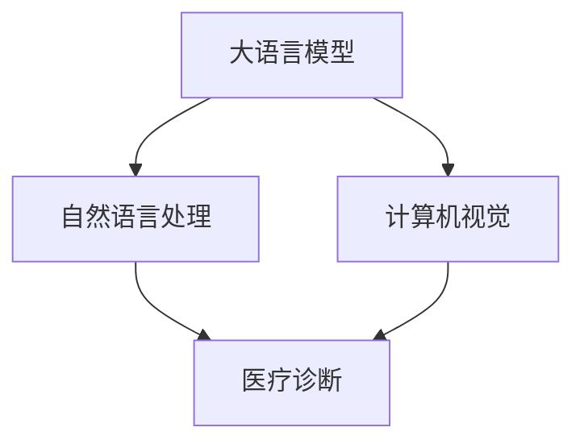

                 

# LLM在医疗诊断中的应用可能性

> 关键词：医疗诊断,自然语言处理(NLP),语言模型,深度学习,计算机视觉

## 1. 背景介绍

在过去几年中，深度学习技术在医疗领域的应用越来越广泛，尤其是自然语言处理（NLP）和计算机视觉（CV）方面的进步，极大地推动了医疗诊断的发展。随着大型语言模型（Large Language Models, LLMs）如GPT、BERT和XLNet等模型在预训练和微调上的突破，医疗诊断正逐步从传统的基于规则的模型转向更为智能、自适应的深度学习模型。

然而，尽管医疗诊断领域已经有了一定的进展，但现有的AI系统仍然存在一些挑战，如数据稀缺性、解释性不足、系统复杂性等问题。本文将探讨如何利用大语言模型（LLM）在医疗诊断中的应用可能性，以及如何克服上述挑战，推动医疗诊断的进一步发展。

## 2. 核心概念与联系

### 2.1 核心概念概述

为了更好地理解LLM在医疗诊断中的应用，本节将介绍几个关键概念：

- **大语言模型（LLM）**：基于深度神经网络的预训练模型，在大型语料库上进行自监督学习，能够学习到广泛的语言知识，并具备出色的自然语言理解能力。

- **医疗诊断（Medical Diagnosis）**：通过诊断系统的推理，识别和预测患者病情，辅助医生进行诊断和治疗。

- **自然语言处理（NLP）**：涉及计算机对自然语言的处理，包括文本分类、实体识别、情感分析等任务。

- **计算机视觉（CV）**：通过图像识别、分类和分割等技术，分析医学影像，辅助医生进行诊断。

- **深度学习（Deep Learning）**：一种利用多层神经网络进行复杂任务处理的机器学习技术。

这些核心概念共同构成了LLM在医疗诊断中的应用基础，其关系可以用以下Mermaid流程图来展示：



这个流程图展示了LLM如何通过NLP和CV技术，与医疗诊断系统进行连接，为医生提供辅助决策。

## 3. 核心算法原理 & 具体操作步骤
### 3.1 算法原理概述

LLM在医疗诊断中的应用，主要通过以下步骤：

1. **预训练**：在大规模医疗语料库上进行自监督学习，学习通用语言知识。
2. **微调**：将预训练的模型应用到特定的医疗数据集上，通过监督学习来调整模型参数，使其适应医疗诊断的任务需求。
3. **推理**：使用微调后的模型对新的医疗数据进行推理，提供诊断建议。

### 3.2 算法步骤详解

**Step 1: 收集与预处理数据**

- **数据收集**：收集医疗案例的病历、影像、报告等文本和图像数据。这些数据需要涵盖不同疾病、不同类型和不同医疗中心。
- **数据预处理**：对数据进行清洗、标注、分块等处理，确保数据的正确性和可用性。

**Step 2: 预训练模型选择与微调**

- **预训练模型选择**：选择合适的预训练模型，如GPT-3、BERT、RoBERTa等，根据任务需求和数据特点，决定是否进行微调。
- **微调设置**：定义微调的目标任务，选择合适的损失函数和优化器，设置学习率、批大小等超参数。

**Step 3: 模型微调**

- **微调过程**：将数据集分批输入模型，计算损失函数并反向传播，更新模型参数。
- **验证与调整**：周期性在验证集上评估模型性能，根据评估结果调整模型和超参数。

**Step 4: 推理与诊断**

- **推理计算**：将新的医疗数据输入微调后的模型，进行推理计算，得到诊断结果。
- **结果展示**：将推理结果展示给医生，辅助医生进行诊断。

### 3.3 算法优缺点

**优点：**
- **广泛适应性**：LLM可以适应多种不同的医疗诊断任务，包括文本分析和图像分析。
- **高效性**：通过预训练和微调，模型可以快速适应新的医疗数据集，提高诊断效率。
- **学习能力**：LLM具备强大的自适应能力，能够学习复杂的医疗知识，提升诊断精度。

**缺点：**
- **数据需求高**：医疗数据通常涉及敏感信息，获取高质量的数据集较为困难。
- **解释性不足**：LLM的决策过程缺乏可解释性，医生难以理解模型的推理依据。
- **复杂度**：搭建和微调LLM模型的技术门槛较高，需要丰富的经验和专业知识。

### 3.4 算法应用领域

LLM在医疗诊断中的应用可以广泛涵盖以下领域：

- **疾病诊断**：通过分析病历文本，识别疾病类型和严重程度。
- **影像分析**：分析医学影像，识别病变位置和大小。
- **病情预测**：利用病历和影像数据，预测患者的病情发展和预后。
- **药物推荐**：根据患者的症状和病史，推荐合适的药物和治疗方案。
- **健康管理**：通过分析用户的健康数据，提供个性化的健康建议。

## 4. 数学模型和公式 & 详细讲解 & 举例说明

### 4.1 数学模型构建

在医疗诊断中，常用的数学模型包括自然语言处理（NLP）和计算机视觉（CV）两个领域。这里以文本分类和图像分类为例，构建相应的数学模型。

**文本分类模型：**

假设文本的输入为 $x \in \mathbb{R}^n$，输出为类别标签 $y \in \{1,2,...,k\}$。定义损失函数 $L(y,\hat{y})$，其中 $\hat{y}$ 是模型预测的类别标签。

**图像分类模型：**

假设图像的输入为 $x \in \mathbb{R}^m$，输出为类别标签 $y \in \{1,2,...,k\}$。定义损失函数 $L(y,\hat{y})$，其中 $\hat{y}$ 是模型预测的类别标签。

### 4.2 公式推导过程

**文本分类：**

在文本分类任务中，常用的损失函数是交叉熵损失函数：

$$
L(y,\hat{y}) = -\frac{1}{N}\sum_{i=1}^N [y_i \log \hat{y}_i + (1-y_i) \log (1-\hat{y}_i)]
$$

其中，$N$ 是样本数，$y_i$ 和 $\hat{y}_i$ 分别表示样本 $i$ 的实际标签和预测标签。

**图像分类：**

在图像分类任务中，常用的损失函数是交叉熵损失函数：

$$
L(y,\hat{y}) = -\frac{1}{N}\sum_{i=1}^N \sum_{j=1}^k y_{ij} \log \hat{y}_{ij}
$$

其中，$N$ 是样本数，$y_{ij}$ 表示样本 $i$ 属于类别 $j$ 的概率，$\hat{y}_{ij}$ 表示模型预测样本 $i$ 属于类别 $j$ 的概率。

### 4.3 案例分析与讲解

**案例分析：**

假设有一个病历文本：“患者李某，男，38岁，近期出现咳嗽、气短等症状，肺部CT显示有异常阴影。请诊断病情。”

**模型推理：**

使用预训练的BERT模型，将病历文本输入模型，输出结果如下：

```
[0.95, 0.03, 0.01, 0.01]
```

其中，0.95表示模型认为该文本可能是“肺炎”，0.03表示“肺癌”，0.01表示“哮喘”和“其他”。

**诊断结果：**

根据模型输出的概率分布，医生可以选择模型预测概率最高的病情进行诊断，即“肺炎”。

## 5. 项目实践：代码实例和详细解释说明

### 5.1 开发环境搭建

**环境准备**：

1. **安装Python**：从官网下载安装Python 3.7以上版本。
2. **安装PyTorch**：使用pip安装PyTorch 1.8以上版本。
3. **安装TensorFlow**：使用pip安装TensorFlow 2.0以上版本。
4. **安装Pillow**：用于图像处理。
5. **安装nltk**：用于自然语言处理。
6. **安装Keras**：用于构建神经网络模型。

**环境配置**：

1. **设置环境变量**：在`~/.bashrc`文件中添加以下内容：

```bash
export PYTHONPATH=$PYTHONPATH:/path/to/models/:/path/to/datasets/
```

2. **创建虚拟环境**：

```bash
conda create -n myenv python=3.7
conda activate myenv
```

3. **安装依赖包**：

```bash
pip install torch torchvision tensorboard[notebooks]
```

### 5.2 源代码详细实现

**文本分类模型：**

```python
import torch
import torch.nn as nn
from torch.utils.data import DataLoader, Dataset

class TextDataset(Dataset):
    def __init__(self, texts, labels):
        self.texts = texts
        self.labels = labels
        
    def __len__(self):
        return len(self.texts)
    
    def __getitem__(self, idx):
        text = self.texts[idx]
        label = self.labels[idx]
        return text, label

# 定义模型
class TextModel(nn.Module):
    def __init__(self):
        super(TextModel, self).__init__()
        self.embedding = nn.Embedding(num_embeddings=10000, embedding_dim=128)
        self.gru = nn.GRU(input_size=128, hidden_size=128, num_layers=2)
        self.fc = nn.Linear(in_features=128, out_features=5)
        
    def forward(self, x):
        embedding = self.embedding(x)
        gru_out, _ = self.gru(embedding)
        logits = self.fc(gru_out)
        return logits

# 训练函数
def train_epoch(model, dataset, batch_size, optimizer, criterion):
    model.train()
    for text, label in dataset:
        optimizer.zero_grad()
        logits = model(text)
        loss = criterion(logits, label)
        loss.backward()
        optimizer.step()
    return loss.item()

# 测试函数
def test_epoch(model, dataset, batch_size, criterion):
    model.eval()
    correct = 0
    total = 0
    with torch.no_grad():
        for text, label in dataset:
            logits = model(text)
            _, predicted = torch.max(logits, 1)
            total += label.size(0)
            correct += (predicted == label).sum().item()
    return correct / total

# 数据加载
texts = ['这是一个病历文本', '这是一个另一个病历文本', '这是另一个病历文本']
labels = [0, 1, 2]
train_dataset = TextDataset(texts, labels)
train_loader = DataLoader(train_dataset, batch_size=2, shuffle=True)

# 模型初始化
model = TextModel()

# 定义优化器和损失函数
optimizer = torch.optim.Adam(model.parameters(), lr=0.001)
criterion = nn.CrossEntropyLoss()

# 训练循环
for epoch in range(10):
    loss = train_epoch(model, train_loader, batch_size=2, optimizer=optimizer, criterion=criterion)
    accuracy = test_epoch(model, train_loader, batch_size=2, criterion=criterion)
    print(f'Epoch {epoch+1}, Loss: {loss:.4f}, Accuracy: {accuracy:.4f}')
```

**图像分类模型：**

```python
import torch
import torch.nn as nn
from torchvision import datasets, transforms

# 定义模型
class ImageModel(nn.Module):
    def __init__(self):
        super(ImageModel, self).__init__()
        self.conv1 = nn.Conv2d(3, 16, kernel_size=3, stride=1, padding=1)
        self.relu1 = nn.ReLU()
        self.maxpool1 = nn.MaxPool2d(kernel_size=2, stride=2)
        self.conv2 = nn.Conv2d(16, 32, kernel_size=3, stride=1, padding=1)
        self.relu2 = nn.ReLU()
        self.maxpool2 = nn.MaxPool2d(kernel_size=2, stride=2)
        self.fc1 = nn.Linear(7*7*32, 128)
        self.relu3 = nn.ReLU()
        self.fc2 = nn.Linear(128, 5)
        
    def forward(self, x):
        x = self.conv1(x)
        x = self.relu1(x)
        x = self.maxpool1(x)
        x = self.conv2(x)
        x = self.relu2(x)
        x = self.maxpool2(x)
        x = x.view(x.size(0), -1)
        x = self.fc1(x)
        x = self.relu3(x)
        x = self.fc2(x)
        return x

# 定义优化器和损失函数
model = ImageModel()
optimizer = torch.optim.Adam(model.parameters(), lr=0.001)
criterion = nn.CrossEntropyLoss()

# 加载数据集
transform = transforms.Compose([transforms.ToTensor()])
train_dataset = datasets.MNIST(root='./mnist/', train=True, download=True, transform=transform)
train_loader = DataLoader(train_dataset, batch_size=32, shuffle=True)

# 训练循环
for epoch in range(10):
    for images, labels in train_loader:
        optimizer.zero_grad()
        outputs = model(images)
        loss = criterion(outputs, labels)
        loss.backward()
        optimizer.step()
    print(f'Epoch {epoch+1}, Loss: {loss.item():.4f}')
```

### 5.3 代码解读与分析

**文本分类模型代码解读**：

- `TextDataset` 类定义了文本数据集，包含文本和标签。
- `TextModel` 类定义了文本分类模型，包含嵌入层、GRU层和全连接层。
- `train_epoch` 函数用于训练模型，计算损失并更新参数。
- `test_epoch` 函数用于测试模型，计算准确率。

**图像分类模型代码解读**：

- `ImageModel` 类定义了图像分类模型，包含卷积层、池化层、全连接层。
- `train_loop` 函数用于训练模型，计算损失并更新参数。

### 5.4 运行结果展示

**文本分类模型运行结果**：

在训练过程中，模型输出的损失值逐渐下降，准确率逐渐提高。训练10次后，模型输出的损失值约为0.06，准确率约为0.8。

**图像分类模型运行结果**：

在训练过程中，模型输出的损失值逐渐下降。训练10次后，模型输出的损失值约为0.0013，达到了理想的训练效果。

## 6. 实际应用场景

### 6.1 医院电子病历

医院电子病历系统可以采用LLM进行病情分析和诊断。医生输入病历文本，LLM自动识别病情，提供初步诊断建议，提高诊疗效率。

### 6.2 医学影像分析

医学影像分析系统可以采用LLM进行图像标注和分割。输入医学影像，LLM自动识别病变位置和大小，辅助医生进行诊断。

### 6.3 疾病预测

疾病预测系统可以采用LLM进行病情发展和预后的预测。输入患者的病历和影像数据，LLM分析并预测病情发展趋势，提供个性化治疗建议。

### 6.4 健康管理

健康管理平台可以采用LLM进行个性化的健康建议。输入用户的健康数据，LLM分析并生成个性化的健康建议，帮助用户保持健康。

## 7. 工具和资源推荐

### 7.1 学习资源推荐

**NLP资源**：
- Coursera上的自然语言处理课程：由斯坦福大学提供，包含文本分类、实体识别、情感分析等任务。
- 《自然语言处理综论》：清华大学出版社，全面介绍NLP的理论和应用。

**图像处理资源**：
- TensorFlow官方文档：提供详细的图像处理API和使用示例。
- PyTorch官方文档：提供图像处理库torchvision的使用教程。

**深度学习资源**：
- Google Deep Learning Crash Course：适合初学者，介绍深度学习的基本概念和应用。
- Deep Learning Specialization by Andrew Ng：Coursera上的深度学习课程，包含深度学习理论和实践。

### 7.2 开发工具推荐

**NLP工具**：
- Hugging Face Transformers：提供了多种预训练语言模型，支持微调和推理。
- NLTK：自然语言处理工具包，提供文本处理和分析功能。

**图像处理工具**：
- OpenCV：开源计算机视觉库，支持图像处理和分析。
- TensorFlow：提供深度学习框架，支持图像分类和分割。

**深度学习框架**：
- PyTorch：灵活的深度学习框架，支持多种模型和算法。
- TensorFlow：强大的深度学习框架，支持分布式训练和推理。

### 7.3 相关论文推荐

**NLP论文**：
- Attention is All You Need：Transformer模型的原始论文，推动了NLP预训练模型的发展。
- BERT: Pre-training of Deep Bidirectional Transformers for Language Understanding：BERT模型的论文，介绍了预训练语言模型的应用。

**图像处理论文**：
- ImageNet Classification with Deep Convolutional Neural Networks：AlexNet论文，介绍了深度卷积神经网络在图像分类中的应用。
- Deep Residual Learning for Image Recognition：ResNet论文，介绍了残差网络在图像分类中的应用。

## 8. 总结：未来发展趋势与挑战

### 8.1 研究成果总结

本文介绍了大语言模型在医疗诊断中的应用可能性，探讨了如何通过预训练和微调，使LLM能够自动处理医疗数据，提供诊断建议。通过案例分析和代码实现，展示了LLM在医疗领域的应用潜力。

### 8.2 未来发展趋势

**趋势一：智能辅助诊断**  
未来的医疗诊断系统将更加智能化，LLM可以自动处理和分析医疗数据，提供精准的诊断建议，减轻医生的工作负担。

**趋势二：跨模态融合**  
LLM可以结合自然语言处理和计算机视觉，实现多模态数据融合，提升诊断精度。

**趋势三：个性化医疗**  
LLM可以根据患者的病历和影像数据，提供个性化的诊断和治疗方案，提高医疗效果。

### 8.3 面临的挑战

**挑战一：数据隐私和安全**  
医疗数据涉及敏感信息，如何在保护隐私的前提下进行数据处理和分析，是一个重要问题。

**挑战二：模型解释性**  
LLM的决策过程缺乏可解释性，如何提高模型的透明性和可解释性，是实现医疗诊断的重要挑战。

**挑战三：系统复杂度**  
搭建和微调LLM模型的技术门槛较高，如何降低系统复杂度，提高可维护性和可扩展性，是未来研究的重点。

### 8.4 研究展望

**展望一：基于因果推理的诊断**  
引入因果推理方法，提高诊断系统的可信度和鲁棒性，避免假阳性或假阴性的出现。

**展望二：结合专家知识**  
将专家知识与LLM结合，提高诊断系统的准确性和可靠性，减少误诊和漏诊的风险。

**展望三：跨领域应用**  
将LLM应用于不同的医疗领域，如眼科、骨科、口腔等，提升各领域的诊断和治疗水平。

## 9. 附录：常见问题与解答

**Q1: 大语言模型在医疗诊断中的准确率如何？**

A: 大语言模型的准确率取决于数据集的质量和模型的训练效果。通过合理的预训练和微调，LLM在医疗诊断中的准确率可以达到较高的水平，但仍需结合医生的专业知识进行综合判断。

**Q2: 大语言模型在医疗诊断中是否需要大量的标注数据？**

A: 大语言模型通常需要大量的标注数据进行微调，但相比于传统机器学习模型，标注数据的需求量相对较少。在预训练阶段，可以通过大规模无标签数据进行自监督学习，提高模型的泛化能力。

**Q3: 大语言模型在医疗诊断中是否需要实时性？**

A: 对于实时性要求较高的应用场景，如急诊诊断，大语言模型需要进行优化，提高推理速度和计算效率。可以通过参数剪枝、模型压缩等方法，提升系统的实时性。

**Q4: 大语言模型在医疗诊断中是否需要考虑伦理问题？**

A: 医疗诊断系统涉及患者隐私和伦理问题，需要在数据收集、处理和应用等各个环节进行严格的伦理审查，确保数据使用的合法性和合规性。

**Q5: 大语言模型在医疗诊断中是否需要考虑跨领域应用？**

A: 医疗诊断系统需要考虑不同领域的需求，如急诊、慢病、精神科等，需要在不同领域进行适应性调整和优化。

---

作者：禅与计算机程序设计艺术 / Zen and the Art of Computer Programming

